# Harvesting AlphaEarth: Benchmarking the Geospatial Foundation Model for Agricultural Downstream Tasks

## Metadata
- **Authors:** Yuchi Ma, Yawen Shen, Anu Swatantran, David B. Lobell
- **Institution:** Stanford University, Corteva Agriscience™
- **Pages:** 25
- **Type:** Peer-reviewed journal article (Under Review)
- **Keywords:** Geospatial Foundation Model, AlphaEarth Foundation, Yield Prediction, Agricultural Practice Mapping

## Page Index
- [Page 1](#page-1)
- [Page 2](#page-2)
- [Page 3](#page-3)
- [Page 4](#page-4)
- [Page 5](#page-5)
- [Page 6](#page-6)
- [Page 7](#page-7)
- [Page 8](#page-8)
- [Page 9](#page-9)
- [Page 10](#page-10)
- [Page 11](#page-11)
- [Page 12](#page-12)
- [Page 13](#page-13)
- [Page 14](#page-14)
- [Page 15](#page-15)
- [Page 16](#page-16)
- [Page 17](#page-17)
- [Page 18](#page-18)
- [Page 19](#page-19)
- [Page 20](#page-20)
- [Page 21](#page-21)
- [Page 22](#page-22)
- [Page 23](#page-23)
- [Page 24](#page-24)
- [Page 25](#page-25)

---

## Page 1

**Source:** p.1 S001

**Original:**
Harvesting AlphaEarth: Benchmarking the Geospatial Foundation Model for
Agricultural Downstream Tasks
Yuchi Ma1*, Yawen Shen2, Anu Swatantran2, David B. Lobell1
1Department of Earth System Science and Center on Food Security and the Environment, Stanford University, USA
2Corteva Agriscience™, USA
Correspondence to: Yuchi Ma (yuchima8@gmail.com)

**中文:**
Harvesting AlphaEarth：针对农业下游任务对地理空间基础模型进行基准测试
马宇驰1*，沈亚文2，Anu Swatantran2，David B. Lobell1
1斯坦福大学地球系统科学系及粮食安全与环境中心，美国
2Corteva Agriscience™，美国
通讯作者：马宇驰 (yuchima8@gmail.com)

**Source:** p.1 H001

**Heading:**
Keywords: Geospatial Foundation Model, AlphaEarth Foundation, Yield Prediction, Agricultural Practice Mapping

**中文:**
关键词：Geospatial Foundation Model, AlphaEarth Foundation, Yield Prediction, Agricultural Practice Mapping

**Source:** p.1 H002

**Heading:**
Abstract

**中文:**
摘要

**Source:** p.1 S002

**Original:**
Geospatial foundation models (GFMs), pretrained on massive Earth observations (EO), have emerged as a
promising approach to overcoming the limitations in existing featurization methods. Although most studies
on GFMs have released the source codes and pre-trained weights, their deployment still demands extensive
configuration, environment setup, inference EO preparation, and model fine-tuning. More recently, Google
DeepMind has introduced AlphaEarth Foundation (AEF), a GFM pre-trained using multi-source EOs across
continuous time. An annual and global embedding dataset is produced using AEF that is ready for analysis
and modeling. The internal experiments show that AEF embeddings have outperformed operational models
in 15 EO tasks without re-training. However, those experiments are mostly about land cover and land use
classification. Applying AEF and other GFMs to agricultural monitoring require an in-depth evaluation in
critical agricultural downstream tasks. There is also a lack of comprehensive comparison between the AEF-
based models and traditional remote sensing (RS)-based models under different scenarios, which could
offer valuable guidance for researchers and practitioners. This study addresses some of these gaps by
evaluating AEF embeddings in three agricultural downstream tasks in the U.S., including crop yield
prediction, tillage mapping, and cover crop mapping. Datasets are compiled from both public and private
sources to comprehensively evaluate AEF embeddings across tasks at different scales and locations, and
RS-based models are trained as comparison models. AEF-based models generally exhibit strong
performance on all tasks and are competitive with purpose-built RS-based models in yield prediction and
county-level tillage mapping when trained on local data. However, we also find several limitations in
current AEF embeddings, such as limited spatial transferability compared to RS-based models, low
interpretability, and limited time sensitivity. These limitations recommend caution when applying AEF
embeddings in agriculture, where time sensitivity, generalizability, and interpretability is important. To our
knowledge, this is the first study that systematically implements and evaluates embeddings from GFMs in
agricultural downstream tasks across space, time, and spatial resolutions. The evaluation results and
analyses can inform the design of future AEF versions and other GFMs and support their applications in
agriculture and Earth science domains. Moreover, the proposed benchmarking workflow and datasets can
be readily applied to evaluate future GFMs and facilitate their use in agricultural downstream applications.
The code and data will be publicly available at https://github.com/yuchima8/Harvest_AlphaEarth.

**中文:**
地理空间基础模型（GFMs）基于海量地球观测（EO）数据进行预训练，已成为克服现有特征化方法局限性的有前景的途径。尽管大多数GFM研究已开源代码和预训练权重，但其部署仍需要大量配置、环境搭建、推理EO数据准备以及模型微调。近期，Google DeepMind推出了AlphaEarth Foundation（AEF），一种基于多源EO数据在连续时间上进行预训练的GFM。利用AEF生成的年度全球嵌入数据集可直接用于分析和建模。内部实验表明，AEF嵌入在无需重新训练的15项EO任务中超越了现有业务模型。然而，这些实验主要集中于土地覆盖和土地利用分类。将AEF及其他GFMs应用于农业监测，需要对关键农业下游任务进行深入评估。此外，目前缺乏AEF基础模型与传统遥感（RS）基础模型在不同场景下的全面比较，而这种比较可为研究人员和实践者提供宝贵指导。本研究通过在美国三项农业下游任务（作物产量预测、耕作制图和覆盖作物制图）中评估AEF嵌入，填补了部分空白。数据集来自公开和私有来源，以在不同尺度和位置的任务中全面评估AEF嵌入，同时训练RS基础模型作为对比。AEF基础模型在所有任务上均表现强劲，在利用本地数据训练时，在产量预测和县级耕作制图方面与专门构建的RS基础模型具有竞争力。然而，我们也发现当前AEF嵌入存在若干局限性，如与RS基础模型相比空间迁移能力有限、可解释性低以及时间敏感性有限。这些局限性提示在将AEF嵌入应用于农业时需谨慎，因为农业领域对时间敏感性、泛化能力和可解释性要求很高。据我们所知，这是首个系统地在农业下游任务中实现和评估GFM嵌入、并跨越空间、时间和空间分辨率的研究。评估结果和分析可为未来AEF版本及其他GFMs的设计提供参考，并支持其在农业和地球科学领域的应用。此外，所提出的基准测试工作流程和数据集可便捷地应用于评估未来的GFMs，并促进其在农业下游应用中的使用。代码和数据将公开于 https://github.com/yuchima8/Harvest_AlphaEarth。

**Source:** p.1 S003

**Original:**
1. Introduction
Earth observation (EO), grounded in remote sensing imagery, has enabled scalable and timely monitoring
of dynamic Earth system processes, with agriculture being one of its most widely applied domains. Since
the launch of the first Landsat satellite in 1972, there were early studies that explored the association
1

**中文:**
1. 引言
基于遥感影像的地球观测（EO）已实现动态地球系统过程的可扩展且及时的监测，农业是其最广泛应用的领域之一。自1972年首颗Landsat卫星发射以来，早期研究便探索了卫星光谱观测与地面作物状况之间的关联（Deering, 1978; Kauth and Thomas, 1976）。在过去半个世纪中，卫星平台的快速发展和地球观测数据的可用性深刻地改变了农业生态系统的研究和实践，如耕地制图（Zhang et al., 2025）、作物产量预测（Xiong et al., 2026）、农业实践检测（Luo et al., 2023）、农业碳排放 outcome 测量（Guan et al., 2023）和粮食安全评估（Nakalembe et al., 2021）。

---

## Page 2

**Source:** p.2 S004

**Original:**
between satellite spectral observations and crop conditions on the ground (Deering, 1978; Kauth and
Thomas, 1976). Over the past half century, the rapid expansion of satellite platforms and the availability of
Earth observations have profoundly transformed research and practices in agroecosystems, such as cropland
mapping (Zhang et al., 2025), crop yield prediction (Xiong et al., 2026), agricultural practice detection (Luo
et al., 2023), agricultural carbon outcome measurement (Guan et al., 2023), and food security assessment
(Nakalembe et al., 2021).
Despite the progress, there are still several bottlenecks that limit the application of EO in agriculture. A
major challenge lies in the varying availability of EO data, driven by differences in satellite track overlap
and cloud cover. Infrequent observations or data gaps can substantially reduce the effectiveness of cropland
monitoring. Data harmonization is another common challenge when multi-modal EO data are used, arising
from discrepancies in sensor design, spatial resolution, spectral response functions, and temporal revisit
frequencies. In the past decade, machine learning (ML) and deep learning (DL) models based on EO have
demonstrated potential across multiple agricultural downstream tasks. However, training ML/DL models
requires abundant, high-quality, and task-specific labels. These ground truth labels, such as cropland types
or crop yield records, are typically collected through expert annotation or field surveys, which are both
time-consuming and resource intensive.
Recently, geospatial foundation models (GFMs) have emerged as a promising approach to overcome the
abovementioned bottlenecks, as they are trained on broad, large-scale data and can be readily adapted to a
wide range of downstream EO tasks. GFMs are typically pre-trained in a self-supervised way, wherein the
model exploits the input data itself to construct learning objectives, such as image reconstruction (He et al.,
2022) or contrastive learning (Wang et al., 2022). This pre-training process requires no task-specific labels
and enables the model to extract generic features from the input remote sensing data that can be adapted to
diverse downstream tasks through fine-tuning or zero-shot learning.
Early GFMs were trained based on a single modality and targeted at a few related downstream tasks. For
example, SatMAE (Cong et al., 2022), one of the first GFMs, was pre-trained on multi-spectral Sentinel-2
images using Masked Autoencoders (He et al., 2022) and evaluated on cropland classification and semantic
segmentation. Similarly, Scale-MAE (Reed et al., 2023) was pre-trained by jointly learning representations
from optical images at both low and high scales, achieving improved accuracy in 8 land-use classification
datasets. In addition to encoding spatial information, NASA and IBM released a multi-temporal GFM
named Prithvi-EO-2.0 (Szwarcman et al., 2024), which explicitly leverages transformer attention across
both spatial and temporal dimensions via pre-training on a decade of satellite imagery from the Harmonized
Landsat–Sentinel-2 archive. Recent efforts have shifted towards building multi-modal GFMs that accept
inputs from more than one source, such as optical, multispectral, hyperspectral, and SAR images. For
instance, the DOFA model (Xiong et al., 2024) incorporates a universal feature learning module designed
for heterogeneous data modalities and was jointly trained using observations from five sensors. SkySense++
(Wu et al., 2025) integrates data from 11 satellite platforms and was pretrained progressively to learn both
general representations and semantically enriched representations.
Although an increasing number of GFMs has been developed and released, several limitations remain in
their application to practical downstream tasks. Even though most GFM studies have released source codes
and pre-trained models, their deployment still demands extensive configuration and environment setup,
posing challenges for users with limited expertise in deep learning or foundation models. Meanwhile,
2

**中文:**
尽管取得了进展，仍有若干瓶颈限制了EO在农业中的应用。一个主要挑战在于EO数据的可变可用性，这受卫星轨道重叠和云覆盖的影响。观测频率低或数据缺口会显著降低耕地监测的有效性。当使用多模态EO数据时，数据 harmonization 是另一个常见挑战，源于传感器设计、空间分辨率、光谱响应函数和时间重访频率的差异。在过去十年中，基于EO的机器学习和深度学习模型在多个农业下游任务中展现了潜力。然而，训练ML/DL模型需要大量高质量且任务特定的标签。这些地面真实标签，如耕地类型或作物产量记录，通常通过专家标注或田间调查收集，既耗时又资源密集。

---

## Page 3

**Source:** p.3 S005

**Original:**
adapting these GFMs requires fine-tuning with task-specific labels together with remote sensing
observations, which still involve intensive image collection and pre-processing.
Most recently, Google DeepMind introduced AlphaEarth Foundation (AEF) (Brown et al., 2025), a GFM
with ~480M parameters that generates near-global geospatial representation that assimilates spatial,
temporal, climate, topography, and measurement contexts across multiple sources. AEF achieves
continuous time-series EO featurization via several innovations, such as a Space-Time Precision encoder,
an adaptive decoding scheme, and a spatially dense information time-bottleneck. Pre-trained using ~3
billion images sampled from ~5 million locations worldwide, AEF learns general representations that
capture temporal dynamics of Earth’s surface and climatic activities. At inference, it ingests annual multi-
source EOs and encodes Earth’s surface into 64-dimentional embeddings at 10 m spatial resolution. The
annual AEF embeddings are publicly available on Google Earth Engine in 2017–2024.
AEF can potentially transform EO tasks since it has largely addressed the challenges of data harmonization
and data gaps. Internal evaluation showed that AEF embeddings have consistently outperformed previous
featurization approaches tested on 15 EO tasks without re-training (Brown et al., 2025). However, certain
aspects of AEF remain insufficiently evaluated. First, AEF embeddings have been evaluated mostly on land
use and land cover mapping tasks, with no insights into critical agricultural downstream tasks, such as crop
yield prediction and agricultural practice mapping. Second, internal evaluations were conducted in the same
region and the same period, with no testing of the spatial or temporal generalizability of the AEF
embeddings. More importantly, it remains unclear how AEF embeddings compare with commonly used
remote sensing features across different scenarios, an evaluation that could offer valuable guidance for
researchers and practitioners.
To answer these questions and facilitate better application of AEF embeddings in agriculture and potentially
other EO tasks, we proposed a benchmarking workflow that systematically evaluates AEF embeddings
across three agricultural downstream tasks: crop yield prediction, tillage classification, and cover crop
mapping. Ground truth labels were compiled from both public and private sources to comprehensively
evaluate AEF embeddings across tasks at different scales and locations. In addition to local experiments,
we also evaluated AEF’s generalizability across space, time, and scales. Meanwhile, remote sensing-based
models were trained as baselines for comparison in each task.
The structure of the paper is as follows: In Section 2, we describe each of the downstream task and the
corresponding sources of the ground truth data. In Section 3, we introduce the AEF embeddings and the
remote sensing features. The details about the data downloading and pre-processing procedures are
provided. In addition, ML models and evaluation schemes are illustrated. In Section 4, we present the
evaluation results of the AEF-based models and RS-based models across three tasks. The space- and scale-
transfer experiments have also been conducted. In Section 5, we summarize the advantages and limitations
of AEF embeddings in agricultural applications. In Section 6, we conclude this study and discuss potential
future research.

**中文:**
最近，地理空间基础模型（GFMs）作为克服上述瓶颈的有前景的方法出现，因为它们在广泛的大规模数据上进行训练，可以 readily 适应各种下游EO任务。GFMs通常以自监督方式进行预训练，其中模型利用输入数据本身构建学习目标，如图像重建（He et al., 2022）或对比学习（Wang et al., 2022）。这一预训练过程不需要任务特定的标签，使模型能够从输入遥感数据中提取通用特征，这些特征可通过微调或零样本学习适应多样化的下游任务。

**Source:** p.3 S006

**Original:**
2. Experimental tasks and ground truth data
We evaluated the potential of AEF embeddings for crop yield prediction, tillage classification, and cover
crop mapping at both the regional scale (county level) and the field scale. The corresponding agricultural
data were collected as ground truth labels for model training and evaluation. In particular, the county-level
agricultural data are provided by the governments’ agricultural agencies, which are public available. Field-
3

**中文:**
2. 实验任务与 ground truth 数据
我们在县级和 field 尺度上评估了AEF嵌入在作物产量预测、耕作分类和覆盖作物制图方面的潜力。相应的农业数据被收集作为模型训练和评估的 ground truth 标签。具体而言，县级农业数据由政府农业机构提供，公开可用。field 尺度农业数据通常存储在政府数据库或商业系统中，由于隐私问题难以获取（Deines et al., 2021; Ma et al., 2024b）。Corteva Agriscience 收集并提供了美国 field 尺度的农业数据用于本研究的模型训练和评估。更多细节如下。

---

## Page 4

**Source:** p.4 S007

**Original:**
level agricultural data are typically stored in governmental databases or commercial systems and are hard
to acquire due to privacy concerns (Deines et al., 2021; Ma et al., 2024b). Corteva Agriscience collected
and provided the agricultural data at the field level in the U.S. for model training and evaluation in this
study. More details are given below.
2.1 Crop yield prediction
Crop yield prediction provides essential information for farm resource management, food security
monitoring, and market planning (Becker-Reshef et al., 2019). Many governments conduct monthly and
annual agricultural surveys to estimate crop progress and predict yield within the growing season. More
recently, ML-based yield prediction models using EO have proven an effective and cost-efficient approach
that can accurately predict crop yields. Specifically, raw remote sensing or derived vegetation indices are
used as predictor variables to train ML models, together with the corresponding ground truth yield records.
The trained ML models are implemented to predict yields in unseen regions or years.

**中文:**
2.1 作物产量预测
作物产量预测为农场资源管理、粮食安全监测和市场规划提供重要信息（Becker-Reshef et al., 2019）。许多政府进行月度及年度农业调查，以估算作物生长进度并预测生长季内的产量。近来，基于EO的ML产量预测模型已被证明是一种有效且成本效益高的方法，可以准确预测作物产量。具体而言，原始遥感数据或 derived 植被指数被用作预测变量来训练ML模型，同时配合相应的 ground truth 产量记录。训练好的ML模型被用于预测未见区域或年份的产量。

**Source:** p.4 F001

**Figure Caption:**
Figure 1 The study areas in the U.S., covering (a) 12 states in the U.S. Corn belt for corn and soybean, and

**中文:**
图1 美国研究区域，包括（a）美国玉米带12个州（玉米和大豆），以及（b）11个中西部州（冬小麦）。涉及的州包括科罗拉多（CO）、伊利诺伊（IL）、印第安纳（IN）、艾奥瓦（IA）、堪萨斯（KS）、密歇根（MI）、明尼苏达（MN）、密苏里（MO）、内布拉斯加（NE）、北达科他（ND）、俄克拉荷马（OK）、得克萨斯（TX）、南达科他（SD）和威斯康星（WI）。

**Source:** p.4 S008

**Original:**
(b) 11 Midwestern states for winter wheat. The states include Colorado (CO), Illinois (IL), Indiana (IN),
Iowa (IA), Kansas (KS), Michigan (MI), Minnesota (MN), Missouri (MO), Nebraska (NE), North Dakota
(ND), Oklahoma (OK), Texas (TX), South Dekota (SD), and Wisconsin (WI).
We evaluated the performance of AEF embeddings for yield prediction in the U.S., which is the world’s
largest agricultural producer and export (Kogan et al., 2013). The county-level yield data for corn, soybean,
and winter wheat in the U.S. from 2017 to 2024 were obtained from the United States Department of
Agriculture National Agricultural Statistics Service (USDA-NASS) (USDA-NASS, 2024), which publishes
annual yield statistics after the growing season. Corn and soybean yield data were collected from 12 U.S.
Corn Belt states and winter wheat yield data from 11 Midwestern states, which are the major crop producers
and account for more than 70% of the national crop production (Figure 1).
In addition, we also evaluated AEF embeddings on field-level yield prediction, which provides fine-scale
information to support farm management. The ground-based measures of yields were collected using in-
field yield monitoring system during harvesting by Corteva Agriscience (Deines et al., 2021). This Corteva
yield datasets include multi-year field-level yield data and the field locations for corn, soybean, and winter
wheat. Corn and soybean fields distribute across the U.S. Corn Belt and winter wheat fields span the U.S.
Wheat Belt and Midwest (Ma et al., 2024b), including 89,938 corn fields and 73,492 soybean fields in
2017–2018, and 20,401 winter wheat fields in 2017–2022.
4

**中文:**
我们在美国评估了AEF嵌入的产量预测性能，美国是世界上最大的农业生产国和出口国（Kogan et al., 2013）。2017至2024年美国玉米、大豆和冬小麦的县级产量数据来自美国农业部国家农业统计服务局（USDA-NASS）（USDA-NASS, 2024），该机构在生长季后发布年度产量统计。玉米和大豆产量数据来自12个美国玉米带州，冬小麦产量数据来自11个中西部州，这些州是主要作物生产区，占全国作物产量的70%以上（图1）。
此外，我们还评估了AEF嵌入在field尺度产量预测上的表现，这提供了支持农场管理的精细尺度信息。地面产量测量由Corteva Agriscience在收获期间使用田间产量监测系统收集（Deines et al., 2021）。该Corteva产量数据集包括多年field尺度产量数据和玉米、大豆、冬小麦的field位置。玉米和大豆field分布在美国玉米带，冬小麦field跨越美国小麦带和中西部（Ma et al., 2024b），包括2017–2018年的89,938个玉米field和73,492个大豆field，以及2017–2022年的20,401个冬小麦field。

---

## Page 5

**Source:** p.5 S009

**Original:**
2.2 Spring tillage mapping
Tillage is an agricultural practice that farmers implement to prepare the land for sowing. Conventional high-
intensity tillage often leaves little crop residue and causes large disturbance to the soil, which accelerates
soil erosion and increase greenhouse gas emissions (Lu et al., 2022). Low-intensity tillage, including
conservation tillage and no-till, has been promoted worldwide to conserve soil and water (Claassen et al.,
2017). Due to its far-reaching environmental impacts, tillage mapping based on ML and remote sensing
observations has drawn considerable research attention. In addition to raw spectral bands and VIs, tillage-
related indices have been derived to detect crop residue cover and classify tillage practices, such as
Normalized Difference Tillage Index (NDTI) (Van Deventer et al., 1997).
We evaluated the performance of AEF embeddings for spring tillage mapping in the U.S. Corn Belt at both
the county level and the field level (

**中文:**
2.2 春季耕作制图
耕作是农民为播种而准备土地的一种农业实践。传统高强度耕作通常留下少量作物残茬并对土壤造成较大扰动，加速土壤侵蚀并增加温室气体排放（Lu et al., 2022）。低强度耕作，包括保护性耕作和免耕，已在全球推广以节约土壤和水资源（Claassen et al., 2017）。由于其深远的环境影响，基于ML和遥感观测的耕作制图吸引了大量研究关注。除原始光谱波段和植被指数（VIs）外，还衍生了与耕作相关的指数来检测作物残茬覆盖并分类耕作实践，如归一化差分耕作指数（NDTI）（Van Deventer et al., 1997）。

**Source:** p.5 S010

**Original:**
Figure 1 (a)). County-level tillage statistics were collected from USDA-
NASS, which record the area of cropland managed under different tillage systems, including conventional
tillage, conservation tillage, and no-till (Zulauf and Brown, 2019). The tillage statistics are compiled
through the USDA Census of Agriculture every five years and are currently available in 2017 and 2022. We
collected the data and combined conservation tillage and no-till as low-intensity tillage. The proportion of
cropland under low-intensity tillage within each county were calculated as the ground truth data, and there
are overall 2,001 county-year records.
Field-level Spring tillage data were collected from farmers by Corteva Agriscience. The Corteva tillage
dataset contains grower-submitted records of tillage operations and the field boundaries spanning 2016–
2023 throughout the U.S. Corn Belt. We used the data in 2017–2023 and categorized the tillage activity for
each field into low- or high-intensity tillage according to the corresponding intensity levels, resulting in a
total of 24,514 field-yield records.
2.3 Cover crop mapping
Cover cropping is another conservation agricultural practice in which non-cash crops are cultivated during
the interval between the harvest of cash crops and the planting of the next (Plastina et al., 2020). It helps
prevent periods of bare soil in croplands and reduce the risk of soil erosion (Koudahe et al., 2022), nitrogen
leaching (Abdalla et al., 2019), and weed infestation (Alonso-Ayuso et al., 2018). In the U.S., the adoption
of cover crops has expanded substantially in recent decade, with the national cover crop area nearly
doubling from 10.3 million acres in 2012 to 18.0 million acres in 2022 (Lobell et al., 2025; Zulauf et al.,
2024). EO-based methods have been developed to detect and track the adoption of cover crops (Fendrich
et al., 2023; Zhou et al., 2022).
We evaluated the performance of AEF embeddings for cover crop mapping in the U.S. Corn Belt at the
field level (

**中文:**
我们在美国玉米带县级和field尺度评估了AEF嵌入的春季耕作制图性能（图1（a））。县级耕作统计数据来自USDA-NASS，记录了不同耕作系统下的耕地面积，包括传统耕作、保护性耕作和免耕（Zulauf and Brown, 2019）。耕作统计数据通过USDA农业普查每五年编制一次，目前可得2017和2022年数据。我们收集了数据并将保护性耕作和免耕合并为低强度耕作。计算了每个县内低强度耕作耕地面积比例作为ground truth数据，共2,001个县-年记录。
field尺度春季耕作数据由Corteva Agriscience从农民处收集。Corteva耕作数据集包含2016–2023年间美国玉米带农民提交的耕作操作记录和field边界。我们使用了2017–2023年的数据，并根据相应的强度水平将每个field的耕作活动分类为低强度或高强度耕作，共24,514个field-耕作记录。

**Source:** p.5 S011

**Original:**
Figure 1 (a)). Again, the field-level cover crop data were collected from farmers by Corteva
Agriscience. Each data record specified if a cover crop was used in a field and provided the field boundary,
the start and end dates of cover cropping, and the species planted. The annual cover crop dataset covers the
12 states in the U.S. Corn Belt and spans from 2017 to 2024. Since the planting dates of the cover crops
can happen in the fall after the harvest, or in the spring before the planting, we concatenated two-year AEF
embeddings as the input predictors. Therefore, we dropped year 2017 and did experiments for 2018–2024,
leading to a total number of 47,709 field-year samples. We did not conduct county-level cover crop mapping
experiments because county-level data are available only for 2017 and 2022, and AEF embeddings for 2016
are unavailable, which prevents the construction of two-year AEF embedding inputs as predictors.
5

**中文:**
2.3 覆盖作物制图
覆盖作物种植是另一种保护性农业实践，在非现金作物收获后至下一季作物播种前的间隔期内种植非现金作物（Plastina et al., 2020）。它有助于防止耕地出现裸土期，降低土壤侵蚀（Koudahe et al., 2022）、氮素淋失（Abdalla et al., 2019）和杂草侵染（Alonso-Ayuso et al., 2018）的风险。在美国，覆盖作物的采用近十年来大幅扩展，全国覆盖作物面积从2012年的1,030万英亩几乎翻倍至2022年的1,800万英亩（Lobell et al., 2025; Zulauf et al., 2024）。已开发出基于EO的方法来检测和追踪覆盖作物的采用（Fendrich et al., 2023; Zhou et al., 2022）。

---

## Page 6

**Source:** p.6 S012

**Original:**
A summary of the datasets and experimental settings for each downstream tasks is given in Table 1.

**中文:**
我们在美国玉米带field尺度评估了AEF嵌入的覆盖作物制图性能（图1（a））。同样，field尺度覆盖作物数据由Corteva Agriscience从农民处收集。每条数据记录指明了某field是否使用了覆盖作物，并提供了field边界、覆盖作物种植的开始和结束日期以及种植物种。年度覆盖作物数据集覆盖美国玉米带12个州，时间跨度为2017至2024年。由于覆盖作物可在秋季收获后或春季播种前种植，我们将两年的AEF嵌入拼接作为输入预测变量。因此，我们舍弃了2017年，对2018–2024年进行实验，共47,709个field-年样本。我们没有进行县级覆盖作物制图实验，因为县级数据仅在2017和2022年可用，而2016年的AEF嵌入不可用，这阻碍了两年度AEF嵌入输入作为预测变量的构建。

**Source:** p.6 T001

**Table Caption:**
Table 1 A summary of the experimental settings.

**中文:**
表1 实验设置总结。

**Source:** p.6 S013

**Original:**
Task Level Year Crop # Samples
Corn 6,325
County 2017–2024 Soybean 6,024
Winter Wheat 3,020
Yield Prediction
Corn 89,938
2017–2018
Field Soybean 73,492
2017–2022 Winter Wheat 20,401
County 2017&2022 N/A 2,001
Tillage Mapping
Field 2017–2023 N/A 24,514
Cover Crop Mapping Field 2018–2024 N/A 47,709

**中文:**
Task | Level | Year | Crop | # Samples
Corn | County | 2017–2024 | 6,325
Soybean | County | 2017–2024 | 6,024
Winter Wheat | County | 2017–2024 | 3,020
Corn | Field | 2017–2018 | 89,938
Soybean | Field | 2017–2018 | 73,492
Winter Wheat | Field | 2017–2022 | 20,401
Tillage Mapping | County | 2017&2022 | N/A | 2,001
Tillage Mapping | Field | 2017–2023 | N/A | 24,514
Cover Crop Mapping | Field | 2018–2024 | N/A | 47,709

**Source:** p.6 H003

**Heading:**
3. Materials

**中文:**
3. 材料与方法

**Source:** p.6 S014

**Original:**
3.1 Alpha Earth Foundation model
The AEF model was trained on ~3 billions of observations across optical (Landsat 8/9, Sentinel-2), radar
(Sentinel-1), LiDAR (GEDI), Climate (ERA5-Land), gravity fields (GRACE), Elevation (GLO-30), and
text sources (Wikipedia) (Brown et al., 2025). A space–time encoder and a teacher–student framework was
employed to capture spatial, temporal, and measurement contexts in a compact form. Consequently, it
transformed sparse, heterogeneous EOs from multiple sources into a universal 64-dimensional embedding
space for global mapping. The resulting 64-dimensional embeddings are time-continuous and sensor-
agnostic at 10-meter resolution, achieving near-global spatial coverage and excluding polar extremes
beyond ~82° N/S.
The AEF embeddings are publicly available as annualized, global layers spanning 2017 to 2024, hosted on
Google Earth Engine (GEE) as an image dataset. The 64-band annual embeddings are stored as image layers,
with individual bands labeled sequentially from A00 to A63.
3.2 Remote sensing, climate, and topographic data
In addition to AEF embeddings, we extracted traditionally used features from remote sensing, climate, and
topographic sources, which are available on GEE.

**中文:**
3.1 AlphaEarth Foundation 模型
AEF模型基于约30亿个观测值进行训练，涵盖光学（Landsat 8/9, Sentinel-2）、雷达（Sentinel-1）、激光雷达（GEDI）、气候（ERA5-Land）、重力场（GRACE）、高程（GLO-30）和文本来源（Wikipedia）（Brown et al., 2025）。采用空间-时间编码器和教师-学生框架来以紧凑形式捕获空间、时间和测量上下文。因此，它将来自多源的稀疏、异构EO转换为用于全球制图的通用64维嵌入空间。所得64维嵌入具有时间连续性和传感器无关性，空间分辨率为10米，实现了近全球空间覆盖，排除了约82° N/S 以外的极地极端区域。
AEF嵌入作为2017至2024年的年度全球图层公开可用，托管在Google Earth Engine（GEE）上作为影像数据集。64波段年度嵌入以影像图层形式存储，各波段依次标记为A00至A63。

**Source:** p.6 S015

**Original:**
3.2.1 Satellite optical remote sensing
The Landsat family of sensors was selected, which provide 30-meter spatial resolution global observations
over decadal time spans. All available Landsat Collection 2 Tier 1 Land Surface Reflectance data from 2017
to 2024 were used, including Landsat 7 Enhanced Thematic Mapper Plus (ETM+), Landsat 8 Optical Land
Imager (OLI), and Landsat 9 OLI. We extracted the reflectance data from six bands, including Red, Green,
Blue, Near Infrared (NIR), Shortwave Infrared 1 (SWIR1), and Shortwave Infrared 2 (SWIR2).

**中文:**
3.2.1 卫星光学遥感
选择了Landsat系列传感器，其提供30米空间分辨率的全球观测，时间跨度达数十年。使用了2017至2024年间所有可用的Landsat Collection 2 Tier 1地表反射率数据，包括Landsat 7增强型专题制图仪Plus（ETM+）、Landsat 8光学陆地成像仪（OLI）和Landsat 9 OLI。我们从六个波段提取了反射率数据，包括红（Red）、绿（Green）、蓝（Blue）、近红外（NIR）、短波红外1（SWIR1）和短波红外2（SWIR2）。

**Source:** p.6 S016

**Original:**
3.2.2 Climate reanalysis and topographic data
Climate features are widely used in agricultural modeling as they capture environmental drivers of
agroecosystem dynamics and complement remote sensing features. We chose the ERA5-Land Climate
Reanalysis dataset (Muñoz-Sabater et al., 2021), which provides daily global data at 10 km resolution by
6

**中文:**
3.2.2 气候再分析和地形数据
气候特征在农业建模中被广泛使用，因为它们捕获了农业生态系统动态的环境驱动因素，并补充了遥感特征。我们选择了ERA5-Land气候再分析数据集（Muñoz-Sabater et al., 2021），该数据集通过将全球陆地表面建模与地面观测相结合，提供10公里分辨率的每日全球数据。

---

## Page 7

**Source:** p.7 S017

**Original:**
integrating land surface modeling with in-situ observations worldwide. From this dataset, we extracted
precipitation (PPT), maximum temperature, and minimum temperature. They are used to calculate the
accumulative PPT and the growing degree days (GDD) in each month of the growing season:
#
PPT = $ PPT (1)
! "
"$%
# ,-
GDD = $ $ (max(0,min (T −T ,T −T )))
! & '() '*+ '() (2)
"$% &$%
in which M denotes the number of days in the month j, PPT is the daily total precipitation (in mm) (Eq.
"
(1)), 𝑇 is the hourly temperature (in °C) and calculated based on sinusoidal interpolation between the daily
.
minimum and maximum temperatures (Eq. (2)), and 𝑇 (𝑇 ) denotes the upper (lower) biological
/01 /23
temperature threshold, beyond which crop development no longer respond to temperature variations, which
is 30 °C (8 °C) for soybean and 26 °C (0 °C) for winter wheat (Ritchie, 1991; Swan et al., 1987).
Moreover, topographic characteristics play a significant role in agricultural decision-making and have been
widely utilized in tillage classification. We extracted Elevation data from the USGS 3D Elevation Program
10m National Map (Archuleta et al., 2017) to describe the topographic characteristics in the study area.
3.3 Data cleaning and downloading
We used GEE to collect and download each dataset. Before downloading the data, noisy pixels in satellite
imagery were first removed by applying the per-pixel quality mask (clouds, cloud shadows, snow/ice, and
water). Following that, we used the 30-meter U.S. cropland layer (CDL) (Boryan et al., 2011) to keep pixels
on specific crop types and mask out non-cropland pixels. Next, observations on the remaining pixels were
aggregated to the county (field) level by calculating the mean values within each county (field) boundary.
Finally, the aggregated observations were downloaded from GEE, including AEF embeddings, time-series
satellite remote sensing data, monthly climate features, and Elevation.
3.4 Remote sensing data processing
The frequency of time-series remote sensing observations varies spatially due to different satellite path
overlap among adjacent tracks and cloud coverage. Therefore, it is challenging to use raw time-series
observations as predictors. Instead, we pre-processed the time-series remote sensing data and generated
predictor variables tailored to each task.

**中文:**
从该数据集中，我们提取了降水量（PPT）、最高温度和最低温度。它们用于计算生长季各月的累积PPT和生长度日（GDD）：
PPT_j = Σ_{d=1}^{M_j} PPT_d   (1)
GDD_j = Σ_{d=1}^{M_j} max(0, min(T_max,d - T_base, T_ceil - T_base))   (2)
其中 M_j 表示第j月的天数，PPT_d 为日总降水量（mm）（公式(1)），T 为基于日最低和最高温度正弦插值计算的小时温度（°C）（公式(2)），T_ceil（T_base）表示上（下）生物温度阈值，超过该阈值作物发育不再响应温度变化，大豆为30°C（8°C），冬小麦为26°C（0°C）（Ritchie, 1991; Swan et al., 1987）。
此外，地形特征在农业决策中起重要作用，并已被广泛用于耕作分类。我们从USGS 3D高程计划10米国家地图（Archuleta et al., 2017）中提取了高程数据，以描述研究区域的地形特征。

**Source:** p.7 S018

**Original:**
3.4.1 Features for yield prediction
In yield prediction tasks, we downloaded the time-series satellite imagery across the whole growing season
for each crop. In addition to six spectral bands, two vegetation indices (VIs), Normalized Difference
Vegetation Index (NDVI) and Green Chlorophyll Vegetation Index (GCVI), were calculated (Eq. (3)-(4)).
NDVI is a classic remote sensing index that measures vegetation vigor and greenness by contrasting NIR
and Red reflectance. GCVI extends this approach by incorporating green reflectance, making it more
directly sensitive to chlorophyll content and photosynthetic capacity while partially alleviating NDVI’s
saturation issues in high-biomass regions. (Gitelson et al., 2003).
NIR−Red
NDVI = (3)
NIR+RED
7

**中文:**
3.3 数据清理与下载
我们使用GEE收集和下载每个数据集。下载数据前，首先通过逐像素质量掩膜（云、云阴影、雪/冰和水）去除卫星影像中的噪声像素。随后，我们使用30米美国耕地图层（CDL）（Boryan et al., 2011）保留特定作物类型的像素并掩膜非耕地像素。接下来，通过计算每个县（field）边界内的平均值，将剩余像素上的观测值聚合到县（field）级别。最后，从GEE下载了聚合后的观测值，包括AEF嵌入、时间序列卫星遥感数据、月度气候特征和高程。

---

## Page 8

**Source:** p.8 S019

**Original:**
NIR
GCVI = (4)
Green
We fit a second-order harmonic regression (Wilson et al., 2018) to each spectral bands and VIs based on all
available observations during the growing season (Eq. (5)).
𝑦(𝑡)= 𝑐+𝑎 cos(2𝜋𝑡)+𝑏 sin(2𝜋𝑡)+ 𝑎 cos(4𝜋𝑡)+𝑏 sin(4𝜋𝑡)
% % , , (5)
where t represents the date of the observation; c denotes the intercept coefficient; 𝑎 and 𝑏 (𝑎 and 𝑏 )
% % , ,
represent the first-order (second-order) cosine and sine coefficients, respectively.
The five harmonic coefficients (𝑎 , 𝑏 , 𝑎 , 𝑏 , c) for spectral bands and VIs, which summarize the time-
% % , ,
series satellite data, were used as predictor variables. In addition, we extracted phenology-based metrics
from the fitted harmonic curves. For each spectral and VI bands, the maximum value in the growing season
was picked and termed as Band_peak. In addition, band values were derived for the periods 30 days before
and after the peak date, referred to as Band_b30 and Band_a30. Moreover, the partial integral approach was
used to compute the area under the curve between these three time points (Deines et al., 2021). The area
under the curve between Band_peak and Band_b30 was termed as Band_b30_int. The area under the curve
between Band_peak and VI_a30 was termed as VI_a30_int. These indicators capture vegetation status
during the phases leading up to and following the peak, offering information on growth trajectories. An
example of the time-series NDVI and the derived harmonic features is present in Figure 2.
In total, 80 harmonic features were generated for each county or field, comprising 10 features for each of
the 6 spectral bands and 2 VIs. Meanwhile, monthly GDD and PPT were used as predictor variables in the
U.S., which added 10 additional predictors for corn and soybean (May to Sep) and 12 additional predictors
for winter wheat (Jan to Jun).

**中文:**
3.4 遥感数据处理
时间序列遥感观测的频率因相邻轨道间的卫星路径重叠和云覆盖而在空间上有所变化。因此，使用原始时间序列观测作为预测变量具有挑战性。相反，我们对时间序列遥感数据进行了预处理，并为每个任务生成了定制的预测变量。
3.4.1 产量预测特征
在产量预测任务中，我们为每种作物下载了整个生长季的时间序列卫星影像。除六个光谱波段外，还计算了两个植被指数（VIs）：归一化差分植被指数（NDVI）和绿色叶绿素植被指数（GCVI）（公式(3)-(4)）。NDVI是经典的遥感指数，通过对比NIR和红光反射率来测量植被活力和绿度。GCVI扩展了这一方法，引入绿光反射率，使其对叶绿素含量和光合能力更直接敏感，同时部分缓解了NDVI在高生物量区域的饱和问题（Gitelson et al., 2003）。
NDVI = (NIR - Red) / (NIR + Red)   (3)
GCVI = NIR / Green   (4)

**Source:** p.8 F002

**Figure Caption:**
Figure 2 An example of the 2023 time-series NDVI and the derived harmonic features for corn lands in
Adams County, Illinois, USA.

**中文:**
图2 2023年美国伊利诺伊州亚当斯县玉米地时间序列NDVI及衍生谐波特征示例。
地点：美国伊利诺伊州亚当斯县。

**Source:** p.8 H004

**Heading:**
3.4.2 Features for tillage mapping
8

**中文:**
3.4.2 耕作制图特征

---

## Page 9

**Source:** p.9 S020

**Original:**
For tillage mapping, we further calculated three tillage indices that quantify crop residue cover, including
NDTI, Simple Tillage Index (STI), and Crop Residue Cover index (CRC) (Eq. (6)–(8)) (Eskandari et al.,
2016; Sullivan et al., 2006; Van Deventer et al., 1997):
SWIR1−SWIR2
NDTI = (6)
SWIR1+SWIR2
SWIR1
STI = (7)
SWIR2
SWIR1−Blue
CRC = (8)
SWIR1+Blue
The tillage mapping experiments were conducted in the U.S. Corn Belt, where the cropping systems are
mainly corn and soybean, and most tillage is implemented in spring (Lu et al., 2022). We organized monthly
remote sensing features by extracting the monthly minimum and maximum values from times-series
observations in April to June for each band.
A total of 66 monthly remote sensing features was used for each county or field, comprising 2 features for
each of the 6 raw bands, 2 VIs (GCVI and NDVI), and 3 tillage indices (NDTI, STI, CRC) in each month.
In addition, elevation was included as a predictor variable to describe the terrain characteristics.

**中文:**
我们基于生长季内所有可用观测值，对每个光谱波段和植被指数拟合二阶谐波回归（Wilson et al., 2018）（公式(5)）。
y(t) = c + a_1 cos(2πt) + b_1 sin(2πt) + a_2 cos(4πt) + b_2 sin(4πt)   (5)
其中 t 表示观测日期；c 为截距系数；a_1 和 b_1（a_2 和 b_2）分别表示一阶（二阶）余弦和正弦系数。
五个谐波系数（a_1, b_1, a_2, b_2, c）用于光谱波段和植被指数，总结了时间序列卫星数据，被用作预测变量。此外，我们从拟合的谐波曲线中提取了基于物候学的指标。对于每个光谱和植被指数波段，提取了生长季内的最大值，称为Band_peak。此外，在峰值日期前30天和后30天提取了波段值，分别称为Band_b30和Band_a30。而且，使用部分积分法计算了这三个时间点之间曲线下的面积（Deines et al., 2021）。Band_peak与Band_b30之间的曲线下面积称为Band_b30_int。Band_peak与VI_a30之间的曲线下面积称为VI_a30_int。这些指标捕获了峰值前后阶段的植被状况，提供了生长轨迹的信息。时间序列NDVI和衍生谐波特征的示例如图2所示。
总共为每个县或field生成了80个谐波特征，包括6个光谱波段和2个植被指数各10个特征。同时，美国使用的月度GDD和PPT作为预测变量，为玉米和大豆增加了10个额外预测变量（5月至9月），为冬小麦增加了12个额外预测变量（1月至6月）。

**Source:** p.9 S021

**Original:**
3.4.3 Features for cover crop mapping
Cover crops can be planted and terminated at any point after the harvest and before planting in the next
season, a period that spans from October to May of the next year in the U.S. Corn Belt. For each field in
the Corteva cover crop dataset, we collected the time-series Landsat six raw bands and two VIs (NDVI and
GCVI) during this period and fitted a second-order harmonic regression. Following that, we extracted the
minimum and maximum values for each band from the fitted curves within each month from October to
May. Meanwhile, we calculated monthly average temperature and accumulative precipitation for each field.
The extracted predictors were paired with the corresponding cover crop labels (Class 0: no cover crop;
Class 1: cover crop) for model training and evaluation. The total number of predictors is 144 for each field,
including 18 monthly features across 8 months.
3.5 Evaluation models and schemes
Two widely used ML models for tabular data were trained and evaluated for each task, including RF and
XGBoosting (XGB) (Breiman, 2001). Both models were implemented using Scikit-learn with 200
individual trees (Pedregosa et al., 2011). We did not select DL models because the limited number of
training samples in certain tasks would likely be insufficient to train reliable DL models. Moreover, RF and
XGB have shown to outperform, or perform comparably to DL models on tabular data, while requiring
substantially less computational resources (Hollmann et al., 2025). In addition, we also trained baseline
models based on traditional remote sensing feature sets. Each downstream task required different predictor
variables (Section 3.4), which we collectively refer to as remote sensing (RS) features. Each RF and XGB
model was trained separately using AEF embeddings and RS features for each task (Table 1).
A standard scheme to evaluate ML model performance is random cross validation (CV), in which the dataset
is randomly split to a training set and a test set. In geospatial tasks, random CV can lead to inflated model
performance due to spatial autocorrelation, as nearby counties/fields with similar properties may be split
between the training and testing sets. Instead, we evaluated the model performance in each task using two
9

**中文:**
对于耕作制图，我们进一步计算了三个量化作物残茬覆盖的耕作指数，包括NDTI、简单耕作指数（STI）和作物残茬覆盖指数（CRC）（公式(6)–(8)）（Eskandari et al., 2016; Sullivan et al., 2006; Van Deventer et al., 1997）：
NDTI = (SWIR1 - SWIR2) / (SWIR1 + SWIR2)   (6)
STI = SWIR1 / SWIR2   (7)
CRC = (SWIR1 - Blue) / (SWIR1 + Blue)   (8)
耕作制图实验在美国玉米带进行，该地区的种植制度主要为玉米和大豆，大多数耕作在春季实施（Lu et al., 2022）。我们通过提取4月至6月各波段时间序列观测值的月度最小值和最大值来组织月度遥感特征。
每个县或field共使用了66个月度遥感特征，包括6个原始波段、2个植被指数（GCVI和NDVI）和3个耕作指数（NDTI、STI、CRC）每月各2个特征。此外，高程作为描述地形特征的预测变量被纳入。

---

## Page 10

**Source:** p.10 S022

**Original:**
schemes: spatial-temporal CV and yearly CV. In spatial-temporal CV, samples from the same region and
years are grouped into either the training or the testing set, avoiding spatial autocorrelation. Specifically,
we implemented State-Year CV for county-level data, in which county samples from different state-year
groups are used for training and testing, separately. Similarly, for the field-level data, we implemented
County-Year CV. In addition, yearly CV reflects a more practical scenario, when data from a single year
serve as the test set and data from the remaining years are used for training.
In addition, we designed scale-transfer and space-transfer experiments to assess whether embeddings
enhance accuracy and generalizability across scale and spatial domains. In scale-transfer experiments, ML
models for yield prediction are trained using county-level yield data and applied to predict yield at the field
level. In space-transfer experiments, ML models are trained and tested across two ecoregions in the U.S.
Corn Belt. Specifically, the study counties were grouped into two ecoregions as defined by the United States
Environmental Protection Agency (EPA): the Eastern Temperate Forests (ETF) and the Great Plains (GP).
The ETF is characterized by a warm, humid, temperate climate, with humid summers and mild to cold
winters. In contrast, the GP consists mainly of flat grasslands with limited forest cover, featuring very hot
summers and harsh winters (Ma et al., 2021). The ETF mainly includes five eastern states (

**中文:**
3.4.3 覆盖作物制图特征
覆盖作物可在收获后至下一季播种前的任何时间点种植和终止，在美国玉米带这一时间段为10月至次年5月。对于Corteva覆盖作物数据集中的每个field，我们收集了这一时期Landsat六个原始波段和两个植被指数（NDVI和GCVI）的时间序列数据，并拟合二阶谐波回归。随后，我们从10月至5月各月拟合曲线中提取了每个波段的最小值和最大值。同时，我们计算了每个field的月均温和累积降水量。提取的预测变量与相应的覆盖作物标签配对（类别0：无覆盖作物；类别1：有覆盖作物）用于模型训练和评估。每个field的预测变量总数为144，包括8个月每月18个月度特征。

**Source:** p.10 S023

**Original:**
Figure 1 (a)),
including Illinois, Indiana, Michigan, Ohio, and Wisconsin. The GP mainly covers seven states on the
western side of the Corn Belt (

**中文:**
3.5 评估模型与方案
两种广泛用于表格数据的ML模型被训练和评估用于每个任务，包括随机森林（RF）和XGBoosting（XGB）（Breiman, 2001）。两种模型均使用Scikit-learn实现，包含200棵个体树（Pedregosa et al., 2011）。我们没有选择DL模型，因为某些任务中训练样本数量有限，可能不足以训练可靠的DL模型。此外，RF和XGB已证明在表格数据上优于或与DL模型表现相当，同时需要显著更少的计算资源（Hollmann et al., 2025）。此外，我们还基于传统遥感特征集训练了基线模型。每个下游任务需要不同的预测变量（第3.4节），我们将其统称为遥感（RS）特征。每个RF和XGB模型分别使用AEF嵌入和RS特征针对每个任务进行训练（表1）。

**Source:** p.10 S024

**Original:**
Figure 1 (a)), including Iowa, Kansas, Minesota, Missouri, North Dakota,
Nebraska, and South Dakota. For simplicity, we termed ETF and GP as East and West, respectively.

**中文:**
评估ML模型性能的标准方案是随机交叉验证（CV），其中数据集被随机分为训练集和测试集。在地学任务中，由于空间自相关，随机CV可能导致模型性能虚高，因为附近具有相似属性的县/field可能被分到训练集和测试集中。相反，我们使用两种方案评估每个任务中的模型性能：空间-时间CV和年度CV。在空间-时间CV中，同一区域和年份的样本被归入训练集或测试集，避免空间自相关。具体而言，我们对县级数据实施了State-Year CV，其中来自不同州-年组的县样本分别用于训练和测试。类似地，对于field尺度数据，我们实施了County-Year CV。此外，年度CV反映了一种更实际的场景，即单一年份的数据作为测试集，其余年份的数据用于训练。
此外，我们设计了尺度迁移和空间迁移实验，以评估嵌入是否提高了跨尺度和空间域的准确性和泛化能力。在尺度迁移实验中，产量预测的ML模型使用县级产量数据进行训练，并应用于field尺度的产量预测。在空间迁移实验中，ML模型在美国玉米带的两个生态区之间进行训练和测试。具体而言，研究县按美国环境保护署（EPA）的定义分为两个生态区：东部温带森林（ETF）和大平原（GP）。ETF以温暖、湿润的温带气候为特征，夏季湿润，冬季温和至寒冷。相比之下，GP主要由森林覆盖有限的平坦草原组成，夏季非常炎热，冬季严酷（Ma et al., 2021）。ETF主要包括五个东部州（图1（a）），包括伊利诺伊、印第安纳、密歇根、俄亥俄和威斯康星。GP主要覆盖玉米带西部的七个州（图1（a）），包括艾奥瓦、堪萨斯、明尼苏达、密苏里、北达科他、内布拉斯加和南达科他。为简洁起见，我们将ETF和GP分别称为东部和西部。

**Source:** p.10 T002

**Table Caption:**
Table 2 An overview of the evaluation schemes in this study.

**中文:**
表2 本研究评估方案概述。

**Source:** p.10 S025

**Original:**
Scheme Training Set Test Set Objective
Data in the rest
State (County)- Data in specific state Avoid spatial and temporal
state(county)-year
Year CV (county)-year groups autocorrelation
groups
Data in all but one Data in the A practical scenario where training
Yearly CV
years remaining year data are available in certain years
Scale-Transfer County data Field data Evaluate the scale transferability
Data in the other
Space-Transfer Data in one ecoregion Evaluate the spatial transferability
ecoregion
We have summarized the evaluation scheme used in this study in Table 2. Each experiment is repeated five
times under different random seeds, and the mean evaluation results are presented. For regression tasks,
coefficient of determination (R2) and root mean squared error (RMSE) are calculated as the evaluation
metrics (Eq. (9) – (10)). For classification tasks, the evaluation metrics include the overall accuracy
(Accuracy), F1 scores for each class (F1-0 and F1-1), and the average F1 score weighted by the number of
true instances (F1-weighted) (Eq. (11) – (14)):
∑4 (𝑦 −𝑦P ),
R, = 1− 2$% 2 2 (9)
∑4 (𝑦 −𝑦Q),
2$% 2
(10)
1 4
RMSE = S $ (𝑦 −𝑦P ),
𝑁 2 2
2$%
TP+TN (11)
Accuracy =
𝑁
10

**中文:**
Scheme | Training Set | Test Set | Objective
State (County)-Year CV | 其余州（县）-年组数据 | 特定州（县）-年组数据 | 避免空间和时间自相关
Yearly CV | 除一年外所有年份数据 | 剩余年份数据 | 训练数据仅在特定年份可用的实际场景
Scale-Transfer | 县级数据 | field数据 | 评估尺度迁移能力
Space-Transfer | 一个生态区数据 | 另一生态区数据 | 评估空间迁移能力

我们在表2中总结了本研究使用的评估方案。每个实验在不同随机种子下重复五次，并呈现平均评估结果。对于回归任务，计算决定系数（R²）和均方根误差（RMSE）作为评估指标（公式(9)–(10)）。对于分类任务，评估指标包括总体精度（Accuracy）、各类别的F1分数（F1-0和F1-1）以及按真实实例数量加权的平均F1分数（F1-weighted）（公式(11)–(14)）：
R² = 1 - Σ(y_i - ŷ_i)² / Σ(y_i - ȳ)²   (9)
RMSE = √(1/N Σ(y_i - ŷ_i)²)   (10)
Accuracy = (TP + TN) / N   (11)
Precision = TP / (TP + FP)   (12)
Recall = TP / (TP + FN)   (13)
F1 = 2 · (Precision · Recall) / (Precision + Recall)   (14)
其中 N 表示评估集中的样本总数；y_i 为 ground truth 数据，ȳ 为 ground truth 数据的平均值；ŷ_i 为模型的预测值。TP、TN、FP分别表示模型分类的真阳性、真阴性和假阳性数量。

---

## Page 11

**Source:** p.11 S026

**Original:**
TP (12)
Precision =
𝑇𝑃+𝐹𝑃
TP (13)
Recall =
𝑇𝑃+𝐹𝑁
Precision∙Recall (14)
F1 = 2∙
Precision+Recall
where 𝑁 denotes the total number of samples in the evaluation set; 𝑦 is the ground truth data and 𝑦Q is the
2
average value of the ground truth data; 𝑦P is the predicted values by the models. TP, TN, and FP represent
2
the number of True Positive, True Negative, and False Positive classifications by the models.
4 Experiment Results

**中文:**
4.1.1 县级评估
在美国，AEF基础模型在State-Year CV下与RS基础模型表现相当，玉米和大豆的R²约为0.80，冬小麦约为0.70（表3）。所有模型在年度CV方案下精度略有下降，但AEF基础模型始终优于RS基础模型，凸显了AEF嵌入更强的时间泛化能力。

**Source:** p.11 H005

**Heading:**
4.1. Crop yield prediction

**中文:**
4. 实验结果
4.1 作物产量预测

**Source:** p.11 S027

**Original:**
4.1.1 County-level evaluation
In the U.S., the AEF-based models had comparable performance as the RS-based models under the State-
Year CV, achieving an R2 of around 0.80 for corn and soybean, and 0.70 for winter wheat (Table 3). All
models showed a slight reduction in accuracy under the yearly CV scheme, yet AEF-based models
consistently outperformed RS-based models, highlighting the stronger temporal generalizability of AEF
embeddings.

**中文:**
Crop | Scheme | AEF-RF R² | AEF-RF RMSE | AEF-XGB R² | AEF-XGB RMSE | RS-RF R² | RS-RF RMSE | RS-XGB R² | RS-XGB RMSE
Corn | State-Year | 0.78 | 1.19 | 0.78 | 1.18 | 0.79 | 1.14 | 0.80 | 1.12
Corn | Yearly | 0.77 | 1.15 | 0.77 | 1.16 | 0.76 | 1.20 | 0.74 | 1.25
Soybean | State-Year | 0.75 | 0.38 | 0.78 | 0.36 | 0.78 | 0.37 | 0.79 | 0.36
Soybean | Yearly | 0.74 | 0.39 | 0.77 | 0.36 | 0.71 | 0.41 | 0.70 | 0.42
Winter Wheat | State-Year | 0.76 | 0.68 | 0.78 | 0.64 | 0.70 | 0.78 | 0.71 | 0.76
Winter Wheat | Yearly | 0.77 | 0.68 | 0.78 | 0.67 | 0.69 | 0.79 | 0.69 | 0.78

ground truth与预测产量的散点图（图3）表明，AEF基础模型和RS基础模型均与USDA-NASS报告的产量高度一致。考虑到XGB模型在大多数情况下略优于RF模型，比较使用XGB模型的结果呈现。RS基础模型在高产范围内显著低估了冬小麦产量（图3(c2)），主要是由于训练集中高产样本数量有限。AEF基础模型部分缓解了高产范围内的偏差，实现了更高精度（图3(c1)）。

**Source:** p.11 T003

**Table Caption:**
Table 3 Evaluation results of county-level crop yield prediction in the U.S. in 2017-2024. The best

**中文:**
表3 2017-2024年美国县级作物产量预测评估结果。每种情况的最佳表现者以粗体标出。

**Source:** p.11 S028

**Original:**
performer is highlighted in bold for each case.
AEF RS
Crop Scheme
RF XGB RF XGB
R2 RMSE R2 RMSE R2 RMSE R2 RMSE
State-Year 0.78 1.19 0.78 1.18 0.79 1.14 0.80 1.12
Corn
Yearly 0.77 1.15 0.77 1.16 0.76 1.20 0.74 1.25
State-Year 0.75 0.38 0.78 0.36 0.78 0.37 0.79 0.36
Soybean
Yearly 0.74 0.39 0.77 0.36 0.71 0.41 0.70 0.42
State-Year 0.76 0.68 0.78 0.64 0.70 0.78 0.71 0.76
Winter Wheat
Yearly 0.77 0.68 0.78 0.67 0.69 0.79 0.69 0.78
Scatter plots of the ground truth and predicted yields (Figure 3) indicate that both AEF-based and RS-based
models align well with the reported yields from USDA-NASS. Considering that the XGB models slightly
outperform the RF models in most cases, the comparison is presented using the results from the XGB
models. RS-based models showed notable underestimation of winter wheat yields in high-yield ranges
(Figure 3(c2)), primarily due to the limited number of high-yield samples in the training set. AEF-based
models partially mitigated biases in high-yield ranges and achieved higher accuracy (Figure 3(c1)).
11

**中文:**
4.1.2 field尺度评估
基于超过180,000条产量记录的Corteva数据集，进一步评估了AEF嵌入在field尺度产量预测上的性能（表1）。预测field尺度产量通常比县级更具挑战性，主要由于产量记录噪声更大、卫星数据覆盖减少以及精细尺度field与气候变量粗空间分辨率之间的不匹配。因此，我们在field尺度评估结果中观察到更小的R²和更大的RMSE（表4）。与县级结果类似，AEF基础模型在County-Year CV和年度CV下与RS基础模型表现相当（表4）。
我们进一步比较了尺度迁移方案下的模型性能，其中模型使用县级预测变量和产量记录进行训练，并应用于field尺度的产量预测（Ma et al., 2024b）。该方案评估预测变量跨空间尺度的迁移能力。AEF基础模型在此任务中显著低于RS基础模型（表4）。这可能源于嵌入表示固有的压缩性，当聚合到县级时，会降低模型对field尺度微妙产量驱动因素的敏感性。例如，单个嵌入可能捕获了县内不同位置的不同信号。通过平均所有AEF像素生成县级表示，与作物生长相关的field尺度信息可能被稀释或丢失，导致field尺度的预测能力较弱。相比之下，遥感特征保留了更直接的物理信号（如冠层结构、植被活力和土壤湿度），这些信号跨尺度具有普遍可解释性，从而实现更强的跨尺度泛化。

---

## Page 12

**Source:** p.12 F003

**Figure Caption:**
Figure 3 The scatter plots of yield prediction results by XGB under the yearly CV in the U.S. for (a) Corn, (b) Soybean,

**中文:**
图3 XGB在美国年度CV下2017-2024年（a）玉米、（b）大豆和（c）冬小麦产量预测结果的散点图。

**Source:** p.12 S029

**Original:**
and (c) Winter Wheat in 2017-2024.

**中文:**
Crop | Scheme | AEF-RF R² | AEF-RF RMSE | AEF-XGB R² | AEF-XGB RMSE | RS-RF R² | RS-RF RMSE | RS-XGB R² | RS-XGB RMSE
Corn | County-Year | 0.43 | 2.28 | 0.44 | 2.27 | 0.45 | 2.24 | 0.46 | 2.24
Corn | Yearly | 0.31 | 2.54 | 0.30 | 2.55 | 0.33 | 2.50 | 0.33 | 2.49
Corn | Scale-Transfer | 0.24 | 2.67 | 0.25 | 2.64 | 0.37 | 2.43 | 0.38 | 2.40
Soybean | County-Year | 0.36 | 0.87 | 0.37 | 0.87 | 0.35 | 0.90 | 0.35 | 0.90
Soybean | Yearly | 0.29 | 0.92 | 0.31 | 0.91 | 0.28 | 0.93 | 0.25 | 0.95
Soybean | Scale-Transfer | 0.13 | 1.02 | 0.11 | 1.03 | 0.22 | 0.97 | 0.24 | 0.95
Winter Wheat | County-Year | 0.43 | 1.32 | 0.43 | 1.31 | 0.42 | 1.30 | 0.41 | 1.31
Winter Wheat | Yearly | 0.38 | 1.34 | 0.40 | 1.32 | 0.36 | 1.35 | 0.36 | 1.36
Winter Wheat | Scale-Transfer | -0.18 | 1.85 | -0.04 | 1.73 | 0.20 | 1.52 | 0.22 | 1.50

**Source:** p.12 S030

**Original:**
4.1.2 Field-level evaluation
The performance of AEF embeddings was further evaluated for field-level yield prediction based on the
Corteva dataset of over 180,000 yield records (Table 1). Predicting field-level yields is typically more
challenging than at the county level, primarily due to noisier yield records, reduced satellite data coverage,
and the mismatch between fine-scale fields and the coarse spatial resolution of climate variables. Therefore,
we observed smaller R2 and larger RMSE in the field-level evaluation results (Table 4). Similar to the
county-level results, AEF-based models achieved comparable performance as the RS-based models under
the county-year CV and the yearly CV (Table 4).
We further compared the model performance under the scale-transfer scheme, in which the models were
trained using predictors and yield records at the county level and implemented to predict yields at the field
level (Ma et al., 2024b). This scheme evaluates predictors’ transferability across spatial scales. AEF-based
models significantly underperformed the RS-based models in this task (Table 4). This is likely due to the
compression inherent in embedding representations, which, when aggregated to the county level, reduces
the model’s sensitivity to subtle yield-driving factors at the field scale. For instance, each single embedding
may capture different signals across locations within a county. By averaging all AEF pixels to generate
county-level representations, field-level information relevant to crop growth can be diluted or lost, leading
to weaker predictive power at the field level. In contrast, remote sensing features preserve more direct
physical signals (e.g., canopy structure, vegetation vigor, and soil moisture) that are universally
interpretable across scales, enabling stronger generalization across scales.
12

**中文:**
4.2 耕作分类
4.2.1 县级耕作制图
对于县级耕作制图，ML模型被训练来估算每个县内低强度耕作耕地面积比例。在State-Year CV下评估时，AEF基础模型和RS基础模型提供了大致相当的预测能力，R²值约为0.48，RMSE接近12.20%（表5）。在年度CV下评估时，AEF基础RF模型在2017年表现最强（R² = 0.56, RMSE = 11.85%），而2022年的优势转向了RS基础RF模型（R² = 0.53, RMSE = 12.16%）。跨所有年份聚合时，这些差异趋于平滑，AEF基础模型的R²略高（0.52）于RS基础模型（0.50），尽管总体精度仍然相似（表5）。

---

## Page 13

**Source:** p.13 T004

**Table Caption:**
Table 4 Evaluation results of field-level crop yield prediction in the U.S. The best performer is highlighted

**中文:**
表4 美国field尺度作物产量预测评估结果。每种情况的最佳表现者以粗体标出。

**Source:** p.13 S031

**Original:**
in bold for each case.
AEF RS
Crop Scheme
RF XGB RF XGB
R2 RMSE R2 RMSE R2 RMSE R2 RMSE
County-Year 0.43 2.28 0.44 2.27 0.45 2.24 0.46 2.24
Corn Yearly 0.31 2.54 0.30 2.55 0.33 2.50 0.33 2.49
Scale-Transfer 0.24 2.67 0.25 2.64 0.37 2.43 0.38 2.40
County-Year 0.36 0.87 0.37 0.87 0.35 0.90 0.35 0.90
Soybean Yearly 0.29 0.92 0.31 0.91 0.28 0.93 0.25 0.95
Scale-Transfer 0.13 1.02 0.11 1.03 0.22 0.97 0.24 0.95
County-Year 0.43 1.32 0.43 1.31 0.42 1.30 0.41 1.31
Winter Wheat Yearly 0.38 1.34 0.40 1.32 0.36 1.35 0.36 1.36
Scale-Transfer -0.18 1.85 -0.04 1.73 0.20 1.52 0.22 1.50
4.2 Tillage classification

**中文:**
Scheme | Year | AEF-RF R² | AEF-RF RMSE | AEF-XGB R² | AEF-XGB RMSE | RS-RF R² | RS-RF RMSE | RS-XGB R² | RS-XGB RMSE
State-Year | 2017&2022 | 0.47 | 12.22% | 0.47 | 12.22% | 0.48 | 12.18% | 0.47 | 12.32%
Yearly | 2017 | 0.56 | 11.85% | 0.54 | 12.04% | 0.46 | 13.00% | 0.48 | 12.79%
Yearly | 2022 | 0.47 | 12.91% | 0.42 | 13.59% | 0.53 | 12.16% | 0.48 | 12.84%
Yearly | All | 0.52 | 12.40% | 0.48 | 12.85% | 0.50 | 12.61% | 0.48 | 12.82%

**Source:** p.13 S032

**Original:**
4.2.1 County-level tillage mapping
For county-level tillage mapping, ML models were trained to estimate the ratio of cropland under low-
intensity tillage in each county. When evaluated under the state-year CV, AEF-based and RS-based models
provided broadly comparable predictive skill, with R² values around 0.48 and RMSE near 12.20% (Table
5). When assessed under yearly CV, the AEF-based RF model achieved the strongest performance in 2017
(R² = 0.56, RMSE = 11.85%), whereas for 2022 the advantage shifted toward RS-based RF model (R² =
0.53, RMSE = 12.16%). When aggregating across all years, these differences tend to smooth out, resulting
in modestly higher R² for AEF-based models (0.52) compared to RS-based models (0.50), though overall
accuracies remain similar (Table 5).

**中文:**
4.2.2 field尺度耕作制图
对于field尺度耕作制图，ML模型被训练将每个field的耕作活动分类为高强度耕作（类别0）或低强度耕作（类别1）。在County-Year CV下，RS基础模型略优于AEF基础模型，而所有模型具有相当的预测能力，精度和加权F1分数约为0.75–0.80（图4）。高强度耕作（类别0）更难检测，因为它需要在作物残茬被清除和field发生重大扰动的短暂时期内的遥感观测。因此，RS基础模型相比F1-1获得了较低的F1-0分数，AEF基础模型也表现出相同的模式（图4）。
特别是，在年度CV中观察到较大变异，因为耕作活动的时间和强度逐年变化。RS基础模型获得了约0.75的精度和加权F1分数，而AEF基础模型的分数下降至约0.70（图5）。AEF基础模型的F1-0分数较低，且具有相当大的变异性。这些结果表明，AEF嵌入在检测发生在短时间窗口内的变化方面并不本质上优于RF特征。

**Source:** p.13 T005

**Table Caption:**
Table 5 Evaluation results of county-level low-intensity tillage mapping in the U.S. The best performer is

**中文:**
表5 美国县级低强度耕作制图评估结果。每种情况的最佳表现者以粗体标出。

**Source:** p.13 S033

**Original:**
highlighted in bold for each case.
AEF RS
Scheme Year
RF XGB RF XGB
R2 RMSE R2 RMSE R2 RMSE R2 RMSE
State-Year 2017&2022 0.47 12.22% 0.47 12.22% 0.48 12.18% 0.47 12.32%
2017 0.56 11.85% 0.54 12.04% 0.46 13.00% 0.48 12.79%
Yearly 2022 0.47 12.91% 0.42 13.59% 0.53 12.16% 0.48 12.84%
All 0.52 12.40% 0.48 12.85% 0.50 12.61% 0.48 12.82%

**中文:**
County-Year CV方案下，每个实验重复五次，每个箱线图包含所有迭代的分数。

**Source:** p.13 S034

**Original:**
4.2.2 Field-level tillage mapping
For field-level tillage mapping, ML models were trained to classify the tillage activity of each field into
high-intensity tillage (class 0) or low-intensity tillage (class 1). Under the county-year CV, RS-based models
achieved slightly better performance than AEF-based models, while all models had comparable predictive
power, with accuracy and weighted F1 scores around 0.75–0.80 (Figure 4). High-intensity tillage (class 0)
is more difficult to detect because it requires remote sensing observations during the brief period when crop
residues are removed and major field disturbances occur. Consequently, RS-based models yielded lower
F1-0 scores compared to F1-1, and AEF-based models exhibited the same pattern (Figure 4).
13

**中文:**
年度CV方案下，每个实验重复五次，每个箱线图包含所有迭代的分数。
4.3 覆盖作物制图
对于field尺度覆盖作物制图，ML模型被训练将field分类为无覆盖作物（类别0）或有覆盖作物（类别1）。总体而言，RF模型优于XGB模型。XGB性能下降可能是由于输入特征集中的噪声，因为冬季和早春由于高云覆盖以及冰雪的存在，卫星观测较少（图S1），导致遥感预测变量中噪声更多。先前研究同样发现RF比XGB对噪声观测更稳健（Fawagreh et al., 2014）。

---

## Page 14

**Source:** p.14 S035

**Original:**
In particular, large variations were observed in the yearly CV since the timing and intensity of tillage
activities vary from year to year. RS-based models attained accuracy and weighted F1 scores around 0.75,
while the scores of AEF-based models dropped to around 0.70 (Figure 5). AEF-based models had lower
F1-0 scores with considerable variability. These results indicate that AEF embeddings are not inherently
superior to RF features for detecting changes that occur within short time windows.

**中文:**
在两种方案下，RS基础RF模型具有最高的总体性能，精度和加权F1分数约为0.80–0.85（图6–7）。AEF基础模型在检测覆盖作物方面表现良好（较高的F1-1），但将更多负样本误分类。同样，在年度CV下（图7），所有模型表现出较大的性能变异，可能反映了覆盖作物种植时间逐年变化。AEF基础模型表现出最大的变异（图7），反映了AEF嵌入在时间上的不成比例表示。

**Source:** p.14 F004

**Figure Caption:**
Figure 4 The field-level tillage mapping model performance (accuracy, F1-0, F1-1, and F1-weighted) under the

**中文:**
图4 County-Year CV方案下field尺度耕作制图模型性能（精度、F1-0、F1-1和F1-weighted）。每个实验重复五次，每个箱线图包含所有迭代的分数。

**Source:** p.14 S036

**Original:**
county-year CV scheme. Each experiment is repeated five times, and each box contains the scores of all iterations.

**中文:**
4.4 空间迁移评估
遥感光谱特征和气候变量通常因不同地区作物种植和收获日期以及土壤类型的差异而表现出显著的地理偏移（Ma et al., 2024a; Tong and Wang, 2025）。AEF基于全球超过30亿张图像进行训练，有潜力学习空间不变特征。我们评估了AEF嵌入在美国玉米带内东部生态区ETF（东部）和西部生态区GP（西部）之间各下游任务的空间迁移能力。AEF基础ML模型在一个生态区训练以预测玉米和大豆产量，然后在另一生态区测试，反之亦然（第3.5节）。我们也训练并测试了RS基础模型作为对比。冬小麦产量预测任务被排除，因为小麦数据主要位于东部。在产量预测实验中，我们只呈现RF模型的结果，因为RF和XGB表现非常相似。在field尺度耕作和覆盖作物制图实验中，我们也只呈现RF模型的结果，因为其在先前实验中已被证明更稳健。

**Source:** p.14 F005

**Figure Caption:**
Figure 5 The field-level tillage mapping model performance (accuracy, F1-0, F1-1, and F1-weighted) under the yearly

**中文:**
图5 年度CV方案下field尺度耕作制图模型性能（精度、F1-0、F1-1和F1-weighted）。每个实验重复五次，每个箱线图包含所有迭代的分数。

**Source:** p.14 S037

**Original:**
CV scheme. Each experiment is repeated five times, and each box contains the scores of all iterations.
4.3 Cover crop mapping
14

**中文:**
Task | Scale | Crop | Scheme | AEF-RF R² | AEF-RF RMSE | RS-RF R² | RS-RF RMSE
Yield Prediction (Corn) | County | East→West | 0.02 | 2.71 | 0.66 | 1.61
Yield Prediction (Corn) | County | West→East | 0.51 | 1.23 | 0.60 | 1.12
Yield Prediction (Soybean) | County | East→West | -0.28 | 0.94 | 0.53 | 0.56
Yield Prediction (Soybean) | County | West→East | 0.39 | 0.44 | 0.59 | 0.37
Yield Prediction (Corn) | Field | East→West | 0.25 | 2.65 | 0.38 | 2.41
Yield Prediction (Corn) | Field | West→East | 0.33 | 2.48 | 0.34 | 2.45
Yield Prediction (Soybean) | Field | East→West | 0.08 | 0.99 | 0.19 | 0.93
Yield Prediction (Soybean) | Field | West→East | 0.23 | 1.00 | 0.28 | 0.97
Tillage Mapping | County | East→West | -0.35 | 0.21 | 0.11 | 0.17
Tillage Mapping | County | West→East | 0.43 | 0.14 | 0.21 | 0.15
Tillage Mapping | Field | East→West | 0.64 | 0.64 | 0.67 | 0.68
Tillage Mapping | Field | West→East | 0.66 | 0.67 | 0.72 | 0.72
Cover Crop Mapping | Field | East→West | 0.88 | 0.87 | 0.84 | 0.85
Cover Crop Mapping | Field | West→East | 0.48 | 0.53 | 0.52 | 0.57

---

## Page 15

**Source:** p.15 S038

**Original:**
For field-level cover crop mapping, ML models were trained to classify fields as either without (class 0) or
with cover crops (class 1). Generally, RF models had better performance than XGB models. The degraded
performance by XGB is potentially due to the noise in the input feature sets, since there were fewer satellite
observations during winter and early spring because of high cloud coverage and the presence of snow and
ice. (Fig. S1), leading to more noise in the remote sensing predictors. Prior work has similarly found that
RF is more robust to noisy observations than XGB (Fawagreh et al., 2014).

**中文:**
在产量预测任务中，AEF基础模型的空间迁移性能远差于RS基础模型。特别是，当在东部训练并在西部测试时（East→West），AEF基础模型未能对玉米或大豆在西部做出准确的产量预测，R²值约为-0.28至0.07（表6）。当在西部训练并在东部测试时（West→East），AEF基础模型在东部有所改善，R²值约为0.39–0.51，可能由于西部拥有更多州因而更具代表性的训练样本（表6）。同时，RS基础模型在两种空间迁移方案下表现稳定，始终优于AEF基础模型（表6）。在field尺度观察到类似的模式（表6）。
我们在耕作制图和覆盖作物制图任务中观察到混合模式（表6）。特别是，在县级耕作制图中，AEF基础模型从西部迁移到东部时表现良好，但从东部迁移到西部时低于RS基础模型。在field尺度，RS基础RF在两种方案下均获得了更高精度，但差距较小。类似地，在field尺度覆盖作物制图中，AEF基础RF和RS基础RF表现出非常相似的空间迁移能力。一个可能的原因是农业实践受生态区间差异的影响小于作物产量。

**Source:** p.15 F006

**Figure Caption:**
Figure 6 The field-level cover crop mapping model performance (accuracy, F1-0, F1-1, and F1-weighted) under the

**中文:**
图6 County-Year CV方案下field尺度覆盖作物制图模型性能（精度、F1-0、F1-1和F1-weighted）。每个实验重复五次，每个箱线图包含所有迭代的分数。

**Source:** p.15 S039

**Original:**
county-year CV scheme. Each experiment is repeated five times, and each box contains the scores of all iterations.
Under both schemes, RS-based RF models had the highest overall performance, with accuracy and
weighted F1 scores around 0.80–0.85 (Figure 6–7). AEF-based models performed well in detecting cover
crops (higher F1-1) but misclassified more negative samples. Again, under the yearly CV (Figure 7), all
models showed large variations in performance, likely reflecting the varying timing of cover cropping from
year to year. AEF-based models exhibited the largest variations (Figure 7), reflecting the disproportional
representation by AEF embeddings across time.
15

**中文:**
5. 讨论
5.1 AEF嵌入的优势
我们的实验展示了AEF嵌入相比常用RS特征的若干优势：
自动数据协调：AEF嵌入固有地协调来自多源的数据，包括光学、多光谱、雷达、激光雷达、重力场、气候、地形和文本来源。AEF将多个稀疏、非均匀观测记录（具有不同分辨率和格式）协调为10米空间分辨率的连续记录。AEF论文中的消融实验表明，每种模态都做出了正向贡献，提高了下游任务的精度（图4 in (Brown et al., 2025)）。因此，用户无需从每个单独来源收集数据或设计特征工程策略来协调它们。

---

## Page 16

**Source:** p.16 F007

**Figure Caption:**
Figure 7 The field-level cover crop mapping model performance (accuracy, F1-0, F1-1, and F1-weighted) under the

**中文:**
图7 年度CV方案下field尺度覆盖作物制图模型性能（精度、F1-0、F1-1和F1-weighted）。每个实验重复五次，每个箱线图包含所有迭代的分数。

**Source:** p.16 S040

**Original:**
yearly CV scheme. Each experiment is repeated five times, and each box contains the scores of all iterations.
4.4 Space-transfer evaluation
Remote sensing spectral features and climate variables generally exhibit significant geographic shifts due
to variations in factors such as crop planting and harvesting dates and soil types across different regions
(Ma et al., 2024a; Tong and Wang, 2025). AEF was trained with more than 3 billion images worldwide,
with the potential to learn spatial-invariant features. We assessed the spatial transferability of AEF
embeddings for each of the downstream tasks across an eastern ecoregion ETF (East) and a western
ecoregion GP (West) within the U.S. Corn Belt at both the county and the field levels. AEF-based ML
models were trained to predict yields for corn and soybean in one ecoregion and then were tested in the
other, and vice versa (Section 3.5). We also trained and tested the RS-based models for comparison. Winter
wheat yield prediction tasks were excluded since the wheat data were primarily located in the East. In the
yield prediction experiments, we only present the results by RF models since RF and XGB had very similar
performance. In the field-level tillage and cover crop mapping experiments, we also only present the RF
model’s results since it has proven more robust in the previous experiments.

**中文:**
快速数据下载和处理：年度AEF嵌入以影像数据集形式存储在GEE上，每年的数据组织为栅格影像。这种数据格式允许从GEE快速下载数据。此外，AEF嵌入无需预处理即可直接用于建模。相比之下，从GEE下载RS影像需要更多时间，因为涉及大量数据过滤、云掩膜和每个观测日期的空间聚合。下载的时间序列RS影像需要大量预处理和质量控制后才能用于模型训练和推理。

**Source:** p.16 T006

**Table Caption:**
Table 6 Space-transfer evaluation results between the East and the West ecoregions in the U.S. Corn Belt

**中文:**
表6 美国玉米带东部和西部生态区之间各农业下游任务的空间迁移评估结果。每种情况的最佳表现者以粗体标出。

**Source:** p.16 S041

**Original:**
for each agricultural downstream task. The best performer is highlighted in bold for each case.
Task Scale Crop Scheme AEF-based RF RS-based RF
R2 RMSE R2 RMSE
East ® West 0.02 2.71 0.66 1.61
Corn
West ® East 0.51 1.23 0.60 1.12
County
East ® West -0.28 0.94 0.53 0.56
Soybean
Yield Prediction West ® East 0.39 0.44 0.59 0.37
East ® West 0.25 2.65 0.38 2.41
Corn
West ® East 0.33 2.48 0.34 2.45
Field
East ® West 0.08 0.99 0.19 0.93
Soybean
West ® East 0.23 1.00 0.28 0.97
16

**中文:**
本地实验中的竞争性能：AEF基础模型通常与RS基础模型具有竞争力，尤其在产量预测方面。例如，在作物产量预测的State-Year CV下，AEF基础XGB模型在玉米、大豆和冬小麦上均实现了0.78的R²值，相比之下RS基础XGB模型分别为0.80、0.79和0.71。
更好的空间覆盖：我们还注意到AEF嵌入数据集比常用RS影像具有更好的空间覆盖，因为它提供了跨空间和时间的一致、无间隙表示，且不受云污染影响。例如，Corteva产量数据集中共有90,210条玉米产量记录。我们成功下载了除...之外的所有AEF嵌入，而为89,938条记录下载了RS特征。缺失的RS记录主要由于Landsat数据缺口或谐波拟合所需时间序列观测数量不足。

---

## Page 17

**Source:** p.17 S042

**Original:**
R2 RMSE R2 RMSE
East ® West -0.35 0.21 0.11 0.17
County N/A
West ® East 0.43 0.14 0.21 0.15
Tillage Mapping
Accuracy F1-weighted Accuracy F1-weighted
East ® West 0.64 0.64 0.67 0.68
Field N/A
West ® East 0.66 0.67 0.72 0.72
Accuracy F1-weighted Accuracy F1-weighted
Cover Crop Mapping East ® West 0.88 0.87 0.84 0.85
Field N/A
West ® East 0.48 0.53 0.52 0.57
In the yield prediction tasks, the AEF-based models had substantially worse space-transfer performance
than the RS-based models. In particular, when trained in the East and tested in the West (East ® West),
AEF-based models failed to make accurate yield prediction for either corn or soybean in the West, with R²
values around -0.28–0.07 (Table 6). When trained in the West and tested in the East (West ® East), the
AEF-based models had improved performance in the East, with R² values around 0.39–0.51, possibly due
to having more states and thus more representative training samples in the West (Table 6). Meanwhile, RS-
based models had stable performance under both space-transfer schemes and consistently outperformed
AEF-based models (Table 6). Similar patterns were observed at the field level (Table 6).
We observed mixed patterns in the tillage mapping and cover crop mapping tasks (Table 6). In particular,
in county-level tillage mapping, AEF-based models performed well when transferring from West to East,
but underperformed RS-based models when transferring from East to West. At the field level, RS-based RF
achieved higher accuracy under both schemes but with small margins. Similarly, in field-level cover crop
mapping, AEF-based RF and RS-based RF exhibited very similar spatial transferability. One possible
reason is that agricultural practices are less influenced by differences among ecoregions than crop yields.
5 Discussion
5.1 Advantages of AEF embeddings
Our experiments demonstrated several advantages of AEF embeddings over commonly used RS features:
Automatic data harmonization: AEF embeddings inherently harmonize data from multiple sources,
including optical, multispectral, radar, LiDAR, gravity fields, climate, topographic, and text sources. AEF
reconciles multiple sparse, non-uniformly observation records with varying resolutions and formats into a
continuous record with a 10-meter spatial resolution. Ablation experiments in the AEF paper showed that
each modality has contributed positively and increased the accuracy in downstream tasks (

**中文:**
5.2 AEF嵌入的局限性
5.2.1 有限的空间迁移能力
AEF嵌入在某些任务中比遥感特征表现出更明显的地理偏移。我们的空间迁移实验表明，AEF基础模型在耕作和覆盖作物制图中具有竞争性的空间迁移能力，但在产量预测中始终低于RS基础模型（表6）。
我们使用t-SNE对每个生态区中作物特异性AEF嵌入的分布进行了可视化，t-SNE是一种将高维空间投影到2D空间的ML数据可视化工具（Maaten and Hinton, 2008）。各生态区中AEF嵌入的分布彼此显著不同（图8），反映了特征空间中 substantial 的地理偏移。重叠样本有限，且对应于位于两个生态区边界沿线的县。因此，在一个区域训练的AEF基础模型学习了预测变量与产量数据之间的区域特定关联，这可能阻碍向另一区域的迁移。

**Source:** p.17 S043

**Original:**
Figure 4 in
(Brown et al., 2025)). As such, users do not need to collect data from each individual source or design
feature engineering strategies to harmonize them.
Fast data downloading and processing: The annual AEF embeddings are stored as an image dataset on
GEE, and each year’s data are organized as a raster image. This data format allows fast data downloading
from GEE. Also, the AEF embeddings require no pre-processing and are ready for modeling. In contrast,
downloading RS imagery from GEE takes much more time, as it involves extensive data filtering, cloud
masking, and spatial aggregation on each observation date. The downloaded time-series RS images require
intensive pre-processing and quality control before they can be used for model training and inference.
17

**中文:**
这些地理偏移在跨国或跨大陆时可能更加显著。为证实这一点，我们进一步进行了从美国到阿根廷的县级大豆产量预测空间迁移实验，时间为2019–2024年。值得注意的是，在美国训练的AEF基础模型显著低于RS基础模型，且在所有年份未能对阿根廷做出准确的产量预测（表7）。

---

## Page 18

**Source:** p.18 S044

**Original:**
Competitive performance in local experiments: AEF-based models generally are competitive with RS-
based models, especially in yield prediction. For example, under the state-year CV for crop yield prediction,
AEF-based XGB model achieved the R2 values of 0.78 for corn, soybean, and winter wheat, compared to
0.80, 0.79, and 0.71 for the RS-based XGB model.
Better spatial coverage: We also noticed that AEF embedding dataset has better spatial coverage than
commonly used RS imagery, as it provides consistent, gap-free representations across space and time and
is not subject to cloud contamination. For instance, there are a total number of 90,210 corn yield records in
the Corteva yield dataset. We successfully downloaded AEF embeddings for all but downloaded RS features
for 89,938 of them. The missing RS records are mostly due to data gap in Landsat or insufficient number
of time-series observations for harmonic fitting.
5.2 Limitations of AEF embeddings

**中文:**
Scheme | Year | AEF-RF R² | AEF-RF RMSE | AEF-XGB R² | AEF-XGB RMSE | RS-RF R² | RS-RF RMSE | RS-XGB R² | RS-XGB RMSE
US→Argentina | 2019 | -5.24 | 1.84 | -5.67 | 1.62 | 0.04 | 0.72 | 0.05 | 0.72
US→Argentina | 2020 | -3.09 | 1.54 | -3.53 | 1.43 | -0.16 | 0.81 | -0.14 | 0.81
US→Argentina | 2021 | -3.04 | 1.35 | -3.54 | 1.40 | -0.29 | 0.75 | -0.30 | 0.76
US→Argentina | 2022 | -3.08 | 1.33 | -3.58 | 0.67 | 0.01 | 0.65 | -0.02 | 0.66
US→Argentina | 2023 | -0.64 | 0.64 | -0.82 | 1.59 | -0.04 | 0.53 | -0.06 | 0.53
US→Argentina | 2024 | -3.84 | 1.51 | -4.35 | 1.49 | 0.30 | 0.58 | 0.27 | 0.59
US→Argentina | All | -2.13 | 1.42 | -2.45 | 1.90 | 0.27 | 0.68 | 0.26 | 0.69

**Source:** p.18 S045

**Original:**
5.2.1 Limited spatial transferability
AEF embeddings exhibit more pronounced geographic shifts than remote sensing features in certain tasks.
Our space-transfer experiments showed that AEF-based had competitive spatial transferability in tillage
and cover crop mapping but consistently underperformed RS-based models in yield prediction (Table 6).
We visualized the distributions of the crop-specific AEF embeddings in each ecoregion using t-SNE, a ML-
based data visualization tool that projects high-dimensional space to a 2D space (Maaten and Hinton, 2008).
The distributions of AEF embeddings in each ecoregion differs markedly from each other (Figure 8),
reflecting substantial geographic shifts in the feature space. The overlapping samples are limited and
correspond to counties situated along the boundary between the two ecoregions. Consequently, AEF-based
models trained in one region learn region-specific association between the predictors and the yield data,
which can hinder transfer to the other region.

**中文:**
有限的空间迁移能力可能源于多个 contributing 因素。在模型训练期间，AEF嵌入被解码以不仅重建卫星影像，还重建DEM和重力场，这些是区域特定的且相对静态的，可能限制嵌入捕获局部化信息。另一个可能的原因是使用了来自Wikipedia的地理定位文章作为文本编码器的输入，这些文章通过与基于视觉的模型对比学习进行更新。此类文本信息可能是区域特定的，导致跨空间的不同嵌入，特别是在比较跨国或跨大陆的区域时。

**Source:** p.18 F008

**Figure Caption:**
Figure 8 The t-SNE plots of the crop-specific AEF embeddings at the county level in the Eastern Temperate

**中文:**
图8 美国玉米带东部温带森林（ETF）和大平原（GP）县级作物特异性AEF嵌入的t-SNE图。

**Source:** p.18 S046

**Original:**
Forests (ETF) and the Great Plains (GP) in the U.S. Corn Belt.
These geographic shifts can be even more pronounced across countries or continents. To confirm this, we
further conducted space-transfer experiments from the U.S. to Argentina for county-level soybean yield
prediction in 2019–2024. Notably, AEF-based models trained in the U.S. significantly underperformed the
RS-based models and failed to make accurate yield predictions in Argentina across all years (Table 7).

**中文:**
5.2.2 低可解释性
实施AEF嵌入时的另一个局限性是低可解释性。64维年度嵌入的每个单独波段依次标记为A00至A63，没有明确的物理含义。图9展示了特征重要性分析示例，其中FM基础和RS基础RF模型中的特征重要性通过森林中所有树的平均不纯度下降来量化（Breiman, 2001）。基于RS基础RF模型识别的特征重要性（图9（b）），显然卫星衍生特征比气候变量贡献更大，GCVI比NDVI和原始光谱波段更具信息量。这一信息可指导特征选择和模型设计。同时，A05是FM基础RF模型中最重要的特征，并以较大优势超过第二重要的A17（图9（a））。然而，鉴于其含义未知，尚不确定为什么A05是玉米产量预测的首要贡献者。我们注意到，大豆产量最重要的特征与玉米差异很大，尽管RS基础模型对两种作物的特征重要性相似。

**Source:** p.18 T007

**Table Caption:**
Table 7 Space-transfer evaluation results of county-level soybean yield prediction in Argentina.

**中文:**
表7 阿根廷县级大豆产量预测的空间迁移评估结果。

**Source:** p.18 S047

**Original:**
18

**中文:**
5.2.3 其他局限性
此外，我们在AEF嵌入中观察到若干其他局限性。一是AEF基础模型在年度CV下表现出与RS基础模型相似的时间变异。这一发现表明，尽管AEF被训练以实现时间连续特征化，它仍然受EO可用性和质量的影响，导致不同年份的特征化性能有所变化。另一个局限性是AEF缺乏时间敏感性，因此无法支持时间关键任务，如季内产量预测。年度AEF嵌入源自全年地球观测时间序列，这限制了其在实时分析中的适用性。

---

## Page 19

**Source:** p.19 S048

**Original:**
AEF RS
Scheme Year
RF XGB RF XGB
R2 RMSE R2 RMSE R2 RMSE R2 RMSE
2019 -5.24 1.84 -5.67 1.62 0.04 0.72 0.05 0.72
2020 -3.09 1.54 -3.53 1.43 -0.16 0.81 -0.14 0.81
2021 -3.04 1.35 -3.54 1.40 -0.29 0.75 -0.30 0.76
US ® Argentia 2022 -3.08 1.33 -3.58 0.67 0.01 0.65 -0.02 0.66
2023 -0.64 0.64 -0.82 1.59 -0.04 0.53 -0.06 0.53
2024 -3.84 1.51 -4.35 1.49 0.30 0.58 0.27 0.59
All -2.13 1.42 -2.45 1.90 0.27 0.68 0.26 0.69
The limited spatial transferability may arise from multiple contributing factors. During model training, AEF
embeddings were decoded to not only reconstruct satellite images but also DEM and gravity fields, which
are region-specific and relatively static, and may limit the embeddings to capturing localized information.
Another possible reason is that geolocated articles from Wikipedia were used to provide text-based
information as inputs to a text encoder, which were updated via contrastive learning with vision-based
models. Such text-based information might be region-specific, resulting in distinct embeddings across space,
particularly when comparing regions across countries or continents.

**中文:**
6. 结论
GFMs的快速发展显示出克服EO长期局限性的前景。Google DeepMind的AEF是首个支持跨连续时间的多模态EO特征化的GFM，全球、年度且可直接分析的AEF嵌入在GEE上可从2017至2024年获取。内部评估表明AEF嵌入在多项EO任务中优于现有特征化方法。然而，这些任务主要涉及土地覆盖和土地利用分类，缺乏对其在农业任务中表现的系统评估。本研究在美国区域和field尺度上全面评估了AEF嵌入在三个关键农业下游任务中的表现，包括作物产量预测、耕作制图和覆盖作物制图。评估结果表明AEF基础模型具有强劲的预测能力，在若干场景中与RS基础模型具有竞争力。AEF还具有更好的空间覆盖，建模前需要最少的预处理。它有潜力改变当前基于EO的农业研究。

**Source:** p.19 S049

**Original:**
5.2.2 Low interpretability
Another limitation when implementing AEF embeddings is the low interpretability. Each individual band
of the 64-dimentional annual embeddings is labeled sequentially from A00 to A63, without clear physical
meanings. An example of feature importance analysis is presented in Figure 9, in which the feature
importance in FM-based and RS-based RF models was quantified by the mean decrease in impurity across
all trees in the forest (Breiman, 2001). Based on feature importance identified by RS-based RF models
(

**中文:**
然而，我们也发现了AEF的若干局限性，包括有限的空间迁移能力和低可解释性。特别是，AEF基础模型表现出显著的地理偏移，未能跨区域和国家生成合理的产量预测。我们还发现解释AEF基础模型中的特征重要性具有挑战性，因为嵌入的每个波段没有明确的物理含义。除此之外，AEF嵌入的其他局限性还包括时间变异性和有限的时间敏感性。总体而言，这些局限性在将AEF嵌入应用于农业时引发了担忧，因为农业领域对时间敏感性、泛化能力和可解释性至关重要。未来的AEF版本或其他GFM开发可以通过生成月度/季节嵌入、平衡训练站点选择以及结合特征归因技术来增强可解释性，从而解决这些局限性。

**Source:** p.19 S050

**Original:**
Figure 9 (b)), it is evident that satellite-derived features contribute more than climate variables, with GCVI
proving more informative than NDVI and raw spectral bands. This information can guide feature selection
and model design. Meanwhile, A05 is the most important feature in FM-based RF models and surpasses
the second A17 by a large margin (

**中文:**
致谢
我们感谢Corteva的Sang-Zi Liang帮助收集和整理field产量数据。资金由NASA Acres提供（NASA应用科学资助号80NSSC23M0034，子合同124245-Z6512205给D.B.L.）。资金也由Google的Satellite Embeddings Dataset Small Grants Program提供，授予Y.M.和D.B.L.。本研究中表达的任何观点、发现、结论或建议均为作者个人意见，不一定反映NASA或Google的观点。

**Source:** p.19 S051

**Original:**
Figure 9 (a)). However, it is uncertain why A05 is the top contributor to
corn yield prediction, given that its meaning is unknown. We note that the most important features for
soybean yields differed greatly from those for corn, even though the RS-based models had similar feature
importance for the two crops.
19

**中文:**
参考文献列表（保留原文）
[1] Abdalla, M., Hastings, A., Cheng, K., Yue, Q., Chadwick, D., Espenberg, M., Truu, J., Rees, R.M., Smith, P., 2019. A critical review of the impacts of cover crops on nitrogen leaching, net greenhouse gas balance and crop productivity. Global Change Biology 25, 2530–2543.
[2] Alonso-Ayuso, M., Gabriel, J.L., García-González, I., Del Monte, J.P., Quemada, M., 2018. Weed density and diversity in a long-term cover crop experiment background. Crop Protection 112, 103–111.
[3] Archuleta, C.-A.M., Constance, E.W., Arundel, S.T., Lowe, A.J., Mantey, K.S., Phillips, L.A., 2017. The National Map seamless digital elevation model specifications. US Geological Survey.
[4] Becker-Reshef, I., Barker, B., Humber, M., Puricelli, E., Sanchez, A., Sahajpal, R., McGaughey, K., Justice, C., Baruth, B., Wu, B., Prakash, A., Abdolreza, A., Jarvis, I., 2019. The GEOGLAM crop monitor for AMIS: Assessing crop conditions in the context of global markets. Global Food Security 23, 173–181.
[5] Boryan, C., Yang, Z., Mueller, R., Craig, M., 2011. Monitoring US agriculture: the US Department of Agriculture, National Agricultural Statistics Service, Cropland Data Layer Program. Geocarto International 26, 341–358.
[6] Breiman, L., 2001. Random Forests. Machine Learning 45, 5–32.
[7] Brown, C.F., Kazmierski, M.R., Pasquarella, V.J., Rucklidge, W.J., Zhang, C., Shelhamer, E., Lahera, E., Wiles, O., Ilyushchenko, S., Zhang, L.L., Alj, S., Schechter, E., Askay, S., Guinan, O., Moore, R., Boukouvalas, A., Kohli, P., 2025. AlphaEarth Foundations: An embedding field model for accurate and efficient global mapping from sparse label data.
[8] Claassen, R., Langpap, C., Wu, J., 2017. Impacts of Federal Crop Insurance on Land Use and Environmental Quality. American Journal of Agricultural Economics 99, 592–613.
[9] Cong, Y., Khanna, S., Meng, C., Liu, P., Rozi, E., He, Y., Burke, M., Lobell, D., Ermon, S., 2022. SatMAE: Pre-training Transformers for Temporal and Multi-Spectral Satellite Imagery. Advances in Neural Information Processing Systems 35, 197–211.
[10] Deering, D.W., 1978. RANGELAND REFLECTANCE CHARACTERISTICS MEASURED BY AIRCRAFT AND SPACECRAFT SENSORS. Texas A&M University.
[11] Deines, J.M., Patel, R., Liang, S.-Z., Dado, W., Lobell, D.B., 2021. A million kernels of truth: Insights into scalable satellite maize yield mapping and yield gap analysis from an extensive ground dataset in the US Corn Belt. Remote Sensing of Environment 253, 112174.
[12] Eskandari, I., Navid, H., Rangzan, K., 2016. Evaluating spectral indices for determining conservation and conventional tillage systems in a vetch-wheat rotation. International Soil and Water Conservation Research 4, 93–98.
[13] Fawagreh, K., Gaber, M.M., Elyan, E., 2014. Random forests: from early developments to recent advancements. Systems Science & Control Engineering 2, 602–609.
[14] Fendrich, A.N., Matthews, F., Van Eynde, E., Carozzi, M., Li, Z., d’Andrimont, R., Lugato, E., Martin, P., Ciais, P., Panagos, P., 2023. From regional to parcel scale: A high-resolution map of cover crops across Europe combining satellite data with statistical surveys. Science of The Total Environment 873, 162300.
[15] Gitelson, A.A., Viña, A., Arkebauer, T.J., Rundquist, D.C., Keydan, G., Leavitt, B., 2003. Remote estimation of leaf area index and green leaf biomass in maize canopies. Geophysical research letters 30.
[16] Guan, K., Jin, Z., Peng, B., Tang, J., DeLucia, E.H., West, P.C., Jiang, C., Wang, S., Kim, T., Zhou, W., Grihis, T., Liu, L., Yang, W.H., Qin, Z., Yang, Q., Margenot, A., Stuchiner, E.R., Kumar, V., Bernacchi, C., Coppess, J., Novick, K.A., Gerber, J., Jahn, M., Khanna, M., Lee, D., Chen, Z., Yang, S.-J., 2023. A scalable framework for quantifying field-level agricultural carbon outcomes. Earth-Science Reviews 243, 104462.
[17] He, K., Chen, X., Xie, S., Li, Y., Dollar, P., Girshick, R., 2022. Masked Autoencoders Are Scalable Vision Learners, in: 2022 IEEE/CVF Conference on Computer Vision and Pattern Recognition (CVPR). IEEE, New Orleans, LA, USA, pp. 15979–15988.
[18] Hollmann, N., Müller, S., Purucker, L., Krishnakumar, A., Körfer, M., Hoo, S.B., Schirrmeister, R.T., Hutter, F., 2025. Accurate predictions on small data with a tabular foundation model. Nature 637, 319–326.
[19] Kauth, R.J., Thomas, G.S., 1976. The tasselled cap--a graphic description of the spectral-temporal development of agricultural crops as seen by Landsat, in: LARS Symposia. p. 159.
[20] Kogan, F., Kussul, N., Adamenko, T., Skakun, S., Kravchenko, O., Kryvobok, O., Shelestov, A., Kolotii, A., Kussul, O., Lavrenyuk, A., 2013. Winter wheat yield forecasting in Ukraine based on Earth observation, meteorological data and biophysical models. International Journal of Applied Earth Observation and Geoinformation 23, 192–203.

---

## Page 20

**Source:** p.20 F009

**Figure Caption:**
Figure 9 The Top 10 important features in (a) FM-based RF models and (b) RS-based RF models for county-level

**中文:**
图9 （a）FM基础RF模型和（b）RS基础RF模型中县级玉米产量预测的前10个重要特征。

**Source:** p.20 S052

**Original:**
corn yield predication.

**中文:**
[21] Koudahe, K., Allen, S.C., Djaman, K., 2022. Critical review of the impact of cover crops on soil properties. International Soil and Water Conservation Research 10, 343–354.
[22] Lobell, D.B., Di Tommaso, S., Zhou, Q., Ma, Y., Specht, J., Guan, K., 2025. The mixed effects of recent cover crop adoption on US cropland productivity. Nat Sustain 1–9.
[23] Lu, C., Yu, Z., Hennessy, D.A., Feng, H., Tian, H., Hui, D., 2022. Emerging weed resistance increases tillage intensity and greenhouse gas emissions in the US corn–soybean cropping system. Nat Food 3, 266–274.
[24] Luo, D., Zhang, H.K., Houborg, R., Ndekelu, L.M.N., Maimaitijiang, M., Tran, K.H., McMaine, J., 2023. Utility of daily 3 m Planet Fusion Surface Reflectance data for tillage practice mapping with deep learning. Science of Remote Sensing 7, 100085.
[25] Ma, Y., Chen, S., Ermon, S., Lobell, D.B., 2024a. Transfer learning in environmental remote sensing. Remote Sensing of Environment 301, 113924.
[26] Ma, Y., Liang, S.-Z., Myers, D.B., Swatantran, A., Lobell, D.B., 2024b. Subfield-level crop yield mapping without ground truth data: A scale transfer framework. Remote Sensing of Environment 315, 114427.
[27] Ma, Y., Zhang, Z., Yang, H.L., Yang, Z., 2021. An adaptive adversarial domain adaptation approach for corn yield prediction. Computers and Electronics in Agriculture 187, 106314.
[28] Maaten, L. van der, Hinton, G., 2008. Visualizing data using t-SNE. Journal of machine learning research 9, 2579–2605.
[29] Muñoz-Sabater, J., Dutra, E., Agustí-Panareda, A., Albergel, C., Arduini, G., Balsamo, G., Boussetta, S., Choulga, M., Harrigan, S., Hersbach, H., Martens, B., Miralles, D.G., Piles, M., Rodríguez-Fernández, N.J., Zsoter, E., Buontempo, C., Thépaut, J.-N., 2021. ERA5-Land: a state-of-the-art global reanalysis dataset for land applications. Earth System Science Data 13, 4349–4383.
[30] Nakalembe, C., Becker-Reshef, I., Bonifacio, R., Hu, G., Humber, M.L., Justice, C.J., Keniston, J., Mwangi, K., Rembold, F., Shukla, S., Urbano, F., Whitcraft, A.K., Li, Y., Zappacosta, M., Jarvis, I., Sanchez, A., 2021. A review of satellite-based global agricultural monitoring systems available for Africa. Global Food Security 29, 100543.

**Source:** p.20 S053

**Original:**
5.2.3 Other limitations
In addition, we observed several other limitations in AEF embeddings. One is that AEF-based models
showed temporal variations under yearly CV similar to RS-based models. This finding suggests that
although AEF was trained to realize time-continuous featurization, it is still subject to the availability and
quality of EO, leading to featurization with varying performance across different years. Another limitation
is that AEF lacks temporal sensitivity and therefore cannot support time-critical tasks such as in-season
yield prediction. The annual AEF embeddings are derived from year-long time series of Earth observations,
which constrains their applicability for real-time analyses.
6 Conclusion
The rapid development of GFMs shows promises to overcome the long-standing limitations in EO. Google
DeepMind’s AEF is the first GFM that supports multi-modal EO featurization across continuous time, and
the global, annual, and analysis-ready AEF embeddings are available from 2017 to 2024 on GEE. Internal
evaluations show that AEF embeddings outperform existing featurization approaches in multiple EO tasks.
However, those tasks are mainly about land cover and land use classification, with no systematic evaluation
on its performance in agricultural tasks. This study comprehensively evaluated AEF embeddings on three
critical agricultural downstream tasks at both regional and field levels in the U.S., including crop yield
prediction, tillage mapping, and cover crop mapping. Evaluation results show that AEF-based models have
strong predictive power and are competitive with RS-based models in several scenarios. AEF also has better
spatial coverage and requires minimal pre-processing before modeling. It has the potential to transform the
current EO-based agricultural research.
However, we also identified several limitations in AEF, including limited spatial transferability and low
interpretability. In particular, AEF-based models exhibited significant geographic shifts and failed to
generate reasonable yield predictions across regions and countries. We also found it is challenging to
interpret feature importance in AEF-based models, since there is no clear physical meaning in each band of
the embeddings. Beyond that, other limitations in AEF embeddings include temporal variability and limited
time sensitivity. Collectively, these limitations raise concerns when applying AEF embeddings in
agriculture, where time sensitivity, generalizability, and interpretability is critical. Future AEF versions or
other GFM development can tackle these limitations through generating monthly/seasonal embeddings,
balancing training site selection, and incorporating feature attribution techniques to enhance interpretability.
Acknowledgements
We appreciate Sang-Zi Liang from Corteva for helping to collect and organize the field yield data. Funding
was provided by NASA Acres (NASA Applied Sciences Grant No. 80NSSC23M0034, sub-award 124245-
Z6512205 to D.B.L.). Funding was also provided by Google’s Satellite Embeddings Dataset Small Grants
Program, awarded to Y.M. and D.B.L. Any opinions, findings, and conclusions or recommendations
expressed in this study are those of the authors and do not necessarily reflect the views of NASA or Google.
20

**中文:**
[31] Pedregosa, F., Varoquaux, G., Gramfort, A., Michel, V., Thirion, B., Grisel, O., Blondel, M., Prettenhofer, P., Weiss, R., Dubourg, V., Vanderplas, J., Passos, A., Cournapeau, D., Brucher, M., Perrot, M., Duchesnay, É., 2011. Scikit-learn: Machine Learning in Python. Journal of Machine Learning Research 12, 2825–2830.
[32] Plastina, A., Liu, F., Miguez, F., Carlson, S., 2020. Cover crops use in Midwestern US agriculture: perceived benefits and net returns. Renewable Agriculture and Food Systems 35, 38–48.
[33] Reed, C.J., Gupta, R., Li, S., Brockman, S., Funk, C., Clipp, B., Keutzer, K., Candido, S., Uyttendaele, M., Darrell, T., 2023. Scale-MAE: A Scale-Aware Masked Autoencoder for Multiscale Geospatial Representation Learning, in: 2023 IEEE/CVF International Conference on Computer Vision (ICCV). IEEE, Paris, France, pp. 4065–4076.
[34] Ritchie, J.T., 1991. Wheat Phasic Development, in: Modeling Plant and Soil Systems. John Wiley & Sons, Ltd, pp. 31–54.
[35] Sullivan, D.G., Truman, C.C., Schomberg, H.H., Endale, D.M., Strickland, T.C., 2006. Evaluating techniques for determining tillage regime in the Southeastern Coastal Plain and Piedmont. Agronomy journal 98, 1236–1246.
[36] Swan, J.B., Schneider, E.C., Moncrief, J.F., Paulson, W.H., Peterson, A.E., 1987. Estimating Corn Growth, Yield, and Grain Moisture from Air Growing Degree Days and Residue Cover1. Agronomy Journal 79, 53–60.
[37] Szwarcman, D., Roy, S., Fraccaro, P., Gíslason, Þ.E., Blumenstiel, B., Ghosal, R., Oliveira, P.H. de, Almeida, J.L. de S., Sedona, R., Kang, Y., Chakraborty, S., Wang, S., Kumar, A., Truong, M., Godwin, D., Lee, H., Hsu, C.-Y., Asanjan, A.A., Mujeci, B., Keenan, T., Arevalo, P., Li, W., Alemohammad, H., Olofsson, P., Hain, C., Kennedy, R., Zadrozny, B., Cavallaro, G., Watson, C., Maskey, M., Ramachandran, R., Moreno, J.B., 2024. Prithvi-EO-2.0: A Versatile Multi-Temporal Foundation Model for Earth Observation Applications.
[38] Tong, X.-Y., Wang, S., 2025. Invariant Features for Global Crop Type Classification.
[39] USDA-NASS, 2024. Census of Agriculture Methodology. USDA.
[40] Van Deventer, A.P., Ward, A.D., Gowda, P.H., Lyon, J.G., 1997. Using thematic mapper data to identify contrasting soil plains and tillage practices. Photogrammetric engineering and remote sensing 63, 87–93.

---

## Page 21

**Source:** p.21 H006

**Heading:**
Reference

**中文:**
参考文献

**Source:** p.21 S054

**Original:**
Abdalla, M., Hastings, A., Cheng, K., Yue, Q., Chadwick, D., Espenberg, M., Truu, J., Rees,
R.M., Smith, P., 2019. A critical review of the impacts of cover crops on nitrogen
leaching, net greenhouse gas balance and crop productivity. Global Change Biology
25, 2530–2543. https://doi.org/10.1111/gcb.14644
Alonso-Ayuso, M., Gabriel, J.L., García-González, I., Del Monte, J.P., Quemada, M., 2018.
Weed density and diversity in a long-term cover crop experiment background. Crop
Protection 112, 103–111. https://doi.org/10.1016/j.cropro.2018.04.012
Archuleta, C.-A.M., Constance, E.W., Arundel, S.T., Lowe, A.J., Mantey, K.S., Phillips, L.A.,

**中文:**
[41] Wang, Y., Albrecht, C.M., Braham, N.A.A., Mou, L., Zhu, X.X., 2022. Self-Supervised Learning in Remote Sensing: A review. IEEE Geoscience and Remote Sensing Magazine 10, 213–247.
[42] Wilson, B.T., Knight, J.F., McRoberts, R.E., 2018. Harmonic regression of Landsat time series for modeling attributes from national forest inventory data. ISPRS Journal of Photogrammetry and Remote Sensing 137, 29–46.
[43] Wu, K., Zhang, Yingying, Ru, L., Dang, B., Lao, J., Yu, L., Luo, J., Zhu, Z., Sun, Y., Zhang, J., Zhu, Q., Wang, J., Yang, M., Chen, J., Zhang, Yongjun, Li, Y., 2025. A semantic-enhanced multi-modal remote sensing foundation model for Earth observation. Nat Mach Intell 7, 1235–1249.
[44] Xiong, X., Zhong, R., Jiang, H., Athanasiadis, I., Yang, Y., Zhu, L., Lin, T., 2026. Corn yield estimation under extreme climate stress with knowledge-encoded deep learning. ISPRS Journal of Photogrammetry and Remote Sensing 231, 101–118.
[45] Xiong, Z., Wang, Y., Zhang, F., Stewart, A.J., Hanna, J., Borth, D., Papoutsis, I., Saux, B.L., Camps-Valls, G., Zhu, X.X., 2024. Neural Plasticity-Inspired Multimodal Foundation Model for Earth Observation.
[46] Zhang, C., Kerner, H., Wang, S., Hao, P., Li, Z., Hunt, K.A., Abernethy, J., Zhao, H., Gao, F., Di, L., Guo, C., Liu, Z., Yang, Z., Mueller, R., Boryan, C., Chen, Q., Beeson, P.C., Zhang, H.K., Shen, Y., 2025. Remote sensing for crop mapping: A perspective on current and future crop-specific land cover data products. Remote Sensing of Environment 330, 114995.
[47] Zhou, Q., Guan, K., Wang, Sheng, Jiang, C., Huang, Y., Peng, B., Chen, Z., Wang, Sibo, Hipple, J., Schaefer, D., Qin, Z., Stroebel, S., Coppess, J., Khanna, M., Cai, Y., 2022. Recent Rapid Increase of Cover Crop Adoption Across the U.S. Midwest Detected by Fusing Multi-Source Satellite Data. Geophysical Research Letters 49, e2022GL100249.
[48] Zulauf, C., Schnitkey, G., Paulson, N., Coppess, and J., 2024. Cover Crops and Covered Cropland, 2022 US Census of Agriculture. farmdoc daily 14.

**Source:** p.21 S055

**Original:**
2017. The National Map seamless digital elevation model specifications. US
Geological Survey.
Becker-Reshef, I., Barker, B., Humber, M., Puricelli, E., Sanchez, A., Sahajpal, R.,
McGaughey, K., Justice, C., Baruth, B., Wu, B., Prakash, A., Abdolreza, A., Jarvis, I.,

**中文:**
[参考文献延续 - 保留原文]
Archuleta, C.-A.M., Constance, E.W., Arundel, S.T., Lowe, A.J., Mantey, K.S., Phillips, L.A., 2017. The National Map seamless digital elevation model specifications. US Geological Survey.
Becker-Reshef, I., Barker, B., Humber, M., Puricelli, E., Sanchez, A., Sahajpal, R., McGaughey, K., Justice, C., Baruth, B., Wu, B., Prakash, A., Abdolreza, A., Jarvis, I., 2019. The GEOGLAM crop monitor for AMIS: Assessing crop conditions in the context of global markets. Global Food Security 23, 173–181.

**Source:** p.21 S056

**Original:**
2019. The GEOGLAM crop monitor for AMIS: Assessing crop conditions in the
context of global markets. Global Food Security 23, 173–181.
https://doi.org/10.1016/j.gfs.2019.04.010
Boryan, C., Yang, Z., Mueller, R., Craig, M., 2011. Monitoring US agriculture: the US
Department of Agriculture, National Agricultural Statistics Service, Cropland Data
Layer Program. Geocarto International 26, 341–358.
https://doi.org/10.1080/10106049.2011.562309
Breiman, L., 2001. Random Forests. Machine Learning 45, 5–32.
https://doi.org/10.1023/A:1010933404324
Brown, C.F., Kazmierski, M.R., Pasquarella, V.J., Rucklidge, W.J., Zhang, C., Shelhamer, E.,
Lahera, E., Wiles, O., Ilyushchenko, S., Zhang, L.L., Alj, S., Schechter, E., Askay, S.,
Guinan, O., Moore, R., Boukouvalas, A., Kohli, P., 2025. AlphaEarth Foundations: An
embedding field model for accurate and ehicient global mapping from sparse label
data.
Claassen, R., Langpap, C., Wu, J., 2017. Impacts of Federal Crop Insurance on Land Use
and Environmental Quality. American Journal of Agricultural Economics 99, 592–
613. https://doi.org/10.1093/ajae/aaw075
Cong, Y., Khanna, S., Meng, C., Liu, P., Rozi, E., He, Y., Burke, M., Lobell, D., Ermon, S.,

**中文:**
[参考文献延续 - 保留原文]
Boryan, C., Yang, Z., Mueller, R., Craig, M., 2011. Monitoring US agriculture: the US Department of Agriculture, National Agricultural Statistics Service, Cropland Data Layer Program. Geocarto International 26, 341–358.
Breiman, L., 2001. Random Forests. Machine Learning 45, 5–32.
Brown, C.F., Kazmierski, M.R., Pasquarella, V.J., Rucklidge, W.J., Zhang, C., Shelhamer, E., Lahera, E., Wiles, O., Ilyushchenko, S., Zhang, L.L., Alj, S., Schechter, E., Askay, S., Guinan, O., Moore, R., Boukouvalas, A., Kohli, P., 2025. AlphaEarth Foundations: An embedding field model for accurate and efficient global mapping from sparse label data.
Claassen, R., Langpap, C., Wu, J., 2017. Impacts of Federal Crop Insurance on Land Use and Environmental Quality. American Journal of Agricultural Economics 99, 592–613.
Cong, Y., Khanna, S., Meng, C., Liu, P., Rozi, E., He, Y., Burke, M., Lobell, D., Ermon, S., 2022. SatMAE: Pre-training Transformers for Temporal and Multi-Spectral Satellite Imagery. Advances in Neural Information Processing Systems 35, 197–211.

**Source:** p.21 S057

**Original:**
2022. SatMAE: Pre-training Transformers for Temporal and Multi-Spectral Satellite
Imagery. Advances in Neural Information Processing Systems 35, 197–211.
Deering, D.W., 1978. RANGELAND REFLECTANCE CHARACTERISTICS MEASURED BY
AIRCRAFT AND SPACECRAFTSENSORS. Texas A&M University.
Deines, J.M., Patel, R., Liang, S.-Z., Dado, W., Lobell, D.B., 2021. A million kernels of truth:
Insights into scalable satellite maize yield mapping and yield gap analysis from an
extensive ground dataset in the US Corn Belt. Remote Sensing of Environment 253,
112174. https://doi.org/10.1016/j.rse.2020.112174
Eskandari, I., Navid, H., Rangzan, K., 2016. Evaluating spectral indices for determining
conservation and conventional tillage systems in a vetch-wheat rotation.
International Soil and Water Conservation Research 4, 93–98.
https://doi.org/10.1016/j.iswcr.2016.04.002
21

**中文:**
[参考文献延续 - 保留原文]
Deines, J.M., Patel, R., Liang, S.-Z., Dado, W., Lobell, D.B., 2021. A million kernels of truth: Insights into scalable satellite maize yield mapping and yield gap analysis from an extensive ground dataset in the US Corn Belt. Remote Sensing of Environment 253, 112174.
Eskandari, I., Navid, H., Rangzan, K., 2016. Evaluating spectral indices for determining conservation and conventional tillage systems in a vetch-wheat rotation. International Soil and Water Conservation Research 4, 93–98.

---

## Page 22

**Source:** p.22 S058

**Original:**
Fawagreh, K., Gaber, M.M., Elyan, E., 2014. Random forests: from early developments to
recent advancements. Systems Science & Control Engineering 2, 602–609.
https://doi.org/10.1080/21642583.2014.956265
Fendrich, A.N., Matthews, F., Van Eynde, E., Carozzi, M., Li, Z., d’Andrimont, R., Lugato, E.,
Martin, P., Ciais, P., Panagos, P., 2023. From regional to parcel scale: A high-
resolution map of cover crops across Europe combining satellite data with
statistical surveys. Science of The Total Environment 873, 162300.
https://doi.org/10.1016/j.scitotenv.2023.162300
Gitelson, A.A., Viña, A., Arkebauer, T.J., Rundquist, D.C., Keydan, G., Leavitt, B., 2003.
Remote estimation of leaf area index and green leaf biomass in maize canopies.
Geophysical research letters 30.
Guan, K., Jin, Z., Peng, B., Tang, J., DeLucia, E.H., West, P.C., Jiang, C., Wang, S., Kim, T.,
Zhou, W., Grihis, T., Liu, L., Yang, W.H., Qin, Z., Yang, Q., Margenot, A., Stuchiner,
E.R., Kumar, V., Bernacchi, C., Coppess, J., Novick, K.A., Gerber, J., Jahn, M.,
Khanna, M., Lee, D., Chen, Z., Yang, S.-J., 2023. A scalable framework for quantifying
field-level agricultural carbon outcomes. Earth-Science Reviews 243, 104462.
https://doi.org/10.1016/j.earscirev.2023.104462
He, K., Chen, X., Xie, S., Li, Y., Dollar, P., Girshick, R., 2022. Masked Autoencoders Are
Scalable Vision Learners, in: 2022 IEEE/CVF Conference on Computer Vision and
Pattern Recognition (CVPR). Presented at the 2022 IEEE/CVF Conference on
Computer Vision and Pattern Recognition (CVPR), IEEE, New Orleans, LA, USA, pp.
15979–15988. https://doi.org/10.1109/CVPR52688.2022.01553
Hollmann, N., Müller, S., Purucker, L., Krishnakumar, A., Körfer, M., Hoo, S.B.,
Schirrmeister, R.T., Hutter, F., 2025. Accurate predictions on small data with a
tabular foundation model. Nature 637, 319–326. https://doi.org/10.1038/s41586-
024-08328-6
Kauth, R.J., Thomas, G.S., 1976. The tasselled cap--a graphic description of the spectral-
temporal development of agricultural crops as seen by Landsat, in: LARS Symposia.
p. 159.
Kogan, F., Kussul, N., Adamenko, T., Skakun, S., Kravchenko, O., Kryvobok, O., Shelestov,
A., Kolotii, A., Kussul, O., Lavrenyuk, A., 2013. Winter wheat yield forecasting in
Ukraine based on Earth observation, meteorological data and biophysical models.
International Journal of Applied Earth Observation and Geoinformation 23, 192–203.
https://doi.org/10.1016/j.jag.2013.01.002
Koudahe, K., Allen, S.C., Djaman, K., 2022. Critical review of the impact of cover crops on
soil properties. International Soil and Water Conservation Research 10, 343–354.
https://doi.org/10.1016/j.iswcr.2022.03.003
Lobell, D.B., Di Tommaso, S., Zhou, Q., Ma, Y., Specht, J., Guan, K., 2025. The mixed ehects
of recent cover crop adoption on US cropland productivity. Nat Sustain 1–9.
https://doi.org/10.1038/s41893-025-01599-5
Lu, C., Yu, Z., Hennessy, D.A., Feng, H., Tian, H., Hui, D., 2022. Emerging weed resistance
increases tillage intensity and greenhouse gas emissions in the US corn–soybean
cropping system. Nat Food 3, 266–274. https://doi.org/10.1038/s43016-022-00488-
w
22

**中文:**
[参考文献延续 - 保留原文]
Fawagreh, K., Gaber, M.M., Elyan, E., 2014. Random forests: from early developments to recent advancements. Systems Science & Control Engineering 2, 602–609.
Fendrich, A.N., Matthews, F., Van Eynde, E., Carozzi, M., Li, Z., d'Andrimont, R., Lugato, E., Martin, P., Ciais, P., Panagos, P., 2023. From regional to parcel scale: A high-resolution map of cover crops across Europe combining satellite data with statistical surveys. Science of The Total Environment 873, 162300.
Gitelson, A.A., Vina, A., Arkebauer, T.J., Rundquist, D.C., Keydan, G., Leavitt, B., 2003. Remote estimation of leaf area index and green leaf biomass in maize canopies. Geophysical research letters 30.
Guan, K., Jin, Z., Peng, B., Tang, J., DeLucia, E.H., West, P.C., Jiang, C., Wang, S., Kim, T., Zhou, W., Grihis, T., Liu, L., Yang, W.H., Qin, Z., Yang, Q., Margenot, A., Stuchiner, E.R., Kumar, V., Bernacchi, C., Coppess, J., Novick, K.A., Gerber, J., Jahn, M., Khanna, M., Lee, D., Chen, Z., Yang, S.-J., 2023. A scalable framework for quantifying field-level agricultural carbon outcomes. Earth-Science Reviews 243, 104462.
He, K., Chen, X., Xie, S., Li, Y., Dollar, P., Girshick, R., 2022. Masked Autoencoders Are Scalable Vision Learners. CVPR, pp. 15979–15988.
Hollmann, N., Müller, S., Purucker, L., Krishnakumar, A., Körfer, M., Hoo, S.B., Schirrmeister, R.T., Hutter, F., 2025. Accurate predictions on small data with a tabular foundation model. Nature 637, 319–326.

---

## Page 23

**Source:** p.23 S059

**Original:**
Luo, D., Zhang, H.K., Houborg, R., Ndekelu, L.M.N., Maimaitijiang, M., Tran, K.H., McMaine,
J., 2023. Utility of daily 3 m Planet Fusion Surface Reflectance data for tillage
practice mapping with deep learning. Science of Remote Sensing 7, 100085.
https://doi.org/10.1016/j.srs.2023.100085
Ma, Y., Chen, S., Ermon, S., Lobell, D.B., 2024a. Transfer learning in environmental remote
sensing. Remote Sensing of Environment 301, 113924.
https://doi.org/10.1016/j.rse.2023.113924
Ma, Y., Liang, S.-Z., Myers, D.B., Swatantran, A., Lobell, D.B., 2024b. Subfield-level crop
yield mapping without ground truth data: A scale transfer framework. Remote
Sensing of Environment 315, 114427. https://doi.org/10.1016/j.rse.2024.114427
Ma, Y., Zhang, Z., Yang, H.L., Yang, Z., 2021. An adaptive adversarial domain adaptation
approach for corn yield prediction. Computers and Electronics in Agriculture 187,

**中文:**
[参考文献延续 - 保留原文]
Kauth, R.J., Thomas, G.S., 1976. The tasselled cap--a graphic description of the spectral-temporal development of agricultural crops as seen by Landsat. LARS Symposia. p. 159.
Kogan, F., Kussul, N., Adamenko, T., Skakun, S., Kravchenko, O., Kryvobok, O., Shelestov, A., Kolotii, A., Kussul, O., Lavrenyuk, A., 2013. Winter wheat yield forecasting in Ukraine based on Earth observation, meteorological data and biophysical models. International Journal of Applied Earth Observation and Geoinformation 23, 192–203.
Koudahe, K., Allen, S.C., Djaman, K., 2022. Critical review of the impact of cover crops on soil properties. International Soil and Water Conservation Research 10, 343–354.
Lobell, D.B., Di Tommaso, S., Zhou, Q., Ma, Y., Specht, J., Guan, K., 2025. The mixed effects of recent cover crop adoption on US cropland productivity. Nat Sustain 1–9.
Lu, C., Yu, Z., Hennessy, D.A., Feng, H., Tian, H., Hui, D., 2022. Emerging weed resistance increases tillage intensity and greenhouse gas emissions in the US corn–soybean cropping system. Nat Food 3, 266–274.
Luo, D., Zhang, H.K., Houborg, R., Ndekelu, L.M.N., Maimaitijiang, M., Tran, K.H., McMaine, J., 2023. Utility of daily 3 m Planet Fusion Surface Reflectance data for tillage practice mapping with deep learning. Science of Remote Sensing 7, 100085.

**Source:** p.23 S060

**Original:**
106314.
Maaten, L. van der, Hinton, G., 2008. Visualizing data using t-SNE. Journal of machine
learning research 9, 2579–2605.
Muñoz-Sabater, J., Dutra, E., Agustí-Panareda, A., Albergel, C., Arduini, G., Balsamo, G.,
Boussetta, S., Choulga, M., Harrigan, S., Hersbach, H., Martens, B., Miralles, D.G.,
Piles, M., Rodríguez-Fernández, N.J., Zsoter, E., Buontempo, C., Thépaut, J.-N.,
2021. ERA5-Land: a state-of-the-art global reanalysis dataset for land applications.
Earth System Science Data 13, 4349–4383. https://doi.org/10.5194/essd-13-4349-
2021
Nakalembe, C., Becker-Reshef, I., Bonifacio, R., Hu, G., Humber, M.L., Justice, C.J.,
Keniston, J., Mwangi, K., Rembold, F., Shukla, S., Urbano, F., Whitcraft, A.K., Li, Y.,
Zappacosta, M., Jarvis, I., Sanchez, A., 2021. A review of satellite-based global
agricultural monitoring systems available for Africa. Global Food Security 29,
100543. https://doi.org/10.1016/j.gfs.2021.100543
Pedregosa, F., Varoquaux, G., Gramfort, A., Michel, V., Thirion, B., Grisel, O., Blondel, M.,
Prettenhofer, P., Weiss, R., Dubourg, V., Vanderplas, J., Passos, A., Cournapeau, D.,
Brucher, M., Perrot, M., Duchesnay, É., 2011. Scikit-learn: Machine Learning in
Python. Journal of Machine Learning Research 12, 2825–2830.
Plastina, A., Liu, F., Miguez, F., Carlson, S., 2020. Cover crops use in Midwestern US
agriculture: perceived benefits and net returns. Renewable Agriculture and Food
Systems 35, 38–48. https://doi.org/10.1017/S1742170518000194
Reed, C.J., Gupta, R., Li, S., Brockman, S., Funk, C., Clipp, B., Keutzer, K., Candido, S.,
Uyttendaele, M., Darrell, T., 2023. Scale-MAE: A Scale-Aware Masked Autoencoder
for Multiscale Geospatial Representation Learning, in: 2023 IEEE/CVF International
Conference on Computer Vision (ICCV). Presented at the 2023 IEEE/CVF
International Conference on Computer Vision (ICCV), IEEE, Paris, France, pp. 4065–
4076. https://doi.org/10.1109/ICCV51070.2023.00378
Ritchie, J.T., 1991. Wheat Phasic Development, in: Modeling Plant and Soil Systems. John
Wiley & Sons, Ltd, pp. 31–54. https://doi.org/10.2134/agronmonogr31.c3
Sullivan, D.G., Truman, C.C., Schomberg, H.H., Endale, D.M., Strickland, T.C., 2006.
Evaluating techniques for determining tillage regime in the Southeastern Coastal
Plain and Piedmont. Agronomy journal 98, 1236–1246.
23

**中文:**
[参考文献延续 - 保留原文]
Ma, Y., Chen, S., Ermon, S., Lobell, D.B., 2024a. Transfer learning in environmental remote sensing. Remote Sensing of Environment 301, 113924.
Ma, Y., Liang, S.-Z., Myers, D.B., Swatantran, A., Lobell, D.B., 2024b. Subfield-level crop yield mapping without ground truth data: A scale transfer framework. Remote Sensing of Environment 315, 114427.
Ma, Y., Zhang, Z., Yang, H.L., Yang, Z., 2021. An adaptive adversarial domain adaptation approach for corn yield prediction. Computers and Electronics in Agriculture 187, 106314.
Maaten, L. van der, Hinton, G., 2008. Visualizing data using t-SNE. Journal of machine learning research 9, 2579–2605.
Muñoz-Sabater, J., Dutra, E., Agustí-Panareda, A., Albergel, C., Arduini, G., Balsamo, G., Boussetta, S., Choulga, M., Harrigan, S., Hersbach, H., Martens, B., Miralles, D.G., Piles, M., Rodríguez-Fernández, N.J., Zsoter, E., Buontempo, C., Thépaut, J.-N., 2021. ERA5-Land: a state-of-the-art global reanalysis dataset for land applications. Earth System Science Data 13, 4349–4383.

---

## Page 24

**Source:** p.24 S061

**Original:**
Swan, J.B., Schneider, E.C., Moncrief, J.F., Paulson, W.H., Peterson, A.E., 1987. Estimating
Corn Growth, Yield, and Grain Moisture from Air Growing Degree Days and Residue
Cover1. Agronomy Journal 79, 53–60.
https://doi.org/10.2134/agronj1987.00021962007900010012x
Szwarcman, D., Roy, S., Fraccaro, P., Gíslason, Þ.E., Blumenstiel, B., Ghosal, R., Oliveira,
P.H. de, Almeida, J.L. de S., Sedona, R., Kang, Y., Chakraborty, S., Wang, S., Kumar,
A., Truong, M., Godwin, D., Lee, H., Hsu, C.-Y., Asanjan, A.A., Mujeci, B., Keenan, T.,
Arevalo, P., Li, W., Alemohammad, H., Olofsson, P., Hain, C., Kennedy, R., Zadrozny,
B., Cavallaro, G., Watson, C., Maskey, M., Ramachandran, R., Moreno, J.B., 2024.
Prithvi-EO-2.0: A Versatile Multi-Temporal Foundation Model for Earth Observation
Applications. https://doi.org/10.48550/arXiv.2412.02732
Tong, X.-Y., Wang, S., 2025. Invariant Features for Global Crop Type Classification.
https://doi.org/10.48550/arXiv.2509.03497
USDA-NASS, 2024. Census of Agriculture Methodology. USDA.
Van Deventer, A.P., Ward, A.D., Gowda, P.H., Lyon, J.G., 1997. Using thematic mapper data
to identify contrasting soil plains and tillage practices. Photogrammetric
engineering and remote sensing 63, 87–93.
Wang, Y., Albrecht, C.M., Braham, N.A.A., Mou, L., Zhu, X.X., 2022. Self-Supervised
Learning in Remote Sensing: A review. IEEE Geoscience and Remote Sensing
Magazine 10, 213–247. https://doi.org/10.1109/MGRS.2022.3198244
Wilson, B.T., Knight, J.F., McRoberts, R.E., 2018. Harmonic regression of Landsat time
series for modeling attributes from national forest inventory data. ISPRS Journal of
Photogrammetry and Remote Sensing 137, 29–46.
https://doi.org/10.1016/j.isprsjprs.2018.01.006
Wu, K., Zhang, Yingying, Ru, L., Dang, B., Lao, J., Yu, L., Luo, J., Zhu, Z., Sun, Y., Zhang, J.,
Zhu, Q., Wang, J., Yang, M., Chen, J., Zhang, Yongjun, Li, Y., 2025. A semantic-
enhanced multi-modal remote sensing foundation model for Earth observation. Nat
Mach Intell 7, 1235–1249. https://doi.org/10.1038/s42256-025-01078-8
Xiong, X., Zhong, R., Jiang, H., Athanasiadis, I., Yang, Y., Zhu, L., Lin, T., 2026. Corn yield
estimation under extreme climate stress with knowledge-encoded deep learning.
ISPRS Journal of Photogrammetry and Remote Sensing 231, 101–118.
https://doi.org/10.1016/j.isprsjprs.2025.10.020
Xiong, Z., Wang, Y., Zhang, F., Stewart, A.J., Hanna, J., Borth, D., Papoutsis, I., Saux, B.L.,
Camps-Valls, G., Zhu, X.X., 2024. Neural Plasticity-Inspired Multimodal Foundation
Model for Earth Observation. https://doi.org/10.48550/arXiv.2403.15356
Zhang, C., Kerner, H., Wang, S., Hao, P., Li, Z., Hunt, K.A., Abernethy, J., Zhao, H., Gao, F.,
Di, L., Guo, C., Liu, Z., Yang, Z., Mueller, R., Boryan, C., Chen, Q., Beeson, P.C.,
Zhang, H.K., Shen, Y., 2025. Remote sensing for crop mapping: A perspective on
current and future crop-specific land cover data products. Remote Sensing of
Environment 330, 114995. https://doi.org/10.1016/j.rse.2025.114995
Zhou, Q., Guan, K., Wang, Sheng, Jiang, C., Huang, Y., Peng, B., Chen, Z., Wang, Sibo,
Hipple, J., Schaefer, D., Qin, Z., Stroebel, S., Coppess, J., Khanna, M., Cai, Y., 2022.
Recent Rapid Increase of Cover Crop Adoption Across the U.S. Midwest Detected by
24

**中文:**
[参考文献延续 - 保留原文]
Nakalembe, C., Becker-Reshef, I., Bonifacio, R., Hu, G., Humber, M.L., Justice, C.J., Keniston, J., Mwangi, K., Rembold, F., Shukla, S., Urbano, F., Whitcraft, A.K., Li, Y., Zappacosta, M., Jarvis, I., Sanchez, A., 2021. A review of satellite-based global agricultural monitoring systems available for Africa. Global Food Security 29, 100543.
Pedregosa, F., Varoquaux, G., Gramfort, A., Michel, V., Thirion, B., Grisel, O., Blondel, M., Prettenhofer, P., Weiss, R., Dubourg, V., Vanderplas, J., Passos, A., Cournapeau, D., Brucher, M., Perrot, M., Duchesnay, É., 2011. Scikit-learn: Machine Learning in Python. Journal of Machine Learning Research 12, 2825–2830.
Plastina, A., Liu, F., Miguez, F., Carlson, S., 2020. Cover crops use in Midwestern US agriculture: perceived benefits and net returns. Renewable Agriculture and Food Systems 35, 38–48.
Reed, C.J., Gupta, R., Li, S., Brockman, S., Funk, C., Clipp, B., Keutzer, K., Candido, S., Uyttendaele, M., Darrell, T., 2023. Scale-MAE: A Scale-Aware Masked Autoencoder for Multiscale Geospatial Representation Learning. ICCV, pp. 4065–4076.
Ritchie, J.T., 1991. Wheat Phasic Development, in: Modeling Plant and Soil Systems. John Wiley & Sons, Ltd, pp. 31–54.
Sullivan, D.G., Truman, C.C., Schomberg, H.H., Endale, D.M., Strickland, T.C., 2006. Evaluating techniques for determining tillage regime in the Southeastern Coastal Plain and Piedmont. Agronomy journal 98, 1236–1246.

---

## Page 25

**Source:** p.25 S062

**Original:**
Fusing Multi-Source Satellite Data. Geophysical Research Letters 49,
e2022GL100249. https://doi.org/10.1029/2022GL100249
Zulauf, C., Schnitkey, G., Paulson, N., Coppess, and J., 2024. Cover Crops and Covered
Cropland, 2022 US Census of Agriculture. farmdoc daily 14.

**中文:**
[参考文献延续 - 保留原文]
Swan, J.B., Schneider, E.C., Moncrief, J.F., Paulson, W.H., Peterson, A.E., 1987. Estimating Corn Growth, Yield, and Grain Moisture from Air Growing Degree Days and Residue Cover1. Agronomy Journal 79, 53–60.
Szwarcman, D., Roy, S., Fraccaro, P., Gíslason, Þ.E., Blumenstiel, B., Ghosal, R., Oliveira, P.H. de, Almeida, J.L. de S., Sedona, R., Kang, Y., Chakraborty, S., Wang, S., Kumar, A., Truong, M., Godwin, D., Lee, H., Hsu, C.-Y., Asanjan, A.A., Mujeci, B., Keenan, T., Arevalo, P., Li, W., Alemohammad, H., Olofsson, P., Hain, C., Kennedy, R., Zadrozny, B., Cavallaro, G., Watson, C., Maskey, M., Ramachandran, R., Moreno, J.B., 2024. Prithvi-EO-2.0: A Versatile Multi-Temporal Foundation Model for Earth Observation Applications.
Tong, X.-Y., Wang, S., 2025. Invariant Features for Global Crop Type Classification.
USDA-NASS, 2024. Census of Agriculture Methodology. USDA.
Van Deventer, A.P., Ward, A.D., Gowda, P.H., Lyon, J.G., 1997. Using thematic mapper data to identify contrasting soil plains and tillage practices. Photogrammetric engineering and remote sensing 63, 87–93.
Wang, Y., Albrecht, C.M., Braham, N.A.A., Mou, L., Zhu, X.X., 2022. Self-Supervised Learning in Remote Sensing: A review. IEEE Geoscience and Remote Sensing Magazine 10, 213–247.
Wilson, B.T., Knight, J.F., McRoberts, R.E., 2018. Harmonic regression of Landsat time series for modeling attributes from national forest inventory data. ISPRS Journal of Photogrammetry and Remote Sensing 137, 29–46.
Wu, K., Zhang, Yingying, Ru, L., Dang, B., Lao, J., Yu, L., Luo, J., Zhu, Z., Sun, Y., Zhang, J., Zhu, Q., Wang, J., Yang, M., Chen, J., Zhang, Yongjun, Li, Y., 2025. A semantic-enhanced multi-modal remote sensing foundation model for Earth observation. Nat Mach Intell 7, 1235–1249.
Xiong, X., Zhong, R., Jiang, H., Athanasiadis, I., Yang, Y., Zhu, L., Lin, T., 2026. Corn yield estimation under extreme climate stress with knowledge-encoded deep learning. ISPRS Journal of Photogrammetry and Remote Sensing 231, 101–118.
Xiong, Z., Wang, Y., Zhang, F., Stewart, A.J., Hanna, J., Borth, D., Papoutsis, I., Saux, B.L., Camps-Valls, G., Zhu, X.X., 2024. Neural Plasticity-Inspired Multimodal Foundation Model for Earth Observation.
Zhang, C., Kerner, H., Wang, S., Hao, P., Li, Z., Hunt, K.A., Abernethy, J., Zhao, H., Gao, F., Di, L., Guo, C., Liu, Z., Yang, Z., Mueller, R., Boryan, C., Chen, Q., Beeson, P.C., Zhang, H.K., Shen, Y., 2025. Remote sensing for crop mapping: A perspective on current and future crop-specific land cover data products. Remote Sensing of Environment 330, 114995.
Zhou, Q., Guan, K., Wang, Sheng, Jiang, C., Huang, Y., Peng, B., Chen, Z., Wang, Sibo, Hipple, J., Schaefer, D., Qin, Z., Stroebel, S., Coppess, J., Khanna, M., Cai, Y., 2022. Recent Rapid Increase of Cover Crop Adoption Across the U.S. Midwest Detected by Fusing Multi-Source Satellite Data. Geophysical Research Letters 49, e2022GL100249.
Zulauf, C., Schnitkey, G., Paulson, N., Coppess, and J., 2024. Cover Crops and Covered Cropland, 2022 US Census of Agriculture. farmdoc daily 14.

**Source:** p.25 H007

**Heading:**
Appendix:

**中文:**
附录

**Source:** p.25 F010

**Figure Caption:**
Figure S1. The average number of Landsat observation per month for fields in the Corteva cover crop
dataset. There are fewer observations during winter and early spring, leading to more noise in the feature
set for cover crop mapping.
25

**中文:**
图S1 Corteva覆盖作物数据集中field的Landsat月均观测数量。冬季和早春观测较少，导致覆盖作物制图特征集中的噪声更多。

---

## Figures and Tables

### Figure 1 The study areas in the U.S., covering (a) 12 states in the U.S. Corn belt for corn and soybean, and

**Placed near:** p.4 F001
**Source:** p.4 F001

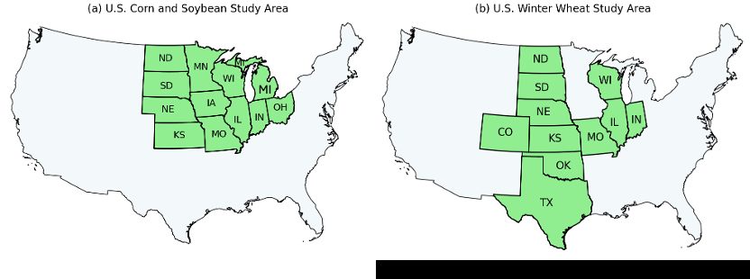

**Original caption:**
Figure 1 The study areas in the U.S., covering (a) 12 states in the U.S. Corn belt for corn and soybean, and

**中文图注:**
图1 美国研究区域，包括（a）美国玉米带12个州（玉米和大豆），以及（b）11个中西部州（冬小麦）。涉及的州包括科罗拉多（CO）、伊利诺伊（IL）、印第安纳（IN）、艾奥瓦（IA）、堪萨斯（KS）、密歇根（MI）、明尼苏达（MN）、密苏里（MO）、内布拉斯加（NE）、北达科他（ND）、俄克拉荷马（OK）、得克萨斯（TX）、南达科他（SD）和威斯康星（WI）。

**Reading note:** [请查看对应图片了解详细内容]

---

### Figure 2 An example of the 2023 time-series NDVI and the derived harmonic features for corn lands in

**Placed near:** p.8 F002
**Source:** p.8 F002

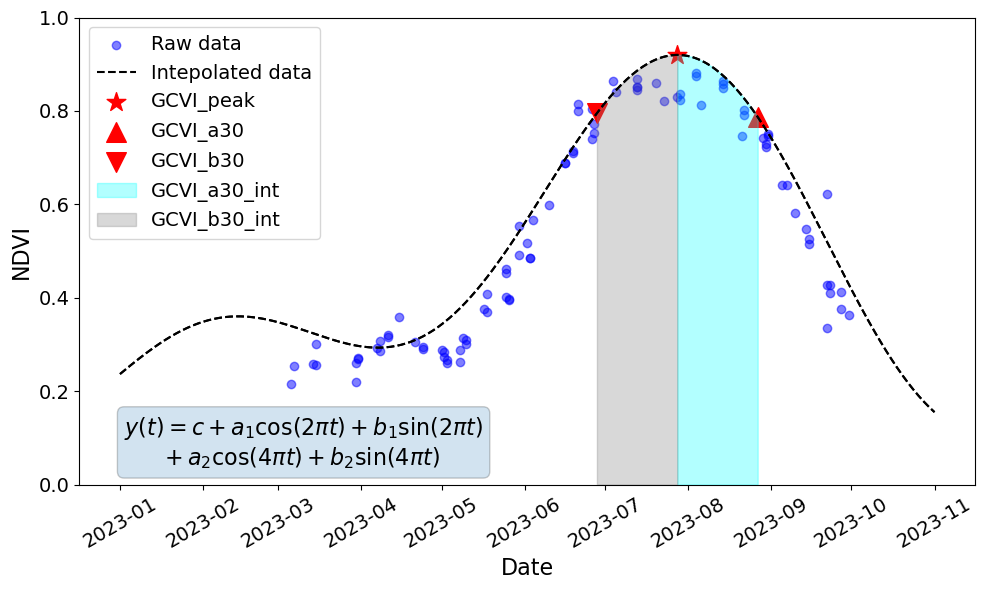

**Original caption:**
Figure 2 An example of the 2023 time-series NDVI and the derived harmonic features for corn lands in
Adams County, Illinois, USA.

**中文图注:**
图2 2023年美国伊利诺伊州亚当斯县玉米地时间序列NDVI及衍生谐波特征示例。
地点：美国伊利诺伊州亚当斯县。

**Reading note:** [请查看对应图片了解详细内容]

---

### Figure 3 The scatter plots of yield prediction results by XGB under the yearly CV in the U.S. for (a) Corn, (b) Soybean,

**Placed near:** p.12 F003
**Source:** p.12 F003

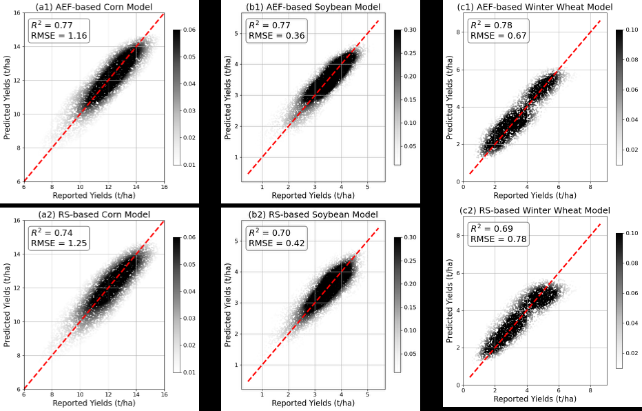

**Original caption:**
Figure 3 The scatter plots of yield prediction results by XGB under the yearly CV in the U.S. for (a) Corn, (b) Soybean,

**中文图注:**
图3 XGB在美国年度CV下2017-2024年（a）玉米、（b）大豆和（c）冬小麦产量预测结果的散点图。

**Reading note:** [请查看对应图片了解详细内容]

---

### Figure 4 The field-level tillage mapping model performance (accuracy, F1-0, F1-1, and F1-weighted) under the

**Placed near:** p.14 F004
**Source:** p.14 F004

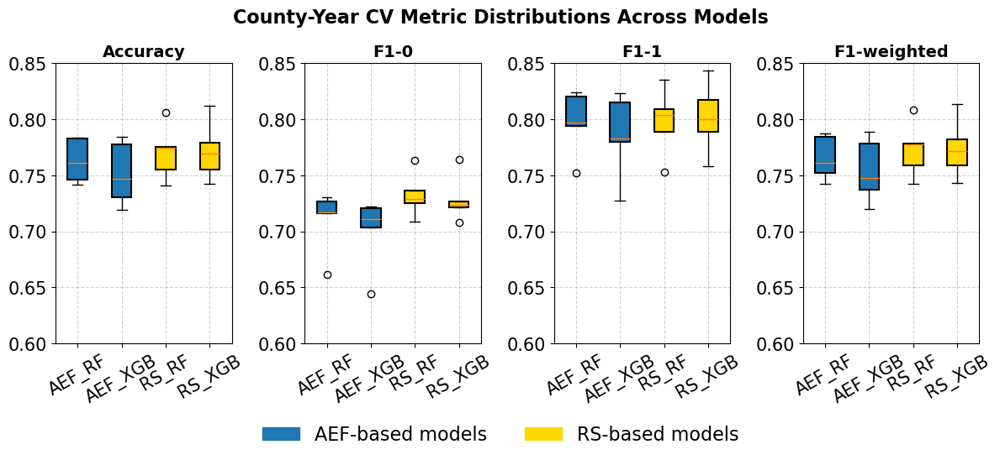

**Original caption:**
Figure 4 The field-level tillage mapping model performance (accuracy, F1-0, F1-1, and F1-weighted) under the

**中文图注:**
图4 County-Year CV方案下field尺度耕作制图模型性能（精度、F1-0、F1-1和F1-weighted）。每个实验重复五次，每个箱线图包含所有迭代的分数。

**Reading note:** [请查看对应图片了解详细内容]

---

### Figure 5 The field-level tillage mapping model performance (accuracy, F1-0, F1-1, and F1-weighted) under the yearly

**Placed near:** p.14 F005
**Source:** p.14 F005

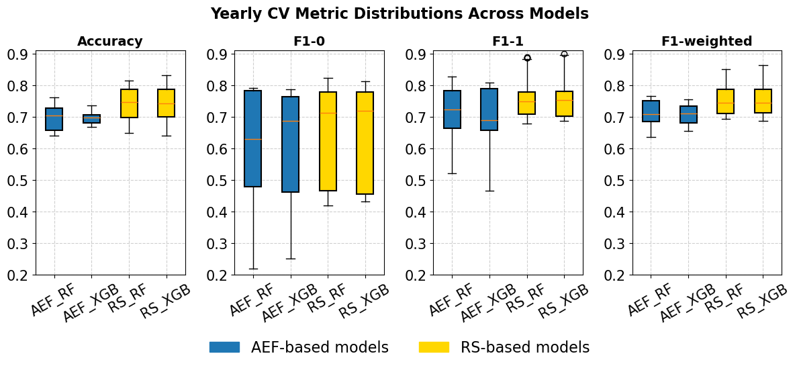

**Original caption:**
Figure 5 The field-level tillage mapping model performance (accuracy, F1-0, F1-1, and F1-weighted) under the yearly

**中文图注:**
图5 年度CV方案下field尺度耕作制图模型性能（精度、F1-0、F1-1和F1-weighted）。每个实验重复五次，每个箱线图包含所有迭代的分数。

**Reading note:** [请查看对应图片了解详细内容]

---

### Figure 6 The field-level cover crop mapping model performance (accuracy, F1-0, F1-1, and F1-weighted) under the

**Placed near:** p.15 F006
**Source:** p.15 F006

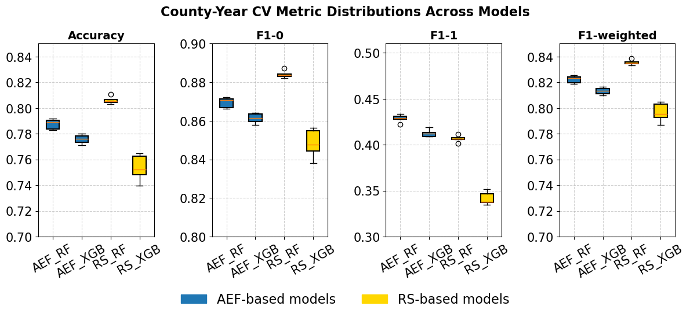

**Original caption:**
Figure 6 The field-level cover crop mapping model performance (accuracy, F1-0, F1-1, and F1-weighted) under the

**中文图注:**
图6 County-Year CV方案下field尺度覆盖作物制图模型性能（精度、F1-0、F1-1和F1-weighted）。每个实验重复五次，每个箱线图包含所有迭代的分数。

**Reading note:** [请查看对应图片了解详细内容]

---

### Figure 7 The field-level cover crop mapping model performance (accuracy, F1-0, F1-1, and F1-weighted) under the

**Placed near:** p.16 F007
**Source:** p.16 F007

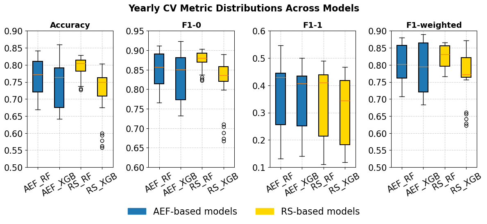

**Original caption:**
Figure 7 The field-level cover crop mapping model performance (accuracy, F1-0, F1-1, and F1-weighted) under the

**中文图注:**
图7 年度CV方案下field尺度覆盖作物制图模型性能（精度、F1-0、F1-1和F1-weighted）。每个实验重复五次，每个箱线图包含所有迭代的分数。

**Reading note:** [请查看对应图片了解详细内容]

---

### Figure 8 The t-SNE plots of the crop-specific AEF embeddings at the county level in the Eastern Temperate

**Placed near:** p.18 F008
**Source:** p.18 F008

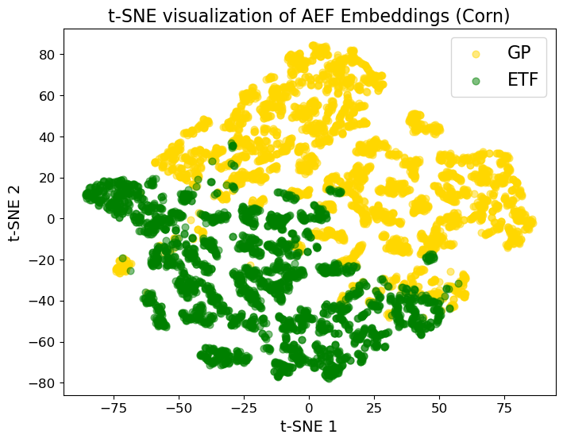

**Original caption:**
Figure 8 The t-SNE plots of the crop-specific AEF embeddings at the county level in the Eastern Temperate

**中文图注:**
图8 美国玉米带东部温带森林（ETF）和大平原（GP）县级作物特异性AEF嵌入的t-SNE图。

**Reading note:** [请查看对应图片了解详细内容]

---

### Figure 9 The Top 10 important features in (a) FM-based RF models and (b) RS-based RF models for county-level

**Placed near:** p.20 F009
**Source:** p.20 F009

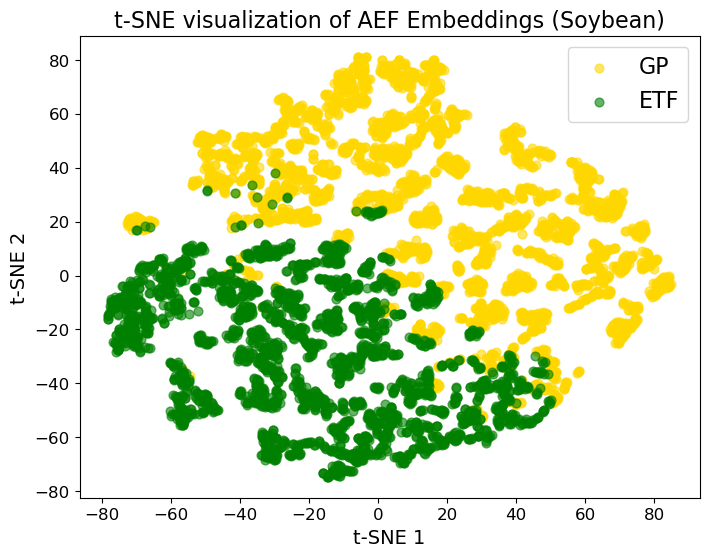

**Sub-figures:**

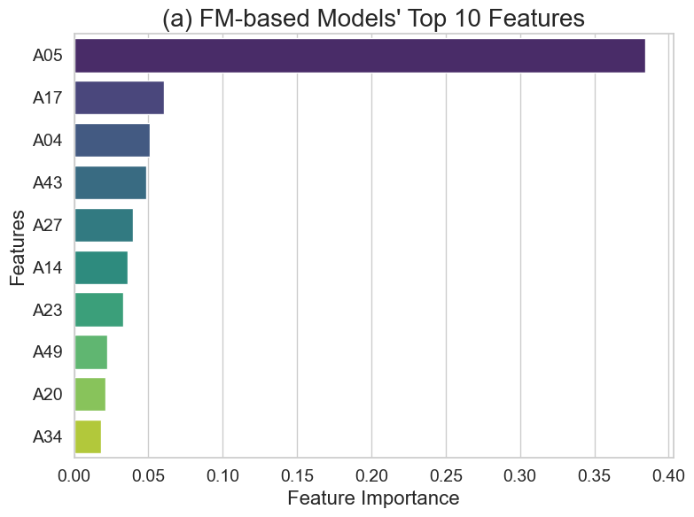
*Figure 9(a) FM-based Models' Top 10 Features*

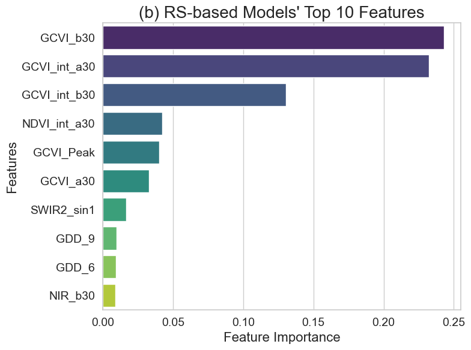
*Figure 9(b) RS-based Models' Top 10 Features*

**Original caption:**
Figure 9 The Top 10 important features in (a) FM-based RF models and (b) RS-based RF models for county-level

**中文图注:**
图9 （a）FM基础RF模型和（b）RS基础RF模型中县级玉米产量预测的前10个重要特征。

**Reading note:** [请查看对应图片了解详细内容]

---

### Figure S1. The average number of Landsat observation per month for fields in the Corteva cover crop

**Placed near:** p.25 F010
**Source:** p.25 F010

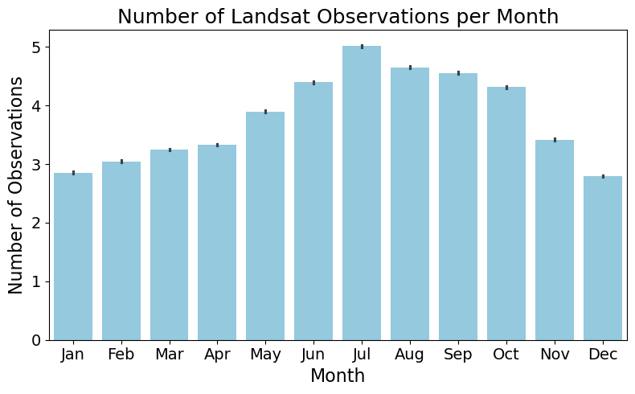

**Original caption:**
Figure S1. The average number of Landsat observation per month for fields in the Corteva cover crop
dataset. There are fewer observations during winter and early spring, leading to more noise in the feature
set for cover crop mapping.
25

**中文图注:**
图S1 Corteva覆盖作物数据集中field的Landsat月均观测数量。冬季和早春观测较少，导致覆盖作物制图特征集中的噪声更多。

**Reading note:** [请查看对应图片了解详细内容]

---
