# AlphaEarth Foundations: Geospatial Foundation Models for Earth Observation

## AlphaEarth Foundations: 用于地球观测的地理空间基础模型

**论文类型**: 预印本 / 基础模型研究  
**总页数**: 63页  
**主要论文**: Page 1-11  
**参考文献**: Page 12-18  
**补充材料**: Page 19-63  
**处理状态**: 主要论文与关键补充材料已完成翻译，部分补充图表标记为 [PENDING]

---

## Page Index（页码索引）

| 页码 | 内容类型 | 说明 |
|------|---------|------|
| 1 | Text | 标题、作者、摘要 |
| 2 | Figure | Figure 1 — Embedding fields范式总览 |
| 3 | Text | 引言续、方法概述 |
| 4 | Text | 方法概述续 |
| 5 | Figure | Figure 2 — 网络架构框图 |
| 6 | Text | 评估方法、基线对比 |
| 7 | Table + Text | Table 1 — 评估数据集概览 + 方法细节 |
| 8 | Figure | Figure 3 — 定量与定性结果 |
| 9 | Text | 结果分析、训练数据描述 |
| 10 | Figure | Figure 4 — 缩放效应分析 |
| 11 | Text | 结论 |
| 12 | Text | 作者贡献、致谢、声明 |
| 13-18 | Text | 参考文献 |
| 19-63 | Supplementary | 补充材料：数据集细节、额外实验、补充图表 |

---

## Page 1

**[S002]**

**Original:**
AlphaEarth Foundations: An embedding field model for accurate and efficient global mapping from sparse label data Christopher F. Brown*,1 , Michal R. Kazmierski*,1 , Valerie J. Pasquarella*,2 , William J. Rucklidge2 , Masha Samsikova1 , Chenhui Zhang1 , Evan Shelhamer1 , Estefania Lahera2 , Olivia Wiles1 , Simon Ilyushchenko2 , Noel Gorelick2 , Lihui Lydia Zhang1 , Sophia Alj1 , Emily Schechter2 , Sean Askay2 , Oliver Guinan2 , Rebecca Moore2 , Alexis Boukouvalas1 and Pushmeet Kohli1 * Equal contributions, 1 Google DeepMind, 2 Google

**中文:**
AlphaEarth Foundations: An 嵌入场 model for accurate and efficient global mapping from sparse label data Christopher F. Brown*,1 , Michal R. Kazmierski*,1 , Valerie J. Pasquarella*,2 , William J. Rucklidge2 , Masha Samsikova1 , Chenhui Zhang1 , Evan Shelhamer1 , Estefania Lahera2 , Olivia Wiles1 , Simon Ilyushchenko2 , Noel Gorelick2 , Lihui Lydia Zhang1 , Sophia Alj1 , Emily Schechter2 , Sean Askay2 , Oliver Guinan2 , Rebecca Moore2 , Alexis Boukouvalas1 and Pushmeet Kohli1 * Equal contributions, 1 Google DeepMind, 2 Google

**[S003]**

**Original:**
Unprecedented volumes of Earth observation data are continually collected around the world, but high-

**中文:**
Unprecedented volumes of 地球观测 data are continually collected around the world, but high-

**[S004]**

**Original:**
quality labels remain scarce given the effort required to make physical measurements and observations. This has led to considerable investment in bespoke modeling efforts translating sparse labels into maps. Here we introduce AlphaEarth Foundations, an embedding field model yielding a highly general, geospatial representation that assimilates spatial, temporal, and measurement contexts across multiple sources, enabling accurate and efficient production of maps and monitoring systems from local to global scales. The embeddings generated by AlphaEarth Foundations are the only to consistently outperform a suite of other well-known/widely accepted featurization approaches tested on a diverse set of mapping evaluations without re-training. We have released a dataset of global, annual, analysis-ready embedding field layers from 2017 through 2024.

**中文:**
quality labels remain scarce given the effort required to make physical measurements and observations. This has led to considerable investment in bespoke modeling efforts translating sparse labels into maps. Here we introduce AlphaEarth Foundations, an 嵌入场 model yielding a highly general, 地理空间 representation that assimilates spatial, 时序, and measurement contexts across multiple sources, enabling accurate and efficient production of maps and monitoring systems from local to global scales. The embeddings generated by AlphaEarth Foundations are the only to consistently outperform a suite of other well-known/widely accepted featurization approaches tested on a diverse set of mapping evaluations without re-训练. We have released a 数据集 of global, annual, analysis-ready 嵌入场 layers from 2017 through 2024.

**[S005]**

**Original:**
Introduction                                                 embedding model that solves fundamental challenges in the institution of mapping through the Management of global food supplies, public                   generation of a universal feature space. The feahealth, and disaster response all start from maps            tures produced by our model consistently achieve that geographically anchor questions like "which             top performance in all application domains tested forests pose an unacceptable wildfire risk?" or              when compared to other general and even do- "where are soybeans grown?". The launch of                   main specific approaches (Figure 1A). This marks the first Landsat satellite in 1972 marked the               a shift from the previous state-of-the-art for which dawn of an era where spaceborne monitoring                   no single approach was dominant. could serve the interests of global environmental policy-making and provide critical insights into our changing planet (Cohen and Goward,                  From sparse labels to maps 2004). Over the following decades Earth observation (EO) data became widely available, and                High-quality maps depend on high-quality lastreams from both historic and modern EO inbeled data, yet when working at global scales, struments are now routinely used to create maps              a balance must be struck between measurement that answer questions about the past, present,               precision and spatial coverage. Many global mapand future of Earth’s ecosystems and climate                 ping efforts focus on individual ecosystems like (Wulder et al., 2022). Nonetheless, advanceforests (Hansen et al., 2013), water (Pekel et al., ments in deriving planetary-scale insights from              2016), tidal wetlands (Murray et al., 2022a) or petabytes of satellite imagery and other environother broad legends, e.g., (Brown et al., 2022; mental datasets remain hamstrung by the relative             Zanaga et al., 2022). This simplifies the label scarcity of ground-based measurements and ancollection process, allowing trained interpreters notations, and a new problem: the overwhelming               to collect larger volumes at scale at the expense volume of geospatial data (Tuia et al., 2024). In            of descriptive power for certain use cases. In the this work, we introduce a foundational geospatial            cases where high-quality annotations and/or field

**中文:**
Introduction embedding model that solves fundamental challenges in the institution of mapping through the Management of global food supplies, public generation of a universal feature space. The feahealth, and disaster response all start from maps tures produced by our model consistently achieve that geographically anchor questions like "which top performance in all application domains tested forests pose an unacceptable wildfire risk?" or when compared to other general and even do- "where are soybeans grown?". The launch of main specific approaches (Figure 1A). This marks the first Landsat satellite in 1972 marked the a shift from the previous state-of-the-art for which dawn of an era where spaceborne monitoring no single approach was dominant. could serve the interests of global environmental policy-making and provide critical insights into our changing planet (Cohen and Goward, From sparse labels to maps 2004). Over the following decades 地球观测 (EO) data became widely available, and High-quality maps depend on high-quality lastreams from both historic and modern EO inbeled data, yet when working at global scales, struments are now routinely used to create maps a balance must be struck between measurement that answer questions about the past, present, precision and spatial coverage. Many global mapand future of Earth’s ecosystems and climate ping efforts focus on individual ecosystems like (Wulder et al., 2022). Nonetheless, advanceforests (Hansen et al., 2013), water (Pekel et al., ments in deriving planetary-scale insights from 2016), tidal wetlands (Murray et al., 2022a) or petabytes of satellite imagery and other environother broad legends, e.g., (Brown et al., 2022; mental datasets remain hamstrung by the relative Zanaga et al., 2022). This simplifies the label scarcity of ground-based measurements and ancollection process, allowing trained interpreters notations, and a new problem: the overwhelming to collect larger volumes at scale at the expense volume of 地理空间 data (Tuia et al., 2024). In of descriptive power for certain use cases. In the this work, we introduce a foundational 地理空间 cases where high-quality annotations and/or field

---

## Page 2

**[F001] Figure 1**

**Original:**
> Figure 1 | Embedding fields paradigm. (A) Error ratios across evaluations from the next-best

**中文:**
> Figure 1 | 嵌入场 paradigm. (A) Error ratios across evaluations from the next-best

**[S007]**

**Original:**
model/dataset to AlphaEarth Foundations (AEF). Classification errors (bars marked with *) are measured in Balanced Error Rate kappa (BER𝜅), and regression errors are measured in MAE−1 (bars marked with †). The pair of numbers on each bar indicate balanced accuracy (BA) for classification tasks and MAE for regression tasks, with AEF on top and the next-best model/dataset below. Best-case performance was selected independently for both the next-best model/dataset and for AEF by selecting the most performant method of transfer (kNN k=1, kNN k=3, linear) for each evaluation. For each

**中文:**
model/数据集 to AlphaEarth Foundations (AEF). 分类 errors (bars marked with *) are measured in Balanced Error Rate kappa（集中度参数） (BER𝜅), and 回归 errors are measured in MAE（平均绝对误差）−1 (bars marked with †). The pair of numbers on each bar indicate balanced 准确率 (BA) for 分类 tasks and MAE（平均绝对误差） for 回归 tasks, with AEF on top and the next-best model/数据集 below. Best-case performance was selected independently for both the next-best model/数据集 and for AEF by selecting the most performant method of transfer (kNN k=1, kNN k=3, linear) for each 评估. For each

---

## Page 3

**[S008]**

**Original:**
evaluation shown, all available training data or the "max-trial" was used. Error bars indicate the 1𝜎 best and worst case ratio or ∼90% confidence interval by bootstrapping and k-folds when possible. Evaluations are sorted by increasing mean error ratio. The dashed line represents a ratio of 1 with higher values indicating AEF outperforming the next best solution. (B) AEF reconciles multiple sparse, non-uniformly sampled observation records into a continuous record, regardless of fluctuations in availability. AEF "embedding fields" are a result of static temporal summaries drawn over a conditional "valid period" that need not fully intersect the "support period", where the latter defines the temporal range of the input data. Multiple raster and scalar measurement sources are modeled as sources or targets by AEF. These may be any combination of temporally, geographically, and spatially sparse. In the example shown here, NLCD is not present, and GEDI is available in only a sparse fraction of the spatial context. (C) A view of our global embedding field for the year 2023, note apparent climatic gradients at large scales. (D) AEF produces highly resolved features at 10m2 , shown here plotting arbitrary axes in Oaxaca, Mexico. (E) A stack of 64 rasterized AEF layers forms an embedding field, and each individual vector maps to a coordinate on the unit sphere 𝑆63 .

**中文:**
评估 shown, all available 训练 data or the "max-trial" was used. Error bars indicate the 1𝜎 best and worst case ratio or ∼90% confidence interval by bootstrapping and k-folds when possible. Evaluations are sorted by increasing mean error ratio. The dashed line represents a ratio of 1 with higher values indicating AEF outperforming the next best solution. (B) AEF reconciles multiple sparse, non-uniformly sampled observation records into a continuous record, regardless of fluctuations in availability. AEF "嵌入场" are a result of static 时序 summaries drawn over a conditional "valid period" that need not fully intersect the "support period", where the latter defines the 时序 range of the input data. Multiple raster and scalar measurement sources are modeled as sources or targets by AEF. These may be any combination of temporally, geographically, and spatially sparse. In the example shown here, NLCD（美国国家土地覆盖数据库） is not present, and GEDI（全球生态系统动态调查） is available in only a sparse fraction of the spatial context. (C) A view of our global 嵌入场 for the year 2023, note apparent climatic gradients at large scales. (D) AEF produces highly resolved features at 10m2 , shown here plotting arbitrary axes in Oaxaca, Mexico. (E) A stack of 64 rasterized AEF layers forms an 嵌入场, and each individual vector maps to a coordinate on the unit sphere 𝑆63 .

**[S009]**

**Original:**
measurements are available, systematic covcan be roughly characterized as derivatives of erage is usually much more localized, e.g.,                      SatMAE (Cong et al., 2022) or implicit models (d’Andrimont et al., 2020; Lister et al., 2020; Nagy             such as SatCLIP (Klemmer et al., 2025). While et al., 2021). Accurate and efficient scaling of                 these approaches represent progress in the apsuch highly-detailed yet spatially and temporally                plication of ML to EO data, none satisfy all of sparse data remains an open challenge, e.g., (Sun                the following key properties: (1) multi-source et al., 2021).                                                   or multi-modality, (2) inclusion of time into the modeling framework, or (3) spatial resolution at a A natural approach to better leveraging sparse precision useful for serving operational mapping observations is to isolate the relevant informause cases. Critically, as we will show, existing tion content of the feature space used to generlearned featurization approaches don’t always ate maps. Designed EO features like vegetation outperform designed featurization methods in indices (Zeng et al., 2022), best-available-pixel scarce data regimes. composites (White et al., 2014), 1D harmonics (Wilson et al., 2018; Zhu and Woodcock, 2014), and kernel-based filters (Haralick et al., 1973; Lee et al., 2017) power many of the map data AlphaEarth Foundations products used for policy making, e.g., (Brown                    AlphaEarth Foundations (AEF) is the only learned et al., 2020; Wulder et al., 2024; Zanaga et al.,                EO featurization approach to outperform a repre- 2022). When heuristics are carefully chosen,                     sentative sample of featurization methods tested they can offer an efficient mechanism for geacross a broad set of sparse data domains (Figographically extrapolating labels and measureure 1A), reducing error magnitudes by ∼23.9% ments. However, designed features are often                      (∼1.4x error magnitude reduction) on average noisy, sensor-dependent, and highly regionand                  while maintaining a best-in-class 10-meter spaapplication-specific, compounding the challenges                 tial resolution that requires 16x less information inherent to working with satellite imagery and                   per-representation (64 bytes) compared to the other planetary-scale datasets.                                  next-most compact learned method. We achieve Machine learning has revolutionized fields                    this leap in performance across challenging mapfrom biochemistry to natural language underping applications through a number of innovastanding. Unsurprisingly, combining disparate                    tions; namely, we employ an adaptive decoding EO sources through the use of machine learnscheme that considers time and sensor parameing has become an active area of research (Rolf                  ters as continuous variables in an implicit decoder et al., 2024; Zhu et al., 2017). A new generawith associated losses, a spatially dense infortion of geospatial foundation model approaches                   mation time-bottleneck, time-conditional summarization, and spatially-precise alignment with geo-

**中文:**
measurements are available, systematic covcan be roughly characterized as derivatives of erage is usually much more localized, e.g., SatMAE (Cong et al., 2022) or implicit models (d’Andrimont et al., 2020; Lister et al., 2020; Nagy such as SatCLIP (Klemmer et al., 2025). While et al., 2021). Accurate and efficient scaling of these approaches represent progress in the apsuch highly-detailed yet spatially and temporally plication of ML to EO data, none satisfy all of sparse data remains an open challenge, e.g., (Sun the following key properties: (1) multi-source et al., 2021). or multi-modality, (2) inclusion of time into the modeling framework, or (3) 空间分辨率 at a A natural approach to better leveraging sparse precision useful for serving operational mapping observations is to isolate the relevant informause cases. Critically, as we will show, existing tion content of the feature space used to generlearned featurization approaches don’t always ate maps. Designed EO features like vegetation outperform designed featurization methods in indices (Zeng et al., 2022), best-available-像素 scarce data regimes. composites (White et al., 2014), 1D harmonics (Wilson et al., 2018; Zhu and Woodcock, 2014), and kernel-based filters (Haralick et al., 1973; Lee et al., 2017) power many of the map data AlphaEarth Foundations products used for policy making, e.g., (Brown AlphaEarth Foundations (AEF) is the only learned et al., 2020; Wulder et al., 2024; Zanaga et al., EO featurization approach to outperform a repre- 2022). When heuristics are carefully chosen, sentative sample of featurization methods tested they can offer an efficient mechanism for geacross a broad set of sparse data domains (Figographically extrapolating labels and measureure 1A), reducing error magnitudes by ∼23.9% ments. However, designed features are often (∼1.4x error magnitude reduction) on average noisy, sensor-dependent, and highly regionand while maintaining a best-in-class 10-meter spaapplication-specific, compounding the challenges tial resolution that requires 16x less information inherent to working with satellite imagery and per-representation (64 bytes) compared to the other planetary-scale datasets. next-most compact learned method. We achieve Machine learning has revolutionized fields this leap in performance across challenging mapfrom biochemistry to natural language underping applications through a number of innovastanding. Unsurprisingly, combining disparate tions; namely, we employ an adaptive decoding EO sources through the use of machine learnscheme that considers time and sensor parameing has become an active area of research (Rolf ters as continuous variables in an implicit 解码器 et al., 2024; Zhu et al., 2017). A new generawith associated losses, a spatially dense infortion of 地理空间 基础模型 approaches mation time-瓶颈层, time-conditional summarization, and spatially-precise alignment with geo-

---

## Page 4

**[S010]**

**Original:**
tagged text from Wikipedia articles joined with                   neous operators interleaved with spatial pyramid locations from Global Biodiversity Information                    "exchanges" (Figure 2D) inspired by Wang et al. Facility (GBIF) species occurrence records. To                    (2020) but more efficiently utilizing learned rethe best of our knowledge, AEF is the first EO feasampling stages. Given a square input of 𝐿 pix- 1 turization approach to support continuous time                    els a side, each block consists of a 16   𝐿 "space" (Figure 1B; see supplemental materials S2.2.1).                   operator following ViT-like spatial self-attention Additionally we introduce a challenging evalu-                    (Dosovitskiy et al., 2020), a 18 𝐿 “time” operator ation suite composed of high-quality reference                    utilizing time-axial self-attention, and a 12 𝐿 "predata that attempts to faithfully replicate realiscision" operator utilizing 3x3 convolutions. Each tic mapping scenarios. We make our annualized                     sequence element in the “time” operator is conplanet-scale feature maps or "embedding field"                    ditioned on the associated input timestamp (𝑡 𝑗 ) layers (Figure 1C-D) and evaluation suite availafter conversion to a sinusoidal timecode. STP able under an open license to encourage further                   blocks terminate with learned Laplacian pyramid exploration and use.                                              rescaling, such that each operator can pass its state to each of the operators in the subsequent AEF is designed to accept 𝑁𝑖 frames for 𝑖 ∈ 𝑀𝐸 block. STP itself terminates with a final learned input (encoded) data sources with 𝐶 𝑖 channels spatial resampling to the resolution of the "preciresampled to the same spatial resolution, and a                                            Í sion" operator. Thus for 𝑁𝑖 inputs, STP produces millisecond epoch timestamp 𝑡 𝑗 , 1 ≤ 𝑗 ≤ Σ𝑁𝑖 (Fig- 𝑁𝑖 output feature maps at 12 𝐿 pixels resolution. Í ure 2A). The range of the input timestamps we Initial down-scaling to 12 𝐿 is performed in the refer to as the “support period”. For the purposes input projectors marked with an "H" in Figure of learning or at inference time, we support a pair 2A. of conditioning timestamps or “valid period” 𝑡𝑠 , 𝑡𝑒 where 𝑡𝑠 < 𝑡𝑒 provides a temporal summary of the                     We train a trio of neural network models that Earth’s surface and climatic activity over [ 𝑡𝑠 , 𝑡𝑒 ),           work in tandem: a teacher video embedding even when there is no 𝑡 𝑗 for which 𝑡𝑠 ≤ 𝑡 𝑗 < 𝑡𝑒 (inmodel with implicit decoders, a student video terpolation), or when 𝑡𝑒 ≤ 𝑡 𝑗 , ∀ 𝑗 ∈ {1, 2, ..., Σ𝑁𝑖 }          embedding model sharing the same parameters or 𝑡𝑠 > 𝑡 𝑗 , ∀ 𝑗 ∈ {1, 2, ..., Σ𝑁𝑖 } (extrapolation).            and architecture as the teacher, and a text alignThese summaries or “embeddings” are 64 bytes                      ment model (Figure 2E). We trained ∼1B and in size, and each embedding contains informa-                     ∼480M parameter variants of AEF, and ultimately tion that reproduces the temporal trajectory of                   proceeded with the smaller variant for improved variables listed in Table S1 over the summary peinference efficiency. We discuss the training set, riod (Figure 2B) using conditional metadata from                  model training, and architecture in greater deeach source (see supplemental materials S2.2.1).                  tail in supplemental materials S2. The results of By explicitly separating the input intervals from                 running inference at scale are “embedding fields” those used for the temporal summary, we can aptiling Earth’s terrestrial surface in approximate ply AEF to time dependent problems requiring a                    10m2 grids (Figure 2E). precise date range without fine-tuning. Embeddings are further constrained to distribute uniformly in 𝑆63 using a so-called “batch uniformity”                Evaluation in realistic data-scarce sceobjective (Figure 2C; see supplemental materials narios S2.2.4). Our video summarization architecture must                      To establish the performance of AEF relative simultaneously maintain highly localized repreto other learned and designed representations, sentations as well as model long distance relawe required an evaluation dataset that included tionships through time and space in a computaarchetypal examples of realistic mapping applicationally efficient way; for this we’ve designed an                tions. These include thematic mapping, biophysiencoder termed Space Time Precision or “STP”                      cal variable estimation, and change detection at that consists of repeated blocks of three simultaannual and sub-annual cadences. We found most if not all datasets in existing geospatial bench-

**中文:**
tagged text from Wikipedia articles joined with neous operators interleaved with spatial pyramid locations from Global Biodiversity Information "exchanges" (Figure 2D) inspired by Wang et al. Facility (GBIF（全球生物多样性信息网络）) species occurrence records. To (2020) but more efficiently utilizing learned rethe best of our knowledge, AEF is the first EO feasampling stages. Given a square input of 𝐿 pix- 1 turization approach to support continuous time els a side, each block consists of a 16 𝐿 "space" (Figure 1B; see supplemental materials S2.2.1). operator following ViT-like spatial self-注意力机制 Additionally we introduce a challenging evalu- (Dosovitskiy et al., 2020), a 18 𝐿 “time” operator ation suite composed of high-quality reference utilizing time-axial self-注意力机制, and a 12 𝐿 "predata that attempts to faithfully replicate realiscision" operator utilizing 3x3 convolutions. Each tic mapping scenarios. We make our annualized 序列 element in the “time” operator is conplanet-scale feature maps or "嵌入场" ditioned on the associated input timestamp (𝑡 𝑗 ) layers (Figure 1C-D) and 评估 suite availafter conversion to a sinusoidal 时间码. STP able under an open license to encourage further blocks terminate with learned Laplacian pyramid exploration and use. rescaling, such that each operator can pass its state to each of the operators in the subsequent AEF is designed to accept 𝑁𝑖 frames for 𝑖 ∈ 𝑀𝐸 block. STP itself terminates with a final learned input (encoded) data sources with 𝐶 𝑖 channels spatial resampling to the resolution of the "preciresampled to the same 空间分辨率, and a Í sion" operator. Thus for 𝑁𝑖 inputs, STP produces millisecond 轮次 timestamp 𝑡 𝑗 , 1 ≤ 𝑗 ≤ Σ𝑁𝑖 (Fig- 𝑁𝑖 output feature maps at 12 𝐿 pixels resolution. Í ure 2A). The range of the input timestamps we Initial down-scaling to 12 𝐿 is performed in the refer to as the “support period”. For the purposes input projectors marked with an "H" in Figure of learning or at 推理 time, we support a pair 2A. of conditioning timestamps or “valid period” 𝑡𝑠 , 𝑡𝑒 where 𝑡𝑠 < 𝑡𝑒 provides a 时序 summary of the We train a trio of neural network models that Earth’s surface and climatic activity over [ 𝑡𝑠 , 𝑡𝑒 ), work in tandem: a teacher 视频（时序图像序列） embedding even when there is no 𝑡 𝑗 for which 𝑡𝑠 ≤ 𝑡 𝑗 < 𝑡𝑒 (inmodel with implicit decoders, a student 视频（时序图像序列） terpolation), or when 𝑡𝑒 ≤ 𝑡 𝑗 , ∀ 𝑗 ∈ {1, 2, ..., Σ𝑁𝑖 } embedding model sharing the same parameters or 𝑡𝑠 > 𝑡 𝑗 , ∀ 𝑗 ∈ {1, 2, ..., Σ𝑁𝑖 } (extrapolation). and architecture as the teacher, and a text alignThese summaries or “embeddings” are 64 bytes ment model (Figure 2E). We trained ∼1B and in size, and each embedding contains informa- ∼480M parameter variants of AEF, and ultimately tion that reproduces the 时序 trajectory of proceeded with the smaller variant for improved variables listed in Table S1 over the summary peinference efficiency. We discuss the 训练 set, riod (Figure 2B) using conditional metadata from model 训练, and architecture in greater deeach source (see supplemental materials S2.2.1). tail in supplemental materials S2. The results of By explicitly separating the input intervals from running 推理 at scale are “嵌入场” those used for the 时序 summary, we can aptiling Earth’s terrestrial surface in approximate ply AEF to time dependent problems requiring a 10m2 grids (Figure 2E). precise date range without 微调. Embeddings are further constrained to distribute uniformly in 𝑆63 using a so-called “批次 uniformity” 评估 in realistic data-scarce sceobjective (Figure 2C; see supplemental materials narios S2.2.4). Our 视频（时序图像序列） summarization architecture must To establish the performance of AEF relative simultaneously maintain highly localized repreto other learned and designed representations, sentations as well as model long distance relawe required an 评估 数据集 that included tionships through time and space in a computaarchetypal examples of realistic mapping applicationally efficient way; for this we’ve designed an tions. These include thematic mapping, biophysiencoder termed Space Time Precision or “STP” cal variable estimation, and 变化检测 at that consists of repeated blocks of three simultaannual and sub-annual cadences. We found most if not all datasets in existing 地理空间 bench-

---

## Page 5

**[F002] Figure 2**

**Original:**
> Figure 2 | AlphaEarth Foundations. (A) Block diagram of the overall network architecture used

**中文:**
> Figure 2 | AlphaEarth Foundations. (A) Block diagram of the overall network architecture used

**[S012]**

**Original:**
for video analysis. Preprocessing converts raw observation data via normalization using global statistics, and acquisition timestamps are converted to sinusoidal timecodes. Individual source encoders transform inputs to the same latent space before entering the bulk of the model. Outputs are summarized using conditional timecodes or "summary periods", unique to each decoded source and contrastive learning task. 𝜇 refers to the embedding outputs of the model. The grey shaded region constitutes the model. (B) Model outputs are treated as the mean direction of a von Mises-Fisher distribution, and decoding proceeds by sampling this distribution, and concatenating it with sensor geometry metadata and a timecode indicating the relative position in the valid period to decode. Decoding proceeds for all sources, with losses dependent on the characteristics of each source (see supplemental materials S1). (C) To prevent collapse and improve performance, embeddings are compared to equivalent batch-rotated embeddings using a dot product. The absolute value of this quantity is minimized as a necessary condition for an empirically uniform distribution in 𝑆63 . (D) Block diagram of the model bulk, consisting of simultaneous pathways at different resolutions to maintain efficiency and spatial precision. (E) Contrastive learning between the video teacher and student model, and text encoder. (F) Complete 360° view of 2023 annual embedding field covering Earth’s land surface including minor islands over approximately ± 82°.

**中文:**
for 视频（时序图像序列） analysis. Preprocessing converts raw observation data via 归一化 using global statistics, and acquisition timestamps are converted to sinusoidal timecodes. Individual source encoders transform inputs to the same latent space before entering the bulk of the model. Outputs are summarized using conditional timecodes or "summary periods", unique to each decoded source and contrastive learning task. 𝜇 refers to the embedding outputs of the model. The grey shaded region constitutes the model. (B) Model outputs are treated as the mean direction of a von Mises-Fisher distribution, and decoding proceeds by sampling this distribution, and concatenating it with sensor geometry metadata and a 时间码 indicating the relative position in the valid period to decode. Decoding proceeds for all sources, with losses dependent on the characteristics of each source (see supplemental materials S1). (C) To prevent collapse and improve performance, embeddings are compared to equivalent 批次-rotated embeddings using a dot product. The absolute value of this quantity is minimized as a necessary condition for an empirically uniform distribution in 𝑆63 . (D) Block diagram of the model bulk, consisting of simultaneous pathways at different resolutions to maintain efficiency and spatial precision. (E) Contrastive learning between the 视频（时序图像序列） teacher and student model, and text 编码器. (F) Complete 360° view of 2023 annual 嵌入场 covering Earth’s land surface including minor islands over approximately ± 82°.

---

## Page 6

**[S013]**

**Original:**
mark suites provide annotations at an objector                 and three learned featurization approaches: Satimage-level rather than pixel-level, rely on laCLIP (Klemmer et al., 2025), Prithvi (Jakubik bels sampled from existing (machine-generated)                   et al., 2023b), and Clay (Clay, 2024). We also datasets, require running the benchmark analyinclude three controls: spatial coordinates (XY), sis using provided source imagery, have limited                  coordinates and elevation (XYZ), and a ViT (Vigeographic coverage, and/or do not provide sufsion Transformer) pre-trained on ImageNet (Deng ficient spatial precision or temporal information,               et al., 2009; Dosovitskiy et al., 2020). Where ape.g., (Bountos et al., 2023; Lacoste et al., 2023),              plicable, baselines were provided with identical limiting their value in assessing practical use.                 inputs to AEF and baseline hyperparameters were tuned to maximize performance on our evaluaTo address the need for high-quality labeled tion suite (see supplemental materials S5). datasets that can be used to simulate low-shot (i.e., tens to hundreds of samples) performance                     Our evaluations showed AEF consistently outin data-scarce regimes requiring precise map                     performs both designed and learned featurization outputs, we developed a set of 15 evaluations                    methods in all trial settings. AEF reduced error sourced from 11 openly available datasets. These                 magnitudes overall by ∼23.9% on average when datasets were selected to represent archetypal                   compared to the next-best approach and method classification, regression, and change detection                 of transfer in the max-trial setting (Figure 1A). use cases, with all datasets directly linked to realFor ten-shot trials, AEF reduced error magnitudes world products and applications, including land                  by ∼10.4% on average compared to the next-best use/land cover mapping and change detection,                     approach, and for one-shot trials AEF reduced ercrop type mapping at different hierarchies, tree                 ror magnitudes by ∼4.18%. We show quantitative genera and plantation classification, and estimatand qualitative results for select evaluations in ing evapotranspiration and emissivity at national                Figure 3 (and see supplemental materials S6 for to global scales (Table 1). For each evaluation                  full quantitative results). The next-best approach dataset, we selected a balanced number of trainvaries across evaluation dataset and method, ining samples from each class or equally-spaced                    dicating both non-uniform progress and that AEF partition, with the number of samples determined                 unlocks progress in historically challenging mapbased on the minimum class size (Table 1, Max                    ping scenarios. We discuss these results and the Trial Size) and the remainder of the dataset reeffect of scaling training data in further detail served for testing. We then assess performance                   below. across a suite of trials designed to test very-low shot training sizes with 𝑛 samples per class (𝑛 = 1, 10, max) via transferal methods with minimal paThematic mapping rameters: k-nearest neighbors, and linear layers Thematic mapping or "semantic segmentation" fit to the features (see supplemental materials refers to spatially-dense discrete classification S4). The “max-trial” scenario is meant to repreover an area. We group 11 classification evalsent more realistic sparse dataset sizes (hundreds uations into thematic mapping applications inas opposed to thousands or millions of points), cluding land use, land cover, crop detection, crop whereas the ten and one shot trials are meant to type, and species distribution mapping. These evaluate performance given extreme data sparclassification datasets vary in their number of sity. classes, complexity of semantics they represent, We used this set of evaluations to compare                    and their summary periods, i.e., instantaneous obAEF with a representative set of domain-specific                 servations versus persistence over a reference pebaselines specifically designed for Earth observariod (Table 1). Assessing max-trial performance tion applications, including three designed feain Figure 1A, we find that AEF achieves the greatturization approaches: CCDC (Gorelick et al.,                    est error reductions for evaluations over annual 2023; Zhu and Woodcock, 2014), MOSAIKS (Rolf                     periods: e.g., LCMAP land cover, Descals oil palm, et al., 2021), and composites (Qiu et al., 2023),                Africa crop mask, and LCMAP land use. Other

**中文:**
mark suites provide annotations at an objector and three learned featurization approaches: Satimage-level rather than 像素-level, rely on laCLIP (Klemmer et al., 2025), Prithvi (Jakubik bels sampled from existing (machine-generated) et al., 2023b), and Clay (Clay, 2024). We also datasets, require running the 基准测试 analyinclude three controls: spatial coordinates (XY), sis using provided source imagery, have limited coordinates and elevation (XYZ), and a ViT (Vigeographic coverage, and/or do not provide sufsion Transformer) pre-trained on ImageNet (Deng ficient spatial precision or 时序 information, et al., 2009; Dosovitskiy et al., 2020). Where ape.g., (Bountos et al., 2023; Lacoste et al., 2023), plicable, baselines were provided with identical limiting their value in assessing practical use. inputs to AEF and baseline hyperparameters were tuned to maximize performance on our evaluaTo address the need for high-quality labeled tion suite (see supplemental materials S5). datasets that can be used to simulate low-shot (i.e., tens to hundreds of samples) performance Our evaluations showed AEF consistently outin data-scarce regimes requiring precise map performs both designed and learned featurization outputs, we developed a set of 15 evaluations methods in all trial settings. AEF reduced error sourced from 11 openly available datasets. These magnitudes overall by ∼23.9% on average when datasets were selected to represent archetypal compared to the next-best approach and method 分类, 回归, and 变化检测 of transfer in the max-trial setting (Figure 1A). use cases, with all datasets directly linked to realFor ten-shot trials, AEF reduced error magnitudes world products and applications, including land by ∼10.4% on average compared to the next-best use/土地覆盖 mapping and 变化检测, approach, and for one-shot trials AEF reduced ercrop type mapping at different hierarchies, tree ror magnitudes by ∼4.18%. We show quantitative genera and plantation 分类, and estimatand qualitative results for select evaluations in ing evapotranspiration and emissivity at national Figure 3 (and see supplemental materials S6 for to global scales (Table 1). For each 评估 full quantitative results). The next-best approach 数据集, we selected a balanced number of trainvaries across 评估 数据集 and method, ining samples from each class or equally-spaced dicating both non-uniform progress and that AEF partition, with the number of samples determined unlocks progress in historically challenging mapbased on the minimum class size (Table 1, Max ping scenarios. We discuss these results and the Trial Size) and the remainder of the 数据集 reeffect of scaling 训练 data in further detail served for testing. We then assess performance below. across a suite of trials designed to test very-low shot 训练 sizes with 𝑛 samples per class (𝑛 = 1, 10, max) via transferal methods with minimal paThematic mapping rameters: k近邻, and linear layers Thematic mapping or "semantic 分割" fit to the features (see supplemental materials refers to spatially-dense discrete 分类 S4). The “max-trial” scenario is meant to repreover an area. We group 11 分类 evalsent more realistic sparse 数据集 sizes (hundreds uations into thematic mapping applications inas opposed to thousands or millions of points), cluding 土地利用, 土地覆盖, crop detection, crop whereas the ten and one shot trials are meant to type, and species distribution mapping. These evaluate performance given extreme data sparclassification datasets vary in their number of sity. classes, complexity of semantics they represent, We used this set of evaluations to compare and their summary periods, i.e., instantaneous obAEF with a representative set of domain-specific servations versus persistence over a reference pebaselines specifically designed for Earth observariod (Table 1). Assessing max-trial performance tion applications, including three designed feain Figure 1A, we find that AEF achieves the greatturization approaches: CCDC (Gorelick et al., est error reductions for evaluations over annual 2023; Zhu and Woodcock, 2014), MOSAIKS (Rolf periods: e.g., LCMAP 土地覆盖, Descals oil palm, et al., 2021), and composites (Qiu et al., 2023), Africa crop mask, and LCMAP 土地利用. Other

---

## Page 7

**[S014]**

**Original:**
Dataset Name                 Domain                  Evaluation         Geographic       Temporal        Max          Total type               Extent           Cadence         Trial        Sample Size (n)     Size (n) Land cover              classification     CONUS            Annual          300          26,510 LCMAP (Brown et al., (6 classes) 2020; Pengra et al., 2023)                        Land use                classification     CONUS            Annual          300          26,513 (6 classes) Land use change         change detecCONUS            Annual          150          991 tion (binary) Land cover change       change detecCONUS            Annual          300          2,320 tion (binary) LUCAS (d’Andrimont           Land cover              classification     Europe           Single-date     300          203,569 et al., 2020; Toth et al.,                           (15 classes) 2013) Land use                classification     Europe           Annual          300          226,858 (40 classes) GLaNCE (Stanimirova          Land cover              classification     Global           Annual          300          34,885 et al., 2023)                                        (11 classes) Africa    crop     mask      Crop type               classification     SubAnnual          200          2,556 (Kerner et al., 2024a,b)                             (4 classes)        Saharan Africa Fine crop type          classification     Canada           Single-date     75           14,566 Canada crops (24 classes) (Agriculture and Canada, 2024)                Coarse crop type        classification     Canada                           68           16,079 (9 classes) Ethiopia crops (Blasch       Crop type               classification     Ethiopia         Annual          49           2,530 et al., 2024)                                        (4 classes) US trees (GBIF, 2024)        Tree genera             classification     United           Single-date     300          45,382 (39 classes)       States Descals     oil   palm       Palm plantations        classification     Global           Annual          200          17,477 (Descals, 2024; Descals                              (3 classes) et al., 2021) OpenET        ensemble       Evapotranspiration      regression         Western US       Monthly         300          35,683 (Melton et al., 2022)                                (continuous) ASTER GED (Hulley            Surface emissivity      regression         Global           Annual          200          17,636 et al., 2015; NASA,                                  (continuous) 2014)

**中文:**
数据集 Name Domain 评估 Geographic 时序 Max Total type Extent Cadence Trial Sample Size (n) Size (n) 土地覆盖 分类 CONUS Annual 300 26,510 LCMAP (Brown et al., (6 classes) 2020; Pengra et al., 2023) 土地利用 分类 CONUS Annual 300 26,513 (6 classes) 土地利用 change change detecCONUS Annual 150 991 tion (binary) 土地覆盖 change change detecCONUS Annual 300 2,320 tion (binary) LUCAS（欧盟土地利用/覆盖统计调查） (d’Andrimont 土地覆盖 分类 Europe Single-date 300 203,569 et al., 2020; Toth et al., (15 classes) 2013) 土地利用 分类 Europe Annual 300 226,858 (40 classes) GLanCE（全球土地覆盖估算） (Stanimirova 土地覆盖 分类 Global Annual 300 34,885 et al., 2023) (11 classes) Africa crop mask 作物类型 分类 SubAnnual 200 2,556 (Kerner et al., 2024a,b) (4 classes) Saharan Africa Fine 作物类型 分类 Canada Single-date 75 14,566 Canada crops (24 classes) (Agriculture and Canada, 2024) Coarse 作物类型 分类 Canada 68 16,079 (9 classes) Ethiopia crops (Blasch 作物类型 分类 Ethiopia Annual 49 2,530 et al., 2024) (4 classes) US trees (GBIF（全球生物多样性信息网络）, 2024) Tree genera 分类 United Single-date 300 45,382 (39 classes) States Descals oil palm Palm plantations 分类 Global Annual 200 17,477 (Descals, 2024; Descals (3 classes) et al., 2021) OpenET（开放蒸散发） ensemble Evapotranspiration 回归 Western US Monthly 300 35,683 (Melton et al., 2022) (continuous) ASTER GED (Hulley Surface emissivity 回归 Global Annual 200 17,636 et al., 2015; NASA, (continuous) 2014)

**[T015] Table 1**

**Original:**
> Table 1 | Overview of evaluation datasets. For each dataset, we indicate which mapping domain

**中文:**
> Table 1 | Overview of 评估 datasets. For each 数据集, we indicate which mapping domain

**[S016]**

**Original:**
it represents, its geographical coverage, and its temporal cadence. All datasets are permissively licensed and have been modified to ensure a minimum spacing of 1.28km between sample points and guarantee balanced sample sizes across classes or bins. Maximum trial size (n) for each evaluation is noted below. Evaluation results are reported in Balanced Accuracy and R2 for classification / change detection and regression respectively.

**中文:**
it represents, its geographical coverage, and its 时序 cadence. All datasets are permissively licensed and have been modified to ensure a minimum spacing of 1.28km between sample points and guarantee balanced sample sizes across classes or bins. Maximum trial size (n) for each 评估 is noted below. 评估 results are reported in Balanced 准确率 and R²（决定系数） for 分类 / 变化检测 and 回归 respectively.

---

## Page 8

**[F003] Figure 3**

**Original:**
> Figure 3 | Detailed quantitative and qualitative results from select evaluations. The black dotted-

**中文:**
> Figure 3 | Detailed quantitative and qualitative results from select evaluations. The black dotted-

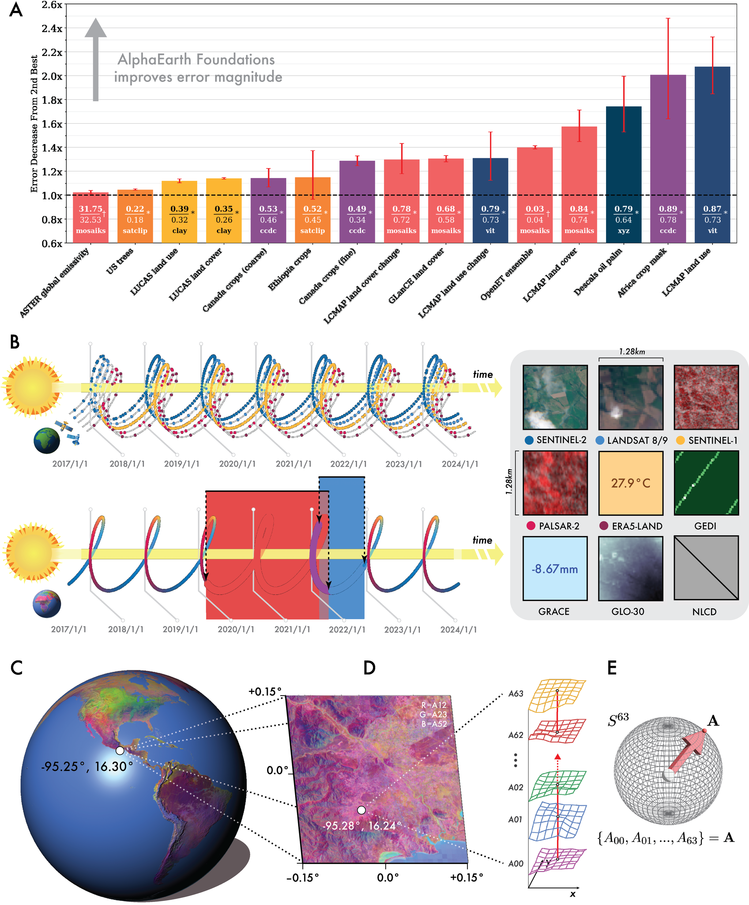

**[S018]**

**Original:**
line indicates random chance for classification evaluations. Error bars indicate 1𝜎 accuracy / R2 or ∼68.27% confidence interval by bootstrapping and k-folds when possible. Most baselines are completely unable to explain evapotranspiration from our testing, achieving a negative 𝑅2 , and so the

**中文:**
line indicates random chance for 分类 evaluations. Error bars indicate 1𝜎 准确率 / R²（决定系数） or ∼68.27% confidence interval by bootstrapping and k-folds when possible. Most baselines are completely unable to explain evapotranspiration from our testing, achieving a negative 𝑅2 , and so the

---

## Page 9

**[S019]**

**Original:**
OpenET evaluation omits results for the majority of transfer/baseline combinations. To the right of each chart we show a qualitative comparison of AEF (starred, top left) to the next-best model or dataset (top right) on their respective most performant method of transfer on a test example at 10m2 resolution, and cloud-free Sentinel-2 L1C RGB image/composites (bottom row) of the location that is not necessarily coincident with timing of the example but is at least using imagery from the same year. We note that AEF demonstrates improved spatial coherence without loss of spatial precision.

**中文:**
OpenET（开放蒸散发） 评估 omits results for the majority of transfer/baseline combinations. To the right of each chart we show a qualitative comparison of AEF (starred, top left) to the next-best model or 数据集 (top right) on their respective most performant method of transfer on a test example at 10m2 resolution, and cloud-free Sentinel-2 L1C RGB image/composites (bottom row) of the location that is not necessarily coincident with timing of the example but is at least using imagery from the same year. We note that AEF demonstrates improved spatial coherence without 损失 of spatial precision.

**[S020]**

**Original:**
than Ethiopia crops, all thematic mapping evalchange detection: direct classification of change, uations had > 1.0x reductions in error within                    which treats change between two summary pethe ∼90% confidence interval. AEF’s consistent                   riods as a binary label and trains the same superformance across these diverse evaluations                     pervised models used above, and unsupervised suggests a degree of generality that was previchange detection, which characterizes a continously not possible even with higher-dimensional                  uous magnitude of deviation from an expected learned embeddings.                                              value and thresholds this to generate a change mask (see supplemental materials S4.1). Our change evaluations are a variant on the LCMAP Estimating biophysical variables                                 labels used for thematic mapping that combines labels from different years to produce a binary The estimation of biophysical variables goes belabel indicating whether or not a change in use yond problems of semantics and perception. Efor cover has occurred. For comparisons we omit fectively extrapolating sparse measurements of the XY and XYZ controls and SatCLIP baseline as properties not easily observed in satellite or other these are time-invariant. overhead imagery stands to benefit applications from greenhouse gas emissions to the heating/-                      In the max-trial setting with direct supervision cooling impact of crops. We consider two bioof change, we find that AEF’s performance exphysical variables: emissivity, which is a unitless              ceeds performance of other models and datasets measurement of surface radiation, and evapotranachieving 78.4% ± 1.11 balanced accuracy (BA) spiration, which characterizes loss of water to the              (linear) and 79.3% ± 1.67 BA (kNN, k=3) on the atmosphere from Earth’s land surface. In the maxland cover and land use evaluations respectively. trial setting, we find that all baselines were able              The next-best baseline achieved 72.0% ± 1.28 to explain emissivity for some method of transBA (MOSAIKS, kNN, k=3) and 71.5% ± 2.33 BA fer with 𝑅2 > 0.5 except for xy, xyz, and CCDC.                  (composite, kNN, k=3) respectively. In the maxAEF had the highest 𝑅2 (0.72 ± 0.00), followed                   trial setting with unsupervised thresholding, AEF by MOSAIKS (0.69 ± 0.00). In characterizing                      exceeds performance of all other baselines when evapotranspiration, AEF demonstrates a signifidetecting land cover change (Figure 3), but not cant departure from the other baselines tested                   land use change, achieving 71.3% ± 1.14 BA and being the only method with 𝑅2 > 0.2, achiev-                     71.4% ± 2.08 BA compared to 67.0% ± 1.28 BA ing 𝑅2 = 0.58 ± 0.01 (Figure 3). We note that                    (ViT) and 72.9% ± 1.97 BA (ViT) respectively, the two baselines with explanatory power in this                 suggesting the value of supervision for this use evaluation, composites and MOSAIKS, are simple                   case. transformations from raw satellite data, indicating a gap in applicability of both learned and designed featurization approaches prior to AEF. Scaling source data quantity and type The AEF training dataset includes over 3 billion Change detection                                                 observations across nine different gridded data sources and one unstructured text source, and Responses to natural and man-made disasters,                     represents approximately 1.1% of Earth’s land illegal logging, and other emergent phenomena                    surface area (see supplemental materials section rely on effective and timely regional monitoring.                S2.1). We find that increasing the number of We consider two approaches to embedding-based                    unique observations used to train AEF leads to

**中文:**
than Ethiopia crops, all thematic mapping evalchange detection: direct 分类 of change, uations had > 1.0x reductions in error within which treats change between two summary pethe ∼90% confidence interval. AEF’s consistent riods as a binary label and trains the same superformance across these diverse evaluations pervised models used above, and unsupervised suggests a degree of generality that was previchange detection, which characterizes a continously not possible even with higher-dimensional uous magnitude of deviation from an expected learned embeddings. value and thresholds this to generate a change mask (see supplemental materials S4.1). Our change evaluations are a variant on the LCMAP Estimating biophysical variables labels used for thematic mapping that combines labels from different years to produce a binary The estimation of biophysical variables goes belabel indicating whether or not a change in use yond problems of semantics and perception. Efor cover has occurred. For comparisons we omit fectively extrapolating sparse measurements of the XY and XYZ controls and SatCLIP baseline as properties not easily observed in satellite or other these are time-invariant. overhead imagery stands to benefit applications from greenhouse gas emissions to the heating/- In the max-trial setting with direct supervision cooling impact of crops. We consider two bioof change, we find that AEF’s performance exphysical variables: emissivity, which is a unitless ceeds performance of other models and datasets measurement of surface radiation, and evapotranachieving 78.4% ± 1.11 balanced 准确率 (BA) spiration, which characterizes 损失 of water to the (linear) and 79.3% ± 1.67 BA (kNN, k=3) on the atmosphere from Earth’s land surface. In the maxland cover and 土地利用 evaluations respectively. trial setting, we find that all baselines were able The next-best baseline achieved 72.0% ± 1.28 to explain emissivity for some method of transBA (MOSAIKS, kNN, k=3) and 71.5% ± 2.33 BA fer with 𝑅2 > 0.5 except for xy, xyz, and CCDC. (composite, kNN, k=3) respectively. In the maxAEF had the highest 𝑅2 (0.72 ± 0.00), followed trial setting with unsupervised thresholding, AEF by MOSAIKS (0.69 ± 0.00). In characterizing exceeds performance of all other baselines when evapotranspiration, AEF demonstrates a signifidetecting 土地覆盖 change (Figure 3), but not cant departure from the other baselines tested 土地利用 change, achieving 71.3% ± 1.14 BA and being the only method with 𝑅2 > 0.2, achiev- 71.4% ± 2.08 BA compared to 67.0% ± 1.28 BA ing 𝑅2 = 0.58 ± 0.01 (Figure 3). We note that (ViT) and 72.9% ± 1.97 BA (ViT) respectively, the two baselines with explanatory power in this suggesting the value of supervision for this use 评估, composites and MOSAIKS, are simple case. transformations from raw satellite data, indicating a gap in applicability of both learned and designed featurization approaches prior to AEF. Scaling source data quantity and type The AEF 训练 数据集 includes over 3 billion 变化检测 observations across nine different gridded data sources and one unstructured text source, and Responses to natural and man-made disasters, represents approximately 1.1% of Earth’s land illegal logging, and other emergent phenomena surface area (see supplemental materials section rely on effective and timely regional monitoring. S2.1). We find that increasing the number of We consider two approaches to embedding-based unique observations used to train AEF leads to

---

## Page 10

**[F004] Figure 4**

**Original:**
> Figure 4 | Effects of scaling. Error bars indicate 1𝜎 accuracy / 𝑅2 or ∼68.27% confidence interval

**中文:**
> Figure 4 | Effects of scaling. Error bars indicate 1𝜎 准确率 / 𝑅2 or ∼68.27% confidence interval

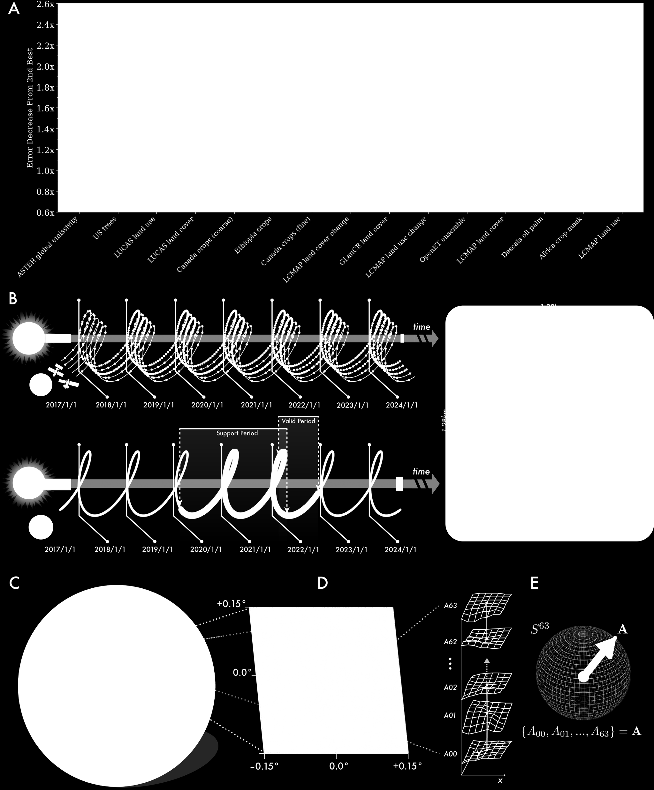

**[S022]**

**Original:**
by bootstrapping and k-folds when possible. (A) BA as a function of training examples in AEF for select evaluations compared to other learned featurization approaches. AEF generally outperforms other approaches when trained on the same number of unique observations or fewer. From published documentation, SatCLIP uses 100k observations, Prithvi 4.2M observations, and Clay 70M. (B) The effect of compounding training targets on BA for select evaluations. All BA differences for each additional source group are significant for 𝛼 = 5%, though saturation effects are apparent following the LiDAR or Environmental source group for some evaluations.

**中文:**
by bootstrapping and k-folds when possible. (A) BA as a function of 训练 examples in AEF for select evaluations compared to other learned featurization approaches. AEF generally outperforms other approaches when trained on the same number of unique observations or fewer. From published documentation, SatCLIP uses 100k observations, Prithvi 4.2M observations, and Clay 70M. (B) The effect of compounding 训练 targets on BA for select evaluations. All BA differences for each additional source group are significant for 𝛼 = 5%, though saturation effects are apparent following the LiDAR or Environmental source group for some evaluations.

---

## Page 11

**[S023]**

**Original:**
more performant embeddings (Figure 4A). For                      Conclusions some evaluations (LUCAS land use, Africa crop mask), performance saturated between 100 milAlphaEarth Foundations (AEF) combines a mullion and 1 billion observations, whereas for others              titude of diverse geospatial observation records the saturation point was not obviously reached                   into a time-continuous embedding space by pre- (US trees). AEF performance generally exceeds                    cisely modeling temporal dynamics and relationthat of approaches trained with an equivalent                    ships across sources. By separating information number of observations across all evaluations,                   pertinent only to the act of measurement from and always outperforms other evaluations with                    the mutual information across all sources, we are the full training set. A noteworthy outlier is US                able to compactly describe Earth’s surface proptrees for which AEF requires an additional ∼100x                 erties while maintaining robustness to the noise observations compared to SatCLIP, which we specand sparsity inherent to Earth imaging missions. ulate is related to AEF receiving no coordinate                     Our findings indicate that AEF consistently outinformation, therefore requiring more examples                   performs designed and learned featurization apto learn climate gradients.                                      proaches in relatively sparse data regimes and We hypothesized that the number of disthat AEF embeddings are broadly applicable to a tinct data sources and observation modalities                    diverse range of fields such as biodiversity, ecolused in training would positively correlate with                 ogy and agriculture. For these fields, obtaining model performance. To test this, we categomaps to model both spatial and temporal changes rized the sources into the following groups: Opefficiently is of key importance even when large tical (Sentinel-2, Landsat 8/9), Radar (Sentinelannotation corpora are not available. As new mea- 1, PALSAR2), LiDAR (GEDI), Environmental                         surement platforms are launched, others decom- (GLO-30, ERA5-Land, GRACE), and Annotated                        missioned, and the accelerating pace of observa- (NLCD, Wikipedia) and iteratively added additional data collection pushes forward, we believe tional groups to training. We find AEF the most                  it is critical to support the community of applied performant when trained on the full set of source                scientists and practitioners deriving the insights groups, though with diminishing returns as addiabout our planet that inform decision-making and tional groups are added (Figure 4B).                             policy action. With AlphaEarth Foundations, we introduce a solution to accurately and generally extrapolate annotations and field measurements to the growing archives of Earth observation now, Global embeddings dataset and into the future. To facilitate usage of AEF by EO practitioners, we have produced a collection of annual embedding                   Acknowledgements summaries generated by AEF and hosted it as an image dataset on Google Earth Engine (Google,                    We would like to thank Olaf Ronnenberger for his 2025). For many use-cases we expect these anmanuscript review and feedback, Carlos Guerra nual embedding fields to revolutionize mapping                   for his contributions to our dataset production inworkflows that typically require large training                  frastructure and manuscript review, Katelyn Tardatasets, compute intensive models, and custom                   rio for her assistance with the GLaNCE dataset, inference systems to apply those models. To furMaxim Neumann for his assistance preparing an ther minimize compute and storage overhead,                      earlier evaluation dataset, Sai Cheemalapati for we quantize the 32-bit floating point embeddings                 his assistance with serving our data, Jonathan generated by AEF to 8 bits, resulting in an 4x                   Thompson and Xiaojie Gao at Harvard Forest for reduction in storage with negligible impact on                   testing an earlier version of our embedding fields, performance (see supplemental materials S8 for                   Eric Smit for additional proofreading, and the additional details on inference and quantization).               memory of The Moose for her cat support over the lifetime of this project, as best she could offer it.

**中文:**
more performant embeddings (Figure 4A). For Conclusions some evaluations (LUCAS（欧盟土地利用/覆盖统计调查） 土地利用, Africa crop mask), performance saturated between 100 milAlphaEarth Foundations (AEF) combines a mullion and 1 billion observations, whereas for others titude of diverse 地理空间 observation records the saturation point was not obviously reached into a time-continuous embedding space by pre- (US trees). AEF performance generally exceeds cisely modeling 时序 dynamics and relationthat of approaches trained with an equivalent ships across sources. By separating information number of observations across all evaluations, pertinent only to the act of measurement from and always outperforms other evaluations with the mutual information across all sources, we are the full 训练 set. A noteworthy outlier is US able to compactly describe Earth’s surface proptrees for which AEF requires an additional ∼100x erties while maintaining robustness to the noise observations compared to SatCLIP, which we specand sparsity inherent to Earth imaging missions. ulate is related to AEF receiving no coordinate Our findings indicate that AEF consistently outinformation, therefore requiring more examples performs designed and learned featurization apto learn climate gradients. proaches in relatively sparse data regimes and We hypothesized that the number of disthat AEF embeddings are broadly applicable to a tinct data sources and observation modalities diverse range of fields such as biodiversity, ecolused in 训练 would positively correlate with ogy and agriculture. For these fields, obtaining model performance. To test this, we categomaps to model both spatial and 时序 changes rized the sources into the following groups: Opefficiently is of key importance even when large tical (Sentinel-2, Landsat 8/9), Radar (Sentinelannotation corpora are not available. As new mea- 1, PALSAR2), LiDAR (GEDI（全球生态系统动态调查）), Environmental surement platforms are launched, others decom- (GLO-30, ERA5-Land, GRACE), and Annotated missioned, and the accelerating pace of observa- (NLCD（美国国家土地覆盖数据库）, Wikipedia) and iteratively added additional data collection pushes forward, we believe tional groups to 训练. We find AEF the most it is critical to support the community of applied performant when trained on the full set of source scientists and practitioners deriving the insights groups, though with diminishing returns as addiabout our planet that inform decision-making and tional groups are added (Figure 4B). policy action. With AlphaEarth Foundations, we introduce a solution to accurately and generally extrapolate annotations and field measurements to the growing archives of 地球观测 now, Global embeddings 数据集 and into the future. To facilitate usage of AEF by EO practitioners, we have produced a collection of annual embedding Acknowledgements summaries generated by AEF and hosted it as an image 数据集 on Google Earth Engine (Google, We would like to thank Olaf Ronnenberger for his 2025). For many use-cases we expect these anmanuscript review and feedback, Carlos Guerra nual 嵌入场 to revolutionize mapping for his contributions to our 数据集 production inworkflows that typically require large 训练 frastructure and manuscript review, Katelyn Tardatasets, compute intensive models, and custom rio for her assistance with the GLanCE（全球土地覆盖估算） 数据集, 推理 systems to apply those models. To furMaxim Neumann for his assistance preparing an ther minimize compute and storage overhead, earlier 评估 数据集, Sai Cheemalapati for we quantize the 32-bit floating point embeddings his assistance with serving our data, Jonathan generated by AEF to 8 bits, resulting in an 4x Thompson and Xiaojie Gao at Harvard Forest for reduction in storage with negligible impact on testing an earlier version of our 嵌入场, performance (see supplemental materials S8 for Eric Smit for additional proofreading, and the additional details on 推理 and quantization). memory of The Moose for her cat support over the lifetime of this project, as best she could offer it.

---

## Page 12

**[S024]**

**Original:**
Author contributions                                             from 1984 to 2020, from Boston University Global Land Cover Estimation (GLanCE), whose use is Conceptualization: C.F.B., M.K., V.J.P., E.Sh.,                  governed by the Creative Commons Attribution O.G., A.B., Methodology: C.F.B., M.K., V.J.P.,                   4.0 International License (CC-BY); Comparison W.J.R., M.S., E.Sh., O.W., Software: C.F.B., M.K.,               of Cropland Maps Derived from Land Cover Maps V.J.P., W.J.R., M.S., C.Z., E.Sh., E.L., N.G., S.A.,             in Sub-Saharan Africa, whose use is governed A.B., Validation: C.F.B, M.K., V.J.P, W.J.R., M.S.,              by under the Creative Commons Attribution 4.0 C.Z., E.L., O.W., E.Sc., S.A., O.G., A.B., Formal                International License (CC-BY); Canadian AAFC analysis: C.F.B., M.K., V.J.P., W.J.R., M.S., C.Z.,              Annual Crop Inventory from the Canadian AAFC E.Sh., Investigation: C.F.B., M.K., V.J.P., W.J.R.,              (Agriculture and Agri-Food Canada) whose use C.Z., E.Sh., A.B., Resources: C.F.B., V.J.P., W.J.R.,            is governed under the Open Government Licence S.A., E.Sc., S.A., O.G., R.M., A.B., Data Curation:              Canada; Ethiopian Crop Type 2020, whose use C.F.B., M.K., V.J.P., W.J.R., C.Z., S.I., N.G., A.B.,            is governed by licensed under the Creative ComWriting - Original Draft: C.F.B., M.K., V.J.P., M.S.,            mons Attribution 4.0 International License (CCE.Sh., O.W., Writing - Review & Editing: C.F.B.,                 BY); iNaturalist whose use is governed by a CreM.K., V.J.P., W.J.R., E.Sh., E.L., O.W., L.L.Z, O.G.,            ative Commons Attribution Non-Commercial 4.0 A.B., P.K., Visualization: C.F.B., V.J.P., M.S., A.B.,           License (CC-BY-NC); Global mapping of oil palm Supervision: C.F.B., V.J.P., E.Sc., S.A., O.G., R.M.,            planting year from 1990 to 2021, whose use is A.B., P.K., Project administration: C.F.B., V.J.P.,              governed by the Creative Commons Attribution L.L.Z., S.A., E.Sc., S.A., O.G., A.B.                            4.0 International License (CC-BY); OpenET Ensemble Monthly Evapotranspiration v2.0 from OpenET, Inc. whose use is governed by the CreData and Materials Availability                                  ative Commons Attribution 4.0 International License (CC-BY); and AG100: ASTER Global EmisWe release annualized embedding field layers                     sivity Dataset 100-meter V003, which is available from 2017-2024, our suite of evaluation datasets,                at no charge and with no restrictions on reuse, and the locations of our training sample sites unsale or redistribution. der an open license for further exploration and applied use.                                                        Our training site selection was informed by the RESOLVE Ecoregions 2017 dataset, whose use AlphaEarth Foundations was trained using pubis governed by the Creative Commons Attribulicly available data from the Copernicus Program,                tion 4.0 International License (CC-BY); the Allen the United States Geological Survey (USGS), the                  Coral Atlas (ACA) - Geomorphic Zonation and National Aeronautics and Space Administration                    Benthic Habitat - v2.0, whose use is governed by (NASA), the Japan Aerospace Exploration Agency                   the Creative Commons Attribution 4.0 Interna- (JAXA), and the Copernicus Climate Change Sertional License (CC-BY); the Murray Global Intervice (C3S) of the European Commission and the                    tidal Change Classification, whose use is governed European Centre for Medium-Range Weather                         by the Creative Commons Attribution 4.0 InterForecasts (ECMWF).                                               national License (CC-BY). Our evaluation datasets were derived from publicly available data including: LCMAP CONUS References Reference Data Product 1984-2021 land cover, land use and change process attributes, from                     Agriculture and A.-F. Canada. Annual crop the United States Geological Survey, which is in                   inventory ground truth data.    https: the public domain; LUCAS Harmonized (Theo-                          //open.canada.ca/data/en/dataset/ retical Location, 2006-2018) V1, from the Joint                     503a3113-e435-49f4-850c-d70056788632, Research Centre of the European Commission,                         2024. Accessed: 2024-11-12. whose use is governed by the Creative Commons Attribution 4.0 International License (CC-BY);                   P. Arevalo, R. Stanimirova, E. Bullock, Y. Zhang, GLanCE: A Global Land Cover Training Dataset                        K. Tarrio, K. Turlej, K.-T. Hu, K. McAvoy,

**中文:**
Author contributions from 1984 to 2020, from Boston University Global 土地覆盖 Estimation (GLanCE（全球土地覆盖估算）), whose use is Conceptualization: C.F.B., M.K., V.J.P., E.Sh., governed by the Creative Commons Attribution O.G., A.B., Methodology: C.F.B., M.K., V.J.P., 4.0 International License (CC-BY); Comparison W.J.R., M.S., E.Sh., O.W., Software: C.F.B., M.K., of Cropland Maps Derived from 土地覆盖 Maps V.J.P., W.J.R., M.S., C.Z., E.Sh., E.L., N.G., S.A., in Sub-Saharan Africa, whose use is governed A.B., 验证: C.F.B, M.K., V.J.P, W.J.R., M.S., by under the Creative Commons Attribution 4.0 C.Z., E.L., O.W., E.Sc., S.A., O.G., A.B., Formal International License (CC-BY); Canadian AAFC analysis: C.F.B., M.K., V.J.P., W.J.R., M.S., C.Z., Annual Crop Inventory from the Canadian AAFC E.Sh., Investigation: C.F.B., M.K., V.J.P., W.J.R., (Agriculture and Agri-Food Canada) whose use C.Z., E.Sh., A.B., Resources: C.F.B., V.J.P., W.J.R., is governed under the Open Government Licence S.A., E.Sc., S.A., O.G., R.M., A.B., Data Curation: Canada; Ethiopian 作物类型 2020, whose use C.F.B., M.K., V.J.P., W.J.R., C.Z., S.I., N.G., A.B., is governed by licensed under the Creative ComWriting - Original Draft: C.F.B., M.K., V.J.P., M.S., mons Attribution 4.0 International License (CCE.Sh., O.W., Writing - Review & Editing: C.F.B., BY); iNaturalist whose use is governed by a CreM.K., V.J.P., W.J.R., E.Sh., E.L., O.W., L.L.Z, O.G., ative Commons Attribution Non-Commercial 4.0 A.B., P.K., Visualization: C.F.B., V.J.P., M.S., A.B., License (CC-BY-NC); Global mapping of oil palm Supervision: C.F.B., V.J.P., E.Sc., S.A., O.G., R.M., planting year from 1990 to 2021, whose use is A.B., P.K., Project administration: C.F.B., V.J.P., governed by the Creative Commons Attribution L.L.Z., S.A., E.Sc., S.A., O.G., A.B. 4.0 International License (CC-BY); OpenET（开放蒸散发） Ensemble Monthly Evapotranspiration v2.0 from OpenET（开放蒸散发）, Inc. whose use is governed by the CreData and Materials Availability ative Commons Attribution 4.0 International License (CC-BY); and AG100: ASTER Global EmisWe release annualized 嵌入场 layers sivity 数据集 100-meter V003, which is available from 2017-2024, our suite of 评估 datasets, at no charge and with no restrictions on reuse, and the locations of our 训练 sample sites unsale or redistribution. der an open license for further exploration and applied use. Our 训练 site selection was informed by the RESOLVE Ecoregions 2017 数据集, whose use AlphaEarth Foundations was trained using pubis governed by the Creative Commons Attribulicly available data from the Copernicus（哥白尼计划） Program, tion 4.0 International License (CC-BY); the Allen the United States Geological Survey (USGS（美国地质调查局）), the Coral Atlas (ACA) - Geomorphic Zonation and National Aeronautics and Space Administration Benthic Habitat - v2.0, whose use is governed by (NASA), the Japan Aerospace Exploration Agency the Creative Commons Attribution 4.0 Interna- (JAXA), and the Copernicus（哥白尼计划） Climate Change Sertional License (CC-BY); the Murray Global Intervice (C3S) of the European Commission and the tidal Change 分类, whose use is governed European Centre for Medium-Range Weather by the Creative Commons Attribution 4.0 InterForecasts (ECMWF). national License (CC-BY). Our 评估 datasets were derived from publicly available data including: LCMAP CONUS References Reference Data Product 1984-2021 土地覆盖, 土地利用 and change process attributes, from Agriculture and A.-F. Canada. Annual crop the United States Geological Survey, which is in inventory 地面真值 data. https: the public domain; LUCAS（欧盟土地利用/覆盖统计调查） Harmonized (Theo- //open.canada.ca/data/en/数据集/ retical Location, 2006-2018) V1, from the Joint 503a3113-e435-49f4-850c-d70056788632, Research Centre of the European Commission, 2024. Accessed: 2024-11-12. whose use is governed by the Creative Commons Attribution 4.0 International License (CC-BY); P. Arevalo, R. Stanimirova, E. Bullock, Y. Zhang, GLanCE（全球土地覆盖估算）: A Global 土地覆盖 训练 数据集 K. Tarrio, K. Turlej, K.-T. Hu, K. McAvoy,

---

## Page 13

**[S025]**

**Original:**
V. Pasquarella, C. Woodcock, et al. Global                     M. J. Campbell, P. E. Dennison, K. L. Kerr, S. C. land cover mapping and estimation yearly 30 m                   Brewer, and W. R. Anderegg. Scaled biomass esv001. NASA EOSDIS Land Processes Distributed                    timation in woodland ecosystems: Testing the Active Archive Center (DAAC) data set, pages                    individual and combined capacities of satellite GLANCE30–001, 2022.                                             multispectral and lidar data. Remote Sensing of Environment, 262:112511, 2021. G. Blasch. Ethiopian crop type 2020 (EthCT2020) dataset, Jan. 2024.                                            X. Chen, S. Xie, and K. He. An empirical study G. Blasch, Y. Alemayehu, L. Lesne, J. Wolter,                      of training self-supervised vision transformers. M. Taymans, T. Tesfaye, T. Negash, M. AnduIn Proceedings of the IEEE/CVF International lalem, K. Gutu, M. Debela, et al. Ethiopian crop                 Conference on Computer Vision, pages 9640– type 2020 (ethct2020) dataset: Crop type data                    9649, 2021. for environmental and agricultural remote sensing applications in complex ethiopian smallClay. Clay foundation model. https://github. holder wheat-based farming systems (meher                        com/Clay-foundation/model, 2024. Acseason 2020/21). Data in Brief, 54:110427,                       cessed: 2025-2-21. 2024. W. B. Cohen and S. N. Goward. Landsat’s role N. I. Bountos, A. Ouaknine, and D. Rolnick. Fomoin ecological applications of remote sensing. bench: a multi-modal, multi-scale and multiBioscience, 54(6):535–545, 2004. task forest monitoring benchmark for remote sensing foundation models. arXiv preprint                      Y. Cong, S. Khanna, C. Meng, P. Liu, E. Rozi, Y. He, arXiv:2312.10114, 2023.                                           M. Burke, D. Lobell, and S. Ermon. Satmae: Pretraining transformers for temporal and multiE. B. Brooks, R. H. Wynne, V. A. Thomas, C. E.                      spectral satellite imagery. Advances in Neural Blinn, and J. W. Coulston. On-the-fly massively                   Information Processing Systems, 35:197–211, multitemporal change detection using statis-                      2022. tical quality control charts and landsat data. IEEE Transactions on Geoscience and Remote                     DeepMind. Supplemental evaluation datasets, Sensing, 52(6):3316–3332, 2014.                                 July 2025a. URL https://doi.org/10. C. F. Brown, S. P. Brumby, B. Guzder-Williams,                     5281/zenodo.16585402. T. Birch, S. B. Hyde, J. Mazzariello, W. CzDeepMind. Supplemental training coordinates, erwinski, V. J. Pasquarella, R. Haertel, July 2025b. URL https://doi.org/10. S. Ilyushchenko, et al. Dynamic world, near 5281/zenodo.16585910. real-time global 10 m land use land cover mapping. Scientific Data, 9(1):251, 2022.                         J. Deng, W. Dong, R. Socher, L.-J. Li, K. Li, and J. F. Brown, H. J. Tollerud, C. P. Barber, Q. Zhou,                 L. Fei-Fei. Imagenet: A large-scale hierarchical J. L. Dwyer, J. E. Vogelmann, T. R. Loveland,                    image database. In 2009 IEEE conference on C. E. Woodcock, S. V. Stehman, Z. Zhu, et al.                    computer vision and pattern recognition, pages Lessons learned implementing an operational                      248–255. Ieee, 2009. continuous united states national land change monitoring capability: The land change moniA. Descals. Global oil palm extent and planttoring, assessment, and projection (lcmap) aping year from 1990 to 2021, Aug. 2024. proach. Remote sensing of environment, 238:                     URL https://doi.org/10.5281/zenodo. 111356, 2020.                                                   13379129.

**中文:**
V. Pasquarella, C. Woodcock, et al. Global M. J. Campbell, P. E. Dennison, K. L. Kerr, S. C. 土地覆盖 mapping and estimation yearly 30 m Brewer, and W. R. Anderegg. Scaled 生物量 esv001. NASA EOSDIS Land Processes Distributed timation in woodland ecosystems: Testing the Active Archive Center (DAAC) data set, pages individual and combined capacities of satellite GLANCE30–001, 2022. multispectral and lidar data. 遥感 of Environment, 262:112511, 2021. G. Blasch. Ethiopian 作物类型 2020 (EthCT2020) 数据集, Jan. 2024. X. Chen, S. Xie, and K. He. An empirical study G. Blasch, Y. Alemayehu, L. Lesne, J. Wolter, of 训练 self-supervised vision transformers. M. Taymans, T. Tesfaye, T. Negash, M. AnduIn Proceedings of the IEEE/CVF International lalem, K. Gutu, M. Debela, et al. Ethiopian crop Conference on Computer Vision, pages 9640– type 2020 (ethct2020) 数据集: 作物类型 data 9649, 2021. for environmental and agricultural 遥感 applications in complex ethiopian smallClay. Clay 基础模型. https://github. holder wheat-based farming systems (meher com/Clay-foundation/model, 2024. Acseason 2020/21). Data in Brief, 54:110427, cessed: 2025-2-21. 2024. W. B. Cohen and S. N. Goward. Landsat’s role N. I. Bountos, A. Ouaknine, and D. Rolnick. Fomoin ecological applications of 遥感. bench: a multi-modal, multi-scale and multiBioscience, 54(6):535–545, 2004. task forest monitoring 基准测试 for 遥感 基础模型. arXiv preprint Y. Cong, S. Khanna, C. Meng, P. Liu, E. Rozi, Y. He, arXiv:2312.10114, 2023. M. Burke, D. Lobell, and S. Ermon. Satmae: Pretraining transformers for 时序 and multiE. B. Brooks, R. H. Wynne, V. A. Thomas, C. E. spectral satellite imagery. Advances in Neural Blinn, and J. W. Coulston. On-the-fly massively Information Processing Systems, 35:197–211, multitemporal 变化检测 using statis- 2022. tical quality control charts and Landsat data. IEEE Transactions on Geoscience and Remote DeepMind. Supplemental 评估 datasets, Sensing, 52(6):3316–3332, 2014. July 2025a. URL https://doi.org/10. C. F. Brown, S. P. Brumby, B. Guzder-Williams, 5281/zenodo.16585402. T. Birch, S. B. Hyde, J. Mazzariello, W. CzDeepMind. Supplemental 训练 coordinates, erwinski, V. J. Pasquarella, R. Haertel, July 2025b. URL https://doi.org/10. S. Ilyushchenko, et al. Dynamic World, near 5281/zenodo.16585910. real-time global 10 m 土地利用 土地覆盖 mapping. Scientific Data, 9(1):251, 2022. J. Deng, W. Dong, R. Socher, L.-J. Li, K. Li, and J. F. Brown, H. J. Tollerud, C. P. Barber, Q. Zhou, L. Fei-Fei. Imagenet: A large-scale hierarchical J. L. Dwyer, J. E. Vogelmann, T. R. Loveland, image database. In 2009 IEEE conference on C. E. Woodcock, S. V. Stehman, Z. Zhu, et al. computer vision and pattern recognition, pages Lessons learned implementing an operational 248–255. Ieee, 2009. continuous united states national land change monitoring capability: The land change moniA. Descals. Global oil palm extent and planttoring, assessment, and projection (lcmap) aping year from 1990 to 2021, Aug. 2024. proach. 遥感 of environment, 238: URL https://doi.org/10.5281/zenodo. 111356, 2020. 13379129.

**[S026]**

**Original:**
T. Cai, J. Fan, and T. Jiang. Distributions of angles            A. Descals et al. High resolution global industrial in random packing on spheres. The Journal of                    and smallholder oil palm map for 2019. ZenMachine Learning Research, 14(1):1837–1864,                     odo https://doi. org/10.5281/zenodo, 4473715, 2013.                                                           2021.

**中文:**
T. Cai, J. Fan, and T. Jiang. Distributions of angles A. Descals et al. High resolution global industrial in random packing on spheres. The Journal of and smallholder oil palm map for 2019. ZenMachine Learning Research, 14(1):1837–1864, odo https://doi. org/10.5281/zenodo, 4473715, 2013. 2021.

---

## Page 14

**[S027]**

**Original:**
E. Dinerstein, D. Olson, A. Joshi, C. Vynne,                     M. A. Friedl, C. E. Woodcock, P. Olofsson, Z. Zhu, N. D. Burgess, E. Wikramanayake, N. Hahn,                       T. Loveland, R. Stanimirova, P. Arevalo, E. BulS. Palminteri, P. Hedao, R. Noss, et al. An                      lock, K.-T. Hu, Y. Zhang, et al. Medium spatial ecoregion-based approach to protecting half                      resolution mapping of global land cover and the terrestrial realm. BioScience, 67(6):534–                    land cover change across multiple decades from 545, 2017.                                                       landsat. Frontiers in Remote Sensing, 3:894571, 2022. A. Dosovitskiy, L. Beyer, A. Kolesnikov, D. Weissenborn, X. Zhai, T. Unterthiner, M. Dehghani,                 F. Gascon, C. Bouzinac, O. Thépaut, M. Jung, M. Minderer, G. Heigold, S. Gelly, et al. An                      B. Francesconi, J. Louis, V. Lonjou, B. Lafrance, image is worth 16x16 words: Transformers                          S. Massera, A. Gaudel-Vacaresse, et al. Coperfor image recognition at scale. arXiv preprint                    nicus sentinel-2a calibration and products valiarXiv:2010.11929, 2020.                                           dation status. Remote Sensing, 9(6):584, 2017.

**中文:**
E. Dinerstein, D. Olson, A. Joshi, C. Vynne, M. A. Friedl, C. E. Woodcock, P. Olofsson, Z. Zhu, N. D. Burgess, E. Wikramanayake, N. Hahn, T. Loveland, R. Stanimirova, P. Arevalo, E. BulS. Palminteri, P. Hedao, R. Noss, et al. An lock, K.-T. Hu, Y. Zhang, et al. Medium spatial ecoregion-based approach to protecting half resolution mapping of global 土地覆盖 and the terrestrial realm. BioScience, 67(6):534– 土地覆盖 change across multiple decades from 545, 2017. Landsat. Frontiers in 遥感, 3:894571, 2022. A. Dosovitskiy, L. Beyer, A. Kolesnikov, D. Weissenborn, X. Zhai, T. Unterthiner, M. Dehghani, F. Gascon, C. Bouzinac, O. Thépaut, M. Jung, M. Minderer, G. Heigold, S. Gelly, et al. An B. Francesconi, J. Louis, V. Lonjou, B. Lafrance, image is worth 16x16 words: Transformers S. Massera, A. Gaudel-Vacaresse, et al. Coperfor image recognition at scale. arXiv preprint nicus sentinel-2a calibration and products valiarXiv:2010.11929, 2020. dation status. 遥感, 9(6):584, 2017.

**[S028]**

**Original:**
M. Drusch, U. Del Bello, S. Carlier, O. Colin,                   GBIF. Occurrence download, Jan. 2024. V. Fernandez, F. Gascon, B. Hoersch, C. Isola, P. Laberinti, P. Martimort, et al. Sentinel-2:                  T. Gemini, P. Georgiev, V. I. Lei, R. Burnell, L. Bai, Esa’s optical high-resolution mission for gmes                     A. Gulati, G. Tanzer, D. Vincent, Z. Pan, S. Wang, operational services. Remote sensing of Environet al. Gemini 1.5: Unlocking multimodal underment, 120:25–36, 2012.                                             standing across millions of tokens of context. arXiv preprint arXiv:2403.05530, 2024. R. Dubayah, M. Hofton, J. Blair, J. Armston, H. Tang, and S. Luthcke. Gedi l2a elevation                    Google. Satellite embedding v1, June 2025. and height metrics data global footprint level                   URL https://developers.google.com/ v002, 2021.                                                         earth-engine/datasets/catalog/ GOOGLE_SATELLITE_EMBEDDING_V1_ R. Dubayah, J. Armston, S. P. Healey, J. M. BruANNUAL. ening, P. L. Patterson, J. R. Kellner, L. Duncanson, S. Saarela, G. Ståhl, Z. Yang, et al. Gedi                N.      Gorelick,     M. Hancher,     M. Dixon, launches a new era of biomass inference from                        S. Ilyushchenko, D. Thau, and R. Moore. space. Environmental Research Letters, 17(9):                       Google earth engine: Planetary-scale geospa- 095001, 2022.                                                       tial analysis for everyone. Remote sensing of Environment, 202:18–27, 2017. R. d’Andrimont, M. Yordanov, L. MartinezSanchez, B. Eiselt, A. Palmieri, P. Dominici,                  N. Gorelick, Z. Yang, P. Arévalo, E. L. Bullock, J. Gallego, H. I. Reuter, C. Joebges, G. Lemoine,                K. P. Insfrán, and S. P. Healey. A global time et al. Harmonised lucas in-situ land cover and                   series dataset to facilitate forest greenhouse use database for field surveys from 2006 to                      gas reporting. Environmental Research Letters, 2018 in the european union. Scientific data, 7                   18(8):084001, 2023. (1):352, 2020. P. L. Guth and T. M. Geoffroy. Lidar point cloud C. Fefferman, S. Mitter, and H. Narayanan. Testand icesat-2 evaluation of 1 second global digiing the manifold hypothesis. Journal of the                       tal elevation models: Copernicus wins. TransAmerican Mathematical Society, 29(4):983–                         actions in GIS, 25(5):2245–2261, 2021. 1049, 2016. M. C. Hansen, P. V. Potapov, R. Moore, S. Francini, T. Hermosilla, N. C. Coops, M. A.                    M. Hancher, S. A. Turubanova, A. Tyukavina, Wulder, J. C. White, and G. Chirici. An asD. Thau, S. V. Stehman, S. J. Goetz, T. R. Lovesessment approach for pixel-based image comland, et al. High-resolution global maps of posites. ISPRS Journal of Photogrammetry and                    21st-century forest cover change. science, 342 Remote Sensing, 202:1–12, 2023.                                 (6160):850–853, 2013.

**中文:**
M. Drusch, U. Del Bello, S. Carlier, O. Colin, GBIF（全球生物多样性信息网络）. Occurrence download, Jan. 2024. V. Fernandez, F. Gascon, B. Hoersch, C. Isola, P. Laberinti, P. Martimort, et al. Sentinel-2: T. Gemini, P. Georgiev, V. I. Lei, R. Burnell, L. Bai, ESA（欧洲空间局）’s 光学 high-resolution mission for gmes A. Gulati, G. Tanzer, D. Vincent, Z. Pan, S. Wang, operational services. 遥感 of Environet al. Gemini 1.5: Unlocking multimodal underment, 120:25–36, 2012. standing across millions of tokens of context. arXiv preprint arXiv:2403.05530, 2024. R. Dubayah, M. Hofton, J. Blair, J. Armston, H. Tang, and S. Luthcke. GEDI（全球生态系统动态调查） l2a elevation Google. Satellite embedding v1, June 2025. and height metrics data global footprint level URL https://developers.google.com/ v002, 2021. earth-engine/datasets/catalog/ GOOGLE_SATELLITE_EMBEDDING_V1_ R. Dubayah, J. Armston, S. P. Healey, J. M. BruANNUAL. ening, P. L. Patterson, J. R. Kellner, L. Duncanson, S. Saarela, G. Ståhl, Z. Yang, et al. GEDI（全球生态系统动态调查） N. Gorelick, M. Hancher, M. Dixon, launches a new era of 生物量 推理 from S. Ilyushchenko, D. Thau, and R. Moore. space. Environmental Research Letters, 17(9): Google Earth Engine: Planetary-scale geospa- 095001, 2022. tial analysis for everyone. 遥感 of Environment, 202:18–27, 2017. R. d’Andrimont, M. Yordanov, L. MartinezSanchez, B. Eiselt, A. Palmieri, P. Dominici, N. Gorelick, Z. Yang, P. Arévalo, E. L. Bullock, J. Gallego, H. I. Reuter, C. Joebges, G. Lemoine, K. P. Insfrán, and S. P. Healey. A global time et al. Harmonised LUCAS（欧盟土地利用/覆盖统计调查） in-situ 土地覆盖 and series 数据集 to facilitate forest greenhouse use database for field surveys from 2006 to gas reporting. Environmental Research Letters, 2018 in the european union. Scientific data, 7 18(8):084001, 2023. (1):352, 2020. P. L. Guth and T. M. Geoffroy. Lidar point cloud C. Fefferman, S. Mitter, and H. Narayanan. Testand icesat-2 评估 of 1 second global digiing the manifold hypothesis. Journal of the tal elevation models: Copernicus（哥白尼计划） wins. TransAmerican Mathematical Society, 29(4):983– actions in GIS, 25(5):2245–2261, 2021. 1049, 2016. M. C. Hansen, P. V. Potapov, R. Moore, S. Francini, T. Hermosilla, N. C. Coops, M. A. M. Hancher, S. A. Turubanova, A. Tyukavina, Wulder, J. C. White, and G. Chirici. An asD. Thau, S. V. Stehman, S. J. Goetz, T. R. Lovesessment approach for 像素-based image comland, et al. High-resolution global maps of posites. ISPRS Journal of Photogrammetry and 21st-century forest cover change. science, 342 遥感, 202:1–12, 2023. (6160):850–853, 2013.

---

## Page 15

**[S029]**

**Original:**
R. M. Haralick, K. Shanmugam, and I. Dinstein.                   H. Kerner, C. Nakalembe, A. Yang, I. Zvonkov, Textural features for image classification. IEEE                 R. McWeeny, G. Tseng, and I. Becker-Reshef. Transactions on Systems, Man, and CybernetComparison of cropland maps derived from ics, SMC-3(6):610–621, 1973. doi: 10.1109/                       land cover maps in sub-saharan africa, Feb. TSMC.1973.4309314.                                               2024b. URL https://doi.org/10.5281/ zenodo.10694610. A. R. Hof, R. Jansson, and C. Nilsson. The usefulness of elevation as a predictor variable in                D. P. Kingma. Adam: A method for stochastic species distribution modelling. Ecological Modoptimization. arXiv preprint arXiv:1412.6980, elling, 246:86–90, 2012.                                         2014.

**中文:**
R. M. Haralick, K. Shanmugam, and I. Dinstein. H. Kerner, C. Nakalembe, A. Yang, I. Zvonkov, Textural features for image 分类. IEEE R. McWeeny, G. Tseng, and I. Becker-Reshef. Transactions on Systems, Man, and CybernetComparison of cropland maps derived from ics, SMC-3(6):610–621, 1973. doi: 10.1109/ 土地覆盖 maps in sub-saharan africa, Feb. TSMC.1973.4309314. 2024b. URL https://doi.org/10.5281/ zenodo.10694610. A. R. Hof, R. Jansson, and C. Nilsson. The usefulness of elevation as a predictor variable in D. P. Kingma. Adam: A method for stochastic species distribution modelling. Ecological Modoptimization. arXiv preprint arXiv:1412.6980, elling, 246:86–90, 2012. 2014.

**[S030]**

**Original:**
G. C. Hulley, S. J. Hook, E. Abbott, N. Malakar,                 D. P. Kingma, M. Welling, et al. Auto-encoding T. Islam, and M. Abrams. The aster global                        variational bayes, 2013. emissivity dataset (aster ged): Mapping earth’s emissivity at 100 meter spatial scale. GeophysiK. Klemmer, E. Rolf, C. Robinson, L. Mackey, and cal Research Letters, 42(19):7966–7976, 2015.                    M. Rußwurm. Satclip: Global, general-purpose location embeddings with satellite imagery. In J. Jakubik, L. Chu, P. Fraccaro, C. Gomes,                         Proceedings of the AAAI Conference on ArtifiG. Nyirjesy, R. Bangalore, D. Lambhate, K. Das,                  cial Intelligence, volume 39, pages 4347–4355, D. Oliveira Borges, D. Kimura, N. Simumba,                      2025. D. Szwarcman, M. Muszynski, K. Weldemariam, B. Zadrozny, R. Ganti, C. Costa,                      R. P. Kornfeld, B. W. Arnold, M. A. Gross, N. T. C. Edwards, Blair & Watson, K. Mukkavilli,                       Dahya, W. M. Klipstein, P. F. Gath, and S. BetH. Schmude, Johannes & Hamann, P. Robert,                       tadpur. Grace-fo: the gravity recovery and cliS. Roy, C. Phillips, K. Ankur, M. Ramasubmate experiment follow-on mission. Journal of ramanian, I. Gurung, W. J. Leong, R. Avery,                     spacecraft and rockets, 56(3):931–951, 2019. R. Ramachandran, M. Maskey, P. Olofossen,                     C. N. Koyama, M. Shimada, M. Watanabe, and E. Fancher, T. Lee, K. Murphy, D. Duffy, M. LitT. Tadono. Alos-2/palsar-2 long-term pantropitle, H. Alemohammad, M. Cecil, S. Li, S. Khalcal observation–a paradigm shift in global forlaghi, D. Godwin, M. Ahmadi, F. Kordi, B. Saux,                 est monitoring. In EUSAR 2022; 14th European N. Pastick, P. Doucette, R. Fleckenstein, D. LuConference on Synthetic Aperture Radar, pages anga, A. Corvin, and E. Granger. Prithvi-100M,                  1–5. VDE, 2022. Aug. 2023a. A. Lacoste, N. Lehmann, P. Rodriguez, E. Sherwin, J. Jakubik, S. Roy, C. Phillips, P. Fraccaro, D. GodH. Kerner, B. Lütjens, J. Irvin, D. Dao, H. Alemowin, B. Zadrozny, D. Szwarcman, C. Gomes,                       hammad, A. Drouin, et al. Geo-bench: Toward G. Nyirjesy, B. Edwards, et al. Foundation                      foundation models for earth monitoring. Admodels for generalist geospatial artificial invances in Neural Information Processing Systems, telligence. arXiv preprint arXiv:2310.18660,                    36:51080–51093, 2023. 2023b. F. W. Landerer and S. Swenson. Accuracy of Y. Kankaku, S. Suzuki, and Y. Osawa. Alos-2 misscaled grace terrestrial water storage estimates. sion and development status. In 2013 IEEE                        Water resources research, 48(4), 2012. International Geoscience and Remote Sensing Symposium-IGARSS, pages 2396–2399. IEEE,                      J.-S. Lee, T. L. Ainsworth, and Y. Wang. A review 2013.                                                            of polarimetric sar speckle filtering. In 2017 IEEE International Geoscience and Remote SensH. Kerner, C. Nakalembe, A. Yang, I. Zvonkov,                       ing Symposium (IGARSS), pages 5303–5306. R. McWeeny, G. Tseng, and I. Becker-Reshef.                       IEEE, 2017. How accurate are existing land cover maps for agriculture in sub-saharan africa? Scientific                  H. Li, S. Khallaghi, M. Cecil, F. Kordi, P. Fraccaro, Data, 11(1):486, 2024a.                                          H. Alemohammad, and R. Ramachandran. HLS

**中文:**
G. C. Hulley, S. J. Hook, E. Abbott, N. Malakar, D. P. Kingma, M. Welling, et al. Auto-encoding T. Islam, and M. Abrams. The aster global variational bayes, 2013. emissivity 数据集 (aster ged): Mapping earth’s emissivity at 100 meter spatial scale. GeophysiK. Klemmer, E. Rolf, C. Robinson, L. Mackey, and cal Research Letters, 42(19):7966–7976, 2015. M. Rußwurm. Satclip: Global, general-purpose location embeddings with satellite imagery. In J. Jakubik, L. Chu, P. Fraccaro, C. Gomes, Proceedings of the AAAI Conference on ArtifiG. Nyirjesy, R. Bangalore, D. Lambhate, K. Das, cial Intelligence, volume 39, pages 4347–4355, D. Oliveira Borges, D. Kimura, N. Simumba, 2025. D. Szwarcman, M. Muszynski, K. Weldemariam, B. Zadrozny, R. Ganti, C. Costa, R. P. Kornfeld, B. W. Arnold, M. A. Gross, N. T. C. Edwards, Blair & Watson, K. Mukkavilli, Dahya, W. M. Klipstein, P. F. Gath, and S. BetH. Schmude, Johannes & Hamann, P. Robert, tadpur. Grace-fo: the gravity recovery and cliS. Roy, C. Phillips, K. Ankur, M. Ramasubmate experiment follow-on mission. Journal of ramanian, I. Gurung, W. J. Leong, R. Avery, spacecraft and rockets, 56(3):931–951, 2019. R. Ramachandran, M. Maskey, P. Olofossen, C. N. Koyama, M. Shimada, M. Watanabe, and E. Fancher, T. Lee, K. Murphy, D. Duffy, M. LitT. Tadono. Alos-2/palsar-2 long-term pantropitle, H. Alemohammad, M. Cecil, S. Li, S. Khalcal observation–a paradigm shift in global forlaghi, D. Godwin, M. Ahmadi, F. Kordi, B. Saux, est monitoring. In EUSAR 2022; 14th European N. Pastick, P. Doucette, R. Fleckenstein, D. LuConference on Synthetic Aperture Radar, pages anga, A. Corvin, and E. Granger. Prithvi-100M, 1–5. VDE, 2022. Aug. 2023a. A. Lacoste, N. Lehmann, P. Rodriguez, E. Sherwin, J. Jakubik, S. Roy, C. Phillips, P. Fraccaro, D. GodH. Kerner, B. Lütjens, J. Irvin, D. Dao, H. Alemowin, B. Zadrozny, D. Szwarcman, C. Gomes, hammad, A. Drouin, et al. Geo-bench: Toward G. Nyirjesy, B. Edwards, et al. Foundation 基础模型 for earth monitoring. Admodels for generalist 地理空间 artificial invances in Neural Information Processing Systems, telligence. arXiv preprint arXiv:2310.18660, 36:51080–51093, 2023. 2023b. F. W. Landerer and S. Swenson. 准确率 of Y. Kankaku, S. Suzuki, and Y. Osawa. Alos-2 misscaled grace terrestrial water storage estimates. sion and development status. In 2013 IEEE Water resources research, 48(4), 2012. International Geoscience and 遥感 Symposium-IGARSS, pages 2396–2399. IEEE, J.-S. Lee, T. L. Ainsworth, and Y. Wang. A review 2013. of polarimetric 合成孔径雷达(SAR) speckle filtering. In 2017 IEEE International Geoscience and Remote SensH. Kerner, C. Nakalembe, A. Yang, I. Zvonkov, ing Symposium (IGARSS), pages 5303–5306. R. McWeeny, G. Tseng, and I. Becker-Reshef. IEEE, 2017. How accurate are existing 土地覆盖 maps for agriculture in sub-saharan africa? Scientific H. Li, S. Khallaghi, M. Cecil, F. Kordi, P. Fraccaro, Data, 11(1):486, 2024a. H. Alemohammad, and R. Ramachandran. HLS

---

## Page 16

**[S031]**

**Original:**
multi temporal crop classification model, Aug.                 J. Muñoz-Sabater, E. Dutra, A. Agustí-Panareda, 2023.                                                             C. Albergel, G. Arduini, G. Balsamo, S. Boussetta, M. Choulga, S. Harrigan, H. Hersbach, A. J. Lister, H. Andersen, T. Frescino, D. Gatziet al. Era5-land: A state-of-the-art global reolis, S. Healey, L. S. Heath, G. C. Liknes, analysis dataset for land applications. Earth R. McRoberts, G. G. Moisen, M. Nelson, et al. system science data, 13(9):4349–4383, 2021. Use of remote sensing data to improve the efficiency of national forest inventories: a case                N. J. Murray, S. R. Phinn, M. DeWitt, R. Ferrari, study from the united states national forest inR. Johnston, M. B. Lyons, N. Clinton, D. Thau, ventory. Forests, 11(12):1364, 2020.                             and R. A. Fuller. The global distribution and T. R. Loveland and J. R. Irons. Landsat 8: The                     trajectory of tidal flats. Nature, 565(7738): plans, the reality, and the legacy. Remote Sens-                222–225, 2019. ing of Environment, 185:1–6, 2016. N. J. Murray, S. P. Phinn, R. A. Fuller, M. DeWitt, M. Lyons, K. Larsen, and M. Skone. CoralmapR. Ferrari, R. Johnston, N. Clinton, and M. B. ping/allencoralatlas: Doi for paper at v1.3,                      Lyons. High-resolution global maps of tidal flat June 2022.      URL https://doi.org/10.                           ecosystems from 1984 to 2019. Scientific Data, 5281/zenodo.6622015.                                              9(1):542, 2022a. M. B. Lyons, N. J. Murray, E. V. Kennedy, E. M. N. J. Murray, T. A. Worthington, P. Bunting, Kovacs, C. Castro-Sanguino, S. R. Phinn, R. B. S. Duce, V. Hagger, C. E. Lovelock, R. Lucas, Acevedo, A. O. Alvarez, C. Say, P. Tudman, et al. M. I. Saunders, M. Sheaves, M. Spalding, et al. New global area estimates for coral reefs from High-resolution mapping of losses and gains high-resolution mapping. Cell Reports Sustainof earth’s tidal wetlands. Science, 376(6594): ability, 1(2), 2024. 744–749, 2022b. J. Masek, J. Ju, J.-C. Roger, S. Skakun, E. Vermote, M. Claverie, J. Dungan, Z. Yin, B. Freitag, and R. C. Nagy, J. K. Balch, E. K. Bissell, M. E. CatC. Justice. HLS operational land imager surface   tau, N. F. Glenn, B. S. Halpern, N. Ilangakoon, reflectance and TOA brightness daily global       B. Johnson, M. B. Joseph, S. Marconi, et al. Har- 30m v2.0, 2021. URL https://doi.org/10.           nessing the neon data revolution to advance 5067/HLS/HLSL30.002.                              open environmental science with a diverse and data-capable community. Ecosphere, 12(12): J. G. Masek, M. A. Wulder, B. Markham, J. Mce03833, 2021. Corkel, C. J. Crawford, J. Storey, and D. T. Jenstrom. Landsat 9: Empowering open science J. NASA. Aster global emissivity dataset, 100- and applications through continuity. Remote       meter, hdf5. NASA EOSDIS Land Processes DisSensing of Environment, 248:111968, 2020.         tributed Active Archive Center. Accessed NovemF. S. Melton, J. Huntington, R. Grimm, J. Herber, 9:2023, 2014. ring, M. Hall, D. Rollison, T. Erickson, R. Allen, M. Anderson, J. B. Fisher, et al. Openet: Filling             V. J. Pasquarella, C. E. Holden, and C. E. Wooda critical data gap in water management for                      cock. Improved mapping of forest type usthe western united states. JAWRA Journal of                      ing spectral-temporal landsat features. Remote the American Water Resources Association, 58                    Sensing of Environment, 210:193–207, 2018. (6):971–994, 2022. V. J. Pasquarella, P. Arévalo, K. H. Bratley, Microsoft.      Mosaiks feature                     extracE. L. Bullock, N. Gorelick, Z. Yang, and R. E. tion tutorial,  Oct. 2021.                           URL          Kennedy. Demystifying landtrendr and ccdc https://github.com/microsoft/                                    temporal segmentation. International journal PlanetaryComputerExamples/blob/                                  of applied earth observation and geoinformation, main/tutorials/mosaiks.ipynb.                                    110:102806, 2022.

**中文:**
multi 时序 crop 分类 model, Aug. J. Muñoz-Sabater, E. Dutra, A. Agustí-Panareda, 2023. C. Albergel, G. Arduini, G. Balsamo, S. Boussetta, M. Choulga, S. Harrigan, H. Hersbach, A. J. Lister, H. Andersen, T. Frescino, D. Gatziet al. Era5-land: A state-of-the-art global reolis, S. Healey, L. S. Heath, G. C. Liknes, analysis 数据集 for land applications. Earth R. McRoberts, G. G. Moisen, M. Nelson, et al. system science data, 13(9):4349–4383, 2021. Use of 遥感 data to improve the efficiency of national forest inventories: a case N. J. Murray, S. R. Phinn, M. DeWitt, R. Ferrari, study from the united states national forest inR. Johnston, M. B. Lyons, N. Clinton, D. Thau, ventory. Forests, 11(12):1364, 2020. and R. A. Fuller. The global distribution and T. R. Loveland and J. R. Irons. Landsat 8: The trajectory of tidal flats. Nature, 565(7738): plans, the reality, and the legacy. Remote Sens- 222–225, 2019. ing of Environment, 185:1–6, 2016. N. J. Murray, S. P. Phinn, R. A. Fuller, M. DeWitt, M. Lyons, K. Larsen, and M. Skone. CoralmapR. Ferrari, R. Johnston, N. Clinton, and M. B. ping/allencoralatlas: Doi for paper at v1.3, Lyons. High-resolution global maps of tidal flat June 2022. URL https://doi.org/10. ecosystems from 1984 to 2019. Scientific Data, 5281/zenodo.6622015. 9(1):542, 2022a. M. B. Lyons, N. J. Murray, E. V. Kennedy, E. M. N. J. Murray, T. A. Worthington, P. Bunting, Kovacs, C. Castro-Sanguino, S. R. Phinn, R. B. S. Duce, V. Hagger, C. E. Lovelock, R. LUCAS（欧盟土地利用/覆盖统计调查）, Acevedo, A. O. Alvarez, C. Say, P. Tudman, et al. M. I. Saunders, M. Sheaves, M. Spalding, et al. New global area estimates for coral reefs from High-resolution mapping of losses and gains high-resolution mapping. Cell Reports Sustainof earth’s tidal wetlands. Science, 376(6594): ability, 1(2), 2024. 744–749, 2022b. J. Masek, J. Ju, J.-C. Roger, S. Skakun, E. Vermote, M. Claverie, J. Dungan, Z. Yin, B. Freitag, and R. C. Nagy, J. K. Balch, E. K. Bissell, M. E. CatC. Justice. HLS operational land imager surface tau, N. F. Glenn, B. S. Halpern, N. Ilangakoon, reflectance and TOA brightness daily global B. Johnson, M. B. Joseph, S. Marconi, et al. Har- 30m v2.0, 2021. URL https://doi.org/10. nessing the neon data revolution to advance 5067/HLS/HLSL30.002. open environmental science with a diverse and data-capable community. Ecosphere, 12(12): J. G. Masek, M. A. Wulder, B. Markham, J. Mce03833, 2021. Corkel, C. J. Crawford, J. Storey, and D. T. Jenstrom. Landsat 9: Empowering open science J. NASA. Aster global emissivity 数据集, 100- and applications through continuity. Remote meter, hdf5. NASA EOSDIS Land Processes DisSensing of Environment, 248:111968, 2020. tributed Active Archive Center. Accessed NovemF. S. Melton, J. Huntington, R. Grimm, J. Herber, 9:2023, 2014. ring, M. Hall, D. Rollison, T. Erickson, R. Allen, M. Anderson, J. B. Fisher, et al. OpenET（开放蒸散发）: Filling V. J. Pasquarella, C. E. Holden, and C. E. Wooda critical data gap in water management for cock. Improved mapping of forest type usthe western united states. JAWRA Journal of ing spectral-时序 Landsat features. Remote the American Water Resources Association, 58 Sensing of Environment, 210:193–207, 2018. (6):971–994, 2022. V. J. Pasquarella, P. Arévalo, K. H. Bratley, Microsoft. Mosaiks feature extracE. L. Bullock, N. Gorelick, Z. Yang, and R. E. tion tutorial, Oct. 2021. URL Kennedy. Demystifying landtrendr and ccdc https://github.com/microsoft/ 时序 分割. International journal PlanetaryComputerExamples/blob/ of applied 地球观测 and geoinformation, main/tutorials/mosaiks.ipynb. 110:102806, 2022.

---

## Page 17

**[S032]**

**Original:**
V. J. Pasquarella, C. F. Brown, W. Czerwinski, and               E. Rolf, J. Proctor, T. Carleton, I. Bolliger, W. J. Rucklidge. Comprehensive quality assessV. Shankar, M. Ishihara, B. Recht, and S. Hsiang. ment of optical satellite imagery using weakly                  A generalizable and accessible approach to masupervised video learning. In Proceedings of the                chine learning with global satellite imagery. NaIEEE/CVF Conference on Computer Vision and                      ture Communications, 12(1):4392, 2021. Pattern Recognition, pages 2125–2135, 2023. E. Rolf, K. Klemmer, C. Robinson, and H. Kerner. F. Pedregosa, G. Varoquaux, A. Gramfort,                           Mission critical–satellite data is a distinct V. Michel, B. Thirion, O. Grisel, M. Blondel,                    modality in machine learning. arXiv preprint P. Prettenhofer, R. Weiss, V. Dubourg, et al.                    arXiv:2402.01444, 2024. Scikit-learn: Machine learning in python. the Journal of machine Learning research, 12:2825–                 S.     Roy,   T. Swetnam,    and A. Saah. 2830, 2011.                                                         samapriya/awesome-gee-communitydatasets: Community catalog, Jan. 2025. J.-F. Pekel, A. Cottam, N. Gorelick, and A. S. BelURL https://doi.org/10.5281/zenodo. ward. High-resolution mapping of global sur-                       14757583. face water and its long-term changes. Nature, 540(7633):418–422, 2016.                                      M. Schmitt, S. A. Ahmadi, Y. Xu, G. Taşkin, U. Verma, F. Sica, and R. Hänsch. There are no B. Pengra, S. Stehman, J. Horton, R. Auch,                        data like more data: Datasets for deep learnS. Kambly, M. Knuppe, D. Sorenson, C. Roing in earth observation. IEEE Geoscience and bison, and J. Taylor. Lcmap conus reference                     Remote Sensing Magazine, 11(3):63–97, 2023. data product 1984-2021 land cover, land use and change process attributes: Us geologiC. C. C. Service. Era5-land monthly averaged cal survey data release.[dataset] https://doi.                   data from 1950 to present, 2019. org/10.5066, 2023. M. Simard, M. Denbina, C. Marshak, and M. NeuP. Potapov, X. Li, A. Hernandez-Serna, A. Tyukavmann. A global evaluation of radar-derived ina, M. C. Hansen, A. Kommareddy, A. Pickdigital elevation models: Srtm, nasadem, and ens, S. Turubanova, H. Tang, C. E. Silva, et al.                glo-30. Journal of Geophysical Research: BiogeoMapping global forest canopy height through                     sciences, 129(11):e2023JG007672, 2024. integration of gedi and landsat data. Remote Sensing of Environment, 253:112165, 2021.                     R. Stanimirova, K. Tarrio, K. Turlej, K. McAvoy, S. Stonebrook, K.-T. Hu, P. Arévalo, E. L. BulP. Potin, B. Rosich, P. Grimont, N. Miranda,                       lock, Y. Zhang, C. E. Woodcock, et al. A global I. Shurmer, A. O’Connell, R. Torres, and                         land cover training dataset from 1984 to 2020. M. Krassenburg. Sentinel-1 mission status. In                    Scientific Data, 10(1):879, 2023. Proceedings of EUSAR 2016: 11th European Conference on Synthetic Aperture Radar, pages 1–6.                X. Sun, B. Wang, Z. Wang, H. Li, H. Li, and VDE, 2016.                                                       K. Fu. Research progress on few-shot learning for remote sensing image interpretation. IEEE S. Qiu, Z. Zhu, P. Olofsson, C. E. Woodcock, and                   Journal of Selected Topics in Applied Earth ObS. Jin. Evaluation of landsat image compositing                 servations and Remote Sensing, 14:2387–2402, algorithms. Remote Sensing of Environment,                      2021. 285:113375, 2023. B. D. Tapley. Gravity model determination from A. Radford, J. W. Kim, C. Hallacy, A. Ramesh,                      the grace mission. The Journal of the AstronauG. Goh, S. Agarwal, G. Sastry, A. Askell,                        tical Sciences, 56(3):273–285, 2008. P. Mishkin, J. Clark, et al. Learning transferable visual models from natural language superviR. Torres, P. Snoeij, D. Geudtner, D. Bibby, sion. In International conference on machine                     M. Davidson, E. Attema, P. Potin, B. Rommen, learning, pages 8748–8763. PmLR, 2021.                           N. Floury, M. Brown, et al. Gmes sentinel-1

**中文:**
V. J. Pasquarella, C. F. Brown, W. Czerwinski, and E. Rolf, J. Proctor, T. Carleton, I. Bolliger, W. J. Rucklidge. Comprehensive quality assessV. Shankar, M. Ishihara, B. Recht, and S. Hsiang. ment of 光学 satellite imagery using weakly A generalizable and accessible approach to masupervised 视频（时序图像序列） learning. In Proceedings of the chine learning with global satellite imagery. NaIEEE/CVF Conference on Computer Vision and ture Communications, 12(1):4392, 2021. Pattern Recognition, pages 2125–2135, 2023. E. Rolf, K. Klemmer, C. Robinson, and H. Kerner. F. Pedregosa, G. Varoquaux, A. Gramfort, Mission critical–satellite data is a distinct V. Michel, B. Thirion, O. Grisel, M. Blondel, modality in machine learning. arXiv preprint P. Prettenhofer, R. Weiss, V. Dubourg, et al. arXiv:2402.01444, 2024. Scikit-learn: Machine learning in python. the Journal of machine Learning research, 12:2825– S. Roy, T. Swetnam, and A. Saah. 2830, 2011. samapriya/awesome-gee-communitydatasets: Community catalog, Jan. 2025. J.-F. Pekel, A. Cottam, N. Gorelick, and A. S. BelURL https://doi.org/10.5281/zenodo. ward. High-resolution mapping of global sur- 14757583. face water and its long-term changes. Nature, 540(7633):418–422, 2016. M. Schmitt, S. A. Ahmadi, Y. Xu, G. Taşkin, U. Verma, F. Sica, and R. Hänsch. There are no B. Pengra, S. Stehman, J. Horton, R. Auch, data like more data: Datasets for deep learnS. Kambly, M. Knuppe, D. Sorenson, C. Roing in 地球观测. IEEE Geoscience and bison, and J. Taylor. Lcmap conus reference 遥感 Magazine, 11(3):63–97, 2023. data product 1984-2021 土地覆盖, 土地利用 and change process attributes: Us geologiC. C. C. Service. Era5-land monthly averaged cal survey data release.[数据集] https://doi. data from 1950 to present, 2019. org/10.5066, 2023. M. Simard, M. Denbina, C. Marshak, and M. NeuP. Potapov, X. Li, A. Hernandez-Serna, A. Tyukavmann. A global 评估 of radar-derived ina, M. C. Hansen, A. Kommareddy, A. Pickdigital elevation models: Srtm, nasadem, and ens, S. Turubanova, H. Tang, C. E. Silva, et al. glo-30. Journal of Geophysical Research: BiogeoMapping global forest 冠层高度 through sciences, 129(11):e2023JG007672, 2024. integration of GEDI（全球生态系统动态调查） and Landsat data. 遥感 of Environment, 253:112165, 2021. R. Stanimirova, K. Tarrio, K. Turlej, K. McAvoy, S. Stonebrook, K.-T. Hu, P. Arévalo, E. L. BulP. Potin, B. Rosich, P. Grimont, N. Miranda, lock, Y. Zhang, C. E. Woodcock, et al. A global I. Shurmer, A. O’Connell, R. Torres, and 土地覆盖 训练 数据集 from 1984 to 2020. M. Krassenburg. Sentinel-1 mission status. In Scientific Data, 10(1):879, 2023. Proceedings of EUSAR 2016: 11th European Conference on Synthetic Aperture Radar, pages 1–6. X. Sun, B. Wang, Z. Wang, H. Li, H. Li, and VDE, 2016. K. Fu. Research progress on 少样本 learning for 遥感 image interpretation. IEEE S. Qiu, Z. Zhu, P. Olofsson, C. E. Woodcock, and Journal of Selected Topics in Applied Earth ObS. Jin. 评估 of Landsat image compositing servations and 遥感, 14:2387–2402, algorithms. 遥感 of Environment, 2021. 285:113375, 2023. B. D. Tapley. Gravity model determination from A. Radford, J. W. Kim, C. Hallacy, A. Ramesh, the grace mission. The Journal of the AstronauG. Goh, S. Agarwal, G. Sastry, A. Askell, tical Sciences, 56(3):273–285, 2008. P. Mishkin, J. Clark, et al. Learning transferable visual models from natural language superviR. Torres, P. Snoeij, D. Geudtner, D. Bibby, sion. In International conference on machine M. Davidson, E. Attema, P. Potin, B. Rommen, learning, pages 8748–8763. PmLR, 2021. N. Floury, M. Brown, et al. Gmes Sentinel-1

---

## Page 18

**[S033]**

**Original:**
mission. Remote sensing of environment, 120:                      The multi-resolution land characteristics (mrlc) 9–24, 2012.                                                       consortium—20 years of development and integration of usa national land cover data. Remote G. Toth, A. Jones, L. Montanarella, C. Alewell,                     Sensing, 6(8):7424–7441, 2014. C. Ballabio, F. Carre, B. D. De, R. A. Guicharnaud, C. Gardi, T. Hermann, et al. LUCAS Topoil                J. Wickham, S. V. Stehman, D. G. Sorenson, Survey-methodology, data and results. Joint ReL. Gass, and J. A. Dewitz. Thematic accuracy search Centre of the European Commission,                         assessment of the nlcd 2019 land cover for the 2013.                                                             conterminous united states. GIScience & remote sensing, 60(1):2181143, 2023. G. Tseng, R. Cartuyvels, I. Zvonkov, M. Purohit, D. Rolnick, and H. Kerner. Lightweight, preB. T. Wilson, J. F. Knight, and R. E. McRoberts. trained transformers for remote sensing timeHarmonic regression of landsat time series for series. arXiv preprint arXiv:2304.14065, 2023.                   modeling attributes from national forest inventory data. ISPRS journal of Photogrammetry D. Tuia, K. Schindler, B. Demir, X. X. Zhu,                        and Remote Sensing, 137:29–46, 2018. M. Kochupillai, S. Džeroski, J. N. van Rijn, H. H. Hoos, F. Del Frate, M. Datcu, et al. Artificial                M. A. Wulder, D. P. Roy, V. C. Radeloff, T. R. Loveintelligence to advance earth observation: A                     land, M. C. Anderson, D. M. Johnson, S. Healey, review of models, recent trends, and pathways                    Z. Zhu, T. A. Scambos, N. Pahlevan, et al. Fifty forward. IEEE Geoscience and Remote Sensing                      years of landsat science and impacts. Remote Magazine, 2024.                                                 Sensing of Environment, 280:113195, 2022. M. A. Wulder, T. Hermosilla, J. C. White, C. W. J. Verbesselt, R. Hyndman, G. Newnham, and Bater, G. Hobart, and S. C. Bronson. DeD. Culvenor. Detecting trend and seasonal velopment and implementation of a standchanges in satellite image time series. Remote level satellite-based forest inventory for canada. sensing of Environment, 114(1):106–115, 2010. Forestry: An International Journal of Forest ReJ. M. Volk, J. L. Huntington, F. S. Melton, R. Allen,             search, 97(4):546–563, 2024. M. Anderson, J. B. Fisher, A. Kilic, A. Ruhoff,               D. Zanaga, R. Van De Kerchove, D. Daems, G. B. Senay, B. Minor, et al. Assessing the accuW. De Keersmaecker, C. Brockmann, G. Kirches, racy of openet satellite-based evapotranspiraJ. Wevers, O. Cartus, M. Santoro, S. Fritz, tion data to support water resource and land                    M. Lesiv, M. Herold, N.-E. Tsendbazar, P. Xu, management applications. Nature Water, 2(2):                    F. Ramoino, and O. Arino. Esa worldcover 193–205, 2024.                                                  10 m 2021 v200, Oct. 2022. URL https: J. Wang, K. Sun, T. Cheng, B. Jiang, C. Deng,                      //doi.org/10.5281/zenodo.7254221. Y. Zhao, D. Liu, Y. Mu, M. Tan, X. Wang, et al.               Y. Zeng, D. Hao, A. Huete, B. Dechant, J. Berry, Deep high-resolution representation learning                    J. M. Chen, J. Joiner, C. Frankenberg, B. Bondfor visual recognition. IEEE transactions on                     Lamberty, Y. Ryu, et al. Optical vegetation pattern analysis and machine intelligence, 43                    indices for monitoring terrestrial ecosystems (10):3349–3364, 2020.                                            globally. Nature Reviews Earth & Environment, 3(7):477–493, 2022. J. C. White, M. Wulder, G. Hobart, J. Luther, T. Hermosilla, P. Griffiths, N. Coops, R. Hall,               X. X. Zhu, D. Tuia, L. Mou, G.-S. Xia, L. Zhang, P. Hostert, A. Dyk, et al. Pixel-based image                    F. Xu, and F. Fraundorfer. Deep learning in compositing for large-area dense time series                    remote sensing: A comprehensive review and applications and science. Canadian Journal of                   list of resources. IEEE geoscience and remote Remote Sensing, 40(3):192–212, 2014.                            sensing magazine, 5(4):8–36, 2017. J. Wickham, C. Homer, J. Vogelmann, A. McKZ. Zhu and C. E. Woodcock. Continuous change errow, R. Mueller, N. Herold, and J. Coulston.                   detection and classification of land cover using

**中文:**
mission. 遥感 of environment, 120: The multi-resolution land characteristics (mrlc) 9–24, 2012. consortium—20 years of development and integration of usa national 土地覆盖 data. Remote G. Toth, A. Jones, L. Montanarella, C. Alewell, Sensing, 6(8):7424–7441, 2014. C. Ballabio, F. Carre, B. D. De, R. A. Guicharnaud, C. Gardi, T. Hermann, et al. LUCAS（欧盟土地利用/覆盖统计调查） Topoil J. Wickham, S. V. Stehman, D. G. Sorenson, Survey-methodology, data and results. Joint ReL. Gass, and J. A. Dewitz. Thematic 准确率 search Centre of the European Commission, assessment of the NLCD（美国国家土地覆盖数据库） 2019 土地覆盖 for the 2013. conterminous united states. GIScience & 遥感, 60(1):2181143, 2023. G. Tseng, R. Cartuyvels, I. Zvonkov, M. Purohit, D. Rolnick, and H. Kerner. Lightweight, preB. T. Wilson, J. F. Knight, and R. E. McRoberts. trained transformers for 遥感 timeHarmonic 回归 of Landsat time series for series. arXiv preprint arXiv:2304.14065, 2023. modeling attributes from national forest inventory data. ISPRS journal of Photogrammetry D. Tuia, K. Schindler, B. Demir, X. X. Zhu, and 遥感, 137:29–46, 2018. M. Kochupillai, S. Džeroski, J. N. van Rijn, H. H. Hoos, F. Del Frate, M. Datcu, et al. Artificial M. A. Wulder, D. P. Roy, V. C. Radeloff, T. R. Loveintelligence to advance 地球观测: A land, M. C. Anderson, D. M. Johnson, S. Healey, review of models, recent trends, and pathways Z. Zhu, T. A. Scambos, N. Pahlevan, et al. Fifty forward. IEEE Geoscience and 遥感 years of Landsat science and impacts. Remote Magazine, 2024. Sensing of Environment, 280:113195, 2022. M. A. Wulder, T. Hermosilla, J. C. White, C. W. J. Verbesselt, R. Hyndman, G. Newnham, and Bater, G. Hobart, and S. C. Bronson. DeD. Culvenor. Detecting trend and seasonal velopment and implementation of a standchanges in satellite image time series. Remote level satellite-based forest inventory for canada. sensing of Environment, 114(1):106–115, 2010. Forestry: An International Journal of Forest ReJ. M. Volk, J. L. Huntington, F. S. Melton, R. Allen, search, 97(4):546–563, 2024. M. Anderson, J. B. Fisher, A. Kilic, A. Ruhoff, D. Zanaga, R. Van De Kerchove, D. Daems, G. B. Senay, B. Minor, et al. Assessing the accuW. De Keersmaecker, C. Brockmann, G. Kirches, racy of OpenET（开放蒸散发） satellite-based evapotranspiraJ. Wevers, O. Cartus, M. Santoro, S. Fritz, tion data to support water resource and land M. Lesiv, M. Herold, N.-E. Tsendbazar, P. Xu, management applications. Nature Water, 2(2): F. Ramoino, and O. Arino. ESA（欧洲空间局） WorldCover 193–205, 2024. 10 m 2021 v200, Oct. 2022. URL https: J. Wang, K. Sun, T. Cheng, B. Jiang, C. Deng, //doi.org/10.5281/zenodo.7254221. Y. Zhao, D. Liu, Y. Mu, M. Tan, X. Wang, et al. Y. Zeng, D. Hao, A. Huete, B. Dechant, J. Berry, Deep high-resolution representation learning J. M. Chen, J. Joiner, C. Frankenberg, B. Bondfor visual recognition. IEEE transactions on Lamberty, Y. Ryu, et al. 光学 vegetation pattern analysis and machine intelligence, 43 indices for monitoring terrestrial ecosystems (10):3349–3364, 2020. globally. Nature Reviews Earth & Environment, 3(7):477–493, 2022. J. C. White, M. Wulder, G. Hobart, J. Luther, T. Hermosilla, P. Griffiths, N. Coops, R. Hall, X. X. Zhu, D. Tuia, L. Mou, G.-S. Xia, L. Zhang, P. Hostert, A. Dyk, et al. 像素-based image F. Xu, and F. Fraundorfer. Deep learning in compositing for large-area dense time series 遥感: A comprehensive review and applications and science. Canadian Journal of list of resources. IEEE geoscience and remote 遥感, 40(3):192–212, 2014. sensing magazine, 5(4):8–36, 2017. J. Wickham, C. Homer, J. Vogelmann, A. McKZ. Zhu and C. E. Woodcock. Continuous change errow, R. Mueller, N. Herold, and J. Coulston. detection and 分类 of 土地覆盖 using

---

## Page 19

**[S034]**

**Original:**
all available landsat data. Remote sensing of         We sample imagery from the SentinelEnvironment, 144:152–171, 2014.                    2 Level-1C (L1C) collection (COPERNICUS/S2_HARMONIZED), which has been United States Department of Agriculture, Naprocessed to Top-Of-Atmosphere (TOA) retional Agricultural Statistics Service. Cropland flectance (Gascon et al., 2017). All images are Data Layer URL https://croplandcros. processed in their source UTM projection and scinet.usda.gov/.                                 datatake identifiers are used to remove duplicate observations at the boundaries of Sentinel-2 tiles. Given additive storage requirements for each Supplementary Material                               new band selected, we select a subset of bands to use for analysis, specifically the blue, green, red, S1. Data sources and preprocessing                   near-infrared, and shortwave-infrared bands: "B2", "B3", "B4", "B8", "B11". To ensure a more AlphaEarth Foundations (AEF) was trained on even distribution of reflectance, we transform both image and text data sources representing Sentinel-2 and Landsat 8/9 pixel intensities a diversity of imaging modes and measurement using the following formula (prior to standard spaces (Table S1). All raster data sources were scaling): sampled from the Earth Engine Data Catalog (Gorelick et al., 2017), and we prioritized publicly                         log( 𝑥 + 1) available, moderate-resolution datasets covering                      𝑠(𝑥) =                          (1) 10 the period 2017 to present. As text served more as an auxiliary task, only English Wikipedia was        where x is the source pixel intensity. used for sourcing text data. Source dataset charWe include the Cloud Score+ (Pasquarella acteristics and sensor-specific preprocessing steps et al., 2023) "cloud score" (cs) band as a mask are described in the following sections. with each Sentinel-2 image, binarized to 0 / 1 We reproject all raster data to Universal Transby thresholding at 0.5. Mask information is only verse Mercator (UTM) coordinates followed by used during training, no input compositing or spatial resampling to 10 m resolution using bilinmasking is performed, and mask information is ear interpolation. We rescale pixel values to zero not provided to the model at inference time. mean and unit variance using per-band statistics computed on the pretraining dataset, clipping valS1.2. Landsat 8 & 9 (optical, thermal) ues with magnitude larger than 6 standard deviations post-scaling. We do not perform any maskThe Landsat Program, a joint initiative of the ing at the input stage, instead using the valid data United States Geological Survey (USGS) and masks to exclude masked pixels when computing National Aeronautics and Space Administration the loss. Unless stated otherwise, at bare mini- (NASA), has provided detailed, synoptic depicmum, millisecond acquisition timestamps were tions of the Earth’s surface for over fifty years saved as metadata used during reconstruction.        (Wulder et al., 2022). Landsat 8 was launched in February 2013 (Loveland and Irons, 2016) with S1.1. Sentinel-2 (optical)                           Landsat 9 to follow in September 2021 (Masek et al., 2020). These satellites both carry separate Sentinel-2 is an optical remote sensing mission optical and thermal instruments, and resulting from the Copernicus Program that collects modimages include a 15-meter panchromatic band, erate spatial resolution (10 m to 60 m) multieight 30-meter optical bands, and two 100-meter spectral imagery over land (Drusch et al., 2012). thermal bands. Individual Landsat satellites have Sentinel-2A was launched in June of 2015, with a revisit time of 16 days, and an 8-day revisit is Sentinel-2B to follow in March of 2017. With a achieved when two satellites are operating contwo-satellite constellation, Sentinel-2 is able to currently. Landsat provides another high-quality image the Earth once every 5 days at the equator. multi-spectral optical record that is complemen-

**中文:**
all available Landsat data. 遥感 of We sample imagery from the SentinelEnvironment, 144:152–171, 2014. 2 Level-1C (L1C) collection (Copernicus（哥白尼计划）/S2_HARMONIZED), which has been United States Department of Agriculture, Naprocessed to 大气层顶(TOA) (TOA) retional Agricultural Statistics Service. Cropland flectance (Gascon et al., 2017). All images are Data Layer URL https://croplandcros. processed in their source UTM（通用横轴墨卡托） projection and scinet.usda.gov/. datatake identifiers are used to remove duplicate observations at the boundaries of Sentinel-2 tiles. Given additive storage requirements for each Supplementary Material new band selected, we select a subset of bands to use for analysis, specifically the blue, green, red, S1. Data sources and preprocessing near-infrared, and shortwave-infrared bands: "B2", "B3", "B4", "B8", "B11". To ensure a more AlphaEarth Foundations (AEF) was trained on even distribution of reflectance, we transform both image and text data sources representing Sentinel-2 and Landsat 8/9 像素 intensities a diversity of imaging modes and measurement using the following formula (prior to standard spaces (Table S1). All raster data sources were scaling): sampled from the Earth Engine Data Catalog (Gorelick et al., 2017), and we prioritized publicly log( 𝑥 + 1) available, moderate-resolution datasets covering 𝑠(𝑥) = (1) 10 the period 2017 to present. As text served more as an auxiliary task, only English Wikipedia was where x is the source 像素 intensity. used for sourcing text data. Source 数据集 charWe include the Cloud Score+ (Pasquarella acteristics and sensor-specific preprocessing steps et al., 2023) "cloud score" (cs) band as a mask are described in the following sections. with each Sentinel-2 image, binarized to 0 / 1 We reproject all raster data to Universal Transby thresholding at 0.5. Mask information is only verse Mercator (UTM（通用横轴墨卡托）) coordinates followed by used during 训练, no input compositing or spatial resampling to 10 m resolution using bilinmasking is performed, and mask information is ear interpolation. We rescale 像素 values to zero not provided to the model at 推理 time. mean and unit variance using per-band statistics computed on the pretraining 数据集, clipping valS1.2. Landsat 8 & 9 (光学, thermal) ues with magnitude larger than 6 standard deviations post-scaling. We do not perform any maskThe Landsat Program, a joint initiative of the ing at the input stage, instead using the valid data United States Geological Survey (USGS（美国地质调查局）) and masks to exclude masked pixels when computing National Aeronautics and Space Administration the 损失. Unless stated otherwise, at bare mini- (NASA), has provided detailed, synoptic depicmum, millisecond acquisition timestamps were tions of the Earth’s surface for over fifty years saved as metadata used during 重建. (Wulder et al., 2022). Landsat 8 was launched in February 2013 (Loveland and Irons, 2016) with S1.1. Sentinel-2 (光学) Landsat 9 to follow in September 2021 (Masek et al., 2020). These satellites both carry separate Sentinel-2 is an 光学 遥感 mission 光学 and thermal instruments, and resulting from the Copernicus（哥白尼计划） Program that collects modimages include a 15-meter panchromatic band, erate 空间分辨率 (10 m to 60 m) multieight 30-meter 光学 bands, and two 100-meter spectral imagery over land (Drusch et al., 2012). thermal bands. Individual Landsat satellites have Sentinel-2A was launched in June of 2015, with a revisit time of 16 days, and an 8-day revisit is Sentinel-2B to follow in March of 2017. With a achieved when two satellites are operating contwo-satellite constellation, Sentinel-2 is able to currently. Landsat provides another high-quality image the Earth once every 5 days at the equator. multi-spectral 光学 record that is complemen-

---

## Page 20

**[S035]**

**Original:**
Type        Dataset              Product                 Bands                                       Resolution (m)         Usage Optical     Sentinel-2           L1C                     B2 (Blue), B3 (Green), B4 (Red), B8         10, 20, 60             input, (NIR), B11 (SWIR)                                                  target Optical,    Landsat-8,           L1C                     B2 (Blue), B3 (Green), B4 (Red), B5         15, 30, 100            input, Thermal     Landsat-9                                    (NIR), B6 (SWIR), B8 (Panchromatic),                               target B10 (Thermal) C-band      Sentinel-1A,         GRD                     VV, VH, HH, HV, angle                       10                     input, SAR         Sentinel-1B                                                                                                     target L-band      ALOS PALSAR          Level 2.2               HH, HV, lin                                 25                     target SAR         ScanSAR Elevation   Copernicus           GLO-30                  DEM (elevation)                             30                     target DEM LiDAR       GEDI                 L2A                     Relative height metrics (rh*)               25                     target Climate     ERA5-Land            Monthly aggregates      total precipitation (sum, min, max),        11132                  target air temperature 2m (and min, max), dewpoint temperature 2m (and min, max), surface pressure (and min, max) Gravity     GRACE                Monthly mass grids      equivalent liquid water thickness           11132                  target fields                                                                                                                      (@50%) Land        National Land        NLCD 2019, 2021         landcover                                   30                     target cover       Cover Database                                                                                                  (@50%) Text        Wikipedia            geocoded articles       text embeddings                             N/A                    target Text        GBIF                 Research-grade obs      text embeddings (class, genus, and          N/A                    target species)

**中文:**
Type 数据集 Product Bands Resolution (m) Usage 光学 Sentinel-2 L1C B2 (Blue), B3 (Green), B4 (Red), B8 10, 20, 60 input, (NIR), B11 (SWIR) target 光学, Landsat-8, L1C B2 (Blue), B3 (Green), B4 (Red), B5 15, 30, 100 input, Thermal Landsat-9 (NIR), B6 (SWIR), B8 (Panchromatic), target B10 (Thermal) C-band Sentinel-1A, GRD VV, VH, HH, HV, angle 10 input, 合成孔径雷达(SAR) Sentinel-1B target L-band ALOS PALSAR Level 2.2 HH, HV, lin 25 target 合成孔径雷达(SAR) ScanSAR Elevation Copernicus（哥白尼计划） GLO-30 DEM（数字高程模型） (elevation) 30 target DEM（数字高程模型） LiDAR GEDI（全球生态系统动态调查） L2A Relative height metrics (rh*) 25 target Climate ERA5-Land Monthly aggregates total precipitation (sum, min, max), 11132 target air temperature 2m (and min, max), dewpoint temperature 2m (and min, max), surface pressure (and min, max) Gravity GRACE Monthly mass grids equivalent liquid water thickness 11132 target fields (@50%) Land National Land NLCD（美国国家土地覆盖数据库） 2019, 2021 土地覆盖 30 target cover Cover Database (@50%) Text Wikipedia geocoded articles text embeddings N/A target Text GBIF（全球生物多样性信息网络） Research-grade obs text embeddings (class, genus, and N/A target species)

**[T036] Table S1**

**Original:**
> Table S1 | AlphaEarth training data sources. Data sources were selected to represent a diversity of

**中文:**
> Table S1 | AlphaEarth 训练 data sources. Data sources were selected to represent a diversity of

**[S037]**

**Original:**
measurement spaces, resolutions, and temporal refresh rates. All data sources were used as targets, only input data sources are required at inference-time to generate embedding fields.

**中文:**
measurement spaces, resolutions, and 时序 refresh rates. All data sources were used as targets, only input data sources are required at 推理-time to generate 嵌入场.

---

## Page 21

**[S038]**

**Original:**
tary to those acquired by the Sentinel-2 mission,                Swath (IW) instrument mode and include both providing additional image frames, as well as the                ascending and descending orbits. We include all addition of thermal information.                                 available bands: "VV", "VH", "HH", "HV", "angle", though noting that each scene contains only 1 or We exclusively use Collection 2 Tier 1 TOA 2 out of 4 possible polarization bands depending imagery (i.e., "LANDSAT/LC08/C02/T1_TOA", on the instrument’s polarization settings (i.e., VV, "LANDSAT/LC09/C02/T1_TOA"), which have the HH, VV+VH, HH+HV). Processed power values highest available data quality (terrain corrected, are log-scaled to convert to decibels (dB). The well-calibrated radiometry, intercalibrated across angle band is included on all images and is consensors), and we remove ascending (nighttime) verted from degrees to radians. imagery by filtering based on sun angle metadata. Acquisitions were deduplicated based on                       We additionally mask pixels with values less time proximity, i.e., at row overlaps, preference                than -30.0 dB or greater than 10.0 dB. We retain is given first to the image with the closest UTM                 metadata on platform heading and orbital inclinacentral longitude, then the most recent. As with                 tion for use as reconstruction metadata. During Sentinel-2, we select a subset of Landsat bands,                 training, we also introduce random gap artifacts specifically the Blue, Green, Red, NIR, SWIR,                    as a form of data augmentation to simulate gaps RGB Panchromatic, Thermal IR bands: "B2", "B3",                  that sometimes occur between Sentinel-1 scenes "B4", "B5", "B6", "B8", "B10". We also include the               by sampling an angle uniformly at random and FMASK pixel quality bitmask ("fmask"). All optimasking out a line of intensities with random cal bands are log-transformed. The "fmask" value                 width between 0.5 and 2 pixels at that angle in is set to 1 when the pixel is not "dilated cloud"                all Sentinel-1 images in an input sequence. These or "cloud shadow", and 0 otherwise based on the                  gaps are in-painted during reconstruction. value of the QA_PIXEL band. Mask information is only used for training. S1.4. PALSAR-2 (L-band SAR)

**中文:**
tary to those acquired by the Sentinel-2 mission, Swath (IW) instrument mode and include both providing additional image frames, as well as the ascending and descending orbits. We include all addition of thermal information. available bands: "VV", "VH", "HH", "HV", "angle", though noting that each scene contains only 1 or We exclusively use Collection 2 Tier 1 TOA 2 out of 4 possible polarization bands depending imagery (i.e., "Landsat/LC08/C02/T1_TOA", on the instrument’s polarization settings (i.e., VV, "Landsat/LC09/C02/T1_TOA"), which have the HH, VV+VH, HH+HV). Processed power values highest available data quality (terrain corrected, are log-scaled to convert to decibels (dB). The well-calibrated radiometry, intercalibrated across angle band is included on all images and is consensors), and we remove ascending (nighttime) verted from degrees to radians. imagery by filtering based on sun angle metadata. Acquisitions were deduplicated based on We additionally mask pixels with values less time proximity, i.e., at row overlaps, preference than -30.0 dB or greater than 10.0 dB. We retain is given first to the image with the closest UTM（通用横轴墨卡托） metadata on platform heading and orbital inclinacentral 经度, then the most recent. As with tion for use as 重建 metadata. During Sentinel-2, we select a subset of Landsat bands, 训练, we also introduce random gap artifacts specifically the Blue, Green, Red, NIR, SWIR, as a form of 数据增强 to simulate gaps RGB Panchromatic, Thermal IR bands: "B2", "B3", that sometimes occur between Sentinel-1 scenes "B4", "B5", "B6", "B8", "B10". We also include the by sampling an angle uniformly at random and FMASK 像素 quality bitmask ("fmask"). All optimasking out a line of intensities with random cal bands are log-transformed. The "fmask" value width between 0.5 and 2 pixels at that angle in is set to 1 when the 像素 is not "dilated cloud" all Sentinel-1 images in an input 序列. These or "cloud shadow", and 0 otherwise based on the gaps are in-painted during 重建. value of the QA_PIXEL band. Mask information is only used for 训练. S1.4. PALSAR-2 (L-band 合成孔径雷达(SAR))

**[S039]**

**Original:**
S1.3. Sentinel-1 (C-band SAR)                                    The Advanced Land Observing Satellite-2 (ALOS- 2) is the radar satellite operated by the Japan Sentinel-1 is the Copernicus Program’s C-band                    Aerospace Exploration Agency (JAXA) which carSynthetic Aperture Radar (SAR) mission (Torres                   ries PALSAR-2 (Phased Array type L-band SARet al., 2012). Sentinel-1 instruments are designed               2), an L-band Synthetic Aperture Radar (SAR) to collect dual-polarized observations with sevinstrument (Kankaku et al., 2013). L-band is a eral different imaging modes. Notably SAR instrulonger wavelength radar signal with greater abilments are water vapor (cloud) penetrating, and                   ity to penetrate through dense vegetation, comoffer consistent ground measurements in the troppared with the C-band frequency measured by ics or other persistently cloud areas. The SentinelSentinel-1, which tends to be more sensitive to 1 constellation consists of two satellites, Sentinelsparse and low biomass vegetation, e.g., (Koyama 1A and Sentinel-1B, which were launched in April                 et al., 2022). 2014 and April 2016, respectively (Potin et al., We        use       PALSAR-2          ScanSAR 2016). The Sentinel-1B mission ended in De- ("JAXA/ALOS/PALSAR-2/Level2_2/ScanSAR") cember 2021 due to a power system failure, reimagery, which is ortho-rectified and radiosulting in incomplete coverage (and illustrating metrically terrain-corrected. We include all challenges of continuity when working with Earth available bands: "HH", "HV", "LIN". Most images observation records). have horizontal polarization ("HH"), vertical We use Ground Range Detected (GRD) images                     polarization ("HV"), local incidence angle ("LIN"), ("COPERNICUS/S1_GRD"), which have been proand QA mask ("MSK") bands are always present, cessed using the Sentinel-1 Toolbox to generate                  though a small subset (<8%) has only HH. We a calibrated, ortho-corrected product. We seconvert the intensity values from digital numbers lect images acquired in the Interferometric Wide                 (DN) to decibels using:

**中文:**
S1.3. Sentinel-1 (C-band 合成孔径雷达(SAR)) The Advanced Land Observing Satellite-2 (ALOS- 2) is the radar satellite operated by the Japan Sentinel-1 is the Copernicus（哥白尼计划） Program’s C-band Aerospace Exploration Agency (JAXA) which carSynthetic Aperture Radar (合成孔径雷达(SAR)) mission (Torres ries PALSAR-2 (Phased Array type L-band SARet al., 2012). Sentinel-1 instruments are designed 2), an L-band Synthetic Aperture Radar (合成孔径雷达(SAR)) to collect dual-polarized observations with sevinstrument (Kankaku et al., 2013). L-band is a eral different imaging modes. Notably 合成孔径雷达(SAR) instrulonger wavelength radar signal with greater abilments are water vapor (cloud) penetrating, and ity to penetrate through dense vegetation, comoffer consistent ground measurements in the troppared with the C-band frequency measured by ics or other persistently cloud areas. The SentinelSentinel-1, which tends to be more sensitive to 1 constellation consists of two satellites, Sentinelsparse and low 生物量 vegetation, e.g., (Koyama 1A and Sentinel-1B, which were launched in April et al., 2022). 2014 and April 2016, respectively (Potin et al., We use PALSAR-2 ScanSAR 2016). The Sentinel-1B mission ended in De- ("JAXA/ALOS/PALSAR-2/Level2_2/ScanSAR") cember 2021 due to a power system failure, reimagery, which is ortho-rectified and radiosulting in incomplete coverage (and illustrating metrically terrain-corrected. We include all challenges of continuity when working with Earth available bands: "HH", "HV", "LIN". Most images observation records). have horizontal polarization ("HH"), vertical We use Ground Range Detected (GRD) images polarization ("HV"), local incidence angle ("LIN"), ("Copernicus（哥白尼计划）/S1_GRD"), which have been proand QA mask ("MSK") bands are always present, cessed using the Sentinel-1 Toolbox to generate though a small subset (<8%) has only HH. We a calibrated, ortho-corrected product. We seconvert the intensity values from digital numbers lect images acquired in the Interferometric Wide (DN) to decibels using:

---

## Page 22

**[S040]**

**Original:**
which is primarily composed of 100 Relative 2                            Height (RH) metrics that describe the heights 𝛾0 = 10 ∗ log10 (DN ) − 83.                  (2) at which a given energy quantile was received We rescale local incidence angle (lin) to radiby the GEDI instrument. We sample all relative ans. Observations are deduplicated based on path,                height bands (RH[0-100]), and we mask out and we preserve metadata on Pass Direction and                   pixels where the ISS was busy or the waveform Antenna Pointing for use in reconstruction.                      was bad based on the "degrade_flag" and "quality_flag" metadata. GEDI is extremely sparse in space/time compared to our other raster sources, S1.5. ERA5-Land (climate)                                        nonetheless we find AEF’s reconstruction of the full set of GEDI relative height metrics to have As part of the Copernicus Climate Change Service mean absolute error ∼3.85m during training, (C3S) of the European Commission, the Euroincluding sampling from the noisy bottleneck. pean Centre for Medium-Range Weather Forecasts (ECMWF) has produced an enhanced global dataset for the land component of the fifth generS1.7. GRACE (gravity fields) ation of European ReAnalysis (ERA5), referred to as ERA5-Land (Muñoz-Sabater et al., 2021).The                    The Gravity Recovery and Climate Experiment ERA5-Land dataset is intended to provide a con-                  (GRACE; launched 2002, decommissioned 2017) sistent view of the water and energy cycles at                   and its follow-on mission (GRACE-FO; launched surface level.                                                   2018) both consist of a pair of satellites working in tandem to take detailed measurements of We sample the ERA5-Land Monthly aggregaEarth’s gravity field anomalies (Kornfeld et al., tion ("ECMWF/ERA5_LAND/MONTHLY_AGGR"),                           2019; Tapley, 2008). These measurements can which is a post-processed subset of the full ERA5-               be used to detect changes in the distribution of Land dataset consisting of monthly statistics (Serwater across the planet and estimate terrestrial vice, 2019). Specifically, we select total precipitawater storage (Landerer and Swenson, 2012). We tion (sum, min, max), temperature at 2-meters                    considered the inclusion of GRACE an extreme (mean, min, max), dewpoint temperature at 2                      test of the flexibility of our method, and were meters (mean, min, max), and surface pressure                    pleased to note that there was no significant neg- (mean, min max) variables to represent general                   ative impact on the loss or reconstruction quality climatic conditions.                                             of other sources. We use GRACE Monthly Mass Grids Release S1.6. GEDI (LiDAR)                                               6.1 Version 3 - Global Mascons ("NASA/GRACE/- MASS_GRIDS_V03/MASCON The Global Ecosystem Dynamics Investigation _CRI"). This dataset was derived from GRACE (GEDI) is a Light Detection and Ranging (LiDAR) and GRACE-FO and processed at JPL using the mission launched by NASA to the International Mascon approach (RL06.1Mv03) and an addiSpace Station (ISS) in 2018 (Dubayah et al., tional Coastal Resolution Improvement (CRI) fil- 2022). LiDAR sensors like GEDI use laser pulses ter to reduce errors across coastlines. We specifito estimate vegetation profiles, which can in turn cally sample the equivalent liquid water thickness be used to map canopy height and vegetation ("lwe_thickness") band, which represents the total biomass, e.g., (Campbell et al., 2021; Potapov terrestrial water storage anomalies from soil moiset al., 2021). ture, snow, and surface water (including rivers, We     use     the    GEDI     L2A        Raster              lakes, reservoirs, etc.), as well as groundwater Canopy Top Height (Version 2) dataset                            and aquifers in units of centimeters. Given the ("LARSE/GEDI/GEDI02_A_002_MONTHLY")                              very coarse resolution of the GRACE data (0.5° or (Dubayah et al., 2021) This dataset is a rasterized              about ~55 km at the equator) relative to other version of the original Geolocated Elevation and                 moderate-resolution sources, we apply an addiHeight Metrics Product (GEDI02_A) product,                       tional upsampling and downsampling step with

**中文:**
which is primarily composed of 100 Relative 2 Height (RH) metrics that describe the heights 𝛾0 = 10 ∗ log10 (DN ) − 83. (2) at which a given energy quantile was received We rescale local incidence angle (lin) to radiby the GEDI（全球生态系统动态调查） instrument. We sample all relative ans. Observations are deduplicated based on path, height bands (RH[0-100]), and we mask out and we preserve metadata on Pass Direction and pixels where the ISS was busy or the waveform Antenna Pointing for use in 重建. was bad based on the "degrade_flag" and "quality_flag" metadata. GEDI（全球生态系统动态调查） is extremely sparse in space/time compared to our other raster sources, S1.5. ERA5-Land (climate) nonetheless we find AEF’s 重建 of the full set of GEDI（全球生态系统动态调查） relative height metrics to have As part of the Copernicus（哥白尼计划） Climate Change Service mean absolute error ∼3.85m during 训练, (C3S) of the European Commission, the Euroincluding sampling from the noisy 瓶颈层. pean Centre for Medium-Range Weather Forecasts (ECMWF) has produced an enhanced global 数据集 for the land component of the fifth generS1.7. GRACE (gravity fields) ation of European ReAnalysis (ERA5), referred to as ERA5-Land (Muñoz-Sabater et al., 2021).The The Gravity Recovery and Climate Experiment ERA5-Land 数据集 is intended to provide a con- (GRACE; launched 2002, decommissioned 2017) sistent view of the water and energy cycles at and its follow-on mission (GRACE-FO; launched surface level. 2018) both consist of a pair of satellites working in tandem to take detailed measurements of We sample the ERA5-Land Monthly aggregaEarth’s gravity field anomalies (Kornfeld et al., tion ("ECMWF/ERA5_LAND/MONTHLY_AGGR"), 2019; Tapley, 2008). These measurements can which is a post-processed subset of the full ERA5- be used to detect changes in the distribution of Land 数据集 consisting of monthly statistics (Serwater across the planet and estimate terrestrial vice, 2019). Specifically, we select total precipitawater storage (Landerer and Swenson, 2012). We tion (sum, min, max), temperature at 2-meters considered the inclusion of GRACE an extreme (mean, min, max), dewpoint temperature at 2 test of the flexibility of our method, and were meters (mean, min, max), and surface pressure pleased to note that there was no significant neg- (mean, min max) variables to represent general ative impact on the 损失 or 重建 quality climatic conditions. of other sources. We use GRACE Monthly Mass Grids Release S1.6. GEDI（全球生态系统动态调查） (LiDAR) 6.1 Version 3 - Global Mascons ("NASA/GRACE/- MASS_GRIDS_V03/MASCON The Global Ecosystem Dynamics Investigation _CRI"). This 数据集 was derived from GRACE (GEDI（全球生态系统动态调查）) is a Light Detection and Ranging (LiDAR) and GRACE-FO and processed at JPL using the mission launched by NASA to the International Mascon approach (RL06.1Mv03) and an addiSpace Station (ISS) in 2018 (Dubayah et al., tional Coastal Resolution Improvement (CRI) fil- 2022). LiDAR sensors like GEDI（全球生态系统动态调查） use laser pulses ter to reduce errors across coastlines. We specifito estimate vegetation profiles, which can in turn cally sample the equivalent liquid water thickness be used to map 冠层高度 and vegetation ("lwe_thickness") band, which represents the total 生物量, e.g., (Campbell et al., 2021; Potapov terrestrial water storage anomalies from soil moiset al., 2021). ture, snow, and surface water (including rivers, We use the GEDI（全球生态系统动态调查） L2A Raster lakes, reservoirs, etc.), as well as groundwater Canopy Top Height (Version 2) 数据集 and aquifers in units of centimeters. Given the ("LARSE/GEDI（全球生态系统动态调查）/GEDI02_A_002_MONTHLY") very coarse resolution of the GRACE data (0.5° or (Dubayah et al., 2021) This 数据集 is a rasterized about ~55 km at the equator) relative to other version of the original Geolocated Elevation and moderate-resolution sources, we apply an addiHeight Metrics Product (GEDI02_A) product, tional upsampling and downsampling step with

---

## Page 23

**[S041]**

**Original:**
bilinear resampling to smooth pixel borders.                     the 2019 release for all other years ("USGS/NLCD_RELEASES/2019_REL/NLCD"), and all samples are associated with the nearest S1.8. GLO-30 (topography)                                        mapped year (if sample date falls in between The Copernicus 30-meter global Digital ElevaNLCD release years). We select the "landcover" tion Model (DEM), referred to as GLO-30, is a                    band, which labels 16 land cover classes using Digital Surface Model (DSM) that characterizes                   a nested hierarchy. As noted in Figure 1, NLCD the surface of the Earth including buildings, indata is not available for all locations globally. frastructure and vegetation. The GLO-30 dataset is primarily derived from an existing TanDEMS1.10. Text sources X DSM dataset (WorldDEM™) infilled on a local basis with other widely used DEMs including                  Towards truly multi-modal (as opposed to strictly SRTM, ALOS, ASTER and TerraSAR-X. It is genmulti-source) embeddings, we assume that erally considered the most accurate, up-to-date                  geocoded text can provide additional context that radar-derived global DEM, e.g., (Guth and Geofwill help enrich our learned representations. We froy, 2021; Simard et al., 2024).                                use two sources for obtaining locations and associated text: Wikipedia and the Global Biodiversity We sample the DEM (elevation) band from the                    Information Facility (GBIF) species occurrence GLO-30 dataset ("COPERNICUS/DEM/GLO30").                         records. Slope and aspect are calculated from the DEM after it is reprojected into the local coordinate system (UTM), and decomposed into sine and                       S1.11. Wikipedia cosine. The GLO-30 DEM is assumed to be valid over the entire period of our training set, though               We use geolocated articles from Wikipedia to prowe note with natural and man-made phenomena                      vide text-based information for things like landthis is not universally true.                                    marks and other geographic features. We extract all articles with coordinates (using the P625 - coordinate location Wikidata property) from the S1.9. NLCD (land cover)                                          2024-04-21 snapshot of Wikipedia, with additional filters on the "globe" property to remove The National Land Cover Database (NLCD) is a                     articles with "extraterrestrial" coordinates. We suite of products developed for operational land                 also drop articles with fewer than 100 words (incover monitoring in the United States. These                     cluding title and headers) or where more than machine-generated thematic maps are derived                      25% of the total words in the article are confrom 30 meter multi-season Landsat imagery and                   tained in lists. References, Further Reading, and rely on a carefully curated training labels, handExternal Links sections were omitted, and any engineered spatial, spectral and temporal feanon-plain-text content was omitted. tures, and classic machine learning (i.e., decision trees), as well as rigorous post-processing and accuracy assessment (Wickham et al., 2014, 2023).                  S1.12. GBIF We include NLCD in our list of source datasets as We obtain species occurrence records through a means of testing the value of existing maps as GBIF occurrence dataset available through Biga form of weak supervision. We note that there Query (GBIF, 2024). We specifically select was no significant negative impact on the loss or records in the Plantae, Animalia and Fungi kingreconstruction quality of other sources, and the doms for the period 2017-2023. Observations effect on evaluations was generally positive demust be available by CC-BY 4.0 or CC0 1.0 lispite the temporally-static nature of NLCD (see cense, be labeled as human or machine obsersupplement section S7.2 for ablation results). vations, have a maximum spatial uncertainty of We use the 2021 release for the year 2021 ("US-                240 meters, and meet a number of other criteria GS/NLCD_RELEASES/2021_REL/NLCD"), and                            to remove invalid or otherwise suspicious coordi-

**中文:**
bilinear resampling to smooth 像素 borders. the 2019 release for all other years ("USGS（美国地质调查局）/NLCD_RELEASES/2019_REL/NLCD（美国国家土地覆盖数据库）"), and all samples are associated with the nearest S1.8. GLO-30 (topography) mapped year (if sample date falls in between The Copernicus（哥白尼计划） 30-meter global Digital ElevaNLCD release years). We select the "土地覆盖" tion Model (DEM（数字高程模型）), referred to as GLO-30, is a band, which labels 16 土地覆盖 classes using Digital Surface Model (DSM) that characterizes a nested hierarchy. As noted in Figure 1, NLCD（美国国家土地覆盖数据库） the surface of the Earth including buildings, indata is not available for all locations globally. frastructure and vegetation. The GLO-30 数据集 is primarily derived from an existing TanDEMS1.10. Text sources X DSM 数据集 (WorldDEM™) infilled on a local basis with other widely used DEMs including Towards truly multi-modal (as opposed to strictly SRTM, ALOS, ASTER and TerraSAR-X. It is genmulti-source) embeddings, we assume that erally considered the most accurate, up-to-date geocoded text can provide additional context that radar-derived global DEM（数字高程模型）, e.g., (Guth and Geofwill help enrich our learned representations. We froy, 2021; Simard et al., 2024). use two sources for obtaining locations and associated text: Wikipedia and the Global Biodiversity We sample the DEM（数字高程模型） (elevation) band from the Information Facility (GBIF（全球生物多样性信息网络）) species occurrence GLO-30 数据集 ("Copernicus（哥白尼计划）/DEM（数字高程模型）/GLO30"). records. Slope and aspect are calculated from the DEM（数字高程模型） after it is reprojected into the local coordinate system (UTM（通用横轴墨卡托）), and decomposed into sine and S1.11. Wikipedia cosine. The GLO-30 DEM（数字高程模型） is assumed to be valid over the entire period of our 训练 set, though We use geolocated articles from Wikipedia to prowe note with natural and man-made phenomena vide text-based information for things like landthis is not universally true. marks and other geographic features. We extract all articles with coordinates (using the P625 - coordinate location Wikidata property) from the S1.9. NLCD（美国国家土地覆盖数据库） (土地覆盖) 2024-04-21 snapshot of Wikipedia, with additional filters on the "globe" property to remove The National 土地覆盖 Database (NLCD（美国国家土地覆盖数据库）) is a articles with "extraterrestrial" coordinates. We suite of products developed for operational land also drop articles with fewer than 100 words (incover monitoring in the United States. These cluding title and headers) or where more than machine-generated thematic maps are derived 25% of the total words in the article are confrom 30 meter multi-season Landsat imagery and tained in lists. References, Further Reading, and rely on a carefully curated 训练 labels, handExternal Links sections were omitted, and any engineered spatial, spectral and 时序 feanon-plain-text content was omitted. tures, and classic machine learning (i.e., decision trees), as well as rigorous post-processing and 准确率 assessment (Wickham et al., 2014, 2023). S1.12. GBIF（全球生物多样性信息网络） We include NLCD（美国国家土地覆盖数据库） in our list of source datasets as We obtain species occurrence records through a means of testing the value of existing maps as GBIF（全球生物多样性信息网络） occurrence 数据集 available through Biga form of weak supervision. We note that there Query (GBIF（全球生物多样性信息网络）, 2024). We specifically select was no significant negative impact on the 损失 or records in the Plantae, Animalia and Fungi kingreconstruction quality of other sources, and the doms for the period 2017-2023. Observations effect on evaluations was generally positive demust be available by CC-BY 4.0 or CC0 1.0 lispite the temporally-static nature of NLCD（美国国家土地覆盖数据库） (see cense, be labeled as human or machine obsersupplement section S7.2 for ablation results). vations, have a maximum spatial uncertainty of We use the 2021 release for the year 2021 ("US- 240 meters, and meet a number of other criteria GS/NLCD_RELEASES/2021_REL/NLCD（美国国家土地覆盖数据库）"), and to remove invalid or otherwise suspicious coordi-

---

## Page 24

**[S042]**

**Original:**
nates, bad date information, and uncertain taxon                 species observations and other geotagged feamatches. Post-filtering, we limit our sampling to                tures from Wikipedia (as described in supplemena maximum of 1000 observations per unique famtal materials S1.10) plus a key to join these locaily, genus, species observation tags. We export the              tions with associated text embeddings. The locaobservation coordinates and timestamp together                   tions represented in this dataset inevitably inherit with the GBIF taxonomy ID for species, genus,                    the same sampling biases as the source GBIF and family, and potentially also higher taxonomic levWikipedia data, i.e., locations tend to be clusels, as well as the coordinate uncertainty to use                tered in areas with denser human populations for sampling corresponding video embeddings.                     / more urbanized areas. To account for these Finally, we match observations with a subset of                  spatial biases, we do not sample each Wikigeo Wikipedia articles using the GBIF taxon ID proplocation individually; instead, we establish a samerty (Wikidata P846) after normalizing the obserpling grid such that multiple Wikigeo locations vation’s GBIF ID to the accepted ID for its taxon.               are associated with the same (non-overlapping) image samples. We use 1.28 km x 1.28 km as our base grid cell size and create grids in the native S2. Modeling                                                     UTM projection of the zone intersected by the sampled points. Our final gridded text dataset S2.1. Training Dataset                                           includes centroid coordinates for 1,200,099 grid AEF was trained over 8,412,511 video sequences                   cells, representing 8,777,536 text points. containing interleaved, time-stamped frames from the sources and metadata listed in supplemental materials S1. Each frame covered a 1.28                   RESOLVE ecoregions The gridded sample does km x 1.28 km (128 x 128 pixel) area projected                    not fully represent the global land surface, so we into the UTM zone of the area’s centroid and                     use the 2017 RESOLVE Ecoregions dataset ("REwere not limited in length: all available data was               SOLVE/ECOREGIONS/2017") (Dinerstein et al., used totalling 3,047,520,515 frames. Video se-                   2017) to draw an additional random stratified quences were sourced from 5,145,244 sites, and                   sample by ecoregion ID. This helps ensure we each site was split into two non-overlapping apare sampling across distinct biogeographic asproximately year-length periods from which two                   semblages and ecological habitats with uniform video sequences were drawn. Sequences were                       preference regardless of total extent. We use the omitted for a variety of factors, including missing              ECO_ID (n=846) and target 10,000 samples per data in e.g., polar regions and insufficient frames              ecoregion, then cull based on standard 1.28 km from a particular source e.g., at swath edges. We                minimum distance requirement (i.e., remove sammake these training locations available in (Deeppled points that are too close together and/or too Mind, 2025b).                                                    close to gridded text samples). This generated a total of 3,940,224 unique (𝑥 , 𝑦 ) locations based on ecoregion stratification. S2.1.1. Training site selection

**中文:**
nates, bad date information, and uncertain taxon species observations and other geotagged feamatches. Post-filtering, we limit our sampling to tures from Wikipedia (as described in supplemena maximum of 1000 observations per unique famtal materials S1.10) plus a key to join these locaily, genus, species observation tags. We export the tions with associated text embeddings. The locaobservation coordinates and timestamp together tions represented in this 数据集 inevitably inherit with the GBIF（全球生物多样性信息网络） taxonomy ID for species, genus, the same sampling biases as the source GBIF（全球生物多样性信息网络） and family, and potentially also higher taxonomic levWikipedia data, i.e., locations tend to be clusels, as well as the coordinate uncertainty to use tered in areas with denser human populations for sampling corresponding 视频（时序图像序列） embeddings. / more urbanized areas. To account for these Finally, we match observations with a subset of spatial biases, we do not sample each Wikigeo Wikipedia articles using the GBIF（全球生物多样性信息网络） taxon ID proplocation individually; instead, we establish a samerty (Wikidata P846) after normalizing the obserpling grid such that multiple Wikigeo locations vation’s GBIF（全球生物多样性信息网络） ID to the accepted ID for its taxon. are associated with the same (non-overlapping) image samples. We use 1.28 km x 1.28 km as our base grid cell size and create grids in the native S2. Modeling UTM（通用横轴墨卡托） projection of the zone intersected by the sampled points. Our final gridded text 数据集 S2.1. 训练 数据集 includes centroid coordinates for 1,200,099 grid AEF was trained over 8,412,511 视频（时序图像序列） sequences cells, representing 8,777,536 text points. containing interleaved, time-stamped frames from the sources and metadata listed in supplemental materials S1. Each 帧 covered a 1.28 RESOLVE ecoregions The gridded sample does km x 1.28 km (128 x 128 像素) area projected not fully represent the global land surface, so we into the UTM（通用横轴墨卡托） zone of the area’s centroid and use the 2017 RESOLVE Ecoregions 数据集 ("REwere not limited in length: all available data was SOLVE/ECOREGIONS/2017") (Dinerstein et al., used totalling 3,047,520,515 frames. 视频（时序图像序列） se- 2017) to draw an additional random stratified quences were sourced from 5,145,244 sites, and sample by ecoregion ID. This helps ensure we each site was split into two non-overlapping apare sampling across distinct biogeographic asproximately year-length periods from which two semblages and ecological habitats with uniform 视频（时序图像序列） sequences were drawn. Sequences were preference regardless of total extent. We use the omitted for a variety of factors, including missing ECO_ID (n=846) and target 10,000 samples per data in e.g., polar regions and insufficient frames ecoregion, then cull based on standard 1.28 km from a particular source e.g., at swath edges. We minimum distance requirement (i.e., remove sammake these 训练 locations available in (Deeppled points that are too close together and/or too Mind, 2025b). close to gridded text samples). This generated a total of 3,940,224 unique (𝑥 , 𝑦 ) locations based on ecoregion stratification. S2.1.1. 训练 site selection

**[S043]**

**Original:**
Our global AEF training dataset was developed to provide a representative sample of Earth’s terNear-shore ecosystems We supplement our inirestrial land surface and near-shore ecosystems,                 tial RESOLVE sample, which largely targets terreswhile optimizing for coverage across space, time,                trial ecosystems, with additional stratified samand availability of data sources.                                ples from the Allen Coral Atlas and Global Intertidal Zones datasets to improve representation of near-shore ecosystems. The Allen Coral Atlas Gridded text Our sampling strategy prioritizes                   ("ACA/reef_habitat/v2_0") maps the geomorphic coverage of locations where we have geocoded                     zonation and benthic habitat for the world’s shaltext information by first taking a gridded sample                low coral reefs at 5 m pixel resolution, as well that covers these locations. Our final geocoded                  as a global reef extent product that maps additext dataset includes point locations for GBIF                   tional reef areas unable to be explicitly included

**中文:**
Our global AEF 训练 数据集 was developed to provide a representative sample of Earth’s terNear-shore ecosystems We supplement our inirestrial land surface and near-shore ecosystems, tial RESOLVE sample, which largely targets terreswhile optimizing for coverage across space, time, trial ecosystems, with additional stratified samand availability of data sources. ples from the Allen Coral Atlas and Global Intertidal Zones datasets to improve representation of near-shore ecosystems. The Allen Coral Atlas Gridded text Our sampling strategy prioritizes ("ACA/reef_habitat/v2_0") maps the geomorphic coverage of locations where we have geocoded zonation and benthic habitat for the world’s shaltext information by first taking a gridded sample low coral reefs at 5 m 像素 resolution, as well that covers these locations. Our final geocoded as a global reef extent product that maps additext 数据集 includes point locations for GBIF（全球生物多样性信息网络） tional reef areas unable to be explicitly included

---

## Page 25

**[S044]**

**Original:**
in the geomorphic and benthic mapping (Lyons et al., 2022, 2024). We resample the Atlas from 5 meter to 30 meter resolution, then draw a random sample of 5,000 points. After deduplicating, the final supplemental coral sample consists of 4,141 locations. We also add samples from the Murray Global Intertidal dataset (Murray et al., 2019, 2022a,b). The binary layers in this image collection depict tidal flat ecosystems around the global coastline. As with corals, we initially target 5,000 samples, which reduces to a final count of 2,968 intertidal samples after applying our 1.28 km minimum distance criteria.

**中文:**
in the geomorphic and benthic mapping (Lyons et al., 2022, 2024). We resample the Atlas from 5 meter to 30 meter resolution, then draw a random sample of 5,000 points. After deduplicating, the final supplemental coral sample consists of 4,141 locations. We also add samples from the Murray Global Intertidal 数据集 (Murray et al., 2019, 2022a,b). The binary layers in this image collection depict tidal flat ecosystems around the global coastline. As with corals, we initially target 5,000 samples, which reduces to a final count of 2,968 intertidal samples after applying our 1.28 km minimum distance criteria.

**[S045]**

**Original:**
Proposed (𝑥 , 𝑦 ) locations We merge the four                     Figure S1 | Training site selection. (Top) aforementioned samples (gridded text, ecore-                      5,145,244 unique (𝑥 , 𝑦 ) locations prioritized as gions, corals, and intertidal) into a single dataset.             potential training sites, (Bottom) final set of trainWe then reduce the number of samples over the                     ing sample locations ( 𝑥 , 𝑦 , 𝑡𝑠𝑡𝑎𝑟𝑡 , 𝑡𝑒𝑛𝑑 ). “rock and ice” to n=500, preferentially targeting removal of samples from Antarctica and Greenland (priority to keep examples in high-altitude                  resulted in a total of 10,203,798 unique rows that over high-latitude). We also remove samples over                  moved on to data source collection. open water, i.e., 128 x 128 pixel image chips that would not sample anything other than offshore                     S2.1.3. Training sample water, as we don’t expect the model to learn much from these examples and it reduces redundancy                     Our source data distillation system is designed to among text points associated with offshore obsersample image sources for (𝑥 , 𝑦 , 𝑡𝑠𝑡𝑎𝑟𝑡 , 𝑡𝑒𝑛𝑑 ) seed lovation transects. After these final filtering steps,              cations while accounting for sensor-specific minuour sampled location dataset consists of a total of               tia and geospatial attributes (i.e., projections). 5,145,244 unique ( 𝑥 , 𝑦 ) locations (Figure S1A).                Some seeds (and associated imagery sequences) are ultimately dropped due to low (or no) image S2.1.2. Adding time coordinates                                   availability, i.e., some targeted locations may be outside coverage for one of our key inference senTo ensure that our sample also represents temsors (Sentinel-1, Sentinel-2, Landsat). In total, poral variability in surface properties, we sample                we drop 1,791,287 sequences from our initial set two temporal (support) periods per site. This has                 of seeds, and ultimately exclude samples from the added benefit of also effectively doubling the                Antarctica due to lack of sufficient Sentinel-1 imsize of our training sample. The general temporal                 agery; while no single source is required for inprocessing strategy is as follows: if there are no                ference, training rows require all input sources Wikigeo points present, a site can select any two                 to be present so they can be artificially dropped. non-overlapping periods in the sampling years.                    This resulted in a final pretraining dataset repIf there are points, we pick two periods to maxresenting 8,412,511 unique (𝑥 , 𝑦 , 𝑡𝑠𝑡𝑎𝑟𝑡 , 𝑡𝑒𝑛𝑑 ) coimally allocate point date ranges that intersect                  ordinates (Figure S1B), and consisting of a total those periods such that a point is allocated to                   of 3,047,520,515 individual image frames (see only one of the two periods. Upon selection of                    Figure S2 for breakdown by sensor). Training the periods, we create a final dataset bearing all                data rows were stored with all pixel data, mask observations with all period bounds (two periand sensor metadata, and text and geometries ods for each site). From this, we create our final                intersecting the row physical area in a sharded collection of (𝑥 , 𝑦 , 𝑡𝑠𝑡𝑎𝑟𝑡 , 𝑡𝑒𝑛𝑑 ) coordinates, which         format designed for rapid loading during training

**中文:**
Proposed (𝑥 , 𝑦 ) locations We merge the four Figure S1 | 训练 site selection. (Top) aforementioned samples (gridded text, ecore- 5,145,244 unique (𝑥 , 𝑦 ) locations prioritized as gions, corals, and intertidal) into a single 数据集. potential 训练 sites, (Bottom) final set of trainWe then reduce the number of samples over the ing sample locations ( 𝑥 , 𝑦 , 𝑡𝑠𝑡𝑎𝑟𝑡 , 𝑡𝑒𝑛𝑑 ). “rock and ice” to n=500, preferentially targeting removal of samples from Antarctica and Greenland (priority to keep examples in high-altitude resulted in a total of 10,203,798 unique rows that over high-纬度). We also remove samples over moved on to data source collection. open water, i.e., 128 x 128 像素 image chips that would not sample anything other than offshore S2.1.3. 训练 sample water, as we don’t expect the model to learn much from these examples and it reduces redundancy Our source data distillation system is designed to among text points associated with offshore obsersample image sources for (𝑥 , 𝑦 , 𝑡𝑠𝑡𝑎𝑟𝑡 , 𝑡𝑒𝑛𝑑 ) seed lovation transects. After these final filtering steps, cations while accounting for sensor-specific minuour sampled location 数据集 consists of a total of tia and 地理空间 attributes (i.e., projections). 5,145,244 unique ( 𝑥 , 𝑦 ) locations (Figure S1A). Some seeds (and associated imagery sequences) are ultimately dropped due to low (or no) image S2.1.2. Adding time coordinates availability, i.e., some targeted locations may be outside coverage for one of our key 推理 senTo ensure that our sample also represents temsors (Sentinel-1, Sentinel-2, Landsat). In total, poral variability in surface properties, we sample we drop 1,791,287 sequences from our initial set two 时序 (support) periods per site. This has of seeds, and ultimately exclude samples from the added benefit of also effectively doubling the Antarctica due to lack of sufficient Sentinel-1 imsize of our 训练 sample. The general 时序 agery; while no single source is required for inprocessing strategy is as follows: if there are no ference, 训练 rows require all input sources Wikigeo points present, a site can select any two to be present so they can be artificially dropped. non-overlapping periods in the sampling years. This resulted in a final pretraining 数据集 repIf there are points, we pick two periods to maxresenting 8,412,511 unique (𝑥 , 𝑦 , 𝑡𝑠𝑡𝑎𝑟𝑡 , 𝑡𝑒𝑛𝑑 ) coimally allocate point date ranges that intersect ordinates (Figure S1B), and consisting of a total those periods such that a point is allocated to of 3,047,520,515 individual image frames (see only one of the two periods. Upon selection of Figure S2 for breakdown by sensor). 训练 the periods, we create a final 数据集 bearing all data rows were stored with all 像素 data, mask observations with all period bounds (two periand sensor metadata, and text and geometries ods for each site). From this, we create our final intersecting the row physical area in a sharded collection of (𝑥 , 𝑦 , 𝑡𝑠𝑡𝑎𝑟𝑡 , 𝑡𝑒𝑛𝑑 ) coordinates, which format designed for rapid loading during 训练

---

## Page 26

**[S046]**

**Original:**
an embedding, and a set of conditional metadata specific to that source (Figure 2B). Typically this is at least a sinusoidal timecode representing an instant in the valid period [ 𝑡𝑠𝑖 , 𝑡𝑒𝑖 ) normalized to [0, 1), though may also contain orbital geometry and metadata that is only relevant to the act of measurement, not the measurement itself. The source decoder network is applied to every location in the output grid to produce an 𝐿𝑥 𝐿 reconstruction 𝑦𝑖′ , one for each 𝑖 ∈ 𝑀 𝐷 with 𝐶 𝑖 channels. Interestingly, these decoders have the effect of

**中文:**
an embedding, and a set of conditional metadata specific to that source (Figure 2B). Typically this is at least a sinusoidal 时间码 representing an instant in the valid period [ 𝑡𝑠𝑖 , 𝑡𝑒𝑖 ) normalized to [0, 1), though may also contain orbital geometry and metadata that is only relevant to the act of measurement, not the measurement itself. The source 解码器 network is applied to every location in the output grid to produce an 𝐿𝑥 𝐿 重建 𝑦𝑖′ , one for each 𝑖 ∈ 𝑀 𝐷 with 𝐶 𝑖 channels. Interestingly, these decoders have the effect of

**[F005] Figure S2**

**Original:**
> Figure S2 | Breakdown of image samples by sengenerating spatially continuous predictions for an

**中文:**
> Figure S2 | Breakdown of image samples by sengenerating spatially continuous predictions for an

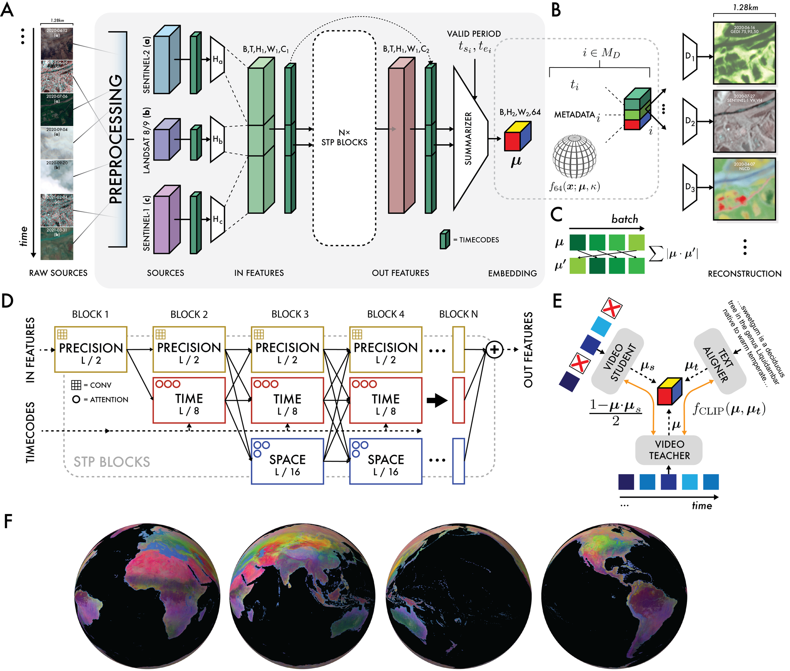

**[S048]**

**Original:**
sor.                                                             arbitrary timestamp (e.g., dense, superresolved LiDAR profiles from GEDI). We update the parameters in the entire network to minimize the error totaling ∼6PiB after replication.                                between 𝑦𝑖′ and 𝑦𝑖 , a target source frame randomly selected to intersect the valid period and potentially held out of the inputs. The error metS2.2. Training algorithm ric varies depending on the source, and accounts S2.2.1. Simulating a continuous observation                      for spatial misregistration of the instrument, missrecord                                                   ing data, and 𝑦𝑖′ vs. 𝑦𝑖 resolution mismatches as is the case when our nominal embedding resolution It is critical that embeddings should encapsulate                (10𝑚2 ) does not match the source’s original resotemporal dynamics. In practice this means the                    lution. We minimize cross-entropy loss for cateresulting embedding can differentiate between                    gorical sources, and L1 error for non-categorical similar surface conditions with different temporal               sources. ordering; for example differentiating between fields with the same crops where the planting                      Another unique requirement of working with happened at different times.                                     EO data is that our model must be robust to the highly sparse nature of EO data sources. To reFor time conditional summarization following                  duce swath and tiling artifacts during learning, STP, we produce a temporal summary leveragwe utilize an additional forward pass or "stuing time-axial attention pooling based on a single               dent" model trained alongside the "teacher" as learned query feature derived from the valid pedescribed above. The student’s input frames are riod [ 𝑡𝑠 , 𝑡𝑒 ) following a conversion to sinusoidal            randomly dropped, and some input sources are timecodes. This summary is up-sampled to size L                  removed entirely. A key insight is that simply augusing a learned kernel. We then introduce a varimenting the teacher’s inputs in this way does not ational bottleneck with a key innovation: rather                 influence the objective function to reward yieldthan collapse the output spatially, we estimate the              ing near-identical outputs in the same location mean direction across an 𝐿𝑥 𝐿 grid of von Misesand same time period regardless of input comFisher (VMF) distributions in 𝑆63 . This bottleneck              position. We minimize 1 minus the dot product construction permits a high degree of spatial prebetween the teacher and student embeddings, cision without the further fine-tuning that is typboth conditioned on the same valid period, and ical of other unsupervised embedding models,                     the teacher and student share parameters. and provides a mechanism to parameterize the "smoothness" of a given embedding manifold via the VMF concentration.                                           S2.2.2. Learning algorithm

**中文:**
sor. arbitrary timestamp (e.g., dense, superresolved LiDAR profiles from GEDI（全球生态系统动态调查）). We update the parameters in the entire network to minimize the error totaling ∼6PiB after replication. between 𝑦𝑖′ and 𝑦𝑖 , a target source 帧 randomly selected to intersect the valid period and potentially held out of the inputs. The error metS2.2. 训练 algorithm ric varies depending on the source, and accounts S2.2.1. Simulating a continuous observation for spatial misregistration of the instrument, missrecord ing data, and 𝑦𝑖′ vs. 𝑦𝑖 resolution mismatches as is the case when our nominal embedding resolution It is critical that embeddings should encapsulate (10𝑚2 ) does not match the source’s original resotemporal dynamics. In practice this means the lution. We minimize 交叉熵 损失 for cateresulting embedding can differentiate between gorical sources, and L1 error for non-categorical similar surface conditions with different 时序 sources. ordering; for example differentiating between fields with the same crops where the planting Another unique requirement of working with happened at different times. EO data is that our model must be robust to the highly sparse nature of EO data sources. To reFor time conditional summarization following duce swath and tiling artifacts during learning, STP, we produce a 时序 summary leveragwe utilize an additional forward pass or "stuing time-axial 注意力机制 pooling based on a single dent" model trained alongside the "teacher" as learned query feature derived from the valid pedescribed above. The student’s input frames are riod [ 𝑡𝑠 , 𝑡𝑒 ) following a conversion to sinusoidal randomly dropped, and some input sources are timecodes. This summary is up-sampled to size L removed entirely. A key insight is that simply augusing a learned kernel. We then introduce a varimenting the teacher’s inputs in this way does not ational 瓶颈层 with a key innovation: rather influence the objective function to reward yieldthan collapse the output spatially, we estimate the ing near-identical outputs in the same location mean direction across an 𝐿𝑥 𝐿 grid of von Misesand same time period regardless of input comFisher (von Mises-Fisher(VMF)分布) distributions in 𝑆63 . This 瓶颈层 position. We minimize 1 minus the dot product construction permits a high degree of spatial prebetween the teacher and student embeddings, cision without the further 微调 that is typboth conditioned on the same valid period, and ical of other unsupervised embedding models, the teacher and student share parameters. and provides a mechanism to parameterize the "smoothness" of a given embedding manifold via the von Mises-Fisher(VMF)分布 concentration. S2.2.2. Learning algorithm

**[S049]**

**Original:**
AEF is trained to conditionally decode embedUnlike other work pursuant of general geospadings from the bottleneck. For each of 𝑖 ∈ 𝑀 𝐷 detial modeling (Tseng et al., 2023), we opted to coded sources, a small decoder network accepts                   minimize the number of sources used as model in-

**中文:**
AEF is trained to conditionally decode embedUnlike other work pursuant of general geospadings from the 瓶颈层. For each of 𝑖 ∈ 𝑀 𝐷 detial modeling (Tseng et al., 2023), we opted to coded sources, a small 解码器 network accepts minimize the number of sources used as model in-

---

## Page 27

**[S050]**

**Original:**
puts to improve performance and avoid ill-posed                   metadata and the observation timecode, and a reconstruction problems where e.g. climatic insmall decoder is applied at each pixel embedding formation must inform reconstruction of radar                     to reconstruct the selected frame. Losses are comdata. We found Sentinel-2 L1C, Sentinel-1 GRD,                    puted against this reconstructed frame, with the Landsat-8 C2 T1 TOA, and Landsat-9 C2 T1 TOA                      nature of the loss 𝑓 𝑖 changing depending on the to be the minimal set providing satisfactory resource 𝑖 ∈ 𝑀 and a source-specific weight (Table constructions across all sources. Inputs were norS2). malized based on global image statistics and no Shift-invariant loss computes the minimum erfurther value modification or augmentation was ror metric across any planar shift in reconstrucperformed. tion up to the specified distance. Re-gridding loss Training proceeded using stochastic mini-batch                 re-grids the reconstruction and target using areagradient descent to minimize the following objecweighted averaging to the given nominal resolutive function with respect to model parameters:                   tion before computing the error metric. All losses utilize per-frame per-pixel weights to account for swath edges and invalid pixels; decisions around 64                            derivation of weights and masks from source data 𝑎 ∑︁                       ∑︁ 𝑙=        𝑓𝑖 (y𝑖 , y′𝑖 ) 𝑤𝑖 + 𝑏    | 𝑢𝑖 · 𝑢′𝑖 |                 are detailed in supplemental materials S1. 𝑀 𝑖∈ 𝑀                     𝑖=1                                            We set the weight of the overall reconstruction 1 − 𝒖 · 𝒖𝑠 +𝑐              + 𝑑 𝑓CLIP ( 𝒖, 𝒖𝑡 ) (3)         objective 𝑎 = 1.0. 2 Reconstructions each randomly selected sumIndicated by weights a, b, c, d of the linear                   marization periods [ 𝑡𝑠′𝑖 , 𝑡𝑒′𝑖 ) for source 𝑖 ∈ 𝑀 𝐷 s.t. combination, the loss components are:                             𝑡𝑒′𝑖 − 𝑡𝑠′𝑖 > 4 days. For each reconstruction objective, a different embedding corresponding to the (a) Reconstruction objective with 𝑓𝑖 varying as a                 unique summarization period is generated, and function of data source.                                     the target timestamp is normalized to this period (b) Batch uniformity objective encouraging a                      on [0, 1). We use the embedding and normaluniform distribution over the training set of                ized timecode to reconstruct source i, alongside embeddings in 𝑆63                                            any source specific metadata specific to the act of (c) Contrastive consistency objective: encouragmeasurement detailed in supplemental materials ing model forward passes with missing inS1. puts to yield embeddings identical to forward passes without missing inputs. (d) Text contrastive objective: align embeddings                  S2.2.4. Batch uniformity objective derived from text descriptions with embeddings derived from the video sequence.                       To increase the utilization of our embedding space, we introduced an objective to encourage Loss weights were normalized prior to training.                 the uniform distribution of a given embedding vector over 𝑆63 . Since, on average, random vecS2.2.3. Reconstruction objective                                  tors on a sphere will be orthogonal (Cai et al., 2013), we can treat this as a necessary condition To facilitate learning, in each row a frame was ranfor our uniformity constraint. Across a batch of domly selected from each source sequence. For                     image-space embedding vectors u, we can rotate sequences serving as model inputs these frames                    this vector through the batch dimension to get u′ . were removed from the input sequence directly.                    Assuming a uniform sample from the training set, Randomly selected frames, and their correspondbatch element pairs 𝑢𝑖 and 𝑢′𝑖 are effectively uniing metadata and timecode, are then used for                      form random sample pairs from the training set, computing reconstruction losses. The model’s                      and we can compute an overall "orthogonality" embedding output is concatenated with sensor                      across the batch:

**中文:**
puts to improve performance and avoid ill-posed metadata and the observation 时间码, and a 重建 problems where e.g. climatic insmall 解码器 is applied at each 像素 embedding formation must inform 重建 of radar to reconstruct the selected 帧. Losses are comdata. We found Sentinel-2 L1C, Sentinel-1 GRD, puted against this reconstructed 帧, with the Landsat-8 C2 T1 TOA, and Landsat-9 C2 T1 TOA nature of the 损失 𝑓 𝑖 changing depending on the to be the minimal set providing satisfactory resource 𝑖 ∈ 𝑀 and a source-specific weight (Table constructions across all sources. Inputs were norS2). malized based on global image statistics and no Shift-invariant 损失 computes the minimum erfurther value modification or augmentation was ror metric across any planar shift in reconstrucperformed. tion up to the specified distance. Re-gridding 损失 训练 proceeded using stochastic mini-批次 re-grids the 重建 and target using areagradient descent to minimize the following objecweighted averaging to the given nominal resolutive function with respect to model parameters: tion before computing the error metric. All losses utilize per-帧 per-像素 weights to account for swath edges and invalid pixels; decisions around 64 derivation of weights and masks from source data 𝑎 ∑︁ ∑︁ 𝑙= 𝑓𝑖 (y𝑖 , y′𝑖 ) 𝑤𝑖 + 𝑏 | 𝑢𝑖 · 𝑢′𝑖 | are detailed in supplemental materials S1. 𝑀 𝑖∈ 𝑀 𝑖=1   We set the weight of the overall 重建 1 − 𝒖 · 𝒖𝑠 +𝑐 + 𝑑 𝑓CLIP ( 𝒖, 𝒖𝑡 ) (3) objective 𝑎 = 1.0. 2 Reconstructions each randomly selected sumIndicated by weights a, b, c, d of the linear marization periods [ 𝑡𝑠′𝑖 , 𝑡𝑒′𝑖 ) for source 𝑖 ∈ 𝑀 𝐷 s.t. combination, the 损失 components are: 𝑡𝑒′𝑖 − 𝑡𝑠′𝑖 > 4 days. For each 重建 objective, a different embedding corresponding to the (a) 重建 objective with 𝑓𝑖 varying as a unique summarization period is generated, and function of data source. the target timestamp is normalized to this period (b) 批次 uniformity objective encouraging a on [0, 1). We use the embedding and normaluniform distribution over the 训练 set of ized 时间码 to reconstruct source i, alongside embeddings in 𝑆63 any source specific metadata specific to the act of (c) Contrastive consistency objective: encouragmeasurement detailed in supplemental materials ing model forward passes with missing inS1. puts to yield embeddings identical to forward passes without missing inputs. (d) Text contrastive objective: align embeddings S2.2.4. 批次 uniformity objective derived from text descriptions with embeddings derived from the 视频（时序图像序列） 序列. To increase the utilization of our embedding space, we introduced an objective to encourage 损失 weights were normalized prior to 训练. the uniform distribution of a given embedding vector over 𝑆63 . Since, on average, random vecS2.2.3. 重建 objective tors on a sphere will be orthogonal (Cai et al., 2013), we can treat this as a necessary condition To facilitate learning, in each row a 帧 was ranfor our uniformity constraint. Across a 批次 of domly selected from each source 序列. For image-space embedding vectors u, we can rotate sequences serving as model inputs these frames this vector through the 批次 dimension to get u′ . were removed from the input 序列 directly. Assuming a uniform sample from the 训练 set, Randomly selected frames, and their correspondbatch element pairs 𝑢𝑖 and 𝑢′𝑖 are effectively uniing metadata and 时间码, are then used for form random sample pairs from the 训练 set, computing 重建 losses. The model’s and we can compute an overall "orthogonality" embedding output is concatenated with sensor across the 批次:

---

## Page 28

**[S051]**

**Original:**
Data Source                                      Shift invariRe-gridding loss    Error metric          Loss weight ant       loss   spacing (m)                               (𝑤𝑖 ) distance (m) Sentinel-2 L1C                                   20               –                   L1                     1.0 Sentinel-1 GRD                                   20               –                   L1                     1.0 Landsat Group                                    –                30                  L1                     1.0 PALSAR-2 ScanSAR L2.2                            –                30                  L1                     1.0 ERA5-Land Monthly Aggregated                     –                –                   L1                     1.0 GEDI L2A                                         –                20                  L1                     1.0 GRACE Monthly Mass Grids V4                      –                1280                L1                     0.5 Copernicus DEM GLO-30                            –                30                  L1                     1.0 NLCD Group                                       –                30                  Cross Entropy          0.5

**中文:**
Data Source Shift invariRe-gridding 损失 Error metric 损失 weight ant 损失 spacing (m) (𝑤𝑖 ) distance (m) Sentinel-2 L1C 20 – L1 1.0 Sentinel-1 GRD 20 – L1 1.0 Landsat Group – 30 L1 1.0 PALSAR-2 ScanSAR L2.2 – 30 L1 1.0 ERA5-Land Monthly Aggregated – – L1 1.0 GEDI（全球生态系统动态调查） L2A – 20 L1 1.0 GRACE Monthly Mass Grids V4 – 1280 L1 0.5 Copernicus（哥白尼计划） DEM（数字高程模型） GLO-30 – 30 L1 1.0 NLCD（美国国家土地覆盖数据库） Group – 30 Cross Entropy 0.5

**[T052] Table S2**

**Original:**
> Table S2 | Loss configurations for data sources

**中文:**
> Table S2 | 损失 configurations for data sources

**[S053]**

**Original:**
S2.2.5. Consistency objective

**中文:**
S2.2.5. Consistency objective

**[S054]**

**Original:**
Earth observation data is irregular in space and 64 ∑︁                              time. Acquisition campaigns are not always 𝐵𝑎𝑡𝑐ℎ𝑈𝑛𝑖 𝑓 𝑜𝑟𝑚𝑖𝑡 𝑦 =          | 𝑢𝑖 · 𝑢′𝑖 |     (4)     global, have acquisition periods unique from 𝑖=1 other instruments, vary as a function of solar angle, come on and offline for a number of reasons, and atmospheric conditions at the time an observation is made are unpredictable at local scales. We minimize this batch uniformity term durAs our model is intended to produce continuous ing training. We note that alone, there are perembedding fields over arbitrary regions of Earth’s fectly valid non-uniform distributions for which surface, it is crucial that we reduce the effect of this tends to zero e.g. clusters of points on opthese space and time varying irregularities. Unposite poles. In practice, setting the weight in like purely supervised models we cannot rely on the loss combination for this term > 0 prevented labels to help reduce noisy artifacts. Additionally, collapse scenarios where this term would tend to we need to ensure that our model provides con- 1 otherwise. We ultimately settled on a weight of sistent embeddings for a location regardless of 𝑏 = 0.05. the condition of the inputs as we want to model While tuning was not performed, as expected,                    Earth’s underlying landscape dynamics not the evaluation scores improved when batch unimeasurement process. formity was present, or there was no differTo achieve this, we run our forward pass twice. ence. To better understand the effect of batch We utilize a teacher model that has access to all uniformity, we performed a sweep of 𝑏 ∈ inputs, and a student model that has its inputs [0, 0.001, 0.005, 0.01, 0.1]. We found settings of perturbed. Perturbation proceeds in two stages: 𝑏 = 0 and 𝑏 = 0.1 to be the least performant across evaluations, and 𝑏 = 0.005 to be optimal. For some evals, the difference in performance was                      1. Entirely drop a source from the inputs. The notable e.g. GLanCE land cover max-trial linear                           Landsat Group is randomly dropped 30% transfer BA scores were ~66.6% for 𝑏 = 0.005                              of the time, and Sentinel-1 GRD is dropped and ~64.7% for b = 0. For others, there was                               30% of the time. Sentinel-2 L1C is never only a small improvement e.g. LUCAS land cover                            dropped. max-trial linear transfer BA scores were ~34.7%                        2. Select one of three perturbation strategies: for 𝑏 = 0.005 and ~34.2% for 𝑏 = 0.                                        (a) Randomly drop time-steps across all

**中文:**
地球观测 data is irregular in space and 64 ∑︁ time. Acquisition campaigns are not always 𝐵𝑎𝑡𝑐ℎ𝑈𝑛𝑖 𝑓 𝑜𝑟𝑚𝑖𝑡 𝑦 = | 𝑢𝑖 · 𝑢′𝑖 | (4) global, have acquisition periods unique from 𝑖=1 other instruments, vary as a function of solar angle, come on and offline for a number of reasons, and atmospheric conditions at the time an observation is made are unpredictable at local scales. We minimize this 批次 uniformity term durAs our model is intended to produce continuous ing 训练. We note that alone, there are perembedding fields over arbitrary regions of Earth’s fectly valid non-uniform distributions for which surface, it is crucial that we reduce the effect of this tends to zero e.g. clusters of points on opthese space and time varying irregularities. Unposite poles. In practice, setting the weight in like purely supervised models we cannot rely on the 损失 combination for this term > 0 prevented labels to help reduce noisy artifacts. Additionally, collapse scenarios where this term would tend to we need to ensure that our model provides con- 1 otherwise. We ultimately settled on a weight of sistent embeddings for a location regardless of 𝑏 = 0.05. the condition of the inputs as we want to model While tuning was not performed, as expected, Earth’s underlying landscape dynamics not the 评估 scores improved when 批次 unimeasurement process. formity was present, or there was no differTo achieve this, we run our forward pass twice. ence. To better understand the effect of 批次 We utilize a teacher model that has access to all uniformity, we performed a sweep of 𝑏 ∈ inputs, and a student model that has its inputs [0, 0.001, 0.005, 0.01, 0.1]. We found settings of perturbed. Perturbation proceeds in two stages: 𝑏 = 0 and 𝑏 = 0.1 to be the least performant across evaluations, and 𝑏 = 0.005 to be optimal. For some evals, the difference in performance was 1. Entirely drop a source from the inputs. The notable e.g. GLanCE（全球土地覆盖估算） 土地覆盖 max-trial linear Landsat Group is randomly dropped 30% transfer BA scores were ~66.6% for 𝑏 = 0.005 of the time, and Sentinel-1 GRD is dropped and ~64.7% for b = 0. For others, there was 30% of the time. Sentinel-2 L1C is never only a small improvement e.g. LUCAS（欧盟土地利用/覆盖统计调查） 土地覆盖 dropped. max-trial linear transfer BA scores were ~34.7% 2. Select one of three perturbation strategies: for 𝑏 = 0.005 and ~34.2% for 𝑏 = 0. (a) Randomly drop time-steps across all

---

## Page 29

**[S055]**

**Original:**
sources. 30% of images from the Landa training row’s geometry and date range were sat Group are randomly dropped, 30%                     stored with the row. During training, a random of images from Sentinel-1 GRD are                       text point is selected if available, and we choose a dropped, and 50% of images from                         unique random summary period [ 𝑡𝑠′′ , 𝑡𝑒′′ ) s.t. 𝑡𝑒′′ − Sentinel-2 L1C are dropped.                             𝑡𝑠′′ > 4 days intersecting the annual period of the (b) The latter six months of the input seteacher model’s inputs. We condition an MLP quence across all sources is dropped                    decoder on the language model’s output with (forecasting-like).                                     this summary period to produce an embedding (c) The former six months of the input sealigned with the teacher model using standard quence across all sources is dropped                    CLIP loss (Radford et al., 2021). (backcasting-like). We set the weight of the overall text-contrastive objective 𝑑 = 0.001. If perturbation strategy (a) is used, we choose a unique, random summarization period [ 𝑡𝑠′ , 𝑡𝑒′ ) s.t. 𝑡𝑒′ − 𝑡𝑠′ > 4 days intersecting the annual period           S2.3. Model training of the non-perturbed inputs. If strategy (b) is used, we choose a summarization period across                    AEF was trained for 56 hours on 512 TPU v4 the latter six months of the input sequence. If                  devices over 100k steps in batches of 256 video strategy (𝑐) is used, we choose a summarization                  sequences. Training was sharded by batch, and period across the former six months of the input                 further by sequence s.t. two TPU v4 devices were sequence. We note sequence start and end times                   allocated to each batch element. Input sequences are not aligned to any calendar unit.                            were subsampled from the training row to 103 frames ( 𝑁𝑖 ), comprising 65 Sentinel-2 L1C, 17 The student and teacher model now embed                        Sentinel-1 GRD, and 21 Landsat Group observatheir inputs based on the shared summary period.                 tions. Masks were substituted for unavailable or The teacher must produce an embedding that the                   perturbed frames (see supplemental materials student can mimic with limited inputs while the                  S2.2.3). student must produce an embedding that agrees with the teacher. Given teacher embeddings and                     Learning utilized the Adam optimization stratstudent embeddings s, we minimize:                               egy (Kingma, 2014), with a piecewise linear learning rate schedule from 0 to 1𝑒−4 over 1 − 𝝁 · 𝝁𝑠                    [0, 1e3) steps, then 1e−4 to 0 over [1e3, 1e5]. 𝐶𝑜𝑛𝑠𝑖𝑠𝑡𝑒𝑛𝑐 𝑦𝐿𝑜𝑠𝑠 =                            (5)     Learning hyperparameters were selected to min- 2 imize training loss while maintaining satisfacWe set the weight of the overall contrastive obtory reconstruction visual quality, stability in the jective 𝑐 = 0.02 to balance reconstruction visual                contrastive and batch uniformity objectives, and quality and maximize student / teacher agreedesired performance on a set of diagnostic evalment. We note that while considerably reduced,                   uations designed to assess whether embeddings tile artifacts are still visible in our embedding                could distinguish the presence of specific input fields layers resulting from irregular inputs, and               sources. these could be removed in future work with a more aggressive consistency objective term. S2.4. Architectural details S2.2.6. Text-contrastive objective                               We used a model dimension of 𝐷𝑃 = 128 along the precision path, 𝐷𝑇 = 512 along the time path, We co-train with a frozen language model (Gemand 𝐷𝑆 = 1024 along the space path. 15 STP ini et al., 2024) with the goal that embeddings blocks were used in total. Implicit decoders were characterizing points on Earth’s surface with simtwo-hidden-layer MLPs with a width of 512. The ilar semantics will cluster together. VMF bottlenecks utilized a fixed concentration All points and corresponding text intersecting                 (𝜅) of 8e3.

**中文:**
sources. 30% of images from the Landa 训练 row’s geometry and date range were sat Group are randomly dropped, 30% stored with the row. During 训练, a random of images from Sentinel-1 GRD are text point is selected if available, and we choose a dropped, and 50% of images from unique random summary period [ 𝑡𝑠′′ , 𝑡𝑒′′ ) s.t. 𝑡𝑒′′ − Sentinel-2 L1C are dropped. 𝑡𝑠′′ > 4 days intersecting the annual period of the (b) The latter six months of the input seteacher model’s inputs. We condition an MLP quence across all sources is dropped 解码器 on the language model’s output with (forecasting-like). this summary period to produce an embedding (c) The former six months of the input sealigned with the teacher model using standard quence across all sources is dropped CLIP 损失 (Radford et al., 2021). (backcasting-like). We set the weight of the overall text-contrastive objective 𝑑 = 0.001. If perturbation strategy (a) is used, we choose a unique, random summarization period [ 𝑡𝑠′ , 𝑡𝑒′ ) s.t. 𝑡𝑒′ − 𝑡𝑠′ > 4 days intersecting the annual period S2.3. Model 训练 of the non-perturbed inputs. If strategy (b) is used, we choose a summarization period across AEF was trained for 56 hours on 512 TPU v4 the latter six months of the input 序列. If devices over 100k steps in batches of 256 视频（时序图像序列） strategy (𝑐) is used, we choose a summarization sequences. 训练 was sharded by 批次, and period across the former six months of the input further by 序列 s.t. two TPU v4 devices were 序列. We note 序列 start and end times allocated to each 批次 element. Input sequences are not aligned to any calendar unit. were subsampled from the 训练 row to 103 frames ( 𝑁𝑖 ), comprising 65 Sentinel-2 L1C, 17 The student and teacher model now embed Sentinel-1 GRD, and 21 Landsat Group observatheir inputs based on the shared summary period. tions. Masks were substituted for unavailable or The teacher must produce an embedding that the perturbed frames (see supplemental materials student can mimic with limited inputs while the S2.2.3). student must produce an embedding that agrees with the teacher. Given teacher embeddings and Learning utilized the Adam optimization stratstudent embeddings s, we minimize: egy (Kingma, 2014), with a piecewise linear 学习率 schedule from 0 to 1𝑒−4 over 1 − 𝝁 · 𝝁𝑠 [0, 1e3) steps, then 1e−4 to 0 over [1e3, 1e5]. 𝐶𝑜𝑛𝑠𝑖𝑠𝑡𝑒𝑛𝑐 𝑦𝐿𝑜𝑠𝑠 = (5) Learning hyperparameters were selected to min- 2 imize 训练 损失 while maintaining satisfacWe set the weight of the overall contrastive obtory 重建 visual quality, stability in the jective 𝑐 = 0.02 to balance 重建 visual contrastive and 批次 uniformity objectives, and quality and maximize student / teacher agreedesired performance on a set of diagnostic evalment. We note that while considerably reduced, uations designed to assess whether embeddings tile artifacts are still visible in our embedding could distinguish the presence of specific input fields layers resulting from irregular inputs, and sources. these could be removed in future work with a more aggressive consistency objective term. S2.4. Architectural details S2.2.6. Text-contrastive objective We used a model dimension of 𝐷𝑃 = 128 along the precision path, 𝐷𝑇 = 512 along the time path, We co-train with a frozen language model (Gemand 𝐷𝑆 = 1024 along the space path. 15 STP ini et al., 2024) with the goal that embeddings blocks were used in total. Implicit decoders were characterizing points on Earth’s surface with simtwo-hidden-layer MLPs with a width of 512. The ilar semantics will cluster together. von Mises-Fisher(VMF)分布 bottlenecks utilized a fixed concentration All points and corresponding text intersecting (𝜅) of 8e3.

---

## Page 30

**[S056]**

**Original:**
S3. Evaluation datasets                                          had representation of different temporal aggregations across our final set of evaluations (Table We assess AEF performance using a set of eval-                   1). For all candidate datasets, we required that uation datasets we derived from ten publiclythe georeference of a given annotation was not available reference datasets representing archetytied to a specific observation. In the spirit of typipal classification, regression, and change deteccal computer vision benchmarks or evaluations, tion use cases (Table 1).                                        many recent general purpose geospatial evaluations provide source imagery (see Schmitt et al. (2023) for review), though we argue this is not S3.1. Selection criteria                                         appropriate for assessing general purpose geospatial analysis approaches that may leverage time We selected publicly available datasets to repreand additional sources uniquely. Were we to resent a range of different real-world classification,             quire that all baseline approaches tested share regression and change detection applications. We                 the same sources, many would be artificially pedid not generate any of our own annotations                      nalized or would not have been usable at all. As for these evaluations; rather, we identified exmost observational data is tied to a ground truth, isting datasets that represented high-quality obnot a specific measurement, we argue that future servation/measurement information and could                      geospatial benchmarking work moves towards be used with minimal processing. We priorievaluations with precise timing and without reqtized reference datasets with human-assigned                     uisite inputs. We present our evaluation suite as interpretations or physical measurements over                    an example of such. model-generated predictions. In some cases (like OpenET), we do include “model proxy tasks” that sample model-generated predictions, but                     S3.2. Processing these were selected with strong justification, e.g., proxying a computationally intensive ensemble                    All reference datasets were processed to the stanapproach. We generally avoided harmonized                        dard format and properties in Table S3. In some datasets that combine multiple sets of annotacases, e.g., LCMAP, LUCAS, and Canada crops, tions initially collected with differing protocolmultiple evals were created using different hierars/criteria since this makes it more difficult to unchies or combinations of source labels, resulting derstand/interpret results/errors. Given we are                  in a final total of 15 derivative datasets (Table 1). evaluating a global model, we attempted to conPoint observations were filtered to guarantee a struct an overall suite with large area / global                 minimum distance of 1.28 km between sampled coverage. We preferred point measurements or                     points in order to reduce spatial autocorrelation annotations over polygons, since reasoning about                 between training and test sites (and this process labels for a specific point rather than over a larger            will be hereafter referred to as “spatial proximity area is more straightforward, and this simplifies                filtering”). Sample points were allocated to train sampling of embeddings and other feature vecand test splits such that the training datasets were tors for comparisons across approaches. We only                  balanced by class (or regularly spaced bins in the selected datasets where point coordinate data                    case of regression datasets), with no per-class (longitude, latitude) in decimal degrees was sufsample exceeding 300 points and the remainder ficiently precise relative to a nominal 10-meter                 of the points allocated to an unbalanced test split. resolution, i.e., at least four decimal points of                When possible, we used existing Google Earth precision (0.0001), which is about 11.1m at the                  Engine assets for publicly available datasets; othequator. Given our focus on temporal precision,                  erwise reference datasets were downloaded from we also required that labels have a clearly defined              archived sources. Additional details on sources “valid period” over which the label could be reaand processing for individual datasets are prosonably applied, i.e., a range or instant (annual,               vided in the following sections, and we make our monthly, single-date), and this period must inprocessed evaluation datasets available as a suptersect 2017 onward, and we ensured that we                      plemental dataset (DeepMind, 2025a).

**中文:**
S3. 评估 datasets had representation of different 时序 aggregations across our final set of evaluations (Table We assess AEF performance using a set of eval- 1). For all candidate datasets, we required that uation datasets we derived from ten publiclythe georeference of a given annotation was not available reference datasets representing archetytied to a specific observation. In the spirit of typipal 分类, 回归, and change deteccal computer vision benchmarks or evaluations, tion use cases (Table 1). many recent general purpose 地理空间 evaluations provide source imagery (see Schmitt et al. (2023) for review), though we argue this is not S3.1. Selection criteria appropriate for assessing general purpose 地理空间 analysis approaches that may leverage time We selected publicly available datasets to repreand additional sources uniquely. Were we to resent a range of different real-world 分类, quire that all baseline approaches tested share 回归 and 变化检测 applications. We the same sources, many would be artificially pedid not generate any of our own annotations nalized or would not have been usable at all. As for these evaluations; rather, we identified exmost observational data is tied to a 地面真值, isting datasets that represented high-quality obnot a specific measurement, we argue that future servation/measurement information and could 地理空间 benchmarking work moves towards be used with minimal processing. We priorievaluations with precise timing and without reqtized reference datasets with human-assigned uisite inputs. We present our 评估 suite as interpretations or physical measurements over an example of such. model-generated predictions. In some cases (like OpenET（开放蒸散发）), we do include “model proxy tasks” that sample model-generated predictions, but S3.2. Processing these were selected with strong justification, e.g., proxying a computationally intensive ensemble All reference datasets were processed to the stanapproach. We generally avoided harmonized dard format and properties in Table S3. In some datasets that combine multiple sets of annotacases, e.g., LCMAP, LUCAS（欧盟土地利用/覆盖统计调查）, and Canada crops, tions initially collected with differing protocolmultiple evals were created using different hierars/criteria since this makes it more difficult to unchies or combinations of source labels, resulting derstand/interpret results/errors. Given we are in a final total of 15 derivative datasets (Table 1). evaluating a global model, we attempted to conPoint observations were filtered to guarantee a struct an overall suite with large area / global minimum distance of 1.28 km between sampled coverage. We preferred point measurements or points in order to reduce spatial autocorrelation annotations over polygons, since reasoning about between 训练 and test sites (and this process labels for a specific point rather than over a larger will be hereafter referred to as “spatial proximity area is more straightforward, and this simplifies filtering”). Sample points were allocated to train sampling of embeddings and other feature vecand test splits such that the 训练 datasets were tors for comparisons across approaches. We only balanced by class (or regularly spaced bins in the selected datasets where point coordinate data case of 回归 datasets), with no per-class (经度, 纬度) in decimal degrees was sufsample exceeding 300 points and the remainder ficiently precise relative to a nominal 10-meter of the points allocated to an unbalanced test split. resolution, i.e., at least four decimal points of When possible, we used existing Google Earth precision (0.0001), which is about 11.1m at the Engine assets for publicly available datasets; othequator. Given our focus on 时序 precision, erwise reference datasets were downloaded from we also required that labels have a clearly defined archived sources. Additional details on sources “valid period” over which the label could be reaand processing for individual datasets are prosonably applied, i.e., a range or instant (annual, vided in the following sections, and we make our monthly, single-date), and this period must inprocessed 评估 datasets available as a suptersect 2017 onward, and we ensured that we plemental 数据集 (DeepMind, 2025a).

---

## Page 31

**[S057]**

**Original:**
Property                          Units           Notes x                                 decimal deLongitude coordinate. Must have at least 10−4 precision to be grees           considered valid at ∼10m resolution. y                                 decimal deLatitude coordinate. Must have at least 10−4 precision to be congrees           sidered valid at ∼10m resolution. label                             numeric        Column recording the label or measurement field used for evalu- (int    or     ation. Either dense sequential remapping of ‘label_name’ values float)         (classification) or measurement value (regression). label_name                        str             (optional) This field can be used to preserve values/codes from the original dataset for readability and visualization. Not required for regression evals. valid_time_start_ms               millis          Start and end times defining the range over which the label or valid_time_end_ms                                 measurement is valid (may be same for single-date measurements) and over-which the embedding summary is created. Should not extend more than 6 months before or after the support period. support_time_start_ms             millis          Start and end times defining a support period for informing predicsupport_time_end_ms                               tion. This is the period over which input data is fetched for each row. It must be no longer than 1 year in length. split                             str (’train’    Each label/observation (row) should be assigned to a fixed or ’test’)      train/test split. shard                             numeric         (optional) Assign a shard to each row for efficient ingestion. A (int)           shard should be associated with no more than 2000 rows. label_before                      numeric         Integer label for “before” class. (int) label_before_name                 str             This is used to preserve “before” values/codes from the original dataset. label_after                       numeric         Integer label for “after” class (int) label_after_name                  str             This is used to preserve “after” values/codes from the original dataset. valid_time_start_before_ms        millis         Start and end times defining the range over which the “before” and valid_time_end_before_ms                         “after” labels/measurements are valid (may be same for single-date valid_time_start_after_ms                        measurements) and over-which embedding summaries are created. valid_time_end_after_ms support_time_start_before_ms      millis          Start and end times defining the before and after change support support_time_end_before_ms                        periods. support_time_start_after_ms support_time_end_after_ms

**中文:**
Property Units Notes x decimal deLongitude coordinate. Must have at least 10−4 precision to be grees considered valid at ∼10m resolution. y decimal deLatitude coordinate. Must have at least 10−4 precision to be congrees sidered valid at ∼10m resolution. label numeric Column recording the label or measurement field used for evalu- (int or ation. Either dense sequential remapping of ‘label_name’ values float) (分类) or measurement value (回归). label_name str (optional) This field can be used to preserve values/codes from the original 数据集 for readability and visualization. Not required for 回归 evals. valid_time_start_ms millis Start and end times defining the range over which the label or valid_time_end_ms measurement is valid (may be same for single-date measurements) and over-which the embedding summary is created. Should not extend more than 6 months before or after the support period. support_time_start_ms millis Start and end times defining a support period for informing predicsupport_time_end_ms tion. This is the period over which input data is fetched for each row. It must be no longer than 1 year in length. split str (’train’ Each label/observation (row) should be assigned to a fixed or ’test’) train/test split. shard numeric (optional) Assign a shard to each row for efficient ingestion. A (int) shard should be associated with no more than 2000 rows. label_before numeric Integer label for “before” class. (int) label_before_name str This is used to preserve “before” values/codes from the original 数据集. label_after numeric Integer label for “after” class (int) label_after_name str This is used to preserve “after” values/codes from the original 数据集. valid_time_start_before_ms millis Start and end times defining the range over which the “before” and valid_time_end_before_ms “after” labels/measurements are valid (may be same for single-date valid_time_start_after_ms measurements) and over-which embedding summaries are created. valid_time_end_after_ms support_time_start_before_ms millis Start and end times defining the before and after change support support_time_end_before_ms periods. support_time_start_after_ms support_time_end_after_ms

**[T058] Table S3**

**Original:**
> Table S3 | Evaluation dataset properties. Fields in italics are required for change detection datasets

**中文:**
> Table S3 | 评估 数据集 properties. Fields in italics are required for 变化检测 datasets

---

## Page 32

**[S060]**

**Original:**
label     label name                  train       test 0         Impervious                  300         192 1         Grass/forb/herb             300         13545 2         Trees                       300         6815 3         Water                       300         1326 4         Barren                      300         970 5         Shrubs                      300         1862

**中文:**
label label name train test 0 Impervious 300 192 1 Grass/forb/herb 300 13545 2 Trees 300 6815 3 Water 300 1326 4 Barren 300 970 5 Shrubs 300 1862

**[T061] Table S4**

**Original:**
> Table S4 | LCMAP land cover classes and sample

**中文:**
> Table S4 | LCMAP 土地覆盖 classes and sample

**[S062]**

**Original:**
counts by split.

**中文:**
counts by split.

**[S063]**

**Original:**
S3.3. Evaluation datasets

**中文:**
S3.3. 评估 datasets

**[S064]**

**Original:**
S3.3.1. LCMAP

**中文:**
S3.3.1. LCMAP

**[S065]**

**Original:**
LCMAP (Land Change Monitoring, Assessment, and Projection) is a USGS project aimed at generating annual land cover and land cover change maps for the United States (Brown et al., 2020). The LCMAP CONUS Reference Dataset is a collection of human-interpreted labels for 27,000 30m x 30m plots across CONUS, which includes                       Figure S3 | Distribution of LCMAP land use/cover an initial sample of 25,000 randomly distributed                   sample locations. points and a supplemental sample of 2,000 stratified random "intensification" sites (Pengra et al., 2023). Land use, land cover, and change process information for each plot are available for annual timesteps for the year 1984 to 2021. We use the LCMAP reference datasets, which include multiple label properties and distinct legends, to create two classification datasets (LCMAP land cover and LCMAP land use) and two change detection evaluation datasets (LCMAP                          label     label name                  train       test land cover change and LCMAP land use change).                        0         Developed                   300         1368 These datasets are representative of the con-                        1         Agriculture                 300         4116 tiguous United States (CONUS; Figures S3 and 2         Forest                      300         7843 S4), and we take performance on LCMAP subdatasets as indicative of performance for oper-                      3         Other                       300         1533 ational national-scale land use and land cover                       4         Rangeland                   300         9510 mapping and change detection.                                        5         Non-forest Wetland          300         343

**中文:**
LCMAP (Land Change Monitoring, Assessment, and Projection) is a USGS（美国地质调查局） project aimed at generating annual 土地覆盖 and 土地覆盖 change maps for the United States (Brown et al., 2020). The LCMAP CONUS Reference 数据集 is a collection of human-interpreted labels for 27,000 30m x 30m plots across CONUS, which includes Figure S3 | Distribution of LCMAP 土地利用/cover an initial sample of 25,000 randomly distributed sample locations. points and a supplemental sample of 2,000 stratified random "intensification" sites (Pengra et al., 2023). 土地利用, 土地覆盖, and change process information for each plot are available for annual timesteps for the year 1984 to 2021. We use the LCMAP reference datasets, which include multiple label properties and distinct legends, to create two 分类 datasets (LCMAP 土地覆盖 and LCMAP 土地利用) and two 变化检测 评估 datasets (LCMAP label label name train test 土地覆盖 change and LCMAP 土地利用 change). 0 Developed 300 1368 These datasets are representative of the con- 1 Agriculture 300 4116 tiguous United States (CONUS; Figures S3 and 2 Forest 300 7843 S4), and we take performance on LCMAP subdatasets as indicative of performance for oper- 3 Other 300 1533 ational national-scale 土地利用 and 土地覆盖 4 Rangeland 300 9510 mapping and 变化检测. 5 Non-forest Wetland 300 343

**[T066] Table S5**

**Original:**
> Table S5 | LCMAP land use classes and sample

**中文:**
> Table S5 | LCMAP 土地利用 classes and sample

**[S067]**

**Original:**
LCMAP land cover & LCMAP land use The                              counts by split. LCMAP land cover and land use evaluation datasets are based on the "dominant_landcover" and "dominant_landuse" fields in the source LCMAP dataset. The LCMAP land cover legend includes six broad cover-type classes (Table S4),

**中文:**
LCMAP 土地覆盖 & LCMAP 土地利用 The counts by split. LCMAP 土地覆盖 and 土地利用 评估 datasets are based on the "dominant_landcover" and "dominant_landuse" fields in the source LCMAP 数据集. The LCMAP 土地覆盖 legend includes six broad cover-type classes (Table S4),

---

## Page 33

**[S068]**

**Original:**
label     label name                 train        test 0         no change                  300          1315 1         change                     300          405

**中文:**
label label name train test 0 no change 300 1315 1 change 300 405

**[T069] Table S7**

**Original:**
> Table S7 | LCMAP land cover change classes and

**中文:**
> Table S7 | LCMAP 土地覆盖 change classes and

**[S070]**

**Original:**
sample counts by split.

**中文:**
sample counts by split.

**[S071]**

**Original:**
LCMAP land cover change & LCMAP land use change Though the source LCMAP dataset includes change process labels, we generated new change labels directly from "dominant_landcover", "dominant_landuse", and "image_year" fields for parity with the LCMAP classification evaluations. We again subset the full reference dataset to 2017-2021 to overlap with our period of interest. We then label pairs of sequential years where the label is not consistent

**中文:**
LCMAP 土地覆盖 change & LCMAP 土地利用 change Though the source LCMAP 数据集 includes change process labels, we generated new change labels directly from "dominant_landcover", "dominant_landuse", and "image_year" fields for parity with the LCMAP 分类 evaluations. We again subset the full reference 数据集 to 2017-2021 to overlap with our period of interest. We then label pairs of sequential years where the label is not consistent

**[F006] Figure S4**

**Original:**
> Figure S4 | Distribution of LCMAP land cover

**中文:**
> Figure S4 | Distribution of LCMAP 土地覆盖

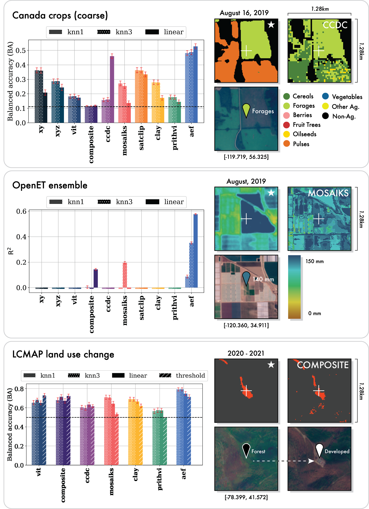

**[S073]**

**Original:**
(i.e., yeart and yeart+1 have different labels) as change sample locations. “change” and years with consistent labels as “no change”. We select only one year-pair for each reflabel     label name                 train        test            erence point, and we sample a total of 300 points per class for land cover change (Table S7) and 0         no change                  150          549 150 points per class for land use change (Table 1         change                     150          142             S6). Because we want to compare embeddings for two annual labels, we set a valid time start and

**中文:**
(i.e., yeart and yeart+1 have different labels) as change sample locations. “change” and years with consistent labels as “no change”. We select only one year-pair for each reflabel label name train test erence point, and we sample a total of 300 points per class for 土地覆盖 change (Table S7) and 0 no change 150 549 150 points per class for 土地利用 change (Table 1 change 150 142 S6). Because we want to compare embeddings for two annual labels, we set a valid time start and

**[T074] Table S6**

**Original:**
> Table S6 | LCMAP land use change classes and                       end for both the before and after periods, where

**中文:**
> Table S6 | LCMAP 土地利用 change classes and end for both the before and after periods, where

**[S075]**

**Original:**
sample counts by split.                                            both periods are one year in length from January 1 to January 1 of the following year and assigned based on the "image_year" property in the source while the LCMAP land use legend includes an aldataset. Our final LCMAP land cover change evalternative set of six land use categories (Table S5).               uation has a total of 600 training points and 1,720 The full LCMAP dataset includes labels for all                     test points, and our final LCMAP land use change sample locations across all years; we subset the                   evaluation has a total of 300 training points and full set of interpretations to 2017-2021 to overlap                691 test points after pre-processing and spatial with our period of interest, and randomly select                   proximity filtering. one year from the time series of labels for each sample point (based on the ’image_year’ propS3.3.2. LUCAS erty). We sample a total of 300 points from each label class, with the remaining points allocated to                The LUCAS (Land Use/Cover Area frame statisthe test split. For all points, the valid period (i.e.,            tical Survey) was designed to gather informathe period over which embeddings are generattion on land cover and land use updated via ed/summarized) is assumed to be January 1 of                       regular harmonised surveys across all European the "image_year" from the source dataset through                   Member States in the survey years 2018 and January 1 of the following year. Our final LCMAP                   2022/2023 (Toth et al., 2013).The survey inland cover evaluation has a total of 1800 traincludes over 250,000 sample points throughout ing points and 24,710 test points, while our final                 the EU (Figure S5), and the survey is repeated LCMAP land use evaluation also has a total of                      every few years to identify changes to land use 1800 training points and 24,713 test points after                  and cover. One of the primary purposes of the pre-processing and spatial proximity filtering.                    LUCAS dataset is to generate estimates of the

**中文:**
sample counts by split. both periods are one year in length from January 1 to January 1 of the following year and assigned based on the "image_year" property in the source while the LCMAP 土地利用 legend includes an aldataset. Our final LCMAP 土地覆盖 change evalternative set of six 土地利用 categories (Table S5). uation has a total of 600 训练 points and 1,720 The full LCMAP 数据集 includes labels for all test points, and our final LCMAP 土地利用 change sample locations across all years; we subset the 评估 has a total of 300 训练 points and full set of interpretations to 2017-2021 to overlap 691 test points after pre-processing and spatial with our period of interest, and randomly select proximity filtering. one year from the time series of labels for each sample point (based on the ’image_year’ propS3.3.2. LUCAS（欧盟土地利用/覆盖统计调查） erty). We sample a total of 300 points from each label class, with the remaining points allocated to The LUCAS（欧盟土地利用/覆盖统计调查） (土地利用/Cover Area 帧 statisthe test split. For all points, the valid period (i.e., tical Survey) was designed to gather informathe period over which embeddings are generattion on 土地覆盖 and 土地利用 updated via ed/summarized) is assumed to be January 1 of regular harmonised surveys across all European the "image_year" from the source 数据集 through Member States in the survey years 2018 and January 1 of the following year. Our final LCMAP 2022/2023 (Toth et al., 2013).The survey inland cover 评估 has a total of 1800 traincludes over 250,000 sample points throughout ing points and 24,710 test points, while our final the EU (Figure S5), and the survey is repeated LCMAP 土地利用 评估 also has a total of every few years to identify changes to 土地利用 1800 训练 points and 24,713 test points after and cover. One of the primary purposes of the pre-processing and spatial proximity filtering. LUCAS（欧盟土地利用/覆盖统计调查） 数据集 is to generate estimates of the

---

## Page 34

**[S076]**

**Original:**
LUCAS land cover Our LUCAS land cover evaluation uses the "lc1" label. After the initial filtering described above, we additionally checked that the ‘lc1’ label is not null, and that percent cover for the "lc1" label ("lc1_perc") is classified as "50 - 75 %" or "> 75 %". This results in a label dataset with 40 land cover classes (Table S8). We assume land cover represents an instantaneous observation of state, so we set the valid time to the time at which the land cover observation was made (i.e., time start = time end). We select 300 points per class for training and assign the remainder to the test split (Table S8). Our final LUCAS land cover evaluation has a total of 12,000 training points and 191,569 test points after pre-processing and spatial proximity filtering.

**中文:**
LUCAS（欧盟土地利用/覆盖统计调查） 土地覆盖 Our LUCAS（欧盟土地利用/覆盖统计调查） 土地覆盖 评估 uses the "lc1" label. After the initial filtering described above, we additionally checked that the ‘lc1’ label is not null, and that percent cover for the "lc1" label ("lc1_perc") is classified as "50 - 75 %" or "> 75 %". This results in a label 数据集 with 40 土地覆盖 classes (Table S8). We assume 土地覆盖 represents an instantaneous observation of state, so we set the valid time to the time at which the 土地覆盖 observation was made (i.e., time start = time end). We select 300 points per class for 训练 and assign the remainder to the test split (Table S8). Our final LUCAS（欧盟土地利用/覆盖统计调查） 土地覆盖 评估 has a total of 12,000 训练 points and 191,569 test points after pre-processing and spatial proximity filtering.

**[S077]**

**Original:**
LUCAS land use Our LUCAS land use evaluation uses the "lu1" label. We apply the same initial filtering as we do for land cover. We also check that the ‘lu1’ label is not null, and that percent cover for the lu1 label ("lu1_perc") is classified as "50 - 75 %", "75 - 90 %", "> 90 %". This results in a label dataset with 15 land use classes (Table S9). We assume land use represents an

**中文:**
LUCAS（欧盟土地利用/覆盖统计调查） 土地利用 Our LUCAS（欧盟土地利用/覆盖统计调查） 土地利用 评估 uses the "lu1" label. We apply the same initial filtering as we do for 土地覆盖. We also check that the ‘lu1’ label is not null, and that percent cover for the lu1 label ("lu1_perc") is classified as "50 - 75 %", "75 - 90 %", "> 90 %". This results in a label 数据集 with 15 土地利用 classes (Table S9). We assume 土地利用 represents an

**[F007] Figure S5**

**Original:**
> Figure S5 | Distribution of LUCAS survey points.                 integrated observation of state (e.g., "forestry"

**中文:**
> Figure S5 | Distribution of LUCAS（欧盟土地利用/覆盖统计调查） survey points. integrated observation of state (e.g., "forestry"

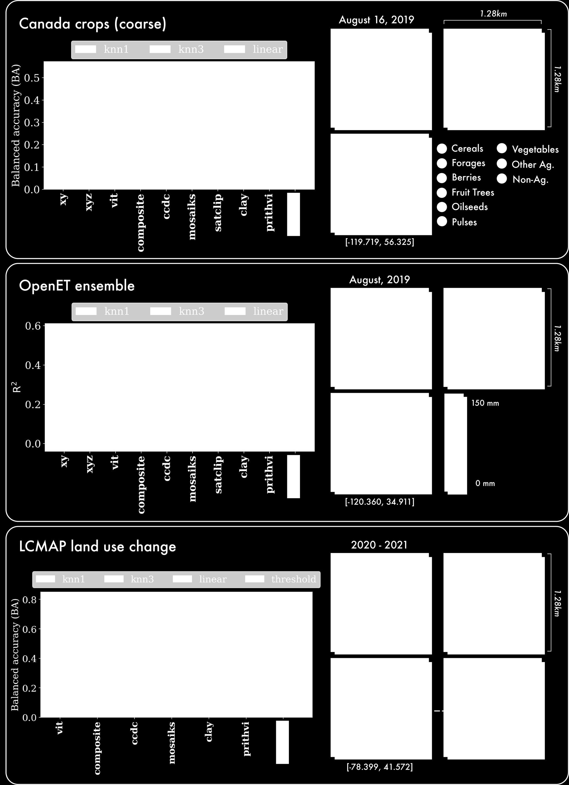

**[S079]**

**Original:**
may include periods of tree cover, clearing, and regrowth), so we set the valid period to a oneyear window centered on the time at which the land use observation was made, i.e., six months prior, six months after. As with land cover, we area occupied by different land use or land cover select 300 points per class for training and assign types. Given the high level of detail in LUCAS, the remainder to the test split (Table S9). Our and the ground-based nature of its collection, we final LUCAS land use evaluation has a total of consider LUCAS a challenging assessment of how 4,500 training points and 222,358 test points afwell a set of geospatial features distinguish deter pre-processing and spatial proximity filtering. tailed ground-level concepts. We use the LUCAS Harmonized (Theoretical                      S3.3.3. GLaNCE land cover Location, 2006-2018) V1 dataset (d’Andrimont et al., 2020) sourced from the Earth Engine Data                 The NASA-funded Global Land Cover EstimaCatalog ("JRC/LUCAS_HARMO/THLOC/V1").                            tion (GLanCE) project seeks to provide highWe filter the full LUCAS dataset to keep only                    quality long-term records of land cover and land survey data intersecting our period of interest                  cover change at a 30m spatial resolution for the (year greater than or equal to 2017, and                         21st century (2001 to present) (Friedl et al., with a location precision of at least 10 meters                  2022). The GLanCE training dataset was de- ("gps_prec" less than 10). We exclude points                     signed for regional-to-global land cover and land labeled as ‘ex_ante’ given this indicates they                   cover change analyses (Stanimirova et al., 2023). were not visited in a given survey year. Finally,                Similar to LCMAP, the dataset legend is intended we keep only classes with at least 420 samples.                  to support a broader community of end-users;

**中文:**
may include periods of tree cover, clearing, and regrowth), so we set the valid period to a oneyear window centered on the time at which the 土地利用 observation was made, i.e., six months prior, six months after. As with 土地覆盖, we area occupied by different 土地利用 or 土地覆盖 select 300 points per class for 训练 and assign types. Given the high level of detail in LUCAS（欧盟土地利用/覆盖统计调查）, the remainder to the test split (Table S9). Our and the ground-based nature of its collection, we final LUCAS（欧盟土地利用/覆盖统计调查） 土地利用 评估 has a total of consider LUCAS（欧盟土地利用/覆盖统计调查） a challenging assessment of how 4,500 训练 points and 222,358 test points afwell a set of 地理空间 features distinguish deter pre-processing and spatial proximity filtering. tailed ground-level concepts. We use the LUCAS（欧盟土地利用/覆盖统计调查） Harmonized (Theoretical S3.3.3. GLanCE（全球土地覆盖估算） 土地覆盖 Location, 2006-2018) V1 数据集 (d’Andrimont et al., 2020) sourced from the Earth Engine Data The NASA-funded Global 土地覆盖 EstimaCatalog ("JRC/LUCAS_HARMO/THLOC/V1"). tion (GLanCE（全球土地覆盖估算）) project seeks to provide highWe filter the full LUCAS（欧盟土地利用/覆盖统计调查） 数据集 to keep only quality long-term records of 土地覆盖 and land survey data intersecting our period of interest cover change at a 30m 空间分辨率 for the (year greater than or equal to 2017, and 21st century (2001 to present) (Friedl et al., with a location precision of at least 10 meters 2022). The GLanCE（全球土地覆盖估算） 训练 数据集 was de- ("gps_prec" less than 10). We exclude points signed for regional-to-global 土地覆盖 and land labeled as ‘ex_ante’ given this indicates they cover change analyses (Stanimirova et al., 2023). were not visited in a given survey year. Finally, Similar to LCMAP, the 数据集 legend is intended we keep only classes with at least 420 samples. to support a broader community of end-users;

---

## Page 35

**[S080]**

**Original:**
label     label name                                                           train         test 0         other_bare_soil                                                      300           4538 1         common_wheat                                                         300           11149 2         other_leguminous_and_mixtures_for_fodder                             300           797 3         shrubland_without_tree_cover                                         300           5883 4         broadleaved_woodland                                                 300           34253 5         grassland_without_tree/shrub_cover                                   300           42460 6         spruce_dominated_coniferous_woodland                                 300           4587 7         oats                                                                 300           1501 8         lucerne                                                              300           1520 9         inland_marshes                                                       300           563 10        non_built-up_area_features                                           300           3117 11        pine_dominated_coniferous_woodland                                   300           9321 12        pine_dominated_mixed_woodland                                        300           3883 13        other_mixed_woodland                                                 300           3112 14        maize                                                                300           7076 15        grassland_with_sparse_tree/shrub_cover                               300           6984 16        sunflower                                                            300           1236 17        spontaneously_vegetated_surfaces                                     300           8250 18        shrubland_with_sparse_tree_cover                                     300           4821 19        barley                                                               300           6647 20        dry_pulses                                                           300           867 21        sugar_beet                                                           300           1003 22        temporary_grasslands                                                 300           3576 23        spruce_dominated_mixed_woodland                                      300           3408 24        potatoes                                                             300           593 25        rape_and_turnip_rape                                                 300           2793 26        arable_land_(only_pi)                                                300           1523 27        non_built-up_linear_features                                         300           5877 28        clovers                                                              300           267 29        buildings_with_1_to_3_floors                                         300           3629 30        triticale                                                            300           587 31        rye                                                                  300           1148 32        other_coniferous_woodland                                            300           1066 33        durum_wheat                                                          300           1837 34        olive_groves                                                         300           487 35        other_fresh_vegetables                                               300           151 36        mixed_cereals_for_fodder                                             300           462 37        vineyards                                                            300           137 38        other_artificial_areas                                               300           338 39        peatbogs                                                             300           122

**中文:**
label label name train test 0 other_bare_soil 300 4538 1 common_wheat 300 11149 2 other_leguminous_and_mixtures_for_fodder 300 797 3 shrubland_without_tree_cover 300 5883 4 broadleaved_woodland 300 34253 5 grassland_without_tree/shrub_cover 300 42460 6 spruce_dominated_coniferous_woodland 300 4587 7 oats 300 1501 8 lucerne 300 1520 9 inland_marshes 300 563 10 non_built-up_area_features 300 3117 11 pine_dominated_coniferous_woodland 300 9321 12 pine_dominated_mixed_woodland 300 3883 13 other_mixed_woodland 300 3112 14 maize 300 7076 15 grassland_with_sparse_tree/shrub_cover 300 6984 16 sunflower 300 1236 17 spontaneously_vegetated_surfaces 300 8250 18 shrubland_with_sparse_tree_cover 300 4821 19 barley 300 6647 20 dry_pulses 300 867 21 sugar_beet 300 1003 22 temporary_grasslands 300 3576 23 spruce_dominated_mixed_woodland 300 3408 24 potatoes 300 593 25 rape_and_turnip_rape 300 2793 26 arable_land_(only_pi) 300 1523 27 non_built-up_linear_features 300 5877 28 clovers 300 267 29 buildings_with_1_to_3_floors 300 3629 30 triticale 300 587 31 rye 300 1148 32 other_coniferous_woodland 300 1066 33 durum_wheat 300 1837 34 olive_groves 300 487 35 other_fresh_vegetables 300 151 36 mixed_cereals_for_fodder 300 462 37 vineyards 300 137 38 other_artificial_areas 300 338 39 peatbogs 300 122

**[T081] Table S8**

**Original:**
> Table S8 | LUCAS land cover classes and sample counts by split.

**中文:**
> Table S8 | LUCAS（欧盟土地利用/覆盖统计调查） 土地覆盖 classes and sample counts by split.

---

## Page 36

**[S082]**

**Original:**
label       label name                                                                        train         test 0           agriculture_(excluding_fallow_land_and_kitchen_gardens)                           300           121309 1           semi-natural_and_natural_areas_not_in_use                                         300           24198 2           forestry                                                                          300           48649 3           road_transport                                                                    300           7037 4           amenities_museums_leisure                                                         300           1273 5           other_abandoned_areas                                                             300           1460 6           residential                                                                       300           9937 7           kitchen_garden                                                                    300           824 8           logistics_and_storage                                                             300           206 9           fallow_land                                                                       300           5272 10          community_services                                                                300           902 11          sport                                                                             300           454 12          electricity_gas_and_thermal_power_distribution                                    300           163 13          commerce                                                                          300           417 14          mining_and_quarrying                                                              300           257

**中文:**
label label name train test 0 agriculture_(excluding_fallow_land_and_kitchen_gardens) 300 121309 1 semi-natural_and_natural_areas_not_in_use 300 24198 2 forestry 300 48649 3 road_transport 300 7037 4 amenities_museums_leisure 300 1273 5 other_abandoned_areas 300 1460 6 residential 300 9937 7 kitchen_garden 300 824 8 logistics_and_storage 300 206 9 fallow_land 300 5272 10 community_services 300 902 11 sport 300 454 12 electricity_gas_and_thermal_power_distribution 300 163 13 commerce 300 417 14 mining_and_quarrying 300 257

**[T083] Table S9**

**Original:**
> Table S9 | LUCAS land use classes and sample counts by split.

**中文:**
> Table S9 | LUCAS（欧盟土地利用/覆盖统计调查） 土地利用 classes and sample counts by split.

**[S084]**

**Original:**
however, the GLaNCE dataset is a global sample (Figure S6). Thus, we consider the GLaNCE dataset a good proxy for general-purpose global (as opposed to national) land cover mapping. Our GLaNCE evaluation dataset is derived from the GLanCE training dataset in the GEE Community Catalog ("projects/sat-io/opendatasets/GLANCE/GLANCE_TRAINING_DATA _V1") (Roy et al., 2025). Though published GLaNCE data products use Level 1 labels (Arevalo et al., 2022), we use the Level 2 of the labeling hierarchy ("Glance_Class_ID_level2") as a test of maximizing thematic detail. Given that GLaNCE includes a number of other datasets, some of which overlap with other evaluation datasets, e.g., LCMAP, we select a subset of sources, specifically the MODIS STEP dataset (STEP), results of spectral-temporal clustering (CLUSTERING), a labeled dataset from the NASA Arctic-Boreal Vulnerability Experiment (ABoVE), and a set of annotations collection by the project team ("Dataset_Code" = 1, 2, 4, or 704). GLaNCE                          Figure S6 | Distribution of GLaNCE sample localabels are associated with time segments, i.e., lations. bels have a start and end date similar to our use of a valid period. We select only labeled segments with an end year after 2017 ("End_Year" greater

**中文:**
however, the GLanCE（全球土地覆盖估算） 数据集 is a global sample (Figure S6). Thus, we consider the GLanCE（全球土地覆盖估算） 数据集 a good proxy for general-purpose global (as opposed to national) 土地覆盖 mapping. Our GLanCE（全球土地覆盖估算） 评估 数据集 is derived from the GLanCE（全球土地覆盖估算） 训练 数据集 in the GEE Community Catalog ("projects/sat-io/opendatasets/GLanCE（全球土地覆盖估算）/GLANCE_TRAINING_DATA _V1") (Roy et al., 2025). Though published GLanCE（全球土地覆盖估算） data products use Level 1 labels (Arevalo et al., 2022), we use the Level 2 of the labeling hierarchy ("Glance_Class_ID_level2") as a test of maximizing thematic detail. Given that GLanCE（全球土地覆盖估算） includes a number of other datasets, some of which overlap with other 评估 datasets, e.g., LCMAP, we select a subset of sources, specifically the MODIS STEP 数据集 (STEP), results of spectral-时序 clustering (CLUSTERING), a labeled 数据集 from the NASA Arctic-Boreal Vulnerability Experiment (ABoVE), and a set of annotations collection by the project team ("Dataset_Code" = 1, 2, 4, or 704). GLanCE（全球土地覆盖估算） Figure S6 | Distribution of GLanCE（全球土地覆盖估算） sample localabels are associated with time segments, i.e., lations. bels have a start and end date similar to our use of a valid period. We select only labeled segments with an end year after 2017 ("End_Year" greater

---

## Page 37

**[S085]**

**Original:**
label     label name               train        test 0         water                    300          1167 1         developed                300          878 2         soil                     300          291 3         rock                     300          921 4         sand                     300          1195 5         deciduous                300          2700 6         evergreen                300          5959 7         mixed                    300          2425 8         shrub                    300          2118 9         grassland                300          6952 10        agriculture              300          6979

**中文:**
label label name train test 0 water 300 1167 1 developed 300 878 2 soil 300 291 3 rock 300 921 4 sand 300 1195 5 deciduous 300 2700 6 evergreen 300 5959 7 mixed 300 2425 8 shrub 300 2118 9 grassland 300 6952 10 agriculture 300 6979

**[T086] Table S10**

**Original:**
> Table S10 | GLaNCE classes and sample counts

**中文:**
> Table S10 | GLanCE（全球土地覆盖估算） classes and sample counts

**[S088]**

**Original:**
than or equal to 2017). We remove null values as well as the "ice_and_snow" and "moss" categories, which have fewer than 500 samples per class. This results in a final dataset with eleven classes, and we select 300 training points per class with the remainder allocated to the test split (Table S10). Though we note that segments could be converted to a series of annual labels for each location, this               Figure S7 | Distribution of Africa crop mask samapproach would be subject to greater temporal                      ple locations. autocorrelation across labels for the same location; instead, we sample a random year between segment start and end dates as an annual valid period to ensure more independent sampling of                      dom uniform sample of point locations within the time domain. Our final GLaNCE land cover                       each country’s boundaries. For each sample, evaluation has a total of 3,300 training points                    trained individuals inspected images from each and 31,585 test points after pre-processing and                    month in the country’s growing season to deterspatial proximity filtering.                                       mine whether the point contained active cropland, defined as "points where patterns of sowS3.3.4. Africa crop mask                                           ing, growing, and/or harvesting in an agricultural field could be observed during the relevant Our Africa crop mask evaluation was derived from                   agricultural season within a 12-month period" a manually-labeled reference dataset designed                      (Kerner et al., 2024a). At least two annotators to validate the accuracy of cropland maps delabeled every point to maximize label confidence, rived from land cover maps (Kerner et al., 2024a).                 and points that did not have unanimous agreeThe dataset includes pointwise (binary) annotament between annotators were discarded to entions for cropland versus non-cropland in eight                    sure high-confidence labels in the final reference Sub-Saharan African countries (Kenya, Rwanda,                      dataset. We consider the Africa crop mask refUganda, Tanzania, Mali, Malawi, Togo, and Zamerence dataset a good proxy for general agriculbia; Figure S7). For all countries except Mali,                    tural land use in landscapes where there has been where the percentage of cropland area is small,                    notable disagreement among existing mapping reference points were selected by drawing a ranefforts.

**中文:**
than or equal to 2017). We remove null values as well as the "ice_and_snow" and "moss" categories, which have fewer than 500 samples per class. This results in a final 数据集 with eleven classes, and we select 300 训练 points per class with the remainder allocated to the test split (Table S10). Though we note that segments could be converted to a series of annual labels for each location, this Figure S7 | Distribution of Africa crop mask samapproach would be subject to greater 时序 ple locations. autocorrelation across labels for the same location; instead, we sample a random year between segment start and end dates as an annual valid period to ensure more independent sampling of dom uniform sample of point locations within the time domain. Our final GLanCE（全球土地覆盖估算） 土地覆盖 each country’s boundaries. For each sample, 评估 has a total of 3,300 训练 points trained individuals inspected images from each and 31,585 test points after pre-processing and month in the country’s growing season to deterspatial proximity filtering. mine whether the point contained active cropland, defined as "points where patterns of sowS3.3.4. Africa crop mask ing, growing, and/or harvesting in an agricultural field could be observed during the relevant Our Africa crop mask 评估 was derived from agricultural season within a 12-month period" a manually-labeled reference 数据集 designed (Kerner et al., 2024a). At least two annotators to validate the 准确率 of cropland maps delabeled every point to maximize label confidence, rived from 土地覆盖 maps (Kerner et al., 2024a). and points that did not have unanimous agreeThe 数据集 includes pointwise (binary) annotament between annotators were discarded to entions for cropland versus non-cropland in eight sure high-confidence labels in the final reference Sub-Saharan African countries (Kenya, Rwanda, 数据集. We consider the Africa crop mask refUganda, Tanzania, Mali, Malawi, Togo, and Zamerence 数据集 a good proxy for general agriculbia; Figure S7). For all countries except Mali, tural 土地利用 in landscapes where there has been where the percentage of cropland area is small, notable disagreement among existing mapping reference points were selected by drawing a ranefforts.

---

## Page 38

**[S089]**

**Original:**
label     label name                 train        test 0         not_crop                   200          2038 1         crop                       200          118

**中文:**
label label name train test 0 not_crop 200 2038 1 crop 200 118

**[T090] Table S11**

**Original:**
> Table S11 | Africa crop mask classes and sample

**中文:**
> Table S11 | Africa crop mask classes and sample

**[S091]**

**Original:**
counts by split.

**中文:**
counts by split.

**[S092]**

**Original:**
We accessed the crop mask reference datasets for individual countries as Earth Engine assets provided by the authors ("projects/bsos-geogharvest1/assets/harvest-reference-datasets/*"), though we note that these datasets are also                        Figure S8 | Distribution of Canada crops sample available as archived shapefiles (Kerner et al.,                   locations. 2024b). We merge separate datasets for Kenya, Rwanda, Uganda, Tanzania, Mali, Malawi, Togo, and Zambia into a single dataset and assign                        inventory datasets. labels based on the “crop_label” field. We use an                     We downloaded prepackaged shapefiles for the annual valid period covering Jan 1 2019 to Jan                     years 2017, 2018, 2019, 2020, 2021, and 2022 1 2020 for all countries except Malawi, where                      (2023 data was also available but formatting was reference labels are for 2020, so we use a valid                   not consistent with other years, so we dropped period of Jan 1 2020 to Jan 1 2021 instead. Our                    from consideration). Processing for the two subfinal Africa crop mask evaluation has a total of                   datasets (coarse and fine) are described in the 400 training points and 2,156 test points after                    following sections. pre-processing and spatial proximity filtering (Table S11) Canada crops (coarse) We use the Landuse S3.3.5. Canada crops                                               Category Code (CATCODE) and corresponding English Landuse Category Name (CATNAME) to The Canadian AAFC (Agriculture and Agri-Food                       derive our Canada crops coarse evaluation. We Canada) Annual Crop Inventory Ground Truth                         impose a minimum overall per-class sample size Data is an annual field-by-field inventory of Canaof n=100, and cull any classes that do not meet dian crops (Agriculture and Canada, 2024). It                      this minimum count requirement. Given the class does not cover the whole country; rather, a "winddistribution is highly imbalanced and includes shield survey" is done annually for provinces                      several classes with less than 200 samples per where crop data is not provided to provincial                      class, we set a proportional split rather than a crop insurance companies (Figure S8). This data                    fixed sample, allocating 60% to training and rewas originally collected as training and validaserving 40% for testing and re-sampling as part tion points for use in the AAFC Annual Crop Inof the evaluation process to re-balance the trainventory (ACI, which looks at state and trends in                   ing set (Table S12). We treat the observations national agriculture production. We create two                     as instantaneous and assign the Date Collected evaluation datasets at two different levels of clas-               (DATE_COLL) as the valid period start and end sification hierarchy, which we refer to as Canada                  (single-date). Our final Canada crops coarse evalcrops coarse and Canada crops fine. We assume                      uation has a total of 2,831 training points and that these datasets are a good proxy for perfor-                   13,248 test points after pre-processing and spatial mance on multi-level crop classification at a naproximity filtering. tional scale, and unlike reference datasets that rely on interpretation of imagery, the windshieldsurvey approach indicates performance scaling                      Canada crops (fine) For the Canada crops fine sparse ground-based observations from national                     evaluation, we use the Landuse Code (LAND-

**中文:**
We accessed the crop mask reference datasets for individual countries as Earth Engine assets provided by the authors ("projects/bsos-geogharvest1/assets/harvest-reference-datasets/*"), though we note that these datasets are also Figure S8 | Distribution of Canada crops sample available as archived shapefiles (Kerner et al., locations. 2024b). We merge separate datasets for Kenya, Rwanda, Uganda, Tanzania, Mali, Malawi, Togo, and Zambia into a single 数据集 and assign inventory datasets. labels based on the “crop_label” field. We use an We downloaded prepackaged shapefiles for the annual valid period covering Jan 1 2019 to Jan years 2017, 2018, 2019, 2020, 2021, and 2022 1 2020 for all countries except Malawi, where (2023 data was also available but formatting was reference labels are for 2020, so we use a valid not consistent with other years, so we dropped period of Jan 1 2020 to Jan 1 2021 instead. Our from consideration). Processing for the two subfinal Africa crop mask 评估 has a total of datasets (coarse and fine) are described in the 400 训练 points and 2,156 test points after following sections. pre-processing and spatial proximity filtering (Table S11) Canada crops (coarse) We use the Landuse S3.3.5. Canada crops Category Code (CATCODE) and corresponding English Landuse Category Name (CATNAME) to The Canadian AAFC (Agriculture and Agri-Food derive our Canada crops coarse 评估. We Canada) Annual Crop Inventory 地面真值 impose a minimum overall per-class sample size Data is an annual field-by-field inventory of Canaof n=100, and cull any classes that do not meet dian crops (Agriculture and Canada, 2024). It this minimum count requirement. Given the class does not cover the whole country; rather, a "winddistribution is highly imbalanced and includes shield survey" is done annually for provinces several classes with less than 200 samples per where crop data is not provided to provincial class, we set a proportional split rather than a crop insurance companies (Figure S8). This data fixed sample, allocating 60% to 训练 and rewas originally collected as 训练 and validaserving 40% for testing and re-sampling as part tion points for use in the AAFC Annual Crop Inof the 评估 process to re-balance the trainventory (ACI, which looks at state and trends in ing set (Table S12). We treat the observations national agriculture production. We create two as instantaneous and assign the Date Collected 评估 datasets at two different levels of clas- (DATE_COLL) as the valid period start and end sification hierarchy, which we refer to as Canada (single-date). Our final Canada crops coarse evalcrops coarse and Canada crops fine. We assume uation has a total of 2,831 训练 points and that these datasets are a good proxy for perfor- 13,248 test points after pre-processing and spatial mance on multi-level crop 分类 at a naproximity filtering. tional scale, and unlike reference datasets that rely on interpretation of imagery, the windshieldsurvey approach indicates performance scaling Canada crops (fine) For the Canada crops fine sparse ground-based observations from national 评估, we use the Landuse Code (LAND-

---

## Page 39

**[S093]**

**Original:**
label     label name                 train        test 0         Agr. Cereals               500          3059 1         Agr. Forages               500          4914 2         Agr. Fruits (Berry &       207          138 Annual) 3         Agr. Fruits (Trees)        75           51 4         Agr. Oilseeds              500          1797 5         Agr. Pulses                76           51                label     label name                 train        test

**中文:**
label label name train test 0 Agr. Cereals 500 3059 1 Agr. Forages 500 4914 2 Agr. Fruits (Berry & 207 138 Annual) 3 Agr. Fruits (Trees) 75 51 4 Agr. Oilseeds 500 1797 5 Agr. Pulses 76 51 label label name train test

**[S094]**

**Original:**
6         Agr. Vegetables            277          186               0         Barley (Undiff)            110          74

**中文:**
6 Agr. Vegetables 277 186 0 Barley (Undiff) 110 74

**[S095]**

**Original:**
7         Agr. Others                196          132               1         Oats                       123          82

**中文:**
7 Agr. Others 196 132 1 Oats 123 82

**[S096]**

**Original:**
8         Non-Agr.                   500          2920              2         Spring Wheat               99           66 3         Winter Wheat               390          260

**中文:**
8 Non-Agr. 500 2920 2 Spring Wheat 99 66 3 Winter Wheat 390 260

**[T097] Table S12**

**Original:**
> Table S12 | Canada crops (coarse) classes and                        4         Corn                       500          1546

**中文:**
> Table S12 | Canada crops (coarse) classes and 4 Corn 500 1546

**[S098]**

**Original:**
sample counts by split. 5         Pasture/Forage             93           63 6         Alfalfa                    257          172 CODE) and associated English Landuse Name                            7         Mixed Forage               500          2768 (LANDNAME). These species-level labels present                       8         Pasture                    500          628 an excellent opportunity to characterize perfor- 9         Unimproved Pasture         250          167 mance on highly detailed legends and viability 10        Blueberry (Undiff)         112          75 for agricultural use cases that require this level of detail. However, many categories have few sam-                       11        Canola/Rapeseed            68           46 ples, and some categories may be too noisy to                        12        Soybeans                   500          1673 draw any sound conclusions about performance                         13        Potatoes                   145          97 (particularly the “Undifferentiated” categories, 14        Native Grassland           68           46 which could include examples of the same crop type but grouping different phenologies already                      15        Shrubland                  249          167 represented individually).                                           16        Urban                      291          194 17        Barren                     141          94 Specifically, we: 18        Water                      106          72 19        Coniferous                 153          102 • Remove "Cereals (Undiff)" 20        Mixedwood                  361          242 • Merge "Barley (Undiff)", "Winter Barley", "Spring Barley"                                                  21        Wetland                    222          149 • Remove "Wheat (Undiff)"                                          22        Abandoned         (Over-   168          112 • Merge "Rye (Undiff)", "Winter Rye", "Spring                                grown) Rye"                                                             23        Abandoned (Shrubs)         159          106 • Merge "Triticale (Undiff)", "Spring Triticale", "Winter Triticale”                                             Table S13 | Canada crops (fine) classes and sam- • Merge "Blueberry (Undiff)", "Blueberry -                       ple counts by split. High Bush", "Blueberry - Low Bush" • Merge "Beans (Undiff)", "Adzuki Beans", "Otebo Beans", "Black Beans","Cranbery Beans", "Fababeans", "Kidney Beans", "Lima Beans", "White Beans", "Edible (generic) Beans" • Merge "Peas (Undiff)" and "Field Peas". • Remove "Vegetables (Undiff)"

**中文:**
sample counts by split. 5 Pasture/Forage 93 63 6 Alfalfa 257 172 CODE) and associated English Landuse Name 7 Mixed Forage 500 2768 (LANDNAME). These species-level labels present 8 Pasture 500 628 an excellent opportunity to characterize perfor- 9 Unimproved Pasture 250 167 mance on highly detailed legends and viability 10 Blueberry (Undiff) 112 75 for agricultural use cases that require this level of detail. However, many categories have few sam- 11 Canola/Rapeseed 68 46 ples, and some categories may be too noisy to 12 Soybeans 500 1673 draw any sound conclusions about performance 13 Potatoes 145 97 (particularly the “Undifferentiated” categories, 14 Native Grassland 68 46 which could include examples of the same 作物类型 but grouping different phenologies already 15 Shrubland 249 167 represented individually). 16 Urban 291 194 17 Barren 141 94 Specifically, we: 18 Water 106 72 19 Coniferous 153 102 • Remove "Cereals (Undiff)" 20 Mixedwood 361 242 • Merge "Barley (Undiff)", "Winter Barley", "Spring Barley" 21 Wetland 222 149 • Remove "Wheat (Undiff)" 22 Abandoned (Over- 168 112 • Merge "Rye (Undiff)", "Winter Rye", "Spring grown) Rye" 23 Abandoned (Shrubs) 159 106 • Merge "Triticale (Undiff)", "Spring Triticale", "Winter Triticale” Table S13 | Canada crops (fine) classes and sam- • Merge "Blueberry (Undiff)", "Blueberry - ple counts by split. High Bush", "Blueberry - Low Bush" • Merge "Beans (Undiff)", "Adzuki Beans", "Otebo Beans", "Black Beans","Cranbery Beans", "Fababeans", "Kidney Beans", "Lima Beans", "White Beans", "Edible (generic) Beans" • Merge "Peas (Undiff)" and "Field Peas". • Remove "Vegetables (Undiff)"

---

## Page 40

**[S099]**

**Original:**
After these merges and removals, we check to ensure remaining categories have a viable number of samples (greater than 100 per class). As with Canada crops coarse, there is a high degree of variability in per-class sample sizes, so we use a proportional rather than fixed per class sample size, allocating 60% to training and 40% to testing and re-balancing the training set using repeat sampling during training. We again treat window survey observation as instantaneous and assign the Date Collected (DATE_COLL) as the valid period start and end (single-date). Our final Canada crops fine evaluation has a total of 5,565 training points and 9,001 test points after preprocessing and spatial proximity filtering (Table                Figure S9 | Distribution of Ethiopia crops sample S13).                                                            locations.

**中文:**
After these merges and removals, we check to ensure remaining categories have a viable number of samples (greater than 100 per class). As with Canada crops coarse, there is a high degree of variability in per-class sample sizes, so we use a proportional rather than fixed per class sample size, allocating 60% to 训练 and 40% to testing and re-balancing the 训练 set using repeat sampling during 训练. We again treat window survey observation as instantaneous and assign the Date Collected (DATE_COLL) as the valid period start and end (single-date). Our final Canada crops fine 评估 has a total of 5,565 训练 points and 9,001 test points after preprocessing and spatial proximity filtering (Table Figure S9 | Distribution of Ethiopia crops sample S13). locations.

**[S100]**

**Original:**
label     label name                 train        test S3.3.6. Ethiopia crops 0         wheat                      377          1700 The Ethiopian Crop Type 2020 (EthCT2020)                           1         barley                     82           20 dataset is a benchmark for environmental and 2         maize                      66           30 agricultural remote sensing applications in complex Ethiopian smallholder wheat-based farming                     3         teff                       49           206 systems (Blasch et al., 2024). The dataset consists of harmonized, quality-controlled, and geoTable S14 | Ethiopia crops classes and sample referenced in-situ samples of annual crop types                  counts by split. (Blasch, 2024). Like the Canada crops inventory, these in situ samples represent an important class classes have allocated 20% of their points to their of sparse-but-high-quality data, and we take additrain split, though the large size of some compotional steps to process this dataset for consistency nents lead to an imbalanced result. Given our with our evaluation dataset protocols and stanevaluation protocol sub-samples to the minimum dards. class size this was not problematic. We lastly reWe downloaded the dataset from Mendeley                       move all datapoints with crop classes that have a (Blasch, 2024). Per the dataset description, this                total of < 49 train points. The valid time is treated shapefile contains the delimitation of 2,793 ciras instantaneous (single-date) and set to the data cular plots (10 m radius) located in cultivated                  collection timestamp, ("sub_dat") from the origifields, and the crop information (crop group and                 nal dataset. Our final Ethiopia crops evaluation crop class) of the 2020/21 main Meher season                     has a total of 873 training points and 1,657 test (June 2020 to February 2021) for each field plot.                points after pre-processing and spatial proximity Given close proximity of many of the interpreted                 filtering (Figure S9, Table S14). sites, we do not simply remove points to satisfy minimum distance criteria. Rather, we create conS3.3.7. US trees nected components by joining points within 1.28 km radii, and assign points to the train or test                 To evaluate performance on biodiversity-related split based on their component membership.This                   applications, we leveraged the Global Biodiversity avoids the scenario where a train and test point                 Information Facility (GBIF) records, specifically are in the same spatial neighborhood. Comporesearch-grade observations from the iNaturalist nent membership assignment is performed to mincitizen science repository (GBIF, 2024). GBIF is imize the number of points off from which all                    a comprehensive collection of species occurrence

**中文:**
label label name train test S3.3.6. Ethiopia crops 0 wheat 377 1700 The Ethiopian 作物类型 2020 (EthCT2020) 1 barley 82 20 数据集 is a 基准测试 for environmental and 2 maize 66 30 agricultural 遥感 applications in complex Ethiopian smallholder wheat-based farming 3 teff 49 206 systems (Blasch et al., 2024). The 数据集 consists of harmonized, quality-controlled, and geoTable S14 | Ethiopia crops classes and sample referenced in-situ samples of annual crop types counts by split. (Blasch, 2024). Like the Canada crops inventory, these in situ samples represent an important class classes have allocated 20% of their points to their of sparse-but-high-quality data, and we take additrain split, though the large size of some compotional steps to process this 数据集 for consistency nents lead to an imbalanced result. Given our with our 评估 数据集 protocols and stanevaluation protocol sub-samples to the minimum dards. class size this was not problematic. We lastly reWe downloaded the 数据集 from Mendeley move all datapoints with crop classes that have a (Blasch, 2024). Per the 数据集 description, this total of < 49 train points. The valid time is treated shapefile contains the delimitation of 2,793 ciras instantaneous (single-date) and set to the data cular plots (10 m radius) located in cultivated collection timestamp, ("sub_dat") from the origifields, and the crop information (crop group and nal 数据集. Our final Ethiopia crops 评估 crop class) of the 2020/21 main Meher season has a total of 873 训练 points and 1,657 test (June 2020 to February 2021) for each field plot. points after pre-processing and spatial proximity Given close proximity of many of the interpreted filtering (Figure S9, Table S14). sites, we do not simply remove points to satisfy minimum distance criteria. Rather, we create conS3.3.7. US trees nected components by joining points within 1.28 km radii, and assign points to the train or test To evaluate performance on biodiversity-related split based on their component membership.This applications, we leveraged the Global Biodiversity avoids the scenario where a train and test point Information Facility (GBIF（全球生物多样性信息网络）) records, specifically are in the same spatial neighborhood. Comporesearch-grade observations from the iNaturalist nent membership assignment is performed to mincitizen science repository (GBIF（全球生物多样性信息网络）, 2024). GBIF（全球生物多样性信息网络） is imize the number of points off from which all a comprehensive collection of species occurrence

---

## Page 41

**[F008] Figure S11**

**Original:**
> Figure S11 | Distribution of Descals oil palm sam-

**中文:**
> Figure S11 | Distribution of Descals oil palm sam-

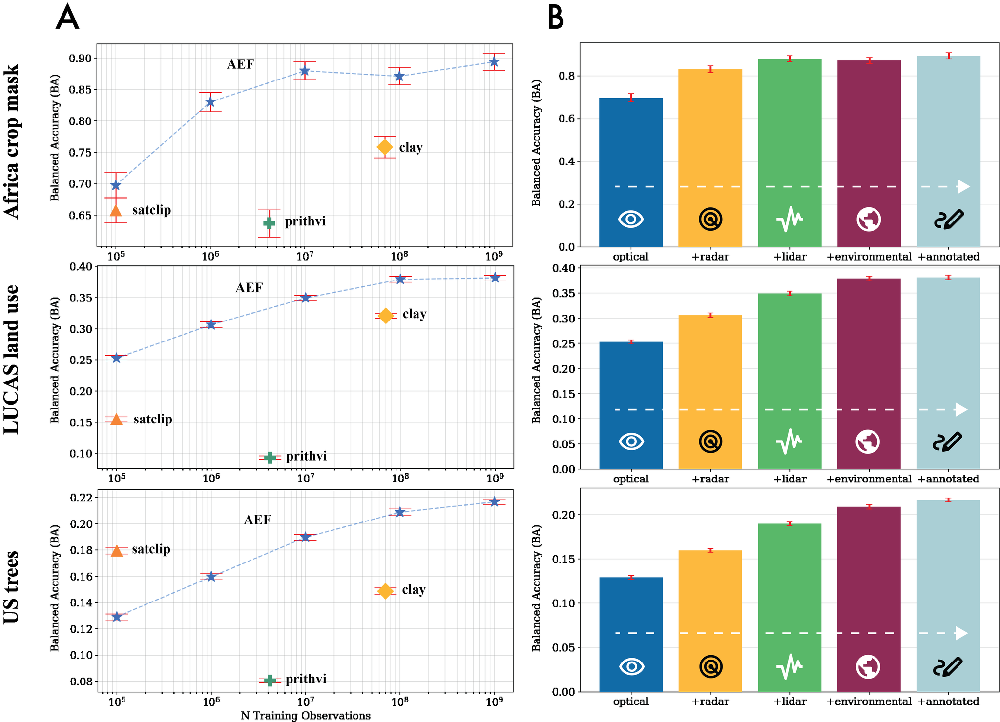

**[S102]**

**Original:**
ple locations.

**中文:**
ple locations.

**[S103]**

**Original:**
labels, using the date of the observation record (eventdate) as a single-date valid period. Our final US trees evaluation has a total of 11,700 training points and 33,682 test points after pre-processing and spatial proximity filtering.

**中文:**
labels, using the date of the observation record (eventdate) as a single-date valid period. Our final US trees 评估 has a total of 11,700 训练 points and 33,682 test points after pre-processing and spatial proximity filtering.

**[F009] Figure S10**

**Original:**
> Figure S10 | Distribution of US trees sample loca-

**中文:**
> Figure S10 | Distribution of US trees sample loca-

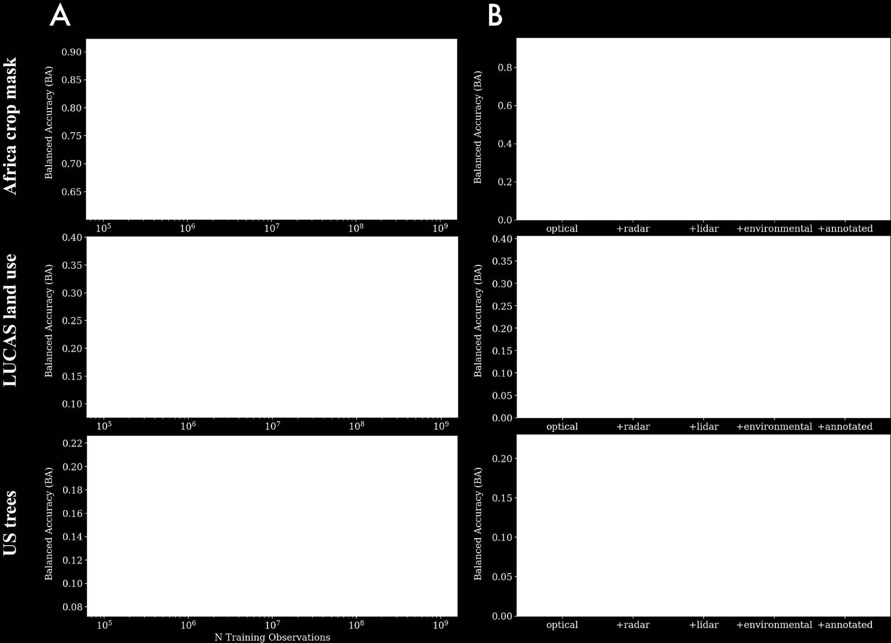

**[S105]**

**Original:**
tions. S3.3.8. Descals oil palm

**中文:**
tions. S3.3.8. Descals oil palm

**[S106]**

**Original:**
The Global oil palm extent and planting year from records. Unlike our text pretraining dataset, here 1990 to 2021 reference dataset is an updated verwe focus on genus-level taxonomic labels (as opsion of a dataset used to validate a previously posed to alignment with text embeddings for the published global map of smallholder and indusinformation associated with a given species). We trial closed-canopy oil palm plantations (Descals chose to focus on tree genera in the United States et al., 2021). The updated dataset was refined to given interest in forest species composition mapvalidate a 10-meter resolution global map of inping across a diversity of forest types (Figure dustrial and smallholder oil palm developed using S10). Sentinel-1 data for the years 2016–2021 (Descals, We select GBIF records for the period Jan 1                    2024). The 2024 version of the dataset covers re- 2017 to Jan 1 2023 and filter to just observations               gions where oil palm is found worldwide (Figure where the genus label is found in a list of tree                 S11) and makes several notable improvements genera sourced from the US Forest Service and                    over the previous version, including updating lacountry code is set to the US. Observations must                 bels where coconut plantations were incorrectly be labeled as human or machine observations,                     labeled as oil palm and relabeling young plantaand have a maximum spatial uncertainty of 10                     tions that were initially considered ‘other’ as oil meters. From this initial list of tree genera obserpalm. Reference sites from the initial study were vations, we get the five most frequently observed                selected using a simple random sample, making species for each of the US states, including Alaska              the sampling design reusable for creating statisand Hawaii, then combine into a single deduplitically rigorous accuracy metrics. We interpret cated list of common US tree genera. We select                   this dataset as reflecting land use as an oil-palm these genera for further processing.                             plantation: points are labeled as being part of a plantation if they were a closed canopy plantaOf the remaining observations across common tion some time in 2016-2021. We consider the tree genera, we drop any that have less than 500 Descals oil palm reference dataset a useful evalsamples per class, resulting in a final set of 39 uation of performance for subtle land use and genera (Table S15). We allocate 300 samples to tropical commodity mapping. the train split and the rest to the test split (Table S15). We treat observations as instantaneous                        We       download         the      validation          points

**中文:**
The Global oil palm extent and planting year from records. Unlike our text pretraining 数据集, here 1990 to 2021 reference 数据集 is an updated verwe focus on genus-level taxonomic labels (as opsion of a 数据集 used to validate a previously posed to alignment with text embeddings for the published global map of smallholder and indusinformation associated with a given species). We trial closed-canopy oil palm plantations (Descals chose to focus on tree genera in the United States et al., 2021). The updated 数据集 was refined to given interest in forest species composition mapvalidate a 10-meter resolution global map of inping across a diversity of forest types (Figure dustrial and smallholder oil palm developed using S10). Sentinel-1 data for the years 2016–2021 (Descals, We select GBIF（全球生物多样性信息网络） records for the period Jan 1 2024). The 2024 version of the 数据集 covers re- 2017 to Jan 1 2023 and filter to just observations gions where oil palm is found worldwide (Figure where the genus label is found in a list of tree S11) and makes several notable improvements genera sourced from the US Forest Service and over the previous version, including updating lacountry code is set to the US. Observations must bels where coconut plantations were incorrectly be labeled as human or machine observations, labeled as oil palm and relabeling young plantaand have a maximum spatial uncertainty of 10 tions that were initially considered ‘other’ as oil meters. From this initial list of tree genera obserpalm. Reference sites from the initial study were vations, we get the five most frequently observed selected using a simple random sample, making species for each of the US states, including Alaska the sampling design reusable for creating statisand Hawaii, then combine into a single deduplitically rigorous 准确率 metrics. We interpret cated list of common US tree genera. We select this 数据集 as reflecting 土地利用 as an oil-palm these genera for further processing. plantation: points are labeled as being part of a plantation if they were a closed canopy plantaOf the remaining observations across common tion some time in 2016-2021. We consider the tree genera, we drop any that have less than 500 Descals oil palm reference 数据集 a useful evalsamples per class, resulting in a final set of 39 uation of performance for subtle 土地利用 and genera (Table S15). We allocate 300 samples to tropical commodity mapping. the train split and the rest to the test split (Table S15). We treat observations as instantaneous We download the 验证 points

---

## Page 42

**[S107]**

**Original:**
label     label name                    train      test label     label name                 train        test 0         Other                         200        16323 0         abies                      300          827 1         Industrial oil palm           200        461 1         acer                       300          1296 2         Smallholder oil palm          200        93 2         aesculus                   300          665 3         ailanthus                  300          857             Table S16 | Descals oil palm labels and sample 4         alnus                      300          220             counts by split. 5         amelanchier                300          203 6         asimina                    300          614 7         betula                     300          917             (Validation_points_GlobalOP2016-2021.zip) from the archived dataset (Descals, 2024). The 8         carya                      300          628 dataset has three classes, where class 0 represents 9         cercis                     300          1296 other land covers that are not closed-canopy oil 10        cornus                     300          1296            palm; class 1 represents closed-canopy industrial 11        diospyros                  300          934             oil palm; and class 2 represents closed-canopy 12        elaeagnus                  300          1296            smallholder oil palm (Table S16). These classes 13        fagus                      300          1187            were initially determined based on observations 14        gleditsia                  300          353             on imagery from 2019, but further informed 15        ilex                       300          1296 by observations over the years 2016-2021. We assume that non-plantation to plantation 16        juglans                    300          620 transitions are more likely than the reverse, so 17        juniperus                  300          1296 while it’s possible that observations in some 18        liquidambar                300          1296            years may not match the assigned label, it’s less 19        liriodendron               300          1173            likely for later years. In order to make this into a 20        maclura                    300          317             dataset that is useful as a training dataset, we 21        magnolia                   300          874             randomly assign one of the years in [2019, 2021] 22        morus                      300          387             to each row and set the valid period to that entire year. Our final Descals oil palm evaluation has 23        picea                      300          621 a total of 600 training points and 16,877 test 24        pinus                      300          1296 points after pre-processing and spatial proximity 25        populus                    300          1296            filtering. 26        prosopis                   300          1057 27        prunus                     300          1296 S3.3.9. OpenET ensemble 28        pseudotsuga                300          602 29        quercus                    300          1296            The OpenET project aims to make satellite-based 30        sabal                      300          272             estimates of the total amount of water that is 31        salix                      300          957             transferred from the land surface to the atmo- 32        sassafras                  300          1006            sphere through the process of evapotranspiration (ET) available for improved water management 33        taxodium                   300          271 (Melton et al., 2022; Volk et al., 2024). OpenET 34        thuja                      300          474 datasets include ET estimates from six different 35        triadica                   300          300             satellite-driven ET models as well as an ensem- 36        tsuga                      300          1190            ble product, which is calculated as the mean of 37        ulmus                      300          604             the ensemble after filtering and removing outliers 38        yucca                      300          1296            using the median absolute deviation approach. All models currently use 30-meter Landsat data

**中文:**
label label name train test label label name train test 0 Other 200 16323 0 abies 300 827 1 Industrial oil palm 200 461 1 acer 300 1296 2 Smallholder oil palm 200 93 2 aesculus 300 665 3 ailanthus 300 857 Table S16 | Descals oil palm labels and sample 4 alnus 300 220 counts by split. 5 amelanchier 300 203 6 asimina 300 614 7 betula 300 917 (Validation_points_GlobalOP2016-2021.zip) from the archived 数据集 (Descals, 2024). The 8 carya 300 628 数据集 has three classes, where class 0 represents 9 cercis 300 1296 other land covers that are not closed-canopy oil 10 cornus 300 1296 palm; class 1 represents closed-canopy industrial 11 diospyros 300 934 oil palm; and class 2 represents closed-canopy 12 elaeagnus 300 1296 smallholder oil palm (Table S16). These classes 13 fagus 300 1187 were initially determined based on observations 14 gleditsia 300 353 on imagery from 2019, but further informed 15 ilex 300 1296 by observations over the years 2016-2021. We assume that non-plantation to plantation 16 juglans 300 620 transitions are more likely than the reverse, so 17 juniperus 300 1296 while it’s possible that observations in some 18 liquidambar 300 1296 years may not match the assigned label, it’s less 19 liriodendron 300 1173 likely for later years. In order to make this into a 20 maclura 300 317 数据集 that is useful as a 训练 数据集, we 21 magnolia 300 874 randomly assign one of the years in [2019, 2021] 22 morus 300 387 to each row and set the valid period to that entire year. Our final Descals oil palm 评估 has 23 picea 300 621 a total of 600 训练 points and 16,877 test 24 pinus 300 1296 points after pre-processing and spatial proximity 25 populus 300 1296 filtering. 26 prosopis 300 1057 27 prunus 300 1296 S3.3.9. OpenET（开放蒸散发） ensemble 28 pseudotsuga 300 602 29 quercus 300 1296 The OpenET（开放蒸散发） project aims to make satellite-based 30 sabal 300 272 estimates of the total amount of water that is 31 salix 300 957 transferred from the land surface to the atmo- 32 sassafras 300 1006 sphere through the process of evapotranspiration (ET) available for improved water management 33 taxodium 300 271 (Melton et al., 2022; Volk et al., 2024). OpenET（开放蒸散发） 34 thuja 300 474 datasets include ET estimates from six different 35 triadica 300 300 satellite-driven ET models as well as an ensem- 36 tsuga 300 1190 ble product, which is calculated as the mean of 37 ulmus 300 604 the ensemble after filtering and removing outliers 38 yucca 300 1296 using the median absolute deviation approach. All models currently use 30-meter Landsat data

**[T108] Table S15**

**Original:**
> Table S15 | US trees genera labels and sample                      to produce ET estimates, and the monthly ET

**中文:**
> Table S15 | US trees genera labels and sample to produce ET estimates, and the monthly ET

**[S109]**

**Original:**
counts by split.                                                   dataset provides data on total ET by month as an equivalent depth of water in millimeters.

**中文:**
counts by split. 数据集 provides data on total ET by month as an equivalent depth of water in millimeters.

---

## Page 43

**[F010] Figure S13**

**Original:**
> Figure S13 | Distribution of OpenET ensemble

**中文:**
> Figure S13 | Distribution of OpenET（开放蒸散发） ensemble

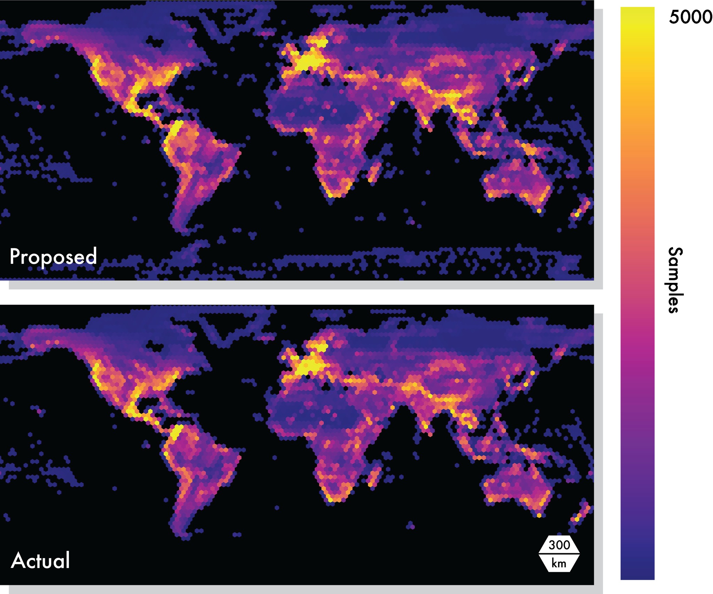

**[S111]**

**Original:**
values. Values are reported in total mm evapotranspiration (ET) per month.

**中文:**
values. Values are reported in total mm evapotranspiration (ET) per month.

**[S112]**

**Original:**
ceeded 10mm. To each sample we assigned a valid period of the entire month from which it was drawn, and a support period ending with the end of the valid period, and extending 1 year prior: this was chosen to emulate the realistic scenario where evapotranspiration estimates are desired at the conclusion of a given calendar month. We selected 300 train points per bin, and allocated

**中文:**
ceeded 10mm. To each sample we assigned a valid period of the entire month from which it was drawn, and a support period ending with the end of the valid period, and extending 1 year prior: this was chosen to emulate the realistic scenario where evapotranspiration estimates are desired at the conclusion of a given calendar month. We selected 300 train points per bin, and allocated

**[F011] Figure S12**

**Original:**
> Figure S12 | Distribution of OpenET ensemble                     the remainder to test. Our final OpenET ensem-

**中文:**
> Figure S12 | Distribution of OpenET（开放蒸散发） ensemble the remainder to test. Our final OpenET（开放蒸散发） ensem-

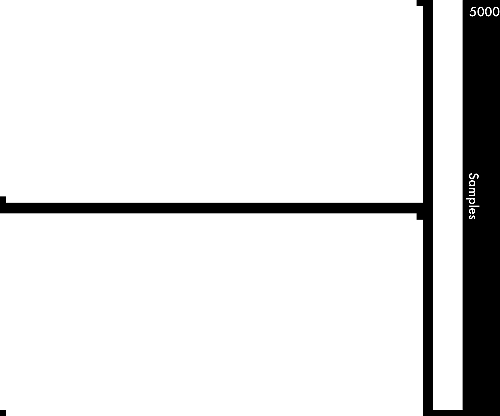

**[S114]**

**Original:**
sample locations.                                                ble evaluation has a total of 3,000 training points and 32,683 test points after pre-processing and Our OpenET evaluation dataset is derived from                 spatial proximity filtering. the OpenET monthly total ensemble product in Earth Engine. This dataset is designed not to                    S3.3.10. ASTER Global Emissivity Database measure performance on ET estimation directly.                            (GED) Rather, it characterizes performance on proxying the OpenET model ensemble, given that ensemble                   Emissivity is an intrinsic property of materials approaches are inherently computationally intenthat describes how efficiently a surface can emit sive and challenging to scale and has historically               radiation at a certain wavelength. The Advanced limited OpenET ensemble coverage (i.e., Figure                   Spaceborne Thermal Emission and Reflection RaS12). Thus accurate proxy models could be a                      diometer (ASTER) is the most detailed emissivity more viable means of scaling ensemble results                    map of the Earth. The dataset was created by over larger extents.                                             processing millions of cloud free ASTER images acquired between 2000 to 2008 (Hulley et al., We construct our OpenET evaluation by first 2015). ASTER-GED land surface temperature tiling CONUS in 35km grid cells in the Albers and emissivity are generated using a number of conic projection with EPSG code 5070. For each physical process models that aim to separate temgrid cell, we select a random month from all posperature and emissivity from overall reflectance sible months mapped in the source OpenET ensignals. Like OpenET, we consider ASTER-GED semble product, and sample 2 locations for each a proxy task that we can use to evaluate perforof 10 equally spaced 20mm bins between 0mm mance in terms of reproducing the results of a and 200mm. Locations with ET values > 200mm more complex modelling workflow for estimating were assigned to the highest bin (Figure S13). a material property. We ignore locations where less than 5 models in the ensemble ran, or the disagreement between                      We sample the 100-meter ASTER-GED prodthe minimum and maximum model estimates exuct available in Earth Engine (AG100: ASTER

**中文:**
sample locations. ble 评估 has a total of 3,000 训练 points and 32,683 test points after pre-processing and Our OpenET（开放蒸散发） 评估 数据集 is derived from spatial proximity filtering. the OpenET（开放蒸散发） monthly total ensemble product in Earth Engine. This 数据集 is designed not to S3.3.10. ASTER Global Emissivity Database measure performance on ET estimation directly. (GED) Rather, it characterizes performance on proxying the OpenET（开放蒸散发） model ensemble, given that ensemble Emissivity is an intrinsic property of materials approaches are inherently computationally intenthat describes how efficiently a surface can emit sive and challenging to scale and has historically radiation at a certain wavelength. The Advanced limited OpenET（开放蒸散发） ensemble coverage (i.e., Figure Spaceborne Thermal Emission and Reflection RaS12). Thus accurate proxy models could be a diometer (ASTER) is the most detailed emissivity more viable means of scaling ensemble results map of the Earth. The 数据集 was created by over larger extents. processing millions of cloud free ASTER images acquired between 2000 to 2008 (Hulley et al., We construct our OpenET（开放蒸散发） 评估 by first 2015). ASTER-GED land surface temperature tiling CONUS in 35km grid cells in the Albers and emissivity are generated using a number of conic projection with EPSG code 5070. For each physical process models that aim to separate temgrid cell, we select a random month from all posperature and emissivity from overall reflectance sible months mapped in the source OpenET（开放蒸散发） ensignals. Like OpenET（开放蒸散发）, we consider ASTER-GED semble product, and sample 2 locations for each a proxy task that we can use to evaluate perforof 10 equally spaced 20mm bins between 0mm mance in terms of reproducing the results of a and 200mm. Locations with ET values > 200mm more complex modelling workflow for estimating were assigned to the highest bin (Figure S13). a material property. We ignore locations where less than 5 models in the ensemble ran, or the disagreement between We sample the 100-meter ASTER-GED prodthe minimum and maximum model estimates exuct available in Earth Engine (AG100: ASTER

---

## Page 44

**[F012] Figure S15**

**Original:**
> Figure S15 | Distribution of ASTER GED values.

**中文:**
> Figure S15 | Distribution of ASTER GED values.

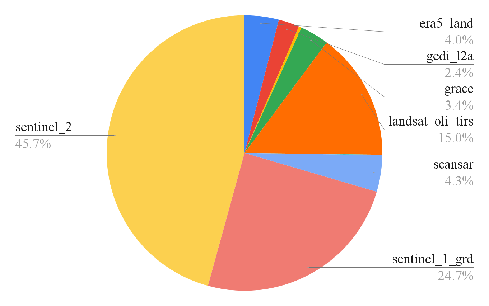

**[S116]**

**Original:**
Note that emissivity of natural Earth surfaces is a unitless quantity that typically ranges between 0.6 and 1.0. Surfaces with emissivities less than 0.85 are typically found over deserts and semiarid areas; vegetation, water, and ice have high

**中文:**
Note that emissivity of natural Earth surfaces is a unitless quantity that typically ranges between 0.6 and 1.0. Surfaces with emissivities less than 0.85 are typically found over deserts and semiarid areas; vegetation, water, and ice have high

**[F013] Figure S14**

**Original:**
> Figure S14 | Distribution of ASTER GED sample                    emissivities above 0.95.

**中文:**
> Figure S14 | Distribution of ASTER GED sample emissivities above 0.95.

**[S118]**

**Original:**
locations.

**中文:**
locations.

**[S119]**

**Original:**
Global Emissivity Dataset 100-meter V003;                        S4.1. Predictors "NASA/ASTER_GED/AG100_003") (Figure S14). The original dataset was generated for the years                 Given a training set ( 𝑒𝑡1 , 𝑙𝑡1 ) , ..., ( 𝑒𝑡𝑁 , 𝑙 𝑡𝑁 ) of 𝑁 exam- 2000-2008. We assume surface properties are                      ples and a validation set 𝑙1𝑣 , ..., 𝑙 𝑣𝑀 of 𝑀 embedrelatively stable at 100-meter resolution (though                dings with held out labels, we fit a predictor, or acknowledge this introduces added uncertainty                    "transfer method", using the training set and then in signal). We select 2017 for both the support                  report results on the validation set. and valid periods. We construct our sample by                       The purpose of the predictor is to obtain a label first arbitrarily selecting the 8.3 𝜇 m band ("emis-             𝑙 𝑗 for each embedding 𝑒𝑣𝑗 in the validation set. We sivity_band10") as our label, and subsetting to                  consider two simple predictors: a linear prediclocations for which all wavelength emissivity estitor (or "linear probe") and kNN. We chose these mates had standard deviations < 0.05. We furpredictors as they are applicable to low-shot data ther subsetted to locations exclusively over land,               domains and require minimal parameterization and within ± 60° latitude. We then oversampled                   which avoids unduly penalizing any given method by selecting 330k of the remaining locations over                due to non-optimal hyperparameters. land, and culling them with spatial proximity filtering. We then sample 2000 locations from 10                       For linear classification, we follow the "Ridgeequally spaced bins between emissivity values of                 Clasifier" in scikit-learn (Pedregosa et al., 2011) 0.7 and 1.0. We selected 200 train points per                    and use a one-vs-rest approach with a pure-linear 0.03 sized bin, and allocated the remainder to                   model per class. For each class in the training test (Figure S15). Our final ASTER GED evalset, we create labels {−1, 1} for each item in the uation has a total of 2,000 training points and                  training set, where −1 denotes absence of the 15,636 test points after pre-processing.                         class and 1 presence. We then use ordinary least squares to fit this model and obtain the predictor with 𝜆 = 0. As the classes are mutually exclusive, a given example in the validation is then classified S4. Details on evaluation setup                                  based on which of the classifiers gave the highest prediction. For each of our 15 evaluation datasets, we iterate through a suite of trials designed to test model                   For linear regression, we perform a simple leastperformance with varying degrees of label sparsquares fit between predictor and target variables sity and various transfer methods.                               with 𝜆 = 0.

**中文:**
Global Emissivity 数据集 100-meter V003; S4.1. Predictors "NASA/ASTER_GED/AG100_003") (Figure S14). The original 数据集 was generated for the years Given a 训练 set ( 𝑒𝑡1 , 𝑙𝑡1 ) , ..., ( 𝑒𝑡𝑁 , 𝑙 𝑡𝑁 ) of 𝑁 exam- 2000-2008. We assume surface properties are ples and a 验证 set 𝑙1𝑣 , ..., 𝑙 𝑣𝑀 of 𝑀 embedrelatively stable at 100-meter resolution (though dings with held out labels, we fit a predictor, or acknowledge this introduces added uncertainty "transfer method", using the 训练 set and then in signal). We select 2017 for both the support report results on the 验证 set. and valid periods. We construct our sample by The purpose of the predictor is to obtain a label first arbitrarily selecting the 8.3 𝜇 m band ("emis- 𝑙 𝑗 for each embedding 𝑒𝑣𝑗 in the 验证 set. We sivity_band10") as our label, and subsetting to consider two simple predictors: a linear prediclocations for which all wavelength emissivity estitor (or "线性探针") and kNN. We chose these mates had standard deviations < 0.05. We furpredictors as they are applicable to low-shot data ther subsetted to locations exclusively over land, domains and require minimal parameterization and within ± 60° 纬度. We then oversampled which avoids unduly penalizing any given method by selecting 330k of the remaining locations over due to non-optimal hyperparameters. land, and culling them with spatial proximity filtering. We then sample 2000 locations from 10 For linear 分类, we follow the "Ridgeequally spaced bins between emissivity values of Clasifier" in scikit-learn (Pedregosa et al., 2011) 0.7 and 1.0. We selected 200 train points per and use a one-vs-rest approach with a pure-linear 0.03 sized bin, and allocated the remainder to model per class. For each class in the 训练 test (Figure S15). Our final ASTER GED evalset, we create labels {−1, 1} for each item in the uation has a total of 2,000 训练 points and 训练 set, where −1 denotes absence of the 15,636 test points after pre-processing. class and 1 presence. We then use ordinary least squares to fit this model and obtain the predictor with 𝜆 = 0. As the classes are mutually exclusive, a given example in the 验证 is then classified S4. Details on 评估 setup based on which of the classifiers gave the highest prediction. For each of our 15 评估 datasets, we iterate through a suite of trials designed to test model For linear 回归, we perform a simple leastperformance with varying degrees of label sparsquares fit between predictor and target variables sity and various transfer methods. with 𝜆 = 0.

---

## Page 45

**[S120]**

**Original:**
To run the kNN predictor, the nearest set of 𝑘                 rate of a random predictor. Any scores that manembeddings 𝑒𝑡𝑛1 , ..., 𝑒𝑡𝑛𝑘 in the training set is found          aged to achieve a higher error rate than a random under an l2 distance. For a classification evalupredictor were clamped at 1. ation, with a set 𝐶 of possible class labels, the majority class labels of those 𝑘 embeddings in the S4.3. Max trial group folds train set is chosen: For datasets in our max-trial setting, we did not 𝑘 ∑︁                               always have an equivalent number of labels in 𝑙 𝑗 = max              𝑙 𝑡𝑛𝑖 = 𝑐        (6)     each training class. In these instances we drew 𝑐∈ C 𝑖                                k-folds based on the least present class 𝑐′ using the formula: For kNN regression, a simple average is used to obtain the final result:                                                                                 1000 𝑘=          ′                      (9) 𝑘                                                            2log10 𝑐 1 ∑︁ 𝑙𝑗 =               𝑙 𝑡𝑛𝑖            (7) 𝑘 𝑖                               E.g., Canada crops coarse for which 𝑐′ = 75, we drew 𝑘 = 273 folds (Table S12). When all classes For direct classification of change, we simply                 had an equivalent number of training labels perconcatenate each pair of embeddings characterclass, 𝑘 = 1. izing Earth’s local state before/after an event in both train and test, and follow through with the S4.4. Uncertainty estimation aforementioned predictors as stated. For unsupervised anomaly detection, we disWe use two complementary approaches to comcard the train set and l2 normalize each pair of                  pute the error bars for evaluation metrics. For validation embeddings providing a normalized                      "low-shot" evaluation trials that do not use the embedding before the event: , and after the event                 entire training split, we perform k-fold cross val- . We now take the dot product between each pair,                  idation and randomly sample K class-balanced remapped s.t. 0 = embeddings were the same, 1                     training sets by subsampling the full training split, = embeddings were on opposite poles:                              fit an independent predictor to each set and compute a normal distribution over metrics.

**中文:**
To run the kNN predictor, the nearest set of 𝑘 rate of a random predictor. Any scores that manembeddings 𝑒𝑡𝑛1 , ..., 𝑒𝑡𝑛𝑘 in the 训练 set is found aged to achieve a higher error rate than a random under an l2 distance. For a 分类 evalupredictor were clamped at 1. ation, with a set 𝐶 of possible class labels, the majority class labels of those 𝑘 embeddings in the S4.3. Max trial group folds train set is chosen: For datasets in our max-trial setting, we did not 𝑘 ∑︁ always have an equivalent number of labels in 𝑙 𝑗 = max 𝑙 𝑡𝑛𝑖 = 𝑐 (6) each 训练 class. In these instances we drew 𝑐∈ C 𝑖 k-folds based on the least present class 𝑐′ using the formula: For kNN 回归, a simple average is used to obtain the final result:   1000 𝑘= ′ (9) 𝑘 2log10 𝑐 1 ∑︁ 𝑙𝑗 = 𝑙 𝑡𝑛𝑖 (7) 𝑘 𝑖 E.g., Canada crops coarse for which 𝑐′ = 75, we drew 𝑘 = 273 folds (Table S12). When all classes For direct 分类 of change, we simply had an equivalent number of 训练 labels perconcatenate each pair of embeddings characterclass, 𝑘 = 1. izing Earth’s local state before/after an event in both train and test, and follow through with the S4.4. Uncertainty estimation aforementioned predictors as stated. For unsupervised anomaly detection, we disWe use two complementary approaches to comcard the train set and l2 normalize each pair of pute the error bars for 评估 metrics. For 验证 embeddings providing a normalized "low-shot" 评估 trials that do not use the embedding before the event: , and after the event entire 训练 split, we perform k-fold cross val- . We now take the dot product between each pair, idation and randomly sample K class-balanced remapped s.t. 0 = embeddings were the same, 1 训练 sets by subsampling the full 训练 split, = embeddings were on opposite poles: fit an independent predictor to each set and compute a normal distribution over metrics.

**[S121]**

**Original:**
1 − 𝑒¯𝑣𝑗 · 𝑝¯𝑣𝑗 𝑑𝑗 =                                  (8) 2                                                                           −1 𝑚𝑖 =M ({ 𝑓𝑖 ( 𝑒 𝑗 ) , 𝑙 𝑗 } 𝑀 𝑗=0 )        (10) We now choose a global threshold 𝑠 on (0, 1) to binarize all 𝑑 𝑗 , and thus provide a predicted 𝑙 𝑗 to compare to 𝑙 𝑗 𝑣. 𝑠 is chosen from one of 𝐾 −1 [0.1, 0.2, 0.3, 0.4, 0.5, 0.6, 0.7, 0.8, 0.9] to maxi-                                          1 ∑︁ mize BA over the entire validation dataset, and                                           ¯= 𝑚                𝑚𝑖               (11) 𝐾 𝑖=0 then all other metrics are computed using this threshold. v u 𝐾 −1 t S4.2. Kappa adjustment                                                                     1 ∑︁ 𝑠=                      ¯ )2 ( 𝑚𝑖 − 𝑚                 (12) 𝐾−1 When stated, kappa adjusted metrics were                                                      𝑖=0

**中文:**
1 − 𝑒¯𝑣𝑗 · 𝑝¯𝑣𝑗 𝑑𝑗 = (8) 2 −1 𝑚𝑖 =M ({ 𝑓𝑖 ( 𝑒 𝑗 ) , 𝑙 𝑗 } 𝑀 𝑗=0 ) (10) We now choose a global threshold 𝑠 on (0, 1) to binarize all 𝑑 𝑗 , and thus provide a predicted 𝑙 𝑗 to compare to 𝑙 𝑗 𝑣. 𝑠 is chosen from one of 𝐾 −1 [0.1, 0.2, 0.3, 0.4, 0.5, 0.6, 0.7, 0.8, 0.9] to maxi- 1 ∑︁ mize BA over the entire 验证 数据集, and ¯= 𝑚 𝑚𝑖 (11) 𝐾 𝑖=0 then all other metrics are computed using this threshold. v u 𝐾 −1 t S4.2. kappa（集中度参数） adjustment 1 ∑︁ 𝑠= ¯ )2 ( 𝑚𝑖 − 𝑚 (12) 𝐾−1 When stated, kappa（集中度参数） adjusted metrics were 𝑖=0

**[S122]**

**Original:**
rescaled by linearly transforming the metric range by the metric value a "random" predictor would                       where 𝑚𝑖 is the value of the metric M comachieve on average. For Balanced Error Rate                       puted on the validation set for the predictor 𝑓𝑖 (BER), 1 was remapped to the balanced error                       fitted to the 𝑖th training fold.

**中文:**
rescaled by linearly transforming the metric range by the metric value a "random" predictor would where 𝑚𝑖 is the value of the metric M comachieve on average. For Balanced Error Rate puted on the 验证 set for the predictor 𝑓𝑖 (BER（平衡错误率）), 1 was remapped to the balanced error fitted to the 𝑖th 训练 fold.

---

## Page 46

**[S123]**

**Original:**
For "full" evaluation trials, where we use the                 comparable manner. In the following sections, we entire training split to fit the downstream predicdescribe the process by which we obtain embedtor, we instead use bootstrap statistics instead,                dings (or embedding-like feature vectors), and resampling the validation split with replacement                 how those embeddings/features are extracted 𝐵 = 100 times and computing statistics across the                and aggregated. This process has to be redone samples:                                                         for each temporal window or spatial extent under study by obtaining the correct EO data and running their model and/or assessing resulting (𝑖) 𝑚𝑖 =M ({ 𝑓 ( 𝑒 𝑗 ) , 𝑙 𝑗 , 𝑤 𝑗 } 𝑀 −1 (13)      feature vectors using our standardized evaluation 𝑗=0 ) framework and datasets. To extract features/embeddings from baselines with outputs at a coarser spatial resolution than 𝐵 −1 1 ∑︁                                  AEF, we bi-linearly resample spatial dimensions ¯= 𝑚                𝑚𝑖               (14) 𝐵                                     to 10m, and extract the embedding at the precise 𝑖=0 location of the evaluation dataset sample. This location was centered as much as possible in the v u                                               geographic tile used for inference, and as the 𝐵 −1 t 1 ∑︁                                       (longitude, latitude) coordinates of labels were 𝑠=                      ¯ )2 ( 𝑚𝑖 − 𝑚                 (15)      kept at full precision, sub-pixel aliasing was taken 𝐵−1 𝑖=0 into account for extraction.

**中文:**
For "full" 评估 trials, where we use the comparable manner. In the following sections, we entire 训练 split to fit the 下游 predicdescribe the process by which we obtain embedtor, we instead use bootstrap statistics instead, dings (or embedding-like feature vectors), and resampling the 验证 split with replacement how those embeddings/features are extracted 𝐵 = 100 times and computing statistics across the and aggregated. This process has to be redone samples: for each 时序 window or spatial extent under study by obtaining the correct EO data and running their model and/or assessing resulting (𝑖) 𝑚𝑖 =M ({ 𝑓 ( 𝑒 𝑗 ) , 𝑙 𝑗 , 𝑤 𝑗 } 𝑀 −1 (13) feature vectors using our standardized 评估 𝑗=0 ) framework and datasets. To extract features/embeddings from baselines with outputs at a coarser 空间分辨率 than 𝐵 −1 1 ∑︁ AEF, we bi-linearly resample spatial dimensions ¯= 𝑚 𝑚𝑖 (14) 𝐵 to 10m, and extract the embedding at the precise 𝑖=0 location of the 评估 数据集 sample. This location was centered as much as possible in the v u geographic tile used for 推理, and as the 𝐵 −1 t 1 ∑︁ (经度, 纬度) coordinates of labels were 𝑠= ¯ )2 ( 𝑚𝑖 − 𝑚 (15) kept at full precision, sub-像素 aliasing was taken 𝐵−1 𝑖=0 into account for extraction.

**[S124]**

**Original:**
where is a weight indicating how many times                       As we were interested in assessing the extrapthe 𝑗th validation example is included in the 𝑖th                olation power given only sparse in-situ observa- Í −1 ( 𝑖 )                          tions, for linear probes we did not attempt to fit bootstrap sample (satisfying 𝑀  𝑗=0 𝑤 𝑗 = 𝑀 ). a full-patch linear decoder to the ViT-based apFor smaller datasets where it was not possible                proaches that produced spatially coarse tokens to create a balanced training set with at least 200              (ViT, Prithvi, Clay). We instead fit a per-pixel linexamples in each class (or 200 examples overall                  ear model after bi-linearly resampling the tokens for regression tasks), we used a combination of                  to 10m. To ensure equivalence to full-patch demultiple training sets (with number of examples                  coding, all evaluations concerned the same pixel per class equal to the size of the smallest class)               location (center) such that we were consistently and nested bootstrap resampling of the validation                fitting one of the many linear combinations we split to estimate the statistics.                                would have fit had we used a full-patch decoder.

**中文:**
where is a weight indicating how many times As we were interested in assessing the extrapthe 𝑗th 验证 example is included in the 𝑖th olation power given only sparse in-situ observa- Í −1 ( 𝑖 ) tions, for linear probes we did not attempt to fit bootstrap sample (satisfying 𝑀 𝑗=0 𝑤 𝑗 = 𝑀 ). a full-图像块 linear 解码器 to the ViT-based apFor smaller datasets where it was not possible proaches that produced spatially coarse tokens to create a balanced 训练 set with at least 200 (ViT, Prithvi, Clay). We instead fit a per-像素 linexamples in each class (or 200 examples overall ear model after bi-linearly resampling the tokens for 回归 tasks), we used a combination of to 10m. To ensure equivalence to full-图像块 demultiple 训练 sets (with number of examples coding, all evaluations concerned the same 像素 per class equal to the size of the smallest class) location (center) such that we were consistently and nested bootstrap resampling of the 验证 fitting one of the many linear combinations we split to estimate the statistics. would have fit had we used a full-图像块 解码器.

**[S125]**

**Original:**
S5. Baseline comparisons                                         S5.1. Controls (not EO-specific)

**中文:**
S5. Baseline comparisons S5.1. Controls (not EO-specific)

**[S126]**

**Original:**
We considered both widely adopted feature enS5.1.1. XY gineering approaches developed by the EO reThe XY coordinate baseline assumes that the search community, as well as new deep learning geospatial coordinates (i.e., longitude and latapproaches adapted for use with geospatial imitude) of a given set of sparsely distributed age inputs. We also included a set of controls geocoded labels or observations can be used to to establish the predictive power of purely geosimply interpolate values spatially. This control graphic information as well as a generic vision essentially tests the hypothesis that location "Is model trained on camera imagery (see Table S17 All You Need”. We decompose polar latitude and for summary). longitude coordinates in degrees into sine and Due to differences in handling of spatial, temcosine components. This puts coordinate values poral, and channel dimensions and hard-coded                     in a continuous range of values, removing the data source requirements, it is not always straightdiscontinuity that would otherwise result at the forward to apply them to our benchmark or in a                   antimeridian. We concatenate the results, and

**中文:**
We considered both widely adopted feature enS5.1.1. XY gineering approaches developed by the EO reThe XY coordinate baseline assumes that the search community, as well as new deep learning 地理空间 coordinates (i.e., 经度 and latapproaches adapted for use with 地理空间 imitude) of a given set of sparsely distributed age inputs. We also included a set of controls geocoded labels or observations can be used to to establish the predictive power of purely geosimply interpolate values spatially. This control graphic information as well as a generic vision essentially tests the hypothesis that location "Is model trained on camera imagery (see Table S17 All You Need”. We decompose polar 纬度 and for summary). 经度 coordinates in degrees into sine and Due to differences in handling of spatial, temcosine components. This puts coordinate values poral, and channel dimensions and hard-coded in a continuous range of values, removing the data source requirements, it is not always straightdiscontinuity that would otherwise result at the forward to apply them to our 基准测试 or in a antimeridian. We concatenate the results, and

---

## Page 47

**[S127]**

**Original:**
Approach            Category           Description                                      Dims          Inputs (m) XY                  Control            Latitude and longitude only                      4             XY XYZ                 Control            Latitude, longitude and elevation                5             XY, elevation ViT                 Control            Standard vision-transformer pre-trained on       1024          S2 (RGB-only) ImageNet Composites          Designed           Basic mean/median compositing of normal-         16            S1, S2, Landsat ized EO image inputs                                           8/9 CCDC                Designed           Harmonic spectral-temporal features              54            Landsat 8/9 (all bands) MOSAIKS             Designed           Engineered embedding space                       1024          S1, S2, Landsat 8/9 SatCLIP             Learned            Implicit model designed for EO data              256           XY Prithvi             Learned            EO foundation model                              768 2304      Harmonized Landsat-Sentinel (HLS) L30 Clay                Learned            EO foundation model                              768           S1, S2, Landsat 8/9

**中文:**
Approach Category Description Dims Inputs (m) XY Control 纬度 and 经度 only 4 XY XYZ Control 纬度, 经度 and elevation 5 XY, elevation ViT Control Standard vision-transformer pre-trained on 1024 S2 (RGB-only) ImageNet Composites Designed Basic mean/median compositing of normal- 16 S1, S2, Landsat ized EO image inputs 8/9 CCDC Designed Harmonic spectral-时序 features 54 Landsat 8/9 (all bands) MOSAIKS Designed Engineered embedding space 1024 S1, S2, Landsat 8/9 SatCLIP Learned Implicit model designed for EO data 256 XY Prithvi Learned EO 基础模型 768 2304 Harmonized Landsat-Sentinel (HLS) L30 Clay Learned EO 基础模型 768 S1, S2, Landsat 8/9

**[T128] Table S17**

**Original:**
> Table S17 | Summary of baseline approaches compared with AlphaEarth embeddings.

**中文:**
> Table S17 | Summary of baseline approaches compared with AlphaEarth embeddings.

**[S129]**

**Original:**
treat the resulting vectors as four-dimensional                      based on the mean and standard deviation of the positional XY embeddings.                                            training sample elevations. We concatenate XY coordinates with sampled elevation, resulting in We note that XY is not time-varying, so we five-dimensional positional XYZ embeddings. were unable to assess change detection evaluations and we generally expect poor performance                          We note that XYZ is not time-varying, so we on evaluations where landscapes are dynamic                          were unable to assess change detection evalua- (e.g. agriculture).                                                  tions and we generally expect poor performance on evaluations where landscapes are dynamic (e.g. agriculture). S5.1.2. XYZ

**中文:**
treat the resulting vectors as four-dimensional based on the mean and standard deviation of the positional XY embeddings. 训练 sample elevations. We concatenate XY coordinates with sampled elevation, resulting in We note that XY is not time-varying, so we five-dimensional positional XYZ embeddings. were unable to assess 变化检测 evaluations and we generally expect poor performance We note that XYZ is not time-varying, so we on evaluations where landscapes are dynamic were unable to assess 变化检测 evalua- (e.g. agriculture). tions and we generally expect poor performance on evaluations where landscapes are dynamic (e.g. agriculture). S5.1.2. XYZ

**[S130]**

**Original:**
The XYZ control extends the XY baseline to a three-dimensional location coordinate by includS5.1.3. Vision Transformer (ViT) ing elevation (height) information. Elevation The Vision Transformer (ViT) is a popular deep plays a role in both regulating abiotic conditions learning architecture for computer vision. We use and may act as a proxy for other terrain-driven a ViT trained on the standard ImageNet benchprocess interactions, e.g., (Hof et al., 2012). mark of images and classification annotations Therefore, the XYZ control tests the hypothesis (Dosovitskiy et al., 2020) as a control. This is that adding height information to positional ennominally a general-purpose model for computer codings will improve predictive power. As with vision, so we include it as a control to assess the XY baseline, we decompose latitude and lonperformance in comparison to systems designed gitude into trigonometric components. We also specifically for EO data. retrieve elevation information from the Copernicus GLO-30 DEM (see supplemental materials                             We choose the ViT-L/16 model architecture and S1.8 for more details on this dataset). We mosaic                    parameters because it is popular for benchmarkindividual images in the GLO-30 collection and                       ing and transfer learning in machine learning and select the elevation band (‘DEM’). Images are recomputer vision papers, e.g. (Chen et al., 2021). projected to WGS84 with a 1 arcsecond resolution                     As a pre-trained vision model for ImageNet, the for sampling. Elevation values are normalized                        ViT is limited in its resolution, bands, and han-

**中文:**
The XYZ control extends the XY baseline to a three-dimensional location coordinate by includS5.1.3. Vision Transformer (ViT) ing elevation (height) information. Elevation The Vision Transformer (ViT) is a popular deep plays a role in both regulating abiotic conditions learning architecture for computer vision. We use and may act as a proxy for other terrain-driven a ViT trained on the standard ImageNet benchprocess interactions, e.g., (Hof et al., 2012). mark of images and 分类 annotations Therefore, the XYZ control tests the hypothesis (Dosovitskiy et al., 2020) as a control. This is that adding height information to positional ennominally a general-purpose model for computer codings will improve predictive power. As with vision, so we include it as a control to assess the XY baseline, we decompose 纬度 and lonperformance in comparison to systems designed gitude into trigonometric components. We also specifically for EO data. retrieve elevation information from the Copernicus（哥白尼计划） GLO-30 DEM（数字高程模型） (see supplemental materials We choose the ViT-L/16 model architecture and S1.8 for more details on this 数据集). We mosaic parameters because it is popular for benchmarkindividual images in the GLO-30 collection and ing and 迁移学习 in machine learning and select the elevation band (‘DEM（数字高程模型）’). Images are recomputer vision papers, e.g. (Chen et al., 2021). projected to WGS84 with a 1 arcsecond resolution As a pre-trained vision model for ImageNet, the for sampling. Elevation values are normalized ViT is limited in its resolution, bands, and han-

---

## Page 48

**[S131]**

**Original:**
dling of multi-temporal imagery. Standard ViTs                      We composite inputs across time by taking the only accept a single RGB color image, so we select               median for optical sources (Sentinel-2, Landsatthe RGB bands of Sentinel-2 (L1C) normalized                     8/9) and the mean for radar sources (Sentinelto the training statistics as input. These are the               1). Composite inputs are pre-processed using the bands B2 (blue), B3 (green), and B4 (red). Each                  same methods described in supplemental materiinput image is embedded independently across                     als S1 and standardized by the AEF pretraining time, and the outputs are masked using the input                 dataset statistics. Individual images are padded mask. Time is then collapsed by output averagand masked as necessary to get constant input ing (weighted by masks). The result is a 1024-                   data dimensions. We filter by taking the observadimensional multi-temporal ViT embedding.                        tions in the valid period when we have them, and by taking the closest observations to the valid peTo maximize the performance of the ViT conriod bounds when we do not. Image sources are trol, we tuned its hyperparameters to the evalucombined by concatenation, so the dimension of ation set. We tried additional versions including the composite feature space varies with the choice one using annual composites, random initializaand number of sources. The number of channels tion, and stacking all features through time. We is equal to the sum of the number of bands across found the version described here the most persources, i.e., compositing in this way takes the formant, and surprisingly more performant than input shape 𝐵𝑥𝑇 𝑥 𝐻𝑥𝑊 𝑥 𝐷 and makes the output non-controls in a number of instances. shape 𝐵𝑥 𝐻𝑥𝑊 𝑥 𝐷′ . The final composite feature vector or “embedding” has 16 dimensions across the same Sentinel-1, Sentinel-2, and Landsat 8/9 S5.2. Designed EO features bands used for AEF inference. S5.2.1. Composites                                                  To maximize the performance of the composRather than rely on reflectance values from any inite baseline, we tuned its hyperparameters to dividual image acquisition, composite approaches                 the evaluation set. We tried additional versions combine observations from multiple image acquiincluding one using a consistently annual date sitions to generate spatially continuous mosaics                 range, mean rather than median compositing, that optimize for pixel "quality", acquisition timversions that omitted all combinations of optical / ing, and increasing signal-to-noise. Compositing                 radar sources, and versions that omitted masking. approaches are fairly ubiquitous in modern reWe found the version described here the most mote sensing applications, i.e., (Francini et al.,               performant. 2023; Qiu et al., 2023). Median composites are fairly standard for optical imagery and tend to                  S5.2.2. Continuous Change Detection and Clasbe preferred over mean composites because (a)                            sification (CCDC) medians preserve observed data values, and (b) are less sensitive to outliers, particularly clouds              Harmonic curve-fitting has become an increasand cloud shadows which spectrally lie at very                   ingly common approach for generating features extreme bright and dark values. For radar imthat characterize spectral-temporal trajectories, agery, mean composites tend to be more common                    e.g., (Pasquarella et al., 2018; Wilson et al., as the goal is less-so to avoid outliers and select              2018). The most basic way to generate these sorts real data values, and more-so to smooth across                   of harmonics would be simply fitting linear modmany noisy observations varying with slight deels to time series of EO data, e.g., (Wilson et al., viations in acquisition geometry. Composites are                 2018). However, there are several more sophisinherently lower-dimensional and orderless (comticated temporal segmentation approaches that pared with a stack of images which would be                      generate such features as part of a larger change higher-dimensional and preserve the time order                   detection workflows, i.e., Breaks For Additive Seaof observations), but serve as an important baseson and Trend (BFAST) (Verbesselt et al., 2010), line for pure spectral information from minimally                Exponentially Weighted Moving Average Change transformed de-noised/cloud-free image inputs.                   Detection (EWMACD) (Brooks et al., 2014), and

**中文:**
dling of 多时相 imagery. Standard ViTs We composite inputs across time by taking the only accept a single RGB color image, so we select median for 光学 sources (Sentinel-2, Landsatthe RGB bands of Sentinel-2 (L1C) normalized 8/9) and the mean for radar sources (Sentinelto the 训练 statistics as input. These are the 1). Composite inputs are pre-processed using the bands B2 (blue), B3 (green), and B4 (red). Each same methods described in supplemental materiinput image is embedded independently across als S1 and standardized by the AEF pretraining time, and the outputs are masked using the input 数据集 statistics. Individual images are padded mask. Time is then collapsed by output averagand masked as necessary to get constant input ing (weighted by masks). The result is a 1024- data dimensions. We filter by taking the observadimensional 多时相 ViT embedding. tions in the valid period when we have them, and by taking the closest observations to the valid peTo maximize the performance of the ViT conriod bounds when we do not. Image sources are trol, we tuned its hyperparameters to the evalucombined by concatenation, so the dimension of ation set. We tried additional versions including the composite feature space varies with the choice one using annual composites, random initializaand number of sources. The number of channels tion, and stacking all features through time. We is equal to the sum of the number of bands across found the version described here the most persources, i.e., compositing in this way takes the formant, and surprisingly more performant than input shape 𝐵𝑥𝑇 𝑥 𝐻𝑥𝑊 𝑥 𝐷 and makes the output non-controls in a number of instances. shape 𝐵𝑥 𝐻𝑥𝑊 𝑥 𝐷′ . The final composite feature vector or “embedding” has 16 dimensions across the same Sentinel-1, Sentinel-2, and Landsat 8/9 S5.2. Designed EO features bands used for AEF 推理. S5.2.1. Composites To maximize the performance of the composRather than rely on reflectance values from any inite baseline, we tuned its hyperparameters to dividual image acquisition, composite approaches the 评估 set. We tried additional versions combine observations from multiple image acquiincluding one using a consistently annual date sitions to generate spatially continuous mosaics range, mean rather than median compositing, that optimize for 像素 "quality", acquisition timversions that omitted all combinations of 光学 / ing, and increasing signal-to-noise. Compositing radar sources, and versions that omitted masking. approaches are fairly ubiquitous in modern reWe found the version described here the most mote sensing applications, i.e., (Francini et al., performant. 2023; Qiu et al., 2023). Median composites are fairly standard for 光学影像 and tend to S5.2.2. Continuous 变化检测 and Clasbe preferred over mean composites because (a) sification (CCDC) medians preserve observed data values, and (b) are less sensitive to outliers, particularly clouds Harmonic curve-fitting has become an increasand cloud shadows which spectrally lie at very ingly common approach for generating features extreme bright and dark values. For radar imthat characterize spectral-时序 trajectories, agery, mean composites tend to be more common e.g., (Pasquarella et al., 2018; Wilson et al., as the goal is less-so to avoid outliers and select 2018). The most basic way to generate these sorts real data values, and more-so to smooth across of harmonics would be simply fitting linear modmany noisy observations varying with slight deels to time series of EO data, e.g., (Wilson et al., viations in acquisition geometry. Composites are 2018). However, there are several more sophisinherently lower-dimensional and orderless (comticated 时序 分割 approaches that pared with a stack of images which would be generate such features as part of a larger change higher-dimensional and preserve the time order detection workflows, i.e., Breaks For Additive Seaof observations), but serve as an important baseson and Trend (BFAST) (Verbesselt et al., 2010), line for pure spectral information from minimally Exponentially Weighted Moving Average Change transformed de-noised/cloud-free image inputs. Detection (EWMACD) (Brooks et al., 2014), and

---

## Page 49

**[S132]**

**Original:**
the Continuous Change Detection and Classififault of 8192 in the original implementation and cation (CCDC) (Zhu and Woodcock, 2014) ap-                         1024 in our reference implementation). proach. We chose to use the CCDC approach The original model described in (Rolf et al., because it is (a) well-known and widely used for 2021) was developed for only single-date RGB imremote sensing applications (see Pasquarella et al. agery. We reference the Microsoft Planetary Com- (2022) for a review) and (b) has already been run puter implementation (Microsoft, 2021), which globally and surfaced as a dataset, making it one generates random filters rather than selecting of the few existing examples of a model-as-dataset input patches. Specifically, we sample random currently available globally in a cloud-computing convolutional filter parameters, once, for all inenvironment. puts, convolve each input image with these ranWe use precomputed CCDC features/paramedom filters, stack the filter responses and their ters from the global Landsat-based Earth Engine                    negatives to double the channels, apply a ReLU collection available for 1999-2024 (“projects/Cnonlinearity so the representation is not simply CDC/measures/v4”), which is an updated version                     linear, and pool out the spatial dimensions for a of the Google Global Landsat-based CCDC Segvector embedding of each input. ments (1999-2019) dataset described in Gorelick We also extend our implementation to supet al. (2023). CCDC coefficients are stored as port multi-source output averaging where emvariable-length arrays and are accessible as an beddings are generated for each source then avEarth Engine Image Collection. We select the eraged across the sources. This approach is preeight harmonic coefficients in the *_coefs bands ferred over concatenating embeddings for mul- [𝑜 𝑓 𝑓 𝑠𝑒𝑡 , 𝑡 , 𝑐𝑜𝑠 ( 𝜔𝑡 ), 𝑠𝑖𝑛 ( 𝜔𝑡 ), 𝑐𝑜𝑠 (2𝜔𝑡 ), 𝑠𝑖𝑛 (2𝜔𝑡 ), tiple sources as the specified embedding dimen- 𝑐𝑜𝑠 (3𝜔𝑡 ), 𝑠𝑖𝑛 (3𝜔𝑡 )] plus the *_rmse values for sionality is preserved regardless of the number seven Landsat bands (Blue, Green, Red, NIR, of sources. Similarly, we accommodate multiSWIR1, SWIR2, thermal). To match CCDC coeffitemporal embeddings by averaging outputs across cients with a valid period, we choose the segment time. The resulting multi-source, multi-temporal that intersects the valid period date for singleMOSAIKS embeddings have 1024 dimensions. date evaluations and the middle of the specified valid period for monthly and annual evaluations.                     To maximize the performance of the MOSAIKS The final CCDC feature vector or “embedding”                       baseline, we tuned its hyperparameters to the has 56 dimensions (8 coefficients for 7 Landsat                    evaluation set. We tried additional versions inbands).                                                            cluding one using a consistently annual input date range, versions that utilize composited inputs like those described in supplemental maS5.2.3. MOSAIKS                                                    terials S5.2.1, versions that omitted all combiMulti-task Observation using Satellite Imagery &                   nations of optical / radar sources, versions with Kitchen Sinks (MOSAIKS) is a designed nonlinear                    [64, 128, 256, 1024, 8192] output features, and representation of satellite imagery intended as                    versions stacking all features through time. We analysis-ready data for accessible use and efficient               found the version described here the most perforcomputation across downstream tasks (70). It                       mant. can be seen as a randomly-initialized linear combination of source data in a small sliding window with an additional non-linearity. The MOSAIKS                      S5.3. Learned EO features approach provides a spatially localized represenS5.3.1. SatCLIP tation of input satellite imagery at a specific time, bearing the same lack-of temporal constraints as                   SatCLIP is a deep learning-based approach that composites. In particular it was first designed for                takes inspiration from CLIP approach (Radford RGB composite inputs and then generalized to                       et al., 2021), training location and image enRGB Sentinel-2 inputs. The MOSAIKS output is                       coders via contrastive learning and matching imhigh dimensional and configurable (with a deages to their corresponding locations (Klemmer

**中文:**
the Continuous 变化检测 and Classififault of 8192 in the original implementation and cation (CCDC) (Zhu and Woodcock, 2014) ap- 1024 in our reference implementation). proach. We chose to use the CCDC approach The original model described in (Rolf et al., because it is (a) well-known and widely used for 2021) was developed for only single-date RGB imremote sensing applications (see Pasquarella et al. agery. We reference the Microsoft Planetary Com- (2022) for a review) and (b) has already been run puter implementation (Microsoft, 2021), which globally and surfaced as a 数据集, making it one generates random filters rather than selecting of the few existing examples of a model-as-数据集 input patches. Specifically, we sample random currently available globally in a cloud-computing convolutional filter parameters, once, for all inenvironment. puts, convolve each input image with these ranWe use precomputed CCDC features/paramedom filters, stack the filter responses and their ters from the global Landsat-based Earth Engine negatives to double the channels, apply a ReLU collection available for 1999-2024 (“projects/Cnonlinearity so the representation is not simply CDC/measures/v4”), which is an updated version linear, and pool out the spatial dimensions for a of the Google Global Landsat-based CCDC Segvector embedding of each input. ments (1999-2019) 数据集 described in Gorelick We also extend our implementation to supet al. (2023). CCDC coefficients are stored as port multi-source output averaging where emvariable-length arrays and are accessible as an beddings are generated for each source then avEarth Engine Image Collection. We select the eraged across the sources. This approach is preeight harmonic coefficients in the *_coefs bands ferred over concatenating embeddings for mul- [𝑜 𝑓 𝑓 𝑠𝑒𝑡 , 𝑡 , 𝑐𝑜𝑠 ( 𝜔𝑡 ), 𝑠𝑖𝑛 ( 𝜔𝑡 ), 𝑐𝑜𝑠 (2𝜔𝑡 ), 𝑠𝑖𝑛 (2𝜔𝑡 ), tiple sources as the specified embedding dimen- 𝑐𝑜𝑠 (3𝜔𝑡 ), 𝑠𝑖𝑛 (3𝜔𝑡 )] plus the *_rmse values for sionality is preserved regardless of the number seven Landsat bands (Blue, Green, Red, NIR, of sources. Similarly, we accommodate multiSWIR1, SWIR2, thermal). To match CCDC coeffitemporal embeddings by averaging outputs across cients with a valid period, we choose the segment time. The resulting multi-source, 多时相 that intersects the valid period date for singleMOSAIKS embeddings have 1024 dimensions. date evaluations and the middle of the specified valid period for monthly and annual evaluations. To maximize the performance of the MOSAIKS The final CCDC feature vector or “embedding” baseline, we tuned its hyperparameters to the has 56 dimensions (8 coefficients for 7 Landsat 评估 set. We tried additional versions inbands). cluding one using a consistently annual input date range, versions that utilize composited inputs like those described in supplemental maS5.2.3. MOSAIKS terials S5.2.1, versions that omitted all combiMulti-task Observation using Satellite Imagery & nations of 光学 / radar sources, versions with Kitchen Sinks (MOSAIKS) is a designed nonlinear [64, 128, 256, 1024, 8192] output features, and representation of satellite imagery intended as versions stacking all features through time. We analysis-ready data for accessible use and efficient found the version described here the most perforcomputation across 下游 tasks (70). It mant. can be seen as a randomly-initialized linear combination of source data in a small sliding window with an additional non-linearity. The MOSAIKS S5.3. Learned EO features approach provides a spatially localized represenS5.3.1. SatCLIP tation of input satellite imagery at a specific time, bearing the same lack-of 时序 constraints as SatCLIP is a deep learning-based approach that composites. In particular it was first designed for takes inspiration from CLIP approach (Radford RGB composite inputs and then generalized to et al., 2021), 训练 location and image enRGB Sentinel-2 inputs. The MOSAIKS output is coders via contrastive learning and matching imhigh dimensional and configurable (with a deages to their corresponding locations (Klemmer

---

## Page 50

**[S133]**

**Original:**
et al., 2025). SatCLIP models are trained on the                 2 Landsat Operational Land Imager Surface Repre-extracted Sentinel-2-100k dataset, a collecflectance and TOA Brightness Daily Global 30m tion of 100 000 Sentinel-2 images that includes all              collection (Masek et al., 2021) on Earth Enavailable bands (B01, B02, B03, B04, B06, B06,                   gine ("NASA/HLS/HLSL30/v002"). We sample B07, B08, B08A, B09, B11, B12) resampled to                      patches of 224x224 at a 30-meter spatial res- 10m resolution. The SatCLIP authors provide six                  olution. We fetch all images under a specified pretrained SatCLIP models, trained with different                cloud cover threshold (20% or 50%) for the supvision encoders and spatial resolution hyperpaport period and incrementally increase the frame rameters.                                                        (into the past) by the HLS maximum revisit period until we find an available image. We use a We evaluate only the SatCLIP Vit16-L40 model, cloud coverage threshold of 20% for all evaluation which outperforms other versions according to datasets with the exception of the Descals evaluathe SatCLIP paper (Klemmer et al., 2025). Durtion dataset, where we use a higher (50%) cloud ing evaluation, we use only the location encoder, coverage threshold due to low imagery availabilfollowing the procedure suggested by the auity. In rare instances (< 1% for any given dataset), thors. No specific preprocessing of the locations the cloud coverage-based filtering yields no data, is required beforehand, i.e., the location encoder and in these cases we set embeddings for such takes longitude and latitude. Generated SatCLIP entries as the expectation over the computed emembeddings have 256 dimensions. We note that beddings for a given dataset. SatCLIP is not time-varying, so we were unable to assess change detection evaluations and we generally expect poor performance on evaluations                    S5.3.3. Clay where landscapes are dynamic (e.g. agriculture). The Clay Foundation Model is more akin to a traditional ViT differentiated by the use of inS5.3.2. Prithvi                                                  put metadata at inference time. This metadata includes nominal resolution, the geographic cenPrithvi is a temporal pre-trained ViT-based architroid of the input, a source encoding derived from tecture trained in a fashion similar to Cong et al. a wavelength associated with the bandpass or (2022) on Harmonized Landsat Sentinel (HLS) transmission when applicable, and the observaL30 imagery with 30m nominal scale collected tion timestamp (Clay, 2024). Generating semanover the contiguous United States during 2017 tic embeddings for any location and time is a (Jakubik et al., 2023a,b). Input videos are limstated use case for the Clay model, and classificaited to three in the model version provided by the tion, regression, and detecting changes over time authors. Prithvi is considered a geospatial founare suggested use-cases by the authors. dation model, the encoder output from which can be used to solve various downstream tasks.                      We sample 256x256 pixel images with a nomiWhile Prithvi authors only explicitly suggest its                nal scale of 10 meters for Sentinel-2 / Sentineluse with additional deep-learning decoders, it                   1, and 30 meters for Landsat 8/9 per authoris common to transfer ViT-like architectures via                 provided instructions. We filter out Landsat and linear decoding as we do here.                                   Sentinel-2 images with cloud coverage exceeding 20%, after that we limit the number of entries per We use the Prithvi 1.0 model and adapt the aptime frame to fit them into NVIDIA V100 RAM proach described in the Prithvi-specific example (30 frames maximum). Input images are normalHLS Multi-temporal Crop Classification Model ized using statistics unique to each evaluation’s (Li et al., 2023), where encoder outputs are used training split. To obtain the final embedding over as embeddings in a crop classification task. The the valid period, we average over per-source permulti-temporal embedding dimension is equal to time spatial tokens for a final dimensionality of 768 multiplied by the number of frames available 768. When no imagery for a particular source is (1 to 3) yielding 768 to 2304 dimensions. available within the valid period, we follow the We retrieve input data from the HLSL30: HLSprocedure used for HLS detailed in supplemental

**中文:**
et al., 2025). SatCLIP models are trained on the 2 Landsat Operational Land Imager Surface Repre-extracted Sentinel-2-100k 数据集, a collecflectance and TOA Brightness Daily Global 30m tion of 100 000 Sentinel-2 images that includes all collection (Masek et al., 2021) on Earth Enavailable bands (B01, B02, B03, B04, B06, B06, gine ("NASA/HLS/HLSL30/v002"). We sample B07, B08, B08A, B09, B11, B12) resampled to patches of 224x224 at a 30-meter spatial res- 10m resolution. The SatCLIP authors provide six olution. We fetch all images under a specified pretrained SatCLIP models, trained with different cloud cover threshold (20% or 50%) for the supvision encoders and 空间分辨率 hyperpaport period and incrementally increase the 帧 rameters. (into the past) by the HLS maximum revisit period until we find an available image. We use a We evaluate only the SatCLIP Vit16-L40 model, cloud coverage threshold of 20% for all 评估 which outperforms other versions according to datasets with the exception of the Descals evaluathe SatCLIP paper (Klemmer et al., 2025). Durtion 数据集, where we use a higher (50%) cloud ing 评估, we use only the location 编码器, coverage threshold due to low imagery availabilfollowing the procedure suggested by the auity. In rare instances (< 1% for any given 数据集), thors. No specific preprocessing of the locations the cloud coverage-based filtering yields no data, is required beforehand, i.e., the location 编码器 and in these cases we set embeddings for such takes 经度 and 纬度. Generated SatCLIP entries as the expectation over the computed emembeddings have 256 dimensions. We note that beddings for a given 数据集. SatCLIP is not time-varying, so we were unable to assess 变化检测 evaluations and we generally expect poor performance on evaluations S5.3.3. Clay where landscapes are dynamic (e.g. agriculture). The Clay 基础模型 is more akin to a traditional ViT differentiated by the use of inS5.3.2. Prithvi put metadata at 推理 time. This metadata includes nominal resolution, the geographic cenPrithvi is a 时序 pre-trained ViT-based architroid of the input, a source encoding derived from tecture trained in a fashion similar to Cong et al. a wavelength associated with the bandpass or (2022) on Harmonized Landsat Sentinel (HLS) transmission when applicable, and the observaL30 imagery with 30m nominal scale collected tion timestamp (Clay, 2024). Generating semanover the contiguous United States during 2017 tic embeddings for any location and time is a (Jakubik et al., 2023a,b). Input videos are limstated use case for the Clay model, and classificaited to three in the model version provided by the tion, 回归, and detecting changes over time authors. Prithvi is considered a 地理空间 founare suggested use-cases by the authors. dation model, the 编码器 output from which can be used to solve various 下游 tasks. We sample 256x256 像素 images with a nomiWhile Prithvi authors only explicitly suggest its nal scale of 10 meters for Sentinel-2 / Sentineluse with additional deep-learning decoders, it 1, and 30 meters for Landsat 8/9 per authoris common to transfer ViT-like architectures via provided instructions. We filter out Landsat and linear decoding as we do here. Sentinel-2 images with cloud coverage exceeding 20%, after that we limit the number of entries per We use the Prithvi 1.0 model and adapt the aptime 帧 to fit them into NVIDIA V100 RAM proach described in the Prithvi-specific example (30 frames maximum). Input images are normalHLS 多时相 Crop 分类 Model ized using statistics unique to each 评估’s (Li et al., 2023), where 编码器 outputs are used 训练 split. To obtain the final embedding over as embeddings in a crop 分类 task. The the valid period, we average over per-source permulti-时序 embedding dimension is equal to time spatial tokens for a final dimensionality of 768 multiplied by the number of frames available 768. When no imagery for a particular source is (1 to 3) yielding 768 to 2304 dimensions. available within the valid period, we follow the We retrieve input data from the HLSL30: HLSprocedure used for HLS detailed in supplemental

---

## Page 51

**[S134]**

**Original:**
materials S5.3.2.                                                ing use cases that may have previously been untenable given sparse observational records and/or There are a number of suggested mechanisms highly detailed taxonomies. for extracting embeddings from The Clay Foundation Model. For example, the authors suggest                      For the applications considered, AEF often oftaking the class token as a patch embedding, and                 fers a notable improvement over other archetypal in others, the non-class tokens are averaged. To                 examples of other designed and learned feature tune Clay hyperparameters to our evaluation set,                 spaces. CCDC harmonics were the next-best prewe tried a number of Clay variants. These indictors for Canada crops (coarse and fine) and cluded using the class token for a patch repreAfrica crop mask, suggesting spectral-temporal sentation and versions that omitted combinations                 information characterizing phenology is more imof optical / radar sources. We found the version                 portant than spatial resolution or multi-sensor described here the most performant.                              inputs for these crop-mapping applications. SatCLIP was the next-best approach for Ethiopia crops and US trees, evaluations we would expect S6. Additional results & discussion                              should benefit phenological information. Preference for SatCLIP here suggests encoding localized S6.1. Comparisons with 10 and 1 samples perEO features was beneficial for these tasks, and class improvements for SatCLIP relative to the coordiIn our extreme low-shot trials, overall perfornate and ViT controls indicate that these gains mance of methods was close to random chance                      can be attributed to inclusion of EO-specific inin many cases. For 500-fold 10-shot trials, AEF                  formation content. We find that MOSAIKS is the error reductions were only > 1.0x in the ~90%                    next-best predictor for GLancE and LCMAP land confidence interval for 8/15 evaluations with an                 cover, while Clay for LUCAS land use and land average range of variation ±0.38x, and for 1000-                 cover. Preference for MOSAIKS indicates spatial fold 1-shot trials, AEF error reductions were only               context provides valuable information for land > 1.0x in the ~90% confidence interval in 5/15                   cover mapping at both national and global scales, evaluations with average variation ±0.49x. While                 as it would for Clay which also does not have the mean gain was in AEF’s favor for both settings,              access to multitemporal information. we consider the extreme degree of variability inInterestingly, we found that in some cases, condicative that adequate general 1-shot or 10-shot                 trols were selected as the second-best approach, performance remains an unsolved research fronspecifically the XYZ control for the Descals oil tier.                                                            palm evaluation and the ViT for the LCMAP land use evaluation. This suggests that AEF is more S6.2. Classification                                             effectively leveraging EO-specific data sources to generate learned representations than other baseAEF showed consistently strong performance                       lines that do not consistently outperform controls. across all classification evaluations, while the                 In general, we found Prithvi to exhibit poor pernext-best approach varies considerably with some                 formance. This is not particularly surprising given approaches performing no better than the null                    the model is not explicitly designed to provide expectation for some datasets (Figure S16). This                 a feature space, and confirms that Prithvi is not result indicates the utility of AEF as a generalwell-suited for this sort of low-shot classification purpose feature space suitable for a multitude of                and requires additional fine-tuning. However, it is classification problems ranging from simple, biinteresting to note the lack of parity with the ViT nary legends to detailed land use, land cover, and               control that has not been trained on EO data, does even genus-level tree species mapping. While furnot have access to multitemporal information, nor ther iteration on training labels and/or secondary               is intended to function as a feature space. predictors may improve absolute accuracies, AEF shows previously unachievable performance in                       Of the low-shot classification methods considlow-shot regimes with simple classifiers, unlockered, AEF features typically exhibited the great-

**中文:**
materials S5.3.2. ing use cases that may have previously been untenable given sparse observational records and/or There are a number of suggested mechanisms highly detailed taxonomies. for extracting embeddings from The Clay 基础模型. For example, the authors suggest For the applications considered, AEF often oftaking the class token as a 图像块 embedding, and fers a notable improvement over other archetypal in others, the non-class tokens are averaged. To examples of other designed and learned feature tune Clay hyperparameters to our 评估 set, spaces. CCDC harmonics were the next-best prewe tried a number of Clay variants. These indictors for Canada crops (coarse and fine) and cluded using the class token for a 图像块 repreAfrica crop mask, suggesting spectral-时序 sentation and versions that omitted combinations information characterizing phenology is more imof 光学 / radar sources. We found the version portant than 空间分辨率 or 多传感器 described here the most performant. inputs for these crop-mapping applications. SatCLIP was the next-best approach for Ethiopia crops and US trees, evaluations we would expect S6. Additional results & discussion should benefit phenological information. Preference for SatCLIP here suggests encoding localized S6.1. Comparisons with 10 and 1 samples perEO features was beneficial for these tasks, and class improvements for SatCLIP relative to the coordiIn our extreme low-shot trials, overall perfornate and ViT controls indicate that these gains mance of methods was close to random chance can be attributed to inclusion of EO-specific inin many cases. For 500-fold 10-shot trials, AEF formation content. We find that MOSAIKS is the error reductions were only > 1.0x in the ~90% next-best predictor for GLanCE（全球土地覆盖估算） and LCMAP land confidence interval for 8/15 evaluations with an cover, while Clay for LUCAS（欧盟土地利用/覆盖统计调查） 土地利用 and land average range of variation ±0.38x, and for 1000- cover. Preference for MOSAIKS indicates spatial fold 1-shot trials, AEF error reductions were only context provides valuable information for land > 1.0x in the ~90% confidence interval in 5/15 cover mapping at both national and global scales, evaluations with average variation ±0.49x. While as it would for Clay which also does not have the mean gain was in AEF’s favor for both settings, access to multitemporal information. we consider the extreme degree of variability inInterestingly, we found that in some cases, condicative that adequate general 1-shot or 10-shot trols were selected as the second-best approach, performance remains an unsolved research fronspecifically the XYZ control for the Descals oil tier. palm 评估 and the ViT for the LCMAP 土地利用 评估. This suggests that AEF is more S6.2. 分类 effectively leveraging EO-specific data sources to generate learned representations than other baseAEF showed consistently strong performance lines that do not consistently outperform controls. across all 分类 evaluations, while the In general, we found Prithvi to exhibit poor pernext-best approach varies considerably with some formance. This is not particularly surprising given approaches performing no better than the null the model is not explicitly designed to provide expectation for some datasets (Figure S16). This a feature space, and confirms that Prithvi is not result indicates the utility of AEF as a generalwell-suited for this sort of low-shot 分类 purpose feature space suitable for a multitude of and requires additional 微调. However, it is 分类 problems ranging from simple, biinteresting to note the lack of parity with the ViT nary legends to detailed 土地利用, 土地覆盖, and control that has not been trained on EO data, does even genus-level tree species mapping. While furnot have access to multitemporal information, nor ther iteration on 训练 labels and/or secondary is intended to function as a feature space. predictors may improve absolute accuracies, AEF shows previously unachievable performance in Of the low-shot 分类 methods considlow-shot regimes with simple classifiers, unlockered, AEF features typically exhibited the great-

---

## Page 52

**[F014] Figure S16**

**Original:**
> Figure S16 | Classification results reported in terms of balanced accuracy. Black dotted line indicates

**中文:**
> Figure S16 | 分类 results reported in terms of balanced 准确率. Black dotted line indicates

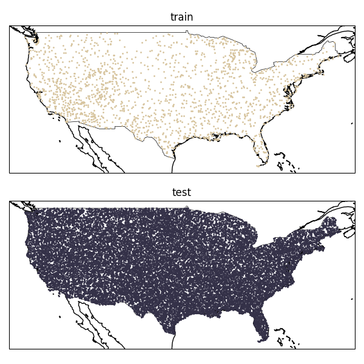

**[S136]**

**Original:**
expected accuracy given random chance / number of classes. Error bars indicate 1𝜎 (68.27%) confidence interval by bootstrapping or bootstrapping and k-folds for small datasets, e.g., ethiopia_crops, canada_crops_*.

**中文:**
expected 准确率 given random chance / number of classes. Error bars indicate 1𝜎 (68.27%) confidence interval by bootstrapping or bootstrapping and k-folds for small datasets, e.g., ethiopia_crops, canada_crops_*.

---

## Page 53

**[F015] Figure S17**

**Original:**
> Figure S17 | Regression results reported in terms                Figure S18 | Regression results reported in terms

**中文:**
> Figure S17 | 回归 results reported in terms Figure S18 | 回归 results reported in terms

**[S138]**

**Original:**
of mean 𝑅2 values. Error bars indicate 1𝜎                        of Mean Absolute Error (MAE). Error bars indi- (68.27%) confidence interval by bootstrapping.                   cate 1𝜎 (68.27%) confidence interval by bootNegative 𝑅2 estimates were clamped to zero for                   strapping. Dotted line represents approximate visualization purposes.                                          expectation of error from product publications.

**中文:**
of mean 𝑅2 values. Error bars indicate 1𝜎 of Mean Absolute Error (MAE（平均绝对误差）). Error bars indi- (68.27%) confidence interval by bootstrapping. cate 1𝜎 (68.27%) confidence interval by bootNegative 𝑅2 estimates were clamped to zero for strapping. Dotted line represents approximate visualization purposes. expectation of error from product publications.

**[S139]**

**Original:**
est balanced accuracies for the linear classifier                   For predicting ASTER emissivity values, MOexperiments for the max trial groups, with the                   SAIKS is the next-best approach and composexception of Ethiopia crops, where kNN with                      ites generally show strong performance, while k=1 is preferred (Figure S16). We believe the                    spectral-temporal CCDC features and XY and Ethiopia crops evaluation is particularly challengXYZ positional encodings are demonstrably worse. ing given its extreme sparsity and fine scale, and               This indicates that local spatial patterns and overso simple nearest neighbor classification was the                all reflectance (as opposed to seasonality in rebest method of transfer for a handful of methods.                flectance) are important factors for this use case. Given the generally poor performance of all methWhen evaluating on the OpenET Ensemble ods on this four class classification problem, there             dataset, we found that AEF was the only approach are opportunities to improve performance on this                 to produce viable results using all kNN and lintype of dataset.                                                 ear predictors considered. Of the other baselines, composites with linear probes and MOSAIKS with knn with k=3 produced the only other viable reS6.3. Regression                                                 sults in terms of having 𝑅2 values greater than 0 (i.e., greater variance explained than the mean). For regression tasks, AEF again exhibited the best Looking at results in terms of MAE where lower overall performance in terms of both gains in 𝑅2 values indicate better performance, we find AEF and reductions in MAE (Figures S17 and S18). has an error rate in line with what would be exWe find that 𝑅2 values for AEF are always within a pected for both ASTER GED and OpenET perforvalid range, noting that several other approaches mance expectations for the data products these produced negative 𝑅2 values i.e. worse-than-null evaluation datasets were sampled from (Figure performance for ASTER GED (emissivity predicS18). Here we can more clearly see variability tion). OpenET ensemble (evapotranspiration prein performance, with particularly large errors for diction) was evidently more challenging where SatCLIP and Prithvi linear trials. almost all other methods had negative values (clipped to −0.01 for plotting purposes; Figure                    Though we note the small sample use cases S17).                                                            represented here, we do note that continuous

**中文:**
est balanced accuracies for the linear classifier For predicting ASTER emissivity values, MOexperiments for the max trial groups, with the SAIKS is the next-best approach and composexception of Ethiopia crops, where kNN with ites generally show strong performance, while k=1 is preferred (Figure S16). We believe the spectral-时序 CCDC features and XY and Ethiopia crops 评估 is particularly challengXYZ positional encodings are demonstrably worse. ing given its extreme sparsity and fine scale, and This indicates that local spatial patterns and overso simple nearest neighbor 分类 was the all reflectance (as opposed to seasonality in rebest method of transfer for a handful of methods. flectance) are important factors for this use case. Given the generally poor performance of all methWhen evaluating on the OpenET（开放蒸散发） Ensemble ods on this four class 分类 problem, there 数据集, we found that AEF was the only approach are opportunities to improve performance on this to produce viable results using all kNN and lintype of 数据集. ear predictors considered. Of the other baselines, composites with linear probes and MOSAIKS with knn with k=3 produced the only other viable reS6.3. 回归 sults in terms of having 𝑅2 values greater than 0 (i.e., greater variance explained than the mean). For 回归 tasks, AEF again exhibited the best Looking at results in terms of MAE（平均绝对误差） where lower overall performance in terms of both gains in 𝑅2 values indicate better performance, we find AEF and reductions in MAE（平均绝对误差） (Figures S17 and S18). has an error rate in line with what would be exWe find that 𝑅2 values for AEF are always within a pected for both ASTER GED and OpenET（开放蒸散发） perforvalid range, noting that several other approaches mance expectations for the data products these produced negative 𝑅2 values i.e. worse-than-null 评估 datasets were sampled from (Figure performance for ASTER GED (emissivity predicS18). Here we can more clearly see variability tion). OpenET（开放蒸散发） ensemble (evapotranspiration prein performance, with particularly large errors for diction) was evidently more challenging where SatCLIP and Prithvi linear trials. almost all other methods had negative values (clipped to −0.01 for plotting purposes; Figure Though we note the small sample use cases S17). represented here, we do note that continuous

---

## Page 54

**[S140]**

**Original:**
baselines as additional observations are added (Figure S21). Baselines were omitted when 𝑅2 values were < 0, or for change detection evaluations when the baseline was not time-varying (SatCLIP). We note no obvious trend among the baselines, indicating methodologies that perform better on some problems more so than others. AEF generally improves monotonically as additional observations are added for 9-of-15 evaluation datasets. There is some unpredictable nonmonotonicity for some evals, but we do not identify any obvious grouping or regional bias.

**中文:**
baselines as additional observations are added (Figure S21). Baselines were omitted when 𝑅2 values were < 0, or for 变化检测 evaluations when the baseline was not time-varying (SatCLIP). We note no obvious trend among the baselines, indicating methodologies that perform better on some problems more so than others. AEF generally improves monotonically as additional observations are added for 9-of-15 评估 datasets. There is some unpredictable nonmonotonicity for some evals, but we do not identify any obvious grouping or regional bias.

**[S141]**

**Original:**
S7.2. Sources

**中文:**
S7.2. Sources

**[S142]**

**Original:**
We share a full set of plots detailing the perfor-

**中文:**
We share a full set of plots detailing the perfor-

**[F016] Figure S19**

**Original:**
> Figure S19 | Change detection results reported                   mance of AEF relative to ablated by source groups.

**中文:**
> Figure S19 | 变化检测 results reported mance of AEF relative to ablated by source groups.

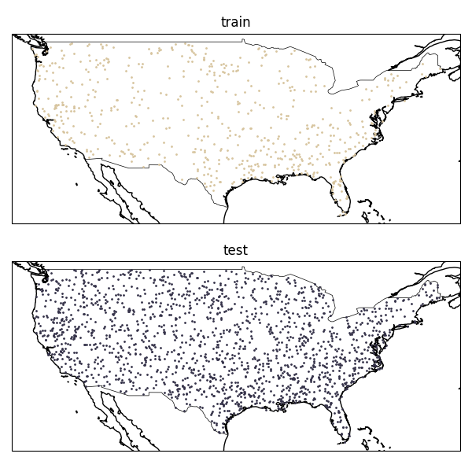

**[S144]**

**Original:**
in terms of balanced accuracy. The black dottedThe groups are as follows: Optical (Sentinel-2, line indicates random chance for classification                  Landsat-8 / Landsat-9), Radar (Sentinel-1, PALevaluations given the number of classes. Error                   SAR2 ScanSAR), LiDAR (GEDI), Environmental bars indicate 1𝜎 (68.27%)confidence interval by                  (GLO 30, ERA5 Land, GRACE), and Annotated bootstrapping.                                                   (NLCD, Wikipedia) (Figure S21). We note a variety of patterns characterized by source groups, though 11-of-15 evaluations were most performeasurements, as opposed to discrete categorical                 mant with all groups. Evidently, different evalulabels, are often associated with field-based obserations "prefer" different types of measurements; vational datasets, and we expect to see external                 in some cases this is expected e.g. the Descals comparisons including AEF on additional regresoil palm evaluation is most performant with Opsion problems in the future following our data                   tical + Radar + LiDAR as these groups offer the release (see Global embeddings dataset section).                 most information regarding sub-canopy structure, where climatic variables and free-form text anS6.4. Change detection                                           notations / land-cover labels are less informative. Unsurprisingly, all LULC evaluations (exThe SatCLIP, XY, and XYZ baselines were omitted                  cluding change) are most performant with all from change detection comparisons given these                    groups including the Annotated group, though approaches are location-only, i.e., have no time                 interestingly this does not lead to the biggest perhandling or way to differentiate between obserformance gain compared to adding radar and vations at different times. We find generally less               lidar data. differentiation in performance across methods, with the exception of Prithvi and linear trials of MOSAIKS, which perform at or near the random                     S7.3. Bottleneck characteristics baseline (Figure S19). AEF’s reconstruction task relies on a noisy bottleneck to compress and extrapolate information from the sparse input sequence. Two model hyS7. Ablations perparameters, the embedding dimension, and S7.1. Training observations                                      the channel noise parameterized by VMF 𝜅, directly affect the capacity of this bottleneck. Lower We share a full set of plots detailing the perforsettings of 𝜅 in particular will also affect the mance scaling of AEF relative to other learned                   smoothness of the latent (embedding) manifold

**中文:**
in terms of balanced 准确率. The black dottedThe groups are as follows: 光学 (Sentinel-2, line indicates random chance for 分类 Landsat-8 / Landsat-9), Radar (Sentinel-1, PALevaluations given the number of classes. Error SAR2 ScanSAR), LiDAR (GEDI（全球生态系统动态调查）), Environmental bars indicate 1𝜎 (68.27%)confidence interval by (GLO 30, ERA5 Land, GRACE), and Annotated bootstrapping. (NLCD（美国国家土地覆盖数据库）, Wikipedia) (Figure S21). We note a variety of patterns characterized by source groups, though 11-of-15 evaluations were most performeasurements, as opposed to discrete categorical mant with all groups. Evidently, different evalulabels, are often associated with field-based obserations "prefer" different types of measurements; vational datasets, and we expect to see external in some cases this is expected e.g. the Descals comparisons including AEF on additional regresoil palm 评估 is most performant with Opsion problems in the future following our data tical + Radar + LiDAR as these groups offer the release (see Global embeddings 数据集 section). most information regarding sub-canopy structure, where climatic variables and free-form text anS6.4. 变化检测 notations / land-cover labels are less informative. Unsurprisingly, all LULC evaluations (exThe SatCLIP, XY, and XYZ baselines were omitted cluding change) are most performant with all from 变化检测 comparisons given these groups including the Annotated group, though approaches are location-only, i.e., have no time interestingly this does not lead to the biggest perhandling or way to differentiate between obserformance gain compared to adding radar and vations at different times. We find generally less lidar data. differentiation in performance across methods, with the exception of Prithvi and linear trials of MOSAIKS, which perform at or near the random S7.3. 瓶颈层 characteristics baseline (Figure S19). AEF’s 重建 task relies on a noisy 瓶颈层 to compress and extrapolate information from the sparse input 序列. Two model hyS7. Ablations perparameters, the embedding dimension, and S7.1. 训练 observations the channel noise parameterized by von Mises-Fisher(VMF)分布 𝜅, directly affect the capacity of this 瓶颈层. Lower We share a full set of plots detailing the perforsettings of 𝜅 in particular will also affect the mance scaling of AEF relative to other learned smoothness of the latent (embedding) manifold

---

## Page 55

**[F017] Figure S20**

**Original:**
> Figure S20 | Effects of scaling observations for evals in linear probe max-trial regime. Error bars

**中文:**
> Figure S20 | Effects of scaling observations for evals in 线性探针 max-trial regime. Error bars

**[S146]**

**Original:**
indicate 1𝜎 BA / 𝑅2 or ~68.27% confidence interval by bootstrapping and k-folds when possible. AEF is represented by the dotted line and star markers.

**中文:**
indicate 1𝜎 BA / 𝑅2 or ~68.27% confidence interval by bootstrapping and k-folds when possible. AEF is represented by the dotted line and star markers.

---

## Page 56

**[F018] Figure S21**

**Original:**
> Figure S21 | Effects of additional source groups for evals in linear probe max-trial regime. Error bars

**中文:**
> Figure S21 | Effects of additional source groups for evals in 线性探针 max-trial regime. Error bars

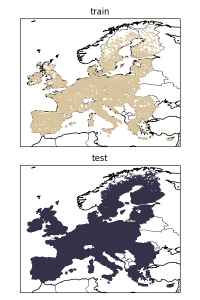

**[S148]**

**Original:**
indicate 1𝜎 BA / 𝑅2 or ~68.27% confidence interval by bootstrapping and k-folds when possible. The London-fog-blue bar to the far right matches the version of AEF used in other comparisons.

**中文:**
indicate 1𝜎 BA / 𝑅2 or ~68.27% confidence interval by bootstrapping and k-folds when possible. The London-fog-blue bar to the far right matches the version of AEF used in other comparisons.

---

## Page 57

**[F019] Figure S22**

**Original:**
> Figure S22 | Evaluation performance as a function of embedding dimension (Embedding 𝐷) and VMF

**中文:**
> Figure S22 | 评估 performance as a function of embedding dimension (Embedding 𝐷) and von Mises-Fisher(VMF)分布

**[S150]**

**Original:**
kappa (𝜅) for all trial sizes (1 shot, 10 shot, and max shot) and methods of transfer (nearest neighbors for k=1, k=3, and linear probe). The red square indicates the parameter setting (Embedding 𝐷 = 64, 𝜅 = 8𝜅) used for AEF.

**中文:**
kappa（集中度参数） (𝜅) for all trial sizes (1 shot, 10 shot, and max shot) and methods of transfer (nearest neighbors for k=1, k=3, and 线性探针). The red square indicates the parameter setting (Embedding 𝐷 = 64, 𝜅 = 8𝜅) used for AEF.

---

## Page 58

**[F020] Figure S22**

**Original:**
> Figure S22 | (con’t) Evaluation performance as a function of embedding dimension (Embedding

**中文:**
> Figure S22 | (con’t) 评估 performance as a function of embedding dimension (Embedding

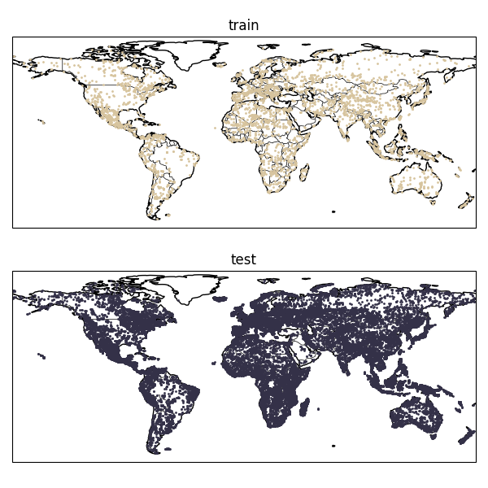

**[S152]**

**Original:**
𝐷) and VMF kappa (𝜅) for all trial sizes (1 shot, 10 shot, and max shot) and methods of transfer (nearest neighbors for k=1, k=3, and linear probe). The red square indicates the parameter setting (Embedding 𝐷 = 64, 𝜅 = 8𝜅) used for AEF.

**中文:**
𝐷) and von Mises-Fisher(VMF)分布 kappa（集中度参数） (𝜅) for all trial sizes (1 shot, 10 shot, and max shot) and methods of transfer (nearest neighbors for k=1, k=3, and 线性探针). The red square indicates the parameter setting (Embedding 𝐷 = 64, 𝜅 = 8𝜅) used for AEF.

---

## Page 59

**[F021] Figure S22**

**Original:**
> Figure S22 | (con’t) Evaluation performance as a function of embedding dimension (Embedding

**中文:**
> Figure S22 | (con’t) 评估 performance as a function of embedding dimension (Embedding

**[S154]**

**Original:**
𝐷) and VMF kappa (𝜅) for all trial sizes (1 shot, 10 shot, and max shot) and methods of transfer (nearest neighbors for k=1, k=3, and linear probe). The red square indicates the parameter setting (Embedding 𝐷 = 64, 𝜅 = 8𝜅) used for AEF.

**中文:**
𝐷) and von Mises-Fisher(VMF)分布 kappa（集中度参数） (𝜅) for all trial sizes (1 shot, 10 shot, and max shot) and methods of transfer (nearest neighbors for k=1, k=3, and 线性探针). The red square indicates the parameter setting (Embedding 𝐷 = 64, 𝜅 = 8𝜅) used for AEF.

---

## Page 60

**[F022] Figure S22**

**Original:**
> Figure S22 | (con’t) Evaluation performance as a function of embedding dimension (Embedding

**中文:**
> Figure S22 | (con’t) 评估 performance as a function of embedding dimension (Embedding

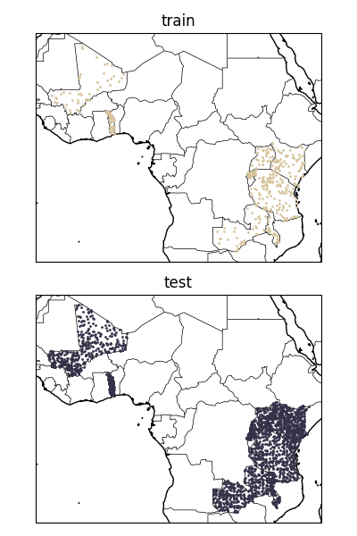

**[S156]**

**Original:**
𝐷) and VMF kappa (𝜅) for all trial sizes (1 shot, 10 shot, and max shot) and methods of transfer (nearest neighbors for k=1, k=3, and linear probe). The red square indicates the parameter setting (Embedding 𝐷 = 64, 𝜅 = 8𝜅) used for AEF.

**中文:**
𝐷) and von Mises-Fisher(VMF)分布 kappa（集中度参数） (𝜅) for all trial sizes (1 shot, 10 shot, and max shot) and methods of transfer (nearest neighbors for k=1, k=3, and 线性探针). The red square indicates the parameter setting (Embedding 𝐷 = 64, 𝜅 = 8𝜅) used for AEF.

---

## Page 61

**[S157]**

**Original:**
due to the regularizing effect of the noise (Kingma                      Integer type        Scale           Min           Max et al., 2013). This last property is desirable when                                                          value         value using embeddings for nearest neighbor retrieval                          int8 (s8)           127.5           127           127 as distances measured along a smooth (lower diint16 (s16)         32767.5         32767         32767 mensional) manifold are more meaningful than those in a higher dimensional space (assuming                        Table S18 | Quantization parameters. the manifold hypothesis (Fefferman et al., 2016). Therefore contention exists between a smoother embedding space (lower 𝜅), and the information capacity of the channel and therefore embedding (higher 𝜅). We explore this in the context of embedding dimension across all methods of transfer and trial group sizes in Figure S22. The setting used for AEF was Embedding 𝐷 = 64, 𝜅 = 8e3. We find that performance as a function of bottleneck characteristics varies considerably depending on the evaluation dataset. One expected trend emerges for datasets with larger legends compared to e.g. two or three class classification problems in the max-trial setting: Canada crops (fine), LUCAS derived datasets, and iNatu-                     (a) Quantization results for regression evals. ralist trees all tend to perform better with more concentrated noise and higher embedding dimenValues were dequantized using a method idensions. We also, expectedly, find that a noisier tical to the following pseudo-JAX method: bottleneck seems to improve, or not impact, the performance in the smaller trial groups (500x10,                     def dequantize ( y : chex . Array , 1000x1). This is most evident in Canada crops                            power : float , scale : float , derived datasets and OpenET ensemble.                                    qu an tiz at ion _t ype : jnp . dtype ) -> chex . Array :

**中文:**
due to the regularizing effect of the noise (Kingma Integer type Scale Min Max et al., 2013). This last property is desirable when value value using embeddings for nearest neighbor retrieval int8 (s8) 127.5 127 127 as distances measured along a smooth (lower diint16 (s16) 32767.5 32767 32767 mensional) manifold are more meaningful than those in a higher dimensional space (assuming Table S18 | Quantization parameters. the manifold hypothesis (Fefferman et al., 2016). Therefore contention exists between a smoother embedding space (lower 𝜅), and the information capacity of the channel and therefore embedding (higher 𝜅). We explore this in the context of embedding dimension across all methods of transfer and trial group sizes in Figure S22. The setting used for AEF was Embedding 𝐷 = 64, 𝜅 = 8e3. We find that performance as a function of 瓶颈层 characteristics varies considerably depending on the 评估 数据集. One expected trend emerges for datasets with larger legends compared to e.g. two or three class 分类 problems in the max-trial setting: Canada crops (fine), LUCAS（欧盟土地利用/覆盖统计调查） derived datasets, and iNatu- (a) Quantization results for 回归 evals. ralist trees all tend to perform better with more concentrated noise and higher embedding dimenValues were dequantized using a method idensions. We also, expectedly, find that a noisier tical to the following pseudo-JAX method: 瓶颈层 seems to improve, or not impact, the performance in the smaller trial groups (500x10, def dequantize ( y : chex . Array , 1000x1). This is most evident in Canada crops power : float , scale : float , derived datasets and OpenET（开放蒸散发） ensemble. qu an tiz at ion _t ype : jnp . dtype ) -> chex . Array :

**[S158]**

**Original:**
rescaled = y . astype ( jnp . float32 ) / scale return ( jnp . abs ( rescaled ) ** power * jnp . sign ( rescaled ) S8. Inference                                                           )

**中文:**
rescaled = y . astype ( jnp . float32 ) / scale return ( jnp . abs ( rescaled ) ** power * jnp . sign ( rescaled ) S8. 推理 )

**[S159]**

**Original:**
S8.1. Quantization                                                     The exponentiation was introduced to preserve information in the least significant digits of deTo reduce the storage and compute requirequantized values. We used the following scale, ments for working with our released embedding minimum, and maximum values according to Tafield data, we opted to test a number of postble S18. quantization schemes. We tried quantizing 32-bit float values to signed 8-bit and 16-bit integers                        We did not initially assume that 8-bits ought to using a method identical to the following pseudobe enough for any evaluation given that quantizaJAX method:                                                          tion was not part of the learning process, we were def quantize (                                                       nonetheless pleased to note little performance x : chex . Array , power : float ,                                                  variability compared to the non-quantized emscale : float , min_value : float ,                                              beddings as shown in Figure S23A-C. As quantimax_value : float , qu an tiz at ion _ t y p e : jnp . dtype ) -> chex . Array :     zation was not part of our comparisons, we chose sat = jnp . abs ( x ) ** (1 / power ) * jnp . sign ( x ) to quantize to 8-bits with power = 2 as this gave snapped = jnp . round ( sat * scale ) the best storage / performance tradeoff based on return jnp . clip ( snapped , evaluation performance. We believe our comparimin_value , max_value son results with this quantization strategy would ) . astype ( qu an t i z a t i o n _ t y p e )                     be largely the same as without.

**中文:**
S8.1. Quantization The exponentiation was introduced to preserve information in the least significant digits of deTo reduce the storage and compute requirequantized values. We used the following scale, ments for working with our released embedding minimum, and maximum values according to Tafield data, we opted to test a number of postble S18. quantization schemes. We tried quantizing 32-bit float values to signed 8-bit and 16-bit integers We did not initially assume that 8-bits ought to using a method identical to the following pseudobe enough for any 评估 given that quantizaJAX method: tion was not part of the learning process, we were def quantize ( nonetheless pleased to note little performance x : chex . Array , power : float , variability compared to the non-quantized emscale : float , min_value : float , beddings as shown in Figure S23A-C. As quantimax_value : float , qu an tiz at ion _ t y p e : jnp . dtype ) -> chex . Array : zation was not part of our comparisons, we chose sat = jnp . abs ( x ) ** (1 / power ) * jnp . sign ( x ) to quantize to 8-bits with power = 2 as this gave snapped = jnp . round ( sat * scale ) the best storage / performance tradeoff based on return jnp . clip ( snapped , 评估 performance. We believe our comparimin_value , max_value son results with this quantization strategy would ) . astype ( qu an t i z a t i o n _ t y p e ) be largely the same as without.

---

## Page 62

**[S160]**

**Original:**
1. We removed requirements that specific targets or input sensors be present in our training sample and re-generated our training dataset. This lead to the addition of a large number of samples from Antarctica that had previously been dropped due to limited coverage, and increased the count of our training video sequences from 8,412,511 to 10,182,450 sequences. 2. Independent tests revealed a performance regression for crop classification in the conter- (b) Quantization results for change detection evals.                  minous United States. We determined that this was related to the inclusion of NLCD in the training mixture. We addressed this by S8.2. Creating embedding fields adding additional data from the USDA CropTo produce global, annual, embedding field layland Data Layers (CDL) (USDA NASS, 2024) ers, we divide the world into UTM zones, and                          through 2023 (omitting the data from 2024) run inference in a tiling of each zone by 960m x                      as a target, and the loss weight for NLCD and 960m. Before input sources are collected, each                        CDL was lowered from 0.50 to 0.25. tile is individually buffered by 160m on each side                 3. We identified and fixed a bug in our process- (overtiling) to provide a 1.28km x 1.28km tile for                    ing software that where incorrect handling of inference. Sources are collected using the same                       time codes for Sentinel-2 images acquired on protocol as for our training data, a model forward                    January 1 resulted in divergent embedding pass is run, and the outer 80m is trimmed from                        values and visible swath artifacts in affected each tile before rendering back onto the UTM                          years. zone. We include the tiles that slightly extend                    4. We identified and fixed a bug in our processbeyond UTM zone degree boundaries to avoid                            ing software where frame sub-sampling, like seams when using the data in different projecthat during training, was applied at inference tions.                                                                time. Embeddings generated with AEF v2.1 now use a full year of imagery for inference. Our inference system is the same as our train-                   5. We took further steps to mitigate tiling aring data collection system, and is backed entirely                    tifacts by applying frame-dropout to the by Earth Engine. A great degree of care was                           teacher model mirroring that applied to the taken to ensure our inference system respects                         student. the shared capacity of Earth Engine while scal-                    6. We also achieved a reduction in subtle aring to hundreds of billions of observations. As                       tifacts from multi-resolution pixel targets we’ve demonstrated strong performance in our                          by modifying re-gridding to include random annual-period evaluations, we hope our annual                         shifts within the grid size prior to downsamembedding fields enable more practitioners to                         pling. achieve similar results without the need or expense of pushing field campaigns to meet the needs of custom deep learning workflows.

**中文:**
1. We removed requirements that specific targets or input sensors be present in our 训练 sample and re-generated our 训练 数据集. This lead to the addition of a large number of samples from Antarctica that had previously been dropped due to limited coverage, and increased the count of our 训练 视频（时序图像序列） sequences from 8,412,511 to 10,182,450 sequences. 2. Independent tests revealed a performance 回归 for crop 分类 in the conter- (b) Quantization results for 变化检测 evals. minous United States. We determined that this was related to the inclusion of NLCD（美国国家土地覆盖数据库） in the 训练 mixture. We addressed this by S8.2. Creating 嵌入场 adding additional data from the USDA CropTo produce global, annual, 嵌入场 layland Data Layers (CDL) (USDA NASS, 2024) ers, we divide the world into UTM（通用横轴墨卡托） zones, and through 2023 (omitting the data from 2024) run 推理 in a tiling of each zone by 960m x as a target, and the 损失 weight for NLCD（美国国家土地覆盖数据库） and 960m. Before input sources are collected, each CDL was lowered from 0.50 to 0.25. tile is individually buffered by 160m on each side 3. We identified and fixed a bug in our process- (overtiling) to provide a 1.28km x 1.28km tile for ing software that where incorrect handling of 推理. Sources are collected using the same time codes for Sentinel-2 images acquired on protocol as for our 训练 data, a model forward January 1 resulted in divergent embedding pass is run, and the outer 80m is trimmed from values and visible swath artifacts in affected each tile before rendering back onto the UTM（通用横轴墨卡托） years. zone. We include the tiles that slightly extend 4. We identified and fixed a bug in our processbeyond UTM（通用横轴墨卡托） zone degree boundaries to avoid ing software where 帧 sub-sampling, like seams when using the data in different projecthat during 训练, was applied at 推理 tions. time. Embeddings generated with AEF v2.1 now use a full year of imagery for 推理. Our 推理 system is the same as our train- 5. We took further steps to mitigate tiling aring data collection system, and is backed entirely tifacts by applying 帧-Dropout to the by Earth Engine. A great degree of care was teacher model mirroring that applied to the taken to ensure our 推理 system respects student. the shared capacity of Earth Engine while scal- 6. We also achieved a reduction in subtle aring to hundreds of billions of observations. As tifacts from multi-resolution 像素 targets we’ve demonstrated strong performance in our by modifying re-gridding to include random annual-period evaluations, we hope our annual shifts within the grid size prior to downsamembedding fields enable more practitioners to pling. achieve similar results without the need or expense of pushing field campaigns to meet the needs of custom deep learning workflows.

**[S161]**

**Original:**
S8.3. Production model (AEF v2.1)

**中文:**
S8.3. Production model (AEF v2.1)

**[S162]**

**Original:**
The results presented in this study reflect the performance of v2.0 of the AEF model. Based on feedback we received on annual embedding fields generated with the v2.0 model, we made a number of fixes and improvements. Specifically:

**中文:**
The results presented in this study reflect the performance of v2.0 of the AEF model. Based on feedback we received on annual 嵌入场 generated with the v2.0 model, we made a number of fixes and improvements. Specifically:

---

## Page 63

**[S163]**

**Original:**
(c) Quantization results for classification evals.

**中文:**
(c) Quantization results for 分类 evals.

**[F023] Figure S23**

**Original:**
> Figure S23 | Quantization results. s82 is the quantization strategy used for our released embedding

**中文:**
> Figure S23 | Quantization results. s82 is the quantization strategy used for our released embedding

**[S165]**

**Original:**
fields data. The exponent on the x-axis labels indicates the quantization power.

**中文:**
fields data. The exponent on the x-axis labels indicates the quantization power.

---

