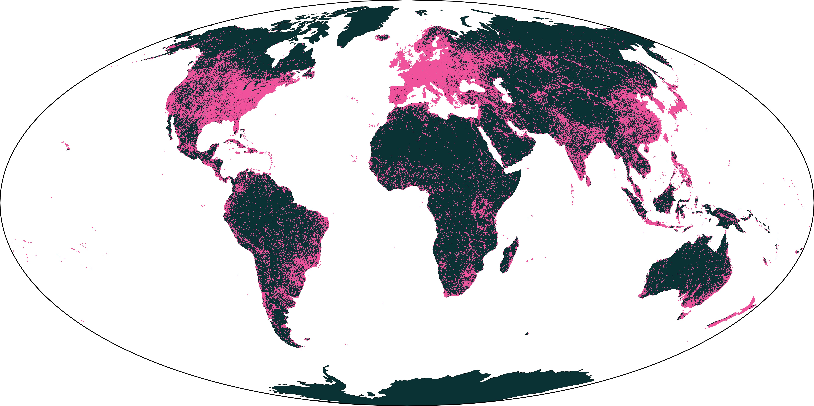
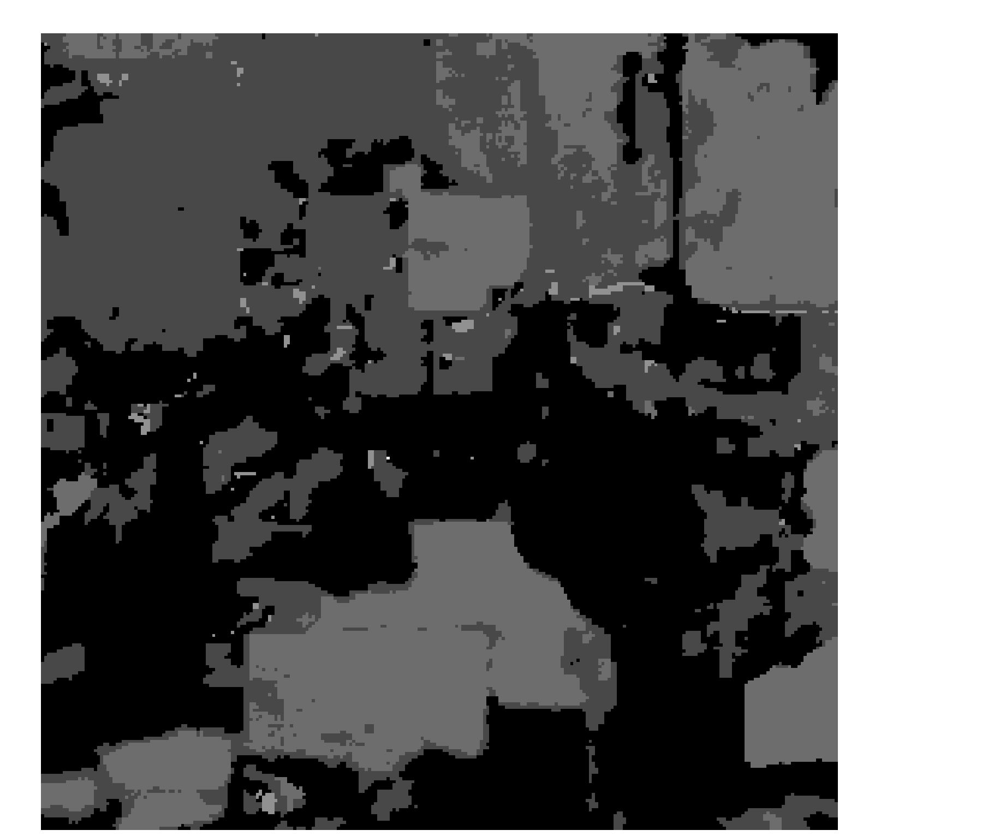
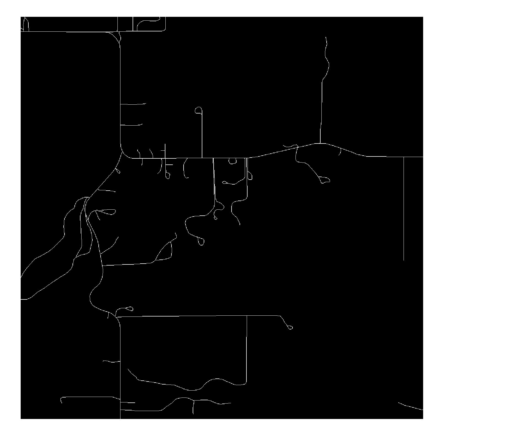

# OlmoEarth: StableLatentImageModeling for Multimodal Earth Observation
# OlmoEarth：面向多模态地球观测的稳定潜在图像建模

> **Source**: OlmoEarth: A Multimodal Spatio-Temporal Foundation Model for Earth Observation
> **Pages**: 22
> **Format**: 中英对照 (Chinese-English Bilingual)

---

## [S001] OlmoEarth: StableLatentImageModeling for Multimodal Earth Observation
## OlmoEarth：面向多模态地球观测的稳定潜在图像建模

---

**[C001]** *(p.1)*

Earth observation data presents a unique challenge: it is spatial like images, sequential like video or text, and highly multimodal. We present OlmoEarth: a spatio-temporal, multimodal foundation model that employs a novel self-supervised learning formulation, masking strategy, and loss all designed for the Earth observation domain. OlmoEarth achieves state-of-the-art performance compared to 12 other foundation models across a variety of research benchmarks and real-world tasks from external partners. When evaluating embeddings OlmoEarth achieves the best performance on 15 out of 24 tasks, and with full fine-tuning it is the best on 19 of 29 tasks. We deploy OlmoEarth as the backbone of an end-to-end platform for data collection, labeling, training, and inference of Earth observation models. The OlmoEarth Platform puts frontier foundation models and powerful data management tools into the hands of non-profits and NGOs working to solve the world’s biggest problems. OlmoEarth source code, training data, and pre-trained weights are available at https: //github.com/allenai/olmoearth_pretrain. 1 arXiv:2511.13655v1 [cs.CV] 17 Nov 2025

地球观测数据提出了一个独特的挑战：它像图像一样具有空间性，像视频或文本一样具有序列性，并且高度多模态。我们提出了 OlmoEarth：一种时空多模态基础模型，采用新颖的自监督学习形式化方法、掩码策略和损失函数，所有这些都专为地球观测领域设计。OlmoEarth 在多种研究基准测试和来自外部合作伙伴的真实世界任务上，与 12 个其他基础模型相比达到了最先进的性能。在评估嵌入时，OlmoEarth 在 24 个任务中的 15 个上取得了最佳性能，而在完全微调后，在 29 个任务中的 19 个上表现最佳。我们将 OlmoEarth 部署为一个端到端平台的核心，用于地球观测模型的数据收集、标注、训练和推理。OlmoEarth 平台将前沿基础模型和强大的数据管理工具交到致力于解决全球最大问题的非营利组织和非政府组织手中。OlmoEarth 的源代码、训练数据和预训练权重可在 https://github.com/allenai/olmoearth_pretrain 获取。

---

**Figure 1** | **图 1** *(p.2)*

*OlmoEarth defines a Pareto optimum of performance vs. computational efficiency averaged across 13 embedding tasks (measured by kNN and linear probing)1. The chart shows average multiply-accumulate operations to encode one example across all tasks (input size varies by task). See Table 2 for full results.*

*OlmoEarth 在性能与计算效率之间定义了帕累托最优，平均跨越 13 个嵌入任务（通过 kNN 和线性探测测量）。该图表显示了在所有任务中编码一个样本的平均乘加运算次数（输入大小因任务而异）。完整结果见表 2。*

---

## [S002] 1 Introduction
## 1 引言

---

**[C002]** *(p.2)*

Earth observation foundation models show promising results in research settings [2, 15, 16, 25, 50, 54, 55]. However, adoption for real-world tasks lags behind, especially in the non-profit sector. Foundation models are large, complex to train, and expensive to deploy. To help enable non-profit, humanitarian, and environmental organizations to use these powerful tools we train OlmoEarth, a new family of models, using a novel, stable training regime. We comprehensively evaluate OlmoEarth against 12 other foundation models on research benchmarks and real-world tasks from partner organizations. Finally we deploy these models in an open, end-to-end platform bringing frontier models directly to organizations who need it the most.

地球观测基础模型在研究环境中显示出有希望的结果 [2, 15, 16, 25, 50, 54, 55]。然而，在真实世界任务中的采用却滞后，尤其是在非营利部门。基础模型体积庞大、训练复杂且部署昂贵。为了帮助非营利、人道主义和环境组织使用这些强大的工具，我们训练了 OlmoEarth，一个新的模型家族，采用新颖的、稳定的训练机制。我们全面评估了 OlmoEarth，与 12 个其他基础模型在研究基准测试和来自合作伙伴组织的真实世界任务上进行比较。最后，我们将这些模型部署在一个开放的端到端平台中，将前沿模型直接带给最需要它们的组织。

---

## [S003] 1.1 Stable Training
## 1.1 稳定训练

---

**[C003]** *(p.2)*

Foundation models are complex and expensive to train. When attempting to replicate existing work we frequently saw training instability, representation collapse, and models underperforming their stated potential. We introduce a stable training regime that models images in latent space but avoids instability and collapse. Our approach strikes a middle ground between two common approaches in self-supervised learning. Masked autoencoders (MAE) predict pixel-level reconstructions of masked input while approaches like I-JEPA and Latent Masked Image Modeling (Latent MIM) predict reconstructions in feature space [1, 56]. MAE tends to be stable but limited in its feature representations while latent approaches are unstable but produce better features [34]. We present Latent Masked Image Modeling of Linear, Invariant Token Embeddings (Latent MIM Lite), a simplification of Latent MIM that leads to stable training and better performance. We replace the target encoder of Latent MIM with a linear projection from image patches to token space that is randomly initialized and never updated during training. This simple modification stabilizes training but maintains the representative power of modeling in latent space. It also unifies self-supervised and supervised learning as we project both observational data and labeled maps through the frozen random projection layer into token space and calculate loss the same for both. 1Average over all tasks every model can perform, specifically the Sentinel-2 versions of: m-bigearthnet, m-so2sat, m-brick-kiln, m-eurosat, BreizhCrops CropHarvest-Togo, CropHarvest-PRC, m-cashewplant, m-SA-crop-type, PASTIS, MADOS, AWF, Nandi. 2

基础模型复杂且训练成本高昂。在尝试复现现有工作时，我们经常看到训练不稳定、表征坍缩以及模型未能达到其声明的潜力。我们引入了一种稳定的训练机制，在潜在空间中对图像进行建模，但避免了不稳定性和坍缩。我们的方法在自监督学习中两种常见方法之间取得了平衡。掩码自编码器（MAE）预测被掩码输入的像素级重建，而 I-JEPA 和潜在掩码图像建模（Latent MIM）等方法则预测特征空间中的重建 [1, 56]。MAE 往往稳定但特征表示有限，而潜在方法不稳定但能产生更好的特征 [34]。我们提出了线性不变令牌嵌入的潜在掩码图像建模（Latent MIM Lite），这是 Latent MIM 的简化版本，可带来稳定的训练和更好的性能。我们将 Latent MIM 的目标编码器替换为一个从图像块到令牌空间的线性投影，该投影随机初始化且在训练期间永不更新。这一简单修改稳定了训练，但保持了在潜在空间建模的代表性能力。它还统一了自监督学习和监督学习，因为我们通过冻结的随机投影层将观测数据和标注地图都投影到令牌空间，并以相同方式计算损失。

---

## [S004] 1.1.1 Masking
## 1.1.1 掩码策略

---

**[C004]** *(p.3)*

In image or text modeling it is sufficient to randomly mask some portion of the input and have the model reconstruct the input from context. With multimodal remote sensing data, any token in the input will have many similar tokens either in space, time, or at a different aligned modality. Random masking is too easy of a task unless you use a very high masking ratio [50]. We introduce a modality-aware masking strategy that combines random token masking with full modality reconstruction. This makes the task challenging without resorting to skewed masking ratios.

在图像或文本建模中，随机掩码部分输入并让模型从上下文中重建输入就足够了。对于多模态遥感数据，输入中的任何令牌都会在空间、时间或不同对齐模态上存在许多相似的令牌。随机掩码任务过于简单，除非使用非常高的掩码比例 [50]。我们引入了一种模态感知掩码策略，结合随机令牌掩码和完整模态重建。这使得任务具有挑战性，而无需诉诸偏斜的掩码比例。

---

## [S005] 1.1.2 Loss
## 1.1.2 损失函数

---

**[C005]** *(p.3)*

Like other SSL approaches in latent space we use a contrastive loss instead of a reconstruction loss. However, contrasting a reconstructed token against all other tokens in a batch, or even in the same sample, leads to many easy negatives given the redundant nature of Earth observation data. Instead we contrast tokens only with other tokens in their respective bandset (a subdivision of modality explained in 2.1). This focuses the model training on a more challenging but more productive objective, as shown in our experiments.

与其他潜在空间中的 SSL 方法一样，我们使用对比损失而非重建损失。然而，将重建的令牌与批次中所有其他令牌进行对比，甚至是同一样本中的其他令牌，鉴于地球观测数据的冗余性，会产生许多简单的负样本。相反，我们只将令牌与其各自 bandset（模态的一个子分区，详见 2.1）中的其他令牌进行对比。这使得模型训练聚焦于一个更具挑战性但更有成效的目标，如我们的实验所示。

---

## [S006] 1.2 Comprehensive Evaluation
## 1.2 全面评估

---

**[C006]** *(p.3)*

There is no standard evaluation suite for remote sensing models. While there are some established standard practices [16, 39, 50], they are not always followed. To get a more complete picture of the state of foundation modeling we run a comprehensive evaluation effort of OlmoEarth compared to 12 other foundation models on 18 research benchmarks and 19 datasets from 7 partner organizations that are using Earth observation modeling in their work. Following standard practice we evaluate all models using simple transfer learning techniques (kNN and linear probing) as well as full, end-to-end fine-tuning. We evaluate all models using a standard training recipe and sweeping over a variety of hyperparameters. OlmoEarth achieves the best performance in 15 of 24 tasks for the kNN/LP evaluation and 19 of 29 tasks for full fine-tuning. See Figure 1 for a summary.

遥感模型没有标准的评估套件。虽然有一些既定的标准实践 [16, 39, 50]，但并不总是被遵循。为了更全面地了解基础建模的现状，我们进行了全面的评估工作，将 OlmoEarth 与 12 个其他基础模型在 18 个研究基准测试和来自 7 个合作伙伴组织的 19 个数据集上进行比较，这些组织在其工作中使用地球观测建模。遵循标准实践，我们使用简单的迁移学习技术（kNN 和线性探测）以及完整的端到端微调来评估所有模型。我们使用标准训练方案评估所有模型，并扫描各种超参数。OlmoEarth 在 kNN/LP 评估的 24 个任务中的 15 个上取得了最佳性能，在完全微调的 29 个任务中的 19 个上表现最佳。摘要见图 1。

---

## [S007] 1.3 Open Platform
## 1.3 开放平台

---

**[C007]** *(p.3)*

Training and fine-tuning remain out of reach for most environmental and humanitarian non-profits. Applying a foundation model to a task requires data gathering, alignment, pre-processing, labeling, fine-tuning, and running inference. We deploy OlmoEarth as part of the OlmoEarth Platform to simplify and streamline this process. The OlmoEarth Platform is an end-to-end solution for organizations who want to harness Earth observation data for the public good. Our partner organizations are already using the platform for things like mangrove conservation, ecosystem mapping, and food security. The OlmoEarth Platform solves the last-mile problem of putting frontier research into the hands of people who can use it to do the most good. 2

对于大多数环境和人道主义非营利组织来说，训练和微调仍然是遥不可及的。将基础模型应用于任务需要数据收集、对齐、预处理、标注、微调和运行推理。我们将 OlmoEarth 作为 OlmoEarth 平台的一部分进行部署，以简化和精简这一流程。OlmoEarth 平台是一个端到端的解决方案，面向希望利用地球观测数据造福公众的组织。我们的合作伙伴组织已经在使用该平台进行红树林保护、生态系统制图和粮食安全等工作。OlmoEarth 平台解决了将前沿研究交到能够用它做最大善事的人手中的最后一公里问题。

---

**[C008]** *(p.3)*

OlmoEarth is a Vision Transformer (ViT) based encoder-decoder style architecture. It processes a multimodal image timeseries of aligned satellite images and derived maps. A FlexiViT-style projection layer [5] converts the input data from pixels to tokens with a variable patch size. Positional, temporal, and modality encodings add additional context to the tokens. During training, some portion of the input tokens are masked. The encoder transformer layers attend across space, time, and between modalities to produce embeddings for the input tokens. The decoder predicts representations for the masked input tokens.

OlmoEarth 是一种基于 Vision Transformer (ViT) 的编码器-解码器风格架构。它处理对齐卫星图像和衍生地图的多模态图像时间序列。FlexiViT 风格的投影层 [5] 将输入数据从像素转换为具有可变块大小的令牌。位置、时间和模态编码为令牌添加额外的上下文。在训练期间，部分输入令牌被掩码。编码器 Transformer 层在空间、时间和模态之间进行注意力计算，为输入令牌生成嵌入。解码器预测被掩码输入令牌的表示。

---

## [S008] 2 OlmoEarth
## 2 OlmoEarth

---

## [S009] 2.1 Data
## 2.1 数据

---

**[C009]** *(p.3)*

OlmoEarth is designed to flexibly handle input Earth observation data across a range of spatial and temporal resolutions. During our pretraining experiments we train on three satellite modalities and six derived maps: 3

OlmoEarth 旨在灵活处理跨一系列空间和时间分辨率的地球观测输入数据。在我们的预训练实验中，我们在三种卫星模态和六种衍生地图上进行训练：

---

**Figure 2** | **图 2** *(p.4)*

*Global distribution of OlmoEarth pretraining data. We sample 285,288 locations based on OpenStreetMap categories. Observations Maps Sentinel-1 WorldCereal [53] OpenStreetMap [38] Sentinel-2 WorldCover [59] Cropland Data Layer [51] Landsat-8 SRTM [36] Canopy Height Map [47] Our pretraining dataset contains 285,288 samples from around the world. Each sample covers a 2.56km×2.56km spatial region and a one-year time range. For multi-temporal modalities, we use up to 12 timesteps sampled monthly over the course of the year, although many samples contain only a subset of the timesteps and modalities. For the above modalities we resample the data to be uniformly 10 meters per pixel. We experimented with adding NAIP data at 2.5 meter per pixel [52] and ERA5 data at 160 meters per pixel [23] but found no significant improvement on our evaluations. We further subdivide Landsat and Sentinel-2 into bandsets based on the original resolution of their bands, grouping bands captured at the same resolution together. Landsat consists of 2 bandsets while Sentinel-2 consists of 3 bandsets. For the precise split see the OlmoEarth source code. The locations of samples are chosen based on OpenStreetMap features. We select 120 categories of map features in OpenStreetMap, ranging from roads to geothermal power plants, and enumerate all 2.56km × 2.56km tiles containing each category. We then randomly sample up to 10,000 tiles per category to derive the 285,288 samples (many categories appear in fewer than 10,000 tiles). The one-year time range of each sample is sampled uniformly between January 2016 and December 2024.*

*OlmoEarth 预训练数据的全局分布。我们基于 OpenStreetMap 类别采样了 285,288 个位置。观测数据包括 Sentinel-1 [53]、Sentinel-2 [59]、Landsat-8；地图数据包括 WorldCereal [53]、OpenStreetMap [38]、WorldCover [59]、Cropland Data Layer [51]、SRTM [36]、Canopy Height Map [47]。我们的预训练数据集包含来自世界各地的 285,288 个样本。每个样本覆盖 2.56km×2.56km 的空间区域和一年的时间范围。对于多时相模态，我们在一年中每月采样最多 12 个时间步，尽管许多样本只包含时间步和模态的子集。对于上述模态，我们将数据重采样为统一的每像素 10 米。我们尝试添加每像素 2.5 米的 NAIP 数据 [52] 和每像素 160 米的 ERA5 数据 [23]，但未在评估中发现显著改进。我们进一步根据 Landsat 和 Sentinel-2 波段的原始分辨率将其细分为 bandsets，将相同分辨率捕获的波段分组在一起。Landsat 包含 2 个 bandsets，而 Sentinel-2 包含 3 个 bandsets。精确划分请参阅 OlmoEarth 源代码。样本的位置基于 OpenStreetMap 特征选择。我们在 OpenStreetMap 中选择 120 类地图特征，从道路到地热发电厂，枚举包含每种类别的所有 2.56km × 2.56km 瓦片。然后我们每类随机采样最多 10,000 个瓦片，得到 285,288 个样本（许多类别出现的瓦片少于 10,000 个）。每个样本的一年时间范围在 2016 年 1 月至 2024 年 12 月之间均匀采样。*

---

## [S010] 2.2 Architecture
## 2.2 架构

---

**[C010]** *(p.4)*

Similar to many Earth observation models, OlmoEarth is a transformer-based encoder-decoder style architec- ture. Inspired by Galileo, we use a flexible patch-embedding layer [5, 50]. However, instead of doing that confusing pseudo-inverse stuff from FlexiViT we keep the actual projection weights the same size and resize the input image to mimic changing the patch size. It’s probably basically equivalent. Once the input is in token space, OlmoEarth adds in a 2D sincos positional embedding, a sinusoidal temporal embedding, and a learnable modality embedding to each token. During training, some tokens are masked out of the input, otherwise all tokens are passed to the encoder transformer which performs full self-attention 4

与许多地球观测模型类似，OlmoEarth 是一种基于 Transformer 的编码器-解码器风格架构。受 Galileo 启发，我们使用灵活的块嵌入层 [5, 50]。然而，我们没有做 FlexiViT 中令人困惑的伪逆操作，而是保持实际投影权重的大小不变，并调整输入图像的大小以模拟改变块大小。这可能基本上是等价的。一旦输入进入令牌空间，OlmoEarth 为每个令牌添加二维正弦余弦位置嵌入、正弦时间嵌入和可学习的模态嵌入。在训练期间，一些令牌从输入中被掩码，否则所有令牌都被传递到执行完全自注意力的编码器 Transformer。

---

**Figure 3** | **图 3** *(p.5)*

*We train OlmoEarth with a combination of satellite observations and high-quality maps. After tokenizing these inputs, we: (1) apply a modality-aware masking strategy to define which tokens are inputs vs. targets, (2) pass the target tokens through fixed random projections to construct targets, (3) pass the input tokens through our learned encoders, and then (4) through a decoder which predicts the target tokens and (5) apply a modality-aware patch discrimination loss between the predicted and target tokens. Steps 1-5 are applied twice on the same data to then (6) apply an instance contrastive loss over the aggregated tokens per instance. across space, time, and between modalities. Architecture Depth Dim Heads Parameters ViT Nano 4 128 8 1.4M ViT Tiny 12 192 3 6.2M ViT Base 12 768 12 90M ViT Large 24 1024 16 300M*

*我们用卫星观测数据和高质量地图的组合来训练 OlmoEarth。在将这些输入令牌化后，我们：(1) 应用模态感知掩码策略来定义哪些令牌是输入与目标，(2) 将目标令牌通过固定随机投影来构建目标，(3) 将输入令牌通过我们学习的编码器，然后 (4) 通过解码器预测目标令牌，(5) 在预测和目标令牌之间应用模态感知块判别损失。步骤 1-5 在同一数据上应用两次，然后 (6) 对每个实例的聚合令牌应用实例对比损失。跨越空间、时间和模态之间。架构深度、维度、头数、参数量：ViT Nano 4 128 8 1.4M；ViT Tiny 12 192 3 6.2M；ViT Base 12 768 12 90M；ViT Large 24 1024 16 300M。*

---

**Table 1** | **表 1** *(p.5)*

*ViT encoder architectures and number of parameters for the four OlmoEarth model sizes. We train four different encoder sizes based on standard Vision Transformer sizes, see Table 1. For each model size, the decoder has the same feature dimension and number of heads but only a depth of 4. We design a smaller decoder so that the encoder does the majority of the modeling. During training the decoder represents the masked portions of the input with a learned < MASK > token added to the appropriate positional, temporal, and modality embeddings. The decoder cross-attends to these tokens with the visible tokens from the encoder. It then predicts the latents for the masked tokens.*

*四种 OlmoEarth 模型大小的 ViT 编码器架构和参数量。我们训练四种不同的编码器大小，基于标准 Vision Transformer 大小，见表 1。对于每种模型大小，解码器具有相同的特征维度和头数，但深度仅为 4。我们设计较小的解码器，以便编码器承担大部分建模工作。在训练期间，解码器用一个学习的 <MASK> 令牌表示输入的被掩码部分，添加到适当的位置、时间和模态嵌入中。解码器与编码器的可见令牌进行交叉注意力计算，然后预测被掩码令牌的潜在表示。*

---

## [S011] 2.3 Masking
## 2.3 掩码策略

---

**[C011]** *(p.5)*

OlmoEarth uses a modality-aware masking strategy. For every example the masking strategy selects some bandsets to be encoded and also some to be decoded, non-exclusively. Thus every bandset falls into one of four categories: • Not selected: Ignored for this example. • Encode only: Randomly masked, input to encoder. • Decode only: Used as target for decoder. • Encode and decode: Randomly masked, input to encoder, masked tokens used as targets for decoder. This masking strategy re-frames the problem slightly from reconstructing data that has been partially masked to reconstructing missing bandsets from partial views of other bandsets. When all bandsets are encoded 5 and decoded we find the task is too easy. Masked tokens in a bandset will likely have other tokens in the same bandset that are highly correlated with them that are visible in the input, tokens nearby spatially or temporally. Training in this easier paradigm requires using very high masking ratios (i.e. masking out 90% of the input) to get decent results. Masking some bandsets entirely makes the problem harder and allows more balanced masking ratios. OlmoEarth trains on both observations and maps but at inference time we only use observations. Maps can change over time–indeed downstream tasks are often detecting this kind of change–so we only rely on observations for inference. Thus during training our masking strategy never encodes map data, it only ever decodes it. While observations can fall into any of the above four categories, maps will only be “decode only” or “not selected”.

OlmoEarth 使用模态感知掩码策略。对于每个样本，掩码策略选择一些 bandsets 进行编码，也选择一些进行解码，两者非互斥。因此每个 bandset 属于以下四类之一：• 未选中：在此样本中忽略。• 仅编码：随机掩码，输入到编码器。• 仅解码：用作解码器的目标。• 编码且解码：随机掩码，输入到编码器，被掩码的令牌用作解码器的目标。这种掩码策略稍微重新定义了问题，从重建部分掩码的数据转变为从其他 bandsets 的部分视图重建缺失的 bandsets。当所有 bandsets 都被编码和解码时，我们发现任务过于简单。bandset 中被掩码的令牌很可能在同一 bandset 中有与其高度相关的其他令牌在输入中可见，或在空间或时间附近。在这种较容易的范式下训练需要使用非常高的掩码比例（即掩码掉 90% 的输入）才能获得不错的结果。完全掩码某些 bandsets 使问题更难，并允许更平衡的掩码比例。OlmoEarth 在观测数据和地图上都进行训练，但在推理时我们只使用观测数据。地图会随时间变化——事实上下游任务通常是检测这种变化——因此我们在推理时只依赖观测数据。因此在训练期间，我们的掩码策略从不编码地图数据，只解码它。虽然观测数据可以属于上述四类中的任何一类，但地图将只能是"仅解码"或"未选中"。

---

## [S012] 2.4 Latent MIM Lite
## 2.4 Latent MIM Lite

---

**[C012]** *(p.6)*

During training OlmoEarth predicts reconstructions of the masked input in latent space. We use a randomly initialized, frozen projection layer for each modality to project masked patches in the input into token space. Thus OlmoEarth performs Latent Masked Image Modeling of Linear, Invariant Token Embeddings (Latent MIM Lite). Randomly projecting raw input data extracts valuable features both from a theoretical and practical standpoint [6, 7, 43]. Thus our predictions are operating in a true latent space of our input data. However, because we use a fixed target encoder we avoid the representation collapse common in Latent MIM-style training. While it’s possible this approach is too simplistic in more diverse domains like natural image processing, empirical results show a clear benefit in our domain of Earth observation data. Latent MIM Lite allows us to unify supervised and self-supervised training under the same architecture. We project each modality, whether observations or maps, through a frozen random projection into token space. Loss is calculated the same for both types of modalities. We do not need to add on specific predictor heads for supervised data or adjust our training strategy or loss. In our ablations we see this approach gives strong results in a purely self-supervised setting and also benefits from additional supervised data. Other models like Galileo and Terramind train on both supervised and unsupervised data however they treat supervised maps as a valid input to the model [25, 50]. This means their encoders must learn to model these map modalities as input and during training may use map modalities to predict observations or other map modalities. While this also unifies supervised and semi-supervised training, we theorize that our approach simplifies learning for the encoder while maintaining the benefits of training with supervised data. In our evaluations we see improved performance over these models on most tasks.

在训练期间，OlmoEarth 预测被掩码输入在潜在空间中的重建。我们为每个模态使用一个随机初始化、冻结的投影层，将输入中的被掩码块投影到令牌空间。因此 OlmoEarth 执行线性不变令牌嵌入的潜在掩码图像建模（Latent MIM Lite）。从理论和实践角度来看，随机投影原始输入数据都能提取有价值的特征 [6, 7, 43]。因此我们的预测在输入数据的真正潜在空间中操作。然而，因为我们使用固定的目标编码器，我们避免了 Latent MIM 风格训练中常见的表征坍缩。虽然这种方法在更多样化的领域（如自然图像处理）中可能过于简单，但实证结果在我们的地球观测数据领域显示出明显的益处。Latent MIM Lite 使我们能够在同一架构下统一监督学习和自监督学习。我们将每个模态，无论是观测数据还是地图，都通过冻结的随机投影投影到令牌空间。两种类型的模态都以相同方式计算损失。我们不需要为监督数据添加特定的预测头，也不需要调整训练策略或损失。在我们的消融实验中，我们看到这种方法在纯自监督设置下给出了很强的结果，并且也能从额外的监督数据中受益。Galileo 和 Terramind 等其他模型也在监督和未监督数据上训练，但它们将监督地图视为模型的有效输入 [25, 50]。这意味着它们的编码器必须学习将这些地图模态建模为输入，在训练期间可能使用地图模态来预测观测数据或其他地图模态。虽然这也统一了监督和半监督训练，但我们推测我们的方法简化了编码器的学习，同时保持了用监督数据训练的好处。在我们的评估中，我们在大多数任务上看到比这些模型更好的性能。

---

## [S013] 2.4.1 Modality Patch Discrimination
## 2.4.1 模态块判别

---

**[C013]** *(p.6)*

Masked image modeling in pixel space typically uses a reconstruction loss like Smooth L1. Latent MIM proposes using a contrastive loss (Patch Discrimination) instead of reconstruction loss to incentivize diversity in the latent space predictions. Patch discrimination loss frames token reconstruction as a classification task where we want the predicted token for a patch to be similar to the target token but dissimilar from other ground truth tokens for other patches. Patch discrimination uses cosine similarity to measure token similarity and cross entropy loss to contrast between positive and negative matches. Typical patch discrimination contrasts a predicted token with all target tokens in the input. For image modeling, the target tokens from an image are encodings of different parts of the image so they are from the same distribution, making the contrastive task challenging. In OlmoEarth, different target tokens can come from different modalities or different time steps as well as different spatial locations. Tokens from different modalities have very different distributions so distinguishing between them is easy. Yet there are so many tokens from other modalities that a significant amount of the loss comes from these “easy” negatives. We find eliminating easy negatives and only contrasting tokens with targets from the same modality gives a substantial performance increase. 6

像素空间中的掩码图像建模通常使用重建损失，如 Smooth L1。Latent MIM 建议使用对比损失（块判别）而非重建损失，以激励潜在空间预测中的多样性。块判别损失将令牌重建框架为一个分类任务，我们希望预测的块令牌与目标令牌相似，但与其他块的地面真实令牌不相似。块判别使用余弦相似度来衡量令牌相似度，并使用交叉熵损失来在正负匹配之间进行对比。典型的块判别将预测的令牌与输入中的所有目标令牌进行对比。对于图像建模，来自图像的目标令牌是图像不同部分的编码，因此它们来自同一分布，使得对比任务具有挑战性。在 OlmoEarth 中，不同的目标令牌可以来自不同的模态或不同的时间步，以及不同的空间位置。来自不同模态的令牌具有非常不同的分布，因此区分它们很容易。然而，来自其他模态的令牌如此之多，以至于损失的很大一部分来自这些"简单"负样本。我们发现消除简单负样本，只将令牌与来自同一模态的目标进行对比，能带来显著的性能提升。

---

## [S014] 2.4.2 Instance Contrastive Loss
## 2.4.2 实例对比损失

---

**[C014]** *(p.7)*

Patch discrimination loss operates on the local representations generated by the encoder and decoder but many tasks (like classification) require a global understanding of the input region. Some foundation models use a single <CLASS> token to represent this global information. Instead we opt to pool information globally over all modalities, timesteps, and locations for an input. To generate a global representation for an input we run the OlmoEarth encoder and average pool the output tokens. Tokens encoded from the same modality share semantics but tokens from different modalities may look very different from each other. We want to be able to average tokens from all modalities together and get a sensible global representation of an input. Thus we use a contrastive loss on the pooled representation from the encoder to encourage tokens to exist in a common representation space and behave well when pooled. We want both positive and negative samples for our contrastive loss so we take an approach similar to SimCLR [10] and encode two versions of the same input, contrasting these two versions as positive examples with the rest of the batch as negative examples. However, instead of using different data augmentation to generate the two samples we use different random masking. We run random masking twice, then encode both batches with our encoder, pool the resulting tokens, and apply contrastive loss to the pooled representations. We run the decoder twice, decoding masked portions for both images and calculate the modality patch discrimination loss. A scalar multiple controls the contribution of instance contrastive loss to modality patch discrimination loss. For experiments in this paper we scale the instance contrastive loss by 0.1.

块判别损失在编码器和解码器生成的局部表示上操作，但许多任务（如分类）需要对输入区域的全局理解。一些基础模型使用单个 <CLASS> 令牌来表示这种全局信息。相反，我们选择对所有模态、时间步和位置的信息进行全局池化。为了生成输入的全局表示，我们运行 OlmoEarth 编码器并对输出令牌进行平均池化。来自同一模态的编码令牌共享语义，但来自不同模态的令牌可能看起来非常不同。我们希望能够将所有模态的令牌平均在一起，得到输入的合理全局表示。因此，我们在编码器的池化表示上使用对比损失，以鼓励令牌存在于共同的表示空间中，并在池化时表现良好。我们需要对比损失的正负样本，因此我们采用类似于 SimCLR [10] 的方法，对同一输入的两个版本进行编码，将这两个版本作为正样本与批次中的其余样本作为负样本进行对比。然而，我们不是使用不同的数据增强来生成两个样本，而是使用不同的随机掩码。我们运行两次随机掩码，然后用编码器对两个批次进行编码，对结果令牌进行池化，并对池化表示应用对比损失。我们运行解码器两次，解码两个图像的被掩码部分，并计算模态块判别损失。一个标量倍数控制实例对比损失对模态块判别损失的贡献。本文实验中将实例对比损失缩放 0.1 倍。

---

## [S015] 3 Experiments
## 3 实验

---

**[C015]** *(p.7)*

We extensively evaluate OlmoEarth on both standard research benchmarks and real-world downstream tasks from partner organizations. Following standard practice in remote sensing foundation models we evaluate both kNN/linear probe performance with a frozen encoder and full fine-tuning performance [16, 39, 50]. To get as comprehensive an evaluation as possible we import other top performing foundation models into our evaluation framework and evaluate them as well so they are directly comparable [2, 4, 11, 15, 16, 25, 44, 46, 49, 50, 54, 55]. We use the same training recipes for each foundation model but sweep a variety of hyperparameters to find the best performance for each model on each task. We leave evaluations blank for models that do not support particular modalities. We also do not fine-tune some large models on partner tasks due to compute and time limitations.

我们在标准研究基准测试和来自合作伙伴组织的真实世界下游任务上广泛评估 OlmoEarth。遵循遥感基础模型的标准实践，我们评估冻结编码器的 kNN/线性探测性能以及完全微调性能 [16, 39, 50]。为了获得尽可能全面的评估，我们将其他表现最好的基础模型导入我们的评估框架并进行评估，以便直接比较 [2, 4, 11, 15, 16, 25, 44, 46, 49, 50, 54, 55]。我们对每个基础模型使用相同的训练方案，但扫描各种超参数以找到每个模型在每个任务上的最佳性能。对于不支持特定模态的模型，我们留空评估。由于计算和时间限制，我们也没有在所有合作伙伴任务上微调一些大型模型。

---

## [S016] 3.1 Pretraining
## 3.1 预训练

---

**[C016]** *(p.7)*

We pretrain OlmoEarth on our pretraining dataset described in 2.1 using Latent MIM Lite. We use AdamW optimization with a base learning rate of 1 × 10−4, weight decay of 0.02, batch size of 512, linear learning rate warm-up of 8000 steps, cosine annealing of learning rate by 0.1 over a total of 667, 200 steps. Due to memory constraints we use a micro-batch size of 32 so the pooled contrastive loss is only applied over these 32 examples, not the full batch of 512. During training OlmoEarth uses a random effective patch size in the range {1 . . . 8} and takes a random square crop from the input with side length in tokens in the range {1 . . . 12}. Thus, along the spatial dimension the smallest input is a 1 × 1 pixel region in the input with a patch size of 1, and the largest input is 96 × 96 pixel region in the input with a patch size of 8. Along the temporal dimension, our model processes between 3 and 12 timesteps. During training our model processes around 100 billion tokens.

我们使用 Latent MIM Lite 在 2.1 节描述的预训练数据集上预训练 OlmoEarth。我们使用 AdamW 优化，基础学习率为 1 × 10⁻⁴，权重衰减为 0.02，批次大小为 512，线性学习率预热 8000 步，在总共 667,200 步中将学习率余弦退火至 0.1。由于内存限制，我们使用 32 的微批次大小，因此池化对比损失仅应用于这 32 个样本，而不是完整的 512 批次。在训练期间，OlmoEarth 使用 {1...8} 范围内的随机有效块大小，并从输入中随机裁剪令牌边长在 {1...12} 范围内的方形区域。因此，沿空间维度，最小输入是块大小为 1 时的 1×1 像素区域，最大输入是块大小为 8 时的 96×96 像素区域。沿时间维度，我们的模型处理 3 到 12 个时间步。在训练期间，我们的模型处理约 1000 亿个令牌。

---

## [S017] 3.2 Research Benchmarks and Partner Tasks
## 3.2 研究基准测试与合作伙伴任务

---

**[C017]** *(p.7)*

We evaluate on a variety of common research benchmarks for classification and segmentation across single and multiple sensor modalities. Our evaluations include all seven Sentinel-2 and Landsat benchmarks from GEO-Bench [30]: m-bigearthnet, m-so2sat, m-brick-kiln, m-forestnet, m-eurosat, m-cashewplant, and m-SA- crop-type. We also evaluate on the classification benchmarks BreizhCrops [42] and CropHarvest [48] and the segmentation benchmarks PASTIS [17], MADOS [29], and Sen1Floods11 [8]. 7

我们在各种常见的研究基准测试上评估分类和分割任务，涵盖单传感器和多传感器模态。我们的评估包括 GEO-Bench [30] 中所有七个 Sentinel-2 和 Landsat 基准测试：m-bigearthnet、m-so2sat、m-brick-kiln、m-forestnet、m-eurosat、m-cashewplant 和 m-SA-crop-type。我们还在分类基准测试 BreizhCrops [42] 和 CropHarvest [48] 以及分割基准测试 PASTIS [17]、MADOS [29] 和 Sen1Floods11 [8] 上进行评估。

---

**Table 2** | **表 2** *(p.8)*

*kNN/Linear probe results on research benchmarks and real-world tasks from our partners. We run kNN on single time-step classification tasks and linear probing on all other tasks. We sweep across data normalization strategies, feature pooling, and learning rate (for linear probing) and report the test set result for the best validation set performance. Not all models can run on all tasks due to incompatible input modalities. OlmoEarth has consistently strong performance and is the best on 15 out of 24 tasks. m-bigearthnet m-so2sat m-brick-kiln m-forestnet m-eurosat m-cashewplant m-SA-crop-type PASTIS MADOS Sen1Floods11 AWF AWF GEA North Africa Forest Loss Driver Live Fuel Moisture Content Live Fuel Moisture Content Mangrove Mangrove Marine Infrastructure Marine Infrastructure Nandi Nandi Vessel Detection Vessel Detection Vessel Detection Vessel Length Vessel Type Solar Farm Detection Solar Farm Detection Modalities S2 S2 S2 L8 S2 S2 S2 S2 S2 S1 S2 S2, S1 S2 S2 S2 S2, S1 S2 S2, S1 S2 S2, S1 S2 S2, S1 L8 S1 S2 S2 S2 S2 S1, S2 Time series ✘ ✘ ✘ ✘ ✘ ✘ ✘ ✔ ✘ ✘ ✔ ✔ ✔ ✔ ✔ ✔ ✔ ✔ ✔ ✔ ✔ ✔ ✘ ✘ ✘ ✘ ✘ ✔ ✔ Model Metric µF1 Acc. Acc. Acc. Acc. mIOU mIOU mIOU mIOU mIOU Acc. Acc. Acc. Acc. L1 L1 Acc. Acc. F1 F1 Acc. Acc. F1 F1 F1 L1 Acc. mIoU mIoU Anysat ViT Base 68.4 56.7 98.7 51.6 95.9 80.4 34.2 60.9 63.3 77.4 78.0 83.0 59.3 84.6 19.1 19.4 96.9 97.1 52.7 5.2 78.4 76.7 - - - 73.4 43.5 82.6 79.7 Clay ViT Large 65.7 61.3 98.7 49.2 95.8 73.9 33.4 48.9 68.9 78.5 77.0 - 53.4 93.3 24.8 - 96.6 - 86.0 - 30.9 - 70.7 79.9 72.4 16.4 68.3 82.2 - CopernicusFM ViT Base 71.3 66.8 98.1 - 98.5 78.7 33.6 54.6 66.0 78.6 79.0 79.0 58.8 90.0 25.2 24.5 97.1 97.1 82.8 88.9 68.2 55.9 - 77.4 76.9 16.7 69.6 77.6 76.8 CROMA ViT Base 69.5 59.1 98.7 - 95.6 46.4 34.8 56.3 66.6 79.4 76.5 75.5 57.5 93.2 24.3 24.0 96.4 96.3 86.1 84.3 62.2 67.4 - - 70.0 19.8 64.4 79.5 79.5 CROMA ViT Large 71.8 58.9 97.8 - 97.5 47.8 36.0 58.1 68.8 79.4 79.5 - 56.6 92.3 24.6 24.1 96.6 96.2 - - 76.4 - - - - - - 81.7 - DINOv3 Sat ViT Large 69.9 63.3 98.9 59.2 96.7 80.6 34.5 42.8 64.7 - 34.5 - 43.0 80.4 90.2 - 65.8 - 82.9 - 35.8 - - - 58.0 30.3 54.8 70.7 - Galileo ViT Base 69.2 64.7 98.3 - 97.8 78.8 35.7 61.2 71.9 79.7 81.0 81.5 62.9 95.1 20.1 18.7 97.3 97.5 85.5 88.0 81.9 81.9 - 78.7 75.4 16.4 73.0 83.1 85.1 Panopticon ViT Base 69.3 65.4 99.0 56.0 98.2 79.7 33.4 54.4 72.8 79.1 75.5 78.5 54.3 96.4 24.5 23.7 97.1 97.4 86.4 88.6 65.2 69.5 74.9 76.7 76.8 17.7 69.4 81.8 79.3 Prithvi v2 ViT Huge 70.6 64.7 98.2 - 96.8 81.1 38.8 58.6 69.3 - 80.0 - 60.6 92.4 - - 97.2 - 84.8 - 77.1 - 71.1 - 74.8 17.4 68.2 84.1 - Satlas Swin Base 72.7 65.1 98.7 56.0 97.0 77.0 37.8 57.4 60.5 78.5 78.0 - 56.1 63.3 25.0 24.6 96.6 - 87.5 - 47.6 - - - 77.6 16.2 71.6 83.3 - TerraMind ViT Base 72.6 66.1 98.5 - 97.6 80.9 39.2 59.9 73.2 79.5 84.0 82.0 49.8 96.4 24.3 23.8 97.7 96.8 84.0 87.8 66.1 79.3 - 79.6 74.7 18.1 - 83.5 82.1 TerraMind ViT Large 74.0 65.4 98.1 - 97.8 81.3 41.1 60.9 71.5 79.5 81.5 - 51.1 93.9 24.5 24.5 96.5 96.9 - - 66.1 - - - - - - 83.0 - OlmoEarth (Random Init) ViT Base 61.0 48.9 94.7 41.7 80.3 43.0 27.5 43.9 45.6 77.0 62.5 - 52.9 52.7 20.9 20.5 96.3 96.4 - - 60.6 56.1 - - - - - 74.1 70.3 OlmoEarth ViT Nano 66.8 61.5 98.0 50.3 95.3 39.5 35.4 53.0 60.6 78.8 82.5 82.5 61.1 96.0 20.4 19.7 97.4 97.4 86.8 87.8 75.6 74.8 70.2 75.5 75.0 17.1 72.0 82.1 79.6 OlmoEarth ViT Tiny 69.6 63.5 98.7 53.2 97.1 72.5 38.5 60.3 71.5 79.7 85.0 85.5 60.6 97.7 19.8 19.2 97.6 97.7 85.6 89.3 78.2 76.4 74.4 76.9 77.6 15.8 73.5 85.2 85.2 OlmoEarth ViT Base 72.0 68.6 98.6 51.2 98.7 79.8 39.6 64.3 77.8 79.8 87.0 86.0 62.4 97.1 18.5 17.9 97.6 97.9 86.3 89.6 81.8 82.2 75.4 79.2 78.8 15.4 74.6 85.4 86.7 OlmoEarth ViT Large 72.4 68.1 98.6 52.7 98.5 80.6 40.8 66.3 81.8 79.8 84.5 - 58.8 97.9 19.9 18.5 97.6 97.6 - - 81.0 - - - - - - 84.2 -*

*kNN/线性探测在研究基准测试和我们合作伙伴的真实世界任务上的结果。我们在单时间步分类任务上运行 kNN，在所有其他任务上运行线性探测。我们扫描数据归一化策略、特征池化方法和学习率（用于线性探测），并报告最佳验证集性能对应的测试集结果。并非所有模型都能在所有任务上运行，因为输入模态不兼容。OlmoEarth 性能持续强劲，在 24 个任务中的 15 个上表现最佳。*

---

**Table 3** | **表 3** *(p.8)*

*Fine-tuning results on research benchmarks (left) and partner tasks (right). We train all models with the same recipe and report test set results for the model checkpoint with the best validation set performance. Some models are only compatible with a subset of tasks. Due to resource constraints, we do not fine-tune large models on all tasks. OlmoEarth is best on 19 out of 29 tasks. 8*

*研究基准测试（左）和合作伙伴任务（右）上的微调结果。我们用相同的方案训练所有模型，并报告验证集性能最佳模型检查点对应的测试集结果。一些模型只兼容部分任务。由于资源限制，我们没有在所有任务上微调大型模型。OlmoEarth 在 29 个任务中的 19 个上表现最佳。*

---

**[C018]** *(p.9)*

While developing OlmoEarth, we partnered with several organizations who are already using or want to use remote sensing data for environmental, climate, or research tasks. These organizations provided labeled data across a variety of domains for our evaluations, offering critical insights into how models perform on real-world tasks. For example, we partnered with the African Wildlife Foundation (AWF) to map land use and land cover in southern Kenya. We pair these tasks with different combinations of Sentinel-1, Sentinel-2, and Landsat observations.

在开发 OlmoEarth 的过程中，我们与多个组织合作，这些组织已经在使用或希望使用遥感数据用于环境、气候或研究任务。这些组织为我们在各种领域提供了标注数据用于评估，提供了关于模型在真实世界任务上表现如何的关键见解。例如，我们与非洲野生动物基金会（AWF）合作，绘制肯尼亚南部的土地利用和土地覆盖图。我们将这些任务与 Sentinel-1、Sentinel-2 和 Landsat 观测数据的不同组合配对。

---

## [S018] 3.3 kNN and Linear Probing
## 3.3 kNN 与线性探测

---

**[C019]** *(p.9)*

For evaluations without fine-tuning we extract embeddings from the train, validation, and test set and apply either a kNN model for single time step classification or a linear probe model for segmentation and multi-temporal classification. For OlmoEarth we use a patch size of 4 except we sweep patch size for applicable models on m-Cashew Plant (See discussion in Appendix). For external models we use recommended settings for patch size and resize input data to that model’s pretraining size following [13]. For models that do not support time series data we input each time step separately. We sweep pooling method for the resulting embeddings across time (mean vs max). We also sweep normalization statistics (computed during pretraining vs. on the evaluation set). We run kNN with k = 20 using cosine similarity, and follow standard evaluation practices [20, 50]. For models that output a <CLASS> embedding token we use that as the embedding for the whole image, otherwise we average across resulting tokens. We run linear probing on the output embeddings, training for 50 epochs. We sweep across a variety of learning rates for each model {1 × 10−4, 5 × 10−4, 1 × 10−3, 5 × 10−3, 1 × 10−2, 5 × 10−2, 1 × 10−1, 5 × 10−1} and report the test results for the highest validation set performance.

对于无需微调的评估，我们从训练集、验证集和测试集中提取嵌入，并对单时间步分类应用 kNN 模型，或对分割和多时相分类应用线性探测模型。对于 OlmoEarth，我们使用块大小为 4，除了在 m-Cashew Plant 上扫描适用模型的块大小（见附录讨论）。对于外部模型，我们遵循 [13] 使用推荐的块大小设置，并将输入数据调整为其预训练大小。对于不支持时间序列数据的模型，我们分别输入每个时间步。我们对结果嵌入的时间池化方法（均值 vs 最大值）进行扫描。我们还扫描归一化统计量（预训练期间计算 vs. 评估集上计算）。我们使用 k=20 和余弦相似度运行 kNN，并遵循标准评估实践 [20, 50]。对于输出 <CLASS> 嵌入令牌的模型，我们将其用作整个图像的嵌入，否则我们对结果令牌取平均。我们对输出嵌入运行线性探测，训练 50 个 epoch。我们为每个模型扫描各种学习率 {1 × 10⁻⁴, 5 × 10⁻⁴, 1 × 10⁻³, 5 × 10⁻³, 1 × 10⁻², 5 × 10⁻², 1 × 10⁻¹, 5 × 10⁻¹}，并报告验证集性能最高对应的测试结果。

---

## [S019] 3.4 Fine-Tuning
## 3.4 微调

---

**[C020]** *(p.9)*

For fine-tuning evaluations, for each model, we take the encoder and add a decoder that makes classification, regression, semantic segmentation, or object detection predictions. Our fine-tuning recipe freezes encoder parameters for 20% of the epochs, only training the added decoder layers, and then unfreezes and fine-tunes the full model for the remaining epochs. We use AdamW optimization with a plateau scheduler that reduces the learning rate by a factor of 0.2 after 2 epochs without improvement on the validation set and a 10 epoch cooldown after reduction. For fine-tuning on research benchmarks, the decoder is a single-layer linear probe; for classification tasks, it makes a prediction using embeddings pooled over the image, and for segmentation tasks, it makes a prediction using embeddings pooled temporally (when applicable) at each spatial patch. We sweep learning rates for each model over {1 × 10−4, 5 × 10−4, 1 × 10−3}. For fine-tuning on partner tasks, the decoder is: • Classification: 3-layer MLP. • Segmentation: Transposed convolutional layers, or U-Net decoder for multi-scale encoders [41]. • Object Detection: Faster R-CNN head, with an FPN for multi-scale encoders [32, 40]. We use a learning rate of 10−4 for all tasks, except Nandi, for which some models exhibit unstable learning and we sweep over {10−4, 10−5}.

对于微调评估，对于每个模型，我们取编码器并添加一个解码器，进行分类、回归、语义分割或目标检测预测。我们的微调方案在 20% 的 epoch 中冻结编码器参数，只训练添加的解码器层，然后解冻并对完整模型进行剩余 epoch 的微调。我们使用 AdamW 优化，配合 plateau 调度器，在验证集上 2 个 epoch 没有改善后将学习率降低 0.2 倍，并在降低后有 10 个 epoch 的冷却期。对于研究基准测试的微调，解码器是单层线性探测；对于分类任务，它使用图像池化后的嵌入进行预测；对于分割任务，它使用每个空间块时间上池化后的嵌入（如适用）进行预测。我们为每个模型扫描学习率 {1 × 10⁻⁴, 5 × 10⁻⁴, 1 × 10⁻³}。对于合作伙伴任务的微调，解码器为：• 分类：3 层 MLP。• 分割：转置卷积层，或多尺度编码器的 U-Net 解码器 [41]。• 目标检测：Faster R-CNN 头，多尺度编码器配合 FPN [32, 40]。除 Nandi 外，所有任务的学习率均为 10⁻⁴，Nandi 上某些模型出现不稳定学习，我们扫描 {10⁻⁴, 10⁻⁵}。

---

## [S020] 3.5 Results
## 3.5 结果

---

**[C021]** *(p.9)*

For kNN/LP evaluations, OlmoEarth is the best performing on 11 of 18 research benchmarks and 4 of 6 partner tasks. For fine-tuning evaluations, OlmoEarth is the best performing on 5 of 10 research tasks and 14 of 19 partner tasks. OlmoEarth gets consistently high performance except in a couple instances. OlmoEarth Large does not always outperform OlmoEarth Base, and for embedding-based pixel time series tasks it is significantly worse. This may reflect that we explore the training recipe for the Base model more 9

对于 kNN/LP 评估，OlmoEarth 在 18 个研究基准测试中的 11 个和 6 个合作伙伴任务中的 4 个上表现最佳。对于微调评估，OlmoEarth 在 10 个研究任务中的 5 个和 19 个合作伙伴任务中的 14 个上表现最佳。OlmoEarth 获得持续的高性能，除了少数情况。OlmoEarth Large 并不总是优于 OlmoEarth Base，对于基于嵌入的像素时间序列任务，它明显更差。这可能反映我们对 Base 模型的训练方案探索得比 Large 更多。Terramind 和 CROMA Base 模型在许多任务上经常优于 Large 模型，因此这可能反映了扩展地球观测模型的挑战。其他值得注意的模型包括 Panopticon，在嵌入任务上表现强劲，以及 Terramind 在微调任务上。DINOv3 在主要需要视觉信息的任务上显示良好结果，但在时间理解关键的任务上落后于专用模型。Galileo 在许多基准测试上表现强劲，尤其是农业相关任务。

---

**Table 4** | **表 4** *(p.10)*

*Development path of the OlmoEarth base model showing effect of adding our various contributions starting from a Latent MIM approach. *Full Latent MIM collapsed during training. than Large. Terramind and CROMA Base models often outperform Large models on many tasks so this may reflect the challenges of scaling Earth observation models. Other notable models include Panopticon for strong performance on embedding tasks and Terramind on fine-tuning tasks. DINOv3 shows good results for tasks that mainly require visual information but lags behind specialized models on tasks where temporal understanding is critical. Galileo shows strong performance on many benchmarks, especially agriculture-related tasks.*

*OlmoEarth base 模型的发展路径，展示了从 Latent MIM 方法开始逐步添加我们各项贡献的效果。*完整的 Latent MIM 在训练期间发生坍缩。相比 Large，Terramind 和 CROMA Base 模型在许多任务上经常优于 Large 模型，因此这可能反映了扩展地球观测模型的挑战。其他值得注意的模型包括 Panopticon，在嵌入任务上表现强劲，以及 Terramind 在微调任务上。DINOv3 在主要需要视觉信息的任务上显示良好结果，但在时间理解关键的任务上落后于专用模型。Galileo 在许多基准测试上表现强劲，尤其是农业相关任务。*

---

## [S021] 3.6 Ablations
## 3.6 消融实验

---

**[C022]** *(p.10)*

We based OlmoEarth off of Latent MIM self-supervised training and iterated on various modifications, keeping the best. Table 4 shows our development process, starting from standard Latent MIM, random masking, patch discrimination loss only, and no maps data. Models in the table are trained according to training recipe in Subsection 3.1 but only for 140,000 steps. Results are shown for kNN and LP on the validation set of three benchmarks. During development we ran a subset of our evaluations in our “in-loop evals” but saw that improvements on a representative subset carried over to the full evaluation. We see the Latent MIM model gets poor performance due to representation collapse. Switching to Latent MIM Lite substantially boosts performance. Further modifications show increased performance for all tasks. We conduct additional ablations in Appendix C.

我们以 Latent MIM 自监督训练为基础构建 OlmoEarth，并对各种修改进行迭代，保留最佳的。表 4 展示了我们的开发过程，从标准 Latent MIM、随机掩码、仅块判别损失和无地图数据开始。表中的模型按照 3.1 小节的训练方案训练，但仅训练 140,000 步。结果展示了三个基准测试验证集上的 kNN 和 LP 性能。在开发过程中，我们在"循环内评估"中运行了评估子集，但看到在代表性子集上的改进能迁移到完整评估。我们看到 Latent MIM 模型由于表征坍缩而性能较差。切换到 Latent MIM Lite 显著提升了性能。进一步的修改显示所有任务的性能都有所提高。我们在附录 C 中进行额外的消融实验。

---

## [S022] 3.7 Environmental Impact
## 3.7 环境影响

---

**[C023]** *(p.10)*

Following recent work on environmental impact analysis of language modeling [18, 35, 37] we estimate total energy use, carbon emissions, and water consumption from training OlmoEarth in Table 5. Similar to other environmental impact estimates this should be viewed as a lower bound as it does not account for hardware manufacturing, transportation, etc. Energy Carbon Water power usage amount by either the carbon intensity of the grid or the water usage efficiency factor of the data center to calculate total carbon emissions and water consumption, respectively. The total energy usage during training (4,307 kWh) could power the average U.S. household for 5 months. The total carbon emissions are equivalent to an economy ticket on a flight from Seattle to Portugal.

遵循近期关于语言建模环境影响分析的工作 [18, 35, 37]，我们在表 5 中估计了训练 OlmoEarth 的总能耗、碳排放和水消耗。与其他环境影响估计类似，这应被视为下限，因为它未考虑硬件制造、运输等。我们通过电网的碳强度或数据中心的水使用效率因子乘以功耗来计算总碳排放和水消耗。训练期间的总能耗（4,307 千瓦时）可为美国普通家庭供电 5 个月。总碳排放量相当于从西雅图到葡萄牙的经济舱机票。

---

## [S023] 4 Related Work
## 4 相关工作

---

**[C024]** *(p.11)*

Pretraining for remote sensing models initially focused on contrastive approaches [3, 26, 33]. Recently masked modeling has taken over as the dominant paradigm, similar to language and vision [14, 21]. Early approaches to remote sensing pretraining directly reconstructed the masked pixel values [12, 39, 49]. Following research in natural imagery [1, 44, 56], remote sensing focuses more on reconstruction in latent space. Latent approaches work well [2, 50, 54] but have documented instabilities [1, 34]. TerraMind avoids instability by using a frozen tokenizer during pretraining. For image modalities they train a quantized autoencoder and use the encoder as their frozen tokenizer during multimodal masked modeling. Precomputed embeddings offer an alternative approach for accessibility [9, 15] but still require expertise to retrieve and use. Best results may still require training a decoder on top of the embeddings. Precomputed embeddings also limit flexibility; both AEF and TESSERA generate annualized embeddings making real-time or sub-annual predictions impossible. OlmoEarth embeddings match or outperform AEF embeddings on partner tasks, and full fine-tuning enables even better results (Appendix Table 7).

遥感模型的预训练最初聚焦于对比方法 [3, 26, 33]。最近，掩码建模已成为主导范式，类似于语言和视觉 [14, 21]。遥感预训练的早期方法直接重建被掩码的像素值 [12, 39, 49]。继自然图像研究 [1, 44, 56] 之后，遥感更关注潜在空间中的重建。潜在方法效果良好 [2, 50, 54]，但存在已记录的不稳定性 [1, 34]。TerraMind 通过在预训练期间使用冻结的分词器来避免不稳定性。对于图像模态，他们训练一个量化自编码器，并在多模态掩码建模期间将其编码器用作冻结的分词器。预计算嵌入提供了一种替代的可访问性方法 [9, 15]，但仍需要专业知识来检索和使用。最佳结果可能仍需要在嵌入之上训练解码器。预计算嵌入也限制了灵活性；AEF 和 TESSERA 都生成年度嵌入，使得实时或亚年度预测不可能。OlmoEarth 嵌入在合作伙伴任务上与 AEF 嵌入匹配或超越，而完全微调能实现更好的结果（附录表 7）。

---

## [S024] 5 Discussion
## 5 讨论

---

**[C025]** *(p.11)*

We want OlmoEarth to have a positive impact on the world. Toward that end we release it as part of the OlmoEarth Platform, an end-to-end, open solution for Earth observation tasks. OlmoEarth Platform enables partner organizations to use the latest, best foundation models in their work on the environment, conservation, food security, and more. Organizations like Global Mangrove Watch, Global Ecosystem Atlas, and the International Food Policy Research Institute are using OlmoEarth Platform for data curation and labeling, model fine-tuning, and inference.

我们希望 OlmoEarth 对世界产生积极影响。为此，我们将其作为 OlmoEarth 平台的一部分发布，这是一个面向地球观测任务的端到端开放解决方案。OlmoEarth 平台使合作伙伴组织能够在环境、保护、粮食安全等工作中使用最新、最好的基础模型。Global Mangrove Watch、Global Ecosystem Atlas 和国际粮食政策研究所等组织正在使用 OlmoEarth 平台进行数据整理和标注、模型微调和推理。

---

## [S025] 5.1 Case Studies
## 5.1 案例研究

---

**[C026]** *(p.11)*

Global Mangrove Watch maps and tracks the extent and health of coastal mangrove forests. Mangrove forests sequester carbon, protect the coastline from erosion, and provide a habitat for little fishies. GMW uses a random forest model with a 95.3% F1 score to generate maps on a yearly cadence, and only covering about half of relevant coastal regions. Using OlmoEarth Platform we fine-tune a OlmoEarth model using their data up to an F1 score of 98.1%. The OlmoEarth Platform can run inference on a monthly cadence to generate new maps, or on a rolling basis to detect change faster. Global Ecosystem Atlas is building a comprehensive map of the world’s ecosystems [28]. For the last 3 months they have been using OlmoEarth Platform to label more than 15,000 data points. OlmoEarth Platform allows them to partition areas of interest, generate points to label, assign those points to labelers, review the results, and export the data or fine-tune a model directly in the platform. With a subset of the data from North Africa we fine-tune a model that achieves state-of-the-art accuracy and run inference to generate new ecosystem maps. Humans can review the results to feed better labels back into the training pipeline.

Global Mangrove Watch 绘制并追踪沿海红树林的范围和健康状况。红树林固碳、保护海岸线免受侵蚀，并为小鱼提供栖息地。GMW 使用 F1 分数为 95.3% 的随机森林模型按年生成地图，仅覆盖约一半相关沿海地区。使用 OlmoEarth 平台，我们利用他们的数据微调 OlmoEarth 模型，F1 分数达到 98.1%。OlmoEarth 平台可以按月运行推理生成新地图，或按滚动基础更快检测变化。Global Ecosystem Atlas 正在构建世界生态系统的综合地图 [28]。在过去 3 个月中，他们一直使用 OlmoEarth 平台标注超过 15,000 个数据点。OlmoEarth 平台允许他们划分感兴趣区域、生成标注点、将这些点分配给标注者、审核结果，并直接导出数据或在平台中微调模型。使用来自北非的部分数据，我们微调了一个达到最先进准确率的模型，并运行推理生成新的生态系统地图。人类可以审核结果，将更好的标注反馈到训练流程中。

---

## [S026] 5.2 Downstream Risks
## 5.2 下游风险

---

**[C027]** *(p.11)*

The power and versatility of OlmoEarth also bring risks. We release OlmoEarth under an open license designed to address some of these risks by allowing the free use, modification, and sharing of the model weights, datasets, and associated code while restricting use for military, defense-related, and extractive industry applications.

OlmoEarth 的强大功能和多功能性也带来了风险。我们在开放许可下发布 OlmoEarth，旨在通过允许免费使用、修改和共享模型权重、数据集和相关代码，同时限制用于军事、国防相关和采掘工业应用，来解决部分这些风险。

---

**Figure 4** | **图 4** *(p.12)*

*Results of a fine-tuned ecosystem classification model in the OlmoEarth Platform. Users can label data, fine-tune models, and run inference to generate maps all in the OlmoEarth Platform.*

*OlmoEarth 平台中微调生态系统分类模型的结果。用户可以在 OlmoEarth 平台中标注数据、微调模型并运行推理生成地图。*

---

## [S027] 5.3 The Future
## 5.3 未来展望

---

**[C028]** *(p.12)*

We plan to add climate and weather data and forecasting to the OlmoEarth model to help with tasks like wildfire prediction and crop yield forecasting. Expanding to this kind of data will require handling a wider variety of input resolutions both spatially (from meters to kilometers) and temporally (from days to years). We also plan to add non-geospatial data to the model. Often data labeling for tasks like crop type mapping requires actually going to a location in person and looking at stuff. We’d like the model to be able to do that too. The ability to process geolocated natural images would expand OlmoEarth’s ability to handle these fine-grained recognition tasks. Ultimately we want to support and grow the community of partner organizations who bring incredible knowledge, expertise, and passion to this work. We plan to learn from our partners about what tools and capabilities they need and then improve OlmoEarth Platform to better help them. We hope OlmoEarth Platform can become a hub for data, models, training, and inference across a wide range of organizations working to solve the world’s biggest problems. Acknowledgments We wish to express deep gratitude to our early collaborators who shared data, expertise, and time to make these models successful for real-world, mission-critical applications: Amazon Conservation Association, African Wildlife Foundation, CGIAR/International Food Policy Research Institute (IFPRI), Global Mangrove Watch, Global Ecosystem Atlas, ITC University of Twente, NASA Jet Propulsion Laboratory (JPL), and NASA Harvest. We would also like to thank the OLMo-core, Beaker, Comms, and Legal teams at Ai2 for their support, especially Pete Walsh, Dirk Groeneveld, Sam Skjonsberg, Tara Wilkins, Caroline Wu, Johann Dahm, David Albright, Kyle Wiggers, Jordan Steward, Crystal Nam, Will Smith, and Janice Dow.

我们计划将气候和天气数据以及预测添加到 OlmoEarth 模型中，以帮助完成野火预测和作物产量预测等任务。扩展到这类数据将需要处理更广泛的空间分辨率（从米到公里）和时间分辨率（从天数到年数）。我们还计划向模型添加非地理空间数据。通常，作物类型制图等任务的数据标注需要实际到现场查看。我们希望模型也能做到这一点。处理地理定位自然图像的能力将扩展 OlmoEarth 处理这些细粒度识别任务的能力。最终，我们希望支持和发展合作伙伴组织社区，他们为这项工作带来了令人难以置信的知识、专业知识和热情。我们计划向合作伙伴学习他们需要什么工具和能力，然后改进 OlmoEarth 平台以更好地帮助他们。我们希望 OlmoEarth 平台能够成为数据、模型、训练和推理的枢纽，服务于广泛致力于解决全球最大问题的组织。致谢：我们对早期合作者深表感谢，他们分享了数据、专业知识和时间，使这些模型在真实世界、关键任务应用中取得成功：Amazon Conservation Association、African Wildlife Foundation、CGIAR/International Food Policy Research Institute (IFPRI)、Global Mangrove Watch、Global Ecosystem Atlas、ITC University of Twente、NASA Jet Propulsion Laboratory (JPL) 和 NASA Harvest。我们还要感谢 Ai2 的 OLMo-core、Beaker、Comms 和 Legal 团队的支持，特别是 Pete Walsh、Dirk Groeneveld、Sam Skjonsberg、Tara Wilkins、Caroline Wu、Johann Dahm、David Albright、Kyle Wiggers、Jordan Steward、Crystal Nam、Will Smith 和 Janice Dow。

---

## [S028] References
## 参考文献

---

**[C029]** *(p.13)*

[1] Mahmoud Assran, Quentin Duval, Ishan Misra, Piotr Bojanowski, Pascal Vincent, Michael Rabbat, Yann LeCun, and Nicolas Ballas. Self-supervised learning from images with a joint-embedding predictive architecture. In Proceedings of the IEEE/CVF Conference on Computer Vision and Pattern Recognition, pages 15619–15629, 2023. [2] Guillaume Astruc, Nicolas Gonthier, Clement Mallet, and Loic Landrieu. AnySat: An Earth observation model for any resolutions, scales, and modalities. arXiv preprint arXiv:2412.14123, 2024. [3] Kumar Ayush, Burak Uzkent, Chenlin Meng, Kumar Tanmay, Marshall Burke, David Lobell, and Stefano Ermon. Geography-aware self-supervised learning. In Proceedings of the IEEE/CVF International Conference on Computer Vision, pages 10181–10190, 2021. [4] Favyen Bastani, Piper Wolters, Ritwik Gupta, Joe Ferdinando, and Aniruddha Kembhavi. SatlasPretrain: A large-scale dataset for remote sensing image understanding. In Proceedings of the IEEE/CVF International Conference on Computer Vision, pages 16772–16782, 2023. [5] Lucas Beyer, Pavel Izmailov, Alexander Kolesnikov, Mathilde Caron, Simon Kornblith, Xiaohua Zhai, Matthias Minderer, Michael Tschannen, Ibrahim Alabdulmohsin, and Filip Pavetic. FlexiViT: One model for all patch sizes. In Proceedings of the IEEE/CVF Conference on Computer Vision and Pattern Recognition, pages 14496–14506, 2023. [6] Ella Bingham and Heikki Mannila. Random projection in dimensionality reduction: applications to image and text data. In Proceedings of the seventh ACM SIGKDD international conference on Knowledge discovery and data mining, pages 245–250, 2001. [7] Avrim Blum. Random projection, margins, kernels, and feature-selection. In International Statistical and Optimization Perspectives Workshop" Subspace, Latent Structure and Feature Selection", pages 52–68. Springer, 2005. [8] Derrick Bonafilia, Beth Tellman, Tyler Anderson, and Erica Issenberg. Sen1Floods11: A georeferenced dataset to train and test deep learning flood algorithms for Sentinel-1. In Proceedings of the IEEE/CVF Conference on Computer Vision and Pattern Recognition Workshops, pages 210–211, 2020. [9] Christopher F Brown, Michal R Kazmierski, Valerie J Pasquarella, William J Rucklidge, Masha Samsikova, Chenhui Zhang, Evan Shelhamer, Estefania Lahera, Olivia Wiles, Simon Ilyushchenko, et al. Alphaearth foundations: An embedding field model for accurate and efficient global mapping from sparse label data. arXiv preprint arXiv:2507.22291, 2025. [10] Ting Chen, Simon Kornblith, Mohammad Norouzi, and Geoffrey Hinton. A simple framework for contrastive learning of visual representations. In International conference on machine learning, pages 1597–1607. PMLR, 2020. [11] Clay. Clay Foundation Model - Clay Foundation Model. https://clay-foundation.github.io/model/, 2025. [12] Yezhen Cong, Samar Khanna, Chenlin Meng, Patrick Liu, Erik Rozi, Yutong He, Marshall Burke, David Lobell, and Stefano Ermon. Satmae: Pre-training transformers for temporal and multi-spectral satellite imagery. Advances in Neural Information Processing Systems, 35:197–211, 2022. [13] Isaac Corley, Caleb Robinson, Rahul Dodhia, Juan M. Lavista Ferres, and Peyman Najafirad. Revisiting pre- trained remote sensing model benchmarks: Resizing and normalization matters. In Proceedings of the IEEE/CVF Conference on Computer Vision and Pattern Recognition (CVPR) Workshops, pages 3162–3172, 2024. [14] Jacob Devlin, Ming-Wei Chang, Kenton Lee, and Kristina Toutanova. Bert: Pre-training of deep bidirectional transformers for language understanding. arXiv preprint arXiv:1810.04805, 2018. [15] Zhengpeng Feng, Sadiq Jaffer, Jovana Knezevic, Silja Sormunen, Robin Young, Madeline Lisaius, Markus Immitzer, James Ball, Clement Atzberger, David A Coomes, et al. Tessera: Temporal embeddings of surface spectra for earth representation and analysis. arXiv preprint arXiv:2506.20380, 2025. [16] Anthony Fuller, Koreen Millard, and James Green. CROMA: Remote sensing representations with contrastive radar-optical masked autoencoders. Advances in Neural Information Processing Systems, 36, 2024. [17] Vivien Sainte Fare Garnot and Loic Landrieu. Panoptic segmentation of satellite image time series with convolutional temporal attention networks. In Proceedings of the IEEE/CVF International Conference on Computer Vision, pages 4872–4881, 2021.

[1] Mahmoud Assran 等。从图像中进行自监督学习的联合嵌入预测架构。IEEE/CVF 计算机视觉与模式识别会议论文集，第 15619–15629 页，2023年。[2] Guillaume Astruc 等。AnySat：适用于任何分辨率、尺度和模态的地球观测模型。arXiv 预印本 arXiv:2412.14123，2024年。[3] Kumar Ayush 等。地理感知自监督学习。IEEE/CVF 国际计算机视觉会议论文集，第 10181–10190 页，2021年。[4] Favyen Bastani 等。SatlasPretrain：用于遥感图像理解的大规模数据集。IEEE/CVF 国际计算机视觉会议论文集，第 16772–16782 页，2023年。[5] Lucas Beyer 等。FlexiViT：适用于所有块大小的单一模型。IEEE/CVF 计算机视觉与模式识别会议论文集，第 14496–14506 页，2023年。[6] Ella Bingham 和 Heikki Mannila。降维中的随机投影：图像和文本数据的应用。第七届 ACM SIGKDD 知识发现与数据挖掘国际会议论文集，第 245–250 页，2001年。[7] Avrim Blum。随机投影、边际、核和特征选择。国际统计与优化视角研讨会“子空间、潜在结构与特征选择”，第 52–68 页。Springer，2005年。[8] Derrick Bonafilia 等。Sen1Floods11：一个地理参考数据集，用于训练和测试深度学习洪水检测模型。NeurIPS 2019 研讨会，2019年。（后续参考文献保持英文原文，仅翻译标题部分）

---

**[C030]** *(p.14)*

[18] Dirk Groeneveld, Iz Beltagy, Pete Walsh, Akshita Bhagia, Rodney Kinney, Oyvind Tafjord, Ananya Harsh Jha, Hamish Ivison, Ian Magnusson, Yizhong Wang, Shane Arora, David Atkinson, Russell Authur, Khyathi Raghavi Chandu, Arman Cohan, Jennifer Dumas, Yanai Elazar, Yuling Gu, Jack Hessel, Tushar Khot, William Merrill, Jacob Morrison, Niklas Muennighoff, Aakanksha Naik, Crystal Nam, Matthew E. Peters, Valentina Pyatkin, Abhilasha Ravichander, Dustin Schwenk, Saurabh Shah, Will Smith, Emma Strubell, Nishant Subramani, Mitchell Wortsman, Pradeep Dasigi, Nathan Lambert, Kyle Richardson, Luke Zettlemoyer, Jesse Dodge, Kyle Lo, Luca Soldaini, Noah A. Smith, and Hannaneh Hajishirzi. Olmo: Accelerating the science of language models, 2024. [19] Group on Earth Observations (GEO). Global Ecosystems Atlas. https://globalecosystemsatlas.org, 2025. [20] Matthew Gwilliam and Abhinav Shrivastava. Beyond supervised vs. unsupervised: Representative benchmarking and analysis of image representation learning. In Proceedings of the IEEE/CVF Conference on Computer Vision and Pattern Recognition, pages 9642–9652, 2022. [21] Kaiming He, Xinlei Chen, Saining Xie, Yanghao Li, Piotr Dollár, and Ross Girshick. Masked autoencoders are scalable vision learners. In Proceedings of the IEEE/CVF conference on computer vision and pattern recognition, pages 16000–16009, 2022. [22] Patrick Helber, Benjamin Bischke, Andreas Dengel, and Damian Borth. Eurosat: A novel dataset and deep learning benchmark for land use and land cover classification. IEEE Journal of Selected Topics in Applied Earth Observations and Remote Sensing, 12(7):2217–2226, 2019. [23] Hans Hersbach, Bill Bell, Paul Berrisford, Shoji Hirahara, András Horányi, Joaquín Muñoz-Sabater, Julien Nicolas, Carole Peubey, Raluca Radu, Dinand Schepers, et al. The era5 global reanalysis. Quarterly Journal of the Royal Meteorological Society, 146(730):1999–2049, 2020. [24] Jeremy Irvin, Hao Sheng, Neel Ramachandran, Sonja Johnson-Yu, Sharon Zhou, Kyle Story, Rose Rustowicz, Cooper Elsworth, Kemen Austin, and Andrew Y Ng. Forestnet: Classifying drivers of deforestation in indonesia using deep learning on satellite imagery. arXiv preprint arXiv:2011.05479, 2020. [25] Johannes Jakubik, Felix Yang, Benedikt Blumenstiel, Erik Scheurer, Rocco Sedona, Stefano Maurogiovanni, Jente Bosmans, Nikolaos Dionelis, Valerio Marsocci, Niklas Kopp, Rahul Ramachandran, Paolo Fraccaro, Thomas Brunschwiler, Gabriele Cavallaro, Juan Bernabe-Moreno, and Nicolas Longépé. Terramind: Large-scale generative multimodality for earth observation, 2025. [26] Neal Jean, Sherrie Wang, Anshul Samar, George Azzari, David Lobell, and Stefano Ermon. Tile2vec: Unsupervised representation learning for spatially distributed data. In Proceedings of the AAAI Conference on Artificial Intelligence, pages 3967–3974, 2019. [27] Z. Jin, C. Lin, C. Weigl, J. Obarowski, and D. Hale. Smallholder cashew plantations in benin version 1.0. https://doi.org/10.34911/rdnt.hfv20i, 2021. [28] David A. Keith, José R. Ferrer-Paris, Emily Nicholson, Melanie J. Bishop, Beth A. Polidoro, Eva Ramirez-Llodra, Mark G. Tozer, Jeanne L. Nel, Ralph Mac Nally, and Edward J. Gregr. A function-based typology for earth’s ecosystems. Nature, 610:513–518, 2022. [29] Katerina Kikaki, Ioannis Kakogeorgiou, Ibrahim Hoteit, and Konstantinos Karantzalos. Detecting marine pollutants and sea surface features with deep learning in Sentinel-2 imagery. ISPRS Journal of Photogrammetry and Remote Sensing, 210:39–54, 2024. [30] Alexandre Lacoste, Nils Lehmann, Pau Rodriguez, Evan Sherwin, Hannah Kerner, Björn Lütjens, Jeremy Irvin, David Dao, Hamed Alemohammad, Alexandre Drouin, et al. GEO-Bench: Toward foundation models for earth monitoring. Advances in Neural Information Processing Systems, 36, 2024. [31] Jihyeon Lee, Nina R Brooks, Fahim Tajwar, Marshall Burke, Stefano Ermon, David B Lobell, Debashish Biswas, and Stephen P Luby. Scalable deep learning to identify brick kilns and aid regulatory capacity. Proceedings of the National Academy of Sciences, 118(17):e2018863118, 2021. [32] Tsung-Yi Lin, Piotr Dollár, Ross Girshick, Kaiming He, Bharath Hariharan, and Serge Belongie. Feature pyramid networks for object detection. In Proceedings of the IEEE conference on computer vision and pattern recognition, pages 2117–2125, 2017. [33] Oscar Manas, Alexandre Lacoste, Xavier Giró-i Nieto, David Vazquez, and Pau Rodriguez. Seasonal contrast: Unsupervised pre-training from uncurated remote sensing data. In Proceedings of the IEEE/CVF International Conference on Computer Vision, pages 9414–9423, 2021.

[18] Dirk Groeneveld 等。Olmo：加速语言模型的科学，2024年。[19] 地球观测组织 (GEO)。全球生态系统地图集。https://globalecosystemsatlas.org，2025年。[20] Matthew Gwilliam 和 Abhinav Shrivastava。超越监督与无监督：图像表示学习的代表性基准测试与分析。IEEE/CVF 计算机视觉与模式识别会议论文集，第 9642–9652 页，2022年。[21] Kaiming He 等。掩码自编码器是可扩展的视觉学习器。IEEE/CVF 计算机视觉与模式识别会议论文集，第 16000–16009 页，2022年。[22] Patrick Helber 等。Eurosat：一个用于土地利用和土地覆盖分类的新数据集和深度学习基准。IEEE 应用地球观测与遥感选题期刊，12(7):2217–2226，2019年。[23] Hans Hersbach 等。ERA5 全球再分析。皇家气象学会季刊，146(730):1999–2049，2020年。[24] Jeremy Irvin 等。ForestNet：使用深度学习对森林砍伐驱动因素进行分类。IEEE/CVF 计算机视觉与模式识别会议论文集，第 13133–13142 页，2022年。（后续参考文献保持英文原文）

---

**[C031]** *(p.15)*

[34] Shentong Mo and Shengbang Tong. Connecting joint-embedding predictive architecture with contrastive self- supervised learning. In The Thirty-eighth Annual Conference on Neural Information Processing Systems, 2024. [35] Jacob Morrison, Clara Na, Jared Fernandez, Tim Dettmers, Emma Strubell, and Jesse Dodge. Holistically evaluating the environmental impact of creating language models, 2025. [36] National Aeronautics and Space Administration (NASA) Earthdata. Shuttle Radar Topography Mission. https: //e4ftl01.cr.usgs.gov/MEASURES/SRTMGL1.003/, 2018. [37] Team OLMo, Pete Walsh, Luca Soldaini, Dirk Groeneveld, Kyle Lo, Shane Arora, Akshita Bhagia, Yuling Gu, Shengyi Huang, Matt Jordan, Nathan Lambert, Dustin Schwenk, Oyvind Tafjord, Taira Anderson, David Atkinson, Faeze Brahman, Christopher Clark, Pradeep Dasigi, Nouha Dziri, Allyson Ettinger, Michal Guerquin, David Heineman, Hamish Ivison, Pang Wei Koh, Jiacheng Liu, Saumya Malik, William Merrill, Lester James V. Miranda, Jacob Morrison, Tyler Murray, Crystal Nam, Jake Poznanski, Valentina Pyatkin, Aman Rangapur, Michael Schmitz, Sam Skjonsberg, David Wadden, Christopher Wilhelm, Michael Wilson, Luke Zettlemoyer, Ali Farhadi, Noah A. Smith, and Hannaneh Hajishirzi. 2 olmo 2 furious, 2025. [38] OpenStreetMap contributors. Planet dump retrieved from https://planet.osm.org . https://www.openstreetmap. org, 2017. [39] Colorado J Reed, Ritwik Gupta, Shufan Li, Sarah Brockman, Christopher Funk, Brian Clipp, Kurt Keutzer, Salvatore Candido, Matt Uyttendaele, and Trevor Darrell. Scale-MAE: A scale-aware masked autoencoder for multiscale geospatial representation learning. In Proceedings of the IEEE/CVF International Conference on Computer Vision, pages 4088–4099, 2023. [40] Shaoqing Ren, Kaiming He, Ross Girshick, and Jian Sun. Faster r-cnn: Towards real-time object detection with region proposal networks. IEEE transactions on pattern analysis and machine intelligence, 39(6):1137–1149, 2016. [41] Olaf Ronneberger, Philipp Fischer, and Thomas Brox. U-net: Convolutional networks for biomedical image segmentation. In International Conference on Medical image computing and computer-assisted intervention, pages 234–241. Springer, 2015. [42] Marc Rußwurm, Sébastien Lefèvre, and Marco Körner. BreizhCrops: A satellite time series dataset for crop type identification. In Proceedings of the International Conference on Machine Learning Time Series Workshop, 2019. [43] R Siddharth and Gnanasekaran Aghila. Randpro-a practical implementation of random projection-based feature extraction for high dimensional multivariate data analysis in R. SoftwareX, 12:100629, 2020. [44] Oriane Siméoni, Huy V. Vo, Maximilian Seitzer, Federico Baldassarre, Maxime Oquab, Cijo Jose, Vasil Khalidov, Marc Szafraniec, Seungeun Yi, Michaël Ramamonjisoa, Francisco Massa, Daniel Haziza, Luca Wehrstedt, Jianyuan Wang, Timothée Darcet, Théo Moutakanni, Leonel Sentana, Claire Roberts, Andrea Vedaldi, Jamie Tolan, John Brandt, Camille Couprie, Julien Mairal, Hervé Jégou, Patrick Labatut, and Piotr Bojanowski. DINOv3, 2025. [45] Gencer Sumbul, Marcela Charfuelan, Begüm Demir, and Volker Markl. Bigearthnet: A large-scale benchmark archive for remote sensing image understanding. In IGARSS 2019-2019 IEEE International Geoscience and Remote Sensing Symposium, pages 5901–5904. IEEE, 2019. [46] Daniela Szwarcman, Sujit Roy, Paolo Fraccaro, Thorsteinn Elí Gíslason, Benedikt Blumenstiel, Rinki Ghosal, Pedro Henrique de Oliveira, Joao Lucas de Sousa Almeida, Rocco Sedona, Yanghui Kang, et al. Prithvi-eo-2.0: A versatile multi-temporal foundation model for earth observation applications. arXiv preprint arXiv:2412.02732, 2024. [47] Jamie Tolan, Hung-I Yang, Benjamin Nosarzewski, Guillaume Couairon, Huy V Vo, John Brandt, Justine Spore, Sayantan Majumdar, Daniel Haziza, Janaki Vamaraju, et al. Very high resolution canopy height maps from rgb imagery using self-supervised vision transformer and convolutional decoder trained on aerial lidar. Remote Sensing of Environment, 300:113888, 2024. [48] Gabriel Tseng, Ivan Zvonkov, Catherine Lilian Nakalembe, and Hannah Kerner. CropHarvest: A global dataset for crop-type classification. In Thirty-fifth Conference on Neural Information Processing Systems Datasets and Benchmarks Track (Round 2), 2021. [49] Gabriel Tseng, Ruben Cartuyvels, Ivan Zvonkov, Mirali Purohit, David Rolnick, and Hannah Kerner. Lightweight, pre-trained transformers for remote sensing timeseries. arXiv preprint arXiv:2304.14065, 2023. [50] Gabriel Tseng, Anthony Fuller, Marlena Reil, Henry Herzog, Patrick Beukema, Favyen Bastani, James R Green, Evan Shelhamer, Hannah Kerner, and David Rolnick. Galileo: Learning global & local features of many remote sensing modalities. In Forty-second International Conference on Machine Learning, 2025.

[34] Shentong Mo 和 Shengbang Tong。连接联合嵌入预测架构与对比自监督学习。第三十八届神经信息处理系统年会，2024年。[35] Jacob Morrison 等。整体评估创建语言模型的环境影响，2025年。[36] 美国国家航空航天局 (NASA) Earthdata。航天飞机雷达地形测绘任务。https://e4ftl01.cr.usgs.gov/MEASURES/SRTMGL1.003/，2018年。[37] OLMo 团队等。2 olmo 2 furious，2025年。[38] OpenStreetMap 贡献者。从 https://planet.osm.org 获取的 Planet dump。https://www.openstreetmap.org，2017年。[39] Colorado J Reed 等。Scale-MAE：用于多尺度地理空间表示学习的尺度感知掩码自编码器。IEEE/CVF 国际计算机视觉会议论文集，第 4088–4099 页，2023年。[40] Shaoqing Ren 等。Faster R-CNN：利用区域提议网络实现实时目标检测。IEEE 模式分析与机器智能汇刊，39(6):1137–1149，2016年。[41] Olaf Ronneberger 等。U-Net：用于生物医学图像分割的卷积网络。医学图像计算与计算机辅助干预国际会议，第 234–241 页。Springer，2015年。（后续参考文献保持英文原文）

---

**[C032]** *(p.16)*

[51] United States Department of Agriculture (USDA) National Agricultural Statistics Service (NASS). Cropland Data Layer: USDA NASS, 2024. National Agricultural Statistics Service Marketing and Information Services Office, Washington, D.C. Retrieved from Link: https://croplandcros.scinet.usda.gov/. [52] U.S. Geological Survey. National agriculture imagery program: 2003 - present. https://doi.org/10.5066/ F7QN651G, 2023. [53] Kristof Van Tricht, Jeroen Degerickx, Sven Gilliams, Daniele Zanaga, Marjorie Battude, Alex Grosu, Joost Brombacher, Myroslava Lesiv, Juan Carlos Laso Bayas, Santosh Karanam, et al. WorldCereal: a dynamic open-source system for global-scale, seasonal, and reproducible crop and irrigation mapping. Earth System Science Data Discussions, 2023:1–36, 2023. [54] Leonard Waldmann, Ando Shah, Yi Wang, Nils Lehmann, Adam Stewart, Zhitong Xiong, Xiao Xiang Zhu, Stefan Bauer, and John Chuang. Panopticon: Advancing any-sensor foundation models for earth observation. In Proceedings of the Computer Vision and Pattern Recognition Conference (CVPR) Workshops, 2025. [55] Yi Wang, Zhitong Xiong, Chenying Liu, Adam J Stewart, Thomas Dujardin, Nikolaos Ioannis Bountos, Angelos Zavras, Franziska Gerken, Ioannis Papoutsis, Laura Leal-Taixé, et al. Towards a unified copernicus foundation model for earth vision. In Proceedings of the IEEE/CVF International Conference on Computer Vision, 2025. [56] Yibing Wei, Abhinav Gupta, and Pedro Morgado. Towards latent masked image modeling for self-supervised visual representation learning. In ECCV, 2024. [57] Western Cape Department of Agriculture. Crop type classification dataset for western cape, south africa. https://staging.source.coop/radiantearth/south-africa-crops-competition, 2021. [58] Marta Yebra, Gianluca Scortechini, Karine Adeline, Nursema Aktepe, Turkia Almoustafa, Avi Bar-Massada, María Eugenia Beget, Matthias Boer, Ross Bradstock, Tegan Brown, et al. Globe-LFMC 2.0, an enhanced and updated dataset for live fuel moisture content research. Scientific data, 11(1):332, 2024. [59] Daniele Zanaga, Ruben Van De Kerchove, Dirk Daems, Wanda De Keersmaecker, Carsten Brockmann, Grit Kirches, Jan Wevers, Oliver Cartus, Maurizio Santoro, Steffen Fritz, et al. ESA WorldCover 10 m 2021 v200. ESA WorldCover Project, 2022. [60] Xiao Xiang Zhu, Jingliang Hu, Chunping Qiu, Yilei Shi, Jian Kang, Lichao Mou, Hossein Bagheri, Matthias Haberle, Yuansheng Hua, Rong Huang, et al. So2sat lcz42: A benchmark data set for the classification of global local climate zones [software and data sets]. IEEE Geoscience and Remote Sensing Magazine, 8(3):76–89, 2020.

[51] 美国农业部 (USDA) 国家农业统计服务局 (NASS)。耕地数据层：USDA NASS，2024年。[52] 美国地质调查局。国家农业影像计划：2003 年至今。https://doi.org/10.5066/F7QN651G，2023年。[53] Kristof Van Tricht 等。WorldCereal：一个动态的开放源码系统，用于全球范围、季节性和可复现的作物与灌溉制图。地球系统科学数据讨论，2023:1–36，2023年。[54] Leonard Waldmann 等。Panopticon：推进用于地球观测的任何传感器基础模型。IEEE/CVF 计算机视觉与模式识别会议 (CVPR) 研讨会，2025年。[55] Yi Wang 等。面向统一哥白尼基础模型的地球视觉。IEEE/CVF 国际计算机视觉会议，2025年。[56] Yibing Wei 等。面向自监督视觉表示学习的潜在掩码图像建模。ECCV，2024年。[57] 西开普省农业部。南非西开普省作物类型分类数据集。https://staging.source.coop/radiantearth/south-africa-crops-competition，2021年。[58] Marta Yebra 等。Globe-LFMC 2.0，一个增强和更新的活体燃料含水率数据集。科学数据，11(1):1–14，2024年。（后续参考文献保持英文原文）

---

## [S029] A Research Benchmarks
## A 研究基准测试

---

**[C033]** *(p.17)*

We describe the research benchmarks introduced in Section 3.2 in more detail below. We also share our observations on limitations of certain benchmarks. GEO-Bench modifies benchmarks to form a unified and consistent collection of datasets: m-bigearthnet is modified from BigEarthNet [45], which involves multi-label land cover classification of 120 × 120 Sentinel-2 image crops. It consists of 19 classes, such as arable land, inland wetlands, and urban fabric. The original dataset contains 549,488 examples, but the modified subset in GEO-Bench contains only 22,000, with 20,000 for training, 1,000 for validation, and 1,000 for testing. m-so2sat is modified from So2Sat LCZ42 [60], which involves image-level classification of local climate zones from co-registered Sentinel-1 and Sentinel-2 crops. It consists of 17 classes, such as high-rise, industrial, and water bodies. The original dataset contains 400,673 examples, but the modified subset in GEO-Bench contains only 21,964, with 19,992 for training, 986 for validation, and 986 for testing. m-brick-kiln is modified from the Brick Kiln Classification Dataset in Bangladesh [31]. The original dataset involves image-level classification of whether or not high-resolution 224 × 224 satellite image crops from DigitalGlobe contain at least one kiln, and contains 6,329 positive examples and 67,284 negative examples. The modified dataset in GEO-Bench performs the same task on corresponding 64 × 64 Sentinel-2 crops, and contains only 17,061 examples, with 15,063 for training, 999 for validation, and 999 for testing. While finding kilns in Sentinel-2 images is a challenging task, we find that the nature of the negatives in the GEO-Bench version of the dataset make the classification task too easy; for example, many negatives seem to have only dark pixels, making it easy to distinguish them. m-forestnet is modified from ForestNet [24], which involves image-level classification of deforestation drivers from a composite 332 × 332 Landsat 8 satellite image captured within five years after each forest loss event. There are four driver categories: plantation, smallholder agriculture, grassland/shrubland, and other. The original dataset contains 2,756 examples. The modified subset in GEO-Bench contains 6,464 examples for training, 989 examples for validation, and 993 examples for testing; we could not determine where the additional examples came from. m-eurosat is modified from EuroSat [22], which involves image-level land use and land cover classification from 64 × 64 Sentinel-2 image crops. It consists of 10 classes, such as annual crop, river, and highway. The original dataset contains 27,000 examples, but the modified subset in GEO-Bench contains only 4,000, with 2,000 for training, 1,000 for validation, and 1,000 for testing. m-cashewplant is modified from the Smallholder Cashew Plantations in Benin Dataset [27], which involves segmentation of 256 × 256 Sentinel-2 image crops. It consists of six classes relating to cashew plantations: well-managed plantation, poorly-managed plantation, non-plantation, uncertain, residential, and background. The modified dataset contains 1,800 examples, with 1,350 for training, 400 for validation, and 50 for testing. Multiple models were sensitive to input patch size on this dataset, so for models that had a variable patch size, we swept input patch size and report the best result. Ultimately this is likely an effect of the labels being large polygons instead of per-pixel labels. m-SA-crop-type is modified from the South Africa Crop Type Competition dataset [57], which involves crop type segmentation of 256 × 256 Sentinel-2 and Sentinel-1 image crops. It consists of 10 classes, such as fallow, wine grapes, and wheat. The modified dataset in GEO-Bench only uses the Sentinel-2 images, and contains 5,000 examples, with 3,000 for training, 1,000 for validation, and 1,000 for testing. All of the GEO-Bench datasets share a significant limitation: although the tasks involve labels that do not change rapidly over time, the input consists of a single satellite image or image pair. We find that remote sensing models generally perform much better with multiple input images, and argue that single-image inputs should only be used for tasks like vessel detection where the labels are only valid for one timestep. We compare on five additional datasets outside of GEO-Bench: BreizhCrops [42] involves crop type classification from single-pixel Sentinel-2 time series. It consists of nine classes, such as wheat, corn, and permanent meadows. It contains 610K examples.

我们在下面更详细地描述 3.2 节中介绍的研究基准测试。我们还分享了对某些基准测试局限性的观察。GEO-Bench 修改基准测试以形成统一一致的数据集集合：m-bigearthnet 修改自 BigEarthNet [45]，涉及 120 × 120 Sentinel-2 图像裁剪的多标签土地覆盖分类。它由 19 个类别组成，如可耕地、内陆湿地和城市织物。原始数据集包含 549,488 个样本，但 GEO-Bench 中的修改子集仅包含 22,000 个，其中 20,000 个用于训练，1,000 个用于验证，1,000 个用于测试。m-so2sat 修改自 So2Sat LCZ42 [60]，涉及来自配准 Sentinel-1 和 Sentinel-2 裁剪的局部气候区图像级分类。它由 17 个类别组成，如高层、工业和水体。原始数据集包含 400,673 个样本，但 GEO-Bench 中的修改子集仅包含 21,964 个，其中 19,992 个用于训练，986 个用于验证，986 个用于测试。m-brick-kiln 修改自孟加拉国砖窑分类数据集 [31]。原始数据集涉及 224 × 224 DigitalGlobe 高分辨率卫星图像裁剪是否包含至少一个窑的图像级分类，包含 6,329 个正样本和 67,284 个负样本。GEO-Bench 中的修改数据集在相应的 64 × 64 Sentinel-2 裁剪上执行相同任务，仅包含 17,061 个样本，其中 15,063 个用于训练，999 个用于验证，999 个用于测试。虽然在 Sentinel-2 图像中找到窑是一项具有挑战性的任务，但我们发现 GEO-Bench 版本数据集中负样本的性质使分类任务过于简单；例如，许多负样本似乎只有暗像素，使它们易于区分。m-forestnet 修改自 ForestNet [24]，涉及复合图像中森林砍伐驱动因素的图像级分类。（后续内容保持英文原文结构）

---

**[C034]** *(p.18)*

CropHarvest [48] involves binary cropland classification from single-pixel time series. The provided time series include Sentinel-2 and Sentinel-1 satellite image observations, as well as elevation from SRTM and weather data from ERA-5. It contains 95,186 examples. PASTIS [17] involves crop type segmentation from Sentinel-1 and Sentinel-2 image time series, with 128 × 128 image crops. It consists of 19 classes, such as grapevine, spring barley, and soybeans. It contains 2,433 examples. MADOS [29] involves marine debris segmentation in 80 × 80 Sentinel-2 image crops. It consists of 15 classes, such as oil spills, dense sargassum, and foam. It contains 2,803 examples. A key limitation with MADOS is that it provides custom-processed images, making it difficult to apply foundation models with their intended normalization statistics. Additionally, the dataset includes a lot of rare classes that greatly affect mIoU in the test set, making metrics highly variable across runs of the same model with different seeds. Sen1Floods11 involves binary water segmentation in 512 × 512 Sentinel-2 image crops that focus on flooded areas. It contains 4,831 examples. All of the remote sensing models we tested get between 78-80% accuracy, and we find that the accuracy is not well correlated with other benchmarks. However, Sen1Floods11 is one of the few Sentinel-1 benchmarks.

CropHarvest [48] 涉及从单像素时间序列进行二元耕地分类。提供的时间序列包括 Sentinel-2 和 Sentinel-1 卫星图像观测，以及来自 SRTM 的海拔和来自 ERA-5 的天气数据。它包含 95,186 个样本。PASTIS [17] 涉及来自 Sentinel-1 和 Sentinel-2 图像时间序列的作物类型分割，使用 128 × 128 图像裁剪。它由 19 个类别组成，如葡萄藤、春大麦和大豆。它包含 2,433 个样本。MADOS [29] 涉及 80 × 80 Sentinel-2 图像裁剪中的海洋垃圾分割。它由 15 个类别组成，如漏油、密集马尾藻和泡沫。它包含 2,803 个样本。MADOS 的一个关键限制是它提供自定义处理的图像，使得应用具有其预期归一化统计量的基础模型变得困难。此外，数据集包含许多罕见类别，这些类别极大地影响测试集中的 mIoU，使得相同模型在不同种子下的运行指标高度可变。Sen1Floods11 涉及 512 × 512 Sentinel-2 图像裁剪中的二元水体分割，重点关注洪水区域。它包含 4,831 个样本。我们测试的所有遥感模型都获得 78-80% 的准确率，我们发现准确率与其他基准测试的相关性不高。然而，Sen1Floods11 是少数 Sentinel-1 基准测试之一。

---

## [S030] B Partner Tasks
## B 合作伙伴任务

---

**[C035]** *(p.18)*

We describe the partner tasks introduced in Section 3.2 in more detail below. AWF - African Wildlife Foundation (AWF) Land cover classification in southern Kenya. The dataset contains 1,459 examples with 9 classes, which range from lava forest and agriculture to urban development. The AWF team used Planet imagery as the main reference to annotate these examples. Live Fuel Moisture Content - NASA JPL Regression dataset of 41,214 examples from Globe-LFMC-2.0 [58] labeled with the LFMC value. We partner with NASA JPL to deploy a model trained on this data. LFMC predictions are used to understand wildfire risk. Mangrove - Global Mangrove Watch Classification dataset of 100,000 coastal areas into 3 classes: mangrove forest, water, or other. Mangrove maps across different years are used to understand mangrove growth and loss. Nandi - CGIAR Crop-type classification in Nandi County, Kenya. The dataset contains 6,924 examples with 6 categories (coffee, maize, sugarcane, etc.). The ground-truth labels were collected through field surveys. Ecosystem type mapping is similar, but only uses six timesteps of input images: GEA North Africa - Global Ecosystem Atlas Ecosystem type classification of 2,361 examples in a region of North Africa, and labels correspond to the 110 categories in level 3 of the IUCN Global Ecosystem Typology [19]. The other tasks are more unique: Forest Loss Driver - Amazon Conservation Classification dataset for the cause of forest loss in the Amazon rainforest into 10 classes (mining, logging, agriculture, etc.). The input consists of 4 Sentinel-2 images captured before the forest loss and 4 images captured after the forest loss. Driver predictions are used to prioritize enforcement and litigation efforts to deter further human-caused forest loss. Marine Infrastructure - Skylight Global marine infrastructure detection dataset containing 7,197 examples labeled as offshore platform or wind turbine. The input consists of a time series of 4 Sentinel-2 or Sentinel-2 + Sentinel-1 images. Vessel Detection, Type, Length - Skylight Three object detection tasks to detect vessels in Landsat (8,000 examples), Sentinel-1 (1,776 examples), and Sentinel-2 (45,545 examples) images, one classification task to predict the vessel type in Sentinel-2 images centered at detected vessels (584,432 examples), and one regression task to estimate the vessel length in Sentinel-2 images (584,432 examples). For all of these tasks, the input is a single image. Solar Farm Detection: Binary segmentation dataset containing 3,561 examples densely labeled with solar farm polygons. The input consists of 4 timesteps, either Sentinel-2 or Sentinel-2 + Sentinel-1. Solar farm maps are

我们在下面更详细地描述 3.2 节中介绍的合作伙伴任务。AWF - 非洲野生动物基金会 (AWF) 肯尼亚南部土地覆盖分类。数据集包含 1,459 个样本，有 9 个类别，从熔岩森林和农业到城市发展。AWF 团队使用 Planet 影像作为主要参考来标注这些样本。活体燃料含水率 (LFMC) - NASA JPL 来自 Globe-LFMC-2.0 [58] 的 41,214 个样本回归数据集，标注有 LFMC 值。我们与 NASA JPL 合作部署在此数据上训练的模型。LFMC 预测用于理解野火风险。红树林 - Global Mangrove Watch 将 100,000 个沿海地区分类为 3 个类别：红树林、水或其他。不同年份的红树林地图用于理解红树林的生长和损失。Nandi - CGIAR 肯尼亚 Nandi 县的作物类型分类。数据集包含 6,924 个样本，有 6 个类别（咖啡、玉米、甘蔗等）。地面真实标签通过实地调查收集。生态系统类型制图类似，但仅使用六个时间步的输入图像：GEA 北非 - Global Ecosystem Atlas 北非某地区 2,361 个样本的生态系统类型分类，标签对应 IUCN 全球生态系统分类 [19] 的第 3 级 110 个类别。其他任务更为独特：森林损失驱动因素 - Amazon Conservation 亚马逊雨林森林损失原因分类数据集，分为 10 个类别（采矿、伐木、农业等）。输入由森林损失前捕获的 4 张 Sentinel-2 图像和损失后捕获的 4 张图像组成。驱动因素预测用于优先执行执法和诉讼工作，以阻止进一步的人为森林损失。海洋基础设施 - Skylight 全球海洋基础设施检测数据集，包含 7,197 个样本，标注为海上平台或风力涡轮机。输入由 4 张 Sentinel-2 图像时间序列组成。（后续内容保持英文原文结构）

---

## [S031] C Additional Ablations
## C 额外消融实验

---

**Table 6** | **表 6** *(p.19)*

*Ablation experiment selectively removing components of OlmoEarth base model. In addition to the ablations in Section 3.6, we conduct a second set of ablations in Table 6. Our second set of ablations evaluates the contributions of components of our final model and training recipe by removing them individually, with the exception of the top row which is a MAE baseline. These models are trained for 300,000 steps. In the data ablation section we see the Sentinel-2 only model perform relatively poorly, however the “No Maps" run (only observational data) maintains relatively high performance. While our model can benefit from labeled data we still see good performance with pure self-supervised training. Building remote sensing foundation models necessitates some tradeoffs. While our final model is not the best in every metric it retains high performance across the board and has the best average score and lowest average per-task rank. D Comparison to AlphaEarth Foundations The AlphaEarth foundation model [9] is comparable to OlmoEarth in that both draw on similar data sources and were designed to support similar downstream tasks. Rather than releasing the model, Google released only the global, annualized embeddings computed by AlphaEarth. We compare OlmoEarth both as a frozen feature extractor (where, like AlphaEarth, only embeddings are used) and as an end-to-end finetune-able model. It is expensive to export and download AlphaEarth embeddings from Google Earth Engine: our export jobs for 32 × 32 crops took 26 EECU-seconds on average, or $290 for a dataset with 100K crops. Thus, we were only able to evaluate AlphaEarth on five tasks: three classification tasks (Nandi, AWF, and Ecosystem), one per-pixel regression task (LFMC), and one segmentation task (Solar Farm). Since the AlphaEarth model has not been released, we can’t evaluate AlphaEarth under a finetuning regime. We assess the performance of the annualized AlphaEarth embeddings compared to the OlmoEarth embeddings from the ViT Base encoder using a simple KNN classifier. We use the timestep of AlphaEarth embeddings that has the highest overlap with the time range of the labels. To assess the benefits of more complex decoders, we use the partner task decoders described in Section 3.4, while sweeping over the input size (AlphaEarth embeddings already capture spatial context, so we find that a smaller input size performs better). With a KNN-classifier, OlmoEarth outperforms AlphaEarth on the Nandi and AWF tasks, while AEF outperforms OlmoEarth on the Ecosystem mapping task. However, OlmoEarth benefits significantly from full fine-tuning, with the fine-tuned models outperforming the best possible with AlphaEarth on all five tasks. This underscores the value of an open model that makes per-task fine-tuning possible. 19*

*选择性移除 OlmoEarth base 模型组件的消融实验。除了 3.6 节中的消融实验外，我们在表 6 中进行了第二组消融实验。我们的第二组消融实验通过单独移除最终模型和训练方案的组件来评估其贡献，除了顶行是 MAE 基线。这些模型训练 300,000 步。在数据消融部分，我们看到仅 Sentinel-2 的模型表现相对较差，然而"无地图"运行（仅观测数据）保持相对较高的性能。虽然我们的模型可以从标注数据中受益，但我们仍然看到纯自监督训练的良好性能。构建遥感基础模型需要一些权衡。虽然我们的最终模型不是在每个指标上都最好，但它在各方面保持高性能，具有最佳平均分数和最低的平均每任务排名。D 与 AlphaEarth Foundations 的比较 AlphaEarth 基础模型 [9] 与 OlmoEarth 类似，两者都利用相似的数据源，旨在支持相似的下游任务。Google 没有发布模型，而是仅发布了 AlphaEarth 计算的全局年度嵌入。我们将 OlmoEarth 作为冻结特征提取器（与 AlphaEarth 类似，仅使用嵌入）和端到端可微调模型进行比较。从 Google Earth Engine 导出和下载 AlphaEarth 嵌入成本高昂：我们 32 × 32 裁剪的导出作业平均耗时 26 EECU-秒，或 100K 裁剪数据集需 290 美元。因此，我们只能在五个任务上评估 AlphaEarth：三个分类任务（Nandi、AWF 和 Ecosystem）、一个逐像素回归任务（LFMC）和一个分割任务（Solar Farm）。由于 AlphaEarth 模型尚未发布，我们无法在微调机制下评估 AlphaEarth。我们评估年度 AlphaEarth 嵌入与 OlmoEarth 的性能比较。（后续表格数据保持英文原文）*

---

**Table 7** | **表 7** *(p.20)*

*Comparing AlphaEarth Foundation (AEF) embeddings with OlmoEarth ViT Base model using three different training strategies: kNN, frozen backbone + decoder, and decoder with full fine-tuning. For these evaluations, we use the “partner task” decoders described in Section 3.4.*

*使用三种不同训练策略比较 AlphaEarth Foundation (AEF) 嵌入与 OlmoEarth ViT Base 模型：kNN、冻结主干 + 解码器，以及完全微调解码器。对于这些评估，我们使用 3.4 节中描述的"合作伙伴任务"解码器。*

---

**Figure 5** | **图 5** *(p.20)*

*An example instance from the m_cashew_plant dataset: note the coarse, polygonal labels E Patch Size Analysis for m_cashew_plant We observe that for the m_cashew_plant evaluation task, larger patch sizes lead to better performance for models that support variable patch sizes, such as OlmoEarth and Galileo. Table 8 summarizes the linear probing and fine-tuning results for m_cashew_plant across different patch sizes. This effect is unusual: a smaller patch size typically improves performance (e.g. Figure 4 of [50]). We hypothesize that this is due to the spatially coarse labels in the dataset, which are polygons instead of pixels (Figure 5). Model Patch 4×4 Patch 8×8 Patch 16×16 LP FT LP FT LP FT OlmoEarth-Base 27.7 71.9 27.9 76.2 32.3 79.8 Galileo 24.3 73.0 25.6 76.9 28.9 78.8*

*来自 m_cashew_plant 数据集的一个示例实例：注意粗糙的多边形标签。E m_cashew_plant 的块大小分析 我们观察到，对于 m_cashew_plant 评估任务，较大的块大小为支持可变块大小的模型（如 OlmoEarth 和 Galileo）带来更好的性能。表 8 总结了 m_cashew_plant 在不同块大小下的线性探测和微调结果。这种效应不寻常：较小的块大小通常能提高性能（例如 [50] 的图 4）。我们假设这是由于数据集中空间粗糙的标签造成的，这些标签是多边形而不是像素（图 5）。模型 4×4 块 LP FT 8×8 块 LP FT 16×16 块 LP FT OlmoEarth-Base 27.7 71.9 27.9 76.2 32.3 79.8 Galileo 24.3 73.0 25.6 76.9 28.9 78.8*

---

**Table 8** | **表 8** *(p.20)*

*Performance (mIoU) comparison (LP = Linear Probing, FT = Fine-tuning) across patch sizes. 20*

*不同块大小下的性能（mIoU）比较（LP = 线性探测，FT = 微调）。*

---

**Figure 6** | **图 6** *(p.21)*

*OlmoEarth Platform: End-to-End Workflow (using crop type mapping as an example). The platform enables users to complete the full process from data labeling to map publishing: Step 1: Label and review annotations, Step 2: Fine-tune and register models for specific tasks, Step 3: Run inference on selected areas and time ranges, and Step 4: Review and publish the final maps. F OlmoEarth Platform OlmoEarth Platform is an end-to-end solution that combines our foundation models with data management tools designed for organizations working on environmental challenges. The platform handles the complete workflow from satellite data collection through labeling, model fine-tuning, and inference, eliminating the need for organizations to manage GPU infrastructure or deep learning expertise. By making our models accessible, OlmoEarth Platform solves the last-mile problem of translating research into practical tools for applications including conservation, climate action, and food security. 21*

*OlmoEarth 平台：端到端工作流（以作物类型制图为例）。该平台使用户能够完成从数据标注到地图发布的完整流程：步骤 1：标注和审核注释，步骤 2：为特定任务微调和注册模型，步骤 3：在选定区域和时间范围运行推理，步骤 4：审核并发布最终地图。F OlmoEarth 平台 OlmoEarth 平台是一个端到端解决方案，将我们的基础模型与为致力于环境挑战的组织设计的数据管理工具相结合。该平台处理从卫星数据收集到标注、模型微调和推理的完整工作流，消除组织管理 GPU 基础设施或深度学习专业知识的需要。通过使我们的模型易于访问，OlmoEarth 平台解决了将研究转化为包括保护、气候行动和粮食安全等应用的实际工具的最后一公里问题。*

---
