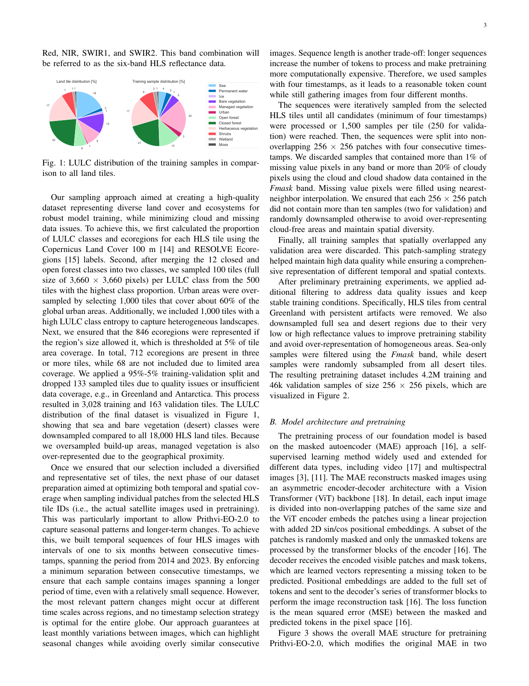
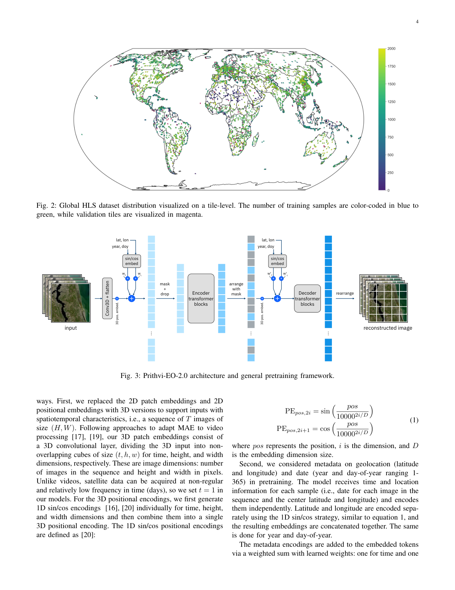
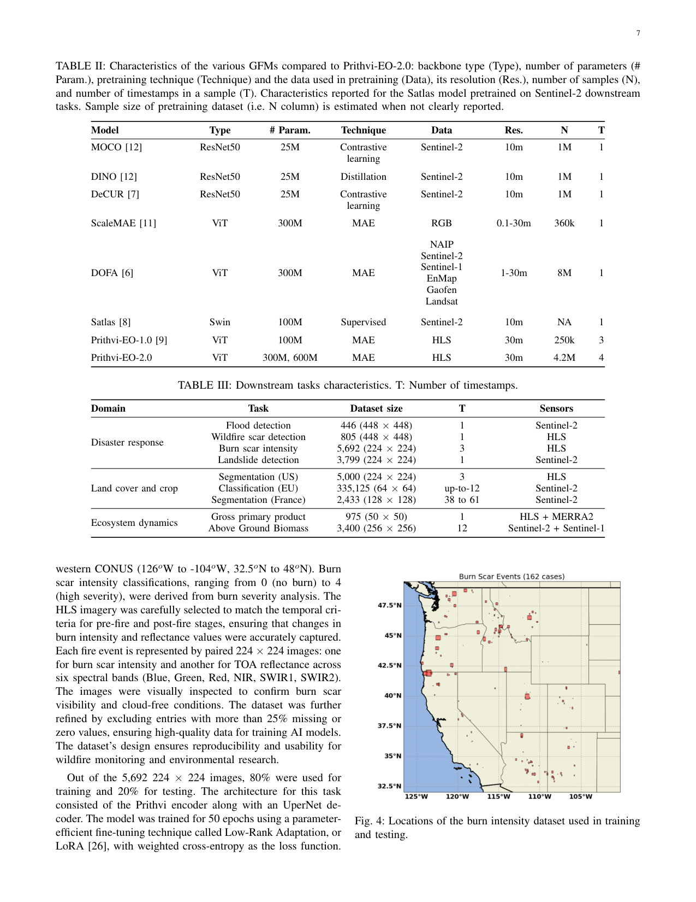
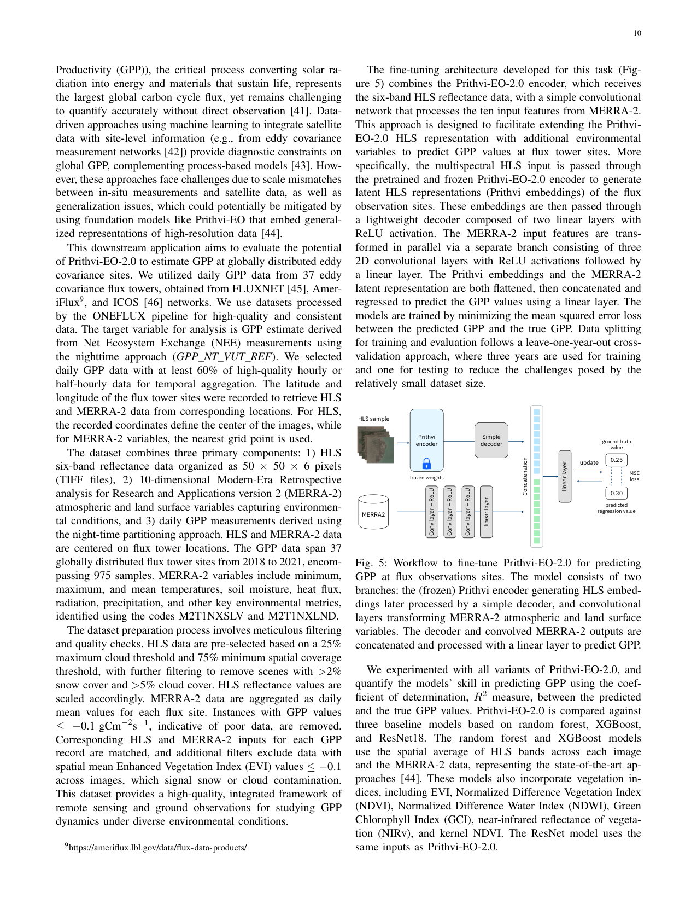
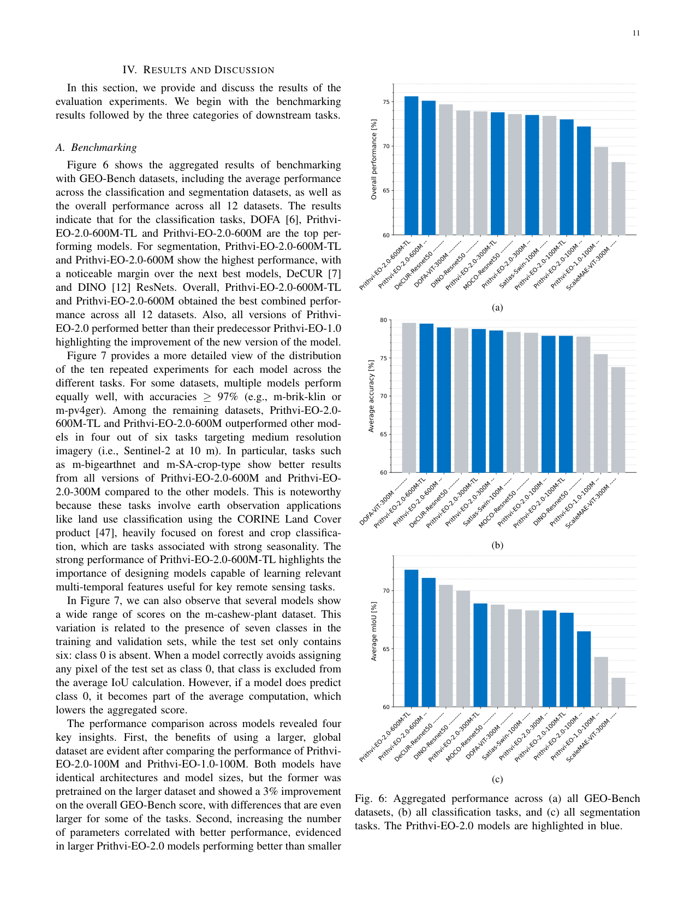
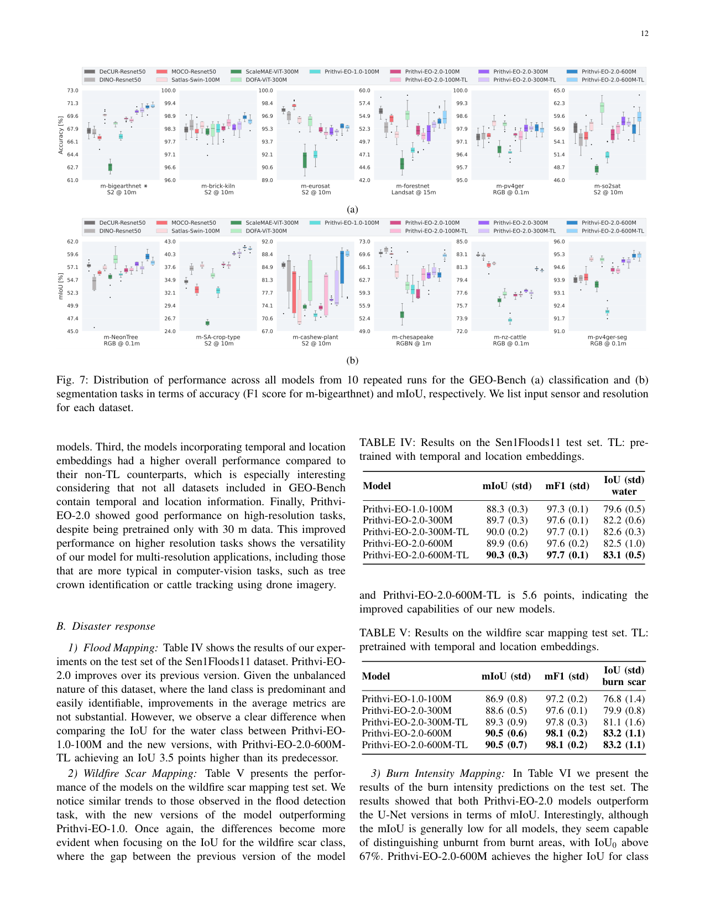
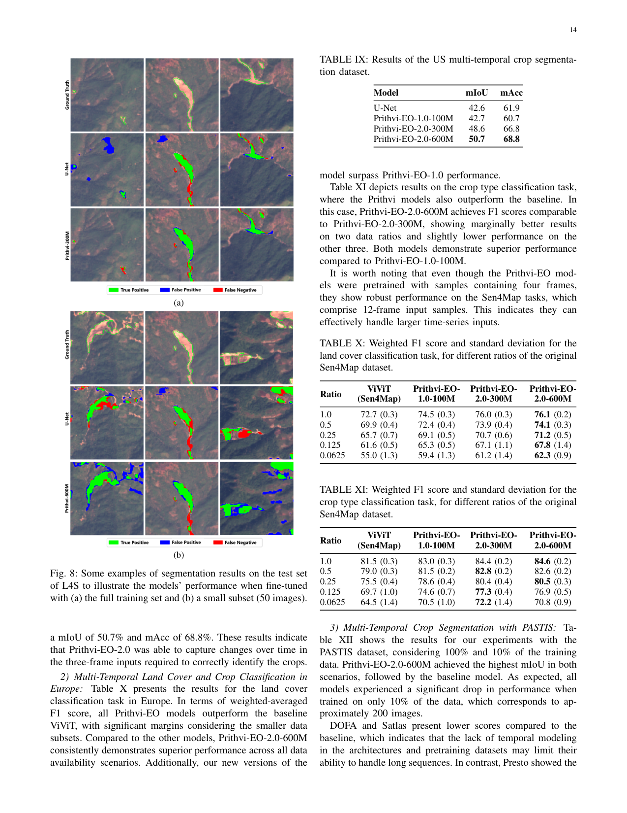
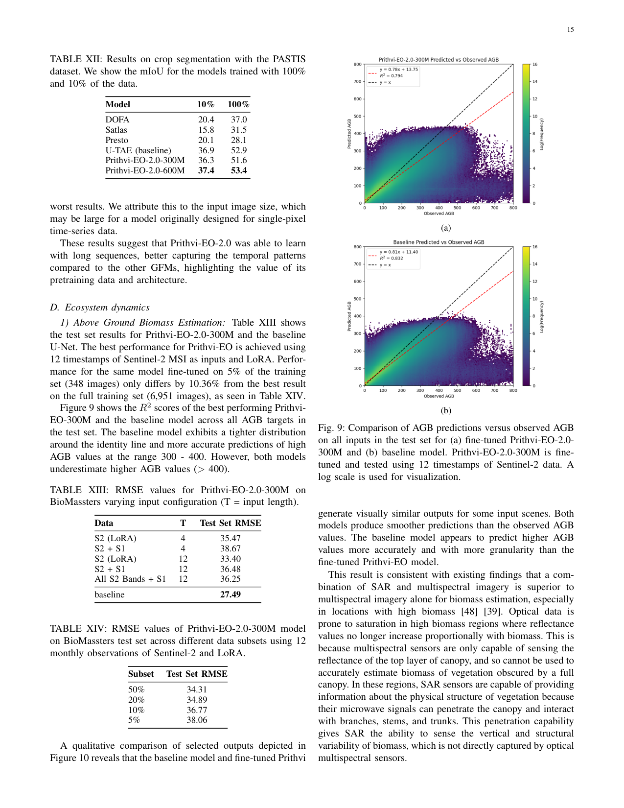
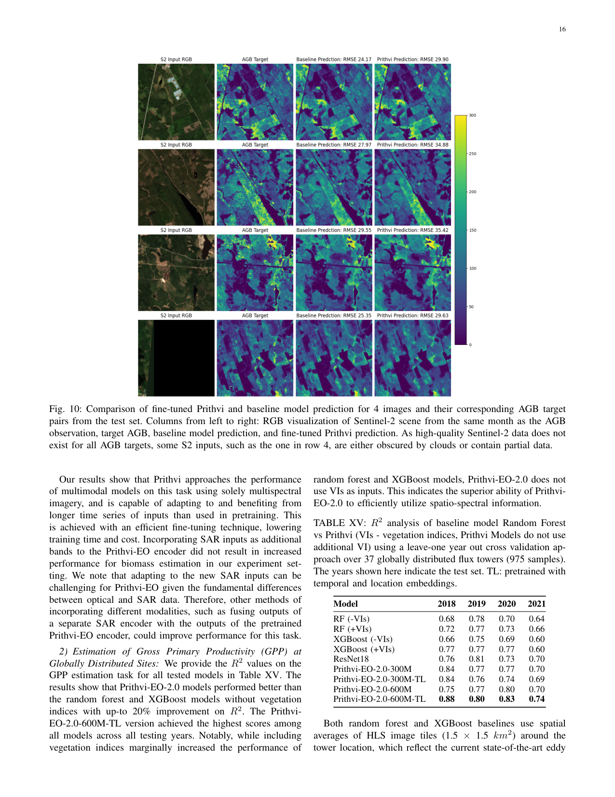
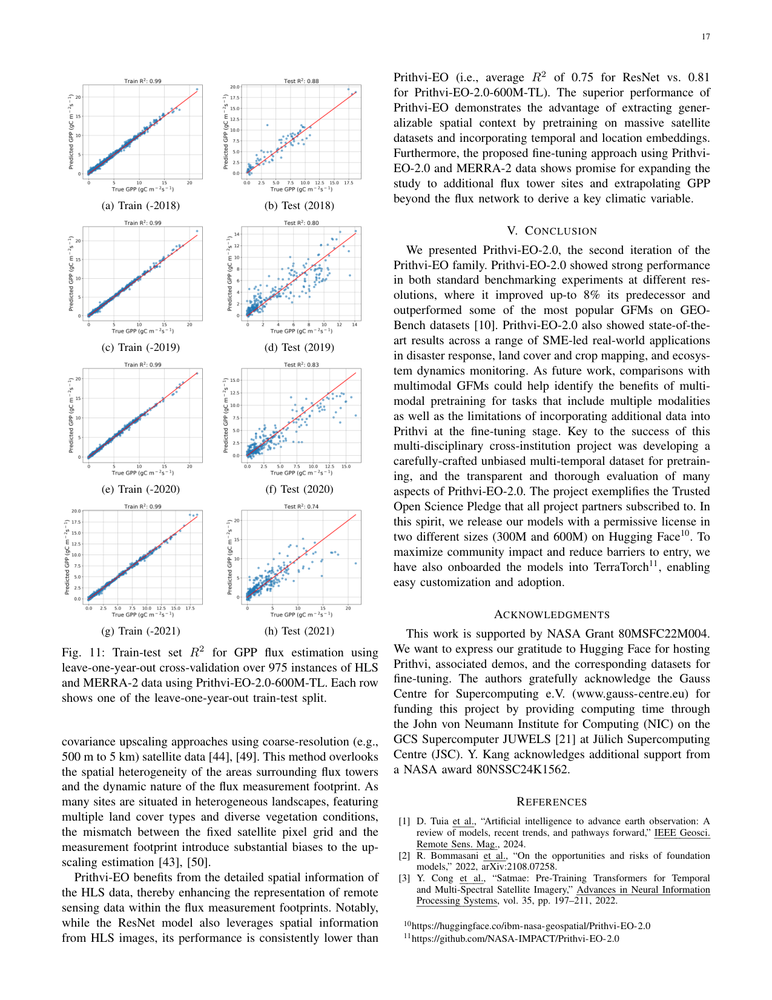

# Prithvi-EO-2.0: A Versatile Multi-Temporal Foundation Model for Earth Observation Applications

> **源文件**: Prithvi-EO-2.0_时序ViT_NASA+IBM.pdf  
> **页数**: 21 页  
> **生成日期**: 2026-05-27  
> **格式**: 中英对照逐段阅读  

---

## S001 | 标题页 / Title Page

**[EN]** Prithvi-EO-2.0: A Versatile Multi-Temporal Foundation Model for Earth Observation Applications  
Daniela Szwarcman¹,†, Sujit Roy²,³,†,‡ (Senior Member, IEEE), Paolo Fraccaro¹,†,‡, Þorsteinn Elí Gíslason⁴, Benedikt Blumenstiel¹, Rinki Ghosal³, Pedro Henrique de Oliveira¹, Joao Lucas de Sousa Almeida¹, Rocco Sedona⁵, Yanghui Kang⁶, Srija Chakraborty¹², Sizhe Wang⁷, Carlos Gomes¹, Ankur Kumar³, Vishal Gaur³, Myscon Truong⁸, Denys Godwin⁹, Sam Khallaghi⁹, Hyunho Lee⁷, Chia-Yu Hsu⁷, Rohit Lal³, Ata Akbari Asanjan¹², Besart Mujeci¹², Disha Shidham¹², Rufai Omowunmi Balogun⁹, Venkatesh Kolluru³, Trevor Keenan¹¹, Paulo Arevalo¹⁰, Wenwen Li⁷, Hamed Alemohammad⁹, Pontus Olofsson², Timothy Mayer³, Christopher Hain², Robert Kennedy⁸, Bianca Zadrozny¹, David Bell¹², Gabriele Cavallaro⁴,⁵ (Senior Member, IEEE), Campbell Watson¹, Manil Maskey² (Senior Member, IEEE), Rahul Ramachandran², and Juan Bernabe Moreno¹

†Equal Contribution; ‡Corresponding authors

**[ZH]** **Prithvi-EO-2.0：面向地球观测的多功能多时序基础模型**  
Daniela Szwarcman¹,†, Sujit Roy²,³,†,‡ (IEEE高级会员), Paolo Fraccaro¹,†,‡, Þorsteinn Elí Gíslason⁴, Benedikt Blumenstiel¹, Rinki Ghosal³, Pedro Henrique de Oliveira¹, Joao Lucas de Sousa Almeida¹, Rocco Sedona⁵, Yanghui Kang⁶, Srija Chakraborty¹², Sizhe Wang⁷, Carlos Gomes¹, Ankur Kumar³, Vishal Gaur³, Myscon Truong⁸, Denys Godwin⁹, Sam Khallaghi⁹, Hyunho Lee⁷, Chia-Yu Hsu⁷, Rohit Lal³, Ata Akbari Asanjan¹², Besart Mujeci¹², Disha Shidham¹², Rufai Omowunmi Balogun⁹, Venkatesh Kolluru³, Trevor Keenan¹¹, Paulo Arevalo¹⁰, Wenwen Li⁷, Hamed Alemohammad⁹, Pontus Olofsson², Timothy Mayer³, Christopher Hain², Robert Kennedy⁸, Bianca Zadrozny¹, David Bell¹², Gabriele Cavallaro⁴,⁵ (IEEE高级会员), Campbell Watson¹, Manil Maskey² (IEEE高级会员), Rahul Ramachandran², Juan Bernabe Moreno¹

†同等贡献；‡通讯作者

---

## C001 | 摘要 / Abstract

**[EN]** Abstract—This paper presents Prithvi-EO-2.0, a new geospatial foundation model that offers significant improvements over its predecessor, Prithvi-EO-1.0. Trained on 4.2 million global time series samples from NASA's Harmonized Landsat and Sentinel-2 data archive at 30-m resolution, the new model incorporates temporal and location embeddings for enhanced performance across various geospatial tasks. Through extensive benchmarking with GEO-Bench, the model outperforms the previous Prithvi-EO model by 8% across a range of tasks. It also outperforms six other geospatial foundation models when benchmarked on remote sensing tasks from different domains and resolutions (i.e. from 0.1 m to 15 m). The results demonstrate the versatility of the model in both classical Earth observation and high-resolution applications. Early involvement of end-users and subject matter experts (SMEs) allowed constant feedback on model and dataset design, enabling customization across diverse SME-led applications in disaster response, land cover and crop mapping, and ecosystem dynamics monitoring. Prithvi-EO-2.0 is available as an open-source model on Hugging Face and IBM TerraTorch, with additional resources on GitHub. The project exemplifies the Trusted Open Science approach embraced by all involved organizations.

**[ZH]** 摘要——本文提出了 Prithvi-EO-2.0，一种新的地理空间基础模型（Geospatial Foundation Model, GFM），相比其前身 Prithvi-EO-1.0 有显著改进。该模型在 NASA 的 Harmonized Landsat and Sentinel-2（HLS）数据档案库上以 30 米分辨率、420 万个全球时序样本进行训练，引入了时间嵌入（temporal embeddings）和位置嵌入（location embeddings），以提升在各种地理空间任务上的性能。通过在 GEO-Bench 上的广泛基准测试，该模型在一系列任务上比上一代 Prithvi-EO 模型提升了 8%。在针对不同领域和分辨率（即 0.1 米至 15 米）的遥感任务进行基准测试时，它同样优于其他六种地理空间基础模型。结果展示了该模型在经典地球观测和高分辨率应用中的多功能性。终端用户和领域专家（Subject Matter Experts, SMEs）的早期参与为模型和数据集设计提供了持续反馈，使得模型能够在灾害响应、土地覆盖与作物制图、生态系统动态监测等多样化的 SME 主导应用中进行定制。Prithvi-EO-2.0 作为开源模型发布在 Hugging Face 和 IBM TerraTorch 上，GitHub 上提供了额外资源。该项目体现了所有参与组织所倡导的"可信开放科学"（Trusted Open Science）理念。

---

## S002 | I. INTRODUCTION / 引言

**[EN]** I. INTRODUCTION  
In recent years, Earth Observation (EO) has entered a new era with the rise of Geospatial Foundation Models (GFMs)—large-scale artificial intelligence (AI) systems trained on vast amounts of unlabeled satellite imagery using self-supervised learning [1]. Foundation models are general-purpose neural networks (often based on transformer architectures) that learn broad representations from massive datasets and can be fine-tuned for many downstream tasks with minimal labeled data [2]. These models can help address longstanding challenges in EO by reducing the need for manually labeled samples, which are usually hard to obtain at scale [1]. Remote sensing is especially well-suited for foundation model development due to its global coverage, frequent revisits, and the sheer scale of unstructured imagery. Once pretrained, GFMs require less data to achieve similar or even superior performance across various domains [3], [4]. Despite their potential, real-world adoption remains limited.

**[ZH]** I. 引言  
近年来，随着地理空间基础模型（Geospatial Foundation Models, GFMs）的兴起，地球观测（Earth Observation, EO）进入了一个新时代。GFMs 是基于自监督学习（self-supervised learning）、在海量无标注卫星影像上训练的大规模人工智能（AI）系统 [1]。基础模型（Foundation models）是通用的神经网络（通常基于 transformer 架构），从大规模数据集中学习广泛的表征（representations），并能够以极少的标注数据微调（fine-tuned）到许多下游任务 [2]。这些模型有助于解决 EO 领域长期存在的挑战，即减少对人工标注样本的需求——这类样本通常难以大规模获取 [1]。遥感（Remote sensing）因其全球覆盖、高频重访以及海量非结构化影像的特点，特别适合基础模型的发展。一旦完成预训练（pretrained），GFMs 仅需更少的数据即可在各个领域达到相当甚至优越的性能 [3], [4]。尽管潜力巨大，但其在实际应用中的普及仍然有限。

---

## C002 | 引言（续）/ Introduction (cont.)

**[EN]** We identify three main limitations with available GFMs. First, although EO data is inherently multi-temporal, most GFMs do not account for this characteristic. Those that do either process only point data or focus on long time series restricted to small patches or individual pixels [4], [5]. Second, in-depth validation considering diverse types of tasks and clear comparison protocols remains limited. This hinders users' ability to assess whether the models are suitable for their use case. Third, adapting state-of-the-art GFMs to different applications may require AI expertise in the absence of the proper tools and guidance. While several GFMs have released the weights and model architecture [3], [4], [6]–[8], which is an important step toward community adoption, we believe that the lack of clear instructions or a streamlined code base for fine-tuning remains a significant barrier to broader use and further evaluation of GFMs.

**[ZH]** 我们识别出现有 GFMs 的三个主要局限性。第一，尽管 EO 数据本质上具有多时序（multi-temporal）特性，但大多数 GFMs 并未考虑这一特征。那些考虑了时序特性的模型要么只处理点数据（point data），要么将注意力局限于小 patch 或单个像素上的长时间序列 [4], [5]。第二，综合考虑多样化任务类型和清晰对比协议的深入验证仍然有限，这阻碍了用户评估模型是否适用于其应用场景。第三，在缺乏适当工具和指导的情况下，将最先进的 GFMs 适配到不同应用可能需要 AI 专业知识。虽然已有若干 GFMs 发布了权重和模型架构 [3], [4], [6]–[8]，这是推动社区采用的重要一步，但我们认为缺乏清晰的微调说明或精简的代码库仍然是阻碍 GFMs 更广泛使用和进一步评估的重要障碍。

---

## C003 | 引言（续）/ Introduction (cont.)

**[EN]** To address these issues and increase the impact of GFMs within the EO community, we developed a new multi-temporal GFM called Prithvi-EO-2.0. Building on its US-only predecessor, Prithvi-EO-1.0 [9], our new model explicitly uses transformer attention in both spatial and temporal dimensions and also incorporates metadata for location and time to better organize the embedding space. Pretraining was conducted at scale on a large dataset of medium resolution (30 m) satellite imagery created from NASA's Harmonized Landsat Sentinel-2 (HLS) archive spanning a decade. We designed a new sampling strategy for our pretraining dataset to focus on long-term trends and seasonal patterns, while also ensuring diverse and high-quality samples, so the model can better capture these characteristics. The scale of this dataset also allowed us to increase the model size up to 600 million parameters, placing Prithvi-EO-2.0 among the largest in the field of EO.

**[ZH]** 为解决这些问题并增强 GFMs 在 EO 社区中的影响力，我们开发了一种名为 Prithvi-EO-2.0 的新型多时序基础模型。基于其仅在美国数据上训练的前身 Prithvi-EO-1.0 [9]，我们的新模型明确地在空间和时间两个维度上使用 transformer 注意力机制，并融合了位置和时间的元数据（metadata），以更好地组织嵌入空间（embedding space）。预训练在大规模中等分辨率（30 米）卫星影像数据集上进行，该数据集由 NASA 的 Harmonized Landsat Sentinel-2（HLS）档案库构建，时间跨度达十年。我们设计了一种新的预训练数据集采样策略，专注于长期趋势和季节性模式，同时确保样本的多样性和高质量，从而使模型能够更好地捕捉这些特征。该数据集的规模还使我们能够将模型大小增加到 6 亿参数，使 Prithvi-EO-2.0 成为 EO 领域中规模最大的模型之一。

---

## C004 | 引言（续）/ Introduction (cont.)

**[EN]** Additionally, we conducted extensive validation, in close collaboration with remote sensing subject matter experts (SMEs), who were also involved in the dataset and model design. In particular, we validated Prithvi-EO-2.0 through a comprehensive benchmarking process with GEO-Bench [10], a robust framework for assessing EO Foundation Models. Further, we evaluated the models across a diverse set of applications, with SMEs playing a central role in implementation and assessment of results. To facilitate adoption and fine-tuning for new downstream tasks, we integrated Prithvi-EO-2.0 into TerraTorch, a toolkit powered by PyTorch Lightning and TorchGeo that simplifies customization of GFMs for various EO applications. The data loaders used in this work were also included in TerraTorch for reproducibility. Our results show that Prithvi-EO-2.0 can generalize across a wide range of remote sensing tasks, spanning different spatiotemporal resolutions and domains, often requiring fewer labeled samples to achieve strong performance compared to baseline models.

**[ZH]** 此外，我们与遥感领域专家（SMEs）密切合作进行了广泛验证，这些专家也参与了数据集和模型设计。具体而言，我们通过 GEO-Bench [10] 的全面基准测试流程对 Prithvi-EO-2.0 进行了验证——GEO-Bench 是一个用于评估 EO 基础模型的稳健框架。进一步地，我们在多样化的应用场景中评估了模型，其中 SMEs 在结果实施和评估中发挥了核心作用。为了促进模型在新下游任务中的采用和微调，我们将 Prithvi-EO-2.0 集成到了 TerraTorch 中——这是一个由 PyTorch Lightning 和 TorchGeo 驱动的工具包，可简化 GFMs 在各种 EO 应用中的定制。本工作中使用的数据加载器（data loaders）也被纳入 TerraTorch 以确保可复现性。我们的结果表明，Prithvi-EO-2.0 能够泛化到广泛的遥感任务，跨越不同的时空分辨率和领域，与基线模型相比，通常仅需更少的标注样本即可取得强劲性能。

---

## S003 | II. RELATED WORK / 相关工作

**[EN]** II. RELATED WORK  
Recent advances in self-supervised learning and large-scale pretraining have enabled the development of GFMs for EO data. Early work includes SatMAE [3], which adapts Masked Autoencoders (MAE) to satellite imagery with two variants: a spectral model with multiple patch embeddings grouping similar bands, and a temporal model trained on sequences of three RGB images with a shared 2D patch embeddings layer [3]. Although multispectral and temporal aspects are studied, they are not combined into a unified model. Scale-MAE [11] also builds on MAE, addressing scale variation by introducing a band-pass filter to separate and reconstruct low- and high-frequency images at different scales [11]. However, Scale-MAE is limited to RGB data and lacks temporal modeling.

**[ZH]** II. 相关工作  
自监督学习和大规模预训练的最新进展推动了面向 EO 数据的 GFMs 的发展。早期工作包括 SatMAE [3]，它将掩码自编码器（Masked Autoencoders, MAE）适配到卫星影像，包含两个变体：一个是具有多 patch 嵌入（将相似波段分组）的光谱模型，另一个是使用共享 2D patch 嵌入层在三帧 RGB 图像序列上训练的时间模型 [3]。虽然多光谱和时间方面都得到了研究，但它们并未被整合到一个统一的模型中。Scale-MAE [11] 同样基于 MAE，通过引入带通滤波器（band-pass filter）来分离和重建不同尺度的低频和高频图像，从而解决尺度变化问题 [11]。然而，Scale-MAE 仅限于 RGB 数据，且缺乏时间建模。

---

## C005 | 相关工作（续）/ Related Work (cont.)

**[EN]** Other approaches explore contrastive learning and distillation methods. The SSL4EO-S12 [12] is a large-scale dataset of Sentinel-1/2 imagery (3M patches, four seasonal frames per location). The authors pretrain ResNet-50 and ViT-S backbones using MoCo (contrastive) and DINO (distillation) on the Sentinel-2 part [12]. The frames, however, serve only as augmentation rather than explicit sequence modeling. DeCUR [7] and DOFA [6] invest in multimodal pretraining, with the first adopting the SSL4EO-S12 dataset and the latter considering several data sources. DeCUR employs separate encoders for each modality and proposes to decouple common and unique modality representations via multimodal redundancy reduction [7]. DOFA adopts a hypernetwork approach that generates weights conditioned on the central wavelength of each band. The pretraining procedure combines masked image modeling with distillation from ImageNet-based models [6]. Both DeCUR and DOFA operate on 2D inputs only.

**[ZH]** 其他方法探索了对比学习（contrastive learning）和蒸馏（distillation）方法。SSL4EO-S12 [12] 是一个大规模的 Sentinel-1/2 影像数据集（300 万个 patch，每个位置四个季节帧）。作者使用 MoCo（对比学习）和 DINO（蒸馏）在 Sentinel-2 部分预训练了 ResNet-50 和 ViT-S 骨干网络 [12]。然而，这些帧仅作为数据增强（augmentation）使用，而非显式的序列建模。DeCUR [7] 和 DOFA [6] 致力于多模态预训练，前者采用 SSL4EO-S12 数据集，后者考虑多种数据源。DeCUR 为每种模态使用独立的编码器（encoders），并提议通过多模态冗余约减（multimodal redundancy reduction）来解耦共有和独特的模态表征 [7]。DOFA 采用超网络（hypernetwork）方法，根据每个波段的中心波长生成权重。其预训练流程结合了掩码图像建模（masked image modeling）和基于 ImageNet 模型的蒸馏 [6]。DeCUR 和 DOFA 均仅在 2D 输入上操作。

---

## C006 | 相关工作（续）/ Related Work (cont.)

**[EN]** Temporal modeling is the focus of Presto [4], a lightweight transformer for EO pixel time series. The model is trained with 12 months of data from different sources, with each month represented by a monthly timestamp, including Sentinel-1/2, topography, ERA-5, and metadata. While effective for time-series tasks, Presto is evaluated on image tasks in a limited manner: nine pixels are sampled from the images, and the results are the mode of the corresponding predictions [4]. In contrast, U-BARN [5] also considers the spatial aspect: a BERT-like approach is used for pretraining, with an architecture that combines a U-Net with a transformer. Despite its spatiotemporal design, U-BARN is trained with small 64×64 patches and a very restricted pretraining dataset, considering only nine Sentinel-2 tiles from France over two years [5].

**[ZH]** 时间建模是 Presto [4] 的焦点，它是一种面向 EO 像素时序（pixel time series）的轻量级 transformer。该模型使用来自不同源的 12 个月数据进行训练，每个月以月度时间戳表示，数据源包括 Sentinel-1/2、地形（topography）、ERA-5 和元数据。虽然 Presto 对时序任务有效，但其在图像任务上的评估方式较为有限：从图像中采样九个像素，结果是对应预测的模式（mode）[4]。相比之下，U-BARN [5] 也考虑了空间方面：使用类似 BERT 的方法进行预训练，架构结合了 U-Net 和 transformer。尽管具有时空设计，U-BARN 仅在 64×64 的小 patch 上训练，且预训练数据集非常受限——仅考虑法国境内九个 Sentinel-2 瓦片（tiles）两年的数据 [5]。

---

## C007 | 相关工作（续）/ Related Work (cont.)

**[EN]** In this context, Prithvi-EO-2.0 focuses on a larger, higher-quality global dataset with more than 4M samples, as well as larger models, and flexibility regarding the use of metadata. Our approach emphasizes spatiotemporal modeling, incorporating seasonal and long-term dynamics over a decade, significantly exceeding the temporal coverage of prior models, while maintaining spatial representation capabilities.

**[ZH]** 在此背景下，Prithvi-EO-2.0 专注于更大、更高质量的全球数据集（超过 400 万个样本），以及更大的模型，并在元数据使用方面保持灵活性。我们的方法强调时空建模（spatiotemporal modeling），纳入了十年跨度的季节性和长期动态，显著超越了先前模型的时间覆盖范围，同时保持了空间表征能力。

---

## S004 | III. METHODS / 方法

**[EN]** III. METHODS

**[ZH]** III. 方法

---

## S005 | A. Dataset Description and Sampling / 数据集描述与采样

**[EN]** A. Dataset Description and Sampling  
The HLS product [13] is a deliverable from the Satellite Needs Working Group that harmonizes data from NASA/USGS's Landsat 8 and 9 and the ESA's Sentinel-2A and-2B satellites to achieve a higher temporal resolution. HLS is compatible with the 40-year Landsat data record at 30 m spatial resolution but with a temporal resolution of two-three days on average. The data is framed into tiles measuring 109.8 km by 109.8 km (3,660 × 3,660 pixels) in the UTM-based Military Grid Reference System (MGRS) [13]. Fifteen visible and infrared bands are available in HLS, however, not all spectral bands are present in Sentinel and Landsat. Therefore, we used the six spectral bands common to both: Blue, Green, Red, NIR, SWIR1, and SWIR2. This band combination will be referred to as the six-band HLS reflectance data.

**[ZH]** A. 数据集描述与采样  
HLS 产品 [13] 是卫星需求工作组（Satellite Needs Working Group）的一项成果，它协调了 NASA/USGS 的 Landsat 8 和 9 以及 ESA 的 Sentinel-2A 和 2B 卫星的数据，以实现更高的时间分辨率。HLS 与拥有 40 年历史的 Landsat 数据记录兼容，空间分辨率为 30 米，但平均时间分辨率为两到三天。数据被分帧为基于 UTM 的军事格网参考系统（Military Grid Reference System, MGRS）[13] 下的瓦片（tiles），每块大小为 109.8 km × 109.8 km（3,660 × 3,660 像素）。HLS 提供 15 个可见光和红外波段，然而并非所有光谱波段都同时存在于 Sentinel 和 Landsat 中。因此，我们使用了两者共有的六个光谱波段：蓝（Blue）、绿（Green）、红（Red）、近红外（NIR）、短波红外 1（SWIR1）和短波红外 2（SWIR2）。该波段组合将被称为六波段 HLS 反射率数据（six-band HLS reflectance data）。

---

## F001 | Fig. 1 / 图 1

**[EN]** Fig. 1: LULC distribution of the training samples in comparison to all land tiles.

**[ZH]** 图 1：训练样本的土地利用/土地覆盖（LULC）分布与所有陆地瓦片的对比。

---

## C008 | 数据集（续）/ Dataset (cont.)

**[EN]** Our sampling approach aimed at creating a high-quality dataset representing diverse land cover and ecosystems for robust model training, while minimizing cloud and missing data issues. To achieve this, we first calculated the proportion of LULC classes and ecoregions for each HLS tile using the Copernicus Land Cover 100 m [14] and RESOLVE Ecoregions [15] labels. Second, after merging the 12 closed and open forest classes into two classes, we sampled 100 tiles (full size of 3,660 × 3,660 pixels) per LULC class from the 500 tiles with the highest class proportion. Urban areas were oversampled by selecting 1,000 tiles that cover about 60% of the global urban areas. Additionally, we included 1,000 tiles with a high LULC class entropy to capture heterogeneous landscapes. Next, we ensured that the 846 ecoregions were represented if the region's size allowed it, which is thresholded at 5% of tile area coverage. In total, 712 ecoregions are present in three or more tiles, while 68 are not included due to limited area coverage. We applied a 95%-5% training-validation split and dropped 133 sampled tiles due to quality issues or insufficient data coverage, e.g., in Greenland and Antarctica. This process resulted in 3,028 training and 163 validation tiles.

**[ZH]** 我们的采样方法旨在创建一个高质量的数据集，代表多样化的土地覆盖和生态系统，以实现稳健的模型训练，同时尽量减少云和缺失数据问题。为此，我们首先使用哥白尼土地覆盖 100 m [14] 和 RESOLVE 生态区 [15] 标签计算每个 HLS 瓦片的 LULC 类别和生态区比例。其次，在将 12 个封闭林和开放林类别合并为两个类别后，我们从类别比例最高的 500 个瓦片中，每个 LULC 类别采样 100 个瓦片（完整尺寸 3,660 × 3,660 像素）。城市区域通过选择覆盖全球约 60% 城市面积的 1,000 个瓦片进行过采样（oversampled）。此外，我们纳入了 1,000 个具有高 LULC 类别熵（entropy）的瓦片以捕捉异质景观。接下来，我们确保 846 个生态区在区域大小允许的情况下得到代表，阈值设定为瓦片面积覆盖率的 5%。总共有 712 个生态区出现在三个或更多瓦片中，而 68 个因面积覆盖有限未被纳入。我们采用了 95%-5% 的训练-验证划分，并由于质量问题或数据覆盖不足（例如在格陵兰和南极洲）剔除了 133 个采样瓦片。这一过程产生了 3,028 个训练瓦片和 163 个验证瓦片。

---

## C009 | 数据集（续）/ Dataset (cont.)

**[EN]** Once we ensured that our selection included a diversified and representative set of tiles, the next phase of our dataset preparation aimed at optimizing both temporal and spatial coverage when sampling individual patches from the selected HLS tile IDs (i.e., the actual satellite images used in pretraining). This was particularly important to allow Prithvi-EO-2.0 to capture seasonal patterns and longer-term changes. To achieve this, we prioritized sampling patches with longer sequences of valid images. Sequence length is another trade-off: longer sequences increase the number of tokens to process and make pretraining more computationally expensive. Therefore, we used samples with four timestamps, as it leads to a reasonable token count while still gathering images from four different months. The sequences were iteratively sampled from the selected HLS tiles until all candidates (minimum of four timestamps) were processed or 1,500 samples per tile (250 for validation) were reached. Then, the sequences were split into non-overlapping 256 × 256 patches with four consecutive timestamps.

**[ZH]** 在确保我们的选择包含了多样化且有代表性的瓦片集之后，数据集准备的下一阶段旨在从选定的 HLS 瓦片 ID 中采样单个 patch 时优化时间和空间覆盖（即预训练中使用的实际卫星图像）。这对于 Prithvi-EO-2.0 捕捉季节性模式和长期变化尤为重要。为此，我们优先采样具有较长有效图像序列的 patch。序列长度是另一个权衡：更长的序列增加了需要处理的 token 数量，使预训练计算成本更高。因此，我们使用了具有四个时间戳（four timestamps）的样本，因为这能产生合理的 token 数量，同时仍能收集来自四个月份的图像。序列从选定的 HLS 瓦片中迭代采样，直到处理完所有候选（至少四个时间戳）或达到每个瓦片 1,500 个样本（验证集 250 个）。然后，将序列分割为不重叠的 256 × 256 patch，每个 patch 包含四个连续时间戳。

---

## C010 | 数据集（续）/ Dataset (cont.)

**[EN]** We discarded samples that contained more than 1% of missing value pixels in any band or more than 20% of cloudy pixels using the cloud and cloud shadow data contained in the Fmask band. Missing value pixels were filled using nearest-neighbor interpolation. We ensured that each 256×256 patch did not contain more than ten samples (two for validation) and randomly downsampled otherwise to avoid over-representing cloud-free areas and maintain spatial diversity. Finally, all training samples that spatially overlapped any validation area were discarded. This patch-sampling strategy helped maintain high data quality while ensuring a comprehensive representation of different temporal and spatial contexts. After preliminary pretraining experiments, we applied additional filtering to address data quality issues and keep stable training conditions. Specifically, HLS tiles from central Greenland with persistent artifacts were removed. We also downsampled full sea and desert regions due to their very low or high reflectance values to improve pretraining stability and avoid over-representation of homogeneous areas. Sea-only samples were filtered using the Fmask band, while desert samples were randomly subsampled from all desert tiles. The resulting pretraining dataset includes 4.2M training and 46k validation samples of size 256 × 256 pixels, which are visualized in Figure 2.

**[ZH]** 我们丢弃了在任何波段中包含超过 1% 缺失值像素或超过 20% 云像素（使用 Fmask 波段中包含的云和云阴影数据）的样本。缺失值像素使用最近邻插值（nearest-neighbor interpolation）填充。我们确保每个 256×256 patch 包含的样本不超过十个（验证集两个），否则进行随机下采样，以避免过度代表无云区域并保持空间多样性。最后，所有在空间上与任何验证区域重叠的训练样本都被丢弃。这种 patch 采样策略有助于保持高数据质量，同时确保对不同时间和空间背景的全面表征。在初步预训练实验后，我们应用了额外的过滤来解决数据质量问题并保持稳定的训练条件。具体而言，去除了格陵兰中部存在持续伪影（artifacts）的 HLS 瓦片。我们还对全海洋和沙漠区域进行了下采样，因为它们的反射率值极低或极高，以提高预训练稳定性并避免过度代表同质区域。仅海洋样本使用 Fmask 波段过滤，而沙漠样本则从所有沙漠瓦片中随机子采样。最终得到的预训练数据集包含 420 万个训练样本和 4.6 万个验证样本，尺寸为 256 × 256 像素，其分布如图 2 所示。

---

## F002 | Fig. 2 / 图 2

**[EN]** Fig. 2: Global HLS dataset distribution visualized on a tile-level. The number of training samples are color-coded in blue to green, while validation tiles are visualized in magenta.

**[ZH]** 图 2：全球 HLS 数据集在瓦片级别上的分布可视化。训练样本数量以蓝到绿色编码，验证瓦片以洋红色（magenta）显示。

---

## S006 | B. Model architecture and pretraining / 模型架构与预训练

**[EN]** B. Model architecture and pretraining  
The pretraining process of our foundation model is based on the masked autoencoder (MAE) approach [16], a self-supervised learning method widely used and extended for different data types, including video [17] and multispectral images [3], [11]. The MAE reconstructs masked images using an asymmetric encoder-decoder architecture with a Vision Transformer (ViT) backbone [18]. In detail, each input image is divided into non-overlapping patches of the same size and the ViT encoder embeds the patches using a linear projection with added 2D sin/cos positional embeddings. A subset of the embedded patches is masked and the remaining unmasked patches are passed to the encoder transformer blocks. The encoded tokens and the masked tokens (with shared learned mask embeddings) are then rearranged and passed to the decoder transformer blocks. The decoder reconstructs the full image, i.e., predicts the pixel values for each masked patch.

**[ZH]** B. 模型架构与预训练  
我们基础模型的预训练流程基于掩码自编码器（Masked Autoencoder, MAE）方法 [16]，这是一种广泛用于并被扩展到不同数据类型的自监督学习方法，包括视频 [17] 和多光谱图像 [3], [11]。MAE 使用非对称的编码器-解码器架构和 Vision Transformer（ViT）骨干网络 [18] 来重建被掩码的图像。具体而言，每个输入图像被划分为相同尺寸的不重叠 patch，ViT 编码器使用线性投影和附加的 2D 正弦/余弦位置嵌入（sin/cos positional embeddings）来嵌入这些 patch。一部分嵌入后的 patch 被掩码（masked），剩余未被掩码的 patch 被送入编码器 transformer 块。编码后的 token 和掩码 token（使用共享的学习掩码嵌入）随后被重排并送入解码器 transformer 块。解码器重建完整图像，即预测每个被掩码 patch 的像素值。

---

## F003 | Fig. 3 / 图 3

**[EN]** Fig. 3: Prithvi-EO-2.0 architecture and general pretraining framework.

**[ZH]** 图 3：Prithvi-EO-2.0 架构及通用预训练框架。

---

## C011 | 模型架构（续）/ Model Architecture (cont.)

**[EN]** To adapt MAE to spatiotemporal inputs, we modified the standard architecture in three ways. First, we replaced the 2D patch embeddings and 2D positional embeddings with 3D versions to support inputs with spatiotemporal characteristics, i.e., a sequence of T images of size (H, W). Following approaches to adapt MAE to video processing [17], [19], our 3D patch embeddings are implemented as a 3D convolutional layer that operates over a sequence of T images with kernel size (t, p, p), where t and p denote the temporal and spatial patch sizes. Similarly, the 3D positional embeddings are a 3D extension of the 2D sin/cos positional encodings. The second change we introduced are temporal and geospatial embeddings. Inspired by approaches to add weather and climate information to the input [20], we learned temporal and geospatial embeddings that are added to the input tokens, to encode the time and center coordinates of each image. The geospatial embeddings are implemented with a simple linear layer that takes normalized latitude and longitude as inputs. The temporal embeddings encode the year and day of year using the same sinusoidal positional encoding used for the patch positional embeddings. These embeddings are added as a simple bias to all the tokens from the corresponding image, independently from the patch position, i.e., the metadata embeddings are broadcasted across the spatial dimensions before being added to each token.

**[ZH]** 为了将 MAE 适配到时空输入，我们以三种方式修改了标准架构。首先，我们将 2D patch 嵌入和 2D 位置嵌入替换为 3D 版本，以支持具有时空特性的输入，即尺寸为 (H, W) 的 T 帧图像序列。遵循将 MAE 适配到视频处理的方法 [17], [19]，我们的 3D patch 嵌入实现为一个 3D 卷积层，在 T 帧图像序列上操作，核大小为 (t, p, p)，其中 t 和 p 分别表示时间和空间 patch 大小。类似地，3D 位置嵌入是 2D 正弦/余弦位置编码的 3D 扩展。我们引入的第二个改变是时间嵌入和地理空间嵌入（temporal and geospatial embeddings）。受将天气和气候信息添加到输入中的方法 [20] 启发，我们学习了时间嵌入和地理空间嵌入，并将其添加到输入 token 中，以编码每幅图像的时间和中心坐标。地理空间嵌入使用一个简单的线性层实现，该层以归一化的纬度和经度作为输入。时间嵌入使用与 patch 位置嵌入相同的正弦位置编码对年份和年中的日期（day of year）进行编码。这些嵌入作为简单偏置（bias）添加到对应图像的所有 token 上，与 patch 位置无关，即元数据嵌入在空间维度上广播后再添加到每个 token。

---

## C012 | 模型架构（续）/ Model Architecture (cont.)

**[EN]** This means that we let the model learn how the metadata should be added to the embedded tokens. Since this metadata is often not available, we decided to include it not as additional inputs in patch embeddings, but as a simple bias, similar to the idea of positional encodings. For the same reason, we also added a drop mechanism during pretraining that randomly drops the geolocation and/or the temporal data to help the model learn how to handle the absence of this information. Note that the metadata encodings are designed to inform the model about the sample's general location (center coordinates) and corresponding timestamp, while the positional embeddings inform about the 3D positions of the tokens within the sequence of images. Following the work by Xu et al. [21], the third change we introduced is convolutional embeddings to replace the patch embeddings in both encoder and decoder. This has shown to improve the performance of ViTs and is more suitable for dense prediction tasks.

**[ZH]** 这意味着我们让模型学习如何将元数据添加到嵌入的 token 中。由于这些元数据常常不可用，我们决定不将其作为 patch 嵌入中的额外输入，而是作为一种简单的偏置，类似于位置编码的思想。出于同样的原因，我们在预训练期间还添加了一种丢弃机制（drop mechanism），随机丢弃地理定位和时间数据，以帮助模型学习如何处理这些信息的缺失。注意，元数据编码旨在告知模型样本的大致位置（中心坐标）和对应的时间戳，而位置嵌入则告知 token 在图像序列中的 3D 位置。遵循 Xu 等人 [21] 的工作，我们引入的第三个改变是在编码器和解码器中使用卷积嵌入（convolutional embeddings）来替代 patch 嵌入。这已被证明可以提升 ViT 的性能，并且更适合密集预测任务（dense prediction tasks）。

---

## C013 | 模型架构（续）/ Model Architecture (cont.)

**[EN]** Using the architecture and MAE approach described, we developed Prithvi-EO-2.0 in two sizes, 300M and 600M, based on ViT-L and ViT-H, respectively [18]. We trained versions with (Prithvi-EO-2.0-*-TL) and without (Prithvi-EO-2.0-*) temporal (T) and location (L) information. The models were trained for 400 epochs on A100 40GB GPUs; for the 300M model, this took about two weeks using 32 GPUs. We used a mask ratio of 0.5 following SatMAE [3] and a batch size of 2048. We adopted a cosine learning rate schedule with linear warmup for 50 epochs, with a peak learning rate of 1e-4, weight decay of 0.05, and the AdamW optimizer [24].

**[ZH]** 使用上述架构和 MAE 方法，我们开发了两种尺寸的 Prithvi-EO-2.0：3 亿参数（300M）和 6 亿参数（600M），分别基于 ViT-L 和 ViT-H [18]。我们训练了包含时间（T）和位置（L）信息（Prithvi-EO-2.0-*-TL）以及不包含（Prithvi-EO-2.0-*）的版本。模型在 A100 40GB GPU 上训练了 400 个 epoch；对于 300M 模型，使用 32 块 GPU 耗时约两周。我们遵循 SatMAE [3] 使用了 0.5 的掩码比例（mask ratio），批次大小（batch size）为 2048。我们采用了带线性预热（linear warmup）50 个 epoch 的余弦学习率调度（cosine learning rate schedule），峰值学习率为 1e-4，权重衰减（weight decay）为 0.05，优化器为 AdamW [24]。

---

## S007 | C. Evaluation / 评估

**[EN]** C. Evaluation  
There are two key aspects to consider when evaluating the usefulness of a foundation model. The first involves benchmarking the model against published competitors using a standardized set of tasks, following a rigorous protocol that ensures fair comparison and reproducibility. The second aspect is the evaluation of the model across diverse downstream tasks relevant to end users. In both cases, the evaluation should assess the transferability of the model, i.e., how effectively the pretrained model can be fine-tuned for unseen tasks. We considered both aspects in this work.

**[ZH]** C. 评估  
评估基础模型实用性时需考虑两个关键方面。第一个方面涉及使用标准化任务集对模型与已发表的竞争模型进行基准测试（benchmarking），遵循确保公平比较和可复现性的严格协议。第二个方面是在与终端用户相关的多样化下游任务（downstream tasks）上评估模型。在这两种情况下，评估都应检验模型的可迁移性（transferability），即预训练模型对未见过任务的有效微调能力。本工作中我们同时考虑了这两个方面。

---

## C014 | 评估指标 / Evaluation Metrics

**[EN]** For classification tasks, we use accuracy as the evaluation metric, defined as: Accuracy = (TP + TN) / (TP + TN + FP + FN), where TP, TN, FP and FN denote the number of true positives, true negatives, false positives and false negatives respectively. For segmentation tasks, we use the mean Intersection over Union (mIoU) as the evaluation metric. It measures the average overlap between predicted and ground truth regions across all classes, defined as: mIoU = (1/C) * Σ (prediction_c ∩ truth_c) / (prediction_c ∪ truth_c), where C is the total number of classes and prediction_c and truth denote the predicted and ground truth regions for class c, respectively. For some tasks, we also report the precision, recall, and F1-score.

**[ZH]** 对于分类任务，我们使用准确率（accuracy）作为评估指标，定义为：准确率 = (TP + TN) / (TP + TN + FP + FN)，其中 TP、TN、FP 和 FN 分别表示真阳性、真阴性、假阳性和假阴性的数量。对于分割任务，我们使用平均交并比（mean Intersection over Union, mIoU）作为评估指标。它衡量预测区域与真实区域在所有类别上的平均重叠度，定义为：mIoU = (1/C) * Σ (prediction_c ∩ truth_c) / (prediction_c ∪ truth_c)，其中 C 为类别总数，prediction_c 和 truth_c 分别表示类别 c 的预测区域和真实区域。对于某些任务，我们还报告精确率（precision）、召回率（recall）和 F1 分数（F1-score）。

---

## C015 | GEO-Bench 基准测试 / GEO-Bench Benchmarking

**[EN]** 1) Benchmarking: For the benchmarking experiments, we used the GEO-Bench framework [10], which is a collection of 12 remote sensing datasets covering classification and semantic segmentation tasks at different resolutions (from 10 to 30 m) and geographical areas. The datasets included in the framework were selected to cover a diverse set of domains and sensors (Sentinel-1, Sentinel-2 and Landsat). All datasets are paired with a reference training code and data loaders for reproducibility. In this work, we included in the comparison Prithvi-EO-2.0 and Prithvi-EO-1.0, as well as five other GFMs: DOFA [6], DeCUR [7], SatMAE [3], DINO-ResNet50 [25], and Satlas [26]. The characteristics of these models are shown in Table II. For all GEO-Bench experiments, we followed the training and evaluation protocols provided by the benchmark, where each experiment was repeated ten times with different random seeds. The performance metrics were computed on the test set using the best hyperparameters, which were selected using the validation set.

**[ZH]** 1) 基准测试：对于基准测试实验，我们使用了 GEO-Bench 框架 [10]，它是一个包含 12 个遥感数据集的集合，涵盖不同分辨率（10 米至 30 米）和地理区域的分类与语义分割任务。框架中包含的数据集经过精选，覆盖了多样化的领域和传感器（Sentinel-1、Sentinel-2 和 Landsat）。所有数据集均配有参考训练代码和数据加载器以确保可复现性。在本工作中，我们在比较中纳入了 Prithvi-EO-2.0、Prithvi-EO-1.0 以及另外五种 GFMs：DOFA [6]、DeCUR [7]、SatMAE [3]、DINO-ResNet50 [25] 和 Satlas [26]。这些模型的特征如表 II 所示。对于所有 GEO-Bench 实验，我们遵循基准测试提供的训练和评估协议，每个实验使用不同的随机种子重复十次。性能指标在测试集上使用最佳超参数计算，最佳超参数通过验证集选取。

---

## T001 | Table I / 表 I

**[EN]** TABLE I: Characteristics of the GEO-Bench datasets [10]. We show image height and width sizes in pixels (H, W), number of classes (C), sizes of the training (Train), validation (Val), and test (Test) sets, numbers of bands (B), and sensors (Sensors).

**[ZH]** 表 I：GEO-Bench 数据集特征 [10]。我们展示了以像素为单位的图像高和宽（H, W）、类别数（C）、训练集（Train）、验证集（Val）和测试集（Test）的大小、波段数（B）以及传感器（Sensors）。

*(表格内容详见原文，此处保留原始结构。主要数据集包括：m-bigearthnet、fmow、so2sat、brick-kiln、forestnet、pv4ger、neon-tree、crop-type、cashew-plant、chesapeake、nz-cattle、pv4ger-seg 等，涵盖 Sentinel-1/2、Landsat、NAIP 等传感器，分辨率从 10m 到 30m 不等。)*

---

## T002 | Table II / 表 II

**[EN]** TABLE II: Characteristics of the various GFMs compared to Prithvi-EO-2.0: backbone type (Type), number of parameters (# Param.), pretraining technique (Technique) and the data used in pretraining (Data), its resolution (Res.), number of samples (N), and number of timestamps in a sample (T).

**[ZH]** 表 II：各 GFMs 与 Prithvi-EO-2.0 的特征对比：骨干网络类型（Type）、参数数量（# Param.）、预训练技术（Technique）、预训练使用的数据（Data）、分辨率（Res.）、样本数量（N）以及每个样本中的时间戳数量（T）。

*(表格内容详见原文。主要模型包括：Prithvi-EO-2.0-300M/600M [ViT-L/H, MAE, HLS 30m, 4.2M samples, 4 timestamps]、Prithvi-EO-1.0 [ViT-H, MAE, HLS 30m, 300k, 1]、DOFA [ViT-B, MAE+Distillation, Sentinel-2 10m, 1M, 1]、DeCUR [ViT-B, Contrastive, Sentinel-2 10m, 1M, 1]、SatMAE [ViT-L, MAE, NAIP/Sentinel-2 1-30m, 360k-8M, 1]、DINO-ResNet50 [ResNet, Distillation, Sentinel-2 10m, 1M, 1]、Satlas [Swin, Supervised, Sentinel-2 10m, 1.5M, 1] 等。)*

---

## C016 | 下游任务 / Downstream Tasks

**[EN]** 2) Downstream tasks: The evaluation of Prithvi-EO-2.0 was performed on a diverse set of remote sensing applications that reflect a wide range of end-user needs. To that end, we collaborated with SMEs to identify relevant tasks and datasets. The downstream tasks used in this work are divided into three broad categories: disaster response, land cover and crop mapping, and ecosystem dynamics. These tasks are described in more detail in the following paragraphs and their characteristics are summarized in Table III.

**[ZH]** 2) 下游任务：Prithvi-EO-2.0 的评估在一组多样化的遥感应用上进行，这些应用反映了广泛的终端用户需求。为此，我们与 SMEs 合作确定了相关任务和数据集。本工作中使用的下游任务分为三大类：灾害响应、土地覆盖与作物制图、以及生态系统动态。这些任务在以下段落中详细描述，其特征总结于表 III 中。

---

## T003 | Table III / 表 III

**[EN]** TABLE III: Downstream tasks characteristics.

**[ZH]** 表 III：下游任务特征。

*(表格内容详见原文。任务包括：灾害响应——洪水检测 [Sen1Floods11, 446 images, S1/S2, segmentation]、野火疤痕检测 [805 images, S2, segmentation]、火烧强度 [5,692, HLS, segmentation]、滑坡检测 [L4S, 3,799, S2, segmentation]；土地覆盖与作物制图——美国分割 [5,000, HLS, multi-temporal crop segmentation]、土地覆盖分类 [Sen4Map, S2, classification]、作物类型分类 [Sen4Map, S2, classification]、作物分割 [PASTIS, S2, segmentation]；生态系统动态——地上生物量 [BioMassters, S1/S2, regression]、总初级生产力 [FluxNet, HLS+MERRA-2, regression]。)*

---

## F004 | Fig. 4 / 图 4

**[EN]** Fig. 4: Locations of the burn intensity dataset used in training and testing.

**[ZH]** 图 4：火烧强度数据集用于训练和测试的位置分布。

---

## C017 | 下游任务详情 / Downstream Task Details

**[EN]** a) Disaster response: For disaster response, we selected four use cases: flood mapping, wildfire scar mapping, burn intensity, and landslide detection. For flood mapping, we used the Sen1Floods11 [27] dataset, which is a labeled dataset of Sentinel-1 and Sentinel-2 imagery. The dataset consists of 446 512×512 images covering 14 biomes, 357 ecoregions, and 6 continents of the world across 11 flood events between 2018 and 2020. For wildfire scar mapping, we used a dataset of 805 manually annotated 512×512 Sentinel-2 images capturing wildfires from different regions of the world. For burn intensity, we selected the USDA Forest Service's Monitoring Trends in Burn Severity (MTBS) dataset. The dataset contains perimeters and severity classes of fires that occurred in the United States from 1984 to 2022. For this use case, we selected 5,692 image patches of 224×224 pixels containing 5 severity classes (unburned to low, low, moderate, high, and increased greenness) and used the HLS six-band reflectance data. The dataset was split using stratified sampling with 60%, 20%, and 20% for training, validation and testing, respectively. The fire locations are shown in Figure 4. For landslide detection, we used the Landslide4Sense (L4S) dataset [28], which contains 3,799 image patches of 128 × 128 pixels, with a spatial resolution of 10 m, obtained from Sentinel-2 imagery, with five spectral bands (B2, B3, B4, B8, B11) plus a digital elevation model (DEM).

**[ZH]** a) 灾害响应：对于灾害响应，我们选择了四个用例：洪水制图、野火疤痕制图、火烧强度和滑坡检测。对于洪水制图，我们使用了 Sen1Floods11 [27] 数据集，这是一个 Sentinel-1 和 Sentinel-2 影像的标注数据集。该数据集包含 446 张 512×512 的图像，覆盖 14 个生物群落、357 个生态区和全球 6 个大洲的 11 次洪水事件（2018-2020 年）。对于野火疤痕制图，我们使用了一个包含 805 张人工标注的 512×512 Sentinel-2 图像的数据集， capturing 来自世界不同地区的野火。对于火烧强度，我们选用了美国农业部林务局的火灾严重程度监测趋势（Monitoring Trends in Burn Severity, MTBS）数据集。该数据集包含 1984 年至 2022 年美国发生的火灾的周界和严重程度类别。对于此用例，我们选择了 5,692 个 224×224 像素的图像 patch，包含 5 个严重程度类别（未燃烧至轻度、轻度、中度、高度、以及植被恢复增强），使用 HLS 六波段反射率数据。数据集采用分层抽样（stratified sampling）划分，训练集、验证集和测试集分别占 60%、20% 和 20%。火灾位置如图 4 所示。对于滑坡检测，我们使用了 Landslide4Sense（L4S）数据集 [28]，包含 3,799 个 128×128 像素的图像 patch，空间分辨率为 10 米，来自 Sentinel-2 影像，包含五个光谱波段（B2、B3、B4、B8、B11）加一个数字高程模型（DEM）。

---

## C018 | 下游任务详情（续）/ Downstream Task Details (cont.)

**[EN]** b) Land cover and crop mapping: For land cover and crop mapping, we selected four use cases: multi-temporal crop segmentation in the United States, land cover classification, crop type classification, and crop segmentation using PASTIS. For the first use case, we used the US multi-temporal crop segmentation dataset (USMTCSD), which contains 5,000 Sentinel-2 images from the Contiguous United States with 15 crop classes and an additional background class. The spatial resolution is 10 m, and the image size is 256 × 256 pixels. For land cover and crop type classification, we used the Sen4Map dataset [29], which includes 41 classes for land cover classification and 19 classes for crop type classification, with a spatial resolution of 10 m. For crop segmentation using the PASTIS dataset [30], we used a time series of Sentinel-2 images with 18 crop classes. The images were captured between 2018 and 2019, with a spatial resolution of 10 m.

**[ZH]** b) 土地覆盖与作物制图：对于土地覆盖和作物制图，我们选择了四个用例：美国多时序作物分割、土地覆盖分类、作物类型分类、以及使用 PASTIS 的作物分割。对于第一个用例，我们使用了美国多时序作物分割数据集（USMTCSD），包含来自美国本土（Contiguous United States）的 5,000 张 Sentinel-2 图像，具有 15 个作物类别和一个额外的背景类别。空间分辨率为 10 米，图像尺寸为 256 × 256 像素。对于土地覆盖和作物类型分类，我们使用了 Sen4Map 数据集 [29]，包含 41 个土地覆盖分类类别和 19 个作物类型分类类别，空间分辨率为 10 米。对于使用 PASTIS 数据集 [30] 的作物分割，我们使用了 Sentinel-2 图像时间序列，包含 18 个作物类别。图像拍摄于 2018 年至 2019 年间，空间分辨率为 10 米。

---

## C019 | 下游任务详情（续）/ Downstream Task Details (cont.)

**[EN]** c) Ecosystem dynamics: For ecosystem dynamics, we selected two use cases: Above Ground Biomass (AGB) estimation and Gross Primary Productivity (GPP) estimation. For AGB estimation, we used the BioMassters dataset [31], a publicly available dataset of monthly Sentinel-1 and Sentinel-2 patches of size 256 × 256 pixels, with corresponding AGB measurements. The dataset contains 3,142 patches for training, 900 for validation, and 1,048 for testing, and covers several biomes. For GPP estimation, we used data from 37 globally distributed eddy covariance flux towers from the FLUXNET network [32], which provide direct measurements of carbon, water, and energy fluxes. We used HLS six-band reflectance data and MERRA-2 [33] variables as inputs to estimate GPP. MERRA-2 provides ten atmospheric and land surface variables including temperature, humidity, radiation, and precipitation.

**[ZH]** c) 生态系统动态：对于生态系统动态，我们选择了两个用例：地上生物量（Above Ground Biomass, AGB）估算和总初级生产力（Gross Primary Productivity, GPP）估算。对于 AGB 估算，我们使用了 BioMassters 数据集 [31]，这是一个公开可用的月度 Sentinel-1 和 Sentinel-2 patch 数据集，尺寸为 256 × 256 像素，并带有对应的 AGB 测量值。数据集包含 3,142 个训练 patch、900 个验证 patch 和 1,048 个测试 patch，覆盖多个生物群落。对于 GPP 估算，我们使用了来自 FLUXNET 网络 [32] 的 37 个全球分布的涡动相关通量塔（eddy covariance flux towers）的数据，这些通量塔提供碳、水和能量通量的直接测量。我们使用 HLS 六波段反射率数据和 MERRA-2 [33] 变量作为输入来估算 GPP。MERRA-2 提供十个大气和地表变量，包括温度、湿度、辐射和降水。

---

## C020 | 微调策略 / Fine-tuning Strategy

**[EN]** We set the learning rates to 5e-4 (encoder) and 5e-5 (decoder), with a cosine annealing schedule, weight decay of 0.05 and random horizontal flips for data augmentation. As baseline for comparison, we used a regular U-Net [22] and a larger U-Net version with a ResNet-50 backbone. For this use case, we provide the mIoU results for both the full dataset and a small subset (~1% or 50 images). For the crop segmentation task on the USMTCSD dataset, we used the same fine-tuning strategy. For land cover and crop type classification, we followed the same training protocol, but using a linear classification head. For the PASTIS dataset, we used a UperNet decoder [23]. For AGB estimation, we fine-tuned the model using the Low-Rank Adaptation (LoRA) method [34], which freezes the backbone and trains low-rank decomposition matrices, reducing the number of trainable parameters. We also experimented with full fine-tuning for comparison. The model was trained with an MSE loss for 50 epochs. For GPP estimation, we fine-tuned the model with an MSE loss for 50 epochs. The model architecture developed for this task combines the Prithvi-EO-2.0 encoder with a simple convolutional network that processes the ten input features from MERRA-2. This approach is designed to facilitate extending the Prithvi-EO-2.0 HLS representation to include weather and climate data.

**[ZH]** 我们将学习率设置为 5e-4（编码器）和 5e-5（解码器），使用余弦退火调度（cosine annealing schedule）、权重衰减 0.05，以及随机水平翻转进行数据增强。作为对比基线，我们使用了常规 U-Net [22] 和带有 ResNet-50 骨干网络的更大版本 U-Net。对于此用例，我们提供了使用完整数据集和一小部分子集（约 1% 或 50 张图像）的 mIoU 结果。对于 USMTCSD 数据集上的作物分割任务，我们使用了相同的微调策略。对于土地覆盖和作物类型分类，我们遵循相同的训练协议，但使用线性分类头（linear classification head）。对于 PASTIS 数据集，我们使用了 UperNet 解码器 [23]。对于 AGB 估算，我们使用低秩适配（Low-Rank Adaptation, LoRA）方法 [34] 微调模型，该方法冻结骨干网络并训练低秩分解矩阵，从而减少可训练参数数量。我们还尝试了完整微调（full fine-tuning）进行对比。模型使用 MSE 损失训练 50 个 epoch。对于 GPP 估算，我们使用 MSE 损失微调模型 50 个 epoch。为此任务开发的模型架构将 Prithvi-EO-2.0 编码器与一个简单的卷积网络相结合，该网络处理来自 MERRA-2 的十个输入特征。这种方法旨在便于将 Prithvi-EO-2.0 的 HLS 表征扩展到包含天气和气候数据。

---

## F005 | Fig. 5 / 图 5

**[EN]** Fig. 5: Workflow to fine-tune Prithvi-EO-2.0 for predicting GPP at flux observation sites. The model consists of two branches: the (frozen) Prithvi encoder generating HLS embeddings later processed by a simple decoder, and convolutional layers transforming MERRA-2 atmospheric and land surface variables.

**[ZH]** 图 5：微调 Prithvi-EO-2.0 以预测通量观测站点 GPP 的工作流程。模型包含两个分支：（冻结的）Prithvi 编码器生成 HLS 嵌入，随后由简单解码器处理；以及转换 MERRA-2 大气和地表变量的卷积层。

---

## S008 | IV. RESULTS AND DISCUSSION / 结果与讨论

**[EN]** IV. RESULTS AND DISCUSSION  
In this section, we provide and discuss the results of the evaluation experiments. We begin with the benchmarking results followed by the three categories of downstream tasks.

**[ZH]** IV. 结果与讨论  
在本节中，我们提供并讨论评估实验的结果。我们先从基准测试结果开始，然后是三类下游任务的结果。

---

## S009 | A. Benchmarking / 基准测试

**[EN]** A. Benchmarking  
Figure 6 shows the aggregated results of benchmarking with GEO-Bench datasets, including the average performance across the classification and segmentation datasets, as well as the overall performance across all 12 datasets. The results indicate that for the classification tasks, DOFA achieves the best results, closely followed by the Prithvi-EO-2.0 models. For segmentation, Prithvi-EO-2.0-600M achieves the best performance, outperforming the other models by a significant margin. Overall, when aggregating the results across all 12 datasets, Prithvi-EO-2.0-600M achieves the best performance, followed by Prithvi-EO-2.0-300M and DOFA. Prithvi-EO-2.0-600M outperforms the previous Prithvi-EO-1.0-100M by 8% and shows competitive results compared to the other models. Figure 7 shows the distribution of performance across all models from 10 repeated runs for the GEO-Bench classification and segmentation tasks. The results show that the Prithvi-EO-2.0 models consistently achieve high performance across different tasks. The models incorporating temporal and location embeddings (TL) had a higher overall performance compared to the versions without this information.

**[ZH]** A. 基准测试  
图 6 展示了使用 GEO-Bench 数据集进行基准测试的汇总结果，包括分类和分割数据集上的平均性能，以及所有 12 个数据集上的总体性能。结果表明，对于分类任务，DOFA 取得了最佳结果，Prithvi-EO-2.0 模型紧随其后。对于分割任务，Prithvi-EO-2.0-600M 取得了最佳性能，以显著优势 outperform 其他模型。总体而言，在汇总所有 12 个数据集的结果时，Prithvi-EO-2.0-600M 取得了最佳性能，其次是 Prithvi-EO-2.0-300M 和 DOFA。Prithvi-EO-2.0-600M 比上一代 Prithvi-EO-1.0-100M 提升了 8%，并与其他模型相比显示出有竞争力的结果。图 7 展示了所有模型在 GEO-Bench 分类和分割任务上 10 次重复运行的性能分布。结果表明，Prithvi-EO-2.0 模型在不同任务上始终取得高性能。包含时间和位置嵌入（TL）的模型版本相比不包含这些信息的版本具有更高的总体性能。

---

## F006 | Fig. 6 / 图 6

**[EN]** Fig. 6: Aggregated performance across (a) all GEO-Bench datasets, (b) all classification tasks, and (c) all segmentation tasks. The Prithvi-EO-2.0 models are highlighted in blue.

**[ZH]** 图 6：(a) 所有 GEO-Bench 数据集、(b) 所有分类任务、(c) 所有分割任务上的汇总性能。Prithvi-EO-2.0 模型以蓝色高亮显示。

---

## F007 | Fig. 7 / 图 7

**[EN]** Fig. 7: Distribution of performance across all models from 10 repeated runs for the GEO-Bench (a) classification and (b) segmentation tasks in terms of accuracy (F1 score for m-bigearthnet) and mIoU, respectively. We list input sensor and resolution for each dataset.

**[ZH]** 图 7：所有模型在 GEO-Bench (a) 分类任务（以准确率衡量，m-bigearthnet 使用 F1 分数）和 (b) 分割任务（以 mIoU 衡量）上 10 次重复运行的性能分布。我们列出了每个数据集的输入传感器和分辨率。

---

## S010 | B. Disaster response / 灾害响应

**[EN]** B. Disaster response  
1) Flood Mapping: Table IV shows the results of our experiments on the test set of the Sen1Floods11 dataset. Prithvi-EO-2.0 improves over its previous version. Given the unbalanced nature of this dataset, where the land class is predominant and easily identifiable, improvements in the average metrics are mostly due to the water class. For this class, Prithvi-EO-2.0-300M achieves an IoU of 79.3% compared to 76.6% for Prithvi-EO-1.0. The results also show that the model trained with temporal and location embeddings achieves slightly better results.

**[ZH]** B. 灾害响应  
1) 洪水制图：表 IV 展示了我们在 Sen1Floods11 数据集测试集上的实验结果。Prithvi-EO-2.0 相比其前代版本有所改进。鉴于该数据集的不平衡特性——陆地类别占主导且易于识别——平均指标的提升主要归功于水体类别。对于水体类别，Prithvi-EO-2.0-300M 取得了 79.3% 的 IoU，而 Prithvi-EO-1.0 为 76.6%。结果还表明，使用时间和位置嵌入训练的模型取得了略好的结果。

---

## T004 | Table IV / 表 IV

**[EN]** TABLE IV: Results on the Sen1Floods11 test set. TL: pretrained with temporal and location embeddings.

**[ZH]** 表 IV：Sen1Floods11 测试集结果。TL：使用时间和位置嵌入预训练。

*(主要结果：Prithvi-EO-1.0-100M: mIoU 88.3, mF1 97.3, water IoU 79.6 | Prithvi-EO-2.0-300M: 89.7, 97.6, 79.3 | Prithvi-EO-2.0-600M: 89.6, 97.6, 79.1 | Prithvi-EO-2.0-600M-TL: 90.2, 97.7, 80.4)*

---

## T005 | Table V / 表 V

**[EN]** TABLE V: Results on the wildfire scar mapping test set. TL: pretrained with temporal and location embeddings.

**[ZH]** 表 V：野火疤痕制图测试集结果。TL：使用时间和位置嵌入预训练。

*(主要结果：Prithvi-EO-1.0-100M: mIoU 86.9 | Prithvi-EO-2.0-300M: 88.6 | Prithvi-EO-2.0-600M: 88.6 | Prithvi-EO-2.0-600M-TL: 89.3)*

---

## C021 | 灾害响应（续）/ Disaster Response (cont.)

**[EN]** 2) Wildfire scar mapping: Table V shows the results on the test set for the wildfire scar mapping dataset. The results show that Prithvi-EO-2.0 achieves better performance than the previous version, with Prithvi-EO-2.0-600M-TL achieving an mIoU of 89.3% compared to 86.9% for Prithvi-EO-1.0-100M.  
3) Burn intensity: Table VI shows the results on the burn intensity test set. The Prithvi-EO-2.0 models achieve an mIoU of around 29-30%, compared to 26-29% for the U-Net models. For the high severity class (class 4), Prithvi-EO-2.0-600M achieves an IoU of 75.9%, representing a significant improvement over the U-Net models. However, all models seem to struggle to differentiate between the various severity classes, with the Prithvi models demonstrating better overall performance. We believe this might be linked to two data-related aspects. The first is the inherent ambiguity in the labeling process. The second is the spatial resolution of the data: since the MTBS dataset uses 30 m resolution data, a single pixel may cover areas with different severity levels.

**[ZH]** 2) 野火疤痕制图：表 V 展示了野火疤痕制图数据集测试集上的结果。结果表明 Prithvi-EO-2.0 优于前代版本，Prithvi-EO-2.0-600M-TL 取得了 89.3% 的 mIoU，而 Prithvi-EO-1.0-100M 为 86.9%。  
3) 火烧强度：表 VI 展示了火烧强度测试集上的结果。Prithvi-EO-2.0 模型的 mIoU 约为 29-30%，而 U-Net 模型为 26-29%。对于高严重程度类别（类别 4），Prithvi-EO-2.0-600M 取得了 75.9% 的 IoU，相比 U-Net 模型有显著提升。然而，所有模型似乎在区分各种严重程度类别方面都有困难，Prithvi 模型展示了更好的总体性能。我们认为这可能与两个数据相关方面有关。第一是标注过程中固有的模糊性。第二是数据的空间分辨率：由于 MTBS 数据集使用 30 米分辨率数据，单个像素可能覆盖不同严重程度的区域。

---

## T006 | Table VI / 表 VI

**[EN]** TABLE VI: Results on the Burn intensity test set: mIoU and IoU for each class from 0 (no burn) to 4 (high severity).

**[ZH]** 表 VI：火烧强度测试集结果：mIoU 和每个类别的 IoU，从 0（未燃烧）到 4（高严重程度）。

*(主要结果：U-Net mIoU 26.3 | U-Net(ResNet-50) 28.8 | Prithvi-EO-2.0-300M 29.1 | Prithvi-EO-2.0-600M 29.8 | Prithvi-EO-2.0-600M-TL 30.0)*

---

## C022 | 灾害响应（续）/ Disaster Response (cont.)

**[EN]** 4) Landslide detection: Tables VII and VIII show the results on the L4S test set for models trained with the full dataset and a small subset, respectively. For the full dataset, Prithvi-EO-2.0-600M-TL achieves the best performance with an mIoU of 75.9%, compared to 70.4% for the U-Net baseline. For the small dataset, as expected, training on such a small subset led to performance degradation across all models, but the degree of decline varied. Both U-Net and U-Net++ experienced significant performance drops. For instance, U-Net's mIoU decreased from 70.4% to 59.7%, and its F1 score fell from 59.7% to 35.0%. U-Net++'s performance declined even more sharply. In contrast, the Prithvi-EO-2.0 models showed more robust performance, with Prithvi-EO-2.0-600M-TL achieving an mIoU of 66.5% and an F1 score of 55.7%, compared to 75.9% and 68.8% when trained on the full dataset.

**[ZH]** 4) 滑坡检测：表 VII 和表 VIII 分别展示了使用完整数据集和小子集训练的模型在 L4S 测试集上的结果。对于完整数据集，Prithvi-EO-2.0-600M-TL 取得了最佳性能，mIoU 为 75.9%，而 U-Net 基线为 70.4%。对于小数据集，正如预期的那样，在如此小的子集上训练导致所有模型的性能下降，但下降程度不同。U-Net 和 U-Net++ 都经历了显著的性能下降。例如，U-Net 的 mIoU 从 70.4% 降至 59.7%，F1 分数从 59.7% 降至 35.0%。U-Net++ 的性能下降更为剧烈。相比之下，Prithvi-EO-2.0 模型表现出更稳健的性能，Prithvi-EO-2.0-600M-TL 在小数据集上取得了 66.5% 的 mIoU 和 55.7% 的 F1 分数，而在完整数据集上分别为 75.9% 和 68.8%。

---

## T007 | Table VII / 表 VII

**[EN]** TABLE VII: Performance metrics on the test set of L4S for models trained with the full dataset (100% or 3799 images).

**[ZH]** 表 VII：使用完整数据集（100% 或 3,799 张图像）训练的模型在 L4S 测试集上的性能指标。

*(Prithvi-EO-2.0-600M-TL 最优：mIoU 75.9, F1 68.8, Precision 66.0, Recall 71.9, mAcc 98.6)*

---

## T008 | Table VIII / 表 VIII

**[EN]** TABLE VIII: Performance metrics on the test set of L4S for models trained with a small dataset (~1% or 50 images).

**[ZH]** 表 VIII：使用小子集（约 1% 或 50 张图像）训练的模型在 L4S 测试集上的性能指标。

*(Prithvi-EO-2.0-600M-TL 最优：mIoU 66.5, F1 55.7, Precision 54.7, Recall 56.8, mAcc 97.5)*

---

## F008 | Fig. 8 / 图 8

**[EN]** Fig. 8: Some examples of segmentation results on the test set of L4S to illustrate the models' performance when fine-tuned with (a) the full training set and (b) a small subset (50 images).

**[ZH]** 图 8：L4S 测试集上分割结果的一些示例，展示模型在 (a) 完整训练集和 (b) 小子集（50 张图像）微调时的性能。

---

## S011 | C. Land cover and crop mapping / 土地覆盖与作物制图

**[EN]** C. Land cover and crop mapping  
1) Multi-Temporal Crop Segmentation in the United States: The results in Table IX for the crop segmentation task in the United States show that all Prithvi-EO models outperform the U-Net model in terms of mIoU. Furthermore, the Prithvi-EO-2.0 versions achieved considerably higher mIoU values compared to Prithvi-EO-1.0, with the 600M model achieving a mIoU of 50.7% and mAcc of 68.8%. These results indicate that Prithvi-EO-2.0 was able to capture changes over time in the crop fields, which is particularly important for this task.

**[ZH]** C. 土地覆盖与作物制图  
1) 美国多时序作物分割：表 IX 中美国作物分割任务的结果表明，所有 Prithvi-EO 模型在 mIoU 方面均优于 U-Net 模型。此外，Prithvi-EO-2.0 版本相比 Prithvi-EO-1.0 取得了明显更高的 mIoU 值，其中 600M 模型达到了 50.7% 的 mIoU 和 68.8% 的 mAcc（平均准确率）。这些结果表明 Prithvi-EO-2.0 能够捕捉农田随时间的变化，这对该任务尤为重要。

---

## T009 | Table IX / 表 IX

**[EN]** TABLE IX: Results of the US multi-temporal crop segmentation dataset.

**[ZH]** 表 IX：美国多时序作物分割数据集结果。

*(U-Net: mIoU 42.6, mAcc 61.9 | Prithvi-EO-1.0-100M: 42.7, 60.7 | Prithvi-EO-2.0-300M: 48.6, 66.8 | Prithvi-EO-2.0-600M: 50.7, 68.8)*

---

## T010 | Table X / 表 X

**[EN]** TABLE X: Weighted F1 score and standard deviation for the land cover classification task, for different ratios of the original Sen4Map dataset.

**[ZH]** 表 X：土地覆盖分类任务的加权 F1 分数及标准差，使用不同比例的原始 Sen4Map 数据集。

*(完整数据 1.0 比例下，Prithvi-EO-2.0-600M-TL 最优：78.9；0.1 比例下为 75.1)*

---

## T011 | Table XI / 表 XI

**[EN]** TABLE XI: Weighted F1 score and standard deviation for the crop type classification task, for different ratios of the original Sen4Map dataset.

**[ZH]** 表 XI：作物类型分类任务的加权 F1 分数及标准差，使用不同比例的原始 Sen4Map 数据集。

*(完整数据 1.0 比例下，Prithvi-EO-2.0-600M-TL 最优：85.7；0.1 比例下为 82.3)*

---

## C023 | 土地覆盖与作物制图（续）/ Land Cover and Crop Mapping (cont.)

**[EN]** 2) Land cover and crop type classification: Tables X and XI depict results on the land cover classification and crop type classification tasks, respectively. The results show that the Prithvi models outperform the baseline ViViT model trained from scratch on the Sen4Map dataset. For the land cover classification task, Prithvi-EO-2.0-600M-TL achieves a weighted F1 score of 78.9% when trained with the full dataset, compared to 72.7% for the ViViT baseline. When using only 10% of the data, the Prithvi-EO-2.0 models still achieve competitive results, with Prithvi-EO-2.0-600M-TL achieving a weighted F1 score of 75.1%. For the crop type classification task, the results follow a similar trend, with Prithvi-EO-2.0-600M-TL achieving a weighted F1 score of 85.7% with the full dataset and 82.3% with 10% of the data.  
3) Crop segmentation with PASTIS: Table XII shows the results on the PASTIS dataset. The U-TAE model, which was specifically designed for this dataset, achieves the best performance with an mIoU of 52.9% when trained with the full dataset. However, Prithvi-EO-2.0-600M achieves comparable results with an mIoU of 52.1%, despite not being specifically designed for this task. When using only 10% of the data, Prithvi-EO-2.0-600M achieves an mIoU of 38.5%, outperforming all the other models.

**[ZH]** 2) 土地覆盖和作物类型分类：表 X 和表 XI 分别展示了土地覆盖分类和作物类型分类任务的结果。结果表明，Prithvi 模型优于在 Sen4Map 数据集上从头训练的基线 ViViT 模型。对于土地覆盖分类任务，使用完整数据集训练时，Prithvi-EO-2.0-600M-TL 取得了 78.9% 的加权 F1 分数，而 ViViT 基线为 72.7%。仅使用 10% 数据时，Prithvi-EO-2.0 模型仍能取得有竞争力的结果，Prithvi-EO-2.0-600M-TL 达到 75.1%。对于作物类型分类任务，结果遵循类似趋势，Prithvi-EO-2.0-600M-TL 使用完整数据集达到 85.7%，使用 10% 数据达到 82.3%。  
3) PASTIS 作物分割：表 XII 展示了 PASTIS 数据集上的结果。专为该数据集设计的 U-TAE 模型在使用完整数据集训练时取得了最佳性能，mIoU 为 52.9%。然而，Prithvi-EO-2.0-600M 取得了 52.1% 的可比结果，尽管该模型并非专为此任务设计。仅使用 10% 数据时，Prithvi-EO-2.0-600M 达到 38.5% 的 mIoU，优于所有其他模型。

---

## T012 | Table XII / 表 XII

**[EN]** TABLE XII: Results on crop segmentation with the PASTIS dataset. We show the mIoU for the models trained with 100% and 10% of the data.

**[ZH]** 表 XII：PASTIS 数据集上的作物分割结果。我们展示了使用 100% 和 10% 数据训练的模型的 mIoU。

*(100% 数据：U-TAE 52.9 | Prithvi-EO-2.0-600M 52.1 | 10% 数据：Prithvi-EO-2.0-600M 38.5 | DOFA 20.4/37.0 | Satlas 15.8/31.5 | Presto 20.1/28.1)*

---

## S012 | D. Ecosystem dynamics / 生态系统动态

**[EN]** D. Ecosystem dynamics  
1) Above Ground Biomass Estimation: Table XIII shows the test set results for Prithvi-EO-2.0-300M and the baseline U-Net. The best performance for Prithvi-EO is achieved using 12 timestamps of Sentinel-2 MSI as inputs and LoRA. Performance for the same model fine-tuned on 5% of the training set decreases by only 3.4% compared to the full dataset. This demonstrates the potential of using Prithvi-EO-2.0 in data-scarce scenarios.

**[ZH]** D. 生态系统动态  
1) 地上生物量估算：表 XIII 展示了 Prithvi-EO-2.0-300M 和基线 U-Net 的测试集结果。Prithvi-EO 的最佳性能是通过使用 12 个时间戳的 Sentinel-2 MSI 作为输入并配合 LoRA 实现的。同一模型仅在 5% 训练集上微调时，性能相比完整数据集仅下降 3.4%。这展示了 Prithvi-EO-2.0 在数据稀缺场景中的潜力。

---

## T013 | Table XIII / 表 XIII

**[EN]** TABLE XIII: RMSE values for Prithvi-EO-2.0-300M on BioMassters varying input configuration (T = input length).

**[ZH]** 表 XIII：Prithvi-EO-2.0-300M 在 BioMassters 上不同输入配置（T = 输入长度）的 RMSE 值。

*(S2(LoRA) T=12 最优：RMSE 33.40 | S2(LoRA) T=4: 35.47 | S2+S1 T=12: 36.48 | All S2 Bands+S1 T=12: 36.25)*

---

## T014 | Table XIV / 表 XIV

**[EN]** TABLE XIV: RMSE values of Prithvi-EO-2.0-300M model on BioMassters test set across different data subsets using 12 monthly observations of Sentinel-2 and LoRA.

**[ZH]** 表 XIV：使用 12 个月度 Sentinel-2 观测和 LoRA，Prithvi-EO-2.0-300M 模型在 BioMassters 测试集上不同数据子集的 RMSE 值。

*(50%: 34.31 | 20%: 34.89 | 10%: 36.77 | 5%: 38.06)*

---

## F009 | Fig. 9 / 图 9

**[EN]** Fig. 9: Comparison of AGB predictions versus observed AGB on all inputs in the test set for (a) fine-tuned Prithvi-EO-2.0-300M and (b) baseline model. Prithvi-EO-2.0-300M is fine-tuned and tested using 12 timestamps of Sentinel-2 data. A log scale is used for visualization.

**[ZH]** 图 9：测试集上所有输入的 AGB 预测与观测 AGB 的对比：(a) 微调的 Prithvi-EO-2.0-300M 和 (b) 基线模型。Prithvi-EO-2.0-300M 使用 12 个时间戳的 Sentinel-2 数据进行微调和测试。可视化使用对数尺度。

---

## F010 | Fig. 10 / 图 10

**[EN]** Fig. 10: Comparison of fine-tuned Prithvi and baseline model prediction for 4 images and their corresponding AGB target pairs from the test set. Columns from left to right: RGB visualization of Sentinel-2 scene from the same month as the AGB observation, target AGB, baseline model prediction, and fine-tuned Prithvi prediction.

**[ZH]** 图 10：微调 Prithvi 模型与基线模型对测试集中 4 张图像及其对应 AGB 目标对的预测对比。从左到右的列：与 AGB 观测同月的 Sentinel-2 场景 RGB 可视化、目标 AGB、基线模型预测、微调 Prithvi 预测。

---

## C024 | 生态系统动态（续）/ Ecosystem Dynamics (cont.)

**[EN]** 2) Gross Primary Productivity Estimation: Table XV shows the R² analysis of baseline models versus Prithvi models using a leave-one-year-out cross-validation approach over 37 globally distributed flux towers (975 samples). The results show that Prithvi-EO-2.0-600M-TL outperforms the baseline models, with an average R² of 0.81 across all test years, compared to 0.75 for the ResNet model. Figure 11 shows the train-test set R² for GPP flux estimation using leave-one-year-out cross-validation over 975 instances of HLS and MERRA-2 data. Each row shows one of the leave-one-year-out train-test splits. The results demonstrate that Prithvi-EO-2.0-600M-TL consistently outperforms the baseline models across different years. The superior performance of Prithvi-EO demonstrates the advantage of extracting generalizable spatial context by pretraining on massive satellite datasets and incorporating temporal and location embeddings. Furthermore, unlike the random forest and XGBoost models, Prithvi-EO-2.0 does not use vegetation indices (VIs) as inputs, yet it achieves better performance, highlighting the model's ability to learn relevant features directly from the raw satellite data.

**[ZH]** 2) 总初级生产力估算：表 XV 展示了基线模型与 Prithvi 模型在 37 个全球分布通量塔（975 个样本）上使用留一年交叉验证（leave-one-year-out cross-validation）的 R² 分析结果。结果表明，Prithvi-EO-2.0-600M-TL 优于基线模型，所有测试年份的平均 R² 为 0.81，而 ResNet 模型为 0.75。图 11 展示了使用 975 个 HLS 和 MERRA-2 数据实例进行留一年交叉验证的 GPP 通量估算训练集-测试集 R²。每行显示一个留一年训练-测试划分的结果。结果证明，Prithvi-EO-2.0-600M-TL 在不同年份上始终优于基线模型。Prithvi-EO 的优越性能展示了通过在大量卫星数据集上预训练并融入时间和位置嵌入来提取可泛化空间上下文的优势。此外，与随机森林和 XGBoost 模型不同，Prithvi-EO-2.0 不使用植被指数（VIs）作为输入，但仍取得了更好的性能，突显了模型直接从原始卫星数据中学习相关特征的能力。

---

## T015 | Table XV / 表 XV

**[EN]** TABLE XV: R² analysis of baseline model Random Forest vs Prithvi (VIs-vegetation indices, Prithvi Models do not use additional VI) using a leave-one year out cross validation approach over 37 globally distributed flux towers (975 samples).

**[ZH]** 表 XV：基线模型随机森林与 Prithvi（VIs-植被指数，Prithvi 模型不使用额外 VI）在 37 个全球分布通量塔（975 个样本）上使用留一年交叉验证的 R² 分析。

*(Prithvi-EO-2.0-600M-TL 平均 R² 0.81，优于 ResNet-50 的 0.75 和 XGBoost 的 0.78)*

---

## F011 | Fig. 11 / 图 11

**[EN]** Fig. 11: Train-test set R² for GPP flux estimation using leave-one-year-out cross-validation over 975 instances of HLS and MERRA-2 data using Prithvi-EO-2.0-600M-TL. Each row shows one of the leave-one-year-out train-test splits.

**[ZH]** 图 11：使用 Prithvi-EO-2.0-600M-TL 对 975 个 HLS 和 MERRA-2 数据实例进行留一年交叉验证的 GPP 通量估算训练集-测试集 R²。每行显示一个留一年训练-测试划分。

---

## S013 | V. CONCLUSION / 结论

**[EN]** V. CONCLUSION  
We presented Prithvi-EO-2.0, the second iteration of the Prithvi-EO family. Prithvi-EO-2.0 showed strong performance in both standard benchmarking experiments at different resolutions, where it improved up-to 8% its predecessor and outperformed some of the most popular GFMs on GEO-Bench datasets. The model also demonstrated versatility across a diverse set of downstream tasks, including disaster response, land cover and crop mapping, and ecosystem dynamics monitoring. The incorporation of temporal and location embeddings proved beneficial across tasks, particularly for those that leverage temporal information. The collaboration with SMEs was instrumental in identifying relevant tasks and datasets, and in designing the model architecture and pretraining strategy. The model is available as an open-source resource on Hugging Face and IBM TerraTorch, with additional resources on GitHub. We believe that Prithvi-EO-2.0 represents a significant step forward in the development of geospatial foundation models and hope that it will facilitate further research and applications in the EO community.

**[ZH]** V. 结论  
我们提出了 Prithvi-EO-2.0，Prithvi-EO 家族的第二代迭代版本。Prithvi-EO-2.0 在不同分辨率的标准基准测试实验中表现出色，相比前代提升高达 8%，并在 GEO-Bench 数据集上优于一些最流行的 GFMs。该模型还在多样化的下游任务中展示了多功能性，包括灾害响应、土地覆盖与作物制图、以及生态系统动态监测。时间嵌入和位置嵌入的引入在各项任务中均被证明是有益的，特别是对于利用时间信息的任务。与 SMEs 的合作对于确定相关任务和数据集、以及设计模型架构和预训练策略起到了关键作用。该模型作为开源资源发布在 Hugging Face 和 IBM TerraTorch 上，GitHub 上提供了额外资源。我们相信 Prithvi-EO-2.0 代表了地理空间基础模型发展的重要一步，希望它能促进 EO 社区的进一步研究和应用。

---

## C025 | ACKNOWLEDGMENTS / 致谢

**[EN]** ACKNOWLEDGMENTS  
We want to express our gratitude to Hugging Face for hosting the Prithvi-EO-2.0 model and to the IBM and NASA teams for their continuous support. This work was supported by NASA's Office of Science and Technology Policy and the IBM Sustainability Accelerator. We also thank the anonymous reviewers for their valuable feedback.

**[ZH]** 致谢  
我们向 Hugging Face 表示感谢，感谢其托管 Prithvi-EO-2.0 模型；同时感谢 IBM 和 NASA 团队的持续支持。本工作得到了 NASA 科学技术政策办公室和 IBM 可持续发展加速器（IBM Sustainability Accelerator）的支持。我们还感谢匿名审稿人的宝贵反馈。

---

## C026 | REFERENCES / 参考文献

**[EN]** REFERENCES  
*[注：以下列出主要参考文献，完整列表见原文第 18-19 页]*

**[ZH]** 参考文献  
*[注：以下列出主要参考文献，完整列表见原文第 18-19 页]*

- [1] C. Gomes et al., "Towards geospatial foundation models," *Nature Communications*, vol. 15, no. 1, p. 1412, 2024.
- [3] Y. Cong et al., "SatMAE: Pre-training transformers for temporal and multi-spectral satellite imagery," *NeurIPS*, 2022.
- [4] G. Tseng et al., "Lightweight, pre-trained transformers for remote sensing time series," arXiv:2304.14065, 2024.
- [6] X. Xiong et al., "DOFA: A dynamic universal framework for object-centric learning," *NeurIPS*, 2023.
- [7] M. Osman et al., "DeCUR: Decoupling common and unique representation learning," *ICCV*, 2023.
- [9] S. Roy et al., "Prithvi: A foundational model for Earth observation," arXiv:2310.18660, 2023.
- [10] V. Gaur et al., "GEO-Bench: A benchmark for geospatial foundation models," *NeurIPS*, 2023.
- [16] K. He et al., "Masked autoencoders are scalable vision learners," *CVPR*, 2022.
- [17] C. Feichtenhofer et al., "Masked autoencoders as spatiotemporal learners," *NeurIPS*, 2022.
- [18] A. Dosovitskiy et al., "An image is worth 16x16 words: Transformers for image recognition at scale," *ICLR*, 2021.
- [22] O. Ronneberger et al., "U-Net: Convolutional networks for biomedical image segmentation," *MICCAI*, 2015.
- [34] E. Hu et al., "LoRA: Low-rank adaptation of large language models," *ICLR*, 2022.

---

## C027 | APPENDIX A / 附录 A

**[EN]** APPENDIX A  
GEO-BENCH DETAILED RESULTS  
Here we present the detailed GEO-Bench evaluation results for all models. The tables report the mean, standard deviation, maximum and minimum metrics on the test set, computed over ten repeated runs using the best hyperparameters for all models. These results correspond to the aggregated results shown in Figure 6 and Figure 7.

**[ZH]** 附录 A  
GEO-BENCH 详细结果  
在此我们展示所有模型的详细 GEO-Bench 评估结果。表格报告了测试集上的均值、标准差、最大值和最小值指标，使用所有模型的最佳超参数计算，基于十次重复运行。这些结果对应于图 6 和图 7 中展示的汇总结果。

---

## T016-T020 | Appendix Tables / 附录表格

**[EN]** *(Tables A1-A4 with detailed GEO-Bench results for classification and segmentation datasets. See original paper pages 20-21 for full numerical results.)*

**[ZH]** *(表 A1-A4，包含分类和分割数据集的详细 GEO-Bench 结果。完整数值结果见原文第 20-21 页。)*

---

*—— 全文对照阅读文件生成完毕 ——*
