# SatMAE: Pre-training Transformers for Temporal and Multi-Spectral Satellite Imagery

**SatMAE：面向时序与多光谱卫星影像的 Transformer 预训练**

---

## Abstract

> **[S001]** (p.1)

Unsupervised pre-training methods for large vision models have shown to enhance performance on downstream supervised tasks. Developing similar techniques for satellite imagery presents significant opportunities as unlabelled data is plentiful and the inherent temporal and multi-spectral structure provides avenues to further improve existing pre-training strategies. In this paper, we present SatMAE, a pre-training framework for temporal or multi-spectral satellite imagery based on Masked Autoencoder (MAE). To leverage temporal information, we include a temporal embedding along with independently masking image patches across time. In addition, we demonstrate that encoding multi-spectral data as groups of bands with distinct spectral positional encodings is beneficial. Our approach yields strong improvements over previous state-of-the-art techniques, both in terms of supervised learning performance on benchmark datasets (up to ↑ 7%), and transfer learning performance on downstream remote sensing tasks, including land cover classification (up to ↑ 14%) and semantic segmentation. Code and data are available on the project website: https://sustainlab-group.github.io/SatMAE/

大规模视觉模型的无监督预训练方法已被证明能够提升下游监督任务的性能。为卫星影像开发类似的技术蕴含着巨大的机遇，因为未标注数据非常丰富，且其固有的时序与多光谱结构为进一步改进现有预训练策略提供了途径。在本文中，我们提出了 SatMAE，一个基于 Masked Autoencoder (MAE) 的面向时序或多光谱卫星影像的预训练框架。为了利用时序信息，我们引入了时序嵌入（temporal embedding），并在时间上独立地掩码图像块（independently masking image patches across time）。此外，我们证明了将多光谱数据编码为带有不同光谱位置编码（distinct spectral positional encodings）的波段组（groups of bands）是有益的。我们的方法在基准数据集上的监督学习性能（提升高达 ↑ 7%）以及下游遥感任务（包括土地覆盖分类（提升高达 ↑ 14%）和语义分割）的迁移学习性能上，均相比之前的最先进方法取得了显著改进。代码和数据可在项目网站获取：https://sustainlab-group.github.io/SatMAE/

---

## 1       Introduction

> **[S002]** (p.1)

In recent years, self-supervised learning techniques have quickly become the norm for pre-training models on large-scale natural image datasets [1, 2, 3, 4, 5, 6, 7, 8], and have demonstrated strong performance on downstream tasks including image classification [3, 4, 9, 10], image segmentation [3, 11], representation learning [12, 13, 14], image compression [12, 15], image reconstruction [1], and image generation [16]. Unlike supervised learning approaches, self-supervised learning techniques do not require human labeling, making them appealing in settings where unlabeled data are abundant but labeled data are scarce, such as remote sensing data (e.g., satellite imagery). While several large-scale satellite image datasets have been carefully curated in the past few years, including Functional Map of the World (fMoW) [17], BigEarthNet [18], xView [19], SpaceNet [20], annotating these datasets requires specialized skills and is more expensive than traditional computer vision datasets. Moreover, automatic analysis of satellite imagery is often needed for tasks with large societal impact such as poverty or crop yield prediction [21, 22, 23, 24, 25, 26, 27, 28, 29, 30], where acquiring large amounts of labeled data through surveys is impossible or prohibitively expensive. This suggests that self-supervised learning approaches for satellite imagery could be especially valuable. However, existing self-supervised learning approaches [1, 2, 3, 4, 5, 6] are mainly designed for natural images. As opposed to natural images such as ImageNet [31], satellite imagery is usually associated ∗ Equal contribution. Order determined via coin flip.

近年来，自监督学习（self-supervised learning）技术迅速成为在大型自然图像数据集上预训练模型的标准范式 [1, 2, 3, 4, 5, 6, 7, 8]，并在图像分类 [3, 4, 9, 10]、图像分割 [3, 11]、表征学习 [12, 13, 14]、图像压缩 [12, 15]、图像重建 [1] 和图像生成 [16] 等下游任务上展现出强劲的性能。与监督学习方法不同，自监督学习技术无需人工标注，这使其在拥有大量未标注数据但标注数据稀缺的场景中极具吸引力，例如遥感数据（如卫星影像）。尽管过去几年已精心整理了多个大规模卫星图像数据集，包括 Functional Map of the World (fMoW) [17]、BigEarthNet [18]、xView [19]、SpaceNet [20]，但标注这些数据集需要专业技能，且比传统计算机视觉数据集更为昂贵。此外，卫星影像的自动分析往往是社会影响重大的任务所必需的，例如贫困预测或作物产量预测 [21, 22, 23, 24, 25, 26, 27, 28, 29, 30]，而这些任务通过调查获取大量标注数据是不可能的或成本极高昂的。这表明，针对卫星影像的自监督学习方法可能特别有价值。然而，现有的自监督学习方法 [1, 2, 3, 4, 5, 6] 主要是为自然图像设计的。与 ImageNet [31] 等自然图像不同，卫星影像通常具有有意义的地理和时间信息，并且可以由多个光谱波段组成，这些波段代表了除可见光（即自然图像中典型的 RGB 通道）之外的传感器读数。根据数据来源，卫星影像的分辨率也可能存在显著差异 [32, 33]。虽然已有针对卫星影像的自监督学习方法 [34, 35]，但这些方法无法同时学习时序和多光谱遥感数据的通用表征。

---

> **[F001]** Figure (p.2)

*Figure 1: With carefully-designed masking strategies across mutli-spectral and temporal images, and temporal and spectral positional encodings, our SatMAE serves as a powerful SSL vision learner for remote sensing tasks.*

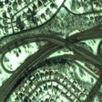

> **[S003]** (p.2)

with meaningful geographical and temporal information, and can consist of multiple spectral bands representing sensor readings besides visible light (i.e., RGB channels typical in natural images). Depending on the data source, satellite imagery can also vary significantly in resolution [32, 33]. While self-supervised learning methods for satellite imagery exist [34, 35], these approaches cannot learn general representations for both temporal and multi-spectral remote sensing data. To address this issue we propose SatMAE, a self-supervised learning framework based on masked autoencoders (MAEs) [1] which naturally handles temporal and multi-spectral input data. We show that introducing a positional encoding for the temporal/spectral dimension and independently masking patches across the temporal/spectral dimension benefits pre-training, allowing the model to learn representations of the data that are more conducive to finetuning. Specifically, our contributions are:

为了解决这一问题，我们提出了 SatMAE，一个基于 masked autoencoders (MAEs) [1] 的自监督学习框架，它自然地处理时序和多光谱输入数据。我们证明，为时序/光谱维度引入位置编码（positional encoding），并在时序/光谱维度上独立地掩码图像块，有利于预训练，使模型能够学习到更适合微调的（more conducive to finetuning）数据表征。具体而言，我们的贡献如下：

---

> **[S004]** (p.2)

1. We propose a novel method to leverage temporal or multi-spectral information in satellite imagery to improve self-supervised pre-training with masked autoencoders (see 4).

1. 我们提出了一种新方法，利用卫星影像中的时序或多光谱信息来改进基于 masked autoencoders 的自监督预训练（见第 4 节）。

---

> **[S005]** (p.2)

2. We introduce fMoW-Sentinel, a new Sentinel-2 dataset cross-referenced with fMoW, as a benchmark for training models on multi-spectral satellite imagery (see 5.1).

2. 我们引入了 fMoW-Sentinel，一个与 fMoW 交叉引用的新 Sentinel-2 数据集，作为训练多光谱卫星影像模型的基准（见第 5.1 节）。

---

> **[S006]** (p.2)

3. We demonstrate the effectiveness of pre-training transformers [36] on satellite imagery, achieving significant improvement over previous state-of-the-art methods on benchmark datasets as well as downstream remote sensing tasks (see 5)

3. 我们证明了在卫星影像上预训练 transformers [36] 的有效性，在基准数据集以及下游遥感任务上均相比之前的最先进方法取得了显著改进（见第 5 节）。

---

## 2    Related Work

> **[S007]** (p.2)

ML for SITS Deep learning has been used for many Satellite Image Time Series (SITS) supervised- learning tasks such as crop-type mapping [29, 28, 37, 38], yield prediction [39, 40], understanding the economy [41, 42, 43, 44], precipitation forcasting [45], and land-cover classification [46, 47, 48, 27]. These works establish the usefulness of tailoring architectures such as LSTMs, self-attention, and transformers to temporal data. However, outside of their specific task, they are often not directly applicable to other remote-sensing datasets.

面向卫星影像时间序列（SITS）的机器学习 深度学习已被广泛用于多种卫星影像时间序列（Satellite Image Time Series, SITS）监督学习任务，例如作物类型制图 [29, 28, 37, 38]、产量预测 [39, 40]、经济理解 [41, 42, 43, 44]、降水预报 [45] 和土地覆盖分类 [46, 47, 48, 27]。这些工作证明了将 LSTM、自注意力（self-attention）和 transformers 等架构针对时序数据进行定制的有效性。然而，除了其特定任务之外，这些方法通常不能直接应用于其他遥感数据集。

---

> **[S008]** (p.2)

SSL for Satellite Imagery Self-supervised learning [2, 3, 4, 5, 6] has emerged as a promising approach in remote sensing domains. For instance, [34] and [35] propose incorporating spatially aligned images over time for contrastive self-supervised learning. Despite promising results, these two contrastive learning approaches rely heavily on the quality of positive pairs, which is often hard to control. [49] combines different sensor channels to generate co-located images that serve as positive pairs. [50, 51, 52] apply off-the-shelf contrastive learning algorithms to satellite images. [52] utilizes image inpainting and transformation prediction as additional pretext tasks. [53] leverages geographical knowledge to aid SSL, which, however, can be difficult to obtain as annotations.

面向卫星影像的自监督学习 自监督学习 [2, 3, 4, 5, 6] 已成为遥感领域中一种有前景的方法。例如，[34] 和 [35] 提出将空间对齐的时序图像纳入对比自监督学习。尽管取得了有前景的结果，但这两种对比学习方法严重依赖于正样本对（positive pairs）的质量，而这往往难以控制。[49] 结合不同的传感器通道来生成共位图像（co-located images）作为正样本对。[50, 51, 52] 将现成的对比学习算法应用于卫星图像。[52] 利用图像修复（image inpainting）和变换预测（transformation prediction）作为额外的代理任务（pretext tasks）。[53] 利用地理知识来辅助自监督学习，然而，这些知识作为标注往往难以获取。

---

## 3     Background

> **[S009]** (p.3)

Positional encoding Positional encoding allows transformers to make their learned representations position-aware. In MAE [1] and in many transformers [57, 58], the positional encoding is: k                                 k Encode(k, 2i) = sin      2i   , Encode(k, 2i + 1) = cos    2i                   (1) Ωd                                 Ωd Here, k is the position, i is the index of feature dimension in the encoding, d is the number of possible positions, and Ω is a large constant (normally set to 10000). In MAE, position is defined as the index of the patch along the x or y axes. Therefore, k ranges from 0 to H/P (or W/P ). The final encoding is generated by concatenating the encodings of the x and y coordinates.

位置编码（Positional encoding）使 transformers 能够让其学习到的表征具备位置感知能力。在 MAE [1] 和许多 transformers [57, 58] 中，位置编码为：Encode(k, 2i) = sin(k / Ω^(2i/d))，Encode(k, 2i + 1) = cos(k / Ω^(2i/d))。此处，k 为位置，i 为编码中特征维度的索引，d 为可能位置的数量，Ω 为一个较大的常数（通常设为 10000）。在 MAE 中，位置定义为沿 x 轴或 y 轴的块（patch）索引。因此，k 的取值范围是 0 到 H/P（或 W/P）。最终的编码通过拼接 x 坐标和 y 坐标的编码来生成。

---

## 4     Method

> **[S010]** (p.3)

In this section, we describe SatMAE with temporal (4.1) and multi-spectral (4.2) satellite images.

在本节中，我们描述面向时序（4.1）和多光谱（4.2）卫星图像的 SatMAE。

---

## 4.1   Temporal SatMAE

> **[S011]** (p.4)

sampled at irregular intervals (iii) the model loses access to temporal fine-grained information in deeper layers, as its only direct exposure to encode temporal information is through the initial patch embedding fp (iv) the model is not temporally-shift invariant (i.e. the model would need to separately learn to detect the same event in two different segments of a temporal sequence). To address these challenges and to avoid losing temporal information, we resize the temporal sequence 2 IT to ST ∈ RLT ×PT P C , where LT = L·(T /PT ) = (H/P )·(W/P )·(T /PT ), PT is the “patch size” in the temporal dimension, and L and P are defined in 3. Prior works using transformers for video data suggest using PT = 2, where each “patch” is a cube of shape 2 × 16 × 16 [54, 59, 60]. Since our data has much shorter temporal sequence lengths [17], we let PT = 1 such that LT = L · T . In order 2 to operate on inputs of any temporal order, we re-use the same patch embedding fp : RP C 7→ RD for each image in the time series, giving us an embedded sequence of tokens ST0 ∈ RLT ×D .

在（ii）中，时间序列以不规则间隔采样；（iii）模型在深层失去了对时序细粒度信息的访问，因为其编码时序信息的唯一直接途径是通过初始的块嵌入 fp；（iv）模型不具备时序平移不变性（temporally-shift invariant）（即模型需要分别学习在时序序列的两个不同段中检测同一事件）。为了解决这些挑战并避免丢失时序信息，我们将时序序列 IT 重塑为 ST ∈ R^(LT × PT·P²·C)，其中 LT = L·(T/PT) = (H/P)·(W/P)·(T/PT)，PT 是时序维度上的“块大小”（patch size），L 和 P 在第 3 节中定义。先前使用 transformers 处理视频数据的工作建议使用 PT = 2，其中每个“块”是一个形状为 2 × 16 × 16 的立方体 [54, 59, 60]。由于我们的数据具有更短的时序序列长度 [17]，我们令 PT = 1，从而 LT = L · T。为了对任意时序顺序的输入进行操作，我们对时间序列中的每张图像重复使用相同的块嵌入 fp : R^(P²·C) → R^D，从而得到一个嵌入的 token 序列 S′_T ∈ R^(LT × D)。

---

## 4.1.1   Temporal Encoding

> **[S012]** (p.4)

For each embedded token in the LT length sequence, we need to ensure the model retains information about its spatial and temporal position. As shown in many prior works [34, 35], the timestamp of a satellite image is useful for many pre-training or downstream vision tasks. We propose a temporal encoding scheme compatible with the masked autoencoder architecture by treating the temporal dimension similarly to the positional dimensions (see 3). The timestamp of a satellite image is represented as “year- month-day-hour-minute-second”. Instead of passing the entire numerized timestamp into a feature encoder, we propose only keeping the useful parts. Intuitively, the day, minute, and second should be unrelated to the visual ap- pearance of a region. Thus, including these components in the temporal encoding may not be beneficial, and can even

对于 LT 长度序列中的每个嵌入 token，我们需要确保模型保留其空间和时间位置的信息。正如许多先前工作所示 [34, 35]，卫星图像的时间戳对许多预训练或下游视觉任务都很有用。我们提出了一种与 masked autoencoder 架构兼容的时序编码方案，将时序维度类似于位置维度进行处理（见第 3 节）。卫星图像的时间戳表示为“年-月-日-时-分-秒”。我们不再将整个数值化的时间戳传入特征编码器，而是仅保留有用的部分。直观上，日、分、秒应与一个区域的视觉外观无关。因此，将这些分量纳入时序编码可能无益，甚至可能引入噪声。

---

> **[F002]** Figure (p.4)

*Figure 2: Top: Encoding each temporal patch be detrimental. In contrast, a landscape may evolve over with a shared patch embedding fp . Bottom: years due to weather, geology, and human activity. The Encoding each spectral patch with a different month reflects season and climate, and the hour reflects patch embedding fpj for each group j.         daylight and temperature. Then, the temporal encoding is formulated as: tk,i = CONCAT[Encode(kyear , i), Encode(kmonth , i), Encode(khour , i)]                 (2) And the final encoding is generated by concatenating the temporal encoding to the positional encoding defined in 3 such that the total length of the encoding is D.*

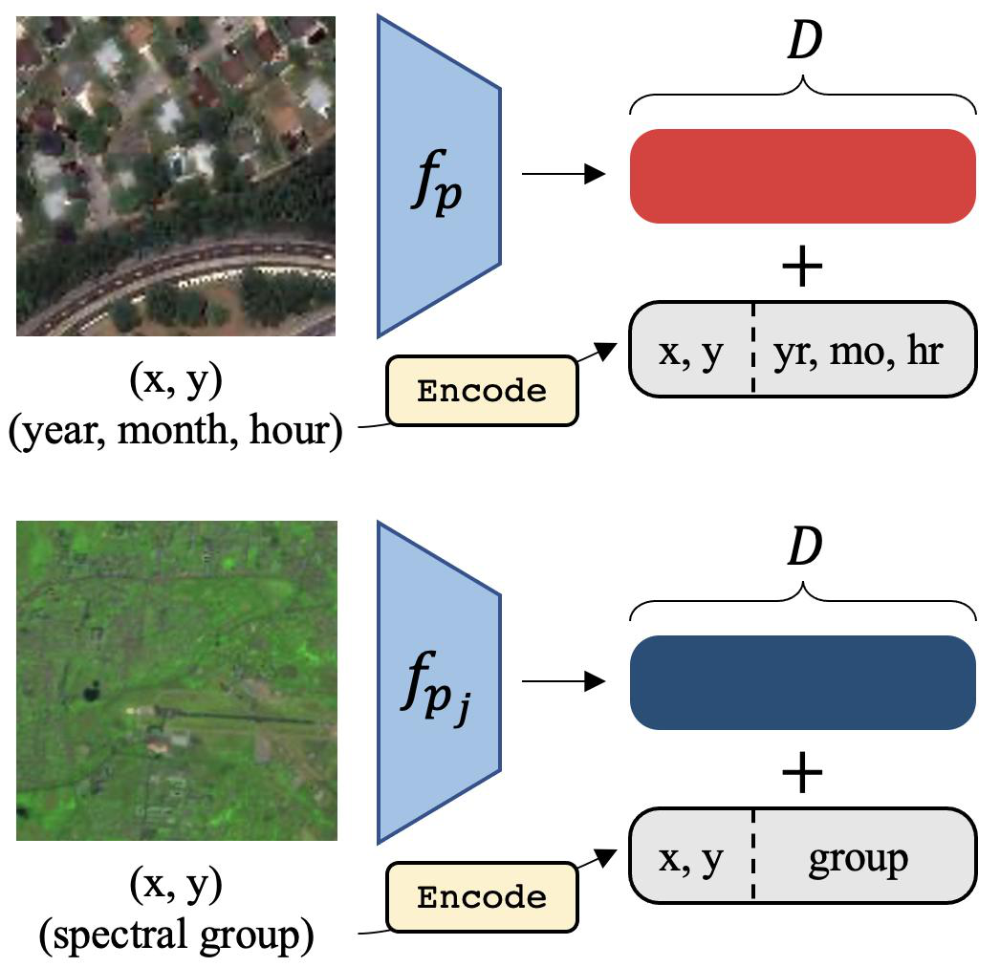

## 4.1.2   Masking Strategies

> **[S013]** (p.4)

With an additional temporal dimension, masking a subset of the LT tokens needs to be treated with care. As seen in figure 3, there are different ways to mask a temporal series of satellite images.

有了额外的时序维度，对 LT token 的子集进行掩码需要谨慎处理。如图 3 所示，掩码时序卫星图像序列有多种方式。

---

> **[S014]** (p.4)

Consistent Masking Each image is “patchified” separately, but the masked regions are consistent across all images (fig. 3a). This approach is also used in VideoMAE [54], with video input.

一致掩码（Consistent Masking）每张图像单独进行“块化”（patchified），但被掩码的区域在所有图像中保持一致（图 3a）。这种方法也在 VideoMAE [54] 中用于视频输入。

---

> **[S015]** (p.4)

Independent Masking Each image is “patchified” separately, and masked regions may not be the same across every image. Instead, a fraction pm of the full sequence of all patch tokens are masked. Another variant is to independently mask the regions of each image, but keep the ratio pm of masked regions fixed per image. Both variants are equivalent in expectation. Effectively, the model may look at unmasked values of a region that is masked in one image but not in others. This setting may lead to an easier task for video data since the model can “cheat” and exploit temporal redundancy in videos with high framerates [54]. However, we argue that this form of “cheating” is less feasible in temporal satellite imagery, given the strong impact of seasonal variation and changing human activity over periods of time and the much larger time deltas between temporally consecutive images (see fig. 3a).

独立掩码（Independent Masking）每张图像单独进行“块化”，且被掩码的区域在不同图像之间可能不同。相反，我们在所有块 token 的完整序列中掩码比例为 pm 的一部分。另一种变体是独立掩码每张图像的区域，但保持每张图像的被掩码区域比例 pm 固定。两种变体在期望上是等价的。实际上，模型可以查看在一个图像中被掩码但在其他图像中未被掩码的区域的未掩码值。对于视频数据，这种设置可能导致更简单的任务，因为模型可以“作弊”并利用高帧率视频中的时序冗余 [54]。然而，我们认为这种“作弊”在时序卫星影像中可行性较低，因为季节性变化和人类活动在较长时间段内的强烈影响，以及时序连续图像之间更大的时间间隔（见图 3a）。

---

> **[F003]** Figure (p.5)

*Figure 3: 3a Temporal masking: For images in a timeseries, we can choose to keep a patch fully visible or fully masked across time (consistent masking), or independently mask all patches (independent masking). In both cases, a fraction pm patches are masked. Here, T = 3, and the leftmost column orders the temporal sequence according to the timestamp features. For example, “y-12, m-12, h-15” is 12 years from the minimum year (2002), the zero-indexed month 2, and the 15th hour of the day; i.e., roughly 2014, March, 15:00. 3b Spectral Masking: The same masking strategies are adapted to groups of the 13 spectral bands in Sentinel-2 images.*

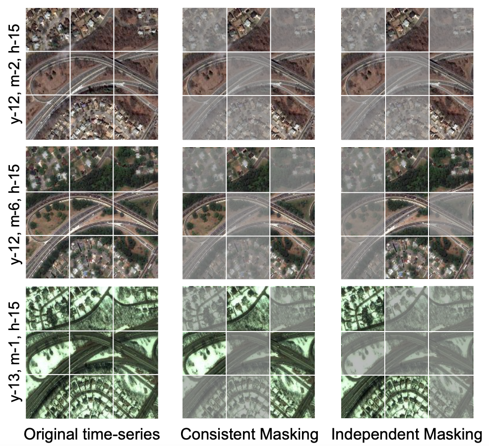

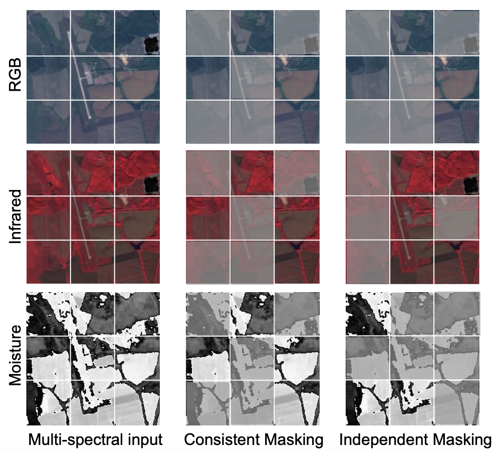

> **[S016]** (p.5)

Independent Masking + Inconsistent Cropping During data pre-processing, we can crop square regions for input inconsistently so that images in the same temporal sequence may be spatially- unaligned. This strategy may help the model learn better representations as it may learn to align images in the sequence across the spatial and temporal dimensions.

独立掩码 + 不一致裁剪（Independent Masking + Inconsistent Cropping）在数据预处理过程中，我们可以不一致地裁剪方形区域作为输入，使得同一时序序列中的图像可能在空间上未对齐。这种策略可能帮助模型学习到更好的表征，因为它可能需要学习在空间和时序维度上对齐序列中的图像。

---

## 4.2   Multi-spectral SatMAE

> **[S017]** (p.5)

While MAE does operate on images I ∈ RC×H×W , usually C = 3 for RGB images. Satellite data, on the other hand, can often have multiple spectral bands. For example, Sentinel-2 imagery has C = 13 bands of 10m, 20m and 60m spatial resolution, each of different wavelengths (see A.2.2). Below, we discuss and later experimentally compare various ways to encode spectral information. 2 Stack Channels The sequence of patches S ∈ RL×P C is embedded to a sequence of tokens S 0 ∈ RL×D , thus treating the multi-band image as is. We denote this method SatMAE+Stack.

虽然 MAE 确实在图像 I ∈ R^(C×H×W) 上操作，通常 C = 3 对应 RGB 图像。另一方面，卫星数据通常具有多个光谱波段。例如，Sentinel-2 影像具有 C = 13 个波段，空间分辨率分别为 10m、20m 和 60m，每个波段对应不同的波长（见 A.2.2）。下面，我们讨论并在实验中比较编码光谱信息的多种方式。堆叠通道（Stack Channels）：块序列 S ∈ R^(L×P²·C) 被嵌入为 token 序列 S′ ∈ R^(L×D)，从而将多波段图像原样处理。我们将此方法记为 SatMAE+Stack。

---

> **[S018]** (p.5)

Group Channels There are limitations to naively stacking the spectral information, especially that a single convolutional patch embedding may be insufficient to fully capture fine-grained information present in multiple bands of different wavelengths and spatial resolution. We would like the model to preserve information about the different bands through the encoding and decoding stages. To address this limitation, we propose grouping subsets of spectral bands. Given C channels, we form G groups g1 , g2 , . . . , gG such that g1 + g2 + · · · + gG = C. This is analogous to slicing the image I in the channel dimension, creating images I1 , . . . , IG , where Ij ∈ Rgj ×H×W . We use a 2 separate patch embedding fpj : RP gj 7→ RD for each group j, thus allowing the model to best represent each possibly different group of channels as token embeddings. Therefore, each group j is 2 first resized from Ij ∈ Rgj ×H×W to Sj ∈ RL×P gj , and then each patch is embedded with fpj to produce a sequence of embedded tokens Sj0 ∈ RL×D . The sequences S10 , . . . , SG   0 are concatenated

分组通道（Group Channels）朴素地堆叠光谱信息存在局限性，尤其是单个卷积块嵌入可能不足以充分捕捉存在于多个不同波长和空间分辨率波段中的细粒度信息。我们希望模型在编码和解码阶段保留关于不同波段的信息。

---

> **[S019]** (p.5)

0     GL×D to produce the final set of tokens S ∈ R           .

[此段包含 LaTeX 数学排版残留，原文为公式推导，描述将分组后的 token 通过线性层映射到维度 D 的过程。]

---

> **[S020]** (p.5)

Spectral Encoding Since the tokens in S 0 correspond to a patch location (m, n) in the input image and a group of channels gj , we include an encoding for the group index kg similar to 4.1.1 gkg ,i = Encode(kg , i)                                          (3) Note that this encoding simply depends on a user-devised channel grouping, and differs from eq. (2) since additional metadata for the imagery, like its date, is not needed. The final encoding is a

光谱编码（Spectral Encoding）由于 S′ 中的 token 对应于输入图像中的一个块位置 (m, n) 和一个通道组 j，我们在编码器中加入了第 j 个组的光谱位置编码 g_(k,i) = Encode(j, i)。然后，我们将空间位置 x_(k,i)、y_(k,i) 与光谱编码 g_(k,i) 拼接，使得总维度为 D（见图 2）。此位置编码在输入到编码器之前被加到 S′ 上。我们将分组通道与分组编码的组合设置记为 SatMAE+Group。掩码策略：我们考虑一致掩码（记为 SatMAE+Group+CM）和独立掩码（SatMAE+Group+IM），如第 4.1.2 节定义及图 3b 所示。

---

> **[S021]** (p.6)

concatenation of the positional xk,i , yk,i and the spectral encoding gk,i such that the total dimension is D (see fig. 2). This positional encoding is added to S 0 before inputting it to the encoder. We denote the combined setting of grouping channels and using a group encoding as SatMAE+Group.

位置编码 x_(k,i)、y_(k,i) 与光谱编码 g_(k,i) 的拼接，使得总维度为 D（见图 2）。此位置编码在输入到编码器之前被加到 S′ 上。我们将分组通道与使用分组编码的组合设置记为 SatMAE+Group。

---

> **[S022]** (p.6)

Masking Strategies We consider consistent masking (denoted SatMAE+Group+CM) and inde- pendent masking (SatMAE+Group+IM) as defined in section 4.1.2 and as visualized in fig. 3b.

掩码策略 我们考虑一致掩码（记为 SatMAE+Group+CM）和独立掩码（SatMAE+Group+IM），如第 4.1.2 节定义及图 3b 所示。

---

## 5     Experiments

> **[S023]** (p.6)

In this section, we first introduce the datasets we considered, including a new multi-spectral remote sensing image dataset for downstream task evaluation (5.1). We then present our results on benchmark datasets (5.2, 5.3, 5.4) and various remote sensing transfer-learning and downstream tasks 5.5. For all experiments, we compare with the current state-of-the-art methods [34, 35] and with supervised learning from scratch using the ViT backbone of SatMAE. In summary, our approach demonstrates strong performance on all the tasks we considered, yielding improvements over previous state-of-the- art techniques by up to 6% on supervised learning benchmarks, and up to 14% on remote sensing transfer-learning downstream remote sensing tasks.

在本节中，我们首先介绍我们考虑的数据集，包括一个用于下游任务评估的新多光谱遥感图像数据集（第 5.1 节）。然后，我们在基准数据集（第 5.2、5.3、5.4 节）以及各种遥感迁移学习和下游任务（第 5.5 节）上展示我们的结果。对于所有实验，我们与当前最先进的方法 [34, 35] 以及使用 SatMAE 的 ViT 主干网络从头开始的监督学习进行比较。总而言之，我们的方法在所有考虑的任务上均表现出强劲的性能，在监督学习基准上相比之前的最先进技术提升高达 6%，在遥感迁移学习下游任务上提升高达 14%。

---

## 5.1   Datasets for Pre-training

> **[S024]** (p.6)

fMoW RGB Functional Map of the World (fMoW) [17] is a dataset of high-resolution satellite image time series across the world, with a task of classification among 62 categories.

fMoW RGB Functional Map of the World (fMoW) [17] 是一个全球高分辨率卫星图像时间序列数据集，任务为 62 个类别的分类。

---

> **[S025]** (p.6)

fMoW Sentinel We create a new dataset based on the fMoW RGB dataset. We collect all 13 frequency bands provided by Sentinel-2 (B1-12 and B8A) for the original fMoW locations, at some of the same times as fMoW images plus some extra times, for a total of 712,874 training images, 84,939 validation images, and 84,966 test images. More details are included in appendix A.1.

fMoW Sentinel 我们基于 fMoW RGB 数据集创建了一个新数据集。我们为原始的 fMoW 位置收集了 Sentinel-2 提供的全部 13 个频率波段（B1-12 和 B8A），时间上与 fMoW 图像部分相同并增加了一些额外时间，共计 712,874 张训练图像、84,939 张验证图像和 84,966 张测试图像。更多细节见附录 A.1。

---

> **[S027]** (p.6)

In this section, we perform experiments on Method        Backbone       Frozen/Finetune         fMoW single image classification task. Fol- Sup.*        ResNet50           -/69.05             lowing [34], we report both the performance of linear probing and finetuning setting. Table Sup.†        ResNet50           -/69.07

> **[S028]** (p.6)

1 shows that compared to the previous state- GASSL [34]     ResNet50         68.32/71.55 of-the-art self-supervised method using a con- Sup.*        ViT-Large          -/62.48             trastive momentum encoding approach [34, 3], Sup.†        ViT-Large          -/75.70             our SatMAE achieved a 6.29% improvement in Sup.‡        ViT-Large          -/76.91             top 1 classification accuracy. Interestingly, with- SatMAE        ViT-Large        65.94/77.84           out SatMAE pre-training the ViT-large model

> **[T001]** Table (p.6)

*Table 1: Top 1 Accuracy on fMoW classification.           could only reach 62.48% at convergence after Frozen: only performing linear classification on frozen   50 epochs of finetuning compared to 69.05% features of the pre-trained model. Finetune: end-to-end   achieved by training a ResNet-50 model from finetuning the whole model. * is training from scratch,   scratch. This is likely because the ViT [36] back- and † is using supervised-learning ImageNet weights,      bone is harder to finetune from scratch than and ‡ is SSL MAE ImageNet weights.                        ResNet50 [61], which makes the pre-trained model more valuable.*

> **[S030]** (p.6)

Main experiments We perform image-sequence classification on the temporal version of fMoW RGB to evaluate our temporal SatMAE. The temporal fMoW consists of co-located image sequences with a length of 3. As seen in table 2, SatMAE surpasses the previous state-of-the-art by 4.48% and improves the non-temporal result by 2.06% in top 1 classification accuracy. We also outperform UTAE [48], a SITS state-of-the-art, by 18%. We can observe from rows 5-8 that this gain is not from the larger model to handle sequences of data. Naively stacking the image sequences in the channel dimension performs even worse than the non-temporal SatMAE. Again, SatMAE pre-training is crucial for ViT to outperform ResNet50. Training details are in appendix A.3.2.

主实验 我们在 fMoW RGB 的时序版本上进行图像序列分类，以评估我们的时序 SatMAE。时序 fMoW 由长度为 3 的共位图像序列组成。如表 2 所示，SatMAE 以 4.48% 的优势超越了之前的最先进水平，并在 Top 1 分类准确率上比非时序结果提升了 2.06%。我们还以 18% 的优势超越了 UTAE [48]，一种 SITS 最先进方法。从第 5-8 行可以看出，这一提升并非来自处理序列数据的更大模型。朴素地将图像序列在通道维度上堆叠甚至不如非时序 SatMAE。同样，SatMAE 预训练对于 ViT 超越 ResNet50 至关重要。训练细节见附录 A.3.2。

---

> **[S031]** (p.7)

Method           Backbone    Top Acc. (1/5) Method          Backbone Top Acc. (1/5)              Sup. Learning*      ResNet152       49.12/75.73 Sup.*          ResNet50          73.24/-            Sup. Learning‡      ResNet152       54.46/78.99 SeCo [35]        ResNet50          66.80/-               MoCo-v3           ViT-Base       50.45/76.37 GASSL [34]         ResNet50          74.11/-          MoCo-v3+Group          ViT-Base       51.33/75.68 SatMAE+Group*         ViT-Large       53.03/77.14 UTAE [48]           U-Net         61.59/86.45 SatMAE+Group†         ViT-Large       51.61/77.26 Sup.*          ViT-Large       61.89/84.23        SatMAE+Group‡         ViT-Large       47.57/72.26 SatMAE+Stack ViT-Large              75.85/88.68        SatMAE+Group§         ViT-Large       49.49/76.30 MAE+Test Aug. ViT-Large              78.90/93.31          SatMAE+Stack        ViT-Large       57.37/81.63 MAEk           ViT-Large       76.78/92.01      SatMAE+Group+IM ViT-Large               59.30/82.81 SatMAE          ViT-Large       81.49/93.26      SatMAE+Group+IM ViT-Large               61.48/85.17

> **[T002]** Table (p.7)

*Table 2: Classification results on the temporal fMoW Table 3: Top 1 & Top 5 Accuracy on the fMoW Sen- RGB dataset. * means finetuning from scratch. k means tinel validation set. The different initializations are: * copying the input image 3 times instead of using tem- from scratch, † MAE ImageNet weights, ‡ supervised poral sequences as input. SatMAE+Stack here means ImageNet weights, § SatMAE fMoW RGB weights. stacking the image sequence along the channel space. Other rows use fMoW Sentinel for pre-training. The last row includes additional data augmentations (5.4).*

> **[S032]** (p.7)

Group    Indp.     Spec. Temp.     Indep.    Cons.    Test                        Back.                                 Top 1 Acc. Top 1 Acc.                   Strat.   Mask.     Enc. Enc.     Mask.     Crop.    Aug. Base        X        X        X          59.11 X        X                   78.07 Large       X        X                   58.87 X                X                   78.45 Large       X                 X          57.76 X       X                            79.90 Large       H        X        X          57.78 X       X         X                  79.69 Large       R        X        X          58.76 X       X         X        X         81.49 Large       X        X        X          59.30

> **[T003]** Table (p.7)

*Table 4: Ablation studies on different components of*

> **[T004]** Table (p.7)

*Table 5: Ablation studies on spectral SatMAE on temporal SatMAE on the temporal fMoW classification fMoW-Sentinel. The first column denotes using ViT- task. The first column is whether using temporal encod- Base or ViT-Large. The second column is the grouping ing, the second is whether using independent masking, strategy (see 5.4). The third column denotes indepen- the third is whether cropping consistently, and the last dent or consistent masking. The last column is whether one is whether applying test-time augmentation. the spectral group encoding 3 is used.*

> **[S033]** (p.7)

Ablation studies Table 4 provides a comprehensive ablation study on the components of temporal SatMAE. We see that improved performance is mainly due to the temporal encoding and adopting independent masking rather than the consistent masking strategy suggested in VideoMAE [54]. Interestingly, consistent cropping slightly decreases performance, indicating that the model does not rely on perfectly spatially-aligned image sequences. In addition, using test-time augmentations similar to [34] is beneficial. Further ablations on mask ratio pm and patch size P are in appendix A.4.

消融研究 表 4 对时序 SatMAE 的各组件进行了全面的消融研究。我们发现性能提升主要归功于时序编码以及采用独立掩码，而非 VideoMAE [54] 建议的一致掩码策略。有趣的是，一致裁剪（consistent cropping）略微降低了性能，表明模型并不依赖于完全空间对齐的图像序列。此外，使用与 [34] 类似的测试时增强（test-time augmentations）是有益的。关于掩码比例 pm 和块大小 P 的进一步消融实验见附录 A.4。

---

> **[S035]** (p.7)

In this section, we pre-train and finetune SatMAE on the image classification task of the fMoW- Sentinel dataset. We pre-train SatMAE+Stack 4.2 and investigate SatMAE+Group+CM 4.1.2 and SatMAE+Group+IM 4.1.2, (see 4.2, 4.2). The full models are then finetuned on the fMoW-Sentinel image classification task. For comparison, we also finetune the ResNet-152 model [61] from scratch and from a supervised ImageNet initialization. We pick the largest model, ResNet-152, for fairer comparison with ViTs. We also include MoCo-v3 [62, 3], a popular SSL method. Given the differences in applying RGB-image augmentations to satellite imagery, we implement two versions: (i) MoCo-v3: we apply all of the same augmentations, except random grayscale and solarize, to create 2 views of the 10-channel image. (ii) MoCo-v3+Group: we split the 10 bands into two groups suggested by [2], and apply augmentations to each to create a positive pair of two 5-channel images.

在本节中，我们在 fMoW-Sentinel 数据集的图像分类任务上对 SatMAE 进行预训练和微调。我们预训练 SatMAE+Stack（第 4.2 节），并研究 SatMAE+Group+CM（第 4.1.2 节）和 SatMAE+Group+IM（第 4.1.2 节）（见第 4.2、4.2 节）。然后，完整的模型在 fMoW-Sentinel 图像分类任务上进行微调。为了比较，我们还从头开始微调 ResNet-152 模型 [61]，以及从监督 ImageNet 初始化开始微调。我们选择了最大的模型 ResNet-152，以便与 ViT 进行更公平的比较。我们还纳入了 MoCo-v3 [62, 3]，一种流行的自监督学习方法。鉴于将 RGB 图像增强应用于卫星影像的差异，我们实现了两个版本：（i）MoCo-v3：我们应用所有相同的增强，除了随机灰度和 solarize，以创建 10 通道图像的 2 个视图。（ii）MoCo-v3+Group：我们将 10 个波段按照 [2] 的建议分成两组，并对每组应用增强，以创建两个 5 通道图像的正样本对。

---

> **[S036]** (p.7)

Model configuration As not all of the 13 Sentinel-2 bands may be useful, in our experiments we drop bands B1, B9 and B10, which correspond to a spatial resolution of 60m. Of the remaining

模型配置 由于并非所有 13 个 Sentinel-2 波段都有用，在我们的实验中，我们丢弃了空间分辨率为 60m 的 B1、B9 和 B10 波段。

---

> **[S037]** (p.7)

10 bands, we form three groups: (i) RGB+NIR: B2, B3, B4, B8 (ii) Red Edge: B5, B6, B7, B8A (iii) SWIR: B11, B12. We choose this grouping to ensure each group has bands of the same spatial resolution and similar wavelength (see A.2.2, A.6). Only the last row of table 3 includes additional data augmentations used during finetuning as in [1]. See A.3.3 for pre-training and finetuning details.

在剩余的 10 个波段中，我们形成了三个组：（i）RGB+NIR：B2、B3、B4、B8（ii）红边（Red Edge）：B5、B6、B7、B8A（iii）短波红外（SWIR）：B11、B12。我们选择这种分组以确保每组中的波段具有相同的空间分辨率和相似的波长（见 A.2.2、A.6）。表 3 的最后一行包含了微调期间使用的额外数据增强，与 [1] 相同。预训练和微调细节见 A.3.3。

---

> **[S038]** (p.8)

Method            Backbone       Top 1 Acc.              Method          Backbone           mIoU Sup. (Scratch)       ResNet50         54.46              Sup. (Scratch)     ResNet50           75.57 GASSL [34]          ResNet50         57.63               GASSL [34]        ResNet50           78.51 Sup. (Scratch)       ViT-Large        69.65              Sup. (Scratch)     ViT-Large          74.71 SatMAE             ViT-Large        71.77                SatMAE           ViT-Large          78.07

> **[T005]** Table (p.8)

*Table 6: NAIP land cover classification results.       Table 7: SpaceNet v1 building segmentation results.*

> **[S039]** (p.8)

Method         Backbone Top 1 Acc.                 Method          Backbone            mAP Sup. (Scratch)     ResNet18         63.21          Sup. (Scratch) ResNet50                 69.49 Sup. (IN init.)    ResNet18         86.44           Sup. (IN init.) ResNet50               80.04 GASSL [34]        ResNet18         89.51            GASSL [34]        ResNet50            80.20 SeCo [35]        ResNet18         93.14             SeCo [35]        ResNet50            82.62 SatMAE*         ViT-Large        95.74          Sup. (Scratch) ViT-Large                80.07 SatMAE          ViT-Large        98.94              SatMAE          ViT-Large           82.13 SatMAE+Group+IM ViT-Large              98.98

> **[T006]** Table (p.8)

*Table 9: BigEarthNet multi-label classification results.*

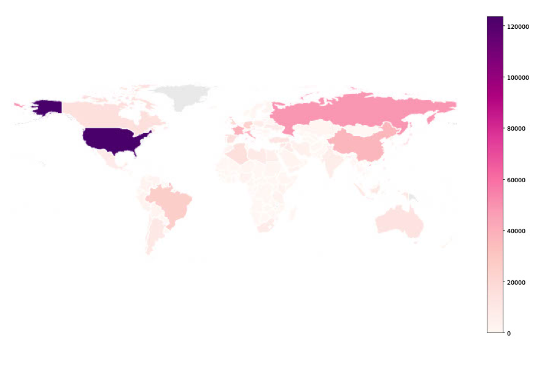

> **[T007]** Table (p.8)

*Table 8: EuroSAT land cover classification results. * Following [35], we use mean Average Precision (mAP) means we only use the RGB channels of the data.       as the metric, and use a newer set of class labels.*

> **[S040]** (p.8)

Results We present results in table 3. Our method SatMAE+Group+IM achieves the highest accu- racy, outperforming supervised training from scratch (↑ 6.27%) and ImageNet-initialized backbones (↑ 4.84%). ImageNet initializations may be less useful than in fMoW-RGB given the larger distri- butional shift to multi-spectral input data. We also note the effectiveness of grouping channels over processing all bands only at the patch embedding level (i.e. SatMAE+Stack).

结果 我们在表 3 中展示了结果。我们的方法 SatMAE+Group+IM 取得了最高的准确率，超越了从头开始的监督训练（↑ 6.27%）和 ImageNet 初始化的主干网络（↑ 4.84%）。鉴于向多光谱输入数据的更大分布偏移，ImageNet 初始化可能不如在 fMoW-RGB 上有用。我们还注意到分组通道的有效性，优于仅在块嵌入级别处理所有波段（即 SatMAE+Stack）。

---

> **[S041]** (p.8)

Ablation Studies We investigate the design of SatMAE for multi-spectral data in table 5. For grouping strategy, we implement alternate band groups to test the hypothesis that grouping bands based on wavelength and resolution is beneficial. X represents the band groups in 5.4. H represents splitting the 10 bands into two halves, {(2,3,4,5,6), (7,8,8A,11,12)}. R represents a random split into three groups {(6,5,11,12), (8A,4,8,3), (7,2)}, reflecting the same group sizes as X. As seen, the choice of band groups does influence performance, yielding a gain of about 0.6%. Moreover, ViT-Base performs strongly, suggesting that SatMAE is the reason for improved performance rather than the number of parameters in ViT. Interestingly, independent masking performs the best, which prompts the model to “peek” at unmasked band groups to reconstruct the same region in a masked band group. We also include further experiments on the length of pre-training (see A.3.3), the impact of mask ratio pm and patch size P (see A.5), and the usefulness of the 13 Sentinel-2 spectral bands (see A.6).

消融研究 我们在表 5 中研究了面向多光谱数据的 SatMAE 设计。对于分组策略，我们实现了交替波段组（alternate band groups），以检验基于波长和分辨率进行波段分组是否有益的假设。X 代表第 5.4 节中的波段组。H 代表将 10 个波段分成两半，{(2,3,4,5,6), (7,8,8A,11,12)}。R 代表随机分成三组 {(6,5,11,12), (8A,4,8,3), (7,2)}，反映与 X 相同的组大小。如表所示，波段组的选择确实会影响性能，带来约 0.6% 的提升。此外，ViT-Base 表现强劲，表明性能提升的原因是 SatMAE 而非 ViT 中的参数量。有趣的是，独立掩码表现最佳，这促使模型通过查看未掩码的波段组来重建被掩码波段组中的同一区域。我们还包含了关于预训练长度的进一步实验（见 A.3.3）、掩码比例 pm 和块大小 P 的影响（见 A.5），以及 13 个 Sentinel-2 光谱波段的用途（见 A.6）。

---

## 5.5   Transfer Learning Experiments

> **[S042]** (p.8)

Now, we finetune our pre-trained SatMAE on downstream tasks on remote-sensing datasets, including land cover classification (5.5), multi-label classification (5.5), and building segmentation (5.5). Finetuning details are included in A.7, A.8, A.9, A.10.

现在，我们在遥感数据集的下游任务上微调我们预训练的 SatMAE，包括土地覆盖分类（第 5.5 节）、多标签分类（第 5.5 节）和建筑物分割（第 5.5 节）。微调细节包含在 A.7、A.8、A.9、A.10 中。

---

> **[S043]** (p.8)

Land Cover Classification We perform transfer learning experiments on land cover classification using the NAIP and EuroSAT [63] dataset. NAIP consists of RGB+CIR images of 66 land cover classes obtained by the USDA’s National Agricultural Imagery Program, which are split into 244,471 training and 55,529 validation images. EuroSAT is a small dataset containing 27,000 13-band satellite images of 10 classes based on Sentinel-2. We follow [35, 64] for the train/val splits on EuroSAT.

土地覆盖分类 我们使用 NAIP 和 EuroSAT [63] 数据集进行土地覆盖分类的迁移学习实验。NAIP 包含 USDA 国家农业影像计划获取的 66 个土地覆盖类别的 RGB+CIR 图像，分为 244,471 张训练图像和 55,529 张验证图像。EuroSAT 是一个小型数据集，包含基于 Sentinel-2 的 10 个类别的 27,000 张 13 波段卫星图像。我们在 EuroSAT 上遵循 [35, 64] 进行训练/验证划分。

---

> **[T008]** Table (p.8)

*Table 6 and table 8 shows the remarkable improvement of our SatMAE over the state-of-the-arts. Although using the ViT-Large backbone already achieved good results, initializing the model with SAT-MAE pre-trained weights further increased the accuracy by 2%-3%.*

> **[S044]** (p.8)

Multi-label Classification We also use the BigEarthNet [18] dataset for multi-label classification, which consists of 13-band Sentinel-2 images of 19 classes in total. There are 354,196 images for training and 118,065 images for validation. Following [35], we use a 10% subset of the train set.

多标签分类 我们还使用 BigEarthNet [18] 数据集进行多标签分类，该数据集总共包含 19 个类别的 13 波段 Sentinel-2 图像。训练集有 354,196 张图像，验证集有 118,065 张图像。遵循 [35]，我们使用训练集的 10% 子集。

---

> **[T009]** Table (p.9)

*Table 9 shows SatMAE pre-training improves upon the model trained from scratch by over 2%, and achieves comparable results to the state-of-the-art. GASSL and SeCo were actually trained on a larger pre-train dataset (1M Sentinel-2 images v.s. 713k) and with all 13 bands than our fMoW Sentinel. Therefore we expect further improvement when we pre-train SatMAE with more data and for longer.*

> **[S045]** (p.9)

Building Segmentation In this section, we evaluate SatMAE on the semantic segmentation down- stream task of the SpaceNet v1 dataset [20]. The SpaceNet v1 dataset consists of 6940 high resolution satellite images with segmentation masks for buildings, which are divided into train and test sets of

建筑物分割 在本节中，我们在 SpaceNet v1 数据集 [20] 的语义分割下游任务上评估 SatMAE。SpaceNet v1 数据集包含 6940 张高分辨率卫星图像及建筑物的分割掩码，分为

---

> **[S046]** (p.9)

5000 and 1940 images, respectively. The results in table 7 show that our method achieves a larger performance gain from supervised learning from scratch compared to [34]. The incompatibility of the ViT backbone with PSANet could explain why the baseline performance is not as strong as that of using a ResNet50 backbone.

5000 张和 1940 张图像的训练集和测试集。表 7 中的结果表明，与 [34] 相比，我们的方法相比从头开始的监督学习获得了更大的性能提升。ViT 主干与 PSANet 的不兼容性可以解释为什么基线性能不如使用 ResNet50 主干时强劲。

---

## 5.6   Visualizing reconstruction quality for SatMAE

> **[F004]** Figure (p.9)

*Figure 4: Reconstruction quality of SatMAE+IM (left) vs. SatMAE+CM (right). Further results in appendix C.*

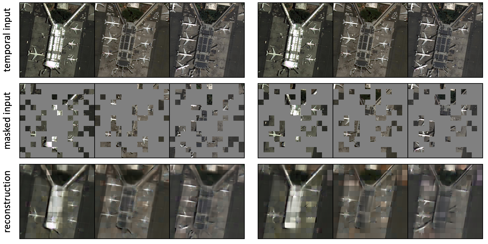

> **[S047]** (p.9)

We show the visualization of the reconstruction quality of two different SatMAE masking strategies in

我们在附录 C 中展示了两种不同 SatMAE 掩码策略的重建质量可视化。

---

> **[F005]** Figure (p.9)

*fig. 4. SatMAE+IM successfully reconstructs all the airplanes even though their number varies across time. In contrast, the SatMAE with Consistent Masking missed some airplanes in the reconstruction.*

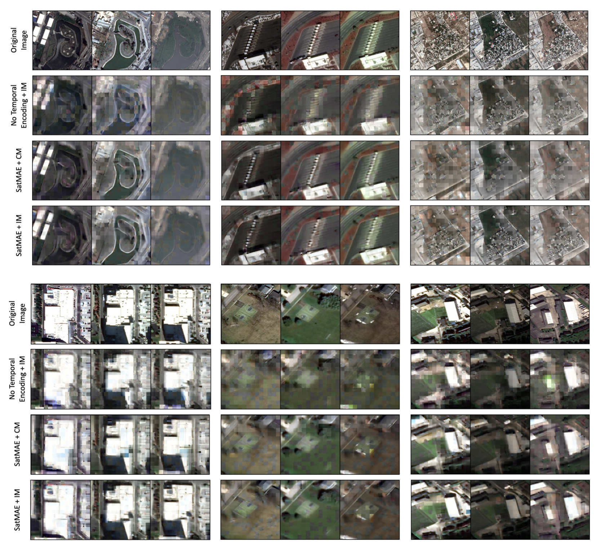

## 6     Conclusion

> **[S048]** (p.9)

In this paper, we propose a new SSL framework based on the MAE architecture [1] tailored to remote- sensing data (satellite imagery). Our novel masking strategy in a joint positional, temporal/spectral space, along with the temporal and spectral encoding, enables our model to handle temporal and multi-spectral satellite images as input and learn useful representations. Experiments on the datasets for pre-training and multiple downstream datasets demonstrate the effectiveness of our pre-trained SatMAE model, outperforming previous state-of-the-art results by large margins. In the future, it would be useful to design more efficient transformer architectures. While SatMAE has a similar number of parameters for both the temporal and multi-spectral setting as a regular ViT, the increased length of token sequences can strain computational resources. Moreover, it is also worth exploring optimal positional encodings for spectral and temporal data, as well as optimal groups of spectral bands, either by neural-based search methods, or using prior knowledge. Lastly, investigating better architectures for object detection and semantic segmentation using ViTs will be important in generalising SatMAE to further downstream tasks.

在本文中，我们提出了一种基于 MAE 架构 [1] 的、专门针对遥感数据（卫星影像）的新型自监督学习（SSL）框架。我们在联合位置、时序/光谱空间中的新颖掩码策略，以及时序和光谱编码，使我们的模型能够处理时序和多光谱卫星图像作为输入，并学习有用的表征。在预训练数据集和多个下游数据集上的实验证明了预训练 SatMAE 模型的有效性，以大幅度优势超越了之前的最先进结果。未来，设计更高效的 transformer 架构将是有用的。虽然 SatMAE 在时序和多光谱设置中的参数量与常规 ViT 相似，但 token 序列长度的增加可能会给计算资源带来压力。此外，探索针对光谱和时序数据的最优位置编码，以及最优光谱波段分组（通过基于神经的搜索方法或利用先验知识）也是值得的。最后，研究使用 ViT 进行目标检测和语义分割的更好架构，对于将 SatMAE 推广到更多下游任务将是重要的。

---

> **[S049]** (p.10)

Broader Impact Accurate measurements of economic, social, and environmental phenomena are key inputs into policy decisions made around the world, but the sparsity of labelled data on many outcomes means that such decisions are often not guided by timely or accurate data. We demonstrate how a pre-training framework could relieve the dependence on labelled data for many downstream tasks that use satellite imagery as input. We hope our SatMAE method will help close the gap between SSL performance on natural imagery and on the more challenging satellite imagery, and prompt further attention from the ML community on the usefulness of SSL in satellite-imagery-related tasks. Better extraction of information from satellite imagery has profound implications for our ability to measure and understand a broad array of social, economic and environmental phenomena that are critical for decision making. Our approach further amplifies the usefulness of the sparse amount of labelled data that exist on key human outcomes, and could enable rapid and accurate extraction of imagery features relevant for critical downstream tasks, including poverty prediction, infrastructure development, and population estimation. Such information could aid governments in more rapid and data-informed decision making and ultimately bring large societal benefits.

广泛影响 对经济、社会和环境现象的准确测量是世界各地政策决策的关键输入，但许多成果的标签数据稀疏性意味着这些决策往往缺乏及时或准确数据的指导。我们展示了预训练框架如何能够缓解对许多使用卫星影像作为输入的下游任务的标签数据依赖。我们希望我们的 SatMAE 方法能够帮助缩小自然影像与更具挑战性的卫星影像上自监督学习性能之间的差距，并促使机器学习社区进一步关注自监督学习在卫星影像相关任务中的有用性。更好地从卫星影像中提取信息，对于我们测量和理解对决策至关重要的一系列社会、经济和环境现象具有深远影响。我们的方法进一步放大了现有稀疏关键人类成果标签数据的有用性，并能够实现与关键下游任务（包括贫困预测、基础设施发展和人口估计）相关的影像特征的快速准确提取。这些信息可以帮助政府做出更迅速、更数据驱动的决策，并最终带来巨大的社会效益。

---

## 7   Acknowledgements

> **[S050]** (p.10)

This research is based upon work supported in part by the Office of the Director of National Intelli- gence (ODNI), Intelligence Advanced Research Projects Activity (IARPA), via 2021-2011000004, HAI, NSF(#1651565), AFOSR (FA95501910024), ARO (W911NF-21-1-0125) and Sloan Fellowship. The views and conclusions contained herein are those of the authors and should not be interpreted as necessarily representing the official policies, either expressed or implied, of ODNI, IARPA, or the U.S. Government. The U.S. Government is authorized to reproduce and distribute reprints for governmental purposes not-withstanding any copyright annotation therein.

本研究部分得到了国家情报总监办公室（ODNI）、情报高级研究计划局（IARPA）通过 2021-2011000004 项目、HAI、NSF(#1651565)、AFOSR (FA95501910024)、ARO (W911NF-21-1-0125) 和 Sloan Fellowship 的支持。本文包含的观点和结论仅代表作者本人，不应被解读为代表 ODNI、IARPA 或美国政府的官方政策，无论是明示还是暗示的。美国政府被授权为政府目的复制和分发重印本，不受其中任何版权注释的影响。

---

## References

> **[S051]** (p.10)

[1] Kaiming He, Xinlei Chen, Saining Xie, Yanghao Li, Piotr Dollár, and Ross Girshick. Masked autoencoders are scalable vision learners. In Proceedings of the IEEE/CVF Conference on Computer Vision and Pattern Recognition, pages 16000–16009, 2022. [2] Yonglong Tian, Dilip Krishnan, and Phillip Isola. Contrastive multiview coding. In European conference on computer vision, pages 776–794. Springer, 2020. [3] Kaiming He, Haoqi Fan, Yuxin Wu, Saining Xie, and Ross Girshick. Momentum contrast for unsupervised visual representation learning. In Proceedings of the IEEE/CVF conference on computer vision and pattern recognition, pages 9729–9738, 2020. [4] Ting Chen, Simon Kornblith, Mohammad Norouzi, and Geoffrey Hinton. A simple framework for contrastive learning of visual representations. In International conference on machine learning, pages 1597–1607. PMLR, 2020. [5] Jean-Bastien Grill, Florian Strub, Florent Altché, Corentin Tallec, Pierre Richemond, Elena Buchatskaya, Carl Doersch, Bernardo Avila Pires, Zhaohan Guo, Mohammad Gheshlaghi Azar, et al. Bootstrap your own latent-a new approach to self-supervised learning. Advances in Neural Information Processing Systems, 33:21271–21284, 2020. [6] Xinlei Chen and Kaiming He. Exploring simple siamese representation learning. In Proceedings of the IEEE/CVF Conference on Computer Vision and Pattern Recognition, pages 15750–15758, 2021. [7] Ashish Jaiswal, Ashwin Ramesh Babu, Mohammad Zaki Zadeh, Debapriya Banerjee, and Fillia Makedon. A survey on contrastive self-supervised learning. CoRR, abs/2011.00362, 2020. [8] Longlong Jing and Yingli Tian. Self-supervised visual feature learning with deep neural net- works: A survey. IEEE transactions on pattern analysis and machine intelligence, 43(11):4037– 4058, 2020. [9] Ishan Misra and Laurens van der Maaten. Self-supervised learning of pretext-invariant rep- resentations. In Proceedings of the IEEE/CVF Conference on Computer Vision and Pattern Recognition, pages 6707–6717, 2020.

> **[S052]** (p.13)

[45] Xingjian Shi, Zhourong Chen, Hao Wang, Dit-Yan Yeung, Wai-Kin Wong, and Wang-chun Woo. Convolutional lstm network: A machine learning approach for precipitation nowcasting. Advances in neural information processing systems, 28, 2015. [46] Andrei Stoian, Vincent Poulain, Jordi Inglada, Victor Poughon, and Dawa Derksen. Land cover maps production with high resolution satellite image time series and convolutional neural networks: Adaptations and limits for operational systems. Remote Sensing, 11(17):1986, 2019. [47] Xin Yang and CP Lo. Using a time series of satellite imagery to detect land use and land cover changes in the atlanta, georgia metropolitan area. International Journal of Remote Sensing, 23(9):1775–1798, 2002. [48] Vivien Sainte Fare Garnot and Loic Landrieu. Panoptic segmentation of satellite image time series with convolutional temporal attention networks. In Proceedings of the IEEE/CVF International Conference on Computer Vision, pages 4872–4881, 2021. [49] Aidan M Swope, Xander H Rudelis, and Kyle T Story. Representation learning for remote sensing: An unsupervised sensor fusion approach. arXiv preprint arXiv:2108.05094, 2021. [50] Vladan Stojnic and Vladimir Risojevic. Self-supervised learning of remote sensing scene representations using contrastive multiview coding. In Proceedings of the IEEE/CVF Conference on Computer Vision and Pattern Recognition, pages 1182–1191, 2021. [51] Pallavi Jain, Bianca Schoen-Phelan, and Robert Ross. Multi-modal self-supervised representa- tion learning for earth observation. In 2021 IEEE International Geoscience and Remote Sensing Symposium IGARSS, pages 3241–3244. IEEE, 2021. [52] Wenyuan Li, Hao Chen, and Zhenwei Shi. Semantic segmentation of remote sensing images with self-supervised multitask representation learning. IEEE Journal of Selected Topics in Applied Earth Observations and Remote Sensing, 14:6438–6450, 2021. [53] Wenyuan Li, Keyan Chen, Hao Chen, and Zhenwei Shi. Geographical knowledge-driven representation learning for remote sensing images. IEEE Transactions on Geoscience and Remote Sensing, 2021. [54] Zhan Tong, Yibing Song, Jue Wang, and Limin Wang. Videomae: Masked autoencoders are data-efficient learners for self-supervised video pre-training. arXiv preprint arXiv:2203.12602, 2022. [55] Hongxu Chen, Sixiao Zhang, and Guandong Xu. Graph masked autoencoder. arXiv preprint arXiv:2202.08391, 2022. [56] Roman Bachmann, David Mizrahi, Andrei Atanov, and Amir Zamir. Multimae: Multi-modal multi-task masked autoencoders. arXiv preprint arXiv:2204.01678, 2022. [57] Ashish Vaswani, Noam Shazeer, Niki Parmar, Jakob Uszkoreit, Llion Jones, Aidan N Gomez, Łukasz Kaiser, and Illia Polosukhin. Attention is all you need. Advances in neural information processing systems, 30, 2017. [58] Hugo Touvron, Matthieu Cord, Matthijs Douze, Francisco Massa, Alexandre Sablayrolles, and Hervé Jégou. Training data-efficient image transformers & distillation through attention. In International Conference on Machine Learning, pages 10347–10357. PMLR, 2021. [59] Anurag Arnab, Mostafa Dehghani, Georg Heigold, Chen Sun, Mario Lučić, and Cordelia Schmid. Vivit: A video vision transformer. In International Conference on Computer Vision (ICCV), 2021. [60] Ze Liu, Jia Ning, Yue Cao, Yixuan Wei, Zheng Zhang, Stephen Lin, and Han Hu. Video swin transformer. arXiv preprint arXiv:2106.13230, 2021. [61] Kaiming He, Xiangyu Zhang, Shaoqing Ren, and Jian Sun. Deep residual learning for image recognition. In Proceedings of the IEEE conference on computer vision and pattern recognition, pages 770–778, 2016. [62] Xinlei Chen*, Saining Xie*, and Kaiming He. An empirical study of training self-supervised vision transformers. arXiv preprint arXiv:2104.02057, 2021. [63] Patrick Helber, Benjamin Bischke, Andreas Dengel, and Damian Borth. Eurosat: A novel dataset and deep learning benchmark for land use and land cover classification. IEEE Journal of Selected Topics in Applied Earth Observations and Remote Sensing, 12(7):2217–2226, 2019.

> **[S053]** (p.14)

[64] Maxim Neumann, Andre Susano Pinto, Xiaohua Zhai, and Neil Houlsby. In-domain representa- tion learning for remote sensing. arXiv preprint arXiv:1911.06721, 2019. [65] Hengshuang Zhao, Yi Zhang, Shu Liu, Jianping Shi, Chen Change Loy, Dahua Lin, and Jiaya Jia. Psanet: Point-wise spatial attention network for scene parsing. In Proceedings of the European conference on computer vision (ECCV), pages 267–283, 2018. [66] Alexandre Lacoste, Alexandra Luccioni, Victor Schmidt, and Thomas Dandres. Quantifying the carbon emissions of machine learning. CoRR, abs/1910.09700, 2019.

## A.1     Datasets

> **[S054]** (p.15)

fMoW RGB Functional Map of the World (fMoW) [17] is a dataset of high-resolution satellite image time series across the world, with a task of classification among 62 architecture categories such as airport, shipyard, and zoo. fMoW provides RGB images as well as metadata including location, time, sun angles, etc. The license is provided here 2 . Co-located images of different timestamps, or sequences, are provided in fMoW. They are of different length, and around 60% of the samples have length larger than 2. Readers can refer to the fMoW paper [17] for statistics on the distribution of sequence lengths. We construct a temporal version of fMoW by randomly associating every single image with two images of the same location but of different timestamps if possible. For a given spatial location loc, we define Tloc as the number of temporally distinct snapshots present in the dataset.

fMoW RGB Functional Map of the World (fMoW) [17] 是一个全球高分辨率卫星图像时间序列数据集，任务为 62 个建筑类别（如机场、造船厂和动物园）的分类。fMoW 提供 RGB 图像以及包括位置、时间、太阳角度等元数据。许可证在此提供。fMoW 提供了不同时间戳的共位图像，即序列。它们的长度各不相同，约 60% 的样本长度大于 2。读者可以参考 fMoW 论文 [17] 了解序列长度分布的统计信息。我们通过将每张单张图像与同一位置但不同时间戳的两张图像随机关联（如果可能）来构建 fMoW 的时序版本。对于给定的空间位置 loc，我们将 Tloc 定义为数据集中存在的时序不同快照的数量。

---

> **[S055]** (p.15)

fMoW Sentinel We collect a new dataset based on the fMoW RGB dataset. We crop surface reflectance images from the Sentinel-2 (ESA) satellite (courtesy of the U.S. Geological Survey), consisting of 90-day composites of images at the same locations as fMoW images (to reduce the impacts of cloud coverage). At each fMoW datapoint location, we collect a time series of Sentinel-2 images, using the provided geo-coordinate bounding boxes. For locations where all fMoW images are before the Sentinel-2 time range, we discard the location. Otherwise, we collect a composite centered at the same time as each fMoW image within Sentinel-2 time range. Because many fMoW images occur before Sentinel-2, we augment the time series by adding extra images in 6-month intervals that do not have an image in the fMoW dataset. We collect all 13 frequency bands provided by Sentinel-2 (B1-12 and B8A), at some of the same times as fMoW images plus some extra times, for a total of 712,874 training images, 84,939 validation images, and 84,966 test images. Out of these 155,446 training images, 22,602 validation images, and 22,824 test images occur at the same time as a corresponding fMoW image. The mean height and width of each image is about 45 pixels and 60 pixels, respectively.

fMoW Sentinel 我们基于 fMoW RGB 数据集收集了一个新数据集。我们从 Sentinel-2（ESA）卫星（由美国地质调查局提供）裁剪地表反射率图像，包含与 fMoW 图像相同位置的 90 天合成图像（以减少云层覆盖的影响）。在每个 fMoW 数据点位置，我们收集 Sentinel-2 图像的时间序列，使用提供的地理坐标边界框。对于所有 fMoW 图像都在 Sentinel-2 时间范围之前的位置，我们丢弃该位置。否则，我们收集以 fMoW 图像在 Sentinel-2 时间范围内的每个时间点为中心的合成图像。由于许多 fMoW 图像发生在 Sentinel-2 之前，我们通过以 6 个月为间隔添加 fMoW 数据集中没有的额外图像来增强时间序列。我们收集了 Sentinel-2 提供的全部 13 个频率波段（B1-12 和 B8A），时间上与 fMoW 图像部分相同并增加了一些额外时间，共计 712,874 张训练图像、84,939 张验证图像和 84,966 张测试图像。其中，155,446 张训练图像、22,602 张验证图像和 22,824 张测试图像与相应的 fMoW 图像同时出现。每张图像的平均高度和宽度分别约为 45 像素和 60 像素。

---

> **[F006]** Figure (p.15)

*Figure 5: Distribution of images and locations across the categories over the fMoW Sentinel training set.*

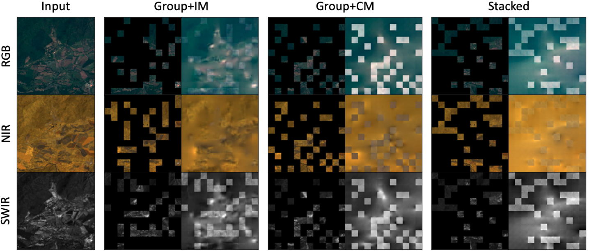

> **[S058]** (p.15)

fMoW license: https://github.com/fMoW/dataset/raw/master/LICENSE 3 Sentinel-2    license:      https://scihub.copernicus.eu/twiki/pub/SciHubWebPortal/ TermsConditions/Sentinel_Data_Terms_and_Conditions.pdf

## A.2.1   Geographic Distribution

> **[F007]** Figure (p.16)

*Figure 6: Geographic distribution of fMoW Sentinel images by country*

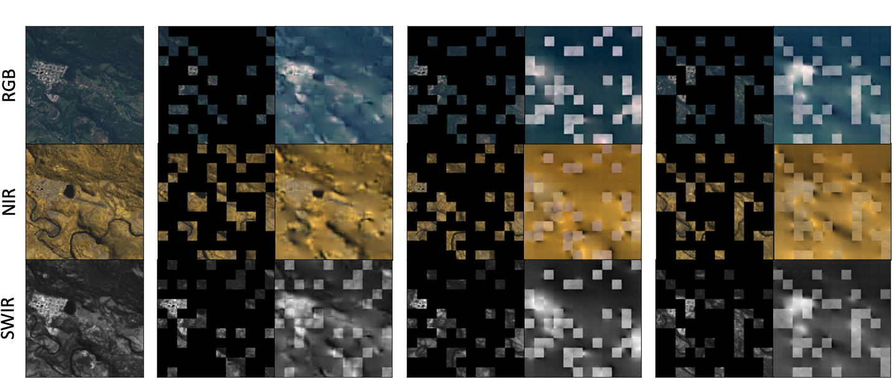

> **[S060]** (p.16)

Channel                Resolution      Central wavelength         Mean       Standard deviation B1: Aerosols             60m                 443nm              1370.192          633.152 B2: Blue                 10m                 490nm              1184.382          650.284 B3: Green                10m                 560nm              1120.771          965.231 B4: Red                  10m                 665nm              1136.260          948.982 B5: Red Edge 1           20m                 705nm              1263.739         1108.067 B6: Red Edge 2           20m                 740nm              1645.403         1258.364 B7: Red Edge 3           20m                 783nm              1846.870         1233.149 B8: NIR                  10m                 842nm              1762.595         1364.387 B8A: Red Edge 4          20m                 865nm              1972.624          3545.66 B9: Water Vapor          60m                 940nm               582.726          472.380 B10: Cirrus              60m                1375nm                14.771           14.311 B11: SWIR 1              20m                1610nm              1732.164         1310.370 B12: SWIR 2              20m                2190nm              1247.919         1087.602

> **[T010]** Table (p.16)

*Table 10: Mean and standard deviation of pixel values for each channel across the fMoW Sentinel training dataset. Note that channel B10 does not contain bottom-of-atmosphere information, and is no longer accessible on Google Earth Engine. Further details can be found here.*

> **[F008]** Figure (p.16)

*Figure 7: Distribution of pixel counts per band across the fMoW Sentinel training set.*

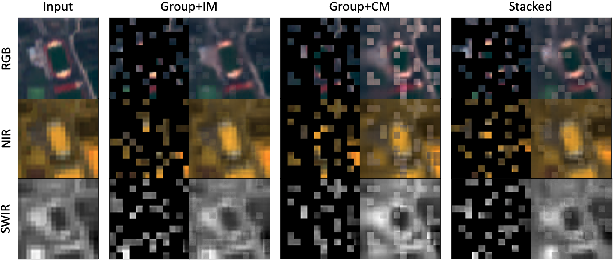

## A.3     Training Details

> **[S061]** (p.17)

Here we describe the settings used for pre-training and finetuning our models on fMoW RGB (non- temporal) (A.3.1), fMoW RGB (temporal) (A.3.2), fMoW Sentinel (A.3.3), NAIP (A.7), EuroSAT (A.8), BigEarthNet (A.9), and SpaceNet v1 (A.10).

在此我们描述在 fMoW RGB（非时序）（A.3.1）、fMoW RGB（时序）（A.3.2）、fMoW Sentinel（A.3.3）、NAIP（A.7）、EuroSAT（A.8）、BigEarthNet（A.9）和 SpaceNet v1（A.10）上预训练和微调模型的设置。

---

> **[S062]** (p.17)

A.3.1    fMoW RGB (non-temporal) SatMAE Pre-training We use ViT-Large [36] as the backbone. The model configuration is the same as in [1], e.g. the input image size is 224 and the patch size is P = 16. Since the original image size of fMoW varies greatly, we first resize the image so that the shorter side is 224 pixels and the aspect ratio is maintained, then randomly crop a 224 × 224 region from the resized image. We also normalize the image according to the mean and standard deviation calculated on the whole dataset. We use 8 NVIDIA V100 GPUs on Google Cloud to train the model for 800 epochs with a learning rate of 2.4 × 10−3 and batch size of 4096. The optimizer and learning rate scheduler are kept the same as in [1].

fMoW RGB（非时序）SatMAE 预训练 我们使用 ViT-Large [36] 作为主干网络。模型配置与 [1] 相同，例如输入图像大小为 224，块大小 P = 16。由于 fMoW 的原始图像大小差异很大，我们首先将图像缩放为短边 224 像素并保持长宽比，然后从缩放后的图像中随机裁剪 224 × 224 区域。我们还根据在整个数据集上计算的均值和标准差对图像进行归一化。我们在 Google Cloud 上使用 8 块 NVIDIA V100 GPU 训练模型 800 个 epoch，学习率为 2.4 × 10⁻³，批量大小为 4096。优化器和学习率调度器与 [1] 保持一致。

---

> **[S063]** (p.17)

SatMAE Finetuning We load the pre-trained weights below the ViT head and finetune the ViT- Large model in an end-to-end manner. We adopt the same learning rate decay and weight decay strategy during finetuning as in [1]. We apply the same data augmentation during pre-training and additionally use Mixup and Cutmix augmentation. We use 8 NVIDIA V100 GPUs to train the model for 50 epochs with a learning rate of 2 × 10−3 and batch size of 512. Other paramters including Mixup coefficients are kept the same as in [1].

SatMAE 微调 我们加载 ViT head 下方的预训练权重，并以端到端方式微调 ViT-Large 模型。在微调期间，我们采用与 [1] 相同的学习率衰减和权重衰减策略。我们在预训练期间应用相同的数据增强，并额外使用 Mixup 和 Cutmix 增强。我们使用 8 块 NVIDIA V100 GPU 训练模型 50 个 epoch，学习率为 2 × 10⁻³，批量大小为 512。其他参数包括 Mixup 系数均与 [1] 保持一致。

---

> **[S064]** (p.17)

A.3.2    fMoW RGB (temporal) Dataset We iterate over the dataset in the same way as in non-temporal fMoW, except that we randomly find 2 co-located images with different timestamps (if possible) for every image sample, so every sample becomes a image sequence of length 3. If there are not enough co-located images with different timestamps we simply duplicate the original image. The fMoW dataset train/val split guarantees that co-located images belong to the same split so there is no leakage involved.

fMoW RGB（时序）数据集 我们以与非时序 fMoW 相同的方式遍历数据集，只是我们随机为每个图像样本找到 2 张不同时间戳的共位图像（如果可能），因此每个样本变为长度为 3 的图像序列。如果没有足够的不同时间戳的共位图像，我们直接复制原始图像。fMoW 数据集的训练/验证划分保证了共位图像属于同一划分，因此不存在数据泄露。

---

> **[S065]** (p.17)

SatMAE Pre-training We use the same model as above, though the number of input patches triples. To incorporate temporal encoding, the positional encoding of a spatial location of a patch shortens to a 320 + 320 = 640 dimensional vector, and the temporal encoding is a 384 dimensional vector, divided equally among the year, month, and hour. We apply constraints on the mask indices to implement different mask strategies. For independent masking (4.1.2), we pick the variant where we keep the ratio of masked patches fixed to pm = 0.75 for each image in the sequence. For the consistent cropping option, we first resize the image sequence to the same size and then apply cropping to all three images instead of randomly cropping each image separately. We use 8 NVIDIA V100 GPUs to train the model for 100 epochs with a learning rate of 6 × 10−4 and batch size of 1024.

SatMAE 预训练 我们使用与上述相同的模型，尽管输入块数量增加了三倍。为了纳入时序编码，块的空间位置的位置编码缩短为 320 + 320 = 640 维向量，而时序编码是一个 384 维向量，在年、月、小时之间平均分配。我们对掩码索引施加约束以实现不同的掩码策略。对于独立掩码（4.1.2），我们选择保持每个图像序列中被掩码块的比例固定为 pm = 0.75 的变体。对于一致裁剪选项，我们首先将图像序列调整为相同大小，然后对所有三张图像应用裁剪，而不是分别随机裁剪每张图像。我们使用 8 块 NVIDIA V100 GPU 训练模型 100 个 epoch，学习率为 6 × 10⁻⁴，批量大小为 1024。

---

> **[S066]** (p.17)

SatMAE Finetuning We use 4 or 8 NVIDIA V100 GPUs to train the model for 50 epochs with a learning rate of 5 × 10−4 and batch size of 128.

SatMAE 微调 我们使用 4 或 8 块 NVIDIA V100 GPU 训练模型 50 个 epoch，学习率为 5 × 10⁻⁴，批量大小为 128。

---

> **[S067]** (p.17)

Test-time Augmentation Unlike the test-time augmentation used in [34], we average the prediction score of 9 random samples of image sequences for every single image as the final prediction score. To be consistent with previous experiments, we calculate the mean classification accuracy on the whole validation set instead of evaluating on the subset with unique locations. These two metrics give very similar numbers.

测试时增强 与 [34] 使用的测试时增强不同，我们对每张单张图像平均 9 个随机图像序列样本的预测分数作为最终预测分数。为了与先前实验保持一致，我们计算整个验证集上的平均分类准确率，而不是在具有唯一位置的子集上进行评估。这两个指标给出的数值非常接近。

---

> **[S068]** (p.17)

SeCo [35] Pre-training and Finetuning We use the code from the official repo of SeCo [35], and use ResNet 50 as the backbone. For pre-training, we use 8 NVIDIA v100 GPUs and a batch size of 128, and keep other hyper-parameters and data augmentation the same as in [35]. We pre-train the model for 50 epochs and observe the loss converged. For finetuning, we use 4 NVIDIA v100 GPUs and a batch size of 128, and also keep other hyper-parameters and data augmentation the same as in [35]. We finetune the model for 100 epochs.

SeCo [35] 预训练和微调 我们使用 SeCo [35] 官方仓库中的代码，并以 ResNet 50 作为主干网络。对于预训练，我们使用 8 块 NVIDIA V100 GPU 和批量大小 128，并保持其他超参数和数据增强与 [35] 相同。我们预训练模型 50 个 epoch 并观察到损失已收敛。对于微调，我们使用 4 块 NVIDIA V100 GPU 和批量大小 128，并保持其他超参数和数据增强与 [35] 相同。我们微调模型 100 个 epoch。

---

> **[S069]** (p.18)

UTAE [48] Training We use the code from the official repo of UTAE [48], add an averaging pooling layer to adapt the segmentation network to classification. We use 8 NVIDIA v100 GPUs, a batch size of 128, learning rate of 5 × 10−4 , and use AdamW optimizer with no weight decay, which we found to be the best performing hyperparameters. We apply data augmentation the same as in SatMAE. We train the model for 50 epochs.

UTAE [48] 训练 我们使用 UTAE [48] 官方仓库中的代码，添加一个平均池化层以使分割网络适应分类任务。我们使用 8 块 NVIDIA V100 GPU，批量大小为 128，学习率为 5 × 10⁻⁴，并使用 AdamW 优化器且不使用权重衰减，我们发现这是性能最佳的超参数。我们应用与 SatMAE 相同的数据增强。我们训练模型 50 个 epoch。

---

> **[S070]** (p.18)

A.3.3    fMoW Sentinel We choose the ViT-Large backbone [36] with D = 1024. The positional encoding of the spatial location of a patch is a 768 dimensional vector, and the spectral group encoding is a 256 dimensional vector. Given the relatively smaller size of Sentinel-2 imagery, we resize all images to 96 × 96 pixels and use a patch size P = 8. This results in L = (96/8)2 = 144 patches which are passed to SatMAE+Stack. For SatMAE+Group, since we pick 3 groups of channels, we have 3L = 432 patches. We did experiment with letting each channel be its own group. However, this resulted in a very large memory footprint with 10L = 1440 patches and unstable training which would frequently result in NaN loss. We thus decided to group bands in terms of spatial resolution and wavelength similarity (see 5.4). We train and finetune on the entire training set.

fMoW Sentinel 我们选择 ViT-Large 主干网络 [36]，D = 1024。块的空间位置的位置编码是一个 768 维向量，光谱组编码是一个 256 维向量。鉴于 Sentinel-2 影像相对较小，我们将所有图像调整为 96 × 96 像素并使用块大小 P = 8。这产生 L = (96/8)² = 144 个块，传递给 SatMAE+Stack。对于 SatMAE+Group，由于我们选择 3 个通道组，我们有 3L = 432 个块。我们确实尝试过让每个通道成为独立的组。然而，这导致内存占用非常大，有 10L = 1440 个块，并且训练不稳定，经常出现 NaN 损失。因此我们决定按照空间分辨率和波长相似性对波段进行分组（见第 5.4 节）。我们在整个训练集上进行训练和微调。

---

> **[S071]** (p.18)

SatMAE Pre-training We use 8 NVIDIA v100 GPUs, an effective batch size of 4096, a base learning rate of 10−4 and the same warmup and half-cyle cosine decay schedule used by [1]. For each image, we use standard normalisation (see statistics in A.2.2), randomly crop 0.2-1.0× of the area of the image, resize it to 96 × 96 pixels, and randomly flip the image horizontally. We use a masking ratio of pm = 0.75, as was found to be optimal in [1]. We pre-train each model for 50 epochs.

SatMAE 预训练 我们使用 8 块 NVIDIA V100 GPU，有效批量大小为 4096，基础学习率为 10⁻⁴，并使用与 [1] 相同的预热（warmup）和半周期余弦衰减（half-cycle cosine decay）调度。对于每张图像，我们使用标准归一化（见 A.2.2 中的统计信息），随机裁剪图像面积的 0.2-1.0 倍，将其调整为 96 × 96 像素，并随机水平翻转图像。我们使用掩码比例 pm = 0.75，这被 [1] 发现是最优的。我们预训练每个模型 50 个 epoch。

---

> **[S072]** (p.18)

MoCo Pre-training We use 8 NVIDIA v100 GPUs, and pick the ViT-Base backbone and an effective batch size of 512 such that the model fits in memory. We pick a base learning rate of 10−4 and the same warmup and decay schedule used by [62]. For each image, we use standard normalisation (see statistics in A.2.2), randomly crop 0.2-1.0x of the area of the image, resize it to 96 × 96 pixels, randomly apply Gaussian blur with σ ∈ [0.1, 2], and randomly flip the image horizontally. We pre-train each model for 50 epochs and use the 50th epoch checkpoint for all subsequent experiments.

MoCo 预训练 我们使用 8 块 NVIDIA V100 GPU，选择 ViT-Base 主干网络和有效批量大小 512，以使模型能够装入内存。我们选择基础学习率为 10⁻⁴，并使用与 [62] 相同的预热和衰减调度。对于每张图像，我们使用标准归一化（见 A.2.2 中的统计信息），随机裁剪图像面积的 0.2-1.0 倍，将其调整为 96 × 96 像素，随机应用高斯模糊，σ ∈ [0.1, 2]，并随机水平翻转图像。我们预训练每个模型 50 个 epoch，并对所有后续实验使用第 50 个 epoch 的检查点。

---

> **[S073]** (p.18)

SatMAE Finetuning We use 8 NVIDIA v100 GPUs, an effective batch size of 4096, a base learning rate of 10−3 and a warmup and decay schedule. We use standard normalisation, and resize each image to 96 × 96 pixels.

SatMAE 微调 我们使用 8 块 NVIDIA V100 GPU，有效批量大小为 4096，基础学习率为 10⁻³，以及预热和衰减调度。我们使用标准归一化，并将每张图像调整为 96 × 96 像素。

---

> **[S074]** (p.18)

SatMAE Further Improvements We found increased performance of around 2.18% during fine- tuning (the last row of table 3) using additional data augmentations as in [1]. This configuration is the same as SatMAE+Group+IM except for an effective batch size of 1024, weight decay of 0.05, drop path of 0.1, reprob of 0.25, mixup of 0.8 and cutmix of 1.0. For all rows, we finetune for 30 epochs, but report results on the best validation set Top 1 accuracy achieved. In table 11, we also report results with increased Backbone Pre-train epochs Top 1 Acc.            pre-training. Training SatMAE for 200 epochs, as ViT-B             200              62.65       opposed to 50, yields further improvements in the final top 1 accuracy after finetuning for 30 epochs ViT-L              50              61.48 using the configuration described above. We see ViT-L             200              63.84 that a smaller model, using a ViT-Base backbone,

SatMAE 进一步改进 我们发现在微调期间使用与 [1] 相同的额外数据增强时，性能提升了约 2.18%（表 3 的最后一行）。此配置与 SatMAE+Group+IM 相同，除了有效批量大小为 1024、权重衰减为 0.05、drop path 为 0.1、reprob 为 0.25、mixup 为 0.8 和 cutmix 为 1.0。对于所有行，我们微调 30 个 epoch，但报告在验证集上达到的最佳 Top 1 准确率。在表 11 中，我们还报告了增加预训练轮数的结果。将 SatMAE 预训练 200 个 epoch（而非 50 个），在使用上述配置微调 30 个 epoch 后，最终 Top 1 准确率有进一步提升。我们发现，使用 ViT-Base 主干网络的较小模型，预训练 200 个 epoch 后 Top 1 准确率达到 62.65%，而 ViT-Large 预训练 50 个 epoch 达到 61.48%，预训练 200 个 epoch 达到 63.84%。

---

> **[T011]** Table (p.18)

*Table 11: Improvements with longer pre-training. can outperform a model using a ViT-Large back- bone with longer pre-training. We hypothesize that longer pre-training can prove to be even more beneficial.*

## A.4     Impact of masking ratio and patch size on fMoW-RGB-temporal

> **[S075]** (p.18)

Here, we investigate the impact of the masking ratio and patch size for a ViT-Large SatMAE on temporal data (with independent masking and consistent cropping, and without the test time augmentation). We vary the masking ratio pm to 0.6 and 0.9 from a default of pm = 0.75 and the patch size P to 22,

在此，我们研究掩码比例和块大小对时序数据（使用独立掩码和一致裁剪，不使用测试时增强）上 ViT-Large SatMAE 的影响。我们将掩码比例 pm 从默认值 0.75 变为 0.6 和 0.9，并将块大小 P 从默认值 16 变为 22 和 32（见表 12）。

---

> **[S077]** (p.19)

pm      P     Top 1 Acc.        We see a significant drop in performance of 7.19% with a smaller 0.6    16      72.80           masking ratio as expected [1], since a lower masking ratio makes it 0.9    16      74.78           easier for the model to reconstruct masked patches as it has access 0.75    32      69.31           to more visible patches. A higher masking ratio of 0.9 may result in 0.75    22      72.08           a difficult pretext task, as too few of the patches in the image remain visible, which may require longer training. Thus, we find that using 0.75    16      79.69 pm = 0.75 is roughly optimal.

> **[T012]** Table (p.19)

*Table 12: Ablation on pm and P    We also note a drop in performance from using a larger patch size, on fMoW-RGB-temporal. as the model has access to less granular spatial information from the image. This is in line with other MAE works [1, 54]. However, using a larger patch size is also more computationally efficient, so one must consider the tradeoff in accuracy and computational resources.*

## A.5   Impact of masking ratio and patch size on fMoW-Sentinel

> **[S078]** (p.19)

In this section, we investigate the impact of the masking ratio pm pm      P     Top 1 Acc.        and the patch size P (table 13) for SatMAE on multi-spectral data. 0.6     8      50.68           We use a ViT-Large backbone and the SatMAE+Group+IM setting as this was our best performing design. 0.9     8      59.28 0.75    16      55.02       As we expect, a lower masking ratio results in a weak pretext task, as 0.75     8      59.30        the model is able to easily reconstruct the image given more visible patches, and thus its representations are not as useful. Interestingly,

> **[T013]** Table (p.19)

*Table 13: Ablation on pm and P pm = 0.9 doesn’t result in a large drop in performance, unlike [1]. on fMoW-Sentinel.              This suggests that higher masking ratios may be used for multi- spectral data with independent masking, as it results in fewer tokens during the encoding state which could quicken pre-training. We see that a larger patch size results in worse performance. This is expected, as a larger patch size provides less granular spatial information to the deeper layers of the model, which may dampen its expressive power. As mentioned above, the loss in accuracy must be considered compared against the gain in training speed. A future direction of research could consider the specific gain in speed and drop in accuracy from granular increases to the patch size for further insight.*

## A.6   Choosing important multi-spectral bands

> **[S079]** (p.19)

As mentioned in 5.4, all 13 bands of the Sentinel-2 data may not be useful. In our experiments, we drop bands B1, B9, and B10. To correctly identify the utility of each band, one would need to pre-train a model with all bands except the one in question, and then measure the performance after finetuning without that band. However, this is prohibitively expensive in terms of computational resources. Instead, we pre-trained a SatMAE+Stack model with a ViT Base backbone on all 13 Sentinel-2 bands of fMoW Sentinel, and then finetuned the model on the image classification task of fMoW Sentinel using all 13 bands. Using the finetuned model, we ran an ablation masking out subsets of bands with the mean value for those bands and measuring the drop in validation set accuracy. Since the model was trained to rely on information of all 13 bands, a small drop in accuracy from masking out some bands indicates that these bands might not be very useful for the model to perform well.

如第 5.4 节所述，Sentinel-2 数据的全部 13 个波段可能并非都有用。在我们的实验中，我们丢弃了 B1、B9 和 B10 波段。为了正确识别每个波段的用途，需要预训练一个除待测波段外包含所有波段的模型，然后在微调时排除该波段并测量性能。然而，这在计算资源方面过于昂贵。相反，我们使用 ViT Base 主干网络在 fMoW Sentinel 的全部 13 个 Sentinel-2 波段上预训练了一个 SatMAE+Stack 模型，然后使用全部 13 个波段在 fMoW Sentinel 的图像分类任务上微调该模型。使用微调后的模型，我们通过用这些波段的均值掩码掉部分波段子集并测量验证集准确率的下降来进行消融实验。由于模型被训练为依赖全部 13 个波段的信息，掩码掉某些波段后准确率下降很小，表明这些波段对模型取得良好性能可能不是很有用。

---

> **[S080]** (p.19)

Bands Masked        Top 1 Acc.     Top 5 Acc. None              57.80          80.07 B1               45.83          69.46 B2, B3, B4           17.46          35.05 B5, B6, B7           13.25          35.33 B8, B8A             16.03          35.36 B9, B10             55.06          78.15 B11, B12            27.83          54.41

> **[T014]** Table (p.19)

*Table 14: An ablation to determine which of the 13 bands are least useful to a SatMAE+Stack model pre-trained and finetuned on all 13 bands of fMoW Sentinel. During evaluation, for each image, the relevant bands are masked with their mean value recorded in table 10 and then passed as is to the finetuned SatMAE+Stack model.*

> **[S081]** (p.20)

As seen in table 14, we notice the smallest drop in accuracy when masking bands B9 and B10. The drop in accuracy when masking B1 is larger, but could be due to the model relying on potentially unimportant signals from B1 during finetuning. We therefore also drop B1 in our experiments in section 5.4. We note that the RGB and other multi-spectral bands are highly relevant to our model.

如表 14 所示，我们注意到掩码 B9 和 B10 波段时准确率下降最小。掩码 B1 时准确率下降较大，但可能是由于模型在微调期间依赖了 B1 中潜在不重要的信号。因此，我们在第 5.4 节的实验中也丢弃了 B1。我们注意到 RGB 和其他多光谱波段与我们的模型高度相关。

---

## A.7    NAIP Land Cover Classification

> **[S082]** (p.20)

We use the finetuning setting as in the fMoW RGB (non-temporal) finetuning experiment (A.3.1).

我们使用与 fMoW RGB（非时序）微调实验（A.3.1）相同的微调设置。

---

## A.8    EuroSAT Land Cover Classification

> **[S083]** (p.20)

We use the exact finetuning setting as in the fMoW RGB (non-temporal) finetuning experiment for RGB-only input (A.3.1). We also use the exact finetuning setting as in the fMoW-Sentinel finetuning experiment (A.3.3) except for training longer (150 epochs) for multi-spectral (13-band) input. It took the model longer to converge most probably because EuroSAT is comparatively a much smaller dataset. The license4 is provided in the footnote.

对于仅 RGB 输入，我们使用与 fMoW RGB（非时序）微调实验（A.3.1）完全相同的微调设置。对于多光谱（13 波段）输入，我们也使用与 fMoW-Sentinel 微调实验（A.3.3）完全相同的微调设置，只是训练时间更长（150 个 epoch）。模型收敛需要更长时间，很可能是因为 EuroSAT 是一个相对小得多的数据集。许可证在脚注中提供。

---

## A.9    BigEarthNet Land Cover Multi-label Classification

> **[S084]** (p.20)

We use the exact finetuning setting as in the fMoW-Sentinel finetuning experiment (A.3.3). Since the task is multi-label classification instead of single-label classification, we changed the training objective to multi-label soft margin loss. We use the mean Average Precision metric as provided in [35].The license 5 is provided in the footnote.

我们使用与 fMoW-Sentinel 微调实验（A.3.3）完全相同的微调设置。由于任务是多标签分类而非单标签分类，我们将训练目标更改为多标签软边界损失（multi-label soft margin loss）。我们使用 [35] 中提供的平均精度均值（mean Average Precision）指标。许可证在脚注中提供。

---

> **[S086]** (p.20)

We use PSANet [65] for the binary image segmentation and replace the backbone with ViT-Large. Following [34], we set the learning rate to 1 × 10−3 for ViT encoder and to 1 × 10−2 for ViT head and PSA module. We train the model for 100 epochs with batch size 128 using an SGD optimizer of momentum 0.9 and weight decay 1 × 10−4 and a polynomial learning rate decay scheduler of power 0.9. Also following [34], we resize and crop the input image to 400 × 400 for fair comparison. This indicates our model will take more patches per image (625). We use the positional encoding interpolation algorithm provided by [1] to adjust the pre-trained weights. The license6 is provided in the footnote.

我们使用 PSANet [65] 进行二值图像分割，并将主干网络替换为 ViT-Large。遵循 [34]，我们将 ViT 编码器的学习率设为 1 × 10⁻³，ViT head 和 PSA 模块的学习率设为 1 × 10⁻²。我们使用批量大小 128 训练模型 100 个 epoch，使用动量为 0.9、权重衰减为 1 × 10⁻⁴ 的 SGD 优化器，以及幂为 0.9 的多项式学习率衰减调度器。同样遵循 [34]，我们将输入图像调整并裁剪为 400 × 400 以进行公平比较。这意味着我们的模型将处理每张图像更多的块（625 个）。我们使用 [1] 提供的位置编码插值算法来调整预训练权重。许可证在脚注中提供。

---

> **[S087]** (p.20)

EuroSAT license: https://creativecommons.org/licenses/by/4.0/ 5 BigEarthNet license: https://bigearth.net/downloads/documents/License.pdf 6 SpaceNet v1 license: http://creativecommons.org/licenses/by-sa/4.0/

> **[S088]** (p.21)

B     Societal Impact Measurements of economic, social, and environmental indicators are critical to policy-making across the world. However, such measurements are constantly lacking, hindering the process of decision making. Instead of using traditional measurements (e.g. ground survey), our method exploits abun- dant, globally-available and frequently-updated unlabelled satellite data. Our model is capable of capturing representations from remote sensing imagery that are beneficial for critical downstream tasks, including poverty prediction, infrastructure development, and population estimation. Gov- ernments could make good use of such information in decision making and consequently bring significant societal benefits. Although the use of satellite imagery could potentially lead to data abuse and privacy violations from malicious actors, we contend that applications of our model trained on publicly available satellite imagery respects privacy and avoids exposing sensitive information. For example, individually identifiable information cannot easily be retrieved from these images. Thus, we believe that the imagery we used does not directly constitute a privacy concern. However, we note that representations learned from SatMAE could potentially suffer from biases if the training data is biased. For instance, SatMAE trained on geographically imbalanced data could bias the model towards certain regions, especially those in Northern America and Europe (see 6). Thus, we advise researchers to be aware of directly applying our SatMAE models to datasets with a geographical distribution different to that of fMoW RGB and fMoW Sentinel. In our code release, we will also specify allowable uses with appropriate licenses.

社会影响 经济、社会和环境指标的测量对全球政策制定至关重要。然而，这类测量数据长期缺乏，阻碍了决策过程。我们的方法不是使用传统测量方法（如地面调查），而是利用丰富、全球可用且频繁更新的未标注卫星数据。我们的模型能够从遥感影像中捕捉表征，这些表征对关键下游任务有益，包括贫困预测、基础设施发展和人口估计。政府可以充分利用这些信息进行决策，从而带来巨大的社会效益。尽管使用卫星影像可能导致恶意行为者的数据滥用和隐私侵犯，但我们认为，在公开可用的卫星影像上训练的模型的应用尊重隐私并避免暴露敏感信息。例如，个体可识别信息无法轻易从这些图像中检索到。因此，我们认为我们使用的影像本身并不直接构成隐私问题。然而，我们注意到，如果训练数据存在偏差，SatMAE 学习到的表征可能会受到偏差影响。例如，在地理分布不平衡的数据上训练的 SatMAE 可能会使模型偏向某些地区，尤其是北美和欧洲（见第 6 节）。因此，我们建议研究人员注意直接将我们的 SatMAE 模型应用于与 fMoW RGB 和 fMoW Sentinel 地理分布不同的数据集。在我们的代码发布中，我们还将通过适当的许可证指定允许的使用方式。

---

## B.1   Carbon Footprint

> **[S089]** (p.21)

We include a brief analysis of the carbon footprint of training the model below. Our experiments were mainly conducted using Google Cloud Platform (GCP) in region us-central1, which has a carbon efficiency of 0.57 kg CO2 eq. per kWh. For a model pre-trained and finetuned on fMoW RGB (temporal) dataset, a cumulative of 960 hours of computation was required on hardware of type Tesla V100-SXM2-16GB (TDP of 250W). Total emissions are estimated to be 136.8 kg CO2 eq. of which 100 percent was directly offset by the cloud provider. Estimations were conducted using the Machine Learning Impact calculator presented in [66]. For a model pre-trained and finetuned on fMoW Sentinel dataset, total emissions are estimated to be 109.44 kg CO2 eq. We list a table for the rough estimations in table 15.

我们在下面包含了对训练模型碳足迹的简要分析。我们的实验主要在 Google Cloud Platform (GCP) 的 us-central1 区域进行，其碳效率为每千瓦时 0.57 千克 CO2 当量。对于在 fMoW RGB（时序）数据集上预训练和微调的模型，在 Tesla V100-SXM2-16GB 硬件（TDP 250W）上累计需要 960 小时的计算。总排放量估计为 136.8 千克 CO2 当量，其中 100% 由云提供商直接抵消。估算使用 [66] 中提出的机器学习影响计算器进行。对于在 fMoW Sentinel 数据集上预训练和微调的模型，总排放量估计为 109.44 千克 CO2 当量。我们在表 15 中列出了粗略估算表。

---

> **[S090]** (p.21)

Experiment                                               Carbon Footprint Dataset            GPU hours Setting                                                 (kg CO2 eq.) Pre-training    fMoW RGB temporal             768            109.44 Finetuning      fMoW RGB temporal             192             27.36 Pre-training      fMoW Sentinel               576             82.08 Finetuning        fMoW Sentinel               192             27.36 Finetuning            NAIP                     30              4.27 Finetuning          EuroSAT                     4              0.57 Finetuning          SpaceNet                   50              7.12 Finetuning         BigEarthNet                 16              2.28

> **[T015]** Table (p.21)

*Table 15: The estimated carbon footprint of pre-training and finetuning SatMAE on these datasets. The GPU hours are measured on 8 NVIDIA v100 GPUs in the us-central1 region on GCP.*

> **[S091]** (p.22)

C     Visualizations In this section, we include visualisations in the temporal (C.1) and multi-spectral settings (C.2).

## C.1   Temporal SatMAE

> **[F009]** Figure (p.22)

*Figure 8: More visualization examples of the reconstruction quality of image sequences from the fMoW temporal dataset across multiple settings, including using no temporal encoding + IM (Independent Masking), default + CM, default + IM.*

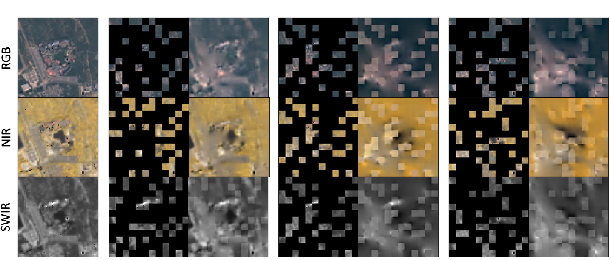

> **[S092]** (p.22)

As shown in fig. 8, SatMAE+IM achieved relatively satisfying reconstruction quality. Without the temporal encoding, the patches across all three images cannot be distinguished, and we observe a mixture of the three images in the reconstruction outcome of the second column. As explained earlier, using independent masking can allow SatMAE to reconstruct an image in the time series using information from other temporal patches. Our experiments show that this helps SatMAE learn better representations for satellite imagery.

如图 8 所示，SatMAE+IM 取得了相对令人满意的重建质量。没有时序编码时，所有三张图像中的块无法区分，我们在第二列的重建结果中观察到三张图像的混合。如前所述，使用独立掩码可以使 SatMAE 利用其他时序块的信息来重建时间序列中的某张图像。我们的实验表明，这有助于 SatMAE 学习更好的卫星影像表征。

---

## C.2   Spectral SatMAE

> **[S093]** (p.22)

We also visualize the in-painting quality for different multi-spectral settings, including Sat- MAE+Group+IM, SatMAE+Group+CM (4.2, 4.2), and SatMAE+Stack (4.2) in fig. 9 and fig. 10. We can see a clear improvement in the quality of reconstruction under SatMAE+Group+IM compared to SatMAE+Group+CM and SatMAE+Stack. Independent masking results in sharper reconstructions, whereas the results from consistent masking and stacking the channels are much fuzzier. We also

我们还可视化了不同多光谱设置下的修复（in-painting）质量，包括图 9 和图 10 中的 SatMAE+Group+IM、SatMAE+Group+CM（4.2, 4.2）和 SatMAE+Stack（4.2）。我们可以看到，与 SatMAE+Group+CM 和 SatMAE+Stack 相比，SatMAE+Group+IM 的重建质量有明显提升。独立掩码产生了更清晰的重建结果，而一致掩码和通道堆叠的结果则模糊得多。我们还

---

> **[F010]** Figure (p.23)

*Figure 9: Visualizations of SatMAE in-painting under different settings. RGB represents bands B4, B3, B2, from group B2, B3, B4, B8. NIR represents bands B7, B6, B5, from group B5, B6, B7, B8A. SWIR represents bands B11 in grayscale, from group B11, B12. For each method, we show the input band group masked and reconstructed side-by-side. We note that the reconstruction for visible patches is worse than for the masked patches, since no loss is computed on visible patches. Both halves represent multi-spectral images of airports.*

> **[S094]** (p.23)

note that the model is able to learn correlations between bands; in the top-half of fig. 9 for the SWIR band group, even though the bottom right corner of the image is masked, SatMAE+Group+IM is able to reconstruct the bright spot based on information from the other band groups. We hypothesize that further improvements in reconstruction quality and learned representations can be achieved with longer pre-training.

注意到模型能够学习波段之间的相关性；在图 9 的上半部分，对于 SWIR 波段组，尽管图像右下角被掩码，SatMAE+Group+IM 能够基于其他波段组的信息重建出亮斑。我们假设，通过更长的预训练，可以进一步改善重建质量和学习到的表征。

---

> **[F011]** Figure (p.24)

*Figure 10: Further visualizations of SatMAE in-painting. See fig. 9 for details on band groups. The top half represents a multi-spectral image of a recreational facility and the bottom half is of an amusement park.*

