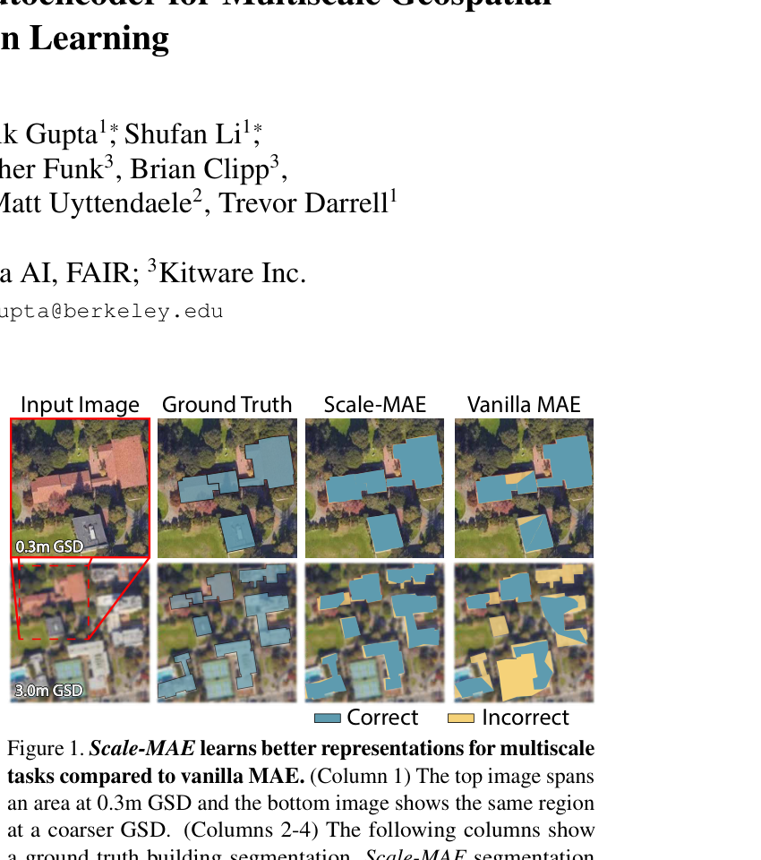
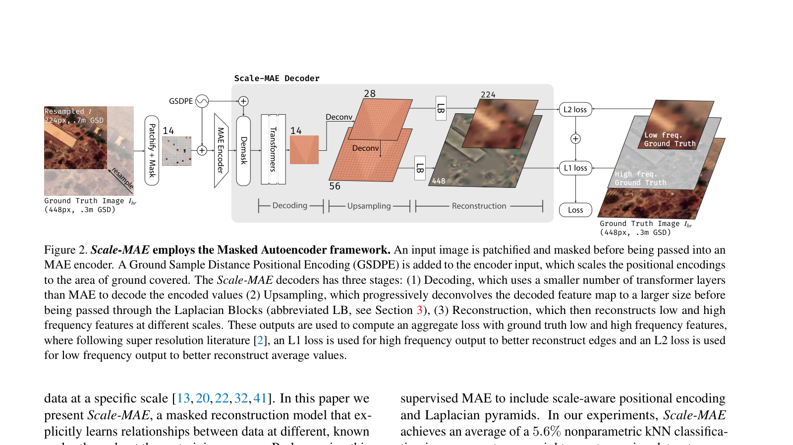
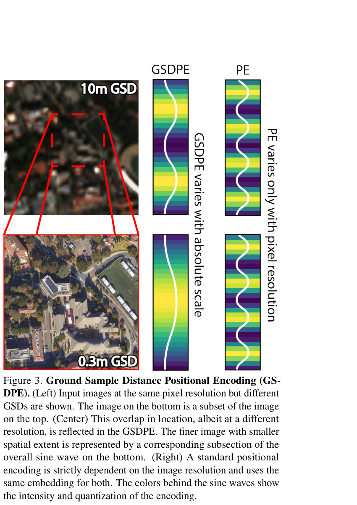
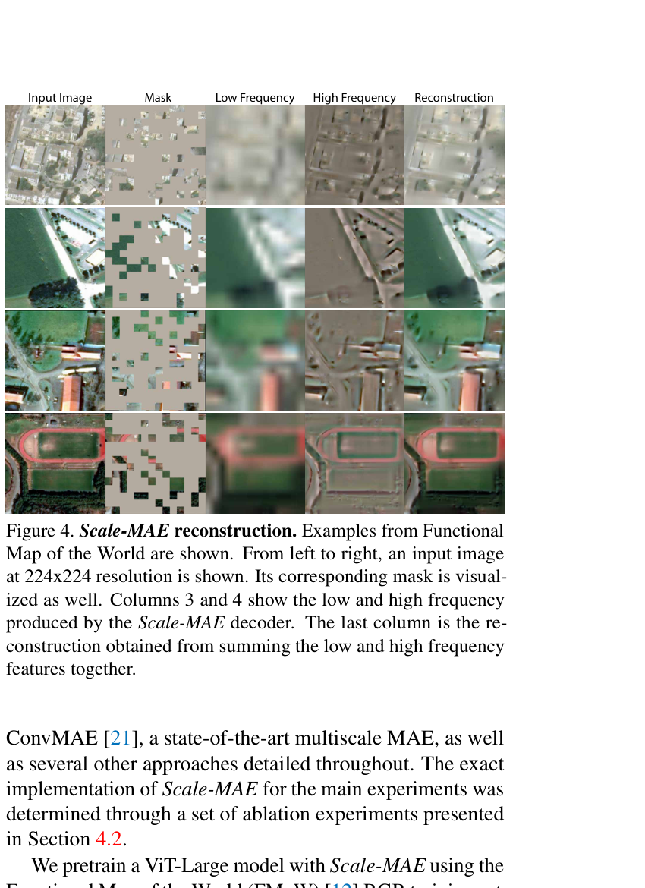
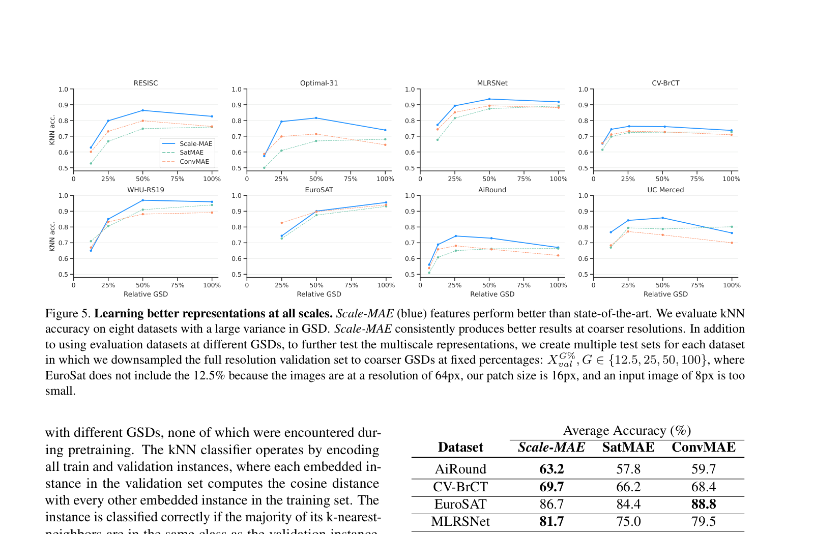
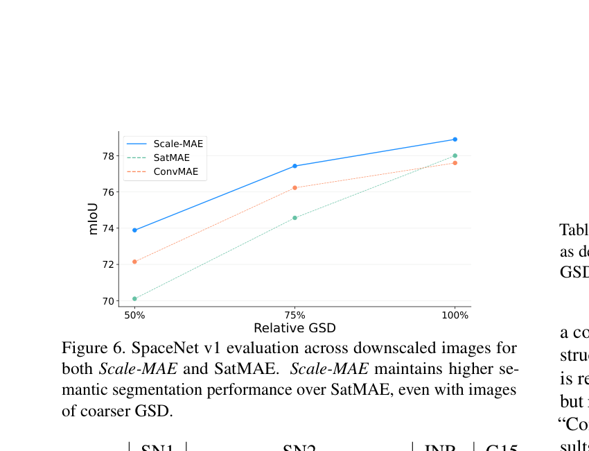
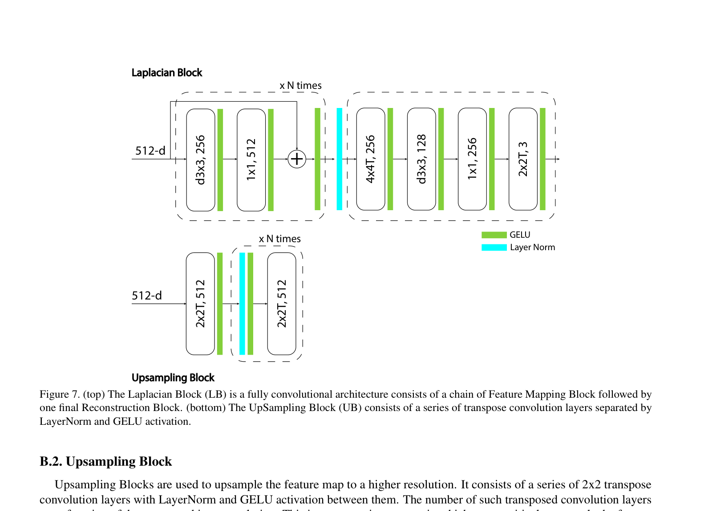
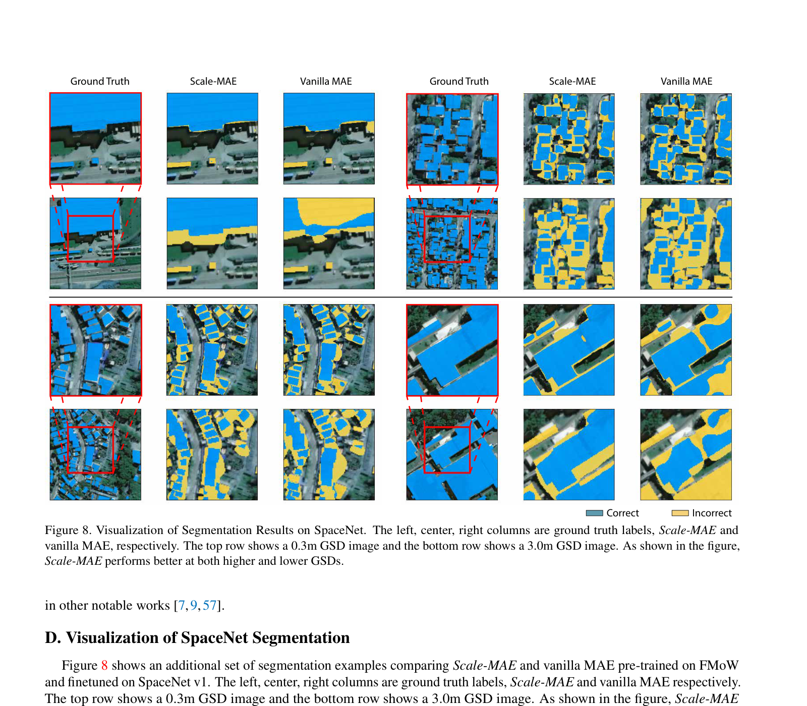

# Scale-MAE: A Scale-Aware Masked Autoencoder for Multiscale Geospatial Representation Learning

> **中英对照阅读文件** | English-Chinese Side-by-Side Reader  
> **论文标题**: ScaleMAE: A Scale-Aware Masked Autoencoder for Multiscale Geospatial Representation Learning  
> **会议**: ICCV 2023 (IEEE/CVF International Conference on Computer Vision)  
> **作者**: Colorado J Reed*, Ritwik Gupta*, Shufan Li*, Sarah Brockman, Christopher Funk, Brian Clipp, Kurt Keutzer, Salvatore Candido, Matt Uyttendaele, Trevor Darrell  
> **机构**: ¹Berkeley AI Research; ²Meta AI, FAIR; ³Kitware Inc.  
> **生成日期**: 2026-05-27  
> **页数**: 16 pages (main paper + supplementary)

---

## Page Index | 页码索引

| Page | 内容 | 锚点 |
|------|------|------|
| 1 | Title, Abstract, Introduction (beginning) | P1 |
| 2 | Introduction (continued), Related Work (beginning), Figure 2 | P2 |
| 3 | Related Work (continued), Section 3 Scale-MAE | P3 |
| 4 | Section 3 Scale-MAE (continued), GSD Positional Encoding, Figure 3 | P4 |
| 5 | Scale-MAE Decoder, Section 4 Experiments, Figure 4 | P5 |
| 6 | Section 4.1 Representation Quality, Figure 5, Table 1 | P6 |
| 7 | Linear probing/finetuning, Semantic segmentation, Table 2-4 | P7 |
| 8 | Figure 6, Table 5-7, Section 5 Discussion (beginning) | P8 |
| 9 | Table 8-9, Section 5 Discussion, Section 6 Conclusion, Acknowledgements, References (beginning) | P9 |
| 10-12 | References [1]-[68] | P10-P12 |
| 13 | Appendix A: Datasets, Table 10 | P13 |
| 14 | Appendix B: Laplacian Blocks, Table 11 | P14 |
| 15 | Appendix B/C: Upsampling Block, Evaluation Details, Figure 7 | P15 |
| 16 | Appendix D/E: Visualization, Glossary, Figure 8 | P16 |

---

## 阅读说明

- **原文** (English): 保留原始段落结构、技术术语、引用标注和公式
- **译文** (中文): 直译为主，技术术语保留英文原词或标注，不确定处标记 `[?]`
- **图表**: 就近放置在引用段落之后，附带双语图注

---

---

# Page 1 | 第1页

## Title | 标题

**Scale-MAE: A Scale-Aware Masked Autoencoder for Multiscale Geospatial Representation Learning**

**Scale-MAE：面向多尺度地理空间表示学习的尺度感知掩码自编码器**

> Colorado J Reed¹²*, Ritwik Gupta¹*, Shufan Li¹*, Sarah Brockman³, Christopher Funk³, Brian Clipp³, Kurt Keutzer¹, Salvatore Candido², Matt Uyttendaele², Trevor Darrell¹  
> ¹Berkeley AI Research; ²Meta AI, FAIR; ³Kitware Inc.  
> correspondence to ritwikgupta@berkeley.edu  
> *Denotes co-first authorship. Co-first authors will prioritize their names on their resumes/websites.

---

## Abstract | 摘要

> **S001** | Page 1

**[EN]** Large, pretrained models are commonly finetuned with imagery that is heavily augmented to mimic different conditions and scales, with the resulting models used for various tasks with imagery from a range of spatial scales. Such models overlook scale-specific information in the data for scale-dependent domains, such as remote sensing. In this paper, we present Scale-MAE, a pretraining method that explicitly learns relationships between data at different, known scales throughout the pretraining process. Scale-MAE pretrains a network by masking an input image at a known input scale, where the area of the Earth covered by the image determines the scale of the ViT positional encoding, not the image resolution. Scale-MAE encodes the masked image with a standard ViT backbone, and then decodes the masked image through a bandpass filter to reconstruct low/high frequency images at lower/higher scales. We find that tasking the network with reconstructing both low/high frequency images leads to robust multiscale representations for remote sensing imagery. Scale-MAE achieves an average of a 2.4–5.6% non-parametric kNN classification improvement across eight remote sensing datasets compared to current state-of-the-art and obtains a 0.9 mIoU to 1.7 mIoU improvement on the SpaceNet building segmentation transfer task for a range of evaluation scales.

**[中]** 大型预训练模型通常使用经过重度增强的影像进行微调，以模拟不同的条件和尺度，得到的模型被用于处理多种空间尺度影像的各类任务。这类模型忽略了尺度依赖领域（如遥感）数据中尺度特定的信息。本文提出Scale-MAE，一种在预训练过程中显式学习不同已知尺度数据之间关系的预训练方法。Scale-MAE通过在已知输入尺度下掩码输入图像来预训练网络，其中图像覆盖的地球区域决定了ViT位置编码的尺度，而非图像分辨率。Scale-MAE使用标准ViT主干编码掩码图像，然后通过带通滤波器解码掩码图像，以在更低/更高尺度重建低频/高频图像。我们发现，让网络同时重建低频和高频图像，可以为遥感影像产生稳健的多尺度表示。与当前最先进方法相比，Scale-MAE在八个遥感数据集上实现了平均2.4%–5.6%的非参数kNN分类提升，并在SpaceNet建筑物分割迁移任务的一系列评估尺度上获得了0.9至1.7 mIoU的提升。

---

## 1. Introduction | 引言

> **S002** | Page 1

**[EN]** Remote sensing data is captured from satellites and planes through a mixture of sensors, processing pipelines, and viewing geometries. Depending on the composition and relative geometry of the sensor to the Earth, each image's Ground Sample Distance (GSD — the physical distance between two adjacent pixels in an image) can vary from 0.3m to 1km, so a 100×100 pixel image could span anywhere from an Olympic-size swimming pool (900 m²) to almost the entire country of Jamaica (10,000 km²). The data within each image, and the corresponding objects and points of interest, can therefore vary across wide spatial ranges. Data from these multiscale sensors provide critical and complementary information for various operational and research applications in areas such as atmospheric, hydrologic, agricultural, and environmental monitoring [45, 52].

**[中]** 遥感数据通过混合的传感器、处理管道和观测几何从卫星和飞机上获取。根据传感器相对于地球的组成和相对几何关系，每幅图像的地面采样距离（GSD — 图像中两个相邻像素之间的物理距离）可以从0.3米到1公里不等，因此一张100×100像素的图像可能覆盖的范围从奥林匹克标准游泳池（900平方米）到几乎整个牙买加国家（10,000平方公里）。因此，每幅图像内的数据以及相应的目标和兴趣点在空间范围上差异很大。来自这些多尺度传感器的数据为大气、水文、农业和环境监测等领域的各种操作和研究应用提供了关键且互补的信息[45, 52]。

> **S003** | Page 1

**[EN]** Few modern computer vision methods have explicitly addressed multiscale remote sensing imagery [35]. Nevertheless, the remote sensing vision community has increasingly used large, pretrained models [13, 20], where such applications finetune a pretrained model for a single source of data at a specific scale [13, 20, 22, 32, 41]. In this paper we present Scale-MAE, a masked reconstruction model that explicitly learns relationships between data at different, known scales throughout the pretraining process. By leveraging this information, Scale-MAE produces a pretrained model that performs better across a wide range of GSDs and tasks.

**[中]** 很少有现代计算机视觉方法显式地处理多尺度遥感影像[35]。尽管如此，遥感视觉社区越来越多地使用大型预训练模型[13, 20]，这类应用针对特定尺度的单一数据源对预训练模型进行微调[13, 20, 22, 32, 41]。本文提出Scale-MAE，一种掩码重建模型，在预训练过程中显式学习不同已知尺度数据之间的关系。通过利用这一信息，Scale-MAE产生了一个在广泛GSD范围和任务上表现更好的预训练模型。

---

> **F001** | Page 1 — Figure 1. Scale-MAE learns better representations for multiscale tasks compared to vanilla MAE. (Column 1) The top image spans an area at 0.3m GSD and the bottom image shows the same region at a coarser GSD. (Columns 2-4) The following columns show a ground truth building segmentation, Scale-MAE segmentation from a finetuned UperNet, and segmentation from an analogously finetuned UperNet from a vanilla MAE, respectively. Scale-MAE demonstrates better performance across images at both scales. See the supplementary material for more examples.

**[中]** 图1. 与vanilla MAE相比，Scale-MAE为多尺度任务学习了更好的表示。（第1列）上方图像跨越0.3m GSD的区域，下方图像显示同一区域在更粗GSD下的样貌。（第2-4列）后续列分别展示真实建筑物分割、经finetuned UperNet的Scale-MAE分割，以及经类似finetuned UperNet的vanilla MAE分割。Scale-MAE在两种尺度的图像上均表现出更好的性能。更多示例见补充材料。

---

# Page 2 | 第2页

> **S004** | Page 2

**[EN]** Masked Autoencoders [26] offer self-supervised learning without explicit augmentations. A standard Masked Autoencoder resizes/crops an image, masks the majority of the transformed image, and then tasks a Vision Transformer (ViT) based autoencoder with embedding the unmasked components. A decoding ViT then decodes the full image from these learned embeddings, where the decoder is later discarded and the encoder is used to produce representations for an unmasked input image.

**[中]** 掩码自编码器（Masked Autoencoders, MAE）[26]提供无需显式增强的自监督学习。标准掩码自编码器对图像进行resize/crop，掩码变换后图像的大部分区域，然后让基于Vision Transformer (ViT)的自编码器嵌入未掩码的组件。解码ViT随后从这些学习到的嵌入中解码完整图像，之后解码器被丢弃，编码器用于为未掩码输入图像生成表示。

> **S005** | Page 2

**[EN]** Existing MAE-based pretraining approaches fail to generalize across domains with images at multiple scales. Scale-MAE (Figure 1) overcomes this through a GSD-based positional encoding derived from the land area covered in the image. This informs the ViT of both the position and scale of the input image. Scale-MAE also uses a Laplacian-pyramid decoder to encourage the network to learn multiscale representations. The embeddings are decoded to two images containing low and residual high frequency information, respectively – see Figure 2. As we discuss in Section 3, this structure allows the ViT decoder to use fewer parameters than MAE while still producing strong representations across multiple scales.

**[中]** 现有的基于MAE的预训练方法无法在包含多尺度图像的领域中泛化。Scale-MAE（图1）通过基于GSD的位置编码克服这一问题，该编码来源于图像覆盖的陆地面积。这向ViT同时告知了输入图像的位置和尺度。Scale-MAE还使用Laplacian金字塔解码器来鼓励网络学习多尺度表示。嵌入被解码为两个图像，分别包含低频和残余高频信息——见图2。如我们在第3节中讨论的那样，这种结构允许ViT解码器使用比MAE更少的参数，同时仍在多个尺度上产生强大的表示。

> **S006** | Page 2

**[EN]** We show that Scale-MAE leads to better performing, more robust multiscale representations than both a standard MAE and a recently proposed, state-of-the-art MAEs SatMAE [13] and ConvMAE [21] across remote sensing datasets with a variety of scale and resolution characteristics. To the best of our knowledge Scale-MAE is the first self-supervised MAE to include scale-aware positional encoding and Laplacian pyramids. In our experiments, Scale-MAE achieves an average of a 5.6% nonparametric kNN classification improvement across eight remote sensing datasets compared to current state-of-the-art in addition to a 0.9 mIoU to 1.7 mIoU improvement on the SpaceNet building segmentation transfer task for a range of evaluation scales (see Figure 1).

**[中]** 我们表明，在各种尺度和分辨率特征的遥感数据集上，Scale-MAE比标准MAE以及最近提出的最先进MAE方法SatMAE [13]和ConvMAE [21]产生了更好、更稳健的多尺度表示。据我们所知，Scale-MAE是第一个包含尺度感知位置编码和Laplacian金字塔的自监督MAE。在我们的实验中，与当前最先进方法相比，Scale-MAE在八个遥感数据集上实现了平均5.6%的非参数kNN分类提升，此外在SpaceNet建筑物分割迁移任务的一系列评估尺度上获得了0.9至1.7 mIoU的提升（见图1）。

---

## 2. Related Work | 相关工作

### Representation learning and the Masked Autoencoder | 表示学习与掩码自编码器

> **S007** | Page 2

**[EN]** Representation learning aims to extract meaningful, intrinsic features from data for downstream use [5]. In practice, this often entails pretraining a deep network so that a lightweight learning routine can then finetune it for a particular downstream task, see [15, 16, 17, 24, 27, 30, 37, 49, 66]. The Masked Autoencoder (MAE) is a recent state-of-the-art self-supervised representation learning method in computer vision that pretrains a ViT encoder by masking an image, feeding the unmasked portion into a transformer-based encoder, and then tasking the decoder with reconstructing the input image [26]. MAEs fail to leverage scale information in scale-dependent domains as they are often reliant on absolute or relative positional encodings. To the best of our knowledge, Scale-MAE is the first MAE-based self-supervised learning method to incorporate a scale-variant positional encoding.

**[中]** 表示学习旨在从数据中提取有意义的、内在的特征以供下游使用[5]。在实践中，这通常涉及预训练一个深度网络，以便随后可以通过轻量级的学习流程为其特定的下游任务进行微调，参见[15, 16, 17, 24, 27, 30, 37, 49, 66]。掩码自编码器（MAE）是计算机视觉中一种最新的最先进的自监督表示学习方法，它通过掩码图像、将未掩码部分输入基于transformer的编码器，然后让解码器重建输入图像来预训练ViT编码器[26]。MAE未能利用尺度依赖领域中的尺度信息，因为它们通常依赖于绝对或相对位置编码。据我们所知，Scale-MAE是第一个融入尺度可变位置编码的基于MAE的自监督学习方法。

### Remote Sensing Representation Learning | 遥感表示学习

> **S008** | Page 2-3

**[EN]** Neumann et al. [46] were one of the first to exhaustively share results on existing representation learning and semi-supervised learning techniques for remote sensing imagery. Gao et al. [22] demonstrated the effectiveness of MAE pretraining for remote sensing image classification. Ayush et al. [3] leveraged the metadata from remote sensing images via spatially aligned but temporally separated images as positive pairs for contrastive learning and predicted the latitude and longitude as pretext tasks. Gupta et al. [25] demonstrated the use of MAEs as a pretraining approach for passive and active remote sensing imagery. Their method introduced flexible "adapters" which could be used interchangeably with an encoder for a set of input imagery modes. Cong et al. [13] introduced the SatMAE, which used temporal and spectral metadata in a positional encoding to encode spatio-temporal relationships in data. The temporal data contains the year, month, and hour enabling understanding of long-term change with the year, weather information from the month, and hour information for the time of day. Further Liu et al. [41] and Ibañez et al. [32] have shown that MAE architectures can be used for band selection in hyperspectral remote sensing images, significantly reducing data redundancy while maintaining high classification accuracy. Scale-MAE leverages inherent absolute scale information present in scale-dependent domains as a way to learn robust, multiscale features that reduce data usage downstream.

**[中]** Neumann等人[46]是最早全面分享遥感影像现有表示学习和半监督学习技术结果的研究者之一。Gao等人[22]证明了MAE预训练在遥感图像分类中的有效性。Ayush等人[3]利用遥感图像的元数据，通过空间对齐但时间分离的图像作为对比学习的正样本对，并预测纬度和经度作为前置任务。Gupta等人[25]展示了MAE作为被动和主动遥感影像预训练方法的用途。他们的方法引入了灵活的"适配器"，可以与编码器互换使用以处理一组输入影像模式。Cong等人[13]提出了SatMAE，它在位置编码中使用时间和光谱元数据来编码数据中的时空关系。时间数据包含年、月、小时，使得能够理解以年为单位的长期变化、来自月份的天气信息以及一天中的小时信息。此外，Liu等人[41]和Ibañez等人[32]表明，MAE架构可用于高光谱遥感图像的波段选择，在保持高分类准确率的同时显著减少数据冗余。Scale-MAE利用尺度依赖领域中固有的绝对尺度信息，作为学习稳健多尺度特征的一种方式，从而减少下游数据使用。

---

> **F002** | Page 2 — Figure 2. Scale-MAE employs the Masked Autoencoder framework. An input image is patchified and masked before being passed into an MAE encoder. A Ground Sample Distance Positional Encoding (GSDPE) is added to the encoder input, which scales the positional encodings to the area of ground covered. The Scale-MAE decoders has three stages: (1) Decoding, which uses a smaller number of transformer layers than MAE to decode the encoded values (2) Upsampling, which progressively deconvolves the decoded feature map to a larger size before being passed through the Laplacian Blocks (abbreviated LB, see Section 3), (3) Reconstruction, which then reconstructs low and high frequency features at different scales. These outputs are used to compute an aggregate loss with ground truth low and high frequency features, where following super resolution literature [2], an L1 loss is used for high frequency output to better reconstruct edges and an L2 loss is used for low frequency output to better reconstruct average values.

**[中]** 图2. Scale-MAE采用Masked Autoencoder框架。输入图像被patchify并掩码后传入MAE编码器。Ground Sample Distance Positional Encoding (GSDPE)被添加到编码器输入中，将位置编码缩放到地面覆盖区域。Scale-MAE解码器有三个阶段：(1) 解码（Decoding），使用比MAE更少的transformer层来解码编码值；(2) 上采样（Upsampling），逐步反卷积解码后的特征图到更大尺寸，然后传入Laplacian Blocks（简称LB，见第3节）；(3) 重建（Reconstruction），重建不同尺度的低频和高频特征。这些输出用于与真实低频和高频特征计算聚合损失，遵循超分辨率文献[2]，高频输出使用L1损失以更好地重建边缘，低频输出使用L2损失以更好地重建平均值。

---

### Super-resolution | 超分辨率

> **S009** | Page 3

**[EN]** Super-resolution has proven effective in improving accuracy within remote sensing images due to the extremely small size of objects within the image [51]. Previous works have aimed to learn continuous implicit representations for images at arbitrary resolutions to aid the super-resolution task. These representations are used to upsample the images either to specific scales [38] or to arbitrary resolutions [10, 31, 61]. Most super-resolution work aims to increase the resolution of the input image, whereas Scale-MAE produces both higher and lower resolution images. There is some work on super-resolution for satellite imagery, but much of this work is focused on synthetically creating high-resolution datasets for use with models trained specifically for high-resolution data [28, 35]. Scale-MAE, however, utilizes super-resolution as a means to obtain multiscale representations during pretraining.

**[中]** 由于遥感图像中目标的体积极小，超分辨率已被证明能有效提高遥感图像的精度[51]。先前的工作旨在学习连续隐式表示，以帮助任意分辨率图像的超分辨率任务。这些表示用于将图像上采样到特定尺度[38]或任意分辨率[10, 31, 61]。大多数超分辨率工作旨在提高输入图像的分辨率，而Scale-MAE同时产生更高和更低分辨率的图像。卫星影像的超分辨率方面也有一些工作，但其中大部分集中在合成创建高分辨率数据集，以供专门训练用于高分辨率数据的模型使用[28, 35]。然而，Scale-MAE将超分辨率用作在预训练期间获得多尺度表示的一种手段。

### Multiscale Features | 多尺度特征

> **S010** | Page 3

**[EN]** Because images can contain objects of many different pixel resolutions, the vision community has proposed many methods to extract multiscale features. These include spatial pyramids [6, 34, 36, 50] and dense sampling of windows [33, 62, 63]. These approaches have been combined by methods such as [19], in which dense histogram-of-gradient features are computed for each feature pyramid level. Rather than using classical computer vision techniques to extract multiscale features, convolutional neural networks have been used to build deep multiscale features. CNNs with subsampling layers inherently build feature pyramids, a property exploited explicitly by models such as the Feature Pyramid Network and the Single-Shot Detector, amongst others [23, 39, 40]. Recently, this multiscale idea has been extended to vision transformers by [18], who show that this architecture improves various video recognition and image classification tasks, as well as in [21, 67] which proposes various hybrid CNN-MAE architectures that yield multiscale features during MAE pretraining. Different from these works, Scale-MAE uses a Laplacian pyramid decoder as a way to force an encoder to learn multiscale features with the ViT architecture.

**[中]** 由于图像可以包含许多不同像素分辨率的目标，视觉社区提出了许多提取多尺度特征的方法。这些方法包括空间金字塔[6, 34, 36, 50]和窗口密集采样[33, 62, 63]。这些方法已被[19]等方法结合，其中为每个特征金字塔级别计算密集的梯度直方图特征。与使用经典计算机视觉技术提取多尺度特征不同，卷积神经网络已被用于构建深度多尺度特征。具有子采样层的CNN本质上构建了特征金字塔，Feature Pyramid Network和Single-Shot Detector等模型明确利用了这一特性[23, 39, 40]。最近，这一多尺度思想被[18]扩展到视觉transformer，他们表明这种架构改善了各种视频识别和图像分类任务，以及[21, 67]提出了各种混合CNN-MAE架构，在MAE预训练期间产生多尺度特征。与这些工作不同，Scale-MAE使用Laplacian金字塔解码器作为一种强制编码器使用ViT架构学习多尺度特征的方式。

---

# Page 3 | 第3页

## 3. Scale-MAE

> **S011** | Page 3

**[EN]** This section describes the Scale-MAE pretraining framework as illustrated in Figure 2. Scale-MAE is a self-supervised pretraining framework based on the Masked Autoencoder (MAE) [26]. Scale-MAE makes two contributions to the MAE framework. Standard MAE-based methods use absolute or relative positional encodings to inform the ViT of the position of the unmasked components, where an image at resolution r will have the same positional encodings regardless of the image content. Scale-MAE introduces the Ground Sample Distance (GSD) based positional encoding that scales in proportion to the area of land in an image, regardless of the resolution of the image. In addition, Scale-MAE introduces the Laplacian-pyramid decoder to the MAE framework to encourage the network to learn multiscale representations. Embeddings from a ViT encoder are decoded to a lower resolution image that captures the lower frequency information and a higher resolution image that captures the high-frequency information. We formalize Scale-MAE in the following subsections by first specifying the necessary MAE background, describing the GSD-based positional encoding, and then explaining the Laplacian-pyramid decoder.

**[中]** 本节描述如图2所示的Scale-MAE预训练框架。Scale-MAE是一种基于掩码自编码器（MAE）[26]的自监督预训练框架。Scale-MAE对MAE框架做出了两项贡献。标准的基于MAE的方法使用绝对或相对位置编码来告知ViT未掩码组件的位置，其中分辨率为r的图像无论图像内容如何都具有相同的位置编码。Scale-MAE引入了基于地面采样距离（GSD）的位置编码，该编码与图像中陆地面积成比例缩放，无论图像分辨率如何。此外，Scale-MAE将Laplacian金字塔解码器引入MAE框架，以鼓励网络学习多尺度表示。来自ViT编码器的嵌入被解码为较低分辨率图像（捕获低频信息）和较高分辨率图像（捕获高频信息）。我们在以下小节中形式化Scale-MAE，首先说明必要的MAE背景，描述基于GSD的位置编码，然后解释Laplacian金字塔解码器。

### Setup | 设置

> **S012** | Page 3

**[EN]** Let I ∈ R^{H×W×C} represent an input image of height H, width W, and C channels. The MAE patchifies I into a sequence S of independent patches of height and width P pixels, where each of the N_p patches, s ∈ S has dimension s ∈ R^{P²C}. A fraction, m, of the patches are then removed and the remaining patches are then passed through a projection function (e.g., a linear layer) to project the patches S into D dimensions, f_E : R^{P²C} → R^D, to obtain embedded patches S_E = f_E(S). An R² positional encoding vector, is then added to the embedded patches with

v_x(pos, 2i) = sin(pos / 10000^{2i/D})
v_y(pos, 2i+1) = cos(pos / 10000^{2i/D})

where pos is the position of the patch along the given axis and i is the feature index (visualized in Figure 3), exactly as introduced in [54]. These positional encodings are then concatenated and added to the embedded patches, which are then fed into a ViT encoder. After the encoder, the removed m patches are then placed back into their original location in the sequence of patches where a learned mask token represents the masked patches that were not encoded. Another positional encoding vector is added to all patches and a sequence of transformer blocks decodes these patches to form the original input image, which is used as the learning target.

**[中]** 设 I ∈ R^{H×W×C} 表示一个高度为H、宽度为W、通道数为C的输入图像。MAE将I patchify为一系列独立的patch S，每个patch的高度和宽度为P像素，其中每个N_p个patch s ∈ S的维度为 s ∈ R^{P²C}。然后移除比例为m的patch，剩余的patch通过一个投影函数（例如线性层）将patch S投影到D维，f_E : R^{P²C} → R^D，得到嵌入patch S_E = f_E(S)。然后将一个R²位置编码向量添加到嵌入patch中：

v_x(pos, 2i) = sin(pos / 10000^{2i/D})
v_y(pos, 2i+1) = cos(pos / 10000^{2i/D})

其中pos是patch沿给定轴的位置，i是特征索引（在图3中可视化），与[54]中引入的完全一致。然后这些位置编码被拼接并添加到嵌入patch中，随后输入ViT编码器。编码后，被移除的m个patch被放回它们在patch序列中的原始位置，其中学习到的mask token代表未被编码的掩码patch。另一个位置编码向量被添加到所有patch，然后一系列transformer block解码这些patch以形成原始输入图像，作为学习目标。

---

# Page 4 | 第4页

### Input | 输入

> **S013** | Page 4

**[EN]** Scale-MAE performs a super resolution reconstruction, where the input image I is downsampled from a higher resolution image I_{hr} at the ground truth GSD. Instead of targeting the input image, Scale-MAE targets high frequency and low frequency components of I_{hr}, which is common in Laplacian pyramid super resolution models [64], where the high frequency component is at the same resolution as the ground truth image I_{hr} and the low frequency component is at the same resolution as the input image I, as shown in Figure 2. Following many works in super resolution [64], the low frequency target image is obtained by interpolating I_{hr} to a much lower resolution, r_{low} and then interpolating to the same resolution as the input image I. The high frequency target image is obtained by downsampling I_{hr} to another lower resolution r_{high-low}, and then upsampling to the same resolution as the ground truth image I_{hr} and subtracting this image I_{hf} = I_{hr} − I_{high-low}. The supplementary material provide more information on the upsampling/downsampling methodology. The key components for Scale-MAE are described next.

**[中]** Scale-MAE执行超分辨率重建，其中输入图像I是从更高分辨率图像I_{hr}在真实GSD下下采样得到的。Scale-MAE的目标不是输入图像本身，而是I_{hr}的高频和低频组件，这在Laplacian金字塔超分辨率模型[64]中很常见，其中高频组件与真实图像I_{hr}分辨率相同，低频组件与输入图像I分辨率相同，如图2所示。遵循超分辨率领域的许多工作[64]，低频目标图像通过将I_{hr}插值到低得多的分辨率r_{low}，然后再插值到与输入图像I相同的分辨率获得。高频目标图像通过将I_{hr}下采样到另一个较低分辨率r_{high-low}，然后上采样到与真实图像I_{hr}相同的分辨率，再减去该图像获得：I_{hf} = I_{hr} − I_{high-low}。补充材料提供了更多关于上采样/下采样方法的信息。接下来描述Scale-MAE的关键组件。

### GSD Positional Encoding | GSD位置编码

> **S014** | Page 4

**[EN]** Images from scale-dependent domains have a metric which defines the absolute scale for the image. This metric has different names across domains and is referred to as the Ground Sample Distance (GSD) in remote sensing. The GSD is critical to understanding, conceptually, the kinds of features that will be available in an image. An image with finer GSD (lower number) will have higher frequency details than an image with coarser GSD (high number). Models are generally unaware of absolute scale when learning over a set of data. Specifically, even if they implicitly learn that all images in a dataset share a varying resolution from input-space augmentations, then these models do not explicitly condition on the GSDs encountered in unseen data.

**[中]** 来自尺度依赖领域的图像具有定义图像绝对尺度的度量。该度量在不同领域有不同的名称，在遥感中被称为地面采样距离（GSD）。GSD对于从概念上理解图像中将出现何种特征至关重要。GSD更精细（数值更小）的图像比GSD更粗糙（数值更大）的图像具有更高频的细节。模型在学习一组数据时通常不知道绝对尺度。具体而言，即使它们隐式学习到数据集中所有图像因输入空间增强而具有不同的分辨率，这些模型也不会对未见过数据中遇到的GSD进行显式条件化。

> **S015** | Page 4

**[EN]** We extend the positional encoding from Equation (2) to include GSD by scaling the positional encoding relative to the land area covered in an image as depicted in Figure 3 and mathematically:

v_{gsd,x}(pos, 2i) = sin( (g/G) × (pos / 10000^{2i/D}) )
v_{gsd,y}(pos, 2i+1) = cos( (g/G) × (pos / 10000^{2i/D}) )

where g is the GSD of the image and G is a reference GSD, nominally set to 1m. Intuitively, an object imaged at a finer resolution has more pixels representing it. When imaging the same object at a coarser resolution, those pixels must map to fewer pixels. In Equation (4), we interpolate the positional encoding by a factor of G/g to account for the ordering of the coarser set of pixels. This simple idea underpins the GSD Positional Encoding, visualized in Figure 3.

**[中]** 我们通过相对于图像覆盖的陆地面积缩放位置编码，将方程(2)中的位置编码扩展为包含GSD，如图3所示，数学表达为：

v_{gsd,x}(pos, 2i) = sin( (g/G) × (pos / 10000^{2i/D}) )
v_{gsd,y}(pos, 2i+1) = cos( (g/G) × (pos / 10000^{2i/D}) )

其中g是图像的GSD，G是参考GSD，名义上设置为1m。直观上，在更精细分辨率下成像的目标有更多的像素表示它。当在更粗糙分辨率下对同一目标成像时，这些像素必须映射到更少的像素。在方程(4)中，我们通过G/g的因子插值位置编码，以考虑较粗糙像素集的排序。这一简单思想构成了GSD位置编码的基础，在图3中可视化。

---

> **F003** | Page 4 — Figure 3. Ground Sample Distance Positional Encoding (GSDPE). (Left) Input images at the same pixel resolution but different GSDs are shown. The image on the bottom is a subset of the image on the top. (Center) This overlap in location, albeit at a different resolution, is reflected in the GSDPE. The finer image with smaller spatial extent is represented by a corresponding subsection of the overall sine wave on the bottom. (Right) A standard positional encoding is strictly dependent on the image resolution and uses the same embedding for both. The colors behind the sine waves show the intensity and quantization of the encoding.

**[中]** 图3. Ground Sample Distance Positional Encoding (GSDPE)。(左) 展示了相同像素分辨率但不同GSD的输入图像。底部图像是顶部图像的子集。(中) 这种位置上的重叠，尽管分辨率不同，在GSDPE中得到了反映。空间范围更小的精细图像由底部整体正弦波的相应子区间表示。(右) 标准位置编码严格依赖于图像分辨率，对两者使用相同的嵌入。正弦波背后的颜色展示了编码的强度和量化。

---

### Scale-MAE decoder | Scale-MAE解码器

> **S016** | Page 4-5

**[EN]** The standard MAE learns representations by tasking a network with reconstructing an image after masking out most of its pixels. While the standard MAE decoder reconstructs the input image at the same scale as its input, the objective of Scale-MAE is to learn multiscale representations. We draw on works from progressive super-resolution such as [56], that learn a high resolution, high frequency image and a lower resolution low frequency image, that when combined together, yield the input image at a higher resolution.

**[中]** 标准MAE通过让网络在掩码大部分像素后重建图像来学习表示。虽然标准MAE解码器以与输入相同的尺度重建输入图像，但Scale-MAE的目标是学习多尺度表示。我们借鉴了渐进式超分辨率方面的工作，如[56]，它们学习高分辨率高频图像和低分辨率低频图像，当两者结合时，产生更高分辨率的输入图像。

> **S017** | Page 5

**[EN]** The Scale-MAE introduces a novel decoder which decodes to multiple scales with a progressive Laplacian decoder architecture, replacing the traditional MAE "decoder", which is really a Transformer encoder. This architecture consists of three stages: decoding, upsampling, and reconstruction, which are shown in Figure 2 and detailed below.

**[中]** Scale-MAE引入了一种新颖的解码器，使用渐进式Laplacian解码器架构解码到多个尺度，替代了传统的MAE"解码器"（它实际上是一个Transformer编码器）。该架构包含三个阶段：解码、上采样和重建，如图2所示，详细说明如下。

> **S018** | Page 5

**[EN]** **Decoding** follows the standard MAE decoder where following the encoder, the removed m patches are then placed back into their original location in the sequence of patches where a learned mask token represents the masked patches that were not encoded, a positional encoding is added, and then a series of transformer layers decode all patches. In contrast to the standard MAE decoder, the Scale-MAE decoder uses fewer transformer layers (e.g. 3 layers instead of 8), which reduces the parameter complexity as quantified in Section 5. The output of these layers is then fed into the upsampling stage.

**[中]** **解码（Decoding）**遵循标准MAE解码器，在编码器之后，被移除的m个patch被放回它们在patch序列中的原始位置，其中学习到的mask token代表未被编码的掩码patch，添加位置编码，然后一系列transformer层解码所有patch。与标准MAE解码器相比，Scale-MAE解码器使用更少的transformer层（例如3层而不是8层），这减少了参数复杂度，如第5节所量化的。这些层的输出随后被送入上采样阶段。

> **S019** | Page 5

**[EN]** **Upsampling** The latent feature maps from the decoding stage are progressively upsampled to 2× and 4× resolution using deconvolution blocks, where the first deconvolution is 2×2 with stride 2 that outputs a feature map at 2× the input resolution (28 in Figure 2), followed by a LayerNorm and GELU, and then another 2×2 deconvolution layer that outputs a feature maps at 2× the previous resolution (56 in Figure 2). See the supplementary material for a full architectural diagram.

**[中]** **上采样（Upsampling）** 解码阶段的潜在特征图通过反卷积块逐步上采样到2×和4×分辨率，其中第一个反卷积为2×2、步长为2，输出特征图为输入分辨率的2倍（图2中的28），随后是LayerNorm和GELU，然后是另一个2×2反卷积层，输出特征图为前一分辨率的2倍（图2中的56）。完整架构图见补充材料。

> **S020** | Page 5

**[EN]** **Reconstruction** After having been upsampled, the lower resolution and higher resolution feature maps are passed into Laplacian Blocks (LBs in Figure 2) that reconstruct high and low resolution images for the high and low frequency reconstruction, respectively. Architecturally, the Laplacian Blocks consist of a sequence of three sub-blocks: a Laplacian Feature Mapping Block, a Laplacian Upsample Block, and a Laplacian Pyramid Reconstruction Block. The Feature Mapping Block is used to project features within a particular layer of the Laplacian Pyramid back to the RGB space. The Laplacian Upsample Block represents a learnable upsample function that maps latent features from one layer of the Laplacian Pyramid to a higher level. Finally, the Laplacian Pyramid Reconstruction Block is used to reconstruct information at the different frequencies in RGB space. Following super resolution literature [2], an L1 loss is used for high frequency output to better reconstruct edges and an L2 loss is used for low frequency output to better reconstruct average values. The supplementary material has architectural diagrams for each block.

**[中]** **重建（Reconstruction）** 上采样后，较低分辨率和较高分辨率的特征图被传入Laplacian Blocks（图2中的LB），分别重建高分辨率图像（用于高频重建）和低分辨率图像（用于低频重建）。在架构上，Laplacian Blocks由三个子块序列组成：Laplacian Feature Mapping Block、Laplacian Upsample Block和Laplacian Pyramid Reconstruction Block。Feature Mapping Block用于将Laplacian Pyramid特定层内的特征投影回RGB空间。Laplacian Upsample Block表示一个可学习的上采样函数，将Laplacian Pyramid某一层的潜在特征映射到更高层。最后，Laplacian Pyramid Reconstruction Block用于在RGB空间中重建不同频率的信息。遵循超分辨率文献[2]，高频输出使用L1损失以更好地重建边缘，低频输出使用L2损失以更好地重建平均值。每个块的架构图见补充材料。

---

# Page 5 | 第5页

## 4. Experiments | 实验

> **S021** | Page 5

**[EN]** We investigate the quality of representations learned from Scale-MAE pretraining through a set of experiments that explore their robustness to scale as well as their transfer performance to additional tasks. First, we present our main experiments in Section 4.1 and compare with SatMAE [13], a current state-of-the-art MAE for remote sensing imagery, ConvMAE [21], a state-of-the-art multiscale MAE, as well as several other approaches detailed throughout. The exact implementation of Scale-MAE for the main experiments was determined through a set of ablation experiments presented in Section 4.2.

**[中]** 我们通过一组实验研究Scale-MAE预训练学习到的表示质量，探索其对尺度的鲁棒性以及向附加任务的迁移性能。首先，我们在第4.1节中展示主要实验，并与SatMAE [13]（当前最先进的遥感MAE）、ConvMAE [21]（最先进的多尺度MAE）以及全文详述的其他几种方法进行比较。主实验中Scale-MAE的确切实现是通过第4.2节中呈现的一组消融实验确定的。

> **S022** | Page 5

**[EN]** We pretrain a ViT-Large model with Scale-MAE using the Functional Map of the World (FMoW) [12] RGB training set, which consists of 363.6k images of varying image resolution and GSD, for 800 epochs. The initial higher resolution image I_{hr} is taken as a random 448px² crop of the input image, and the input image I is then a downsampled 224px² from I_{hr}. The low frequency groundtruth is obtained by downscaling I_{hr} to 14px² and then upscaling to 224px², while the high frequency groundtruth is obtained by downscaling I_{hr} to 56px² and then upscaling to 448px² and subtracting this image from I_{hr}.

**[中]** 我们使用Functional Map of the World (FMoW) [12] RGB训练集对ViT-Large模型进行Scale-MAE预训练，该训练集包含363.6k张不同图像分辨率和GSD的图像，共800个epoch。初始高分辨率图像I_{hr}取为输入图像的随机448px²裁剪，输入图像I则为从I_{hr}下采样的224px²。低频真实值通过将I_{hr}降尺度到14px²再上采样到224px²获得，高频真实值通过将I_{hr}降尺度到56px²再上采样到448px²，然后从I_{hr}中减去该图像获得。

> **F004** | Page 5 — Figure 4. Scale-MAE reconstruction. Examples from Functional Map of the World are shown. From left to right, an input image at 224×224 resolution is shown. Its corresponding mask is visualized as well. Columns 3 and 4 show the low and high frequency produced by the Scale-MAE decoder. The last column is the reconstruction obtained from summing the low and high frequency features together.

**[中]** 图4. Scale-MAE重建。展示了Functional Map of the World的示例。从左到右，显示了一张224×224分辨率的输入图像，其对应的掩码也被可视化。第3和第4列展示了Scale-MAE解码器产生的低频和高频。最后一列是通过将低频和高频特征相加得到的重建结果。

---

# Page 6 | 第6页

## 4.1. Representation Quality | 表示质量

> **S023** | Page 6

**[EN]** We evaluate the quality of representations from Scale-MAE by freezing the encoder and performing a non-parametric k-nearest-neighbor (kNN) classification with eight different remote sensing imagery classification datasets with different GSDs, none of which were encountered during pretraining. The kNN classifier operates by encoding all train and validation instances, where each embedded instance in the validation set computes the cosine distance with every other embedded instance in the training set. The instance is classified correctly if the majority of its k-nearest-neighbors are in the same class as the validation instance, and incorrectly if they are in any other.

**[中]** 我们通过冻结编码器并执行非参数k近邻（kNN）分类来评估Scale-MAE的表示质量，使用了八个不同的遥感图像分类数据集，这些数据集具有不同的GSD，且在预训练期间均未遇到过。kNN分类器的操作方式是对所有训练和验证实例进行编码，其中验证集中的每个嵌入实例与训练集中所有其他嵌入实例计算余弦距离。如果其k个最近邻中的大多数与验证实例属于同一类别，则该实例被正确分类，否则为错误分类。

> **S024** | Page 6

**[EN]** The reasoning behind the kNN classifier evaluation is that a strong pretrained network will output semantically grouped representation for unseen data of the same class. This evaluation for the quality of representations occurs in other notable works [7, 9, 57]. In addition to using evaluation datasets at different GSDs, to further test the multiscale representations, we create multiple test sets for each dataset. Since we cannot synthesize data at a finer GSD than the provided ground truth, we only downsample the full resolution validation set to coarser GSDs at fixed percentages: X^{G%}_{val}, G ∈ {12.5, 25, 50, 100}.

**[中]** 使用kNN分类器评估的原因是，强大的预训练网络会为同一类别的未见过数据输出语义上聚类的表示。这种表示质量评估也出现在其他著名工作[7, 9, 57]中。除了使用不同GSD的评估数据集外，为了进一步测试多尺度表示，我们为每个数据集创建了多个测试集。由于我们无法合成比提供的真实值更精细GSD的数据，我们仅将全分辨率验证集下采样到固定百分比的更粗GSD：X^{G%}_{val}, G ∈ {12.5, 25, 50, 100}。

> **S025** | Page 6

**[EN]** Our analysis uses eight different land-use classification datasets: RESISC-45 [11], the UC Merced Land Use Dataset [65], AiRound and CV-BrCT [43], MLRSNet [48], EuroSAT [29], Optimal-31 [55], WHU-RS19 [14], SpaceNet v1 and v2 [53], and Functional Map of the World [12]. The datasets used span a wide range of GSDs, e.g., MLRSNet consists of data captured from aerial platforms with 0.1m GSD, while RESISC45 has imagery from medium-resolution satellites at >30m GSD. In some cases, the datasets present imagery at mixed GSDs which are not specified, in which case we assume an approximate constant GSD: see the supplementary material for all details. Furthermore, we provide an expanded set of experiments with linear probing and finetuning in the supplementary material.

**[中]** 我们的分析使用了八个不同的土地利用分类数据集：RESISC-45 [11]、UC Merced土地利用数据集[65]、AiRound和CV-BrCT [43]、MLRSNet [48]、EuroSAT [29]、Optimal-31 [55]、WHU-RS19 [14]、SpaceNet v1和v2 [53]，以及Functional Map of the World [12]。使用的数据集涵盖了广泛的GSD范围，例如，MLRSNet包含从 aerial 平台以0.1m GSD捕获的数据，而RESISC45包含来自中等分辨率卫星的>30m GSD影像。在某些情况下，数据集以未指定的混合GSD呈现影像，在这种情况下我们假设一个近似恒定的GSD：所有细节见补充材料。此外，我们在补充材料中提供了扩展的线性探测和微调实验集。

> **F005** | Page 6 — Figure 5. Learning better representations at all scales. Scale-MAE (blue) features perform better than state-of-the-art. We evaluate kNN accuracy on eight datasets with a large variance in GSD. Scale-MAE consistently produces better results at coarser resolutions. In addition to using evaluation datasets at different GSDs, to further test the multiscale representations, we create multiple test sets for each dataset in which we downsampled the full resolution validation set to coarser GSDs at fixed percentages: X^{G%}_{val}, G ∈ {12.5, 25, 50, 100}, where EuroSat does not include the 12.5% because the images are at a resolution of 64px, our patch size is 16px, and an input image of 8px is too small.

**[中]** 图5. 在所有尺度上学习更好的表示。Scale-MAE（蓝色）特征优于最先进方法。我们在八个GSD方差很大的数据集上评估kNN精度。Scale-MAE在更粗的分辨率上始终产生更好的结果。除了使用不同GSD的评估数据集外，为了进一步测试多尺度表示，我们为每个数据集创建了多个测试集，将全分辨率验证集下采样到固定百分比的更粗GSD：X^{G%}_{val}, G ∈ {12.5, 25, 50, 100}，其中EuroSat不包含12.5%，因为图像分辨率为64px，patch size为16px，8px的输入图像太小。

> **T001** | Page 6 — Table 1. Scale-MAE performs better, across all GSDs (as in Figure 5), for all datasets we experimented with compared to SatMAE. The average improvement across all datasets for Scale-MAE compared to SatMAE is 5.6% and 2.4% compared to ConvMAE with ViT-Large backbones.

**[中]** 表1. 在我们实验的所有数据集上，Scale-MAE在所有GSD下（如图5所示）均优于SatMAE。使用ViT-Large主干网络，Scale-MAE相比SatMAE的平均提升为5.6%，相比ConvMAE为2.4%。

| Dataset | Scale-MAE | SatMAE | ConvMAE |
|---------|-----------|--------|---------|
| AiRound | 63.2 | 57.8 | 59.7 |
| CV-BrCT | 69.7 | 66.2 | 68.4 |
| EuroSAT | 86.7 | 84.4 | 88.8 |
| MLRSNet | 81.7 | 75.0 | 79.5 |
| OPTIMAL-31 | 65.5 | 55.7 | 61.7 |
| RESISC | 70.0 | 61.0 | 67.0 |
| UC Merced | 75.0 | 69.8 | 70.0 |
| WHU-RS19 | 79.5 | 78.5 | 77.0 |

> **S026** | Page 6

**[EN]** We run kNN classification with k = 20. Figure 5 shows that Scale-MAE outperforms SatMAE and ConvMAE across GSD scales in the different evaluation datasets and across relative GSD scales within individual datasets. For example, the UC Merced has a GSD of 0.3m, but evaluating at scales [12.5%, 100%] provides an artificial GSD range of [0.3m, 2.4m]. On this example, we see that Scale-MAE provides the largest performance gap at the 2.4m GSD, with similar performance at 0.3m.

**[中]** 我们使用k = 20运行kNN分类。图5显示，Scale-MAE在不同评估数据集的GSD尺度上以及单个数据集内的相对GSD尺度上均优于SatMAE和ConvMAE。例如，UC Merced的GSD为0.3m，但在尺度[12.5%, 100%]下评估提供了人工GSD范围[0.3m, 2.4m]。在这个例子中，我们看到Scale-MAE在2.4m GSD处提供了最大的性能差距，在0.3m处性能相似。

> **S027** | Page 6

**[EN]** Across all other evaluation datasets and wider range of GSDs, Scale-MAE outperforms SatMAE and ConvMAE, where Scale-MAE outperforms both methods by a larger gap as the GSD increasingly varies from the original GSD, indicating that Scale-MAE learns representations that are more robust to changes in scale for remote sensing imagery. We outperform SatMAE by an average of 5.6% and ConvMAE by an average of 2.4% across all resolutions and datasets (see Table 1). UC Merced at 100% of the true GSD is the only evaluation where SatMAE outperforms Scale-MAE. The supplementary material contains an extensive table demonstrating kNN classification results with varying k.

**[中]** 在所有其他评估数据集和更广泛的GSD范围内，Scale-MAE均优于SatMAE和ConvMAE，随着GSD与原始GSD的差异越来越大，Scale-MAE以更大的差距超越两种方法，表明Scale-MAE学习的表示对遥感影像的尺度变化更加稳健。我们在所有分辨率和数据集上平均 outperform SatMAE 5.6%，outperform ConvMAE 2.4%（见表1）。在真实GSD的100%处，UC Merced是唯一SatMAE优于Scale-MAE的评估。补充材料包含一个详尽的表格，展示了不同k值下的kNN分类结果。

---

# Page 7 | 第7页

### Linear probing and finetuning | 线性探测与微调

> **S028** | Page 7

**[EN]** We perform linear classification on the RESISC-45 and FMoW-RGB datasets. We fine-tune for 50 epochs using the same hyperparameter settings as SatMAE [13]: a base learning rate of 5 × 10⁻³, a weight decay of 5 × 10⁻³. We do not use temporal data for classification. For RESISC-45, we fine-tune for 100 epochs with a base learning rate of 4 × 10⁻³, a weight decay of 5 × 10⁻³, and a global batch size of 256 across 2 GPUs. The learning rate on the backbone is multiplied by a factor of 0.1. We use RandomResizedCrop for augmentation. We train on 224×224 images and evaluate 256×256 images because we found evaluating at a higher scale improves the performance of all models. We report both the performance of end-to-end fine-tuning and linear probing with a frozen backbone. The linear probing setup was the same as finetuning except the learning rate was 0.1. The results are shown in Table 2 and Table 3.

**[中]** 我们在RESISC-45和FMoW-RGB数据集上执行线性分类。我们使用与SatMAE [13]相同的超参数设置进行50个epoch的微调：基础学习率5 × 10⁻³，权重衰减5 × 10⁻³。我们不使用时间数据进行分类。对于RESISC-45，我们微调100个epoch，基础学习率为4 × 10⁻³，权重衰减为5 × 10⁻³，在2个GPU上的全局batch size为256。主干网络上的学习率乘以0.1的因子。我们使用RandomResizedCrop进行增强。我们在224×224图像上训练，在256×256图像上评估，因为我们发现在更高尺度上评估可以提高所有模型的性能。我们报告端到端微调和冻结主干网络的线性探测的性能。线性探测设置与微调相同，只是学习率为0.1。结果见表2和表3。

> **T002** | Page 7 — Table 2. Transfer classification results on RESISC-45. Frozen indicates a linear probe and finetune is a full end-to-end finetuning of the entire model.

**[中]** 表2. RESISC-45迁移分类结果。Frozen表示线性探测，finetune表示对整个模型进行完整的端到端微调。

| Model | Backbone | Frozen/Finetune |
|-------|----------|-----------------|
| Scale-MAE | ViT-Large | 89.6 / 95.7 |
| SatMAE [13] | ViT-Large | 88.3 / 94.8 |
| ConvMAE [21] | ConvViT-Large | 81.2 / 95.0 |
| MAE [26] | ViT-Large | 88.9 / 93.3 |

> **T003** | Page 7 — Table 3. Full finetuning results on FMoW-RGB. †: We reproduce SatMAE and ConvMAE by taking their publicly available codebases and pretraining on FMoW dataset for 800 epochs. The results differ from their reported results, but are evaluated consistently with ours. * Reports the results from the SatMAE paper [13].

**[中]** 表3. FMoW-RGB完整微调结果。†: 我们通过获取SatMAE和ConvMAE的公开代码库并在FMoW数据集上预训练800轮来复现它们。结果与其报告的结果不同，但评估方式与我们的保持一致。* 报告SatMAE论文[13]中的结果。

| Model | Backbone | Top-1 / Top-5 |
|-------|----------|---------------|
| Scale-MAE | ViT-Large | 77.9 / 94.3 |
| SatMAE † [13] | ViT-Large | 72.4 / 91.9 |
| MAE [26] | ViT-Large | 68.4 / 90.3 |
| ConvMAE [21] | ConvViT-Large | 74.1 / 91.4 |
| SatMAE * [13] | ViT-Large | 77.8 / - |
| GASSL [4] | ResNet-50 | 71.55 / - |
| MoCo-V2 [27] | ResNet-50 | 64.34 / - |

### Semantic segmentation transfer | 语义分割迁移

> **S029** | Page 7

**[EN]** We use the SpaceNet v1 building segmentation dataset [53] to evaluate semantic segmentation results on contrastive and MAE-based pretraining methods. Prior methods relied on the PSANet [68] segmentation architecture, while Scale-MAE uses the UperNet [58] segmentation architecture which is more common for ViT backbones. For even comparison, we test the current state-of-the-art SatMAE and ConvMAE methods with UperNet as well. Results are detailed in Table 4.

**[中]** 我们使用SpaceNet v1建筑物分割数据集[53]来评估对比学习和基于MAE的预训练方法的语义分割结果。先前的方法依赖PSANet [68]分割架构，而Scale-MAE使用UperNet [58]分割架构，后者对于ViT主干网络更为常见。为了公平比较，我们也使用UperNet测试当前最先进的SatMAE和ConvMAE方法。详细结果见表4。

> **T004** | Page 7 — Table 4. Semantic segmentation results on SpaceNet v1. Scale-MAE outperforms other methods across backbone and segmentation architectures, where Sup. (Scratch) indicates a supervised model trained from scratch (a randomly initialized network).

**[中]** 表4. SpaceNet v1语义分割结果。Scale-MAE在主干网络和分割架构上均优于其他方法，其中Sup. (Scratch)表示从头训练的监督模型（随机初始化的网络）。

| Method | Backbone | Model | mIoU |
|--------|----------|-------|------|
| Sup. (Scratch) | ResNet50 | PSANet | 75.6 |
| GASSL [3] | ResNet50 | PSANet | 78.5 |
| Sup. (Scratch) | ViT-Large | PSANet | 74.7 |
| SatMAE [13] | ViT-Large | PSANet | 78.1 |
| Sup. (Scratch) | ViT-Large | UperNet | 71.6 |
| Vanilla MAE | ViT-Large | UperNet | 77.9 |
| SatMAE | ViT-Large | UperNet | 78.0 |
| ConvMAE | ViT-Large | UperNet | 77.6 |
| **Scale-MAE** | **ViT-Large** | **UperNet** | **78.9** |

> **S030** | Page 7

**[EN]** With the same pretraining settings, Scale-MAE outperforms SatMAE by 0.9 mIoU, ConvMAE by 1.3 mIoU, and a vanilla MAE by 1.0 mIoU. Scale-MAE outperforms all other prior work, including GASSL [3], which SatMAE did not outperform on the mean Intersection over Union (mIoU) metric for semantic segmentation. Particularly, Scale-MAE increases the gap in performance as the resolution of input imagery becomes coarser, highlighting the absolute scale-invariance introduced by our method.

**[中]** 在相同的预训练设置下，Scale-MAE优于SatMAE 0.9 mIoU，优于ConvMAE 1.3 mIoU，优于vanilla MAE 1.0 mIoU。Scale-MAE优于所有其他先前工作，包括GASSL [3]，而SatMAE在语义分割的平均交并比（mIoU）指标上并未超越GASSL [3]。特别地，随着输入影像分辨率变得更粗糙，Scale-MAE的性能差距增大，凸显了我们方法引入的绝对尺度不变性。

> **S031** | Page 7

**[EN]** In Figure 6, we compare SpaceNet v1 evaluations across downscaled images (at 50%, 75%, and 100% of the original image size) for Scale-MAE, SatMAE, and ConvMAE. Similar to the classification results, Scale-MAE maintains higher semantic segmentation performance over both methods, even with images at a coarser GSD. In fact, the performance gap grows at coarser GSDs. Compared to the next-best-performing method at the input GSD, Scale-MAE is 0.9 mIoU higher, at 75% GSD Scale-MAE is 1.2 mIoU higher, and at 50% Scale-MAE is 1.7 mIoU higher.

**[中]** 在图6中，我们比较了Scale-MAE、SatMAE和ConvMAE在下采样图像（原始图像尺寸的50%、75%和100%）上的SpaceNet v1评估。与分类结果类似，即使使用更粗GSD的图像，Scale-MAE仍保持比两种方法更高的语义分割性能。事实上，性能差距在更粗GSD处扩大。与输入GSD处次优方法相比，Scale-MAE高0.9 mIoU，在75% GSD处高1.2 mIoU，在50% GSD处高1.7 mIoU。

> **S032** | Page 7

**[EN]** In Table 5, we further evaluate Scale-MAE, SatMAE, and ConvMAE across SpaceNet v1, SpaceNet v2 [53], INRIA Aerial Image [44], and GID-15 [59] remote sensing datasets at native resolution. Scale-MAE outperforms both comparable methods across all benchmarks.

**[中]** 在表5中，我们在SpaceNet v1、SpaceNet v2 [53]、INRIA Aerial Image [44]和GID-15 [59]遥感数据集的原生分辨率上进一步评估Scale-MAE、SatMAE和ConvMAE。Scale-MAE在所有基准测试上均优于两种可比方法。

---

# Page 8 | 第8页

> **F006** | Page 8 — Figure 6. SpaceNet v1 evaluation across downscaled images for both Scale-MAE and SatMAE. Scale-MAE maintains higher semantic segmentation performance over SatMAE, even with images of coarser GSD.

**[中]** 图6. Scale-MAE和SatMAE在下采样图像上的SpaceNet v1评估。即使使用更粗GSD的图像，Scale-MAE仍保持比SatMAE更高的语义分割性能。

> **T005** | Page 8 — Table 5. mIoU on semantic segmentation tasks. SN1/2 (SpaceNet v1/2), RI: Rio, SH: Shanghai, VE: Vegas, PA: Paris, KH: Khartoum; INR: INRIA; G15: GID-15. Conv., Sat., and Scale. are ConvMAE, SatMAE, and Scale-MAE.

**[中]** 表5. 语义分割任务的mIoU。SN1/2 (SpaceNet v1/2), RI: 里约, SH: 上海, VE: 拉斯维加斯, PA: 巴黎, KH: 喀土穆; INR: INRIA; G15: GID-15。Conv.、Sat.和Scale.分别指ConvMAE、SatMAE和Scale-MAE。

| | SN1 | SN2 | | INR. | G15 |
| | RI | SH | VE | PA | KH | - | - |
| Conv. | 77.6 | 78.7 | 82.2 | 78.3 | 74.8 | 82.2 | 37.4 |
| Sat. | 78.0 | 81.9 | 86.6 | 80.3 | 76.1 | 83.0 | 44.3 |
| Scale | **78.9** | **82.2** | **87.4** | **81.1** | **77.1** | **84.2** | **46.2** |

## 4.2. Ablations | 消融实验

> **S033** | Page 8

**[EN]** We ablate the key components of the Scale-MAE pretraining framework. For these experiments, we use a lightweight pretraining setting, where we pretrain for 300 epochs on FMoW (rather than 800) and use a ViT-Base encoder (rather than ViT-Large), and evaluate using a kNN evaluation on RESISC-45 at 100% and 50% of its native GSD. The key contributions that we ablate are as follows: the GSD positional encoder in Table 6, in which we find that the GSD positional encoder benefits both Scale-MAE and Vanilla MAE across resolutions. In Table 8, we see that the number of transformer layers can be reduced from 8 to 3 compared to a Vanilla MAE, which results in a performance improvement. The standard masking rate of 75% still appears optimal for Scale-MAE according to the results in Table 7.

**[中]** 我们对Scale-MAE预训练框架的关键组件进行消融。对于这些实验，我们使用轻量级预训练设置：在FMoW上预训练300轮（而非800轮），使用ViT-Base编码器（而非ViT-Large），并在RESISC-45的100%和50%原生GSD上使用kNN评估。我们消融的关键贡献如下：表6中的GSD位置编码器，我们发现GSD位置编码器使Scale-MAE和Vanilla MAE在不同分辨率下均受益。在表8中，我们看到与Vanilla MAE相比，transformer层数可以从8减少到3，从而带来性能提升。根据表7的结果，75%的标准掩码率对Scale-MAE仍然是最优的。

> **S034** | Page 8

**[EN]** In Table 9 we ablate the necessity of the low and high resolution reconstructions. Specifically, we test reconstructing the low resolution image only, the high resolution image, and a combined image (rather than independent low/high reconstructions). In this case, when the high resolution component is reconstructed, we do not use the low-resolution residual, but rather, directly reconstruct the high resolution result. The "Combined" entry combines the low and high resolution results instead of treating them as separate learning objectives. The separate low/high resolution reconstructions obtain the best performance and robustness to changes in scale.

**[中]** 在表9中，我们消融了低分辨率和高分辨率重建的必要性。具体而言，我们测试仅重建低分辨率图像、重建高分辨率图像，以及重建组合图像（而非独立的低/高重建）。在这种情况下，当重建高分辨率组件时，我们不使用低分辨率残差，而是直接重建高分辨率结果。"Combined"条目将低分辨率和高分辨率结果合并，而非作为单独的学习目标处理。独立的低/高分辨率重建获得了最佳性能和对尺度变化的鲁棒性。

> **T006** | Page 8 — Table 6. Ablation results indicating the importance of GSDPE as determined by a KNN classification on RESISC-45 at a relative GSD of 50% and 100% of its native GSD. Using the GSDPE leads to better performance for both Scale-MAE and the Vanilla MAE. MAE + LP denotes the vanilla MAE with the addition of our progressive Laplacian decoder.

**[中]** 表6. 消融实验结果，表明GSDPE的重要性，通过在RESISC-45的相对GSD为其原生GSD的50%和100%时进行KNN分类确定。使用GSDPE使Scale-MAE和Vanilla MAE均获得更好性能。MAE + LP表示添加了渐进式Laplacian解码器的vanilla MAE。

| Method | GSDPE | KNN 50% | KNN 100% |
|--------|-------|---------|----------|
| Vanilla MAE | | 72.8 | 77.8 |
| Vanilla MAE | ✓ | 75.4 | 78.5 |
| MAE + LP | | 75.3 | 79.6 |
| Scale-MAE | ✓ | **78.1** | **80.7** |

> **T007** | Page 8 — Table 7. Ablation results indicating that a 75% mask rate is optimal as determined by a KNN classification on RESISC-45 at a relative GSD of 50% and 100% of its native GSD.

**[中]** 表7. 消融实验结果，表明75%的掩码率是最优的，通过在RESISC-45的相对GSD为其原生GSD的50%和100%时进行KNN分类确定。

| Mask Rate | KNN 50% | KNN 100% |
|-----------|---------|----------|
| 70% | 77.3 | 79.3 |
| 75% | **78.1** | **80.7** |
| 80% | 78.1 | 79.9 |

---

# Page 9 | 第9页

> **T008** | Page 9 — Table 8. Ablation results indicating that fewer transformer layers in the decoding stage tend to work better for Scale-MAE as determined by a KNN classification on RESISC-45 at a relative GSD of 50% and 100% of its native GSD.

**[中]** 表8. 消融实验结果，表明解码阶段使用更少的transformer层对Scale-MAE效果更好，通过在RESISC-45的相对GSD为其原生GSD的50%和100%时进行KNN分类确定。

| Decoding Layers | KNN 50% | KNN 100% |
|-----------------|---------|----------|
| 1 | 76.0 | 78.4 |
| 2 | 77.9 | 80.4 |
| 3 | **78.1** | **80.7** |
| 4 | 77.5 | 80.0 |
| 8 | 77.7 | 78.9 |

> **T009** | Page 9 — Table 9. These ablation results indicate that reconstructing both the low resolution and high resolution components lead to robust performance. Note: when the high resolution component is reconstructed, the low-resolution residual is not used—the high resolution result is directly reconstructed. The "Combined" entry merges the low and high resolution results instead of treating them as separate losses. The evaluations are a kNN classification (k=20) on RESISC-45 at relative GSDs 50% and 100% of its native GSD.

**[中]** 表9. 这些消融实验结果表明，同时重建低分辨率和高分辨率组件可带来稳健的性能。注意：当重建高分辨率组件时，不使用低分辨率残差——直接重建高分辨率结果。"Combined"条目将低分辨率和高分辨率结果合并，而非作为单独的损失处理。评估是在RESISC-45的相对GSD为其原生GSD的50%和100%时进行的kNN分类（k=20）。

| Low Res | High Res | Combined | KNN 50% | KNN 100% |
|---------|----------|----------|---------|----------|
| ✓ | | | 77.6 | 80.2 |
| | ✓ | | 72.9 | 74.3 |
| | | ✓ | 77.2 | 80.3 |
| ✓ | ✓ | | **78.1** | **80.7** |

## 5. Discussion | 讨论

> **S035** | Page 8-9

**[EN]** In this section, we share observations about Scale-MAE, sketch our vision for future work, and discuss high-level questions about Scale-MAE.

**[中]** 在本节中，我们分享关于Scale-MAE的观察，勾勒未来工作的愿景，并讨论关于Scale-MAE的高层次问题。

### Computational complexity | 计算复杂度

> **S036** | Page 8

**[EN]** Scale-MAE requires a much smaller decoder than vanilla MAE — instead of a decoder depth of eight, Scale-MAE works well with a depth of three. In fact, with 322.9M vs 329.5M parameters using ViT-Large, Scale-MAE is smaller than vanilla MAE. However, GPU memory usage for equal batch sizes are higher for Scale-MAE since we reconstruct a higher resolution image in the Scale-MAE Decoder.

**[中]** Scale-MAE需要比vanilla MAE小得多的解码器——解码器深度不是8层，而是3层即可良好工作。事实上，使用ViT-Large时，Scale-MAE的参数量为322.9M，而vanilla MAE为329.5M，Scale-MAE更小。然而，对于相同的batch size，Scale-MAE的GPU内存使用量更高，因为我们在Scale-MAE解码器中重建了更高分辨率的图像。

### Multi-spectrality and modality | 多光谱性与模态

> **S037** | Page 9

**[EN]** Electro-optical (EO) satellites, such as the ones comprising the datasets mentioned in this work, capture light at different wavelengths. Each wavelength has a different sensor, and each sensor can have a different resolution. Scale-MAE requires input tensors to be stacked to pass through the model. This means that we are unable to use Scale-MAE when the input image's bands are all of different GSDs. Additionally, synthetic aperture radar (SAR) imagery is another form of remote sensing where resolution varies across a single band. Extending Scale-MAE to work with different resolution bands and modalities is reserved for future work.

**[中]** 电光（EO）卫星，如构成本文所述数据集的卫星，在不同波长捕获光线。每个波长有不同的传感器，每个传感器可以有不同的分辨率。Scale-MAE要求输入张量被堆叠以通过模型。这意味着当输入图像的波段都具有不同的GSD时，我们无法使用Scale-MAE。此外，合成孔径雷达（SAR）影像是另一种遥感形式，其分辨率在单个波段内变化。将Scale-MAE扩展为适用于不同分辨率波段和模态的工作留待未来研究。

### Can the Scale-MAE methodology be applied to other backbones? | Scale-MAE方法能否应用于其他主干网络？

> **S038** | Page 9

**[EN]** Methods such as ConvNeXt [42] provide competitive performance compared to Transformers. The core components of our work can be integrated, with additional work, into different architectures. The Laplacian Decoder in Scale-MAE can be engineered to ingest convolutional feature maps. Existing work on scale-aware CNNs can be extended to work with the Laplacian Decoder.

**[中]** 诸如ConvNeXt [42]之类的方法提供了与Transformer相当的竞争性能。我们工作的核心组件可以通过额外工作集成到不同的架构中。Scale-MAE中的Laplacian解码器可以被设计为接收卷积特征图。现有关于尺度感知CNN的工作可以扩展为与Laplacian解码器协同工作。

### Evaluating on more remote sensing datasets | 在更多遥感数据集上评估

> **S039** | Page 9

**[EN]** The field of remote sensing has had a renaissance in the last five years with the amount of available datasets. These can be generic, like Functional Map of the World, to highly specific, such as identifying illegal airstrips in Brazil [1, 8] or identifying illegal fishing vessels [47]. In fact, there are so many small, specific remote sensing datasets that entire review papers are written to enumerate them [60]. We chose to focus datasets with properties of remote sensing that are relevant to multiscale representation learning.

**[中]** 遥感领域在过去五年随着可用数据集的数量而经历了一次复兴。这些数据集可以是通用的，如Functional Map of the World，也可以是高度特定的，如识别巴西的非法飞机跑道[1, 8]或识别非法渔船[47]。事实上，小型特定遥感数据集如此之多，以至于有整篇综述论文专门列举它们[60]。我们选择聚焦于具有与多尺度表示学习相关的遥感特性的数据集。

## 6. Conclusion | 结论

> **S040** | Page 9

**[EN]** Remote sensing imagery has accelerated the rate of scientific discovery in a broad set of disciplines. With increasingly precise methods to extract environmental indicators using computer vision methods, automated understanding of remotely sensed sources has become a mainstay in scientific literature. Remote sensing payloads are diverse and capture data at a wide range of resolutions, a feature heavily utilized by scientists. Current computer vision methods for remote sensing necessitate the training of a new model per input resolution. Not only is the training process expensive, but the overhead of curating a dataset at multiples scales makes this a daunting task.

**[中]** 遥感影像加速了广泛学科领域的科学发现速度。随着使用计算机视觉方法提取环境指标的精度越来越高，对遥感源的自动理解已成为科学文献中的主流。遥感载荷多样，以广泛的分辨率捕获数据，这是科学家们大量利用的特性。当前用于遥感的计算机视觉方法需要针对每个输入分辨率训练一个新模型。训练过程不仅昂贵，而且在多个尺度上整理数据集的开销使这项任务令人望而生畏。

> **S041** | Page 9

**[EN]** We introduce Scale-MAE, a pretraining framework which introduces scale invariance into encoders that are used for a diverse set of downstream tasks. Our insights into scale-inclusive positional encodings and progressive multi-frequency feature extraction result in models that perform significantly better than state-of-the-art pretraining methods across (1) multiple scales and (2) many benchmarks.

**[中]** 我们介绍了Scale-MAE，一种将尺度不变性引入用于多种下游任务的编码器的预训练框架。我们对包含尺度的位置编码和渐进式多频特征提取的洞察，产生了在(1)多个尺度和(2)许多基准测试上显著优于最先进预训练方法的模型。

> **S042** | Page 9

**[EN]** Our goal is to take the extremely diverse and rich source of information present in remote sensing imagery and make it simple to use with minimal training iterations required. With the introduction of Scale-MAE, we hope to further accelerate the rate at which scientific disciplines create impact.

**[中]** 我们的目标是利用遥感影像中极其多样和丰富的信息源，并使其易于使用，只需最少的训练迭代次数。随着Scale-MAE的引入，我们希望进一步加速各学科创造影响力的速度。

### Acknowledgements | 致谢

> **S043** | Page 9

**[EN]** We deeply thank Kyle Michel from Meta for providing us with his help during our time of need. Satellite imagery and derived images used in this paper in are from datasets which redistribute imagery from Google Earth, DigitalGlobe, and Copernicus Sentinel 2022 data. Trevor Darrell's group was supported in part by funding from the Department of Defense as well as BAIR's industrial alliance programs. Ritwik Gupta is supported by the National Science Foundation under Grant No. DGE-2125913.

**[中]** 我们深切感谢Meta的Kyle Michel在我们需要时提供帮助。本文使用的卫星影像和衍生图像来自重新分发Google Earth、DigitalGlobe和Copernicus Sentinel 2022数据的数据集。Trevor Darrell的团队部分获得了国防部以及BAIR产业联盟项目的资助。Ritwik Gupta获得国家科学基金会Grant No. DGE-2125913的资助。

---

# Pages 10–12 | 参考文献

> **S044** | Pages 10-12

**[EN]** References [1]–[68] are listed in the original paper. Key citations relevant to the main contributions are summarized below:

**[中]** 参考文献[1]–[68]列于原文中。与主要贡献相关的关键引用总结如下：

| 编号 | 作者/年份 | 关键内容 |
|------|-----------|----------|
| [2] | Anwar et al., 2020 | 超分辨率综述 |
| [3] | Ayush et al., 2021 | Geography-Aware Self-Supervised Learning |
| [5] | Bengio et al., 2013 | 表示学习综述 |
| [6] | Burt & Adelson, 1983 | Laplacian Pyramid作为紧凑图像编码 |
| [12] | Christie et al., 2018 | Functional Map of the World数据集 |
| [13] | Cong et al., 2022 | **SatMAE**: 时序多光谱卫星影像预训练 |
| [18] | Fan et al., 2021 | Multiscale Vision Transformers |
| [21] | Gao et al., 2022 | **ConvMAE**: 掩码卷积 meets 掩码自编码器 |
| [26] | He et al., 2021 | **MAE**: Masked Autoencoders Are Scalable Vision Learners |
| [35] | Kowaleczko et al., 2022 | Sentinel-2多图像超分辨率基准 |
| [42] | Liu et al., 2022 | ConvNeXt |
| [54] | Vaswani et al., 2017 | Attention Is All You Need |
| [56] | Wang et al., 2018 | 渐进式单图像超分辨率 |
| [58] | Xiao et al., 2018 | UperNet: Unified Perceptual Parsing |
| [64] | Yang et al., 2019 | 深度学习单图像超分辨率综述 |

---

# Page 13 | 第13页 — Appendix A: Datasets

## A. Datasets | 数据集

> **S045** | Page 13

**[EN]** In our experiments, we used a total of ten datasets (Table 10) for the tasks of land-use/land-cover classification and semantic segmentation. There are a large amount of remote sensing datasets in existence. Many remote sensing datasets fundamentally capture the same data with minor changes in location or distribution. We selected datasets with key, representative properties. These properties include (1) a diversity in the amount of kinds of classes/objects represented, (2) a large spectrum of ground sample distances from (ideally) known sensor configurations, and (3) pansharpened, orthorectified, and quality controlled imagery and labels. We capture these properties in Table 10.

**[中]** 在我们的实验中，我们总共使用了十个数据集（表10）进行土地利用/土地覆盖分类和语义分割任务。存在大量的遥感数据集。许多遥感数据集本质上捕获的是相同的数据，仅在位置或分布上有微小变化。我们选择了具有关键代表性属性的数据集。这些属性包括：(1) 表示的类别/目标种类的多样性，(2) 来自（理想情况下）已知传感器配置的广泛的地面采样距离谱，(3) 全色锐化的（pansharpened）、正射纠正的（orthorectified）以及质量控制的影像和标签。我们在表10中记录了这些属性。

### A.1. Diversity in classes | 类别多样性

> **S046** | Page 13

**[EN]** For both pretraining and downstream evaluations, it is a desirable property to include as much geographic and class diversity as possible. In order to capture a wide amount of classes in remote sensing, it is necessary to include multiple localities and environments. This property serves as a proxy for the amount of unique "features" available in the dataset.

**[中]** 对于预训练和下游评估，尽可能包含更多的地理和类别多样性是一种理想的属性。为了在遥感中捕获广泛的类别，有必要包含多个地点和环境。这一属性可作为数据集中可用独特"特征"数量的代理。

### A.2. Spectrum of GSDs | GSD谱

> **S047** | Page 13

**[EN]** Scale-MAE is built to be invariant to the input absolute scale of the dataset. Many datasets are collected from a single sensor and processed in a uniform fashion. To validate that our method works with many resolutions, we included datasets which are collected from a variety of sensors but then processed in a uniform fashion. This excludes differences in processing as a factor affecting our experiments and narrowly targets resolution instead.

**[中]** Scale-MAE被构建为对数据集的输入绝对尺度不变。许多数据集从单一传感器收集并以统一方式处理。为了验证我们的方法适用于多种分辨率，我们包含了从多种传感器收集但以统一方式处理的数据集。这排除了处理差异作为影响我们实验的因素，而是 narrowly 针对分辨率。

### A.3. Quality control | 质量控制

> **S048** | Page 13

**[EN]** It is hard to assess the quality of remote sensing datasets without manually verifying a majority of instances of the data. We mandated that images used are pansharpened (and therefore the highest resolution possible to extract from the sensor), orthorectified (and therefore well-aligned with the geodetic ellipsoid), and projected to the same coordinate reference system. This eliminates large differences in sensor-to-image processing.

**[中]** 如果不手动验证大部分数据实例，很难评估遥感数据集的质量。我们强制要求使用的图像为全色锐化图像（因此是从传感器可提取的最高分辨率）、正射纠正图像（因此与大地椭球对齐良好），并投影到相同的坐标参考系。这消除了传感器到图像处理中的巨大差异。

> **T010** | Page 13 — Table 10. Statistics of all datasets used in our experiments. Task types are classification (C) and semantic segmentation (SS).

**[中]** 表10. 我们实验中使用的所有数据集的统计信息。任务类型为分类（C）和语义分割（SS）。

| Dataset | Resolution (px) | GSD (m) | Number of Images | Number of Classes | Task Type |
|---------|-----------------|---------|------------------|-------------------|-----------|
| AiRound [43] | 500 | 0.3 – 4800 | 11,753 | 11 | C |
| CV-BrCT [43] | 500 | 0.3 – 4800 | 24,000 | 9 | C |
| EuroSAT [29] | 64 | 10 | 27,000 | 10 | C |
| MLRSNet [48] | 256 | 0.1 – 10 | 109,161 | 46 | C |
| Optimal-31 [55] | 256 | 0.5 – 8 | 1,860 | 31 | C |
| RESISC-45 [11] | 256 | 0.2 – 30 | 31,500 | 45 | C |
| UC Merced [65] | 256 | 0.3 | 2,100 | 21 | C |
| WHU-RS19 [14] | 256 | 0.5 | 1,050 | 19 | C |
| fMoW [12] | Various | 0.3 | 1,047,691 | 62 | C |
| SpaceNet v1 [53] | Various | 0.5 | 6,940 | 2 | SS |

---

# Page 14 | 第14页 — Appendix B: Laplacian and Upsampling Block Architectures

## B. Laplacian and Upsampling Block Architectures | Laplacian与上采样块架构

> **S049** | Page 14

**[EN]** Figure 7 illustrates the architecture of Laplacian and Upsampling block architectures described below.

**[中]** 图7展示了下文描述的Laplacian和上采样块架构。

### B.1. Laplacian Block | Laplacian块

> **S050** | Page 14

**[EN]** Laplacian Blocks are used to reconstruct the target at a specific resolution and frequency. A Laplacian Block consists of a chain of Feature Mapping Block, which distills information at a specific frequency, followed by one final Reconstruction Block, which generates the final output. A Feature Mapping Block consists of a 3×3 depth-wise convolution layer with GELU activation, followed by 1×1 convolution. A Reconstruction Block consists of a 4×4 transpose convolution layer followed by a 3×3 depth-wise convolution layer, a 1×1 convolution layer, and a 2×2 transpose convolution layer. In our experiments, we have two Feature Mapping Blocks per Laplacian Block.

**[中]** Laplacian Blocks用于在特定分辨率和频率下重建目标。一个Laplacian Block由一系列Feature Mapping Block链组成，它在特定频率下提炼信息，随后是一个最终的Reconstruction Block，生成最终输出。Feature Mapping Block由一个3×3 depth-wise卷积层（带GELU激活）和随后的1×1卷积组成。Reconstruction Block由一个4×4转置卷积层、一个3×3 depth-wise卷积层、一个1×1卷积层和一个2×2转置卷积层组成。在我们的实验中，每个Laplacian Block有两个Feature Mapping Block。

> **T011** | Page 14 — Table 11. Scale-MAE outperforms SatMAE and ConvMAE on kNN classification across a variety of k, across a variety of resolutions. kNN Classification results for Scale-MAE, SatMAE and ConvMAE across a variety of k. Resolution is reported in pixels.

**[中]** 表11. Scale-MAE在多种k值和多种分辨率下的kNN分类中均优于SatMAE和ConvMAE。Scale-MAE、SatMAE和ConvMAE在多种k值下的kNN分类结果。分辨率以像素报告。

*(注：表11为大型表格，包含8个数据集在多种分辨率和k值下的详细数值，详见原文Page 14或assets/page_14.png)*

---

# Page 15 | 第15页

### B.2. Upsampling Block | 上采样块

> **S051** | Page 15

**[EN]** Upsampling Blocks are used to upsample the feature map to a higher resolution. It consists of a series of 2×2 transpose convolution layers with LayerNorm and GELU activation between them. The number of such transposed convolution layers are a function of the output and input resolution. This is a progressive process in which we repetitively upsample the feature map by a factor of 2 until we reach the desired target resolution. Figure 7 illustrates the architecture of these two blocks.

**[中]** 上采样块用于将特征图上采样到更高分辨率。它由一系列2×2转置卷积层组成，层间以LayerNorm和GELU激活分隔。这类转置卷积层的数量是输出和输入分辨率的函数。这是一个渐进过程，我们反复以2倍因子上采样特征图，直到达到期望的目标分辨率。图7展示了这两个块的架构。

> **F007** | Page 15 — Figure 7. (top) The Laplacian Block (LB) is a fully convolutional architecture consists of a chain of Feature Mapping Block followed by one final Reconstruction Block. (bottom) The UpSampling Block (UB) consists of a series of transpose convolution layers separated by LayerNorm and GELU activation.

**[中]** 图7. (上) Laplacian Block (LB)是一种全卷积架构，由一系列Feature Mapping Block链和一个最终的Reconstruction Block组成。(下) UpSampling Block (UB)由一系列转置卷积层组成，层间以LayerNorm和GELU激活分隔。

## C. Evaluation Details | 评估细节

> **S052** | Page 15

**[EN]** As discussed in the main experimental section, we investigated the quality of representations learned from Scale-MAE pretraining through a set of experiments that explore their robustness to scale as well as their transfer performance to additional tasks. We provide more information and details on these evaluations here. In order to compare with SatMAE [13] and ConvMAE [21], for our main experiments, we pretrained Scale-MAE with a ViT-Large model using the Functional Map of the World (FMoW) RGB training set, which consists of 363.6k images of varying image resolution and GSD. The initial higher resolution image I_{hr} is taken as a random 448px² crop of the input image, and the input image I is then a downsampled 224px² from I_{hr}. The low frequency groundtruth is obtained by downscaling I_{hr} to 14px² and then upscaling to 224px², while the high frequency groundtruth is obtained by downscaling I_{hr} to 56px² and then upscaling to 448px² and subtracting this image from I_{hr}. This is a common method for band pass filtering used in several super resolution works, where a high to low to high resolution interpolation is used to obtain only low frequency results, and then high frequency results are obtained by subtracting the low frequency image.

**[中]** 如主实验部分所讨论，我们通过一组实验研究Scale-MAE预训练学习到的表示质量，探索其对尺度的鲁棒性以及向附加任务的迁移性能。我们在此提供关于这些评估的更多信息和细节。为了与SatMAE [13]和ConvMAE [21]进行比较，对于我们的主实验，我们使用Functional Map of the World (FMoW) RGB训练集对ViT-Large模型进行Scale-MAE预训练，该训练集包含363.6k张不同图像分辨率和GSD的图像。初始高分辨率图像I_{hr}取为输入图像的随机448px²裁剪，输入图像I则为从I_{hr}下采样的224px²。低频真实值通过将I_{hr}降尺度到14px²再上采样到224px²获得，而高频真实值通过将I_{hr}降尺度到56px²再上采样到448px²，然后从I_{hr}中减去该图像获得。这是几种超分辨率工作中常用的带通滤波方法，其中使用高到低到高分辨率插值仅获得低频结果，然后通过减去低频图像获得高频结果。

> **S053** | Page 15

**[EN]** As further discussed in the main experimental section, we evaluate the quality of representations from Scale-MAE by freezing the encoder and performing a nonparametric k-nearest-neighbor (kNN) classification with eight different remote sensing imagery classification datasets with different GSDs, none of which were encountered during pretraining. All kNN evaluations were conducted on 4 GPUs. Results are in Table 11. The kNN classifier operates by encoding all train and validation instances, where each embedded instance in the validation set computes the cosine distance with each embedded instance in the training set, where the instance is classified correctly if the majority of its k-nearest-neighbors are in the same class as the validation instance. The justification for a kNN classifier evaluation is that a strong pretrained network will output semantically grouped representation for unseen data of the same class. This evaluation for the quality of representations occurs in other notable works [7, 9, 57].

**[中]** 如主实验部分进一步讨论，我们通过冻结编码器并执行非参数k近邻（kNN）分类来评估Scale-MAE的表示质量，使用了八个不同的遥感图像分类数据集，这些数据集具有不同的GSD，且在预训练期间均未遇到过。所有kNN评估在4个GPU上进行。结果见表11。kNN分类器的操作方式是对所有训练和验证实例进行编码，其中验证集中的每个嵌入实例与训练集中每个嵌入实例计算余弦距离，如果其k个最近邻中的大多数与验证实例属于同一类别，则该实例被正确分类。使用kNN分类器评估的理由是，强大的预训练网络会为同一类别的未见过数据输出语义上聚类的表示。这种表示质量评估也出现在其他著名工作[7, 9, 57]中。

---

# Page 16 | 第16页

## D. Visualization of SpaceNet Segmentation | SpaceNet分割可视化

> **F008** | Page 16 — Figure 8. Visualization of Segmentation Results on SpaceNet. The left, center, right columns are ground truth labels, Scale-MAE and vanilla MAE, respectively. The top row shows a 0.3m GSD image and the bottom row shows a 3.0m GSD image. As shown in the figure, Scale-MAE performs better at both higher and lower GSDs.

**[中]** 图8. SpaceNet分割结果可视化。左、中、右列分别为真实标签、Scale-MAE和vanilla MAE。顶行显示0.3m GSD图像，底行显示3.0m GSD图像。如图所示，Scale-MAE在更高和更低GSD下均表现更好。

> **S054** | Page 16

**[EN]** Figure 8 shows an additional set of segmentation examples comparing Scale-MAE and vanilla MAE pre-trained on FMoW and finetuned on SpaceNet v1. The left, center, right columns are ground truth labels, Scale-MAE and vanilla MAE respectively. The top row shows a 0.3m GSD image and the bottom row shows a 3.0m GSD image. As shown in the figure, Scale-MAE performs better at both higher and lower GSDs.

**[中]** 图8展示了一组额外的分割示例，比较了在FMoW上预训练并在SpaceNet v1上微调的Scale-MAE和vanilla MAE。左、中、右列分别为真实标签、Scale-MAE和vanilla MAE。顶行显示0.3m GSD图像，底行显示3.0m GSD图像。如图所示，Scale-MAE在更高和更低GSD下均表现更好。

## E. Glossary | 术语表

### E.1. Ground sample distance | 地面采样距离

> **S055** | Page 16

**[EN]** Ground sample distance (GSD) is the distance between the center of one pixel to the center of an adjacent pixel in a remote sensing image. GSD is a function of sensor parameters (such as its dimensions and focal length), image parameters (the target dimensions of the formed image), and the geometry of the sensor with respect to the object being imaged on the Earth. Remote sensing platforms frequently have multiple sensors to capture different wavelengths of light. Each of these sensors have varying parameters, resulting in different GSDs for an image of the same area. Additionally, the ground is not a uniform surface with changes in elevation common across the swath of the sensor. In total, a remote sensing platform has a sense of absolute scale that varies along two dimensions: (1) spectrally depending on the sensor used to capture light, and (2) spatially depending on surface elevation.

**[中]** 地面采样距离（GSD）是遥感图像中一个像素中心到相邻像素中心的距离。GSD是传感器参数（如其尺寸和焦距）、图像参数（所形成图像的目标尺寸）以及传感器相对于地球上被成像目标的几何关系的函数。遥感平台通常具有多个传感器来捕获不同波长的光线。每个传感器具有不同的参数，导致同一区域图像的GSD不同。此外，地面不是均匀表面，传感器条带范围内高程变化很常见。总之，遥感平台具有沿两个维度变化的绝对尺度感：(1) 光谱上，取决于用于捕获光线的传感器；(2) 空间上，取决于地表高程。

---

# Figures and Tables Summary | 图表汇总

| ID | 类型 | 页码 | 描述 |
|----|------|------|------|
| F001 | Figure | 1 | Scale-MAE vs Vanilla MAE 多尺度分割对比 |
| F002 | Figure | 2 | Scale-MAE 整体架构图 (MAE + GSDPE + Laplacian Decoder) |
| F003 | Figure | 4 | GSD Positional Encoding (GSDPE) 原理可视化 |
| F004 | Figure | 5 | Scale-MAE 重建示例 (Input / Mask / Low-freq / High-freq / Recon) |
| F005 | Figure | 6 | 八数据集kNN精度随相对GSD变化曲线 |
| F006 | Figure | 8 | SpaceNet v1 下采样图像语义分割评估 |
| F007 | Figure | 15 | Laplacian Block 与 Upsampling Block 架构图 |
| F008 | Figure | 16 | SpaceNet 分割结果可视化对比 |
| T001 | Table | 6 | 八数据集平均kNN分类精度对比 |
| T002 | Table | 7 | RESISC-45 迁移分类结果 (Frozen / Finetune) |
| T003 | Table | 7 | FMoW-RGB 完整微调结果 (Top-1 / Top-5) |
| T004 | Table | 7 | SpaceNet v1 语义分割mIoU对比 |
| T005 | Table | 8 | 多数据集语义分割mIoU (SN1/2, INRIA, GID-15) |
| T006 | Table | 8 | GSDPE 消融实验 |
| T007 | Table | 8 | 掩码率消融实验 |
| T008 | Table | 9 | 解码层数消融实验 |
| T009 | Table | 9 | 低/高分辨率重建消融实验 |
| T010 | Table | 13 | 实验数据集统计信息 |
| T011 | Table | 14 | 多种k值和分辨率下的kNN分类详细结果 |

---

*End of Document | 文档结束*
