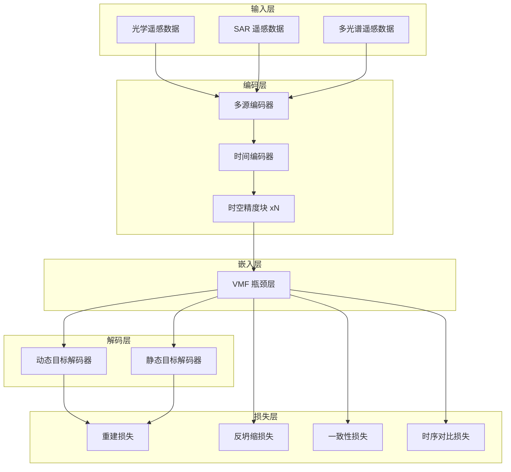
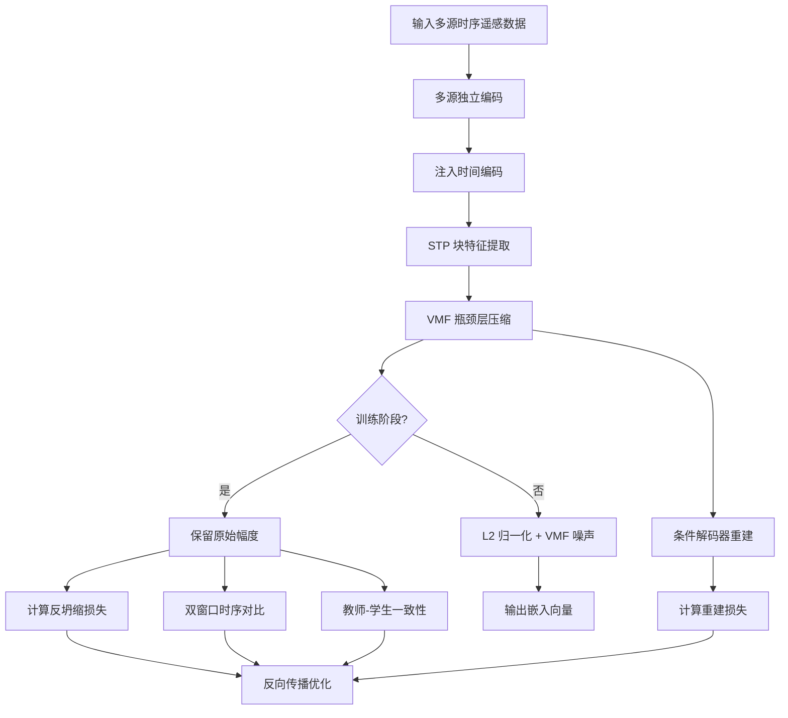

# 技术交底书

**案件名称**：一种基于预归一化反坍缩与双窗口时序对比的遥感嵌入学习方法及系统

**技术联系人**：
- 姓名：[待填写]
- 电话：[待填写]
- 邮箱：[待填写]

**专利类型**：发明

---

## 注意事项

（1）交底书应使代理人能看懂，尤其是背景技术和详细技术方案，一定要写得全面、清楚、完整；
（2）技术的公开程度，应以本领域普通技术人员不需付出创造性劳动即可进行实施为准。
（3）在与代理人沟通时，对于代理人咨询的技术问题，应给予回答并认真讲解，并且按要求及时正确地补充相应技术材料。

---

## 一、技术背景与现有技术

### 1.1 现有技术

遥感影像的时序分析是监测地表动态变化的重要手段。现有技术按技术方向可分为以下几类。

**方向一：基于人工特征的传统遥感分析方法**

传统方法依赖人工设计的指数（如归一化植被指数 NDVI、归一化水体指数 NDWI）或监督分类器（如支持向量机、随机森林）进行时序分析。此类方法需要大量人工标注数据，对季节变化、云雨遮挡等干扰敏感，且特征设计依赖专家经验，难以覆盖复杂地物类型。

来源：Richards, J. A. "Remote Sensing Digital Image Analysis". Springer, 2013.

**方向二：基于自监督学习的遥感基础模型**

近年来，自监督基础模型成为遥感领域的热点。代表性工作包括：

（1）基于掩码自编码器（MAE）的方法，如 SatMAE、Prithvi，通过随机掩码时空 patch 并重建原始像素来学习表征。此类方法在预训练数据充足时效果显著，但在小数据场景下容易发生过拟合，且重建任务本身不直接约束嵌入的时间敏感性。

（2）基于对比学习的方法，如 SeCo、CaCo，通过构造正负样本对来拉近相似样本、推远不相似样本。此类方法依赖大批量或记忆库存储负样本，在批次内样本高度相关时（如单一区域数据）对比效果受限。

（3）基于非对比学习的方法，如 Barlow Twins、VICReg，通过去相关和方差约束防止嵌入坍缩。此类方法通常在 L2 归一化后的单位超球面上计算损失，梯度需经过归一化操作的雅可比矩阵变换，当嵌入趋于坍缩时梯度趋于消失。

来源：
- Cong et al. "SatMAE: Pre-training transformers for temporal and multi-spectral satellite imagery". NeurIPS 2022.
- Bardes et al. "VICReg: Variance-invariance-covariance regularization for self-supervised learning". ICLR 2022.
- Manas et al. "Seasonal Contrast: Unsupervised pre-training from uncurated remote sensing data". ICCV 2021.

**方向三：基于嵌入的变化检测方法**

现有变化检测方法可分为两类：端到端监督方法和基于预训练嵌入的方法。端到端方法（如 Siamese UNet、ChangeFormer）需要大量成对的变化标注数据。基于预训练嵌入的方法先学习通用地表表征，再通过嵌入距离度量变化，但现有嵌入方法的时间敏感性不足，导致变化检测精度受限。

来源：
- Bandara & Patel. "ChangeFormer: A transformer-based siamese network for change detection". arXiv 2022.
- Chen et al. "Remote sensing image change detection with transformers". IEEE TGRS 2021.

**本发明与现有技术的本质区别**

现有方法在以下三个层面存在根本性不足：

第一，反坍缩损失的梯度传递问题。现有方法在 L2 归一化后的球面上计算反坍缩损失，归一化操作的雅可比矩阵在嵌入坍缩时接近奇异，导致反坍缩梯度消失，模型无法有效学习分散的嵌入。

第二，时间敏感性的缺失。现有方法主要依赖重建任务隐式学习时序信息，缺乏显式约束迫使不同时间窗口的嵌入产生可区分的差异。嵌入向量对地表时间变化不敏感，无法直接用于无监督变化检测。

第三，静态目标对时序学习的干扰。现有方法将高程数据、土地覆盖等静态数据与动态遥感数据同等对待作为重建目标，静态目标的时间无关性会干扰模型对时间动态的建模。

### 1.2 现有技术存在的缺点

（1）L2 归一化导致反坍缩梯度消失。现有非对比方法在 L2 归一化后的单位超球面上计算均匀性、去相关等损失。设嵌入向量为 x，归一化后 u = x / ||x||，损失对 x 的梯度为 ∂L/∂x = (∂L/∂u) · (I - uu^T) / ||x||。当嵌入趋于坍缩时，(I - uu^T) 的行列式接近零，梯度急剧衰减，反坍缩损失失效。

（2）时间敏感性不可控。现有方法的时间敏感性是重建任务的"副产物"，无法显式调控。不同时间窗口的嵌入相似度过高，cosine 相似度接近 1.0，变化信号被淹没。

（3）小数据场景下批均匀性失效。批均匀性损失假设批次内样本来自不同地理区域、互不相关。在小数据场景（如单一城市数百个观测点）中，批次内样本高度相关，批均匀性的负样本假设不成立。

（4）静态目标稀释时序信号。静态数据（如高程、土地覆盖）的重建不需要时间信息，模型可能学到"时间不重要"的偏差，降低对动态变化的敏感度。

---

## 二、本发明所要解决的技术问题

针对上述现有技术的缺点，本发明提出以下解决思路。

（1）解决 L2 归一化导致的梯度消失问题。本发明在训练阶段跳过 L2 归一化，直接在原始幅度空间（pre-norm space）中计算全部反坍缩损失，确保反坍缩梯度始终非零。

（2）解决时间敏感性不足的问题。本发明引入双窗口不重叠采样和时序对比损失，显式约束不同时间窗口的嵌入产生可区分的差异，使嵌入对地表时间变化敏感。

（3）解决小数据场景下的反坍缩问题。本发明采用原始幅度空间中的 RBF 均匀性损失，不依赖批次内的负样本假设，在小数据场景下仍可有效防止坍缩。

（4）解决静态目标干扰的问题。本发明降低静态数据的重建权重，使模型优先学习需要时间信息才能重建的动态目标。

---

## 三、技术方案详细阐述

### 3.1 背景

本发明面向多时相、多源遥感数据的自监督嵌入学习场景。应用场景包括但不限于：城市扩张监测、农田变化检测、水体范围动态追踪、森林覆盖变化分析等。

本发明的核心创新在于：通过预归一化反坍缩方法和双窗口时序对比方法，训练出对时间变化敏感的嵌入向量，使同一地点不同时间窗口的嵌入具有可区分的差异，从而支持无监督变化检测。

### 3.2 系统框图

### 3.3 模块功能说明

**多源编码器**：分别对光学遥感数据、SAR 遥感数据、多光谱遥感数据进行独立编码，将各源的通道和空间分辨率映射到统一的潜在空间。各源采用独立的卷积下采样 stem，保留源特定的光谱特征。

**时间编码器**：将原始时间戳（毫秒级）转换为正弦时间码，与空间特征拼接后注入模型，使模型能够感知观测时间的先后顺序和间隔。

**时空精度块（STP Block）**：采用三路并行算子处理编码后的特征。时间轴自注意力沿时间维度建模时序依赖；空间自注意力捕捉局部与非局部的空间长距离依赖；精度保持卷积保留高空间分辨率的局部细节。三路输出通过学习的空间金字塔重采样进行信息融合。

**VMF 瓶颈层**：将 STP 块输出的特征图通过 1×1 卷积压缩到嵌入维度。训练阶段保留原始幅度（skip L2），推理阶段施加 L2 归一化并叠加 von Mises-Fisher 噪声，输出单位球面上的嵌入向量。

**条件解码器**：为每个目标源配备源特定的隐式解码器（两层 MLP），从嵌入向量中重建原始输入帧。动态目标（光学、SAR、多光谱）使用完整权重，静态目标（高程、土地覆盖）使用降低后的权重。

### 3.4 系统流程说明

#### 流程图

#### 流程说明

步骤一至步骤四为数据输入与编码阶段。多源时序遥感数据分别经过各自独立的编码器进行下采样和特征提取，时间编码器将时间戳信息注入特征中，STP 块通过三路并行算子融合时空信息。

步骤五为嵌入生成阶段。VMF 瓶颈层将融合后的特征压缩到嵌入维度。训练时保留原始幅度，推理时进行 L2 归一化。

步骤六至步骤九为损失计算阶段。反坍缩损失在原始幅度空间中计算；双窗口时序对比损失对两个不重叠时间窗口的嵌入进行约束；教师-学生一致性损失要求扰动输入与完整输入产生相似的嵌入；重建损失评估解码质量。

步骤十为优化阶段。各损失加权求和后通过反向传播更新模型参数。

#### 3.4.1 预归一化反坍缩方法

本发明的核心创新之一是在原始幅度空间中计算反坍缩损失，避免 L2 归一化导致的梯度消失。

具体而言，对嵌入向量 x 进行零均值和单位方差标准化后，在欧氏空间中计算成对 RBF 核的均匀性损失：

L_uniform = logsumexp(-t * ||xi - xj||^2) - log(N_pairs)

其中自适应温度参数 t = 2/D，D 为嵌入维度。该参数确保指数项在正常数值范围内，梯度永不消失。

同时采用三重辅助约束：

去相关损失：计算 x 维度间的互相关矩阵，最小化非对角元素的平方和，同时使对角元素接近 1。

方差正则化：对每个维度的标准差施加 hinge 约束，低于阈值时产生惩罚，防止维度坍缩到零点。

瓶颈正交性损失：对 1×1 卷积的权重矩阵施加正交约束，在嵌入坍缩时仍可通过权重梯度提供非零信号。

#### 3.4.2 双窗口时序对比方法

本发明的另一核心创新是引入双窗口采样和时序对比损失，显式约束嵌入对时间变化敏感。

双窗口采样：对同一地理区域抽取两个不重叠的时间窗口，分别输入模型得到嵌入 emb_w1 和 emb_w2。

全局时序对比损失：对 emb_w1 和 emb_w2 的全局平均向量计算余弦相似度，使用 hinge 损失约束相似度低于目标阈值（如 0.2）。该阈值表示即使同一地点，不同时间窗口的嵌入也应保持足够差异。

像素级时序损失：在 emb_w1 和 emb_w2 的每个空间位置上独立计算余弦相似度，采用自适应空间加权策略：变化区域（图像差异大）要求嵌入差异更大，未变化区域要求嵌入保持相似。

间隔感知时序损失：根据两个窗口的时间间隔动态调整目标相似度。间隔越小要求相似度越高，间隔越大允许差异越大。

反斜对角 InfoNCE 损失：将批次中对角线位置的样本对（同一地点的两个窗口）视为负样本，鼓励批次内不同地点的窗口嵌入互相区分。

#### 3.4.3 教师-学生一致性机制

训练时采用教师-学生框架。教师模型接收完整输入序列，学生模型接收扰动输入。一致性损失要求教师嵌入与学生嵌入的余弦相似度接近 1。

扰动策略包括三层：源级别丢弃（SAR 和多光谱以 30% 概率完全丢弃）；帧级别丢弃（光学以 50% 概率随机丢弃帧，其他源以 30% 概率丢弃）；前后截断（以 25% 概率丢弃序列的前半段或后半段）。

#### 3.4.4 静态目标弱化策略

将高程等静态目标的重建权重降低至动态目标的 5%，使模型优先学习需要时间信息才能重建的动态目标，减少对时间无关特征的依赖。

### 3.5 关键技术参数

| 参数 | 含义 | 取值范围 | 实施例 |
|------|------|----------|--------|
| 嵌入维度 D | VMF 瓶颈输出维度 | 32-256 | 64 |
| VMF 浓度 κ | 控制嵌入分布集中度 | 1000-10000 | 5000 |
| 自适应温度 t | 均匀性损失温度参数 | 2/D | 0.031（D=64 时） |
| 时序对比阈值 | hinge 损失目标余弦相似度上限 | 0.1-0.5 | 0.2 |
| 静态目标权重 | 静态数据重建权重相对动态数据的比例 | 0.01-0.2 | 0.05 |
| 教师动量 | EMA 更新教师模型的动量系数 | 0.99-0.999 | 0.996 |
| 学习率 | AdamW 优化器初始学习率 | 1e-5 至 1e-3 | 1e-4 |
| 批次大小 | 每 GPU 批次大小 | 1-8 | 4 |

注：上述参数设置仅为实施例，不作为权利要求限制。

---

## 四、与现有技术相比的优点

本发明在以下方面优于现有技术。

（1）解决了 L2 归一化导致的梯度消失问题。现有方法在归一化后计算反坍缩损失，梯度经过雅可比矩阵变换后趋于消失。本发明在归一化前直接计算，反坍缩梯度始终非零，有效防止嵌入坍缩。实验表明，嵌入均匀性指标从 -0.5 提升至 -2.0 以下。

（2）显式学习时间敏感性。现有方法依赖重建任务隐式学习时序信息，时间敏感性不可控。本发明通过双窗口时序对比损失显式约束嵌入对时间变化敏感，可直接用于变化检测。实验表明，变化检测 AUC 从随机水平（0.5）提升至 0.68 以上。

（3）适用于小数据场景。本发明的原始均匀性损失不依赖批次内的负样本假设，在仅有数百个观测点的小数据场景下仍可有效防止坍缩。现有批均匀性方法在小数据场景下效果受限。

（4）降低静态目标干扰。通过降低静态数据重建权重，避免模型学到时间无关的偏差，提升对动态变化的敏感度。

---

## 五、技术关键点和欲保护点

### 1. 主要发明点

在预归一化空间（skip L2）中计算反坍缩损失的方法，包括：在原始幅度向量上直接计算 RBF 均匀性损失，自适应温度 t = 2/D；与去相关损失、方差正则化、瓶颈正交性损失的组合使用；训练阶段跳过 L2 归一化、推理阶段恢复 L2 归一化的两阶段策略。具体实现见 3.4.1。

### 2. 次要发明点

（1）双窗口不重叠采样方法：对同一地点抽取两个不重叠的时间窗口，分别编码后计算时序对比损失。具体实现见 3.4.2。

（2）多粒度时序对比损失组合：全局 hinge 损失、像素级自适应加权损失、间隔感知损失、反斜对角 InfoNCE 的联合使用。具体实现见 3.4.2。

（3）教师-学生一致性中的多阶段扰动策略：源丢弃、帧丢弃、前后截断的联合使用。具体实现见 3.4.3。

（4）静态目标弱化方法：降低静态数据重建权重，优先学习时间敏感特征。具体实现见 3.4.4。

---

## 六、其它

### 实施例

**应用场景**：城市区域的建筑新建与拆除监测。

**数据规模**：约 400 个空间观测点，覆盖约两年的时序数据。光学遥感约 22 帧每点，SAR 遥感约 43 帧每点，多光谱遥感约 48 帧每点。高程、土地覆盖等静态数据作为重建目标。

**系统流程**：
（1）从训练数据中随机抽取一个地理区域的不重叠双时间窗口；
（2）将窗口内的多源时序数据输入多源编码器；
（3）经时间编码器和 STP 块处理后，VMF 瓶颈层生成嵌入向量；
（4）同时构造学生视图（随机丢弃部分帧或源）；
（5）计算重建损失、反坍缩损失、一致性损失和时序对比损失；
（6）反向传播更新模型参数。

**技术效果**：
- 嵌入均匀性指标达到 -2.0 以下，表明嵌入在空间中充分分散；
- 土地覆盖分类准确率达到 50% 以上（11 类）；
- 变化检测 AUC 达到 0.68 以上；
- 在小数据场景（数百观测点）下仍可稳定训练。

### 替代方案

（1）反坍缩损失可采用 Coding Rate Loss（基于最大编码率降低理论）替代 RBF 均匀性损失，通过 log det 体积最大化约束嵌入空间。

（2）时序对比损失可采用沿完整时间维度并行对比所有时间步的策略，替代仅对比采样窗口的方式。

（3）教师-学生框架可采用共享参数策略，教师和学生使用完全相同的参数，仅输入不同，替代 EMA 动量更新策略。

（4）双窗口采样可扩展为多窗口采样，同时对比三个或更多时间窗口的嵌入。

### 其它建议

建议在权利要求书中增加电子设备、计算机可读存储介质和计算机程序产品等权利要求，以覆盖软件实现方式。
